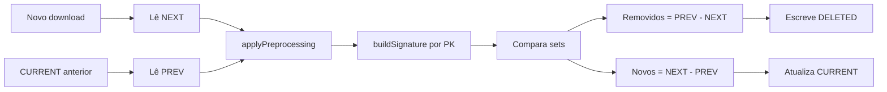

# Plano: Analisar e corrigir remoções indevidas no Diff

## Contexto do problema

- **Sintoma:** Log mostra `+41 novos, -150 removidos` (ex.: PE) com datas corretas no formulário e arquivo novo considerado correto (194 linhas).
- **Hipóteses:** (1) assinatura (PK) diferente entre CURRENT antigo e novo download (formato número vs texto, datas); (2) regras de filtro globais aplicadas ao tipo VENDA (ex.: regra "Data Proc" vazia pensada para PEDIDO); (3) falta de visibilidade para saber por que as linhas caem em "removidas".
- **Problema de lógica (raiz):** O sistema baixa dados do mês atual (FEV). Por que então ele "deleta" vendas de JAN? Porque está comparando o novo download (só FEV) com o CURRENT anterior (PREV). Se o PREV tiver sido gerado em um run que continha JAN (ou JAN+FEV), as linhas que estão em PREV e não estão em NEXT são em grande parte de JAN — e o sistema as trata como "removidas" e envia para DELETED. Ou seja: o sistema **espera achar vendas de JAN no download atual do mês FEV**. A lógica correta é: **só considerar "removidas" (e enviar para DELETED) as linhas que pertencem ao período atual** (ex.: DataE dentro de FEV). Linhas em PREV cuja data está **fora** do período atual (ex.: JAN quando o run é FEV2026) não devem ser contadas como removidas nem ir para DELETED — são simplesmente "fora do escopo" deste export.

**Verificação: PREV é sempre do mesmo período (não mistura JAN com FEV).**  
Quando você importa JAN 2026 e depois muda o mês para FEV 2026, o sistema **não** vai procurar o PREV de JAN 2026 ao rodar FEV. O PREV é sempre resolvido pela **mesma identidade** (tipo + period + uf) da execução atual: [FileNamingPolicy](app/policy/snapshot/FileNamingPolicy.ts) usa `identity.period` e `identity.uf` em `resolveSnapshotFiles`. Assim, ao rodar FEV2026, o diff lê apenas `VENDA_CURRENT_FEV2026_UF.xlsx` (ou cria PREV vazio se não existir); nunca lê `VENDA_CURRENT_JAN2026_UF.xlsx`. Ou seja: importar JAN e depois mudar para FEV é seguro — na primeira execução de FEV o PREV estará vazio; nas seguintes, o PREV será o CURRENT de FEV da run anterior. O plano deve **confirmar isso no código** (já está correto) e documentar no plano para não haver dúvida.

Fluxo atual do diff (resumo):

---

## 1. Diagnóstico (logs e amostras)

**Objetivo:** Permitir ver no log e em arquivo por que linhas estão sendo marcadas como removidas.

- **Arquivo:** [app/core/diff/DiffEngine.ts](app/core/diff/DiffEngine.ts)
- **1.1 Log de contagens após pré-processamento**
  - Após aplicar `applyPreprocessing` em NEXT e PREV, logar:
    - `prevRows.length` e `nextRows.length` (já existe em parte; deixar explícito).
    - Ex.: `[DiffEngine] PREV após pré-processamento: N linhas; NEXT: M linhas.`
- **1.2 Log de amostra de assinaturas "removidas"**
  - Após calcular `removedSignatures`, logar em nível DEBUG (ou INFO) até 3–5 assinaturas que estão em PREV e não em NEXT.
  - Opcional: logar uma linha completa (primeira ocorrência) para cada assinatura removida, para conferir PK (ID, PRODCOD, NNF, DataE, Referencia).
- **1.3 Arquivo de debug opcional**
  - Se variável de ambiente ou flag de config existir (ex.: `DEBUG_DIFF=1` ou opção em config), escrever na pasta de logs ou na pasta do site um arquivo (ex.: `diff_removed_<tipo>_<period>_<uf>.txt` ou `.json`) com:
    - Lista de assinaturas removidas (e.g. primeiras 50),
    - Uma linha de exemplo (objeto da linha) por assinatura removida.
  - Objetivo: você poder abrir o arquivo e comparar com o novo Excel para ver se é diferença de formato (ex.: "123" vs 123).

---

## 2. Regras de filtro por tipo (evitar PEDIDO em VENDA)

**Problema:** Em [data/schemaMaps.json](data/schemaMaps.json) as `filteringRules` estão na **raiz** (globais). O DiffEngine usa `schema.filteringRules || globalFilteringRules` para **todos** os tipos. Para VENDA, o schema não tem `filteringRules`, então entram as regras globais, que incluem:

- `field: "Data Proc", operator: "empty"` → exclui linha quando "Data Proc" está vazio.

Em planilhas VENDA costuma existir "DataE", não "Data Proc". Se a coluna "Data Proc" não existir, `row["Data Proc"]` é `undefined` → tratado como vazio → **todas** as linhas VENDA poderiam ser excluídas no pré-processamento (ou só PREV/NEXT ser afetado de forma assimétrica se o Excel tiver colunas diferentes entre runs).

**Correção:** Aplicar uma regra **somente se o campo existir na linha** (ou no schema do tipo). Assim, regras pensadas para PEDIDO (Data Proc, Doc, TOTAIS) não afetam VENDA.

- **Arquivo:** [app/core/diff/DiffEngine.ts](app/core/diff/DiffEngine.ts), método `applyPreprocessing`.
- **Alteração:** Para cada regra com `field !== '*'`:
  - Resolver `actualKey` e verificar se a linha tem a chave com valor presente (ex.: `row[actualKey] !== undefined` ou considerar também chave existente com valor vazio, conforme a regra).
  - Se a linha **não tem** o campo (ex.: VENDA sem "Data Proc"), **não aplicar** essa regra (não excluir por ela).
- **Regra `field === '*'`:** Manter como está (busca em qualquer célula).

Isso evita que regras de PEDIDO (Data Proc, Doc, TOTAIS, Total Geral) excluam linhas VENDA por falta de coluna "Data Proc".

---

## 3. Normalização da assinatura (PK) para evitar falsas remoções

**Problema:** Se no CURRENT antigo o ID veio como número (123) e no novo download como texto ("123"), ou se datas vêm em formatos diferentes (já há `normalizeDate` para campos com "data"/"dt"), a assinatura muda e a mesma linha lógica aparece como "removida" + "nova".

- **Arquivo:** [app/core/diff/DiffEngine.ts](app/core/diff/DiffEngine.ts), função interna `buildSignature`.
- **Alteração:** Para cada valor de PK ao montar a assinatura:
  - Além da normalização de data já existente para chaves cujo nome contém "data"/"dt":
    - Normalizar valores **numéricos**: se `String(value).trim()` for numericamente igual a um número (ex.: "123" ou 123), usar uma forma canônica (ex.: `String(Number(value))` ou manter string sem zeros à esquerda) para que 123 e "123" gerem a mesma assinatura.
  - Manter trim e delimitadores atuais (`|valor|`, `::`) para não quebrar compatibilidade.

Assim, diferenças de tipo número vs texto nas colunas de PK (ID, NNF, etc.) deixam de gerar falsas "removidas".

---

## 4. Remoções só dentro do período atual (não “deletar” JAN no download de FEV)

**Problema de lógica:** O sistema baixa dados do mês atual (FEV). O PREV (CURRENT anterior) pode conter linhas de outro período (ex.: JAN ou JAN+FEV). Ao comparar PREV com NEXT (só FEV), todas as linhas que estão em PREV e não em NEXT são marcadas como "removidas" e vão para DELETED — incluindo vendas de JAN, que **não pertencem** ao export de FEV. Ou seja: o sistema está procurando informações que não pertencem ao mês atual e tratando como "removidas" o que é apenas "fora do escopo" do download atual.

**Correção:** Só contar como **removidas** (e gravar em DELETED) as linhas de PREV que:

- não estão em NEXT, **e**
- **pertencem ao período atual** (ex.: coluna de data do relatório — DataE para VENDA — dentro do intervalo do período, ex.: 01/02/2026–28/02/2026 para FEV2026).

Linhas de PREV cuja data está **fora** do período atual (ex.: DataE em janeiro quando o run é FEV2026) **não** devem ser consideradas removidas nem enviadas para DELETED.

**Implementação:**

- **Arquivo:** [app/core/diff/DiffEngine.ts](app/core/diff/DiffEngine.ts).
- **Entrada:** O `run()` já recebe `identity` (tipo, period, uf). O período atual (ex.: FEV2026) precisa ser convertido em intervalo de datas (início e fim) para o mês/trimestre. Isso pode vir:
  - do próprio `identity.period` (ex.: "FEV2026" → 01/02/2026 a 28/02/2026; "1_TRIMESTRE_2026" → 01/01/2026 a 31/03/2026), ou
  - de parâmetros opcionais (ex.: `periodStart`, `periodEnd`) se o step-executor já tiver essas datas ao chamar o diff.
- **Schema:** Usar a coluna de data do tipo (ex.: `dashboardMapping.date` ou campo padrão para VENDA = "DataE") para decidir se uma linha está "dentro" do período.
- **Fluxo:** Após obter `removedSignatures` / `removedRowsWithContext`, filtrar: manter apenas as linhas cuja data (DataE ou equivalente) normalizada está entre `periodStart` e `periodEnd`. As demais (ex.: JAN no run FEV) não entram em `newlyDeletedFiltered` e não são contadas em `removed`.
- **Efeito:** No run de FEV, vendas de JAN que ainda estiverem em PREV deixam de ser marcadas como removidas e não vão para DELETED; só vendas com data em FEV que sumiram do export serão consideradas removidas.

**Arquivos / pontos extras:**

- [app/core/diff/DiffEngine.ts](app/core/diff/DiffEngine.ts): função helper para converter `identity.period` (ex.: "FEV2026", "1_TRIMESTRE_2026") em `{ start, end }`; uso da coluna de data do schema; filtro de `removedRowsWithContext` por período antes de acumular em DELETED e antes de contar `removed`.
- Se as datas exatas do período não estiverem no DiffEngine (só o token tipo "FEV2026"), inferir início/fim do mês ou do trimestre a partir de `period` + ano atual.

---

## 5. Ordem de implementação sugerida

1. **Fase 1 – Diagnóstico:** implementar 1.1 e 1.2 (logs de contagem e amostra de assinaturas removidas). Rodar uma execução e verificar no [log de automação](c:\Users\Robson-PC\AppData\Roaming\Automatizador Bravo\logs\automation-2026-02-27.log) se:
  - PREV e NEXT têm contagens coerentes após pré-processamento.
  - As assinaturas removidas batem com linhas que realmente sumiram ou se parecem as mesmas com formato diferente.
2. **Fase 2 – Remoções só no período atual (item 4):** implementar filtro por período (só considerar removidas linhas cuja data está dentro do período do run). Prioridade alta: corrige o problema de “deletar JAN” no download de FEV.
3. **Fase 3 – Correção de filtro:** implementar a aplicação de regras apenas quando o campo existe na linha (item 2). Isso evita que VENDA seja filtrado por regras de PEDIDO.
4. **Fase 4 – Assinatura:** implementar normalização numérica na `buildSignature` (item 3). Reexecutar e conferir se "-150 removidos" diminui quando for caso de formato.
5. **Fase 5 (opcional):** Implementar 1.3 (arquivo de debug com amostra de removidas) se ainda for necessário analisar casos específicos em arquivo.

---

## 6. Arquivos envolvidos

| Arquivo                                                    | Alterações                                                                                                                                                                                                                                                            |
| ---------------------------------------------------------- | --------------------------------------------------------------------------------------------------------------------------------------------------------------------------------------------------------------------------------------------------------------------- |
| [app/core/diff/DiffEngine.ts](app/core/diff/DiffEngine.ts) | Logs PREV/NEXT; amostra de assinaturas removidas; **filtrar “removidas” por período (só linhas com data no período atual)**; regras de filtro só quando o campo existe na linha; normalização numérica em `buildSignature`; opcional: arquivo de debug com removidas. |
| [data/schemaMaps.json](data/schemaMaps.json)               | Opcional: mover regras de PEDIDO para dentro de `PEDIDO`. Não obrigatório se a correção no DiffEngine (campo existir na linha) for feita.                                                                                                                             |

---

## 7. Como validar após as mudanças

- **PREV do mesmo período:** Ao rodar FEV2026, confirmar no log que o arquivo lido como CURRENT anterior é apenas `VENDA_CURRENT_FEV2026_UF.xlsx` (ou inexistente). Nunca deve ser usado `VENDA_CURRENT_JAN2026_*.xlsx` quando a execução é de FEV. (Comportamento já garantido por [FileNamingPolicy](app/policy/snapshot/FileNamingPolicy.ts) + `identity` no `run()`.)
- Rodar o preset para o mesmo site/UF que hoje dá "+41 / -150".
- Verificar no log:
  - Contagens PREV e NEXT após pré-processamento.
  - Amostra de assinaturas removidas (e, se implementado, arquivo de debug).
- Se as correções estiverem certas:
  - No run de FEV, vendas de JAN que estiverem em PREV não devem ser contadas como removidas nem enviadas para DELETED (correção do item 4).
  - Menos (ou zero) "removidas" quando o conteúdo do novo arquivo for o mesmo que o anterior, com eventual diferença só de formato (número vs texto, data).
  - Se ainda houver muitas removidas, a amostra no log/arquivo permite ver se são mesmas linhas com PK diferente ou linhas que de fato não vêm mais no export.

Prioridade recomendada: implementar o filtro por período (item 4) logo após o diagnóstico, pois corrige diretamente o problema de "deletar JAN" no download de FEV.