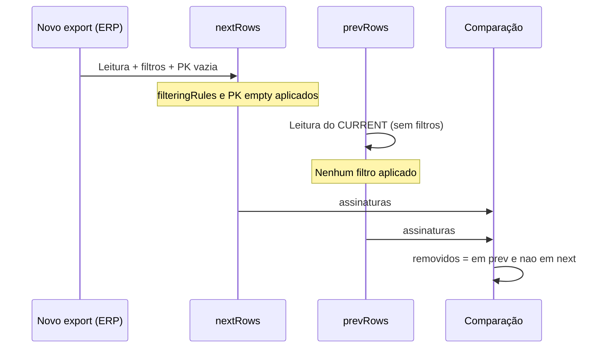

# Plano: Correção de vendas/pedidos marcados como deletados indevidamente

## Diagnóstico

O relatório de auditoria mostra "+0 / -7" ou "+0 / -15" (remoções) mesmo quando o site que exporta os dados **não** apagou essas vendas/pedidos. Ou seja, o sistema está tratando como "removidas" linhas que continuam existindo na origem.

Fluxo atual do [DiffEngine](app/core/diff/DiffEngine.ts):

**Causa raiz:** Só o **novo** export (NEXT) passa por:

1. **Regras de filtragem** (`filteringRules`) – linhas de totalizador, "TOTAL GERAL", etc. são excluídas de `nextRows`.
2. **Filtro de PK vazia** – linhas onde todas as chaves primárias estão vazias são removidas de `nextRows`.

O snapshot **anterior** (PREV), lido do arquivo CURRENT, **não** passa por nenhum desses filtros. Assim:

- Se o CURRENT antigo contiver linhas de totalizador ou linhas com PK vazia, elas continuam em `prevRows`.
- Essas linhas não existem em `nextRows` (porque foram filtradas).
- O diff interpreta isso como "removidas" e incrementa o contador de exclusões e o arquivo DELETED.

Ou seja: estamos comparando **nextRows já filtrado** com **prevRows bruto**, o que gera falsas "remoções".

Além disso:

- **SnapshotGate** ([SnapshotGate.ts](app/policy/snapshot/SnapshotGate.ts)): `validateSnapshotIdentity` existe mas **não é chamado** no `DiffEngine.run()`. Assim não há garantia de que o CURRENT lido seja do mesmo período/tipo/UF do run atual (redundante com o path, mas importante para consistência e logs).
- **filteringRules no JSON**: Em [data/schemaMaps.json](data/schemaMaps.json) as `filteringRules` estão no **nível raiz** do JSON, não dentro de `VENDA` ou `PEDIDO`. O código usa `(schema as any).filteringRules` onde `schema = getSchema(identity.tipo)` (objeto do tipo). Com isso, hoje as regras globais **não** são aplicadas ao NEXT. Se no futuro forem aplicadas (ex.: mesclando regras globais no schema), o mesmo problema ocorreria no PREV se não for tratado.

## Objetivo

- Fazer com que **prevRows** seja submetido ao **mesmo** pré-processamento que **nextRows** antes de montar assinaturas e comparar, eliminando falsas "remoções" por totalizadores ou linhas sem PK.
- Reaproveitar a lógica existente (evitar duplicar regras) e, se desejável, chamar `validateSnapshotIdentity` antes do diff.

## Alterações propostas

### 1. Aplicar ao PREV o mesmo pré-processamento do NEXT (DiffEngine)

**Arquivo:** [app/core/diff/DiffEngine.ts](app/core/diff/DiffEngine.ts)

- **Extrair** o bloco que hoje processa `nextRows` (filteringRules + filtro de PK vazia) para uma função interna reutilizável, por exemplo:  
`private applyPreprocessing(rows: any[], schema, primaryKeys: string[]): any[]`  
que recebe as linhas, o schema (para `filteringRules`) e as `primaryKeys`, e devolve as linhas já filtradas (mesma lógica atual aplicada a `nextRows`).
- **Manter** em `nextRows` o fluxo atual, mas passando a usar essa função:  
`nextRows = this.applyPreprocessing(nextRows, schema, primaryKeys)` (após a leitura do novo export).
- **Após** ler `prevRows` do arquivo CURRENT (como hoje), chamar o **mesmo** pré-processamento:  
`prevRows = this.applyPreprocessing(prevRows, schema, primaryKeys)`  
antes de calcular `prevSignatures` / `prevSet` e fazer o diff.

Assim, só entram na comparação linhas “válidas” nos dois lados, e totalizadores / linhas sem PK deixam de ser contados como removidos.

### 2. (Opcional) Validar identidade do snapshot antes do diff

**Arquivo:** [app/core/diff/DiffEngine.ts](app/core/diff/DiffEngine.ts)

- Se existir `files.meta`, ler o META do snapshot anterior (como já é feito para log de período).
- Chamar `validateSnapshotIdentity(prevMeta, identity)` antes de prosseguir com a comparação.  
Se o período/tipo/UF não bater, o SnapshotGate já lança erro e aborta, evitando comparação entre contextos diferentes e deixando o comportamento documentado no código.

### 3. (Opcional) Regras globais de filtro no schema

**Arquivo:** [app/core/diff/DiffEngine.ts](app/core/diff/DiffEngine.ts) e/ou [app/policy/snapshot/SafeSnapshotPolicy.ts](app/policy/snapshot/SafeSnapshotPolicy.ts)

- Em [data/schemaMaps.json](data/schemaMaps.json), `filteringRules` está na raiz; `getSchema(tipo)` devolve só o objeto do tipo (ex.: VENDA/PEDIDO), então hoje essas regras não são usadas.
- Se quiser que as regras globais passem a valer para NEXT (e para PREV, via `applyPreprocessing`), é preciso que o DiffEngine receba as regras globais (ex.: no construtor do DiffEngine, ao carregar o JSON, guardar `rawSchemas.filteringRules` e, em `applyPreprocessing`, usar `schema.filteringRules || globalFilteringRules`).  
Isso pode ser feito em um segundo passo; o essencial para parar as deleções indevidas é o item 1.

## Ordem sugerida

1. Implementar `applyPreprocessing` e usá-la em **nextRows** e em **prevRows** (correção principal).
2. Chamar `validateSnapshotIdentity` no início do diff quando houver META (reforço de consistência).
3. Se desejado, unificar uso de `filteringRules` globais do JSON para que NEXT e PREV usem as mesmas regras.

Com isso, o sistema deixa de marcar como "removidas" vendas/pedidos que na verdade são apenas linhas de totalizador ou linhas sem PK, que já são filtradas no novo export e agora também são tratadas de forma equivalente no snapshot anterior.