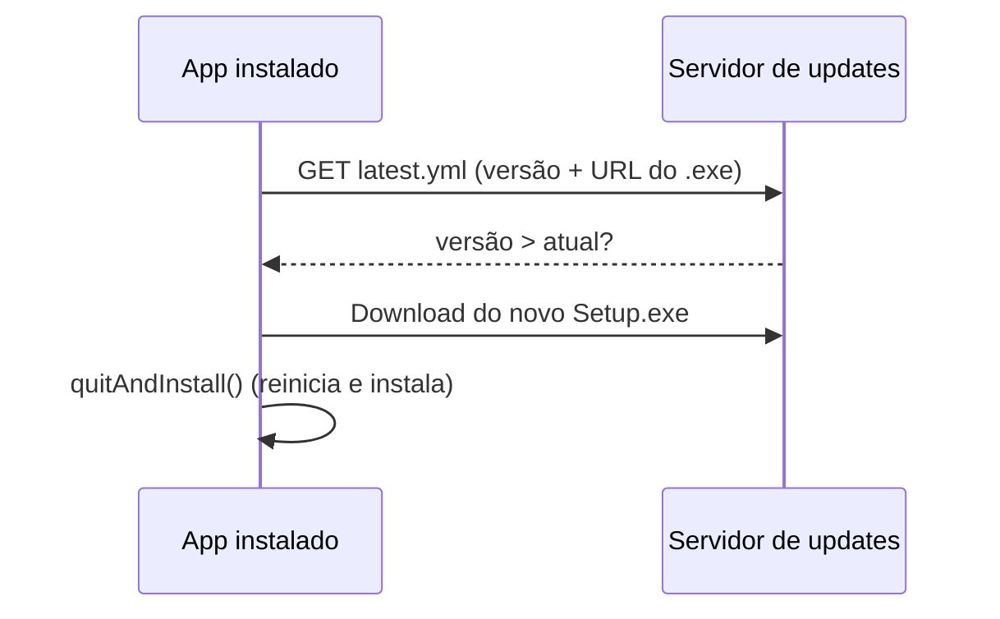

# Sistema de atualização do app instalado (sem reinstalar)

## Objetivo

Permitir que o **Automatizador Bravo** instalado na máquina seja atualizado para uma nova versão baixando e instalando o novo instalador em background, sem o usuário precisar desinstalar e reinstalar manualmente.

## Viabilidade

Sim, é possível. O projeto já usa **electron-builder** com alvo **NSIS** no Windows, que é o alvo suportado pelo **electron-updater**. Basta adicionar o pacote, configurar onde os instaladores serão publicados e chamar a API de update no processo principal.

## Arquitetura resumida

- O **electron-builder** gera, além do `Automatizador Bravo Setup X.Y.Z.exe`, um arquivo **latest.yml** (e opcionalmente **latest-full.yml**) com a versão e a URL do instalador.
- O **electron-updater** no app instalado consulta uma URL base (configurada em **publish**), lê o latest.yml e, se a versão for maior que a atual, baixa o novo .exe e oferece “Reiniciar para atualizar”.

## Alterações necessárias

### 1. Dependência e build (package.json)

- Adicionar dependência: **electron-updater** (compatível com electron 40 e electron-builder 26).
- Na seção **build**, adicionar **publish** conforme o destino escolhido:
  - **GitHub Releases:**  
  `"publish": { "provider": "github", "owner": "SEU_ORG", "repo": "automatizador-bravo", "private": true }`  
  (exige variável de ambiente `GH_TOKEN` na hora do `npm run dist` para publicar no GitHub.)
  - **Servidor genérico (HTTPS):**  
  `"publish": { "provider": "generic", "url": "https://sua-empresa.com.br/updates/automatizador-bravo" }`  
  Após cada `npm run dist`, você copiaria manualmente (ou via script) o conteúdo de `release/` (os .exe e os .yml) para essa URL.

O restante do build (NSIS, win x64, etc.) permanece como em [package.json](package.json).

### 2. Processo principal – inicializar e escutar o autoUpdater

**Arquivo:** [app/electron/main.ts](app/electron/main.ts)

- Importar `autoUpdater` de **electron-updater** (não o de `electron`).
- Definir **logger** para o autoUpdater (ex.: `autoUpdater.logger = logger`), para que erros e avisos apareçam nos seus logs.
- Em **app.whenReady()** (ou após criar a janela), apenas **não** chamar `checkForUpdates()` automaticamente no início, para evitar checagem em toda abertura; em vez disso, expor um IPC para “Verificar atualizações” (ver item 4).
- Opcional: chamar `autoUpdater.checkForUpdates()` uma vez após 5–10 segundos do ready, para checagem em background sem travar a abertura do app.
- Registrar listeners:
  - **update-available:** notificar o renderer (IPC) para mostrar “Nova versão X.Y.Z disponível. Baixando…”
  - **update-downloaded:** notificar o renderer para mostrar “Atualização pronta. Reiniciar agora?” e guardar que há update pronto.
  - **error:** logar e, se desejado, enviar mensagem ao renderer (ex.: “Falha ao verificar atualização”).
- Handler IPC **quit-and-install:** quando o usuário confirmar, chamar `autoUpdater.quitAndInstall(false, true)` (ou conforme documentação do electron-updater) para fechar o app e executar o instalador baixado.

Nada disso altera o fluxo atual de abertura da janela ou da bandeja; apenas adiciona a lógica de update e um novo IPC.

### 3. Preload e renderer – expor e usar o update

- **Preload:** expor no `electronAPI` algo como:  
`checkForUpdates: () => ipcRenderer.invoke('check-for-updates')`,  
`onUpdateAvailable: (cb) => ipcRenderer.on('update-available', (_, info) => cb(info))`,  
`onUpdateDownloaded: (cb) => ipcRenderer.on('update-downloaded', (_, info) => cb(info))`,  
`quitAndInstall: () => ipcRenderer.invoke('quit-and-install')`.
- **Renderer (menu ou tela de configurações):**  
  - Botão ou item de menu “Verificar atualizações” que chama `checkForUpdates()`.  
  - Quando chegar `update-available`, mostrar mensagem (ex.: notificação ou pequeno aviso) “Nova versão disponível. Baixando…”  
  - Quando chegar `update-downloaded`, mostrar diálogo: “Atualização baixada. Reiniciar o aplicativo para instalar?” com botões “Reiniciar agora” (chama `quitAndInstall()`) e “Depois”.  
  - Opcional: exibir a versão atual (lida do app ou do package) na interface.

Assim o usuário **não precisa reinstalar**: ele só clica em “Verificar atualizações” (ou recebe o aviso automático) e, quando a atualização for baixada, em “Reiniciar agora”.

### 4. Publicação dos builds (seu fluxo de release)

- **Se usar GitHub Releases:** após `npm run dist`, usar `electron-builder --publish always` (ou script que chame isso) para fazer upload do instalador e do latest.yml no release da tag correspondente (ex.: `v1.0.2`). O app instalado apontará para esse repositório para obter o latest.yml e o .exe.
- **Se usar servidor genérico:** após `npm run dist`, copiar para a pasta servida por HTTPS:
  - `Automatizador Bravo Setup X.Y.Z.exe`
  - `latest.yml` (e, se gerado, `latest-full.yml`)
  A URL base em **publish** deve ser a pasta onde esses arquivos estão (ex.: `https://sua-empresa.com.br/updates/automatizador-bravo/`).

Importante: a **versão** no [package.json](package.json) (`version`) deve ser incrementada a cada release (ex.: 1.0.1 → 1.0.2); o electron-updater compara semanticamente para decidir se há atualização.

### 5. Comportamento em desenvolvimento

- Em modo dev (`electron .` ou `npm run dev`), o app normalmente **não** está “packaged”, então o autoUpdater costuma não tentar atualizar (ou pode falhar de forma controlada). Garantir que as chamadas ao autoUpdater só façam efeito quando `app.isPackaged === true`, ou que erros sejam tratados sem quebrar o app.

## Ordem sugerida de implementação

1. Adicionar **electron-updater** e **publish** no package.json (escolher GitHub ou generic; para generic, usar uma URL placeholder e documentar onde subir os arquivos).
2. No **main.ts**: importar autoUpdater, configurar logger, registrar eventos e handlers IPC (`check-for-updates`, `quit-and-install`, e eventos para o renderer).
3. No **preload**: expor os métodos e eventos de update.
4. No **renderer**: botão “Verificar atualizações”, listeners para available/downloaded e diálogo “Reiniciar agora” chamando quitAndInstall.
5. Documentar no projeto (ex.: [docs/COMO_GERAR_INSTALAVEL.md](docs/COMO_GERAR_INSTALAVEL.md)) o fluxo de publicação (onde colocar os arquivos ou como publicar no GitHub) e que o usuário final pode atualizar sem reinstalar.

## Resumo

Com isso, o sistema instalado na máquina **pode ser atualizado sem reinstalar**: o usuário (ou um check em background) verifica atualizações, o app baixa o novo instalador e, ao reiniciar, o instalador NSIS atualiza a instalação existente. Não é necessário desinstalar antes.