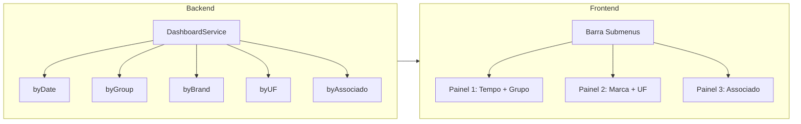

# Submenus para gráficos no Painel de Resultados

## Objetivo

Inserir uma barra de submenus **abaixo dos cards de KPI**, com nomes claros, e exibir em cada submenu os gráficos correspondentes:

- **Submenu 1:** Evolução de Volume (Tempo) + Volume por Grupo
- **Submenu 2:** Volume por Marca + Volume por UF
- **Submenu 3:** Volume por Associado

## 1. Backend – Novos agrupamentos no Dashboard

**Arquivo:** [app/core/consolidation/DashboardService.ts](app/core/consolidation/DashboardService.ts)

- **Interface `DashboardData.charts`:** Incluir três novas séries no mesmo formato de `byGroup`:
  - `byBrand: { label: string; value: number }[]`
  - `byUF: { label: string; value: number }[]`
  - `byAssociado: { label: string; value: number }[]`
- **Em `processData`:** Na inicialização, criar `brandMap`, `ufMap` e `associadoMap` (como já existe `groupMap` e `categoryMap`). No mesmo `data.forEach` onde se preenchem `dateMap`, `groupMap` e `categoryMap` (bloco “Acumula para o mês atual” ~linhas 354–367), acumular também:
  - **Marca:** valor já lido em `bVal` (Marca) → `brandMap`
  - **UF:** `findValue(row, 'UF') || findValue(row, 'ORIGEM_UF')` → `ufMap`
  - **Associado:** `findValue(row, 'Associado')` → `associadoMap`
- **Após o loop:** Preencher `stats.charts.byBrand`, `byUF` e `byAssociado` a partir dos mapas, ordenando por valor decrescente (e opcionalmente limitando a top N, ex.: 20), de forma análoga a `byGroup` e `byCategory`.

Se a planilha não tiver coluna "UF" ou "Associado", os gráficos correspondentes ficarão vazios; não é obrigatório alterar schema/preset.

---

## 2. Frontend – HTML: Submenus e painéis de gráficos

**Arquivo:** [app/renderer/index.html](app/renderer/index.html)

- **Posição:** Imediatamente **abaixo** da `div` que contém os cinco cards de KPI (antes do atual `.dashboard-grid`).
- **Barra de submenus:** Uma linha com três botões/abas nomeados, por exemplo:
  - **“Tempo e Grupo”** (Submenu 1)
  - **“Marca e UF”** (Submenu 2)
  - **“Por Associado”** (Submenu 3)
- **Três painéis de gráficos:** Substituir o bloco único `.dashboard-grid` por três blocos (um por submenu), com apenas um visível por vez:
  - **Painel 1:** Dois cards: “Evolução de Volume (Tempo)” (`canvas#chartDate`) e “Volume por Grupo” (`canvas#chartGroup`) — reutilizar títulos e estrutura atuais.
  - **Painel 2:** Dois cards: “Volume por Marca” (`canvas#chartBrand`) e “Volume por UF” (`canvas#chartUF`).
  - **Painel 3:** Um card: “Volume por Associado” (`canvas#chartAssociado`).
- **Controle de visibilidade:** Cada painel em um container com classe/atributo que permita mostrar/ocultar via JS (ex.: `data-chart-submenu="1"`, `"2"`, `"3"` e classe `.active` ou `display` no container ativo).

---

## 3. Frontend – CSS

**Arquivo:** [app/renderer/style.css](app/renderer/style.css)

- Estilos para a **barra de submenus**: alinhamento, destaque da aba ativa, e consistência visual com o restante do painel (ex.: mesma família de cores do header/dashboard).
- Garantir que os **painéis de gráficos** usem o mesmo grid/layout já usado (ex.: `.dashboard-grid`, `.chart-card`) para manter o aspecto atual nos dois primeiros submenus.

---

## 4. Frontend – JS: Lógica de submenus e renderização

**Arquivo:** [app/renderer/modules/dashboard.js](app/renderer/modules/dashboard.js)

- **Estado:** Manter índice do submenu ativo (1, 2 ou 3). Ao clicar em cada submenu, atualizar esse estado, aplicar classe/visibilidade ao painel correspondente e remover destaque dos outros.
- `**renderCharts`:** Passar a receber os novos dados `chartsData.byBrand`, `byUF`, `byAssociado` e:
  - Renderizar **sempre** os seis gráficos quando houver dados (chartDate, chartGroup, chartCategory, chartBrand, chartUF, chartAssociado), ou
  - Renderizar apenas os gráficos do **submenu ativo** (ao trocar de submenu, destruir instâncias do painel anterior e criar as do painel atual para evitar múltiplos Chart.js desnecessários).
- **Objeto `charts`:** Estender para guardar referências dos novos gráficos (ex.: `charts.brand`, `charts.uf`, `charts.associado`) e destruí-los em `showEmptyState` junto com os já existentes.
- **Títulos:** Manter “Evolução de Volume (Tempo)” e “Volume por Grupo” no Submenu 1; usar “Volume por Marca”, “Volume por UF” e “Volume por Associado” nos novos cards.

---

## Fluxo resumido

---

## Ordem sugerida de implementação

1. Backend: interface + mapas + preenchimento de `byBrand`, `byUF`, `byAssociado`.
2. HTML: barra de submenus + três painéis com os canvas (incluindo `chartBrand`, `chartUF`, `chartAssociado`).
3. CSS: estilos da barra e visibilidade dos painéis.
4. JS: troca de submenu, extensão de `renderCharts` e do objeto `charts`, e limpeza em `showEmptyState`.

