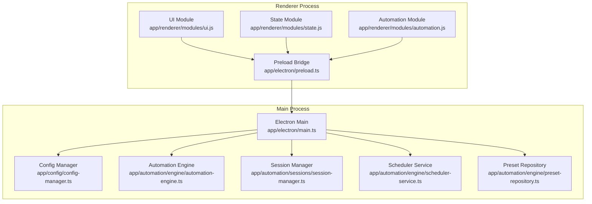
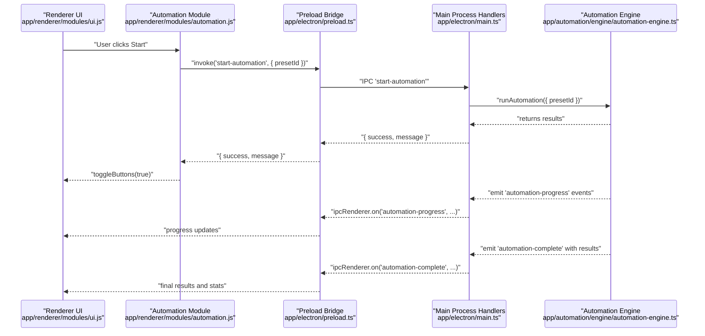
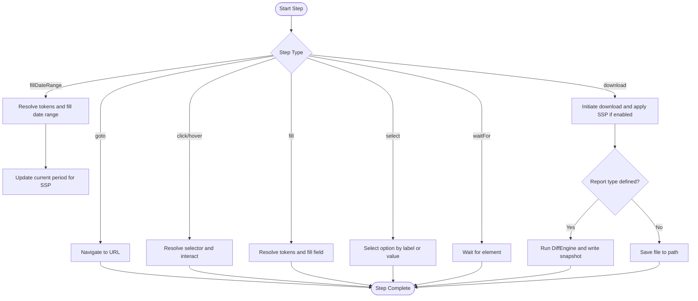
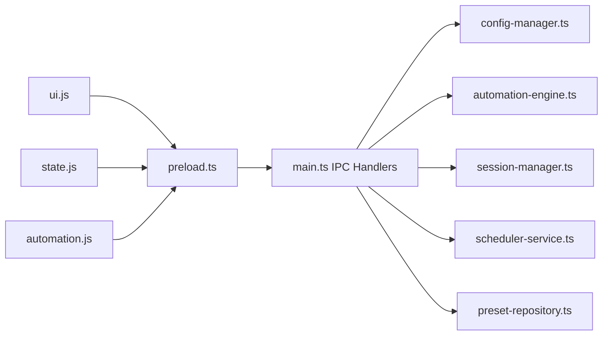

# API Reference

<cite>
**Referenced Files in This Document**
- [main.ts](file://app/electron/main.ts)
- [preload.ts](file://app/electron/preload.ts)
- [config-manager.ts](file://app/config/config-manager.ts)
- [app-config.json](file://app/config/app-config.json)
- [automation-engine.ts](file://app/automation/engine/automation-engine.ts)
- [step-executor.ts](file://app/automation/engine/step-executor.ts)
- [session-manager.ts](file://app/automation/sessions/session-manager.ts)
- [scheduler-service.ts](file://app/automation/engine/scheduler-service.ts)
- [preset-repository.ts](file://app/automation/engine/preset-repository.ts)
- [automation.js](file://app/renderer/modules/automation.js)
- [ui.js](file://app/renderer/modules/ui.js)
- [state.js](file://app/renderer/modules/state.js)
- [SchemaMap.ts](file://app/config/SchemaMap.ts)
- [schemaMaps.json](file://data/schemaMaps.json)
- [package.json](file://package.json)
</cite>

## Table of Contents
1. [Introduction](#introduction)
2. [Project Structure](#project-structure)
3. [Core Components](#core-components)
4. [Architecture Overview](#architecture-overview)
5. [Detailed Component Analysis](#detailed-component-analysis)
6. [Dependency Analysis](#dependency-analysis)
7. [Performance Considerations](#performance-considerations)
8. [Troubleshooting Guide](#troubleshooting-guide)
9. [Conclusion](#conclusion)
10. [Appendices](#appendices)

## Introduction
This document describes the public interfaces exposed by the Automatizador Bravo desktop application for IPC communication between the Electron main process and the renderer process. It covers:
- IPC handler specifications for configuration, presets, sessions, automation lifecycle, and scheduling
- Configuration schema reference for application-wide and per-site settings
- Step execution API for workflow automation
- Extension points and integration patterns
- Authentication methods, rate limiting, and versioning considerations

The goal is to enable developers and integrators to programmatically control the application’s automation capabilities, manage configurations, and extend functionality safely.

## Project Structure
The application follows an Electron architecture with a main process (Node.js) and a renderer process (browser window). IPC handlers are registered in the main process and exposed to the renderer via a controlled bridge.

**Diagram sources**
- [main.ts](file://app/electron/main.ts#L117-L281)
- [preload.ts](file://app/electron/preload.ts#L5-L47)
- [config-manager.ts](file://app/config/config-manager.ts#L85-L398)
- [automation-engine.ts](file://app/automation/engine/automation-engine.ts#L50-L611)
- [session-manager.ts](file://app/automation/sessions/session-manager.ts#L67-L225)
- [scheduler-service.ts](file://app/automation/engine/scheduler-service.ts#L6-L145)
- [preset-repository.ts](file://app/automation/engine/preset-repository.ts#L4-L34)
- [ui.js](file://app/renderer/modules/ui.js#L5-L282)
- [state.js](file://app/renderer/modules/state.js#L3-L39)
- [automation.js](file://app/renderer/modules/automation.js#L6-L59)

**Section sources**
- [main.ts](file://app/electron/main.ts#L117-L281)
- [preload.ts](file://app/electron/preload.ts#L5-L47)

## Core Components
- IPC Handler Registry: Declares all main-to-renderer and renderer-to-main IPC channels and their semantics.
- Preload Bridge: Exposes a safe subset of IPC APIs to the renderer under window.electronAPI.
- Configuration Manager: Validates, loads, saves, and migrates configuration schemas for presets and sites.
- Automation Engine: Orchestrates browser sessions, executes steps, and emits progress and completion events.
- Session Manager: Manages persistent browser contexts per site profile.
- Scheduler Service: Periodically triggers automation runs based on preset schedules.
- Renderer Modules: UI, state, and automation modules consume the preload bridge to drive actions.

**Section sources**
- [main.ts](file://app/electron/main.ts#L117-L281)
- [preload.ts](file://app/electron/preload.ts#L5-L47)
- [config-manager.ts](file://app/config/config-manager.ts#L85-L398)
- [automation-engine.ts](file://app/automation/engine/automation-engine.ts#L50-L611)
- [session-manager.ts](file://app/automation/sessions/session-manager.ts#L67-L225)
- [scheduler-service.ts](file://app/automation/engine/scheduler-service.ts#L6-L145)
- [automation.js](file://app/renderer/modules/automation.js#L6-L59)
- [ui.js](file://app/renderer/modules/ui.js#L5-L282)
- [state.js](file://app/renderer/modules/state.js#L3-L39)

## Architecture Overview
The IPC layer connects the renderer to the main process, enabling configuration management, preset CRUD, session control, and automation orchestration. The renderer invokes preload-exposed methods, which route to main-process handlers. The main process coordinates services and emits events back to the renderer.

**Diagram sources**
- [automation.js](file://app/renderer/modules/automation.js#L6-L59)
- [ui.js](file://app/renderer/modules/ui.js#L5-L282)
- [preload.ts](file://app/electron/preload.ts#L5-L47)
- [main.ts](file://app/electron/main.ts#L214-L232)
- [automation-engine.ts](file://app/automation/engine/automation-engine.ts#L548-L556)

## Detailed Component Analysis

### IPC Handler Specifications
Below are the main IPC channels and their behaviors. All handlers are registered in the main process and invoked from the renderer via preload.

- Configuration
  - Channel: get-config
    - Direction: renderer → main
    - Returns: AppConfig object
    - Notes: Returns a deep copy of current configuration
  - Channel: save-config
    - Direction: renderer → main
    - Params: AppConfig
    - Returns: { success: boolean }
    - Validation: Uses AppConfigSchema
  - Channel: export-config
    - Direction: renderer → main
    - Returns: { success: boolean, data: any }
    - Throws: Error message on failure
  - Channel: import-config
    - Direction: renderer → main
    - Params: { config: AppConfig }
    - Returns: { success: boolean, result: any }
    - Throws: Error message on failure

- Presets
  - Channel: get-presets
    - Direction: renderer → main
    - Returns: Preset[]
  - Channel: save-preset
    - Direction: renderer → main
    - Params: Preset
    - Returns: { success: boolean }
    - Behavior: Creates or updates based on presence of id
  - Channel: delete-preset
    - Direction: renderer → main
    - Params: { id: string }
    - Returns: { success: boolean }

- Sessions
  - Channel: get-session-status
    - Direction: renderer → main
    - Returns: Array of { siteId, siteName, uf, hasSession, path }
  - Channel: delete-session
    - Direction: renderer → main
    - Params: { siteId: string }
    - Returns: { success: boolean }
  - Channel: clear-sessions
    - Direction: renderer → main
    - Returns: { success: boolean }
  - Channel: open-browser-for-login
    - Direction: renderer → main
    - Params: { siteId: string }
    - Returns: { success: boolean }
    - Behavior: Opens a visible browser for manual login

- Automation Lifecycle
  - Channel: get-automation-status
    - Direction: renderer → main
    - Returns: "PARADA" (string)
  - Channel: start-automation
    - Direction: renderer → main
    - Params: { presetId: string }
    - Returns: { success: boolean, message: string }
    - Side effects: Starts automation; emits 'automation-progress' and 'automation-complete'
  - Channel: stop-automation
    - Direction: renderer → main
    - Returns: { success: boolean, message: string }

- Auto-launch
  - Channel: get-auto-launch-status
    - Direction: renderer → main
    - Returns: { enabled: boolean, available: boolean }
  - Channel: set-auto-launch
    - Direction: renderer → main
    - Params: { enabled: boolean }
    - Returns: { success: boolean, message: string }

- Events (renderer listeners)
  - onAutomationProgress(callback)
  - onAutomationComplete(callback)
  - onAutomationError(callback)
  - onSiteComplete(callback)
  - removeAllListeners(channel)

**Section sources**
- [main.ts](file://app/electron/main.ts#L117-L281)
- [preload.ts](file://app/electron/preload.ts#L5-L47)

### Configuration Schema Reference
The application validates configuration against Zod schemas. Keys and types are defined below.

- AppConfig
  - credentials: Record<string, string> (optional)
  - defaultTimeout: number (default: 30000)
  - defaultRetries: number (default: 3)
  - actionDelay: number (default: 1000)
  - headless: boolean (default: true)
  - schedulerEnabled: boolean (default: true)
  - googleDrivePath: string (optional)
  - presets: Preset[] (default: [])
  - notifications: {
      enabled: boolean (default: false)
      smtp: {
        host: string (default: "smtp.gmail.com")
        port: number (default: 465)
        secure: boolean (default: true)
        user: string (optional)
        pass: string (optional)
      } (optional)
      recipient: string (optional)
    } (default: { enabled: false })

- Preset
  - id: string (optional)
  - name: string (required)
  - sites: SiteConfig[] (default: [])
  - login: string (required)
  - password: string (required)
  - type: enum("vendas","pedidos","fiscal","outros") (default: "outros")
  - destination: string (optional)
  - createdAt: string (optional)
  - lastUsedAt: string (optional)
  - schedule: {
      enabled: boolean (default: false)
      mode: enum("interval","fixed") (default: "interval")
      intervalHours: number min 1 max 24 (default: 3)
      fixedTimes: string[] (default: [])
      nextRun: string (optional)
    } (optional)

- SiteConfig
  - id: string
  - name: string
  - url: string (URL)
  - loginUrl: string (URL)
  - usernameField: string
  - passwordField: string
  - loginButton: string
  - steps: Step[] (required)
  - downloadPath: string (optional)
  - renamePattern: string (optional)
  - reportType: string (optional)
  - primaryKeys: string[] (optional)
  - uf: string (default: "SC")
  - credentials: {
      username: string
      password: string
    } (optional)

- Step
  - type: enum("goto","click","hover","fill","fillDateRange","select","waitFor","download")
  - selector: string | string[] (required for applicable types)
  - value: string (optional)
  - timeout: number (optional)
  - retries: number (optional)
  - continueOnError: boolean (default: false)

- Example Preset (from app-config.json)
  - Includes multiple sites with steps for sales reporting
  - Destination and schedule configured per preset

- Schema Maps (data/schemaMaps.json)
  - Maps reportType to primary key definitions for diffing

**Section sources**
- [config-manager.ts](file://app/config/config-manager.ts#L58-L81)
- [app-config.json](file://app/config/app-config.json#L1-L800)
- [schemaMaps.json](file://data/schemaMaps.json#L1-L9)
- [SchemaMap.ts](file://app/config/SchemaMap.ts#L1-L13)

### Step Execution API
The engine executes a sequence of typed steps against a persistent browser context. Each step supports retries and timeouts.

Key behaviors:
- Step types and parameters are defined in the Step interface
- fillDateRange resolves dynamic tokens (e.g., [TRIM_ATUAL]) and sets date ranges
- download integrates with Safe Snapshot Policy (SSP) for auditing and change detection
- continueOnError allows a step to fail without aborting the entire workflow
- Progress events are emitted during execution

**Diagram sources**
- [step-executor.ts](file://app/automation/engine/step-executor.ts#L59-L110)
- [step-executor.ts](file://app/automation/engine/step-executor.ts#L212-L260)
- [step-executor.ts](file://app/automation/engine/step-executor.ts#L397-L511)

**Section sources**
- [step-executor.ts](file://app/automation/engine/step-executor.ts#L14-L23)
- [step-executor.ts](file://app/automation/engine/step-executor.ts#L59-L110)
- [step-executor.ts](file://app/automation/engine/step-executor.ts#L212-L260)
- [step-executor.ts](file://app/automation/engine/step-executor.ts#L397-L511)

### Extension Points and Integration Patterns
- Preset-driven isolation: Sites are grouped per preset, enabling modular configuration and scheduling.
- SSP (Safe Snapshot Policy): When reportType is set, downloads are processed through DiffEngine to track additions/removals and maintain audit trails.
- Event-driven UI: The main process emits progress and completion events consumed by the renderer to update dashboards and logs.
- Persistent sessions: SessionManager persists browser contexts per site, reducing repeated logins and maintaining state.

Practical integration patterns:
- Use get-presets and save-preset to manage automation blueprints
- Use get-session-status and delete-session/clear-sessions to troubleshoot authentication
- Subscribe to onAutomationProgress and onSiteComplete to build custom dashboards
- Use open-browser-for-login to assist manual authentication flows

**Section sources**
- [automation-engine.ts](file://app/automation/engine/automation-engine.ts#L548-L556)
- [session-manager.ts](file://app/automation/sessions/session-manager.ts#L103-L138)
- [ui.js](file://app/renderer/modules/ui.js#L104-L145)

### Authentication Methods
- Credential injection: Preset-level login/password are injected into SiteConfig during execution when reportType is present.
- Persistent sessions: SessionManager uses Chromium persistent contexts keyed by siteId, preserving cookies and authentication state.
- Manual login: open-browser-for-login opens a visible browser for manual login when needed.

Operational notes:
- If a session expires mid-run, the engine attempts reauthentication before continuing.
- For manual intervention, open-browser-for-login ensures a visible browser is available.

**Section sources**
- [automation-engine.ts](file://app/automation/engine/automation-engine.ts#L310-L375)
- [session-manager.ts](file://app/automation/sessions/session-manager.ts#L103-L138)
- [main.ts](file://app/electron/main.ts#L198-L200)

### Rate Limiting and Concurrency
- Global timeout: AutomationEngine enforces a two-hour cap to prevent resource leaks.
- Scheduler throttling: SchedulerService checks schedules every minute and avoids overlapping runs; if the engine is busy, it defers execution.
- Step-level retries: Steps support configurable retries and timeouts to handle transient failures.

Recommendations:
- Tune defaultTimeout and defaultRetries via AppConfig for stability vs. speed.
- Prefer fixed-time scheduling with schedulerEnabled to avoid frequent bursts.

**Section sources**
- [automation-engine.ts](file://app/automation/engine/automation-engine.ts#L72-L82)
- [scheduler-service.ts](file://app/automation/engine/scheduler-service.ts#L38-L96)

### Versioning Considerations
- Application version: 1.0.1 (package.json)
- Configuration versioning: Export/import includes a version field for future migrations
- Migration strategy: ConfigManager handles migration of legacy locations and structures

Guidelines:
- Always export before major updates
- Use import with warnings to merge safely
- Respect version fields when extending schemas

**Section sources**
- [package.json](file://package.json#L3-L4)
- [config-manager.ts](file://app/config/config-manager.ts#L334-L348)
- [config-manager.ts](file://app/config/config-manager.ts#L353-L394)

## Dependency Analysis
The main process depends on configuration, automation, session, and scheduler services. The renderer depends on preload for IPC and UI/state modules for rendering and state management.

**Diagram sources**
- [main.ts](file://app/electron/main.ts#L117-L281)
- [preload.ts](file://app/electron/preload.ts#L5-L47)
- [config-manager.ts](file://app/config/config-manager.ts#L85-L398)
- [automation-engine.ts](file://app/automation/engine/automation-engine.ts#L50-L611)
- [session-manager.ts](file://app/automation/sessions/session-manager.ts#L67-L225)
- [scheduler-service.ts](file://app/automation/engine/scheduler-service.ts#L6-L145)
- [preset-repository.ts](file://app/automation/engine/preset-repository.ts#L4-L34)
- [ui.js](file://app/renderer/modules/ui.js#L5-L282)
- [state.js](file://app/renderer/modules/state.js#L3-L39)
- [automation.js](file://app/renderer/modules/automation.js#L6-L59)

**Section sources**
- [main.ts](file://app/electron/main.ts#L117-L281)
- [preload.ts](file://app/electron/preload.ts#L5-L47)

## Performance Considerations
- Headless vs. visible mode: headless reduces resource usage; visible mode improves reliability for interactive tasks.
- Action delay: actionDelay adds small pauses between steps to stabilize UI interactions.
- Browser installation: SessionManager auto-installs Chromium into a dedicated path to avoid runtime overhead.
- Global timeout: Prevents long-lived automation loops from consuming resources.

[No sources needed since this section provides general guidance]

## Troubleshooting Guide
Common issues and resolutions:
- Session conflicts: Use delete-session or clear-sessions to remove stale profiles.
- Login failures: Use open-browser-for-login to manually authenticate; verify credentials in Preset.
- Exceeded global timeout: Review step count and timeouts; consider continueOnError for resilient workflows.
- Scheduler not triggering: Verify schedulerEnabled and preset schedule configuration.

**Section sources**
- [main.ts](file://app/electron/main.ts#L183-L196)
- [main.ts](file://app/electron/main.ts#L198-L200)
- [automation-engine.ts](file://app/automation/engine/automation-engine.ts#L72-L82)
- [scheduler-service.ts](file://app/automation/engine/scheduler-service.ts#L54-L57)

## Conclusion
The Automatizador Bravo exposes a robust IPC surface for configuration, presets, sessions, and automation control. Its Zod-based schema validation, persistent sessions, and event-driven UI enable reliable desktop automation. By leveraging presets, SSP, and scheduled runs, teams can automate complex ERP workflows while maintaining auditability and operational safety.

[No sources needed since this section summarizes without analyzing specific files]

## Appendices

### Endpoint Reference Summary
- Configuration
  - get-config: Returns AppConfig
  - save-config: Saves AppConfig
  - export-config: Returns serialized config
  - import-config: Imports serialized config
- Presets
  - get-presets: Returns Preset[]
  - save-preset: Upserts Preset
  - delete-preset: Deletes Preset by id
- Sessions
  - get-session-status: Returns per-site session info
  - delete-session: Removes a site profile
  - clear-sessions: Removes all profiles
  - open-browser-for-login: Opens visible browser for login
- Automation
  - get-automation-status: Returns "PARADA"
  - start-automation: Starts automation for preset
  - stop-automation: Stops automation
- Auto-launch
  - get-auto-launch-status: Returns { enabled, available }
  - set-auto-launch: Sets auto-start behavior

**Section sources**
- [main.ts](file://app/electron/main.ts#L117-L281)
- [preload.ts](file://app/electron/preload.ts#L5-L47)