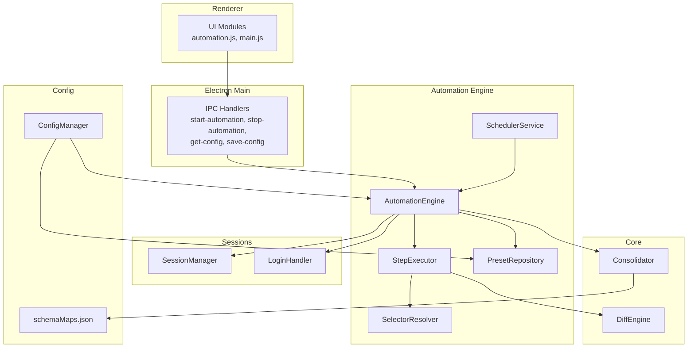
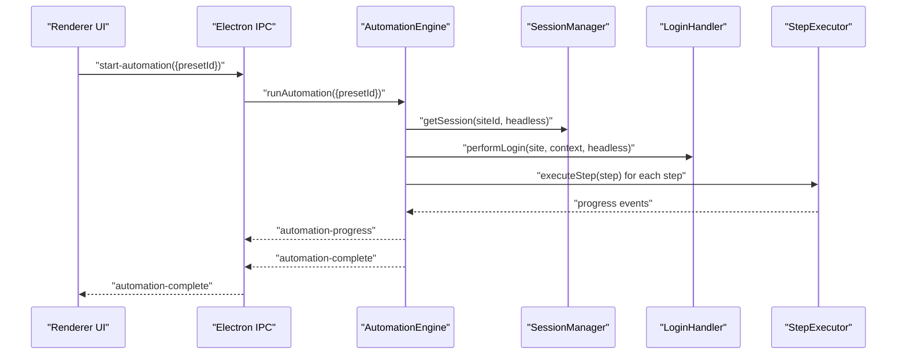
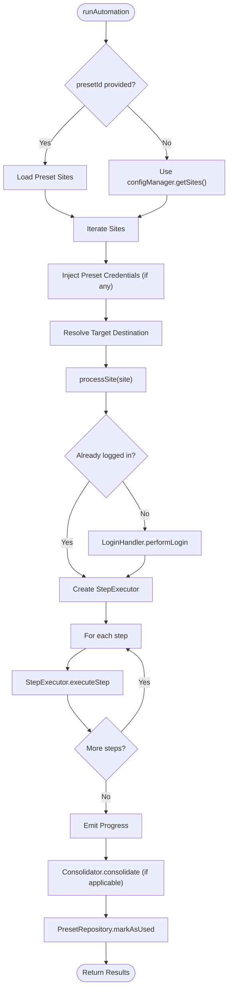
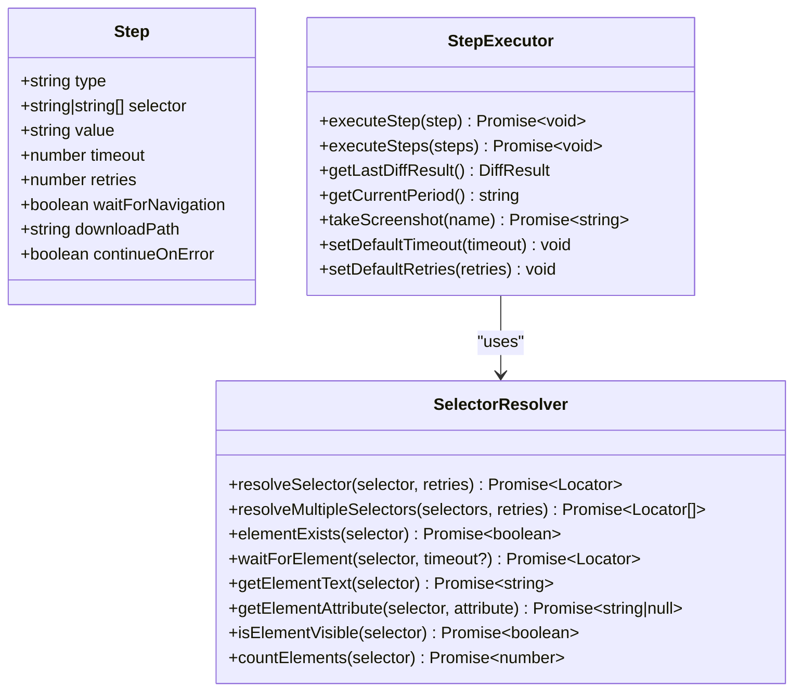
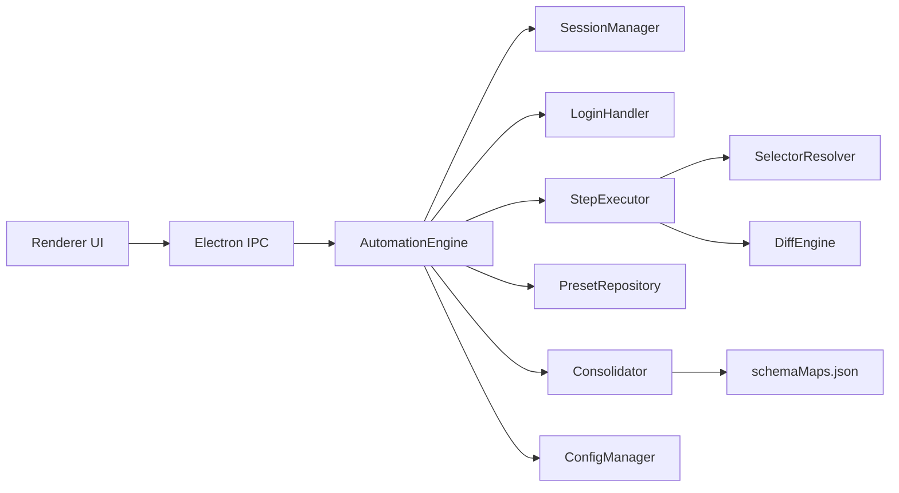

# Automation API

<cite>
**Referenced Files in This Document**
- [automation-engine.ts](file://app/automation/engine/automation-engine.ts)
- [step-executor.ts](file://app/automation/engine/step-executor.ts)
- [selector-resolver.ts](file://app/automation/engine/selector-resolver.ts)
- [preset-repository.ts](file://app/automation/engine/preset-repository.ts)
- [scheduler-service.ts](file://app/automation/engine/scheduler-service.ts)
- [config-manager.ts](file://app/config/config-manager.ts)
- [session-manager.ts](file://app/automation/sessions/session-manager.ts)
- [login-handler.ts](file://app/automation/sessions/login-handler.ts)
- [Consolidator.ts](file://app/core/consolidation/Consolidator.ts)
- [DiffEngine.ts](file://app/core/diff/DiffEngine.ts)
- [main.ts](file://app/electron/main.ts)
- [automation.js](file://app/renderer/modules/automation.js)
- [main.js](file://app/renderer/main.js)
- [schemaMaps.json](file://data/schemaMaps.json)
- [app-config.json](file://app/config/app-config.json)
</cite>

## Table of Contents
1. [Introduction](#introduction)
2. [Project Structure](#project-structure)
3. [Core Components](#core-components)
4. [Architecture Overview](#architecture-overview)
5. [Detailed Component Analysis](#detailed-component-analysis)
6. [Dependency Analysis](#dependency-analysis)
7. [Performance Considerations](#performance-considerations)
8. [Troubleshooting Guide](#troubleshooting-guide)
9. [Conclusion](#conclusion)
10. [Appendices](#appendices)

## Introduction
This document describes the Automation API for Automatizador Bravo, focusing on the workflow execution system. It explains how automation engines orchestrate presets and sites, how steps are executed, how selectors are resolved, and how retry logic is implemented. It also documents configuration objects, step definition schemas, execution context management, progress tracking, and integration patterns with the broader Electron-based desktop application.

## Project Structure
The automation subsystem is organized around a central engine that coordinates sessions, login handling, step execution, and optional snapshot diffing and consolidation. The Electron main process exposes IPC handlers for UI control and status reporting. The renderer module integrates UI events with the automation engine.

**Diagram sources**
- [main.ts](file://app/electron/main.ts#L117-L281)
- [automation-engine.ts](file://app/automation/engine/automation-engine.ts#L50-L608)
- [step-executor.ts](file://app/automation/engine/step-executor.ts#L25-L549)
- [selector-resolver.ts](file://app/automation/engine/selector-resolver.ts#L4-L135)
- [preset-repository.ts](file://app/automation/engine/preset-repository.ts#L4-L34)
- [scheduler-service.ts](file://app/automation/engine/scheduler-service.ts#L6-L145)
- [session-manager.ts](file://app/automation/sessions/session-manager.ts#L67-L225)
- [login-handler.ts](file://app/automation/sessions/login-handler.ts#L13-L364)
- [Consolidator.ts](file://app/core/consolidation/Consolidator.ts#L20-L138)
- [DiffEngine.ts](file://app/core/diff/DiffEngine.ts#L23-L230)
- [config-manager.ts](file://app/config/config-manager.ts#L85-L408)
- [schemaMaps.json](file://data/schemaMaps.json#L1-L9)
- [automation.js](file://app/renderer/modules/automation.js#L6-L59)
- [main.js](file://app/renderer/main.js#L150-L182)

**Section sources**
- [main.ts](file://app/electron/main.ts#L117-L281)
- [automation-engine.ts](file://app/automation/engine/automation-engine.ts#L50-L608)
- [config-manager.ts](file://app/config/config-manager.ts#L85-L408)

## Core Components
- AutomationEngine: Orchestrates preset-based or legacy site-based runs, manages browser contexts, login cycles, step execution, progress emission, and post-run consolidation.
- StepExecutor: Executes typed steps (goto, click, hover, fill, fillDateRange, select, waitFor, download) with timeouts, retries, and optional continue-on-error semantics.
- SelectorResolver: Resolves Playwright locators robustly across multiple selectors and retry attempts, with visibility checks and element utilities.
- SessionManager: Manages persistent browser contexts per site, ensuring login persistence and resource cleanup.
- LoginHandler: Performs automated login, detects CAPTCHA, supports manual intervention, and handles session expiration with reauthentication.
- PresetRepository: CRUD operations for presets and usage tracking.
- SchedulerService: Periodically triggers automation runs based on preset schedules.
- Consolidator: Merges multiple snapshot outputs into consolidated master files.
- DiffEngine: Compares new downloads against previous snapshots to compute additions/removals and maintain metadata.
- ConfigManager: Validates and persists application and preset configurations, resolves paths, and migrates legacy structures.
- Renderer Integration: UI modules trigger automation via IPC and receive progress/status updates.

**Section sources**
- [automation-engine.ts](file://app/automation/engine/automation-engine.ts#L50-L608)
- [step-executor.ts](file://app/automation/engine/step-executor.ts#L25-L549)
- [selector-resolver.ts](file://app/automation/engine/selector-resolver.ts#L4-L135)
- [session-manager.ts](file://app/automation/sessions/session-manager.ts#L67-L225)
- [login-handler.ts](file://app/automation/sessions/login-handler.ts#L13-L364)
- [preset-repository.ts](file://app/automation/engine/preset-repository.ts#L4-L34)
- [scheduler-service.ts](file://app/automation/engine/scheduler-service.ts#L6-L145)
- [Consolidator.ts](file://app/core/consolidation/Consolidator.ts#L20-L138)
- [DiffEngine.ts](file://app/core/diff/DiffEngine.ts#L23-L230)
- [config-manager.ts](file://app/config/config-manager.ts#L85-L408)
- [automation.js](file://app/renderer/modules/automation.js#L6-L59)
- [main.js](file://app/renderer/main.js#L150-L182)

## Architecture Overview
The Automation API centers on a request-response model exposed via Electron IPC. The renderer initiates automation with a preset selection, the main process invokes the engine, and the engine emits progress events back to the renderer. Optional scheduling can trigger runs automatically.

**Diagram sources**
- [main.ts](file://app/electron/main.ts#L214-L241)
- [automation-engine.ts](file://app/automation/engine/automation-engine.ts#L62-L238)
- [session-manager.ts](file://app/automation/sessions/session-manager.ts#L103-L138)
- [login-handler.ts](file://app/automation/sessions/login-handler.ts#L28-L77)
- [step-executor.ts](file://app/automation/engine/step-executor.ts#L59-L110)
- [automation.js](file://app/renderer/modules/automation.js#L7-L45)
- [main.js](file://app/renderer/main.js#L151-L166)

## Detailed Component Analysis

### Automation Engine API
- Purpose: Run automation for one or more sites, optionally scoped by preset. Handles login, session lifecycle, step execution, progress reporting, and post-run consolidation.
- Key methods:
  - runAutomation(options): Starts execution; supports presetId or legacy siteIds.
  - openBrowserForLogin(siteId): Opens a visible browser for manual login.
  - stopAutomation(): Stops execution and cleans up.
  - isAutomationRunning(): Checks runtime status.
  - getAutomationStatus(): Returns running state and elapsed time.
- Execution flow:
  - Validates and prepares sessions.
  - Optionally injects preset credentials and resolves destination folders.
  - Iterates sites, performs login, constructs StepExecutor, executes steps, and emits progress.
  - On completion, consolidates outputs and marks preset usage.

**Diagram sources**
- [automation-engine.ts](file://app/automation/engine/automation-engine.ts#L62-L238)
- [login-handler.ts](file://app/automation/sessions/login-handler.ts#L28-L77)
- [step-executor.ts](file://app/automation/engine/step-executor.ts#L59-L110)
- [Consolidator.ts](file://app/core/consolidation/Consolidator.ts#L26-L63)
- [preset-repository.ts](file://app/automation/engine/preset-repository.ts#L28-L31)

**Section sources**
- [automation-engine.ts](file://app/automation/engine/automation-engine.ts#L50-L608)

### Step Execution API
- Step interface:
  - type: One of goto, click, hover, fill, fillDateRange, select, waitFor, download.
  - selector: String or array of strings; supports fallback selectors.
  - value: Optional; used for navigation URLs, fill values, date ranges, or download paths.
  - timeout: Per-step override for locator waits and actions.
  - retries: Per-step retry count for selector resolution.
  - waitForNavigation: Optional flag for navigation waits.
  - downloadPath: Optional override for download destination.
  - continueOnError: If true, step failures do not abort the sequence.
- Execution logic:
  - Delays between actions configurable globally.
  - Selector resolution with retries and visibility checks.
  - Special handling for date range filling and dynamic token resolution.
  - Download handling with snapshot-aware processing and diffing.

**Diagram sources**
- [step-executor.ts](file://app/automation/engine/step-executor.ts#L14-L54)
- [selector-resolver.ts](file://app/automation/engine/selector-resolver.ts#L4-L135)

**Section sources**
- [step-executor.ts](file://app/automation/engine/step-executor.ts#L25-L549)
- [selector-resolver.ts](file://app/automation/engine/selector-resolver.ts#L4-L135)

### Selector Resolution Mechanism
- Attempts each selector in order until one resolves and becomes visible.
- Supports arrays of selectors for robust fallback.
- Provides helpers to check existence, visibility, attributes, and counts.
- Integrates with StepExecutor to retry resolution according to step-level configuration.

**Section sources**
- [selector-resolver.ts](file://app/automation/engine/selector-resolver.ts#L17-L48)
- [step-executor.ts](file://app/automation/engine/step-executor.ts#L149-L186)

### Retry Logic Implementation
- Global defaults: defaultTimeout and defaultRetries configured via ConfigManager.
- Per-step overrides: timeout and retries fields in Step.
- SelectorResolver retries across multiple selectors with small delays between attempts.
- StepExecutor continuesOnError flag allows partial failures to not halt the entire sequence.
- Session reauthentication on expiration during long runs.

**Section sources**
- [config-manager.ts](file://app/config/config-manager.ts#L58-L78)
- [step-executor.ts](file://app/automation/engine/step-executor.ts#L68-L69)
- [selector-resolver.ts](file://app/automation/engine/selector-resolver.ts#L20-L44)
- [login-handler.ts](file://app/automation/sessions/login-handler.ts#L333-L360)

### Automation Configuration Objects
- AppConfig (global):
  - Fields: defaultTimeout, defaultRetries, actionDelay, headless, schedulerEnabled, googleDrivePath, presets, notifications.
  - Validation via Zod schema; migration from legacy structure.
- Preset:
  - Fields: id, name, sites (array of SiteConfig), login, password, type, destination, schedule.
  - Schedule supports interval or fixed times with nextRun tracking.
- SiteConfig:
  - Fields: id, name, url, loginUrl, usernameField, passwordField, loginButton, steps, downloadPath, renamePattern, reportType, primaryKeys, uf, credentials.
  - Steps validated with type, selector/value, timeout/retries, continueOnError.

**Section sources**
- [config-manager.ts](file://app/config/config-manager.ts#L58-L81)
- [config-manager.ts](file://app/config/config-manager.ts#L35-L53)
- [config-manager.ts](file://app/config/config-manager.ts#L7-L33)
- [app-config.json](file://app/config/app-config.json#L1-L1521)

### Execution Context Management
- SessionManager:
  - Creates persistent contexts per site using launchPersistentContext.
  - Ensures browser binaries are installed and profiles directory exists.
  - Provides methods to close, delete, and clear sessions.
- LoginHandler:
  - Performs automated login, detects CAPTCHA, supports manual login in visible mode.
  - Checks for session expiration and reauthenticates by deleting stale profile and logging in again.

**Section sources**
- [session-manager.ts](file://app/automation/sessions/session-manager.ts#L67-L225)
- [login-handler.ts](file://app/automation/sessions/login-handler.ts#L13-L364)

### Progress Tracking APIs
- AutomationEngine emits progress events with:
  - siteId, siteName, currentStep, totalSteps, stepType, message, percentage.
- Renderer listens to automation-progress and updates UI accordingly.
- Completion and error events are also emitted to the renderer.

**Section sources**
- [automation-engine.ts](file://app/automation/engine/automation-engine.ts#L280-L446)
- [automation-engine.ts](file://app/automation/engine/automation-engine.ts#L548-L556)
- [main.js](file://app/renderer/main.js#L151-L182)

### Presets, Workflows, and Step Sequences
- Presets encapsulate site lists and credentials, enabling isolated, repeatable automation runs.
- Each SiteConfig defines a workflow (steps array) that the engine executes sequentially.
- PresetRepository provides CRUD and usage tracking.
- SchedulerService periodically triggers runs based on preset schedules.

**Section sources**
- [preset-repository.ts](file://app/automation/engine/preset-repository.ts#L4-L34)
- [scheduler-service.ts](file://app/automation/engine/scheduler-service.ts#L6-L145)
- [automation-engine.ts](file://app/automation/engine/automation-engine.ts#L92-L111)

### Snapshot Diffing and Consolidation
- DiffEngine compares new downloads against previous snapshots using primary keys from schemaMaps or custom primaryKeys.
- Generates added/removed counts, maintains a DELETED accumulation file, and writes CURRENT snapshot with metadata.
- Consolidator merges outputs from multiple sites into master CURRENT and DELETED files.

**Section sources**
- [DiffEngine.ts](file://app/core/diff/DiffEngine.ts#L23-L230)
- [Consolidator.ts](file://app/core/consolidation/Consolidator.ts#L20-L138)
- [schemaMaps.json](file://data/schemaMaps.json#L1-L9)

### Practical Orchestration Examples
- Starting automation from UI:
  - Renderer calls window.electronAPI.startAutomation({ presetId }) and toggles UI state.
  - Main process routes to AutomationEngine and streams progress to renderer.
- Manual login assistance:
  - openBrowserForLogin opens a visible browser for CAPTCHA resolution.
- Scheduled runs:
  - SchedulerService evaluates preset schedules and triggers automation when due.

**Section sources**
- [automation.js](file://app/renderer/modules/automation.js#L7-L45)
- [main.ts](file://app/electron/main.ts#L198-L200)
- [scheduler-service.ts](file://app/automation/engine/scheduler-service.ts#L38-L96)

## Dependency Analysis
The automation subsystem exhibits clear separation of concerns:
- UI depends on Electron IPC handlers.
- Main process depends on AutomationEngine and repositories.
- AutomationEngine depends on SessionManager, LoginHandler, StepExecutor, and PresetRepository.
- StepExecutor depends on SelectorResolver and DiffEngine for snapshot-aware downloads.
- Consolidator depends on DiffEngine outputs and schemaMaps.

**Diagram sources**
- [main.ts](file://app/electron/main.ts#L117-L281)
- [automation-engine.ts](file://app/automation/engine/automation-engine.ts#L50-L608)
- [step-executor.ts](file://app/automation/engine/step-executor.ts#L25-L549)
- [selector-resolver.ts](file://app/automation/engine/selector-resolver.ts#L4-L135)
- [login-handler.ts](file://app/automation/sessions/login-handler.ts#L13-L364)
- [session-manager.ts](file://app/automation/sessions/session-manager.ts#L67-L225)
- [Consolidator.ts](file://app/core/consolidation/Consolidator.ts#L20-L138)
- [DiffEngine.ts](file://app/core/diff/DiffEngine.ts#L23-L230)
- [config-manager.ts](file://app/config/config-manager.ts#L85-L408)
- [schemaMaps.json](file://data/schemaMaps.json#L1-L9)

**Section sources**
- [main.ts](file://app/electron/main.ts#L117-L281)
- [automation-engine.ts](file://app/automation/engine/automation-engine.ts#L50-L608)

## Performance Considerations
- Headless vs visible mode: headless reduces overhead; visible mode is required for CAPTCHA resolution.
- Action delays: actionDelay mitigates race conditions but increases total runtime.
- Retries: selector retries improve robustness but add latency; tune per environment.
- Persistent sessions: reduce repeated login overhead and improve stability.
- Global timeouts: engine enforces a hard cap to prevent resource leaks.
- Consolidation: batch post-processing can be expensive; ensure destination paths are accessible.

[No sources needed since this section provides general guidance]

## Troubleshooting Guide
- Login failures:
  - Verify credentials injection via presets and LoginHandler fallbacks.
  - CAPTCHA detection triggers manual login requirement in visible mode.
- Session expiration:
  - Engine detects login page redirects and reauthenticates by deleting stale profile and re-logging in.
- Selector instability:
  - Use arrays of selectors and increase retries; rely on SelectorResolver’s fallback logic.
- Download issues:
  - Ensure target directory exists; DiffEngine handles snapshot-aware downloads; otherwise standard download flow applies.
- Progress not updating:
  - Confirm renderer listeners for automation-progress and automation-complete.

**Section sources**
- [login-handler.ts](file://app/automation/sessions/login-handler.ts#L56-L77)
- [login-handler.ts](file://app/automation/sessions/login-handler.ts#L288-L360)
- [selector-resolver.ts](file://app/automation/engine/selector-resolver.ts#L17-L48)
- [step-executor.ts](file://app/automation/engine/step-executor.ts#L397-L511)
- [main.js](file://app/renderer/main.js#L151-L182)

## Conclusion
The Automation API provides a robust, preset-driven framework for orchestrating browser automation across multiple sites. It balances reliability with flexibility through configurable timeouts, retries, persistent sessions, and intelligent selector resolution. Snapshot-aware diffing and consolidation enable enterprise-grade auditing and reporting. The Electron IPC layer cleanly integrates UI controls with backend execution, enabling responsive feedback and scheduled automation.

[No sources needed since this section summarizes without analyzing specific files]

## Appendices

### API Reference: Automation Engine Methods
- runAutomation(options): Promise<AutomationResult[]>
- openBrowserForLogin(siteId): Promise<{ success: boolean }>
- stopAutomation(): Promise<void>
- isAutomationRunning(): boolean
- getAutomationStatus(): { running: boolean; duration: number }

**Section sources**
- [automation-engine.ts](file://app/automation/engine/automation-engine.ts#L561-L608)

### API Reference: StepExecutor Methods
- executeStep(step): Promise<void>
- executeSteps(steps): Promise<void>
- getLastDiffResult(): DiffResult
- getCurrentPeriod(): string
- takeScreenshot(name): Promise<string>
- setDefaultTimeout(timeout): void
- setDefaultRetries(retries): void

**Section sources**
- [step-executor.ts](file://app/automation/engine/step-executor.ts#L59-L110)
- [step-executor.ts](file://app/automation/engine/step-executor.ts#L538-L549)

### API Reference: SelectorResolver Methods
- resolveSelector(selector, retries): Promise<Locator>
- resolveMultipleSelectors(selectors, retries): Promise<Locator[]>
- elementExists(selector): Promise<boolean>
- waitForElement(selector, timeout?): Promise<Locator>
- getElementText(selector): Promise<string>
- getElementAttribute(selector, attribute): Promise<string|null>
- isElementVisible(selector): Promise<boolean>
- countElements(selector): Promise<number>

**Section sources**
- [selector-resolver.ts](file://app/automation/engine/selector-resolver.ts#L17-L135)

### Configuration Schemas
- AppConfig: defaultTimeout, defaultRetries, actionDelay, headless, schedulerEnabled, presets, notifications.
- Preset: id, name, sites, login, password, type, destination, schedule.
- SiteConfig: id, name, url, loginUrl, usernameField, passwordField, loginButton, steps, downloadPath, renamePattern, reportType, primaryKeys, uf, credentials.

**Section sources**
- [config-manager.ts](file://app/config/config-manager.ts#L58-L81)
- [config-manager.ts](file://app/config/config-manager.ts#L35-L53)
- [config-manager.ts](file://app/config/config-manager.ts#L7-L33)