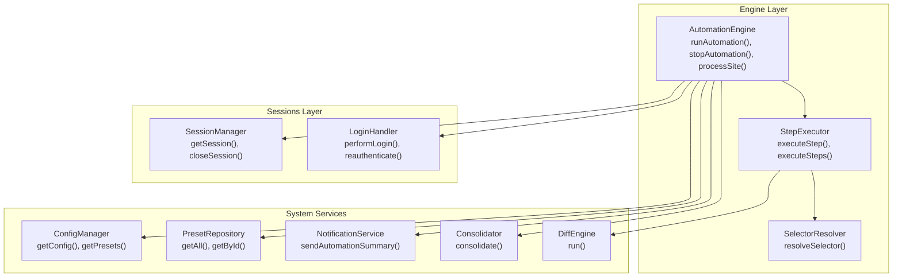
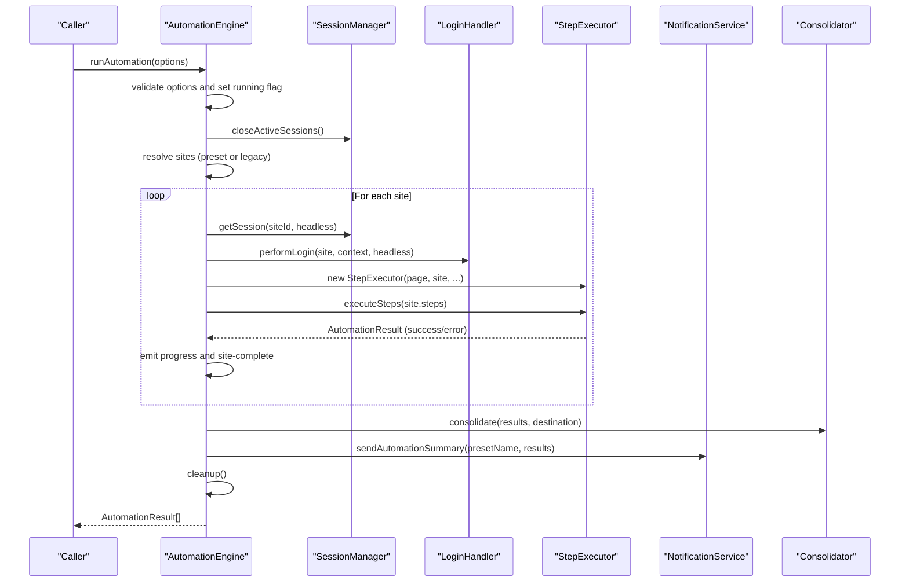

# Automation Engine API

<cite>
**Referenced Files in This Document**
- [automation-engine.ts](file://app/automation/engine/automation-engine.ts)
- [step-executor.ts](file://app/automation/engine/step-executor.ts)
- [selector-resolver.ts](file://app/automation/engine/selector-resolver.ts)
- [scheduler-service.ts](file://app/automation/engine/scheduler-service.ts)
- [preset-repository.ts](file://app/automation/engine/preset-repository.ts)
- [session-manager.ts](file://app/automation/sessions/session-manager.ts)
- [login-handler.ts](file://app/automation/sessions/login-handler.ts)
- [config-manager.ts](file://app/config/config-manager.ts)
- [logger.ts](file://app/config/logger.ts)
- [NotificationService.ts](file://app/core/notifications/NotificationService.ts)
- [Consolidator.ts](file://app/core/consolidation/Consolidator.ts)
- [DiffEngine.ts](file://app/core/diff/DiffEngine.ts)
</cite>

## Table of Contents
1. [Introduction](#introduction)
2. [Project Structure](#project-structure)
3. [Core Components](#core-components)
4. [Architecture Overview](#architecture-overview)
5. [Detailed Component Analysis](#detailed-component-analysis)
6. [Dependency Analysis](#dependency-analysis)
7. [Performance Considerations](#performance-considerations)
8. [Troubleshooting Guide](#troubleshooting-guide)
9. [Conclusion](#conclusion)
10. [Appendices](#appendices)

## Introduction
This document provides comprehensive API documentation for the AutomationEngine class, the central automation execution interface of the system. It covers the main methods runAutomation(), stopAutomation(), and processSite(), along with the AutomationOptions and AutomationResult interfaces. It explains lifecycle management, browser initialization, session handling, and resource cleanup. Practical execution patterns, error handling strategies, and integration points with the broader system are included, along with singleton pattern and thread safety considerations.

## Project Structure
The automation engine is part of a modular architecture centered around:
- Engine: orchestration and execution
- Sessions: browser context and login management
- Configuration: runtime settings and presets
- Notifications: post-run summaries
- Consolidation and Diff: snapshot comparison and master consolidation



**Diagram sources**
- [automation-engine.ts](file://app/automation/engine/automation-engine.ts#L50-L608)
- [step-executor.ts](file://app/automation/engine/step-executor.ts#L25-L616)
- [selector-resolver.ts](file://app/automation/engine/selector-resolver.ts#L4-L135)
- [session-manager.ts](file://app/automation/sessions/session-manager.ts#L67-L225)
- [login-handler.ts](file://app/automation/sessions/login-handler.ts#L13-L364)
- [config-manager.ts](file://app/config/config-manager.ts#L85-L408)
- [preset-repository.ts](file://app/automation/engine/preset-repository.ts#L4-L34)
- [NotificationService.ts](file://app/core/notifications/NotificationService.ts#L13-L115)
- [Consolidator.ts](file://app/core/consolidation/Consolidator.ts#L20-L138)
- [DiffEngine.ts](file://app/core/diff/DiffEngine.ts#L23-L230)

**Section sources**
- [automation-engine.ts](file://app/automation/engine/automation-engine.ts#L1-L611)
- [config-manager.ts](file://app/config/config-manager.ts#L1-L408)

## Core Components
- AutomationEngine: orchestrates automation runs, manages lifecycle, browser contexts, and emits progress events.
- StepExecutor: executes individual steps against a Playwright page with robust selector resolution and retry logic.
- SelectorResolver: resolves Playwright locators with retries and visibility checks.
- SessionManager: manages persistent browser contexts per site profile.
- LoginHandler: performs automated login, detects CAPTCHA, and handles re-authentication.
- ConfigManager: validates and manages application and preset configurations.
- NotificationService: sends automation run summaries via email.
- Consolidator: merges snapshot files into master consolidated reports.
- DiffEngine: computes differences between snapshots and updates metadata.

**Section sources**
- [automation-engine.ts](file://app/automation/engine/automation-engine.ts#L50-L608)
- [step-executor.ts](file://app/automation/engine/step-executor.ts#L25-L616)
- [selector-resolver.ts](file://app/automation/engine/selector-resolver.ts#L4-L135)
- [session-manager.ts](file://app/automation/sessions/session-manager.ts#L67-L225)
- [login-handler.ts](file://app/automation/sessions/login-handler.ts#L13-L364)
- [config-manager.ts](file://app/config/config-manager.ts#L85-L408)
- [NotificationService.ts](file://app/core/notifications/NotificationService.ts#L13-L115)
- [Consolidator.ts](file://app/core/consolidation/Consolidator.ts#L20-L138)
- [DiffEngine.ts](file://app/core/diff/DiffEngine.ts#L23-L230)

## Architecture Overview
The AutomationEngine coordinates browser sessions, login flows, and step execution. It integrates with configuration, scheduling, notifications, and snapshot consolidation.



**Diagram sources**
- [automation-engine.ts](file://app/automation/engine/automation-engine.ts#L62-L238)
- [session-manager.ts](file://app/automation/sessions/session-manager.ts#L103-L138)
- [login-handler.ts](file://app/automation/sessions/login-handler.ts#L28-L77)
- [step-executor.ts](file://app/automation/engine/step-executor.ts#L59-L110)
- [Consolidator.ts](file://app/core/consolidation/Consolidator.ts#L26-L63)
- [NotificationService.ts](file://app/core/notifications/NotificationService.ts#L75-L111)

## Detailed Component Analysis

### AutomationEngine API
- Purpose: Central automation controller managing browser lifecycle, sessions, login, step execution, progress reporting, and cleanup.
- Singleton: Exports a singleton instance for global access.

Key methods:
- runAutomation(options): Executes automation for configured sites or presets, with global timeout and per-site cleanup.
- stopAutomation(): Gracefully stops a running automation and cleans up resources.
- processSite(site, customBasePath?): Executes a single site’s workflow, including login, step execution, and result assembly.
- openBrowserForLogin(siteId): Opens a visible browser for manual login or CAPTCHA resolution.
- isAutomationRunning(): Reports engine running state.
- getAutomationStatus(): Returns running state and elapsed duration.

Interfaces:
- AutomationOptions: Controls execution scope via presetId or explicit siteIds.
- AutomationResult: Aggregates execution outcome, timing, and optional SSP diff metadata.
- AutomationProgress: Progress event payload sent to UI.

Lifecycle and browser initialization:
- Initializes Chromium with headless option from configuration.
- Creates a new context and page for the first run.
- Uses persistent contexts per site to preserve cookies and state.

Resource cleanup:
- Ensures sessions are closed after each site and at the end of runAutomation().
- Clears internal references and resets state.

Thread safety and concurrency:
- Single-threaded execution enforced by isRunning flag and global timeout guard.
- No concurrent runs are permitted; attempting to start a second run throws an error.

Practical execution patterns:
- Preset-driven runs: Provide presetId to execute isolated site sets with shared credentials and destination.
- Legacy runs: Provide siteIds to run selected sites from all presets.
- Manual login: Use openBrowserForLogin() to resolve CAPTCHA or login issues in visible mode.

Error handling strategies:
- Global timeout after two hours to prevent resource leaks.
- Per-step continueOnError support via StepExecutor.
- Captures screenshots on failures for diagnostics.
- Emits progress events for UI feedback.

Integration points:
- Electron BrowserWindow IPC for progress and completion events.
- NotificationService for post-run summaries.
- Consolidator for master snapshot consolidation.

**Section sources**
- [automation-engine.ts](file://app/automation/engine/automation-engine.ts#L13-L48)
- [automation-engine.ts](file://app/automation/engine/automation-engine.ts#L62-L238)
- [automation-engine.ts](file://app/automation/engine/automation-engine.ts#L262-L446)
- [automation-engine.ts](file://app/automation/engine/automation-engine.ts#L478-L515)
- [automation-engine.ts](file://app/automation/engine/automation-engine.ts#L561-L587)
- [automation-engine.ts](file://app/automation/engine/automation-engine.ts#L592-L607)
- [automation-engine.ts](file://app/automation/engine/automation-engine.ts#L611)

### StepExecutor API
- Purpose: Executes individual steps against a Playwright page with robust selector resolution and retry logic.
- Step types: goto, click, hover, fill, fillDateRange, select, waitFor, download.
- Retry and timeout controls configurable per step or globally.
- Date token resolution for dynamic date ranges.
- Snapshot-aware download with DiffEngine integration.

Key behaviors:
- SelectorResolver resolves locators with retries and visibility checks.
- Supports continueOnError to skip failing steps.
- Generates screenshots on demand.
- Updates current period for SSP metadata.

**Section sources**
- [step-executor.ts](file://app/automation/engine/step-executor.ts#L14-L23)
- [step-executor.ts](file://app/automation/engine/step-executor.ts#L59-L110)
- [step-executor.ts](file://app/automation/engine/step-executor.ts#L215-L269)
- [step-executor.ts](file://app/automation/engine/step-executor.ts#L464-L578)

### SelectorResolver API
- Purpose: Robust Playwright locator resolution with retries and visibility checks.
- Methods: resolveSelector(), resolveMultipleSelectors(), elementExists(), waitForElement(), getElementText(), getElementAttribute(), isElementVisible(), countElements().

**Section sources**
- [selector-resolver.ts](file://app/automation/engine/selector-resolver.ts#L17-L48)
- [selector-resolver.ts](file://app/automation/engine/selector-resolver.ts#L53-L66)
- [selector-resolver.ts](file://app/automation/engine/selector-resolver.ts#L71-L78)
- [selector-resolver.ts](file://app/automation/engine/selector-resolver.ts#L83-L94)
- [selector-resolver.ts](file://app/automation/engine/selector-resolver.ts#L99-L110)
- [selector-resolver.ts](file://app/automation/engine/selector-resolver.ts#L115-L122)
- [selector-resolver.ts](file://app/automation/engine/selector-resolver.ts#L127-L134)

### SessionManager API
- Purpose: Manages persistent browser contexts per site profile, ensuring isolation and reuse.
- Methods: getSession(siteId, headless), closeSession(siteId), closeActiveSessions(), deleteSession(siteId), clearAllSessions(), getSessionStatus(), saveSession(siteId, context).

Initialization:
- Ensures Playwright browsers and profiles directories exist, migrating from legacy locations if needed.

**Section sources**
- [session-manager.ts](file://app/automation/sessions/session-manager.ts#L103-L138)
- [session-manager.ts](file://app/automation/sessions/session-manager.ts#L143-L165)
- [session-manager.ts](file://app/automation/sessions/session-manager.ts#L170-L200)
- [session-manager.ts](file://app/automation/sessions/session-manager.ts#L205-L223)

### LoginHandler API
- Purpose: Performs automated login, detects CAPTCHA, and handles re-authentication during long runs.
- Methods: performLogin(site, context, headless), checkSessionExpired(page, site), reauthenticate(site, context, headless).

Manual login flow:
- In headless mode, CAPTCHA detection triggers an error requiring visible mode.
- In visible mode, waits for user to complete login within a time limit.

**Section sources**
- [login-handler.ts](file://app/automation/sessions/login-handler.ts#L28-L77)
- [login-handler.ts](file://app/automation/sessions/login-handler.ts#L288-L328)
- [login-handler.ts](file://app/automation/sessions/login-handler.ts#L333-L360)

### ConfigManager API
- Purpose: Validates and manages application-wide and preset-specific configurations.
- Interfaces: AppConfig, SiteConfig, Preset.
- Methods: getConfig(), saveConfig(), getPresets(), addPreset(), updatePreset(), removePreset(), getPresetSites(), addSiteToPreset(), removeSiteFromPreset(), updateSiteInPreset(), getSiteFromPreset(), exportConfig(), importConfig().

Migration:
- Automatically migrates legacy config and sites arrays into presets.

**Section sources**
- [config-manager.ts](file://app/config/config-manager.ts#L85-L194)
- [config-manager.ts](file://app/config/config-manager.ts#L216-L303)
- [config-manager.ts](file://app/config/config-manager.ts#L334-L394)

### PresetRepository API
- Purpose: CRUD operations for presets and marking presets as used.
- Methods: getAll(), getById(id), create(preset), update(id, preset), delete(id), markAsUsed(id).

**Section sources**
- [preset-repository.ts](file://app/automation/engine/preset-repository.ts#L4-L34)

### SchedulerService API
- Purpose: Periodically triggers automation runs based on preset schedules.
- Methods: start(), stop(), checkSchedules(), calculateNextRun(preset).

Behavior:
- Watches for scheduled presets and attempts runs, handling busy engine states gracefully.
- Implements watchdog to recover from long-running locks.

**Section sources**
- [scheduler-service.ts](file://app/automation/engine/scheduler-service.ts#L16-L96)
- [scheduler-service.ts](file://app/automation/engine/scheduler-service.ts#L101-L142)

### NotificationService API
- Purpose: Sends automation run summaries via email when configured.
- Methods: sendEmail(options), sendAutomationSummary(presetName, results).

**Section sources**
- [NotificationService.ts](file://app/core/notifications/NotificationService.ts#L28-L70)
- [NotificationService.ts](file://app/core/notifications/NotificationService.ts#L75-L111)

### Consolidator API
- Purpose: Merges snapshot files into master consolidated reports (CURRENT and DELETED).
- Methods: consolidate(results, destinationDir).

**Section sources**
- [Consolidator.ts](file://app/core/consolidation/Consolidator.ts#L26-L63)

### DiffEngine API
- Purpose: Computes differences between snapshots and updates metadata.
- Methods: run(siteId, identity, newDownloadPath, customBase?, customPrimaryKeys?).

**Section sources**
- [DiffEngine.ts](file://app/core/diff/DiffEngine.ts#L55-L219)

## Dependency Analysis
The AutomationEngine depends on:
- SessionManager for browser contexts
- LoginHandler for authentication and re-authentication
- StepExecutor for step execution
- ConfigManager for runtime configuration and presets
- NotificationService for post-run summaries
- Consolidator for master consolidation
- DiffEngine for snapshot diffing

```mermaid
classDiagram
class AutomationEngine {
+runAutomation(options) Promise~AutomationResult[]~
+stopAutomation() Promise~void~
+processSite(site, customBasePath?) Promise~AutomationResult~
+openBrowserForLogin(siteId) Promise~{success : boolean}~
+isAutomationRunning() boolean
+getAutomationStatus() {running,duration}
}
class StepExecutor {
+executeStep(step) Promise~void~
+executeSteps(steps) Promise~void~
+getLastDiffResult() any
+getCurrentPeriod() string
+takeScreenshot(name) Promise~string~
}
class SelectorResolver {
+resolveSelector(selector,retries) Promise~Locator~
+elementExists(selector) Promise~boolean~
}
class SessionManager {
+getSession(siteId,headless) Promise~BrowserContext~
+closeSession(siteId) Promise~void~
+closeActiveSessions() Promise~void~
}
class LoginHandler {
+performLogin(site,context,headless) Promise~LoginResult~
+checkSessionExpired(page,site) Promise~boolean~
+reauthenticate(site,context,headless) Promise~LoginResult~
}
class ConfigManager {
+getConfig() AppConfig
+getPresets() Preset[]
}
class NotificationService {
+sendAutomationSummary(presetName,results) Promise~void~
}
class Consolidator {
+consolidate(results,destinationDir) Promise~{current,deleted}~
}
class DiffEngine {
+run(siteId,identity,newDownloadPath,customBase?,customPrimaryKeys?) Promise~DiffResult~
}
AutomationEngine --> SessionManager : "uses"
AutomationEngine --> LoginHandler : "uses"
AutomationEngine --> StepExecutor : "creates"
StepExecutor --> SelectorResolver : "uses"
StepExecutor --> DiffEngine : "uses"
AutomationEngine --> ConfigManager : "reads"
AutomationEngine --> NotificationService : "uses"
AutomationEngine --> Consolidator : "uses"
```

**Diagram sources**
- [automation-engine.ts](file://app/automation/engine/automation-engine.ts#L50-L608)
- [step-executor.ts](file://app/automation/engine/step-executor.ts#L25-L616)
- [selector-resolver.ts](file://app/automation/engine/selector-resolver.ts#L4-L135)
- [session-manager.ts](file://app/automation/sessions/session-manager.ts#L67-L225)
- [login-handler.ts](file://app/automation/sessions/login-handler.ts#L13-L364)
- [config-manager.ts](file://app/config/config-manager.ts#L85-L408)
- [NotificationService.ts](file://app/core/notifications/NotificationService.ts#L13-L115)
- [Consolidator.ts](file://app/core/consolidation/Consolidator.ts#L20-L138)
- [DiffEngine.ts](file://app/core/diff/DiffEngine.ts#L23-L230)

**Section sources**
- [automation-engine.ts](file://app/automation/engine/automation-engine.ts#L1-L12)
- [step-executor.ts](file://app/automation/engine/step-executor.ts#L1-L12)
- [session-manager.ts](file://app/automation/sessions/session-manager.ts#L1-L10)
- [login-handler.ts](file://app/automation/sessions/login-handler.ts#L1-L4)
- [config-manager.ts](file://app/config/config-manager.ts#L1-L6)
- [NotificationService.ts](file://app/core/notifications/NotificationService.ts#L1-L3)
- [Consolidator.ts](file://app/core/consolidation/Consolidator.ts#L1-L6)
- [DiffEngine.ts](file://app/core/diff/DiffEngine.ts#L1-L12)

## Performance Considerations
- Headless vs Visible: Headless mode reduces resource usage; visible mode is required for CAPTCHA resolution.
- Retries and timeouts: Tune defaultRetries and defaultTimeout to balance stability and speed.
- Action delays: actionDelay introduces pauses between actions; adjust for site responsiveness.
- Persistent contexts: Reuse contexts per site to avoid repeated login overhead.
- Global timeout: Two-hour cap prevents runaway executions and resource leaks.
- Cleanup: Always close sessions and clean up resources after runs.

[No sources needed since this section provides general guidance]

## Troubleshooting Guide
Common issues and resolutions:
- CAPTCHA in headless mode: Switch to visible mode or resolve CAPTCHA manually.
- Session expiration during run: Engine automatically detects and reauthenticates; ensure context remains open.
- Missing sites or presets: Verify preset configuration and site IDs; use presetId for isolated runs.
- Download failures: Ensure target directory exists; StepExecutor creates directories before clicking.
- Long-running locks: Scheduler watchdog resets state after extended execution.
- Logging: Use automationLogger and sessionLogger for detailed traces.

**Section sources**
- [automation-engine.ts](file://app/automation/engine/automation-engine.ts#L76-L81)
- [login-handler.ts](file://app/automation/sessions/login-handler.ts#L57-L63)
- [login-handler.ts](file://app/automation/sessions/login-handler.ts#L288-L328)
- [step-executor.ts](file://app/automation/engine/step-executor.ts#L469-L481)
- [scheduler-service.ts](file://app/automation/engine/scheduler-service.ts#L41-L44)

## Conclusion
The AutomationEngine provides a robust, modular framework for browser automation with strong session management, flexible execution modes, and integrated snapshot diffing and consolidation. Its singleton pattern ensures centralized control, while lifecycle hooks and cleanup routines protect system resources. The APIs are designed for extensibility and resilience, with comprehensive logging and notification support.

[No sources needed since this section summarizes without analyzing specific files]

## Appendices

### API Definitions

- AutomationOptions
  - siteIds?: string[] — Select specific sites by ID when not using presets.
  - presetId?: string — Execute a specific preset with isolated sites and credentials.

- AutomationResult
  - success: boolean — Whether the site execution succeeded.
  - siteId: string — Site identifier.
  - siteName: string — Site display name.
  - presetName?: string — Name of the preset used (if any).
  - stepsExecuted: number — Count of executed steps.
  - duration: number — Execution time in milliseconds.
  - errorMessage?: string — Error message if failed.
  - errorScreenshot?: string — Path to captured screenshot on failure.
  - downloads?: string[] — List of downloaded file paths.
  - identity?: { tipo: string; period: string } — SSP identity metadata.
  - sspResult?: { added, removed, currentRows, currentFile, deletedFile, isValid, uf } — Snapshot diff result.

- AutomationProgress
  - siteId: string — Site identifier.
  - siteName: string — Site display name.
  - currentStep: number — Current step index.
  - totalSteps: number — Total steps in the workflow.
  - stepType: string — Type of the current step.
  - message: string — Human-readable progress message.
  - percentage: number — Completion percentage.

- LoginResult
  - success: boolean — Whether login succeeded.
  - requiresManual: boolean — Whether manual intervention was required.
  - errorMessage?: string — Error message if failed.
  - sessionId?: string — Session identifier if applicable.

**Section sources**
- [automation-engine.ts](file://app/automation/engine/automation-engine.ts#L13-L48)
- [login-handler.ts](file://app/automation/sessions/login-handler.ts#L6-L11)

### Execution Patterns

- Preset-driven run
  - Provide presetId to run isolated sites with shared credentials and destination.
  - Engine injects preset credentials into each site and resolves destination folders.

- Legacy run
  - Provide siteIds to run selected sites across all presets.
  - Engine resolves sites from configuration and proceeds similarly.

- Manual login
  - Use openBrowserForLogin(siteId) to open a visible browser for CAPTCHA or login issues.

- Scheduled runs
  - SchedulerService periodically checks preset schedules and triggers runs when ready.

**Section sources**
- [automation-engine.ts](file://app/automation/engine/automation-engine.ts#L92-L111)
- [automation-engine.ts](file://app/automation/engine/automation-engine.ts#L126-L153)
- [automation-engine.ts](file://app/automation/engine/automation-engine.ts#L478-L515)
- [scheduler-service.ts](file://app/automation/engine/scheduler-service.ts#L38-L96)

### Thread Safety and Singleton
- Singleton instance exported for global access.
- isRunning flag prevents concurrent runs.
- Global timeout ensures cleanup even if exceptions occur.
- SessionManager maintains per-site contexts to avoid cross-site interference.

**Section sources**
- [automation-engine.ts](file://app/automation/engine/automation-engine.ts#L611)
- [automation-engine.ts](file://app/automation/engine/automation-engine.ts#L63-L65)
- [automation-engine.ts](file://app/automation/engine/automation-engine.ts#L76-L81)
- [session-manager.ts](file://app/automation/sessions/session-manager.ts#L103-L138)