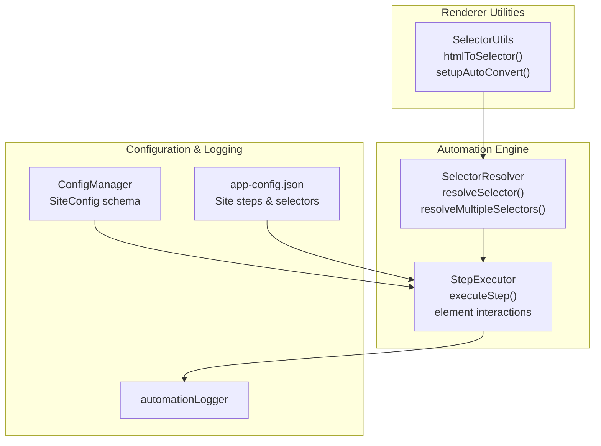
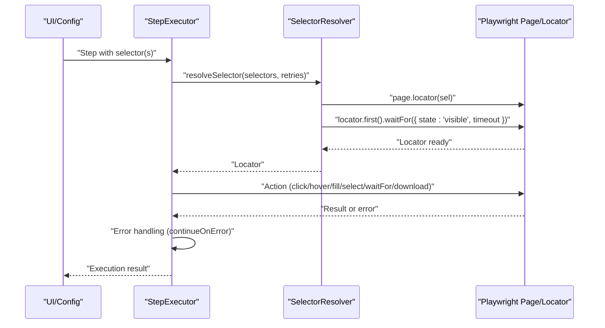
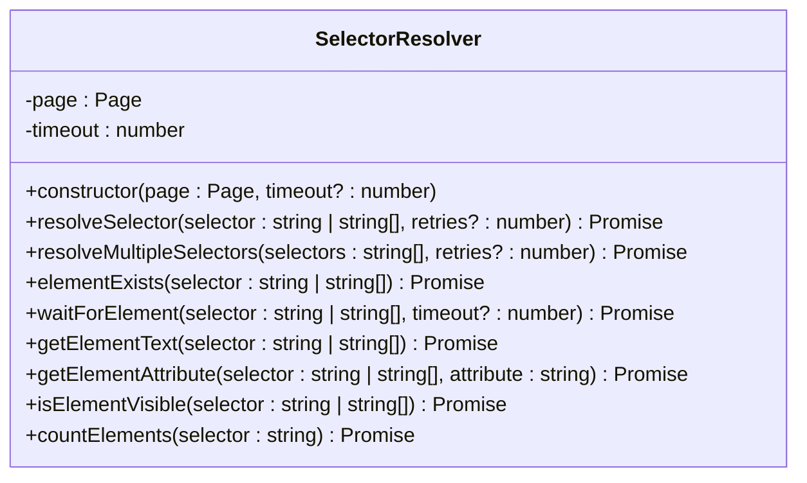
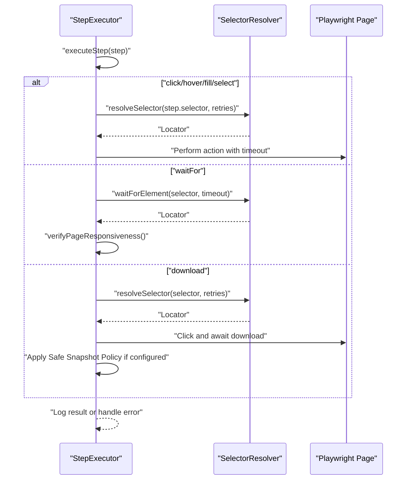
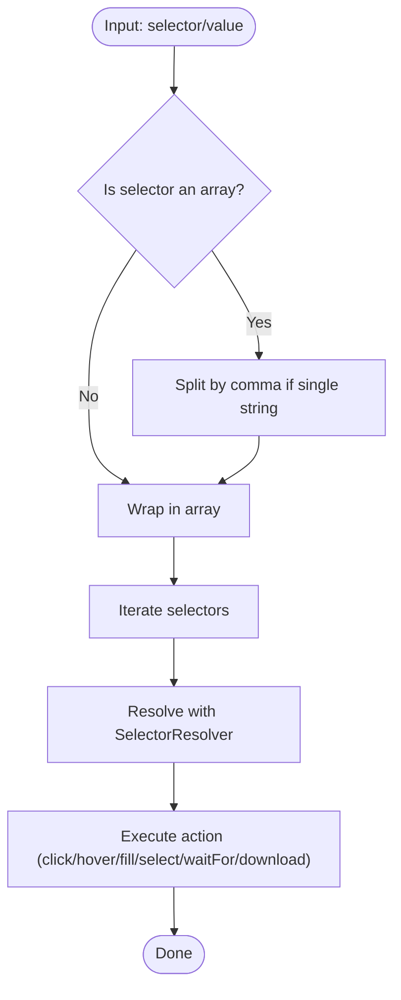
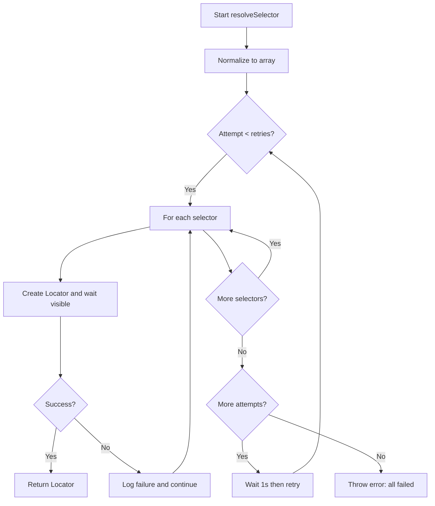
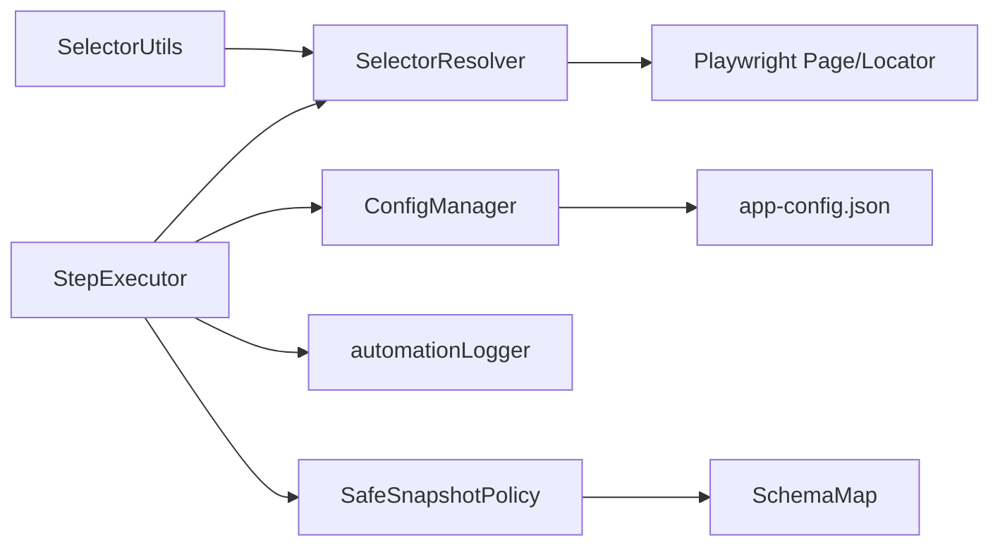

# Selector Resolution API

<cite>
**Referenced Files in This Document**
- [selector-resolver.ts](file://app/automation/engine/selector-resolver.ts)
- [step-executor.ts](file://app/automation/engine/step-executor.ts)
- [selector-utils.js](file://app/renderer/selector-utils.js)
- [logger.ts](file://app/config/logger.ts)
- [config-manager.ts](file://app/config/config-manager.ts)
- [app-config.json](file://app/config/app-config.json)
- [SchemaMap.ts](file://app/config/schema-map.ts)
- [SafeSnapshotPolicy.ts](file://app/policy/snapshot/SafeSnapshotPolicy.ts)
</cite>

## Table of Contents
1. [Introduction](#introduction)
2. [Project Structure](#project-structure)
3. [Core Components](#core-components)
4. [Architecture Overview](#architecture-overview)
5. [Detailed Component Analysis](#detailed-component-analysis)
6. [Dependency Analysis](#dependency-analysis)
7. [Performance Considerations](#performance-considerations)
8. [Troubleshooting Guide](#troubleshooting-guide)
9. [Conclusion](#conclusion)

## Introduction
This document provides comprehensive API documentation for the SelectorResolver class and the selector resolution system. It explains selector parsing, dynamic selector generation, element interaction patterns, validation mechanisms, fallback strategies, error recovery, integration with Playwright's locator system, and custom selector syntax. It also covers complex selector patterns, conditional selectors, performance optimization techniques, and the relationship between selectors and step execution reliability.

## Project Structure
The selector resolution system spans three layers:
- Core automation engine with Playwright integration
- Renderer utilities for converting HTML fragments to CSS selectors
- Configuration and logging infrastructure supporting robust execution

**Diagram sources**
- [selector-resolver.ts](file://app/automation/engine/selector-resolver.ts#L1-L135)
- [step-executor.ts](file://app/automation/engine/step-executor.ts#L1-L616)
- [selector-utils.js](file://app/renderer/selector-utils.js#L1-L119)
- [logger.ts](file://app/config/logger.ts#L1-L104)
- [config-manager.ts](file://app/config/config-manager.ts#L1-L408)
- [app-config.json](file://app/config/app-config.json#L1-L1521)

**Section sources**
- [selector-resolver.ts](file://app/automation/engine/selector-resolver.ts#L1-L135)
- [step-executor.ts](file://app/automation/engine/step-executor.ts#L1-L616)
- [selector-utils.js](file://app/renderer/selector-utils.js#L1-L119)
- [logger.ts](file://app/config/logger.ts#L1-L104)
- [config-manager.ts](file://app/config/config-manager.ts#L1-L408)
- [app-config.json](file://app/config/app-config.json#L1-L1521)

## Core Components
- SelectorResolver: Central resolver implementing selector parsing, validation, fallback, and element interaction helpers.
- StepExecutor: Orchestrates step execution and delegates element interactions to SelectorResolver.
- SelectorUtils: Converts HTML snippets into Playwright-compatible CSS selectors.
- ConfigManager and app-config.json: Define supported step types, selector formats, and runtime defaults.
- automationLogger: Provides structured logging for selector resolution and step execution.

Key capabilities:
- Single or array-based selector resolution with retry/backoff
- Visibility-aware element waiting
- Element existence checks, visibility checks, and counts
- Text and attribute retrieval
- Integration with Playwright Locators

**Section sources**
- [selector-resolver.ts](file://app/automation/engine/selector-resolver.ts#L1-L135)
- [step-executor.ts](file://app/automation/engine/step-executor.ts#L1-L616)
- [selector-utils.js](file://app/renderer/selector-utils.js#L1-L119)
- [config-manager.ts](file://app/config/config-manager.ts#L1-L408)
- [app-config.json](file://app/config/app-config.json#L1-L1521)
- [logger.ts](file://app/config/logger.ts#L1-L104)

## Architecture Overview
The selector resolution pipeline integrates Playwright locators with robust fallback and validation:

**Diagram sources**
- [step-executor.ts](file://app/automation/engine/step-executor.ts#L59-L110)
- [selector-resolver.ts](file://app/automation/engine/selector-resolver.ts#L17-L48)

## Detailed Component Analysis

### SelectorResolver API
SelectorResolver encapsulates selector resolution and element interaction helpers. It supports:
- Single selector or array of selectors with ordered fallback
- Retry loops with small delays between attempts
- Visibility-first waiting for resilient element targeting
- Helpers for existence checks, visibility checks, counts, text extraction, and attribute retrieval

**Diagram sources**
- [selector-resolver.ts](file://app/automation/engine/selector-resolver.ts#L4-L135)

Key behaviors:
- Selector parsing: Accepts a single selector or an array; iterates through selectors and attempts per retry.
- Validation: Uses Playwright’s waitFor with state 'visible' to ensure readiness.
- Fallback: On failure, logs and continues to next selector; after all selectors fail, retries the entire sequence with a brief pause.
- Error recovery: Throws a descriptive error if all attempts fail.

**Section sources**
- [selector-resolver.ts](file://app/automation/engine/selector-resolver.ts#L17-L48)
- [selector-resolver.ts](file://app/automation/engine/selector-resolver.ts#L71-L134)

### StepExecutor Integration
StepExecutor orchestrates step execution and delegates element interactions to SelectorResolver. It:
- Applies default timeouts and retries
- Executes actions (goto, click, hover, fill, fillDateRange, select, waitFor, download)
- Handles continueOnError semantics
- Integrates with Safe Snapshot Policy for download steps

**Diagram sources**
- [step-executor.ts](file://app/automation/engine/step-executor.ts#L59-L110)
- [step-executor.ts](file://app/automation/engine/step-executor.ts#L152-L173)
- [step-executor.ts](file://app/automation/engine/step-executor.ts#L448-L462)
- [step-executor.ts](file://app/automation/engine/step-executor.ts#L464-L578)

**Section sources**
- [step-executor.ts](file://app/automation/engine/step-executor.ts#L59-L110)
- [step-executor.ts](file://app/automation/engine/step-executor.ts#L152-L173)
- [step-executor.ts](file://app/automation/engine/step-executor.ts#L448-L462)
- [step-executor.ts](file://app/automation/engine/step-executor.ts#L464-L578)

### Dynamic Selector Generation and Custom Syntax
Dynamic selector generation is supported through:
- Token-based date ranges for date inputs (e.g., [TRIM_ATUAL], [MES_ANTERIOR])
- Comma-separated selectors for fillDateRange steps
- Renderer utility to convert HTML snippets to CSS selectors

**Diagram sources**
- [step-executor.ts](file://app/automation/engine/step-executor.ts#L215-L269)
- [selector-resolver.ts](file://app/automation/engine/selector-resolver.ts#L17-L48)

**Section sources**
- [step-executor.ts](file://app/automation/engine/step-executor.ts#L215-L269)
- [selector-utils.js](file://app/renderer/selector-utils.js#L10-L93)

### Conditional Selectors and Complex Patterns
Supported patterns:
- Array of selectors for fallback ordering
- Comma-separated selectors for multi-field steps (e.g., date range)
- Attribute-based selectors for IDs with special characters
- Test attributes (data-testid/data-qa) and placeholder-based selectors
- Text-based selectors (:has-text) for links and short text matches

These patterns are derived from the HTML-to-CSS conversion utility and Playwright’s native selector support.

**Section sources**
- [selector-utils.js](file://app/renderer/selector-utils.js#L10-L93)
- [step-executor.ts](file://app/automation/engine/step-executor.ts#L240-L244)

### Validation Mechanisms and Error Recovery
Validation and recovery strategies:
- Visibility-first waiting ensures elements are ready before interaction
- Retry loop with exponential-like distribution across selectors and attempts
- Logging at debug level for selector attempts and failures
- continueOnError flag allows graceful degradation for optional steps
- Descriptive errors on selector resolution failure

**Diagram sources**
- [selector-resolver.ts](file://app/automation/engine/selector-resolver.ts#L17-L48)

**Section sources**
- [selector-resolver.ts](file://app/automation/engine/selector-resolver.ts#L17-L48)
- [step-executor.ts](file://app/automation/engine/step-executor.ts#L102-L110)

### Integration with Playwright’s Locator System
SelectorResolver leverages Playwright’s native locator APIs:
- page.locator() creates a locator for a given selector
- locator.first().waitFor({ state: 'visible', timeout }) ensures readiness
- Locator methods for actions (click, hover, fill, selectOption) and queries (textContent, getAttribute, isVisible, count)

This integration enables robust, resilient element targeting aligned with Playwright best practices.

**Section sources**
- [selector-resolver.ts](file://app/automation/engine/selector-resolver.ts#L25-L30)
- [selector-resolver.ts](file://app/automation/engine/selector-resolver.ts#L100-L110)

### Relationship Between Selectors and Step Execution Reliability
Reliability is achieved through:
- Ordered fallback arrays to mitigate brittle selectors
- Visibility checks to avoid timing-related failures
- Controlled retries with small delays to accommodate dynamic content
- Optional step continuation to isolate non-critical failures
- Post-wait responsiveness checks to stabilize page state

These mechanisms collectively improve the robustness of step execution across varying page dynamics.

**Section sources**
- [step-executor.ts](file://app/automation/engine/step-executor.ts#L61-L110)
- [step-executor.ts](file://app/automation/engine/step-executor.ts#L456-L462)

## Dependency Analysis
SelectorResolver depends on:
- Playwright Page and Locator for element targeting
- automationLogger for structured logging

StepExecutor depends on:
- SelectorResolver for element resolution
- ConfigManager and app-config.json for step definitions and defaults
- Safe Snapshot Policy for download steps

**Diagram sources**
- [selector-resolver.ts](file://app/automation/engine/selector-resolver.ts#L1-L11)
- [step-executor.ts](file://app/automation/engine/step-executor.ts#L1-L12)
- [config-manager.ts](file://app/config/config-manager.ts#L1-L408)
- [app-config.json](file://app/config/app-config.json#L1-L1521)
- [logger.ts](file://app/config/logger.ts#L1-L104)
- [SafeSnapshotPolicy.ts](file://app/policy/snapshot/SafeSnapshotPolicy.ts#L1-L24)
- [SchemaMap.ts](file://app/config/schema-map.ts#L1-L13)

**Section sources**
- [selector-resolver.ts](file://app/automation/engine/selector-resolver.ts#L1-L11)
- [step-executor.ts](file://app/automation/engine/step-executor.ts#L1-L12)
- [config-manager.ts](file://app/config/config-manager.ts#L1-L408)
- [app-config.json](file://app/config/app-config.json#L1-L1521)
- [logger.ts](file://app/config/logger.ts#L1-L104)
- [SafeSnapshotPolicy.ts](file://app/policy/snapshot/SafeSnapshotPolicy.ts#L1-L24)
- [SchemaMap.ts](file://app/config/schema-map.ts#L1-L13)

## Performance Considerations
- Prefer shorter, specific selectors to reduce matching overhead
- Use visibility waits judiciously; adjust timeouts based on page complexity
- Limit retries to reasonable values to avoid excessive delays
- Group related steps to minimize repeated navigation and page reloads
- For date range fills, split selectors and apply targeted waits between inputs
- Use continueOnError selectively to prevent cascading failures while preserving progress

## Troubleshooting Guide
Common issues and resolutions:
- Selector not found: Verify selector syntax and consider fallback arrays; check for dynamic IDs requiring attribute-based selectors
- Timing failures: Increase retries and timeouts; ensure visibility checks precede actions
- Dynamic content: Use waitForElement and verifyPageResponsiveness before proceeding
- Download failures: Confirm target="_blank" handling and Safe Snapshot Policy configuration
- Logging: Enable automationLogger at debug level to trace selector attempts and failures

**Section sources**
- [selector-resolver.ts](file://app/automation/engine/selector-resolver.ts#L22-L37)
- [step-executor.ts](file://app/automation/engine/step-executor.ts#L456-L462)
- [logger.ts](file://app/config/logger.ts#L63-L82)

## Conclusion
The SelectorResolver and associated components provide a robust, extensible foundation for reliable selector resolution and element interaction. By combining Playwright’s locator system with fallback strategies, visibility checks, and structured logging, the system achieves high reliability across diverse web applications. The integration with configuration-driven steps and Safe Snapshot Policy further strengthens end-to-end automation quality.