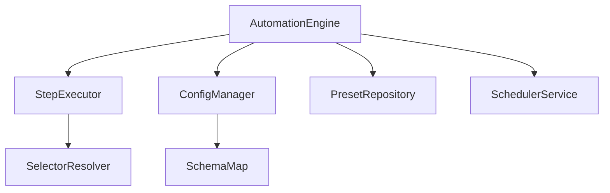
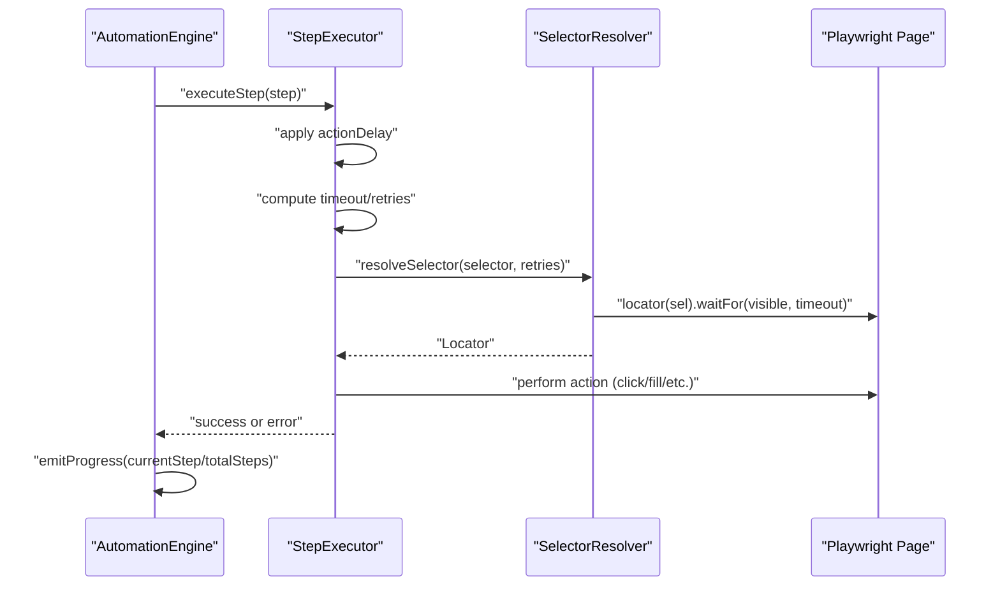
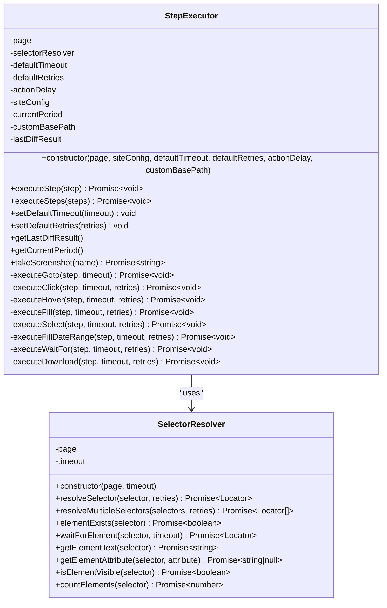
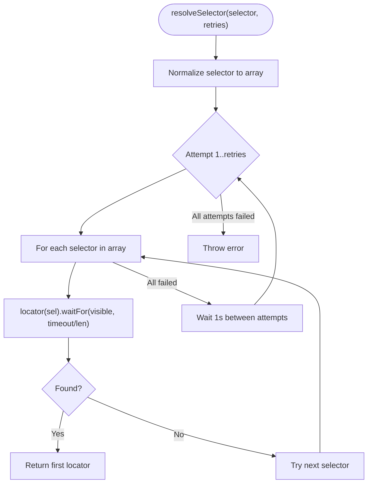
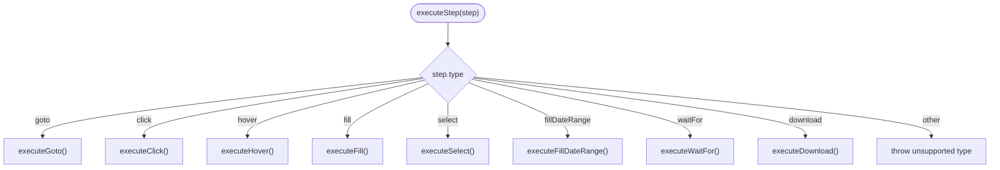
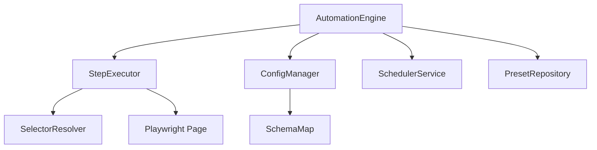

# Step Execution API

<cite>
**Referenced Files in This Document**
- [step-executor.ts](file://app/automation/engine/step-executor.ts)
- [selector-resolver.ts](file://app/automation/engine/selector-resolver.ts)
- [automation-engine.ts](file://app/automation/engine/automation-engine.ts)
- [config-manager.ts](file://app/config/config-manager.ts)
- [SchemaMap.ts](file://app/config/SchemaMap.ts)
- [scheduler-service.ts](file://app/automation/engine/scheduler-service.ts)
- [preset-repository.ts](file://app/automation/engine/preset-repository.ts)
</cite>

## Table of Contents
1. [Introduction](#introduction)
2. [Project Structure](#project-structure)
3. [Core Components](#core-components)
4. [Architecture Overview](#architecture-overview)
5. [Detailed Component Analysis](#detailed-component-analysis)
6. [Dependency Analysis](#dependency-analysis)
7. [Performance Considerations](#performance-considerations)
8. [Troubleshooting Guide](#troubleshooting-guide)
9. [Conclusion](#conclusion)
10. [Appendices](#appendices)

## Introduction
This document provides comprehensive API documentation for the StepExecutor class and the step execution system. It explains the executeStep() method, step type implementations, retry logic mechanisms, error handling, timeout management, progress tracking, and selector resolution patterns. It also covers step configuration schemas, custom step implementations, step chaining patterns, and the integration with the broader automation workflow.

## Project Structure
The step execution system resides in the automation engine module and integrates with configuration management, scheduling, and preset repositories. The core files involved are:
- StepExecutor: orchestrates step execution and retries
- SelectorResolver: resolves CSS selectors with fallback and visibility checks
- AutomationEngine: coordinates site execution, progress emission, and session management
- ConfigManager: validates and manages site and app configurations
- SchemaMap: defines schema mapping for snapshot policies
- SchedulerService: schedules automated runs
- PresetRepository: manages presets

**Diagram sources**
- [automation-engine.ts](file://app/automation/engine/automation-engine.ts#L324-L331)
- [step-executor.ts](file://app/automation/engine/step-executor.ts#L44-L44)
- [selector-resolver.ts](file://app/automation/engine/selector-resolver.ts#L8-L11)
- [config-manager.ts](file://app/config/config-manager.ts#L85-L131)
- [SchemaMap.ts](file://app/config/SchemaMap.ts#L1-L13)
- [scheduler-service.ts](file://app/automation/engine/scheduler-service.ts#L6-L33)
- [preset-repository.ts](file://app/automation/engine/preset-repository.ts#L4-L32)

**Section sources**
- [automation-engine.ts](file://app/automation/engine/automation-engine.ts#L324-L331)
- [step-executor.ts](file://app/automation/engine/step-executor.ts#L44-L44)
- [selector-resolver.ts](file://app/automation/engine/selector-resolver.ts#L8-L11)
- [config-manager.ts](file://app/config/config-manager.ts#L85-L131)
- [SchemaMap.ts](file://app/config/SchemaMap.ts#L1-L13)
- [scheduler-service.ts](file://app/automation/engine/scheduler-service.ts#L6-L33)
- [preset-repository.ts](file://app/automation/engine/preset-repository.ts#L4-L32)

## Core Components
- StepExecutor: central orchestrator for step execution with retry logic, timeouts, and selector resolution integration
- SelectorResolver: robust selector resolution with fallback arrays, visibility checks, and retry loops
- AutomationEngine: higher-level orchestration, progress tracking, session management, and integration with login handlers
- ConfigManager: validates and normalizes configuration including site steps and app-wide defaults
- SchemaMap: schema contract for snapshot policies
- SchedulerService: automated scheduling of preset-based runs
- PresetRepository: CRUD operations for presets

Key responsibilities:
- StepExecutor: executes individual steps, applies delays, manages timeouts/retries, and handles special logic for date ranges and downloads
- SelectorResolver: resolves selectors with multiple attempts and fallbacks, verifies visibility, and exposes helpers for existence and attributes
- AutomationEngine: creates StepExecutor instances, emits progress events, handles session expiration, and coordinates site execution

**Section sources**
- [step-executor.ts](file://app/automation/engine/step-executor.ts#L25-L54)
- [selector-resolver.ts](file://app/automation/engine/selector-resolver.ts#L4-L11)
- [automation-engine.ts](file://app/automation/engine/automation-engine.ts#L50-L57)

## Architecture Overview
The step execution pipeline integrates the AutomationEngine with the StepExecutor and SelectorResolver. The AutomationEngine initializes the browser context, performs login, and iterates through configured steps, emitting progress updates. The StepExecutor delegates selector resolution to SelectorResolver and executes actions with configurable timeouts and retries.

**Diagram sources**
- [automation-engine.ts](file://app/automation/engine/automation-engine.ts#L377-L388)
- [step-executor.ts](file://app/automation/engine/step-executor.ts#L59-L110)
- [selector-resolver.ts](file://app/automation/engine/selector-resolver.ts#L17-L48)

## Detailed Component Analysis

### StepExecutor API
The StepExecutor class encapsulates step execution logic, selector resolution, and retry mechanisms.

- Constructor parameters:
  - page: Playwright Page instance
  - siteConfig: Site configuration (used for snapshot policy integration)
  - defaultTimeout: default action timeout
  - defaultRetries: default retry count
  - actionDelay: delay between actions
  - customBasePath: optional base path for downloads

- Public methods:
  - executeStep(step): executes a single step with retries and error handling
  - executeSteps(steps): executes a sequence of steps with strict failure propagation
  - setDefaultTimeout(timeout): updates default timeout and reinitializes SelectorResolver
  - setDefaultRetries(retries): updates default retry count
  - getLastDiffResult(): returns last snapshot diff result (for SSP)
  - getCurrentPeriod(): returns detected period (for SSP)
  - takeScreenshot(name): captures a screenshot and returns path

- Private methods (step implementations):
  - executeGoto(step, timeout)
  - executeClick(step, timeout, retries)
  - executeHover(step, timeout, retries)
  - executeFill(step, timeout, retries)
  - executeSelect(step, timeout, retries)
  - executeFillDateRange(step, timeout, retries)
  - executeWaitFor(step, timeout, retries)
  - executeDownload(step, timeout, retries)

- Retry and timeout logic:
  - Uses step.timeout or falls back to defaultTimeout
  - Uses step.retries or falls back to defaultRetries
  - Action delay applied before each step
  - SelectorResolver attempts multiple selectors and retries with small delays

- Specialized behaviors:
  - Date token resolution for fillDateRange (e.g., [MES_ATUAL], [TRIM_ATUAL])
  - Period detection for SSP (monthly or quarterly periods)
  - Download handling with snapshot policy integration and diff engine
  - Page stability checks and responsiveness verification

**Diagram sources**
- [step-executor.ts](file://app/automation/engine/step-executor.ts#L25-L616)
- [selector-resolver.ts](file://app/automation/engine/selector-resolver.ts#L4-L135)

**Section sources**
- [step-executor.ts](file://app/automation/engine/step-executor.ts#L25-L110)
- [step-executor.ts](file://app/automation/engine/step-executor.ts#L137-L578)
- [selector-resolver.ts](file://app/automation/engine/selector-resolver.ts#L17-L94)

### Selector Resolution Patterns
SelectorResolver implements robust resolution with fallback arrays and retry logic:
- Accepts a single selector or an array of selectors
- Attempts each selector until one becomes visible within timeout
- Retries the entire selector list up to retries times with small delays
- Provides helpers for existence checks, attribute retrieval, and visibility verification

**Diagram sources**
- [selector-resolver.ts](file://app/automation/engine/selector-resolver.ts#L17-L48)

**Section sources**
- [selector-resolver.ts](file://app/automation/engine/selector-resolver.ts#L17-L48)

### Step Type Implementations
Supported step types and their behaviors:
- goto: navigates to URL with networkidle wait and small stabilization delay
- click/hover: resolves selector and performs action with timeout
- fill: resolves selector, resolves date tokens in value, fills field
- select: tries label selection, falls back to value selection
- fillDateRange: resolves date tokens/ranges, supports two selectors (start/end), formats dates appropriately, detects period
- waitFor: waits for element and verifies page responsiveness
- download: resolves selector, ensures target directory exists, handles target="_blank", saves file, integrates with snapshot policy and diff engine

**Diagram sources**
- [step-executor.ts](file://app/automation/engine/step-executor.ts#L72-L99)

**Section sources**
- [step-executor.ts](file://app/automation/engine/step-executor.ts#L137-L578)

### Retry Logic Mechanisms
Retry behavior:
- SelectorResolver: retries entire selector list up to retries times with 1s delay between attempts
- StepExecutor: applies retries to selector resolution for click/hover/fill/select/fillDateRange/waitFor/download
- Soft-fail: if continueOnError is true, step failures are logged and ignored; otherwise, exceptions propagate

Timeout management:
- Uses step.timeout or falls back to defaultTimeout
- SelectorResolver divides timeout among multiple selectors
- Additional stabilization waits after certain actions

**Section sources**
- [selector-resolver.ts](file://app/automation/engine/selector-resolver.ts#L20-L45)
- [step-executor.ts](file://app/automation/engine/step-executor.ts#L68-L110)

### Error Handling and Progress Tracking
Error handling:
- StepExecutor wraps execution in try/catch; if continueOnError is false, errors are rethrown
- SelectorResolver throws descriptive errors when all attempts fail
- AutomationEngine catches errors, emits progress with error messages, and captures screenshots

Progress tracking:
- AutomationEngine emits progress events with currentStep, totalSteps, stepType, and percentage
- UI receives progress updates to reflect execution state

**Section sources**
- [step-executor.ts](file://app/automation/engine/step-executor.ts#L102-L110)
- [automation-engine.ts](file://app/automation/engine/automation-engine.ts#L377-L388)
- [automation-engine.ts](file://app/automation/engine/automation-engine.ts#L426-L434)

### Step Configuration Schemas
Step schema validation (from ConfigManager):
- type: enum ['goto','click','hover','fill','fillDateRange','select','waitFor','download']
- selector: string or string[]
- value: optional string
- timeout: optional number
- retries: optional number
- continueOnError: optional boolean (defaults to false)

SiteConfig schema includes:
- steps: array of validated step objects
- reportType and primaryKeys: required for snapshot policy integration
- downloadPath and renamePattern: optional

**Section sources**
- [config-manager.ts](file://app/config/config-manager.ts#L16-L23)
- [config-manager.ts](file://app/config/config-manager.ts#L8-L33)

### Selector Resolver Integration
Integration points:
- StepExecutor passes selector and retries to SelectorResolver
- SelectorResolver returns Playwright Locators for actions
- SelectorResolver provides elementExists, waitForElement, and attribute helpers

**Section sources**
- [step-executor.ts](file://app/automation/engine/step-executor.ts#L157-L159)
- [selector-resolver.ts](file://app/automation/engine/selector-resolver.ts#L17-L48)

### Step Chaining and Custom Implementations
Step chaining:
- executeSteps() iterates through steps sequentially, throwing immediately on failure
- AutomationEngine processes each step in order and emits progress for each

Custom step implementations:
- Extend StepExecutor with new private methods mirroring existing patterns
- Add new type to Step.type enum and switch-case in executeStep()
- Implement selector resolution and action logic respecting timeout/retry semantics

Best practices:
- Always resolve selectors via SelectorResolver
- Respect actionDelay between steps
- Use continueOnError judiciously for non-critical steps
- Implement proper error logging and screenshots on failure

**Section sources**
- [step-executor.ts](file://app/automation/engine/step-executor.ts#L583-L600)
- [automation-engine.ts](file://app/automation/engine/automation-engine.ts#L347-L390)

### Relationship to Broader Automation Workflow
- AutomationEngine constructs StepExecutor with site configuration and global defaults
- Executes steps in sequence, handling session expiration and reauthentication
- Emits progress events consumed by UI
- Integrates with snapshot policy and diff engine for download steps

**Section sources**
- [automation-engine.ts](file://app/automation/engine/automation-engine.ts#L324-L331)
- [automation-engine.ts](file://app/automation/engine/automation-engine.ts#L347-L390)

## Dependency Analysis
The StepExecutor depends on SelectorResolver and integrates with Playwright. AutomationEngine composes these components and manages configuration and scheduling.

**Diagram sources**
- [step-executor.ts](file://app/automation/engine/step-executor.ts#L27-L44)
- [selector-resolver.ts](file://app/automation/engine/selector-resolver.ts#L5-L11)
- [automation-engine.ts](file://app/automation/engine/automation-engine.ts#L324-L331)
- [config-manager.ts](file://app/config/config-manager.ts#L85-L131)
- [SchemaMap.ts](file://app/config/SchemaMap.ts#L1-L13)
- [scheduler-service.ts](file://app/automation/engine/scheduler-service.ts#L6-L33)
- [preset-repository.ts](file://app/automation/engine/preset-repository.ts#L4-L32)

**Section sources**
- [step-executor.ts](file://app/automation/engine/step-executor.ts#L27-L44)
- [selector-resolver.ts](file://app/automation/engine/selector-resolver.ts#L5-L11)
- [automation-engine.ts](file://app/automation/engine/automation-engine.ts#L324-L331)
- [config-manager.ts](file://app/config/config-manager.ts#L85-L131)
- [SchemaMap.ts](file://app/config/SchemaMap.ts#L1-L13)
- [scheduler-service.ts](file://app/automation/engine/scheduler-service.ts#L6-L33)
- [preset-repository.ts](file://app/automation/engine/preset-repository.ts#L4-L32)

## Performance Considerations
- Action delays: actionDelay introduces predictable pacing; tune for stability vs. speed
- Selector retries: multiple attempts improve resilience but add latency; balance retries and timeouts
- Page stability: waitForPageStability and verifyPageResponsiveness reduce flakiness
- Download handling: ensures directories exist before clicking to prevent errors
- Global timeout: AutomationEngine enforces a 2-hour cap to prevent runaway processes

## Troubleshooting Guide
Common issues and resolutions:
- Selector not found: verify selector correctness; use SelectorResolver.elementExists; increase retries
- Element not visible: ensure waitForElement precedes actions; check page responsiveness
- Download failures: confirm target directory creation; handle target="_blank"; validate snapshot policy paths
- Session expiration: AutomationEngine automatically reauthenticates; ensure context remains open
- Soft-fail behavior: set continueOnError for non-critical steps to continue execution

**Section sources**
- [selector-resolver.ts](file://app/automation/engine/selector-resolver.ts#L71-L78)
- [step-executor.ts](file://app/automation/engine/step-executor.ts#L464-L578)
- [automation-engine.ts](file://app/automation/engine/automation-engine.ts#L350-L375)

## Conclusion
The StepExecutor and SelectorResolver provide a robust foundation for declarative, resilient step-based automation. With configurable timeouts, retries, and comprehensive error handling, the system supports complex workflows while maintaining reliability. Integration with AutomationEngine, configuration management, and scheduling enables scalable, production-grade automation.

## Appendices

### Step Configuration Reference
- type: 'goto' | 'click' | 'hover' | 'fill' | 'fillDateRange' | 'select' | 'waitFor' | 'download'
- selector: string or string[] (fallback selectors)
- value: optional string (text or date tokens)
- timeout: optional number (milliseconds)
- retries: optional number (retry attempts)
- continueOnError: optional boolean (soft-fail behavior)

**Section sources**
- [config-manager.ts](file://app/config/config-manager.ts#L16-L23)

### Example: Custom Step Implementation
Steps to add a new step type:
1. Define new type in Step.type enum
2. Add switch-case branch in executeStep()
3. Implement private method with selector resolution and action logic
4. Respect timeout/retry semantics and logging
5. Integrate with continueOnError

**Section sources**
- [step-executor.ts](file://app/automation/engine/step-executor.ts#L72-L99)
- [step-executor.ts](file://app/automation/engine/step-executor.ts#L583-L600)