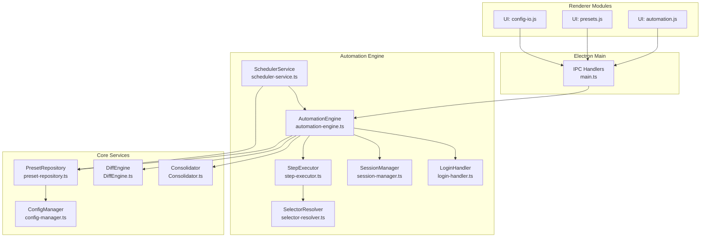
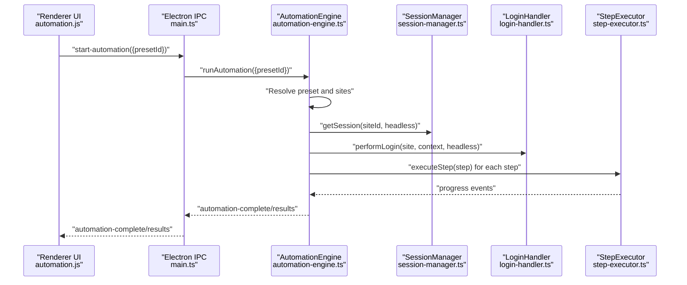
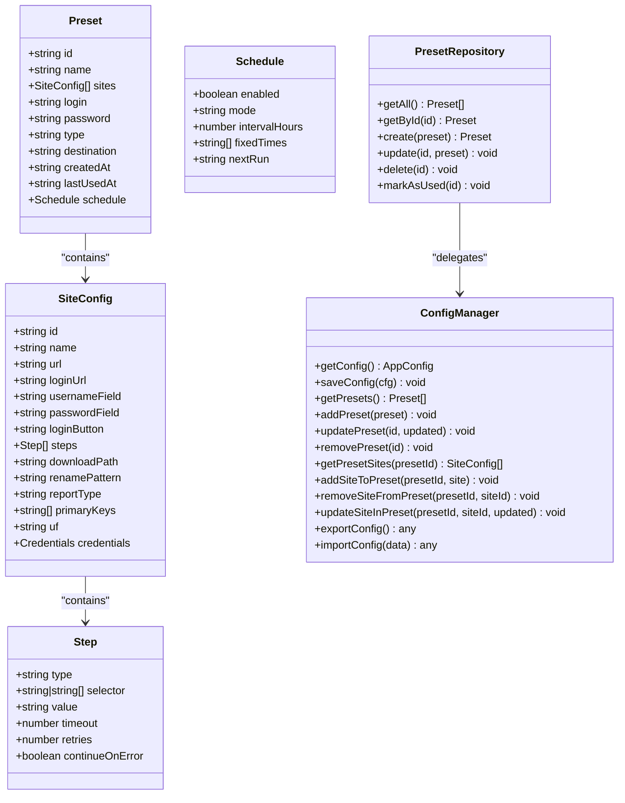
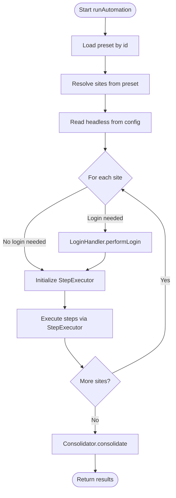
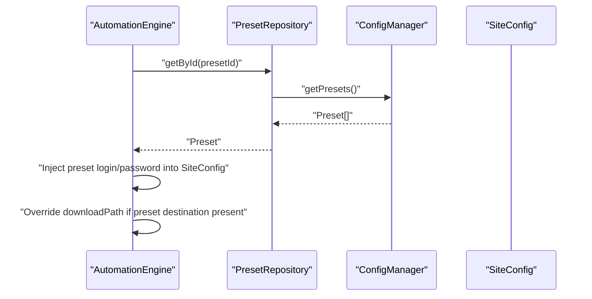
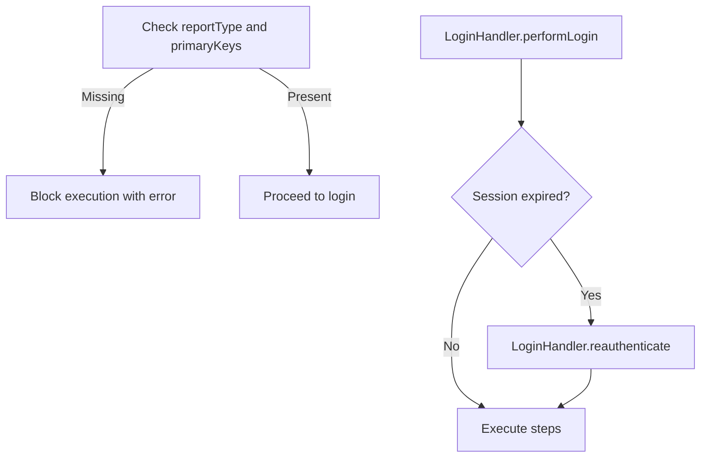
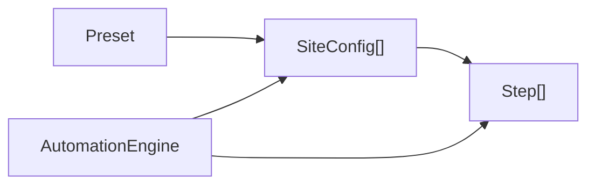
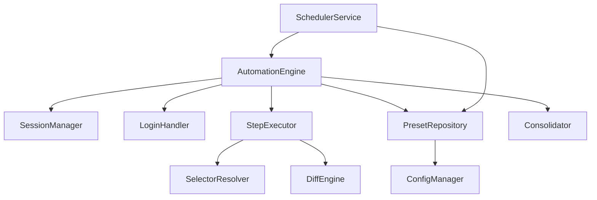

# Workflow Management API

<cite>
**Referenced Files in This Document**
- [automation-engine.ts](file://app/automation/engine/automation-engine.ts)
- [preset-repository.ts](file://app/automation/engine/preset-repository.ts)
- [scheduler-service.ts](file://app/automation/engine/scheduler-service.ts)
- [step-executor.ts](file://app/automation/engine/step-executor.ts)
- [selector-resolver.ts](file://app/automation/engine/selector-resolver.ts)
- [config-manager.ts](file://app/config/config-manager.ts)
- [session-manager.ts](file://app/automation/sessions/session-manager.ts)
- [login-handler.ts](file://app/automation/sessions/login-handler.ts)
- [Consolidator.ts](file://app/core/consolidation/Consolidator.ts)
- [DiffEngine.ts](file://app/core/diff/DiffEngine.ts)
- [main.ts](file://app/electron/main.ts)
- [automation.js](file://app/renderer/modules/automation.js)
- [presets.js](file://app/renderer/modules/presets.js)
- [config-io.js](file://app/renderer/modules/config-io.js)
- [MIGRATION_PRESET_ISOLATION.md](file://MIGRATION_PRESET_ISOLATION.md)
</cite>

## Table of Contents
1. [Introduction](#introduction)
2. [Project Structure](#project-structure)
3. [Core Components](#core-components)
4. [Architecture Overview](#architecture-overview)
5. [Detailed Component Analysis](#detailed-component-analysis)
6. [Dependency Analysis](#dependency-analysis)
7. [Performance Considerations](#performance-considerations)
8. [Troubleshooting Guide](#troubleshooting-guide)
9. [Conclusion](#conclusion)
10. [Appendices](#appendices)

## Introduction
This document describes the Workflow Management API for the automation platform, focusing on preset handling, workflow orchestration, and execution context management. It explains how presets encapsulate isolated site configurations and workflows, how the engine validates and executes them, and how scheduling and consolidation integrate with the system. It also documents migration strategies for preset isolation and configuration persistence.

## Project Structure
The system is organized around a modular architecture:
- Electron main process exposes IPC APIs for UI and automation control.
- Renderer modules manage UI interactions and delegate to IPC handlers.
- Automation engine orchestrates browser sessions, login, step execution, and post-processing.
- Configuration manager centralizes schema validation, migration, and persistence.
- Supporting services handle scheduling, session lifecycle, and snapshot diff/consolidation.

**Diagram sources**
- [main.ts](file://app/electron/main.ts#L117-L281)
- [automation-engine.ts](file://app/automation/engine/automation-engine.ts#L50-L611)
- [step-executor.ts](file://app/automation/engine/step-executor.ts#L25-L616)
- [selector-resolver.ts](file://app/automation/engine/selector-resolver.ts#L4-L135)
- [scheduler-service.ts](file://app/automation/engine/scheduler-service.ts#L6-L145)
- [session-manager.ts](file://app/automation/sessions/session-manager.ts#L67-L225)
- [login-handler.ts](file://app/automation/sessions/login-handler.ts#L13-L364)
- [config-manager.ts](file://app/config/config-manager.ts#L85-L408)
- [preset-repository.ts](file://app/automation/engine/preset-repository.ts#L4-L34)
- [DiffEngine.ts](file://app/core/diff/DiffEngine.ts#L23-L230)
- [Consolidator.ts](file://app/core/consolidation/Consolidator.ts#L20-L138)

**Section sources**
- [main.ts](file://app/electron/main.ts#L117-L281)
- [automation-engine.ts](file://app/automation/engine/automation-engine.ts#L50-L611)
- [config-manager.ts](file://app/config/config-manager.ts#L85-L408)

## Core Components
- AutomationEngine: Orchestrates end-to-end automation runs, manages browser contexts, login, step execution, progress events, and consolidation.
- StepExecutor: Executes individual workflow steps against a Playwright page, with robust selector resolution, retry logic, and SSP-aware download handling.
- SelectorResolver: Resolves and waits for Playwright locators with retries and fallback strategies.
- SchedulerService: Periodically checks preset schedules and triggers automation runs.
- SessionManager: Manages persistent browser contexts per site, ensuring isolation and reuse.
- LoginHandler: Handles login flows, captcha detection, and reauthentication during runs.
- ConfigManager: Validates, migrates, and persists configuration and presets using Zod schemas.
- PresetRepository: CRUD operations for presets backed by ConfigManager.
- Consolidator: Merges snapshot outputs into consolidated master files.
- DiffEngine: Computes diffs between snapshots and maintains metadata.

**Section sources**
- [automation-engine.ts](file://app/automation/engine/automation-engine.ts#L50-L611)
- [step-executor.ts](file://app/automation/engine/step-executor.ts#L25-L616)
- [selector-resolver.ts](file://app/automation/engine/selector-resolver.ts#L4-L135)
- [scheduler-service.ts](file://app/automation/engine/scheduler-service.ts#L6-L145)
- [session-manager.ts](file://app/automation/sessions/session-manager.ts#L67-L225)
- [login-handler.ts](file://app/automation/sessions/login-handler.ts#L13-L364)
- [config-manager.ts](file://app/config/config-manager.ts#L85-L408)
- [preset-repository.ts](file://app/automation/engine/preset-repository.ts#L4-L34)
- [Consolidator.ts](file://app/core/consolidation/Consolidator.ts#L20-L138)
- [DiffEngine.ts](file://app/core/diff/DiffEngine.ts#L23-L230)

## Architecture Overview
The system integrates UI-driven actions with backend automation through IPC. Presets define isolated site lists and credentials, and the engine enforces preset isolation during execution. Scheduling triggers runs automatically, while consolidation aggregates outputs.

**Diagram sources**
- [automation.js](file://app/renderer/modules/automation.js#L7-L45)
- [main.ts](file://app/electron/main.ts#L214-L232)
- [automation-engine.ts](file://app/automation/engine/automation-engine.ts#L62-L238)
- [session-manager.ts](file://app/automation/sessions/session-manager.ts#L103-L138)
- [login-handler.ts](file://app/automation/sessions/login-handler.ts#L28-L77)
- [step-executor.ts](file://app/automation/engine/step-executor.ts#L59-L110)

## Detailed Component Analysis

### Preset Interface and Repository
- Preset schema defines isolated site arrays, credentials, destination, schedule, and metadata. Validation ensures correctness and defaults.
- PresetRepository provides CRUD operations delegating to ConfigManager, including marking presets as used.

**Diagram sources**
- [config-manager.ts](file://app/config/config-manager.ts#L35-L81)
- [preset-repository.ts](file://app/automation/engine/preset-repository.ts#L4-L34)

**Section sources**
- [config-manager.ts](file://app/config/config-manager.ts#L35-L81)
- [preset-repository.ts](file://app/automation/engine/preset-repository.ts#L4-L34)
- [MIGRATION_PRESET_ISOLATION.md](file://MIGRATION_PRESET_ISOLATION.md#L8-L87)

### Workflow Orchestration and Execution Context
- AutomationEngine coordinates:
  - Preset-based site selection and credential injection.
  - Headless/visible mode selection from global config.
  - Session lifecycle via SessionManager.
  - Login and reauthentication via LoginHandler.
  - Step execution via StepExecutor.
  - Progress and completion events to UI.
  - Consolidation and notifications after runs.

**Diagram sources**
- [automation-engine.ts](file://app/automation/engine/automation-engine.ts#L62-L238)
- [login-handler.ts](file://app/automation/sessions/login-handler.ts#L28-L77)
- [step-executor.ts](file://app/automation/engine/step-executor.ts#L59-L110)
- [Consolidator.ts](file://app/core/consolidation/Consolidator.ts#L26-L63)

**Section sources**
- [automation-engine.ts](file://app/automation/engine/automation-engine.ts#L62-L238)
- [session-manager.ts](file://app/automation/sessions/session-manager.ts#L103-L138)
- [login-handler.ts](file://app/automation/sessions/login-handler.ts#L28-L77)
- [step-executor.ts](file://app/automation/engine/step-executor.ts#L59-L110)

### Preset Isolation Mechanisms
- Isolation is enforced by:
  - Storing complete SiteConfig objects inside each Preset (not just IDs).
  - Using preset-specific credentials and destination overrides.
  - Injecting preset credentials into site configs during execution.
  - Auto-creating report-type subfolders when destination is provided.

**Diagram sources**
- [automation-engine.ts](file://app/automation/engine/automation-engine.ts#L92-L146)
- [preset-repository.ts](file://app/automation/engine/preset-repository.ts#L9-L11)
- [config-manager.ts](file://app/config/config-manager.ts#L260-L303)

**Section sources**
- [automation-engine.ts](file://app/automation/engine/automation-engine.ts#L92-L146)
- [MIGRATION_PRESET_ISOLATION.md](file://MIGRATION_PRESET_ISOLATION.md#L8-L87)

### Workflow Validation and Execution Context Management
- Validation:
  - Report-type sites require primary keys; otherwise, execution is blocked for safety.
  - Step types and parameters are validated by Zod schemas.
- Execution context:
  - Persistent browser contexts per site to maintain sessions.
  - Automatic reauthentication when session expires.
  - Global timeout protection and watchdogs.

**Diagram sources**
- [automation-engine.ts](file://app/automation/engine/automation-engine.ts#L265-L268)
- [login-handler.ts](file://app/automation/sessions/login-handler.ts#L333-L360)

**Section sources**
- [automation-engine.ts](file://app/automation/engine/automation-engine.ts#L265-L268)
- [login-handler.ts](file://app/automation/sessions/login-handler.ts#L288-L360)

### Relationship Between Presets, Sites, and Automation Workflows
- Each Preset contains a list of SiteConfig objects with their own steps and optional credentials.
- During automation, the engine:
  - Selects sites from the preset.
  - Injects preset credentials into each site temporarily.
  - Executes each site’s steps sequentially.
  - Consolidates outputs and notifies results.

**Diagram sources**
- [config-manager.ts](file://app/config/config-manager.ts#L39-L42)
- [automation-engine.ts](file://app/automation/engine/automation-engine.ts#L92-L146)

**Section sources**
- [config-manager.ts](file://app/config/config-manager.ts#L39-L42)
- [automation-engine.ts](file://app/automation/engine/automation-engine.ts#L92-L146)

### Examples

#### Example: Preset Creation and Workflow Modification
- Create a preset with name, login, password, type, and destination.
- Add sites to the preset; each site includes steps and optional report metadata.
- Modify steps or credentials; updates are persisted via ConfigManager.

**Section sources**
- [presets.js](file://app/renderer/modules/presets.js#L154-L208)
- [config-manager.ts](file://app/config/config-manager.ts#L220-L232)
- [config-manager.ts](file://app/config/config-manager.ts#L265-L278)

#### Example: Automated Workflow Execution via Scheduler
- Enable preset schedule (interval or fixed times).
- SchedulerService periodically checks and triggers AutomationEngine.
- Results are consolidated and notifications sent.

**Section sources**
- [scheduler-service.ts](file://app/automation/engine/scheduler-service.ts#L38-L96)
- [scheduler-service.ts](file://app/automation/engine/scheduler-service.ts#L101-L142)
- [automation-engine.ts](file://app/automation/engine/automation-engine.ts#L216-L218)

#### Example: SSP-Aware Download and Diff
- StepExecutor detects reportType and applies Safe Snapshot Policy.
- DiffEngine computes added/removed rows and updates snapshot metadata.
- Consolidator merges outputs into master files.

**Section sources**
- [step-executor.ts](file://app/automation/engine/step-executor.ts#L507-L556)
- [DiffEngine.ts](file://app/core/diff/DiffEngine.ts#L55-L219)
- [Consolidator.ts](file://app/core/consolidation/Consolidator.ts#L26-L63)

### Migration System and Configuration Persistence
- Automatic migration moves legacy global site lists into preset-contained site objects.
- Paths are normalized and user profile remapping is handled for cross-user compatibility.
- Export/import preserves presets and their associated sites.

**Section sources**
- [config-manager.ts](file://app/config/config-manager.ts#L133-L190)
- [config-manager.ts](file://app/config/config-manager.ts#L334-L394)
- [config-io.js](file://app/renderer/modules/config-io.js#L9-L43)

## Dependency Analysis
- Coupling:
  - AutomationEngine depends on SessionManager, LoginHandler, StepExecutor, PresetRepository, and Consolidator.
  - PresetRepository depends on ConfigManager for persistence.
  - SchedulerService depends on AutomationEngine and PresetRepository.
- Cohesion:
  - Each module encapsulates a single responsibility (execution, session, login, scheduling, persistence).
- External dependencies:
  - Playwright for browser automation.
  - XLSX for spreadsheet processing.
  - Zod for schema validation.

**Diagram sources**
- [automation-engine.ts](file://app/automation/engine/automation-engine.ts#L50-L611)
- [preset-repository.ts](file://app/automation/engine/preset-repository.ts#L4-L34)
- [scheduler-service.ts](file://app/automation/engine/scheduler-service.ts#L6-L145)
- [step-executor.ts](file://app/automation/engine/step-executor.ts#L25-L616)
- [selector-resolver.ts](file://app/automation/engine/selector-resolver.ts#L4-L135)
- [Consolidator.ts](file://app/core/consolidation/Consolidator.ts#L20-L138)
- [DiffEngine.ts](file://app/core/diff/DiffEngine.ts#L23-L230)

**Section sources**
- [automation-engine.ts](file://app/automation/engine/automation-engine.ts#L50-L611)
- [scheduler-service.ts](file://app/automation/engine/scheduler-service.ts#L6-L145)

## Performance Considerations
- Browser contexts are reused per site to reduce overhead.
- Selector resolution retries and page stability checks improve reliability.
- Consolidation batches outputs to minimize I/O.
- Watchdog timers and global timeouts prevent runaway executions.

[No sources needed since this section provides general guidance]

## Troubleshooting Guide
- Login failures:
  - Verify credentials and selectors in SiteConfig.
  - Captcha detection triggers manual login; run in visible mode.
- Session expiration:
  - Engine attempts reauthentication; if context closed, restart automation.
- Execution stuck:
  - Global timeout and watchdogs protect the system.
- Path resolution errors:
  - Use ConfigManager.resolvePath to normalize environment variables and user paths.

**Section sources**
- [login-handler.ts](file://app/automation/sessions/login-handler.ts#L56-L76)
- [login-handler.ts](file://app/automation/sessions/login-handler.ts#L333-L360)
- [automation-engine.ts](file://app/automation/engine/automation-engine.ts#L76-L81)
- [config-manager.ts](file://app/config/config-manager.ts#L98-L124)

## Conclusion
The Workflow Management API centers on preset isolation, robust execution orchestration, and safe snapshot diff/consolidation. The system enforces validation, manages execution contexts, and supports automated scheduling and configuration portability through migration and export/import.

[No sources needed since this section summarizes without analyzing specific files]

## Appendices

### API Surface (IPC and Module Interfaces)

- IPC Handlers exposed by Electron main process:
  - get-config, save-config
  - get-presets, save-preset, delete-preset
  - export-config, import-config
  - open-browser-for-login, start-automation, stop-automation
  - get-session-status, delete-session, clear-sessions

- Renderer modules:
  - automation.js: start/stop automation.
  - presets.js: CRUD presets and schedule management.
  - config-io.js: export/import configuration.

**Section sources**
- [main.ts](file://app/electron/main.ts#L119-L281)
- [automation.js](file://app/renderer/modules/automation.js#L7-L58)
- [presets.js](file://app/renderer/modules/presets.js#L17-L413)
- [config-io.js](file://app/renderer/modules/config-io.js#L5-L114)