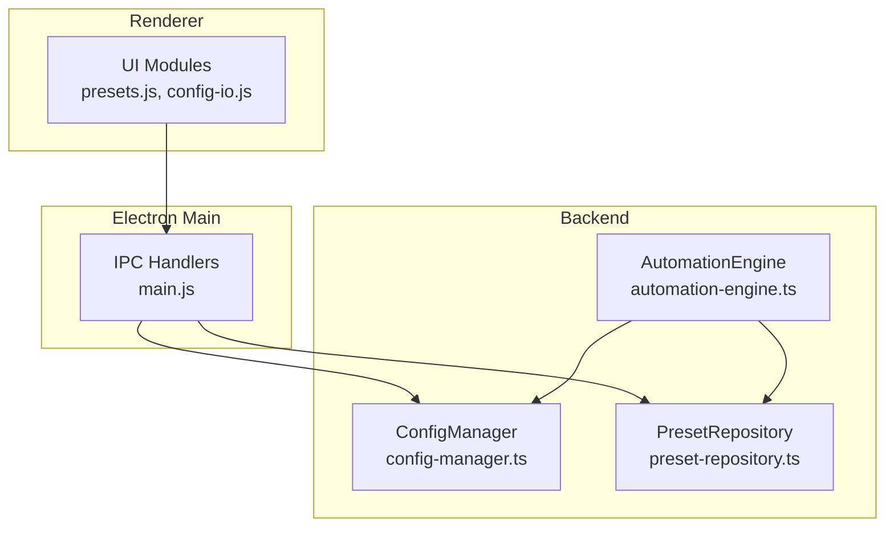
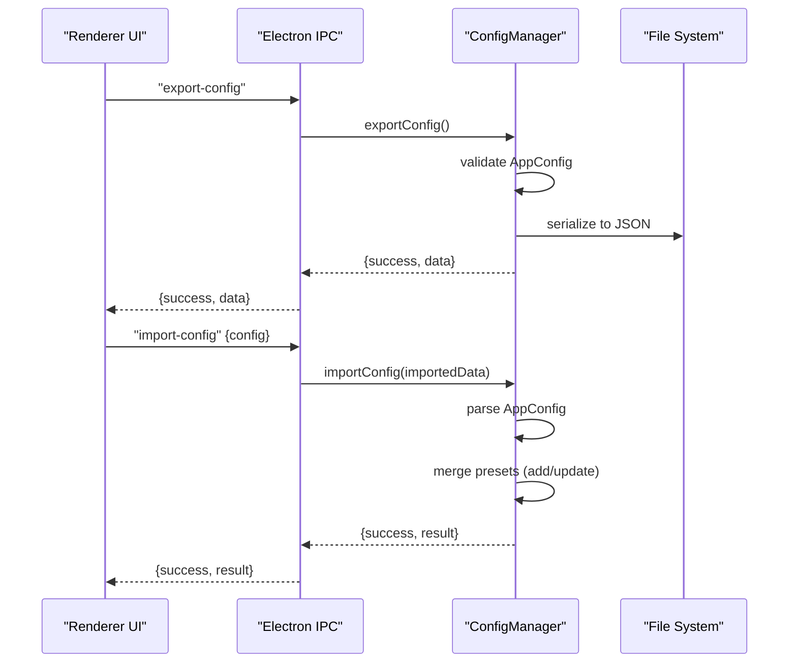
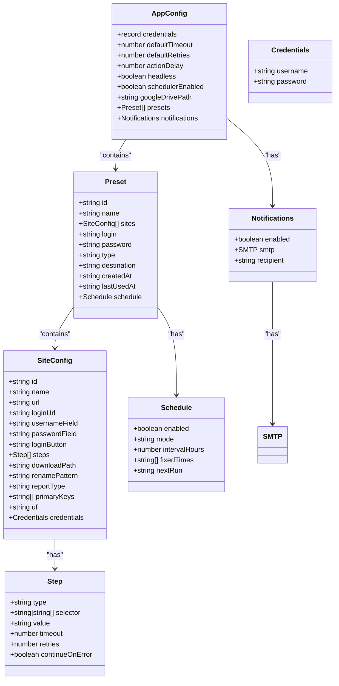
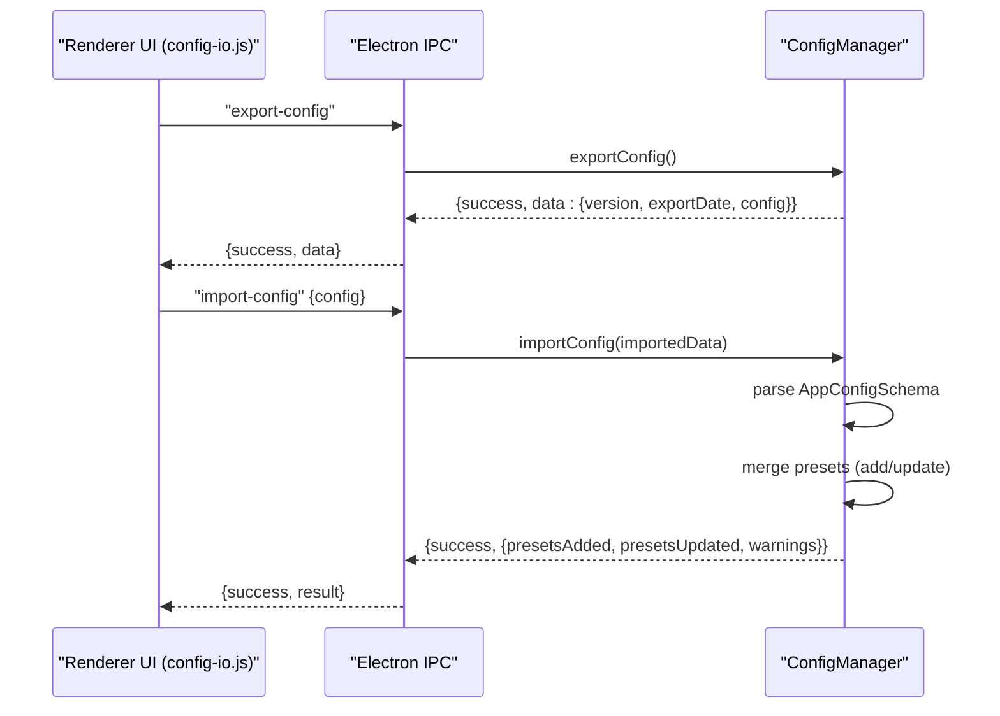
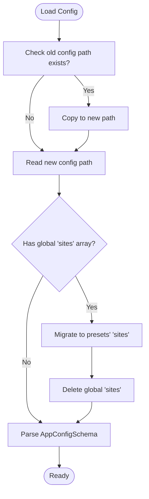
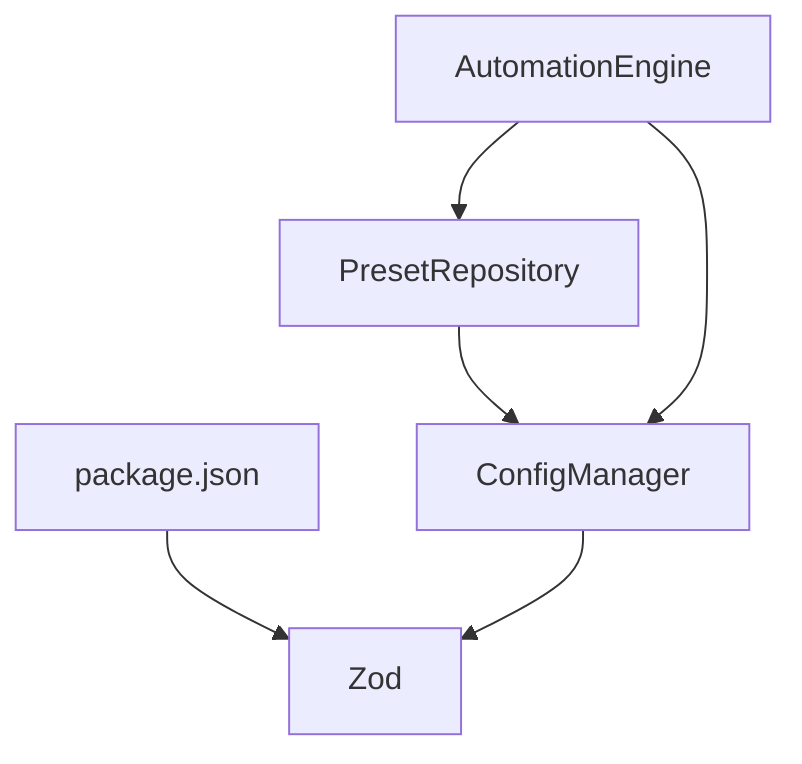

# Configuration API

<cite>
**Referenced Files in This Document**
- [config-manager.ts](file://app/config/config-manager.ts)
- [SchemaMap.ts](file://app/config/SchemaMap.ts)
- [app-config.json](file://app/config/app-config.json)
- [schemaMaps.json](file://app/storage/schemaMaps.json)
- [config-io.js](file://app/renderer/modules/config-io.js)
- [presets.js](file://app/renderer/modules/presets.js)
- [main.js](file://app/electron/main.ts)
- [automation-engine.ts](file://app/automation/engine/automation-engine.ts)
- [preset-repository.ts](file://app/automation/engine/preset-repository.ts)
- [MIGRATION_PRESET_ISOLATION.md](file://MIGRATION_PRESET_ISOLATION.md)
- [package.json](file://package.json)
</cite>

## Table of Contents
1. [Introduction](#introduction)
2. [Project Structure](#project-structure)
3. [Core Components](#core-components)
4. [Architecture Overview](#architecture-overview)
5. [Detailed Component Analysis](#detailed-component-analysis)
6. [Dependency Analysis](#dependency-analysis)
7. [Performance Considerations](#performance-considerations)
8. [Troubleshooting Guide](#troubleshooting-guide)
9. [Conclusion](#conclusion)
10. [Appendices](#appendices)

## Introduction
This document describes the Configuration API for Automatizador Bravo, focusing on the Zod-based schema validation system, configuration persistence, export/import capabilities, preset isolation, and migration procedures. It provides a comprehensive schema reference, validation rules, defaults, and practical workflows for configuration manipulation within the broader automation system.

## Project Structure
The configuration system spans three layers:
- Renderer UI modules orchestrate configuration operations (export/import, preset CRUD).
- Electron main process exposes IPC handlers to the renderer.
- Backend configuration manager persists and validates configuration using Zod schemas.

**Diagram sources**
- [main.js](file://app/electron/main.ts#L117-L164)
- [config-manager.ts](file://app/config/config-manager.ts#L85-L398)
- [preset-repository.ts](file://app/automation/engine/preset-repository.ts#L1-L34)
- [automation-engine.ts](file://app/automation/engine/automation-engine.ts#L50-L120)

**Section sources**
- [main.js](file://app/electron/main.ts#L117-L164)
- [config-manager.ts](file://app/config/config-manager.ts#L85-L398)
- [preset-repository.ts](file://app/automation/engine/preset-repository.ts#L1-L34)
- [automation-engine.ts](file://app/automation/engine/automation-engine.ts#L50-L120)

## Core Components
- Zod schemas define strict validation for AppConfig, Preset, and SiteConfig.
- ConfigManager centralizes loading, saving, exporting, importing, and migration logic.
- PresetRepository provides CRUD over presets via ConfigManager.
- Electron IPC handlers bridge renderer UI to backend.
- Renderer modules expose preset management and configuration export/import.

Key responsibilities:
- Validation: AppConfigSchema, PresetSchema, SiteConfigSchema.
- Persistence: AppConfig persisted to disk; presets isolated per preset.
- Migration: Automatic migration from legacy config location and structure.
- Export/Import: Serializable config envelope with warnings and counts.

**Section sources**
- [config-manager.ts](file://app/config/config-manager.ts#L7-L81)
- [config-manager.ts](file://app/config/config-manager.ts#L133-L190)
- [config-manager.ts](file://app/config/config-manager.ts#L329-L394)
- [preset-repository.ts](file://app/automation/engine/preset-repository.ts#L1-L34)
- [main.js](file://app/electron/main.ts#L117-L164)

## Architecture Overview
The configuration lifecycle:
- Load: ConfigManager reads AppConfig from platform-specific config path, applies migrations, and validates via Zod.
- Save: Validates incoming AppConfig and writes to disk.
- Preset CRUD: Uses PresetRepository to add/update/remove presets; sites are stored within each preset.
- Export/Import: Renderer triggers IPC to export/import a serializable config envelope; backend merges changes and returns warnings.

**Diagram sources**
- [config-manager.ts](file://app/config/config-manager.ts#L334-L394)
- [main.js](file://app/electron/main.ts#L147-L164)

**Section sources**
- [config-manager.ts](file://app/config/config-manager.ts#L334-L394)
- [main.js](file://app/electron/main.ts#L147-L164)

## Detailed Component Analysis

### Zod Schema Validation System
The system defines three core schemas:
- AppConfigSchema: Top-level application configuration with defaults and nested notifications.
- PresetSchema: Defines preset structure, including isolated sites, scheduling, and credentials.
- SiteConfigSchema: Defines site steps, selectors, and optional fields.

Validation characteristics:
- Strict parsing with Zod; throws on invalid data.
- Defaults applied during parsing (e.g., booleans, numbers, nested objects).
- UUID enforcement for preset IDs; enums constrain values (e.g., schedule modes).

**Diagram sources**
- [config-manager.ts](file://app/config/config-manager.ts#L7-L81)

**Section sources**
- [config-manager.ts](file://app/config/config-manager.ts#L7-L81)

### Configuration Persistence Patterns
- Path resolution: Environment variable substitution and user-home normalization.
- Load: Reads from platform-specific config path; migrates from legacy location if present.
- Save: Writes validated AppConfig to disk; ensures directory exists.
- Defaults: Applied during parsing; missing fields fallback to defaults.

Migration highlights:
- Automatic migration from old config path to new location.
- Migration of global sites array into preset-level sites.
- Backward compatibility maintained via legacy getters.

**Section sources**
- [config-manager.ts](file://app/config/config-manager.ts#L98-L124)
- [config-manager.ts](file://app/config/config-manager.ts#L133-L190)
- [MIGRATION_PRESET_ISOLATION.md](file://MIGRATION_PRESET_ISOLATION.md#L1-L242)

### Export/Import Functionality
- Export: Returns a versioned envelope containing export date and AppConfig snapshot.
- Import: Parses imported data against AppConfigSchema, merges presets by ID, and returns counts plus warnings.

**Diagram sources**
- [config-io.js](file://app/renderer/modules/config-io.js#L9-L43)
- [config-io.js](file://app/renderer/modules/config-io.js#L48-L113)
- [config-manager.ts](file://app/config/config-manager.ts#L334-L394)
- [main.js](file://app/electron/main.ts#L147-L164)

**Section sources**
- [config-io.js](file://app/renderer/modules/config-io.js#L9-L43)
- [config-io.js](file://app/renderer/modules/config-io.js#L48-L113)
- [config-manager.ts](file://app/config/config-manager.ts#L334-L394)
- [main.js](file://app/electron/main.ts#L147-L164)

### Preset Isolation Mechanisms
- Isolation: Sites are stored within each preset; no global sites array.
- Methods: getPresetSites, addSiteToPreset, removeSiteFromPreset, updateSiteInPreset.
- Automation integration: Engine fetches sites directly from the selected preset.

Benefits:
- Prevents cross-contamination between presets.
- Simplifies portability of presets with embedded sites.
- Eliminates maintenance of separate site registry.

**Section sources**
- [config-manager.ts](file://app/config/config-manager.ts#L258-L308)
- [MIGRATION_PRESET_ISOLATION.md](file://MIGRATION_PRESET_ISOLATION.md#L8-L87)
- [automation-engine.ts](file://app/automation/engine/automation-engine.ts#L91-L111)

### Migration Procedures
- Legacy detection: If old config path exists and new path does not, copy and migrate.
- Sites migration: If global sites array exists, move to each preset’s sites and remove global array.
- Deprecation: Legacy site methods remain for compatibility but are marked deprecated.

**Diagram sources**
- [config-manager.ts](file://app/config/config-manager.ts#L133-L170)
- [MIGRATION_PRESET_ISOLATION.md](file://MIGRATION_PRESET_ISOLATION.md#L19-L43)

**Section sources**
- [config-manager.ts](file://app/config/config-manager.ts#L133-L170)
- [MIGRATION_PRESET_ISOLATION.md](file://MIGRATION_PRESET_ISOLATION.md#L1-L242)

### Data Transformation Processes
- Path resolution: Environment variables and user-home normalization.
- Auto-folder generation: When preset destination and report type are set, engine creates UF-type subfolder for downloads.
- Scheduling: Fixed times rendered and sorted; interval mode supported.

**Section sources**
- [config-manager.ts](file://app/config/config-manager.ts#L98-L124)
- [automation-engine.ts](file://app/automation/engine/automation-engine.ts#L135-L146)
- [presets.js](file://app/renderer/modules/presets.js#L358-L412)

### Error Handling for Invalid Configurations
- Parsing errors: Zod validation failures raise descriptive errors.
- Migration errors: Logged and surfaced to caller.
- Import warnings: Returned alongside counts for user awareness.
- UI feedback: Renderer displays warnings and errors via notifications.

**Section sources**
- [config-manager.ts](file://app/config/config-manager.ts#L186-L189)
- [config-manager.ts](file://app/config/config-manager.ts#L390-L393)
- [config-io.js](file://app/renderer/modules/config-io.js#L39-L42)
- [config-io.js](file://app/renderer/modules/config-io.js#L102-L112)

### Practical Workflows

#### Configuration Manipulation
- Load and save top-level settings (headless, delays, retries, notifications).
- Use renderer’s saveConfig to update AppConfig via IPC.

**Section sources**
- [main.js](file://app/renderer/main.js#L97-L135)
- [main.js](file://app/renderer/main.js#L150-L182)
- [main.js](file://app/electron/main.ts#L119-L126)

#### Preset Creation and Deletion
- Create: Fill preset form; save via IPC; reload lists.
- Delete: Confirm and remove via IPC; refresh UI.

**Section sources**
- [presets.js](file://app/renderer/modules/presets.js#L154-L208)
- [presets.js](file://app/renderer/modules/presets.js#L302-L313)
- [main.js](file://app/electron/main.ts#L129-L145)

#### Preset Site Management
- Add site: Select preset, open site form, save; backend validates and persists within preset.
- Update/remove site: Find by ID and mutate; save triggers persistence.

**Section sources**
- [config-manager.ts](file://app/config/config-manager.ts#L265-L303)
- [MIGRATION_PRESET_ISOLATION.md](file://MIGRATION_PRESET_ISOLATION.md#L44-L87)

#### Export/Import of Presets
- Export: Trigger export; download JSON envelope.
- Import: Select JSON; confirm; merge presets; reflect warnings and counts.

**Section sources**
- [config-io.js](file://app/renderer/modules/config-io.js#L9-L43)
- [config-io.js](file://app/renderer/modules/config-io.js#L48-L113)
- [main.js](file://app/electron/main.ts#L147-L164)

## Dependency Analysis
External dependencies relevant to configuration:
- Zod: Schema validation.
- Playwright: Used by automation engine; influences headless configuration.
- Better-sqlite3, nodemailer, xlsx: Additional integrations; not core to schema validation.

**Diagram sources**
- [package.json](file://package.json#L104-L113)
- [config-manager.ts](file://app/config/config-manager.ts#L1-L7)
- [preset-repository.ts](file://app/automation/engine/preset-repository.ts#L1-L2)
- [automation-engine.ts](file://app/automation/engine/automation-engine.ts#L1-L12)

**Section sources**
- [package.json](file://package.json#L104-L113)
- [config-manager.ts](file://app/config/config-manager.ts#L1-L7)
- [preset-repository.ts](file://app/automation/engine/preset-repository.ts#L1-L2)
- [automation-engine.ts](file://app/automation/engine/automation-engine.ts#L1-L12)

## Performance Considerations
- Validation cost: Zod parsing occurs on load/save and import; keep payload sizes reasonable.
- Disk I/O: Single write per save; batch updates reduce churn.
- Migration: One-time operation; avoid repeated checks after successful migration.

## Troubleshooting Guide
Common issues and resolutions:
- Invalid configuration file: Validate against AppConfigSchema; check for missing or incorrect types.
- Migration failures: Verify old config path presence and permissions; review logs for detailed errors.
- Import conflicts: Review returned warnings to understand which presets were added vs updated.
- Path resolution problems: Ensure environment variables are set and user-home normalization resolves correctly.

**Section sources**
- [config-manager.ts](file://app/config/config-manager.ts#L186-L189)
- [config-manager.ts](file://app/config/config-manager.ts#L390-L393)
- [config-manager.ts](file://app/config/config-manager.ts#L98-L124)

## Conclusion
The Configuration API leverages Zod for robust schema validation, maintains backward compatibility during migrations, and provides safe, isolated preset management. Export/import workflows enable portability and team collaboration. The system balances strong typing with practical defaults and clear error reporting.

## Appendices

### Schema Reference

- AppConfig
  - Fields
    - credentials: Record of strings (optional)
    - defaultTimeout: Number (default 30000)
    - defaultRetries: Number (default 3)
    - actionDelay: Number (default 1000)
    - headless: Boolean (default true)
    - schedulerEnabled: Boolean (default true)
    - googleDrivePath: String (optional)
    - presets: Array of Preset (default [])
    - notifications: Nested object with:
      - enabled: Boolean (default false)
      - smtp: Nested object with:
        - host: String (default "smtp.gmail.com")
        - port: Number (default 465)
        - secure: Boolean (default true)
        - user: String (optional)
        - pass: String (optional)
      - recipient: String (optional)
  - Notes: Nested defaults apply when unspecified.

- Preset
  - Fields
    - id: String (UUID; optional)
    - name: String (required)
    - sites: Array of SiteConfig (default [])
    - login: String (required)
    - password: String (required)
    - type: Enum ["vendas","pedidos","fiscal","outros"] (default "outros")
    - destination: String (optional)
    - createdAt: String (ISO date; optional)
    - lastUsedAt: String (ISO date; optional)
    - schedule: Nested object (optional):
      - enabled: Boolean (default false)
      - mode: Enum ["interval","fixed"] (default "interval")
      - intervalHours: Number (min 1, max 24, default 3)
      - fixedTimes: Array of String (default [])
      - nextRun: String (ISO date; optional)

- SiteConfig
  - Fields
    - id: String (UUID; optional)
    - name: String (required)
    - url: String (URL required)
    - loginUrl: String (URL required)
    - usernameField: String (required)
    - passwordField: String (required)
    - loginButton: String (required)
    - steps: Array of Step (required)
    - downloadPath: String (optional)
    - renamePattern: String (optional)
    - reportType: String (optional)
    - primaryKeys: Array of String (optional)
    - uf: String (default "SC")
    - credentials: Nested object (optional):
      - username: String (required)
      - password: String (required)

- Step
  - Fields
    - type: Enum ["goto","click","hover","fill","fillDateRange","select","waitFor","download"]
    - selector: String or Array of Strings
    - value: String (optional)
    - timeout: Number (optional)
    - retries: Number (optional)
    - continueOnError: Boolean (default false)

- Notifications
  - Fields
    - enabled: Boolean (default false)
    - smtp: Host, port, secure, user, pass
    - recipient: String (optional)

- SchemaMap (for snapshot consolidation)
  - Fields
    - primaryKey: Array of String (required)
    - dateField: String (optional)
    - compareFields: Array of String (optional)

**Section sources**
- [config-manager.ts](file://app/config/config-manager.ts#L7-L81)
- [SchemaMap.ts](file://app/config/SchemaMap.ts#L1-L12)
- [schemaMaps.json](file://app/storage/schemaMaps.json#L1-L9)

### Example Data Locations
- Default configuration file: app/config/app-config.json
- Schema maps for consolidation: app/storage/schemaMaps.json

**Section sources**
- [app-config.json](file://app/config/app-config.json#L1-L100)
- [schemaMaps.json](file://app/storage/schemaMaps.json#L1-L9)