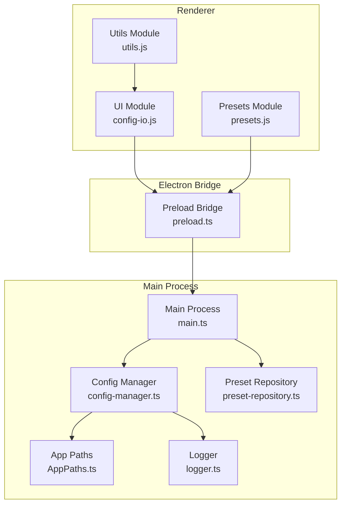
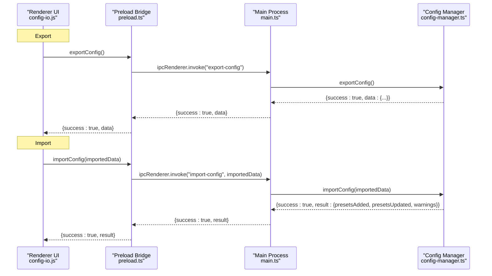
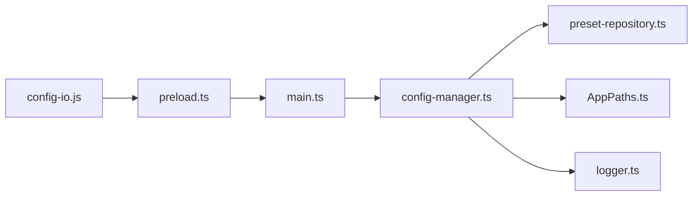
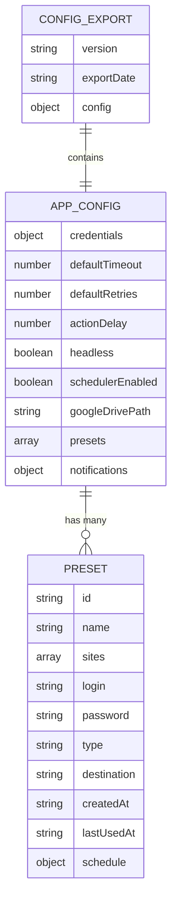

# Export and Import

<cite>
**Referenced Files in This Document**
- [config-io.js](file://app/renderer/modules/config-io.js)
- [config-manager.ts](file://app/config/config-manager.ts)
- [main.ts](file://app/electron/main.ts)
- [preload.ts](file://app/electron/preload.ts)
- [presets.js](file://app/renderer/modules/presets.js)
- [preset-repository.ts](file://app/automation/engine/preset-repository.ts)
- [AppPaths.ts](file://app/core/utils/AppPaths.ts)
- [logger.ts](file://app/config/logger.ts)
- [utils.js](file://app/renderer/modules/utils.js)
</cite>

## Table of Contents
1. [Introduction](#introduction)
2. [Project Structure](#project-structure)
3. [Core Components](#core-components)
4. [Architecture Overview](#architecture-overview)
5. [Detailed Component Analysis](#detailed-component-analysis)
6. [Dependency Analysis](#dependency-analysis)
7. [Performance Considerations](#performance-considerations)
8. [Troubleshooting Guide](#troubleshooting-guide)
9. [Conclusion](#conclusion)
10. [Appendices](#appendices)

## Introduction
This document explains the configuration export and import functionality in Automatizador Bravo. It focuses on:
- The exportConfig method that produces a serializable configuration object with versioning and metadata
- The importConfig process, including preset merging strategies, conflict resolution, and validation
- Practical workflows for backup/restoration, cross-system transfer, and batch preset management
- Warning reporting during import, ID preservation strategies, and rollback considerations

## Project Structure
The export/import pipeline spans the renderer UI, Electron preload bridge, and the main process configuration manager. The renderer triggers actions, the preload exposes safe IPC handlers, and the main process delegates to the configuration manager.

**Diagram sources**
- [config-io.js](file://app/renderer/modules/config-io.js#L1-L115)
- [preloads.ts](file://app/electron/preload.ts#L1-L47)
- [main.ts](file://app/electron/main.ts#L117-L165)
- [config-manager.ts](file://app/config/config-manager.ts#L85-L398)
- [preset-repository.ts](file://app/automation/engine/preset-repository.ts#L1-L34)
- [AppPaths.ts](file://app/core/utils/AppPaths.ts#L1-L60)
- [logger.ts](file://app/config/logger.ts#L1-L104)

**Section sources**
- [config-io.js](file://app/renderer/modules/config-io.js#L1-L115)
- [main.ts](file://app/electron/main.ts#L117-L165)
- [config-manager.ts](file://app/config/config-manager.ts#L85-L398)

## Core Components
- Renderer UI triggers export and import actions and displays notifications and logs.
- Preload bridge exposes IPC handlers to the renderer safely.
- Main process registers IPC handlers and invokes the configuration manager.
- Config manager validates, exports, and imports configuration data, preserving preset IDs and emitting warnings.
- Preset repository persists presets and supports CRUD operations used by the configuration manager.
- App paths and logger support persistence and diagnostics.

**Section sources**
- [config-io.js](file://app/renderer/modules/config-io.js#L1-L115)
- [preload.ts](file://app/electron/preload.ts#L1-L47)
- [main.ts](file://app/electron/main.ts#L117-L165)
- [config-manager.ts](file://app/config/config-manager.ts#L85-L398)
- [preset-repository.ts](file://app/automation/engine/preset-repository.ts#L1-L34)
- [AppPaths.ts](file://app/core/utils/AppPaths.ts#L1-L60)
- [logger.ts](file://app/config/logger.ts#L1-L104)

## Architecture Overview
The export/import flow follows a strict renderer-to-main-to-manager path with validation and logging at each step.

**Diagram sources**
- [config-io.js](file://app/renderer/modules/config-io.js#L9-L43)
- [preload.ts](file://app/electron/preload.ts#L27-L29)
- [main.ts](file://app/electron/main.ts#L147-L164)
- [config-manager.ts](file://app/config/config-manager.ts#L334-L394)

## Detailed Component Analysis

### Export Configuration
The exportConfig method constructs a serializable object containing:
- version: a string identifier for the export schema
- exportDate: ISO timestamp of export
- config: a deep copy of the current application configuration

It relies on the configuration manager’s getConfig to produce a validated AppConfig object and wraps it with metadata for downstream consumers.

Key behaviors:
- Metadata: version and exportDate enable future migration and compatibility checks.
- Validation: exportConfig itself does not re-validate the AppConfig; it assumes the stored config is valid.
- Error handling: exceptions are logged and rethrown to the caller.

Practical usage:
- Triggered from the renderer UI to download a JSON file containing all presets and global settings.

**Section sources**
- [config-manager.ts](file://app/config/config-manager.ts#L334-L348)
- [config-io.js](file://app/renderer/modules/config-io.js#L9-L43)

### Import Configuration
The importConfig method performs:
- Basic validation of the incoming data structure
- Full AppConfigSchema parsing of the imported configuration
- Per-preset merge strategy:
  - If a preset with the same ID exists, it updates the existing preset
  - Otherwise, it adds the preset as new
- Warning generation: for each merged preset, a descriptive warning is emitted indicating whether it was added or updated
- Return value: counts of added and updated presets plus a list of warnings

Conflict resolution:
- ID-based matching ensures deterministic merges
- Existing presets are overwritten with imported fields; new presets are appended
- Warnings provide visibility into changes

Validation procedures:
- Uses Zod schemas to parse and validate the imported AppConfig
- Throws descriptive errors on invalid data

Rollback considerations:
- The current implementation does not implement an atomic rollback mechanism
- If an error occurs mid-import, partial changes may be persisted depending on the order of operations and error propagation
- For safety, import should be performed against a backup of the configuration

Practical usage:
- Triggered from the renderer UI after selecting a JSON file; the UI confirms the operation and displays results and warnings.

**Section sources**
- [config-manager.ts](file://app/config/config-manager.ts#L353-L394)
- [config-io.js](file://app/renderer/modules/config-io.js#L48-L113)

### Renderer Integration and Notifications
The renderer module orchestrates user interactions:
- Export: triggers exportConfig, creates a Blob, initiates a download, and shows success notifications
- Import: reads a selected JSON file, prompts for confirmation, calls importConfig, and displays results and warnings
- Logging: uses a shared log area and console output; notifications are logged with severity markers

User feedback:
- Success notifications summarize added/updated presets
- Warnings are logged and displayed in the UI log area
- Errors are caught and surfaced to the user

**Section sources**
- [config-io.js](file://app/renderer/modules/config-io.js#L9-L113)
- [utils.js](file://app/renderer/modules/utils.js#L1-L51)

### IPC Bridge and Main Process Handlers
The preload bridge exposes safe IPC methods to the renderer:
- exportConfig and importConfig handlers delegate to the main process

The main process registers handlers:
- export-config: calls configManager.exportConfig and returns serialized data
- import-config: calls configManager.importConfig, returning counts and warnings

Error propagation:
- Both handlers wrap calls in try/catch and return structured success/error payloads

**Section sources**
- [preload.ts](file://app/electron/preload.ts#L27-L29)
- [main.ts](file://app/electron/main.ts#L147-L164)

### Preset Persistence and ID Preservation
PresetRepository provides CRUD operations that underpin import/export:
- getAll/getById: retrieve presets
- create/update/delete: persist changes
- markAsUsed: updates lastUsedAt

ID preservation:
- During import, presets are matched by ID; existing presets are updated, preserving their identity
- New presets are added with fresh IDs generated by the configuration manager

**Section sources**
- [preset-repository.ts](file://app/automation/engine/preset-repository.ts#L1-L34)
- [config-manager.ts](file://app/config/config-manager.ts#L220-L232)
- [config-manager.ts](file://app/config/config-manager.ts#L367-L381)

### Practical Workflows

#### Backup and Restoration
- Backup: Use the export action to download a JSON file containing the current configuration and all presets.
- Restoration: Select the exported JSON file and confirm the import. The system will add or update presets based on ID, and display warnings for each change.

Benefits:
- Complete snapshot of configuration state
- Easy verification of changes via warnings

**Section sources**
- [config-io.js](file://app/renderer/modules/config-io.js#L9-L43)
- [config-io.js](file://app/renderer/modules/config-io.js#L48-L113)
- [config-manager.ts](file://app/config/config-manager.ts#L353-L394)

#### Cross-System Configuration Transfer
- Export on the source machine
- Transfer the JSON file to the target machine
- Import on the target machine
- Review warnings to confirm merges

Notes:
- ID-based merging preserves preset identity across systems
- If a preset exists on the target with the same ID, it will be updated; otherwise, it is added as new

**Section sources**
- [config-io.js](file://app/renderer/modules/config-io.js#L48-L113)
- [config-manager.ts](file://app/config/config-manager.ts#L367-L381)

#### Batch Preset Management
- Importing a configuration with many presets will process each preset individually
- Added presets are counted and warned
- Updated presets are counted and warned
- Use the warnings to audit changes after batch import

**Section sources**
- [config-manager.ts](file://app/config/config-manager.ts#L353-L394)
- [config-io.js](file://app/renderer/modules/config-io.js#L77-L98)

### Warning System for Import Conflicts
During import, the system emits warnings for each preset processed:
- “Preset … updated (ID: …)” for existing presets
- “New preset … added (ID: …)” for new presets

These warnings are collected and displayed to the user after import completes, enabling quick identification of changes.

**Section sources**
- [config-manager.ts](file://app/config/config-manager.ts#L374-L379)
- [config-io.js](file://app/renderer/modules/config-io.js#L87-L91)

### ID Preservation Strategies
- ID-based matching ensures that existing presets are updated rather than duplicated
- New presets are added with fresh IDs, preventing accidental collisions
- This strategy supports predictable migrations and cross-system transfers

**Section sources**
- [config-manager.ts](file://app/config/config-manager.ts#L367-L381)
- [config-manager.ts](file://app/config/config-manager.ts#L220-L232)

### Rollback Mechanisms for Failed Imports
- Current implementation does not provide an automatic rollback
- If an error occurs during import, partial changes may be saved depending on the order of operations
- Recommended practice:
  - Back up configuration before importing
  - Review warnings and results
  - Manually revert if necessary by re-importing a known-good backup

**Section sources**
- [config-manager.ts](file://app/config/config-manager.ts#L353-L394)
- [config-io.js](file://app/renderer/modules/config-io.js#L99-L105)

## Dependency Analysis
The export/import pipeline depends on:
- Renderer UI for user interaction and notifications
- Preload bridge for secure IPC
- Main process handlers for orchestration
- Config manager for validation, serialization, and persistence
- Preset repository for CRUD operations
- App paths for file locations
- Logger for diagnostics

**Diagram sources**
- [config-io.js](file://app/renderer/modules/config-io.js#L1-L115)
- [preload.ts](file://app/electron/preload.ts#L1-L47)
- [main.ts](file://app/electron/main.ts#L117-L165)
- [config-manager.ts](file://app/config/config-manager.ts#L85-L398)
- [preset-repository.ts](file://app/automation/engine/preset-repository.ts#L1-L34)
- [AppPaths.ts](file://app/core/utils/AppPaths.ts#L1-L60)
- [logger.ts](file://app/config/logger.ts#L1-L104)

**Section sources**
- [config-io.js](file://app/renderer/modules/config-io.js#L1-L115)
- [main.ts](file://app/electron/main.ts#L117-L165)
- [config-manager.ts](file://app/config/config-manager.ts#L85-L398)

## Performance Considerations
- Export and import operate on the entire configuration; large preset sets may increase processing time
- JSON serialization/deserialization overhead is minimal for typical configurations
- Logging and notifications add negligible overhead compared to I/O operations
- Recommendations:
  - Keep configuration sizes reasonable
  - Prefer incremental backups for frequent changes
  - Validate imported files before confirming to reduce risk

[No sources needed since this section provides general guidance]

## Troubleshooting Guide
Common issues and resolutions:
- Invalid JSON file: The renderer catches parsing errors and shows an error notification. Verify the file format and content.
- Import canceled: The user can cancel the import confirmation; no changes are made.
- Import errors: Errors are caught and returned with a message; review the logs for details.
- Warnings flood the UI: Use the log area to review warnings and identify affected presets.

Diagnostic aids:
- Logger writes to console and daily-rotated files
- UI notifications and log area provide immediate feedback

**Section sources**
- [config-io.js](file://app/renderer/modules/config-io.js#L102-L112)
- [logger.ts](file://app/config/logger.ts#L1-L104)
- [utils.js](file://app/renderer/modules/utils.js#L1-L51)

## Conclusion
The export/import system in Automatizador Bravo provides a robust, ID-preserving mechanism for configuration portability. It validates inputs, reports changes via warnings, and integrates cleanly with the renderer UI. While there is no built-in rollback, careful backup and review of warnings enable safe cross-system transfers and batch management.

[No sources needed since this section summarizes without analyzing specific files]

## Appendices

### Data Model Overview
The configuration object exported/imported includes:
- version: schema version string
- exportDate: ISO timestamp
- config: AppConfig object containing:
  - Global settings
  - Preset list with per-preset metadata and site lists

**Diagram sources**
- [config-manager.ts](file://app/config/config-manager.ts#L334-L348)
- [config-manager.ts](file://app/config/config-manager.ts#L58-L78)
- [config-manager.ts](file://app/config/config-manager.ts#L35-L53)