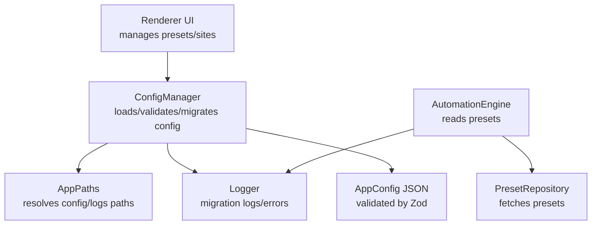
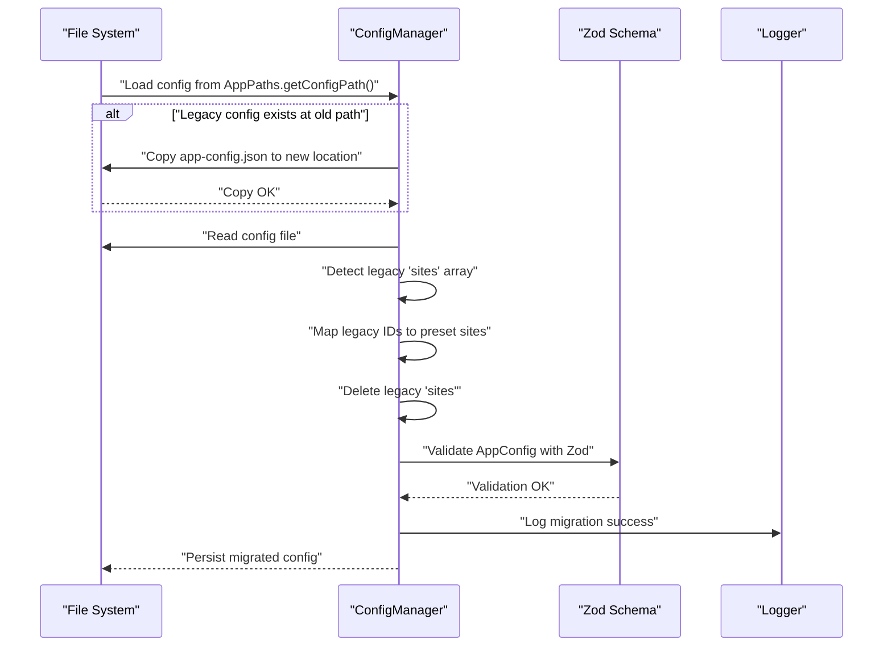
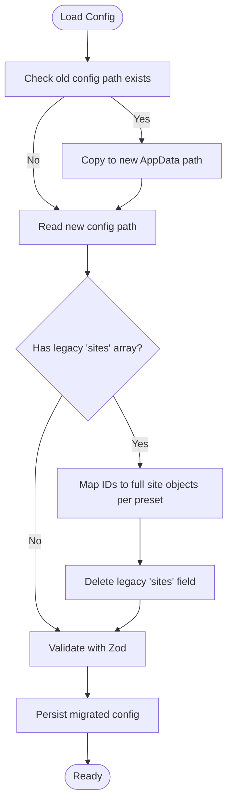
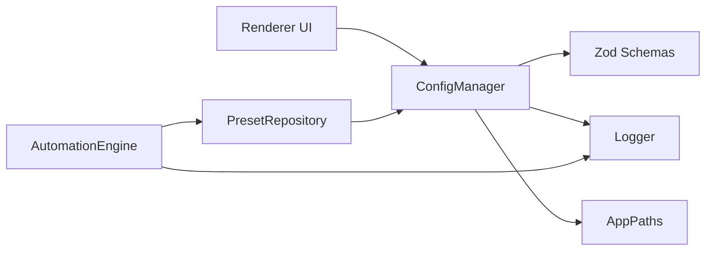

# Migration Procedures

<cite>
**Referenced Files in This Document**
- [config-manager.ts](file://app/config/config-manager.ts)
- [logger.ts](file://app/config/logger.ts)
- [AppPaths.ts](file://app/core/utils/AppPaths.ts)
- [MIGRATION_PRESET_ISOLATION.md](file://MIGRATION_PRESET_ISOLATION.md)
- [app-config.json](file://app/config/app-config.json)
- [automation-engine.ts](file://app/automation/engine/automation-engine.ts)
- [main.js](file://app/renderer/main.js)
- [presets.js](file://app/renderer/modules/presets.js)
- [preset-repository.ts](file://app/automation/engine/preset-repository.ts)
- [schemaMaps.json (data)](file://data/schemaMaps.json)
- [schemaMaps.json (app storage)](file://app/storage/schemaMaps.json)
- [SchemaMap.ts](file://app/config/SchemaMap.ts)
</cite>

## Table of Contents
1. [Introduction](#introduction)
2. [Project Structure](#project-structure)
3. [Core Components](#core-components)
4. [Architecture Overview](#architecture-overview)
5. [Detailed Component Analysis](#detailed-component-analysis)
6. [Dependency Analysis](#dependency-analysis)
7. [Performance Considerations](#performance-considerations)
8. [Troubleshooting Guide](#troubleshooting-guide)
9. [Conclusion](#conclusion)
10. [Appendices](#appendices)

## Introduction
This document explains the automated migration procedures for configuration schema evolution in Automatizador Bravo. It covers:
- Legacy configuration detection and migration from the old global site list to the new preset-based architecture
- Backward compatibility maintenance during migration
- Migration workflows per configuration version
- Data transformation processes and validation steps
- Migration logging and error handling
- Manual intervention procedures
- Migration testing strategies, rollback procedures, and validation of migrated configurations

## Project Structure
The migration system spans configuration loading, logging, path resolution, and UI updates:
- Configuration manager loads and validates configuration, performs migrations, and persists changes
- Logger records migration events and errors
- AppPaths resolves platform-specific configuration and logs locations
- Automation engine consumes preset-based configuration
- Renderer UI reflects preset-scoped site management

**Diagram sources**
- [config-manager.ts](file://app/config/config-manager.ts#L85-L190)
- [AppPaths.ts](file://app/core/utils/AppPaths.ts#L11-L25)
- [logger.ts](file://app/config/logger.ts#L16-L60)
- [automation-engine.ts](file://app/automation/engine/automation-engine.ts#L70-L111)
- [preset-repository.ts](file://app/automation/engine/preset-repository.ts#L4-L11)
- [main.js](file://app/renderer/main.js#L1-L34)

**Section sources**
- [config-manager.ts](file://app/config/config-manager.ts#L85-L190)
- [AppPaths.ts](file://app/core/utils/AppPaths.ts#L11-L25)
- [logger.ts](file://app/config/logger.ts#L16-L60)
- [automation-engine.ts](file://app/automation/engine/automation-engine.ts#L70-L111)
- [preset-repository.ts](file://app/automation/engine/preset-repository.ts#L4-L11)
- [main.js](file://app/renderer/main.js#L1-L34)

## Core Components
- ConfigManager: Loads configuration, detects legacy structures, migrates to preset-based schema, validates with Zod, and persists changes. It also maintains deprecated methods for backward compatibility.
- Logger: Provides structured logging for migration events and errors.
- AppPaths: Determines configuration and logs directories across development and packaged environments.
- AutomationEngine: Consumes preset-based configuration and runs automation against preset-defined sites.
- Renderer UI: Manages preset selection and site editing within a preset context.

Key migration responsibilities:
- Detect legacy config location and copy to new AppData location
- Transform legacy global sites array into preset-scoped sites
- Maintain compatibility via deprecated methods
- Log migration progress and failures

**Section sources**
- [config-manager.ts](file://app/config/config-manager.ts#L85-L190)
- [logger.ts](file://app/config/logger.ts#L16-L60)
- [AppPaths.ts](file://app/core/utils/AppPaths.ts#L11-L25)
- [automation-engine.ts](file://app/automation/engine/automation-engine.ts#L70-L111)
- [main.js](file://app/renderer/main.js#L113-L213)

## Architecture Overview
The migration architecture ensures seamless evolution from a global site list to a preset-scoped model while preserving functionality and enabling future extensibility.

**Diagram sources**
- [config-manager.ts](file://app/config/config-manager.ts#L133-L190)
- [AppPaths.ts](file://app/core/utils/AppPaths.ts#L19-L21)
- [logger.ts](file://app/config/logger.ts#L16-L60)

## Detailed Component Analysis

### ConfigManager: Automated Migration and Validation
Responsibilities:
- Detects legacy configuration and migrates it to the new AppData location
- Transforms legacy global sites into preset-scoped sites
- Validates configuration using Zod schemas
- Maintains deprecated methods for backward compatibility
- Persists configuration after migration and validation

Migration logic highlights:
- Legacy detection: checks for presence of the old config path and copies it to the new AppData location if the new path does not exist
- Global site migration: converts legacy arrays of site IDs into full site objects per preset and removes the global sites array
- Validation: uses Zod schemas to parse and validate configuration before accepting it
- Deprecated methods: legacy getters remain callable but log warnings and fallback to preset-scoped data

**Diagram sources**
- [config-manager.ts](file://app/config/config-manager.ts#L133-L190)

**Section sources**
- [config-manager.ts](file://app/config/config-manager.ts#L85-L190)
- [logger.ts](file://app/config/logger.ts#L16-L60)

### AppPaths: Path Resolution and Compatibility
Responsibilities:
- Returns the base data path depending on whether the app is packaged or in development
- Provides deterministic paths for config, logs, profiles, browsers, and snapshots
- Ensures required directories exist

Impact on migration:
- Ensures the new config path is created and writable in production
- Keeps development behavior predictable by pointing to the project-relative app directory

**Section sources**
- [AppPaths.ts](file://app/core/utils/AppPaths.ts#L11-L25)
- [AppPaths.ts](file://app/core/utils/AppPaths.ts#L44-L58)

### Logger: Migration Logging and Error Reporting
Responsibilities:
- Structured logging with timestamps and levels
- Separate loggers for general, automation, and sessions
- Daily rotation and optional environment variable control

Migration logging:
- Logs detection of legacy config and successful migration
- Logs completion of global site migration and removal of legacy field
- Logs validation success and persistence of migrated config
- Logs errors during load/save and surfaces them to callers

**Section sources**
- [logger.ts](file://app/config/logger.ts#L16-L60)
- [logger.ts](file://app/config/logger.ts#L63-L82)
- [logger.ts](file://app/config/logger.ts#L85-L102)
- [config-manager.ts](file://app/config/config-manager.ts#L133-L190)

### AutomationEngine: Consuming Preset-Based Configuration
Responsibilities:
- Uses preset-scoped sites when a preset is selected
- Falls back to legacy mode if no preset is provided
- Validates that presets with configured report types include primary keys for SSP

Migration impact:
- Simplified site retrieval from preset.sites
- Improved isolation and reduced risk of cross-preset contamination
- Clear error messaging when presets lack required configuration

**Section sources**
- [automation-engine.ts](file://app/automation/engine/automation-engine.ts#L70-L111)
- [automation-engine.ts](file://app/automation/engine/automation-engine.ts#L262-L269)

### Renderer UI: Preset-Scoped Site Management
Responsibilities:
- Tracks the currently edited preset
- Loads and saves sites scoped to the selected preset
- Updates UI to reflect preset context

Migration impact:
- Ensures site edits occur within the correct preset context
- Prevents accidental cross-preset contamination
- Improves UX by scoping site lists to the active preset

**Section sources**
- [main.js](file://app/renderer/main.js#L113-L213)
- [presets.js](file://app/renderer/modules/presets.js#L17-L36)

### Schema Maps and SSP Policy (Contextual to Migration)
While not part of the configuration migration itself, the schema maps and SSP policy underpin data validation and snapshot policies that complement the migration’s goal of robust configuration evolution.

- SchemaMap defines per-type primary keys and optional date/compare fields
- SafeSnapshotPolicy enforces schema validity and guards against mismatches
- Data and app storage schemaMaps.json files define report-type schemas

These components ensure that migrated configurations retain strong typing and validation guarantees for downstream processing.

**Section sources**
- [SchemaMap.ts](file://app/config/SchemaMap.ts#L1-L12)
- [schemaMaps.json (data)](file://data/schemaMaps.json#L1-L9)
- [schemaMaps.json (app storage)](file://app/storage/schemaMaps.json#L1-L9)

## Dependency Analysis
The migration system depends on:
- Zod schemas for validation
- Logger for auditability
- AppPaths for path resolution
- Renderer UI for user-driven migration feedback
- AutomationEngine for consuming migrated configuration

**Diagram sources**
- [config-manager.ts](file://app/config/config-manager.ts#L85-L190)
- [logger.ts](file://app/config/logger.ts#L16-L60)
- [AppPaths.ts](file://app/core/utils/AppPaths.ts#L11-L25)
- [automation-engine.ts](file://app/automation/engine/automation-engine.ts#L70-L111)
- [preset-repository.ts](file://app/automation/engine/preset-repository.ts#L4-L11)
- [main.js](file://app/renderer/main.js#L1-L34)

**Section sources**
- [config-manager.ts](file://app/config/config-manager.ts#L85-L190)
- [logger.ts](file://app/config/logger.ts#L16-L60)
- [AppPaths.ts](file://app/core/utils/AppPaths.ts#L11-L25)
- [automation-engine.ts](file://app/automation/engine/automation-engine.ts#L70-L111)
- [preset-repository.ts](file://app/automation/engine/preset-repository.ts#L4-L11)
- [main.js](file://app/renderer/main.js#L1-L34)

## Performance Considerations
- Migration occurs once per application startup; minimal overhead
- Zod validation is fast and leverages compile-time schema generation
- Logging is asynchronous and rotated to avoid disk contention
- UI updates are scoped to the active preset, reducing unnecessary re-renders

## Troubleshooting Guide
Common migration issues and resolutions:
- Legacy config not detected: Verify the old path exists and the new path is writable
- Migration fails validation: Review the logged error and fix schema violations
- Sites missing after migration: Confirm that preset.sites were mapped from legacy IDs
- Deprecated methods still used: Replace legacy calls with preset-scoped methods

Manual intervention procedures:
- Backup the configuration file before migration
- If migration fails, restore from backup and fix schema issues
- After migration, verify that presets contain the expected sites and that automation runs correctly

Validation steps:
- Confirm that the new config file exists and is valid
- Verify that legacy 'sites' field is absent
- Ensure that each preset contains the expected site objects
- Run a test automation to confirm configuration integrity

**Section sources**
- [config-manager.ts](file://app/config/config-manager.ts#L133-L190)
- [logger.ts](file://app/config/logger.ts#L16-L60)

## Conclusion
The migration system in Automatizador Bravo automatically evolves the configuration schema from a legacy global site list to a preset-based architecture. It preserves backward compatibility, validates transformations, logs all migration events, and integrates with the automation engine and UI to ensure a smooth transition. By following the documented workflows, validation steps, and troubleshooting procedures, teams can confidently evolve configurations while maintaining reliability and auditability.

## Appendices

### Migration Workflows by Configuration Version
- From legacy global sites to preset-based:
  - Detect legacy config and copy to new location
  - Map legacy site IDs to preset-scoped site objects
  - Remove legacy global sites array
  - Validate with Zod and persist

- Backward compatibility:
  - Deprecated methods remain callable but log warnings and fallback to preset-scoped data

**Section sources**
- [config-manager.ts](file://app/config/config-manager.ts#L133-L190)
- [MIGRATION_PRESET_ISOLATION.md](file://MIGRATION_PRESET_ISOLATION.md#L1-L242)

### Data Transformation Processes
- Convert legacy site IDs to full site objects per preset
- Remove legacy 'sites' field from AppConfig
- Validate transformed configuration with Zod schemas

**Section sources**
- [config-manager.ts](file://app/config/config-manager.ts#L149-L167)

### Validation Steps
- Confirm new config path exists and is readable/writable
- Validate AppConfig schema
- Ensure each preset contains expected site objects
- Verify automation engine can run with migrated configuration

**Section sources**
- [config-manager.ts](file://app/config/config-manager.ts#L169-L171)
- [app-config.json](file://app/config/app-config.json#L1-L800)

### Migration Testing Strategies
- Unit tests for ConfigManager migration logic
- Integration tests for automation engine with preset-scoped configuration
- UI tests for preset/site editing within context
- Snapshot policy tests for schema maps and SSP validation

[No sources needed since this section provides general guidance]

### Rollback Procedures
- Restore configuration from backup
- Revert UI and engine changes if necessary
- Re-run validation and test automation

[No sources needed since this section provides general guidance]