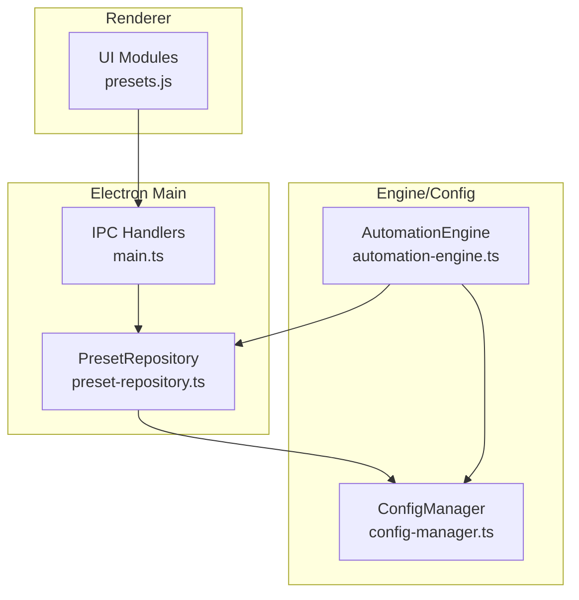
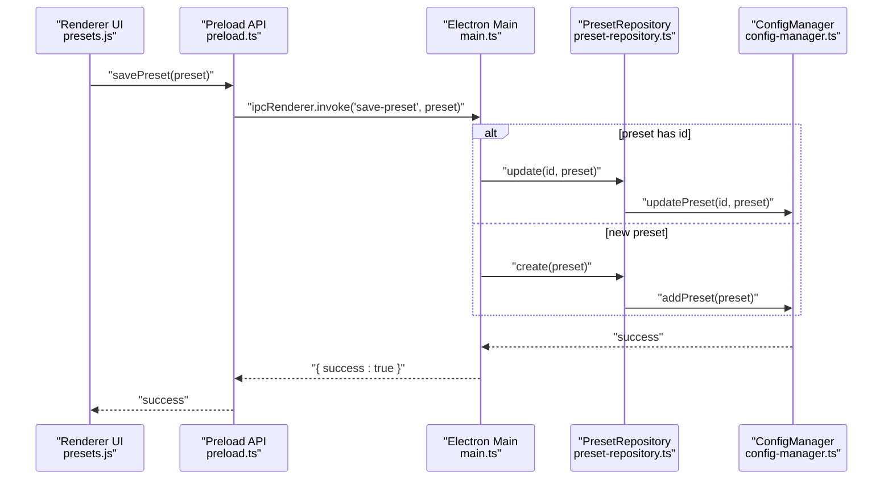
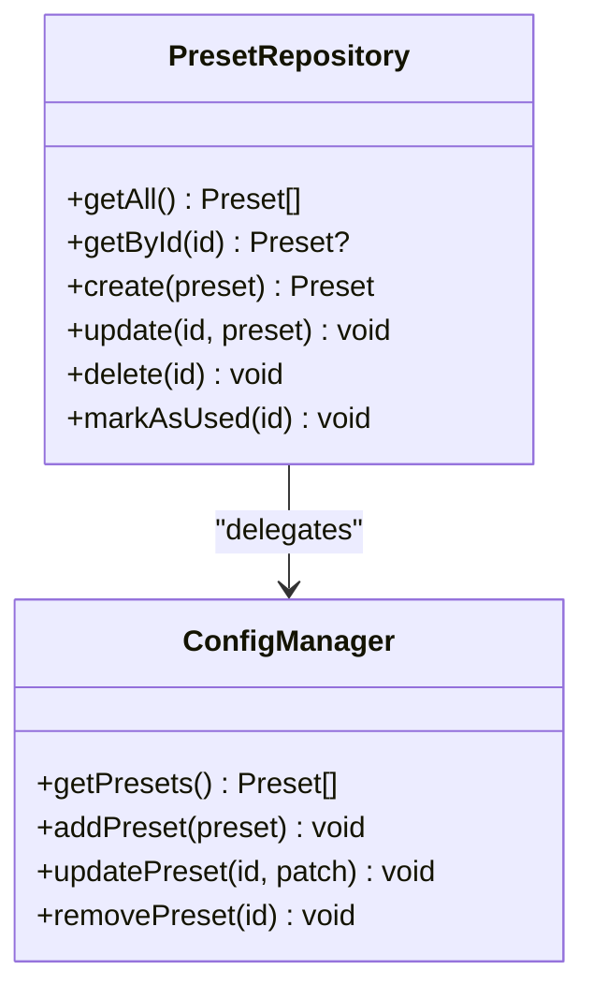
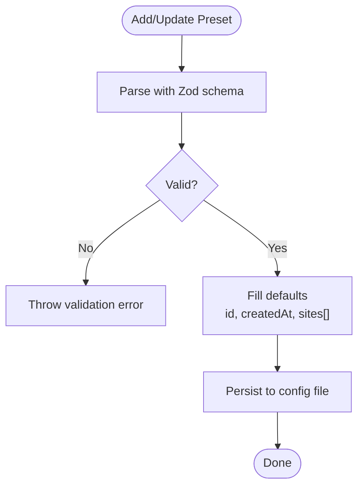
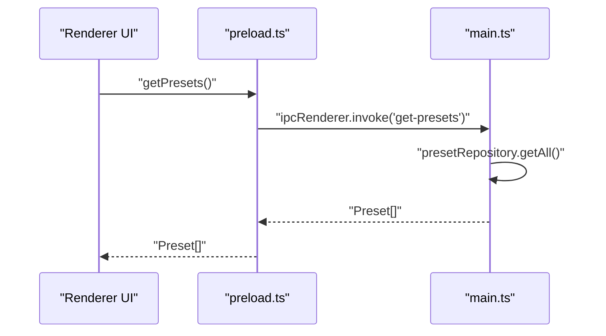
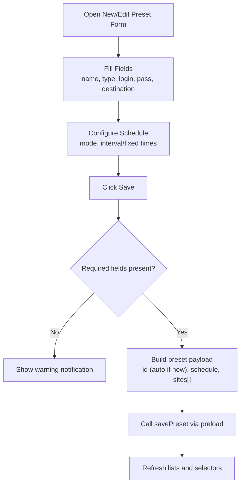
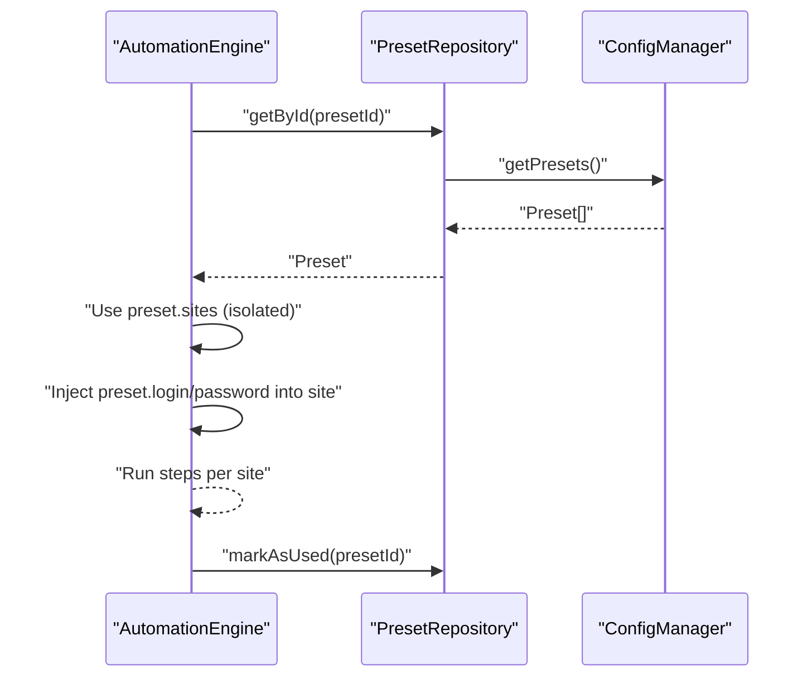
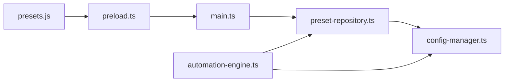

# Preset Operations

<cite>
**Referenced Files in This Document**
- [preset-repository.ts](file://app/automation/engine/preset-repository.ts)
- [config-manager.ts](file://app/config/config-manager.ts)
- [main.ts](file://app/electron/main.ts)
- [preload.ts](file://app/electron/preload.ts)
- [presets.js](file://app/renderer/modules/presets.js)
- [automation-engine.ts](file://app/automation/engine/automation-engine.ts)
- [MIGRATION_PRESET_ISOLATION.md](file://MIGRATION_PRESET_ISOLATION.md)
- [FASE 6 — PRESETS E CONFIGURAÇÕES.md](file://docs/FASE 6 — PRESETS E CONFIGURAÇÕES.md)
- [main.js](file://app/renderer/main.js)
</cite>

## Table of Contents
1. [Introduction](#introduction)
2. [Project Structure](#project-structure)
3. [Core Components](#core-components)
4. [Architecture Overview](#architecture-overview)
5. [Detailed Component Analysis](#detailed-component-analysis)
6. [Dependency Analysis](#dependency-analysis)
7. [Performance Considerations](#performance-considerations)
8. [Troubleshooting Guide](#troubleshooting-guide)
9. [Conclusion](#conclusion)
10. [Appendices](#appendices)

## Introduction
This document explains preset management operations in Automatizador Bravo, focusing on CRUD operations (addPreset, updatePreset, removePreset, getPresets) and the preset isolation mechanism that keeps site configurations separate per preset container. It covers automatic UUID generation, timestamp management, validation, conflict resolution, duplicate detection, and data consistency during operations. It also provides end-to-end examples for preset creation, site assignment, and lifecycle management.

## Project Structure
Preset operations span three layers:
- Renderer UI: collects preset data and triggers IPC calls
- Electron Main: exposes IPC handlers and delegates to repositories
- Engine/Config: validates, persists, and manages presets and isolated sites

**Diagram sources**
- [main.ts](file://app/electron/main.ts#L117-L164)
- [preset-repository.ts](file://app/automation/engine/preset-repository.ts#L4-L32)
- [config-manager.ts](file://app/config/config-manager.ts#L85-L398)
- [presets.js](file://app/renderer/modules/presets.js#L17-L414)
- [automation-engine.ts](file://app/automation/engine/automation-engine.ts#L50-L238)

**Section sources**
- [main.ts](file://app/electron/main.ts#L117-L164)
- [preset-repository.ts](file://app/automation/engine/preset-repository.ts#L4-L32)
- [config-manager.ts](file://app/config/config-manager.ts#L85-L398)
- [presets.js](file://app/renderer/modules/presets.js#L17-L414)
- [automation-engine.ts](file://app/automation/engine/automation-engine.ts#L50-L238)

## Core Components
- PresetRepository: thin facade over ConfigManager for preset CRUD and usage tracking
- ConfigManager: Zod-based validation, persistence, and isolation of sites per preset
- Electron IPC: renderer-safe API for preset CRUD and automation orchestration
- Renderer Presets Module: form handling, scheduling UI, and preset lifecycle actions
- AutomationEngine: consumes preset sites and injects preset credentials into site configs

Key responsibilities:
- Automatic UUID generation for presets and sites
- Timestamp management (createdAt, lastUsedAt)
- Validation via Zod schemas
- Isolation of sites per preset container
- Conflict resolution and duplicate detection during import/export

**Section sources**
- [preset-repository.ts](file://app/automation/engine/preset-repository.ts#L4-L32)
- [config-manager.ts](file://app/config/config-manager.ts#L35-L53)
- [config-manager.ts](file://app/config/config-manager.ts#L220-L232)
- [config-manager.ts](file://app/config/config-manager.ts#L265-L278)
- [main.ts](file://app/electron/main.ts#L128-L145)
- [presets.js](file://app/renderer/modules/presets.js#L154-L208)
- [automation-engine.ts](file://app/automation/engine/automation-engine.ts#L92-L104)

## Architecture Overview
End-to-end preset CRUD flow from UI to persistence and automation consumption.

**Diagram sources**
- [presets.js](file://app/renderer/modules/presets.js#L154-L208)
- [preload.ts](file://app/electron/preload.ts#L22-L25)
- [main.ts](file://app/electron/main.ts#L128-L145)
- [preset-repository.ts](file://app/automation/engine/preset-repository.ts#L13-L22)
- [config-manager.ts](file://app/config/config-manager.ts#L220-L232)

## Detailed Component Analysis

### PresetRepository
- Provides CRUD façade over ConfigManager
- Adds automatic timestamps and marks presets as used after automation runs
- Returns latest preset after create for immediate UI refresh

**Diagram sources**
- [preset-repository.ts](file://app/automation/engine/preset-repository.ts#L4-L32)
- [config-manager.ts](file://app/config/config-manager.ts#L216-L243)

**Section sources**
- [preset-repository.ts](file://app/automation/engine/preset-repository.ts#L4-L32)

### ConfigManager (Validation, Persistence, Isolation)
- Zod schemas define strict validation for presets and sites
- Automatic UUID generation for presets and sites
- Timestamps createdAt and lastUsedAt are managed during add/update
- Isolation: sites are stored within each preset, not globally
- Duplicate detection and conflict resolution during import/export

**Diagram sources**
- [config-manager.ts](file://app/config/config-manager.ts#L35-L53)
- [config-manager.ts](file://app/config/config-manager.ts#L220-L232)
- [config-manager.ts](file://app/config/config-manager.ts#L245-L256)

**Section sources**
- [config-manager.ts](file://app/config/config-manager.ts#L35-L53)
- [config-manager.ts](file://app/config/config-manager.ts#L220-L232)
- [config-manager.ts](file://app/config/config-manager.ts#L245-L256)
- [config-manager.ts](file://app/config/config-manager.ts#L265-L278)
- [config-manager.ts](file://app/config/config-manager.ts#L353-L394)

### Electron IPC Handlers
- Renderer-safe exposure of preset operations
- Delegates to PresetRepository for CRUD
- Supports export/import of entire configuration including presets

**Diagram sources**
- [preload.ts](file://app/electron/preload.ts#L22-L25)
- [main.ts](file://app/electron/main.ts#L128-L131)
- [preset-repository.ts](file://app/automation/engine/preset-repository.ts#L5-L7)

**Section sources**
- [preload.ts](file://app/electron/preload.ts#L22-L25)
- [main.ts](file://app/electron/main.ts#L128-L145)

### Renderer Presets Module (UI Workflows)
- Handles preset form submission, validation, and scheduling
- Generates UUID for new presets when missing
- Loads presets into selectors and lists, updates sidebar schedules
- Edits existing presets while preserving associated sites

**Diagram sources**
- [presets.js](file://app/renderer/modules/presets.js#L154-L208)
- [presets.js](file://app/renderer/modules/presets.js#L330-L349)
- [presets.js](file://app/renderer/modules/presets.js#L210-L238)

**Section sources**
- [presets.js](file://app/renderer/modules/presets.js#L154-L208)
- [presets.js](file://app/renderer/modules/presets.js#L330-L349)
- [presets.js](file://app/renderer/modules/presets.js#L210-L238)

### AutomationEngine Integration
- Consumes preset sites directly (isolated)
- Injects preset login/password into site credentials for execution
- Updates lastUsedAt after successful automation runs

**Diagram sources**
- [automation-engine.ts](file://app/automation/engine/automation-engine.ts#L92-L104)
- [automation-engine.ts](file://app/automation/engine/automation-engine.ts#L127-L133)
- [automation-engine.ts](file://app/automation/engine/automation-engine.ts#L216-L218)
- [preset-repository.ts](file://app/automation/engine/preset-repository.ts#L9-L11)
- [preset-repository.ts](file://app/automation/engine/preset-repository.ts#L28-L31)

**Section sources**
- [automation-engine.ts](file://app/automation/engine/automation-engine.ts#L92-L104)
- [automation-engine.ts](file://app/automation/engine/automation-engine.ts#L127-L133)
- [automation-engine.ts](file://app/automation/engine/automation-engine.ts#L216-L218)

## Dependency Analysis
- PresetRepository depends on ConfigManager for validation and persistence
- Electron Main registers IPC handlers that delegate to PresetRepository
- Renderer UI interacts with IPC via preload.ts
- AutomationEngine depends on PresetRepository and ConfigManager for site isolation and credential injection

**Diagram sources**
- [main.js](file://app/renderer/main.js#L47-L58)
- [preload.ts](file://app/electron/preload.ts#L22-L25)
- [main.ts](file://app/electron/main.ts#L128-L145)
- [preset-repository.ts](file://app/automation/engine/preset-repository.ts#L1-L3)
- [config-manager.ts](file://app/config/config-manager.ts#L1-L2)
- [automation-engine.ts](file://app/automation/engine/automation-engine.ts#L10-L10)

**Section sources**
- [main.js](file://app/renderer/main.js#L47-L58)
- [main.ts](file://app/electron/main.ts#L128-L145)
- [preset-repository.ts](file://app/automation/engine/preset-repository.ts#L1-L3)
- [config-manager.ts](file://app/config/config-manager.ts#L1-L2)
- [automation-engine.ts](file://app/automation/engine/automation-engine.ts#L10-L10)

## Performance Considerations
- Zod parsing occurs on every add/update; keep preset payloads minimal to reduce overhead
- Isolated sites avoid global site aggregation costs during automation runs
- Batch updates: prefer updating preset fields in a single call to minimize disk writes
- Use markAsUsed sparingly; it performs an update operation per run completion

## Troubleshooting Guide
Common issues and resolutions:
- Validation errors on save: ensure required fields (name, login, password) are provided; check schedule configuration
- Preset not found: verify presetId exists via getPresets or getById
- Duplicate presets after import: importConfig detects existing IDs and updates; review warnings returned by importConfig
- Missing sites after migration: verify isolation migration applied; confirm sites are under preset.sites, not global

Operational tips:
- Use exportConfig/importConfig to back up and restore presets with their isolated sites
- Confirm lastUsedAt updates after automation completes

**Section sources**
- [config-manager.ts](file://app/config/config-manager.ts#L353-L394)
- [config-manager.ts](file://app/config/config-manager.ts#L245-L256)
- [automation-engine.ts](file://app/automation/engine/automation-engine.ts#L216-L218)

## Conclusion
Preset management in Automatizador Bravo is built around strict validation, automatic identifiers, and strong isolation of site configurations per preset. The layered architecture ensures robust CRUD operations, predictable lifecycle management, and seamless integration with automation workflows. The documented patterns and examples enable consistent creation, assignment, and maintenance of presets while preserving data integrity and resolving conflicts.

## Appendices

### CRUD Operations Reference
- addPreset: Validates and persists a new preset; generates id and createdAt automatically
- updatePreset: Validates and merges partial updates; preserves existing sites
- removePreset: Removes preset by id; maintains data consistency
- getPresets: Returns all presets; used by UI and automation

**Section sources**
- [config-manager.ts](file://app/config/config-manager.ts#L220-L232)
- [config-manager.ts](file://app/config/config-manager.ts#L245-L256)
- [config-manager.ts](file://app/config/config-manager.ts#L234-L243)
- [preset-repository.ts](file://app/automation/engine/preset-repository.ts#L5-L7)

### Preset Isolation Mechanism
- Sites are stored within each preset (not globally)
- AutomationEngine consumes preset.sites directly
- Migration removes global sites list and enforces per-preset site arrays

**Section sources**
- [MIGRATION_PRESET_ISOLATION.md](file://MIGRATION_PRESET_ISOLATION.md#L8-L34)
- [MIGRATION_PRESET_ISOLATION.md](file://MIGRATION_PRESET_ISOLATION.md#L44-L87)
- [automation-engine.ts](file://app/automation/engine/automation-engine.ts#L92-L104)

### Automatic UUID Generation and Timestamps
- UUIDs: generated for presets and sites when missing
- Timestamps: createdAt on add; lastUsedAt on automation completion

**Section sources**
- [config-manager.ts](file://app/config/config-manager.ts#L223-L225)
- [config-manager.ts](file://app/config/config-manager.ts#L271)
- [preset-repository.ts](file://app/automation/engine/preset-repository.ts#L28-L31)

### Examples

#### Example 1: Create a New Preset
- Steps:
  - Open preset form in UI
  - Fill name, type, login, password, destination
  - Click Save; UI builds payload with id if missing
  - IPC invokes save-preset; main handler calls PresetRepository.create
  - ConfigManager adds preset with generated id and createdAt
  - UI refreshes lists and selectors

**Section sources**
- [presets.js](file://app/renderer/modules/presets.js#L154-L208)
- [main.ts](file://app/electron/main.ts#L133-L138)
- [preset-repository.ts](file://app/automation/engine/preset-repository.ts#L13-L18)
- [config-manager.ts](file://app/config/config-manager.ts#L220-L232)

#### Example 2: Assign Sites to a Preset
- Steps:
  - Select preset in UI
  - Navigate to Sites tab
  - Add/edit sites; each site gets a UUID if missing
  - Save site; main handler updates preset.sites atomically
  - AutomationEngine reads preset.sites for execution

**Section sources**
- [MIGRATION_PRESET_ISOLATION.md](file://MIGRATION_PRESET_ISOLATION.md#L113-L156)
- [config-manager.ts](file://app/config/config-manager.ts#L265-L278)
- [automation-engine.ts](file://app/automation/engine/automation-engine.ts#L92-L104)

#### Example 3: Update Preset Credentials and Run Automation
- Steps:
  - Edit preset form; update login/password
  - Save preset; ConfigManager validates and merges
  - AutomationEngine injects credentials into site configs
  - After run, markAsUsed updates lastUsedAt

**Section sources**
- [config-manager.ts](file://app/config/config-manager.ts#L245-L256)
- [automation-engine.ts](file://app/automation/engine/automation-engine.ts#L127-L133)
- [automation-engine.ts](file://app/automation/engine/automation-engine.ts#L216-L218)
- [preset-repository.ts](file://app/automation/engine/preset-repository.ts#L28-L31)

#### Example 4: Import/Export Presets with Isolated Sites
- Steps:
  - Export configuration; includes presets and all nested sites
  - Import configuration; merges by id, preserving existing or adding new
  - Warnings indicate updates/additions

**Section sources**
- [config-manager.ts](file://app/config/config-manager.ts#L334-L348)
- [config-manager.ts](file://app/config/config-manager.ts#L353-L394)