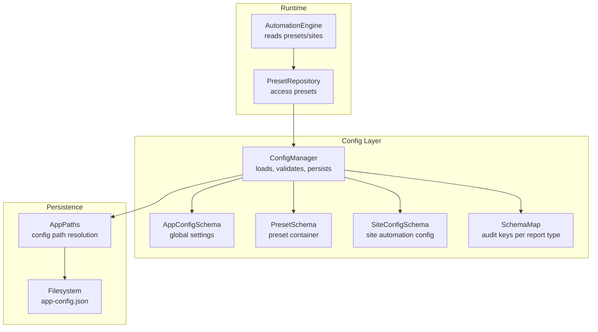
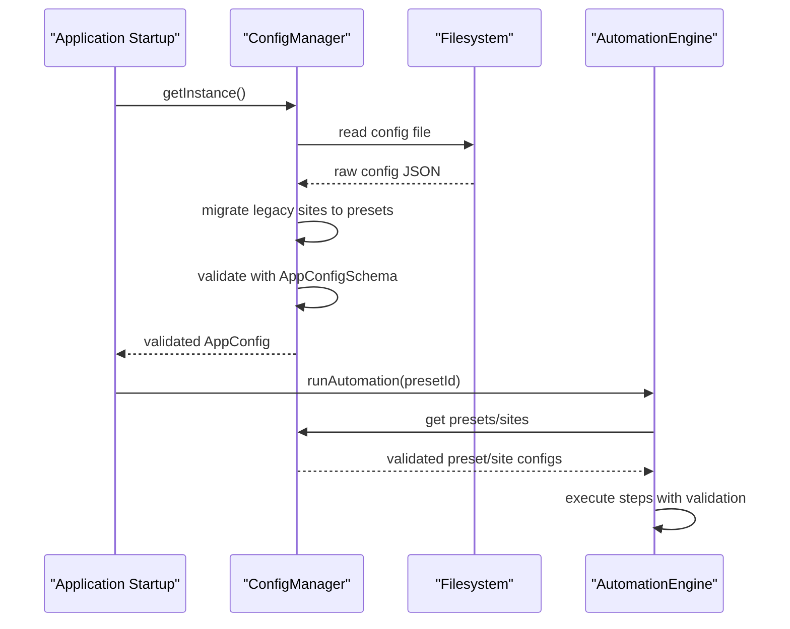
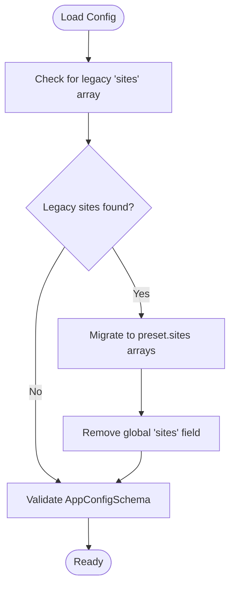
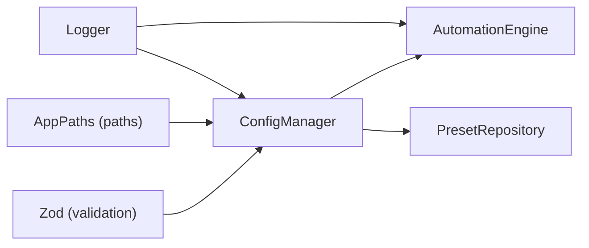

# Schema Management

<cite>
**Referenced Files in This Document**
- [config-manager.ts](file://app/config/config-manager.ts)
- [app-config.json](file://app/config/app-config.json)
- [SchemaMap.ts](file://app/config/SchemaMap.ts)
- [schemaMaps.json](file://data/schemaMaps.json)
- [schemaMaps.json](file://release/win-unpacked/resources/data/schemaMaps.json)
- [MIGRATION_PRESET_ISOLATION.md](file://MIGRATION_PRESET_ISOLATION.md)
- [automation-engine.ts](file://app/automation/engine/automation-engine.ts)
- [preset-repository.ts](file://app/automation/engine/preset-repository.ts)
- [AppPaths.ts](file://app/core/utils/AppPaths.ts)
- [logger.ts](file://app/config/logger.ts)
- [package.json](file://package.json)
</cite>

## Table of Contents
1. [Introduction](#introduction)
2. [Project Structure](#project-structure)
3. [Core Components](#core-components)
4. [Architecture Overview](#architecture-overview)
5. [Detailed Component Analysis](#detailed-component-analysis)
6. [Dependency Analysis](#dependency-analysis)
7. [Performance Considerations](#performance-considerations)
8. [Troubleshooting Guide](#troubleshooting-guide)
9. [Conclusion](#conclusion)
10. [Appendices](#appendices)

## Introduction
This document explains the schema management system used by Automatizador Bravo’s configuration layer. It focuses on the Zod-based validation schemas that define the application configuration, presets, and site-specific automation settings. It also documents the evolution from a global site list to an isolated preset-based architecture, including migration procedures, runtime validation, type inference patterns, and error handling strategies.

## Project Structure
The schema system centers around three primary configuration artifacts:
- Application-wide configuration (AppConfigSchema)
- Preset-level configuration (PresetSchema)
- Site-level configuration (SiteConfigSchema)
- Schema maps for audit and diff operations (SchemaMap)

These are loaded and validated during application startup and persisted to disk. The configuration is organized under a dedicated configuration manager that enforces schema validation and supports import/export and migration.

**Diagram sources**
- [config-manager.ts](file://app/config/config-manager.ts#L58-L78)
- [automation-engine.ts](file://app/automation/engine/automation-engine.ts#L50-L118)
- [preset-repository.ts](file://app/automation/engine/preset-repository.ts#L4-L32)
- [AppPaths.ts](file://app/core/utils/AppPaths.ts#L19-L21)

**Section sources**
- [config-manager.ts](file://app/config/config-manager.ts#L1-L408)
- [AppPaths.ts](file://app/core/utils/AppPaths.ts#L1-L60)

## Core Components
This section defines the three core schemas and their roles in the configuration system.

- AppConfigSchema
  - Purpose: Defines global application settings and the top-level collection of presets.
  - Key fields:
    - credentials: Optional record of credential entries.
    - defaultTimeout: Number with default value.
    - defaultRetries: Number with default value.
    - actionDelay: Number with default value.
    - headless: Boolean with default value.
    - schedulerEnabled: Boolean with default value.
    - googleDrivePath: Optional string.
    - presets: Array of PresetSchema with default empty array.
    - notifications: Nested SMTP and recipient configuration with defaults.
  - Validation behavior: Used to parse and persist the entire application configuration.

- PresetSchema
  - Purpose: Encapsulates a group of related sites and automation credentials.
  - Key fields:
    - id: Optional UUID; auto-generated if missing.
    - name: Required string with minimum length constraint.
    - sites: Array of SiteConfigSchema with default empty array (isolated sites).
    - login: Required string for preset-level credentials.
    - password: Required string for preset-level credentials.
    - type: Enum with default value.
    - destination: Optional string for consolidated output path.
    - createdAt/lastUsedAt: Optional timestamps.
    - schedule: Optional nested schedule configuration with defaults.
  - Validation behavior: Ensures each preset conforms to strict typing and defaults.

- SiteConfigSchema
  - Purpose: Describes a single site’s automation steps and selectors.
  - Key fields:
    - id/name/url/loginUrl: Required identifiers and URLs.
    - usernameField/passwordField/loginButton: Selector strings for login.
    - steps: Array of step objects with typed step types, optional values, timeouts, retries, and continueOnError defaults.
    - downloadPath/renamePattern/reportType: Optional fields for output customization.
    - primaryKeys: Optional array of column names for audit/diff.
    - uf: String with default value.
    - credentials: Optional nested username/password override.
  - Validation behavior: Validates each step’s type and ensures robust defaults.

- SchemaMap
  - Purpose: Associates report types with primary key definitions for audit and diff operations.
  - Fields:
    - tipo: Report type identifier.
    - primaryKey: Array of column names forming the unique key.
    - dateField: Optional date column for temporal diffs.
    - compareFields: Optional subset of fields for comparison.

**Section sources**
- [config-manager.ts](file://app/config/config-manager.ts#L8-L33)
- [config-manager.ts](file://app/config/config-manager.ts#L35-L53)
- [config-manager.ts](file://app/config/config-manager.ts#L58-L78)
- [SchemaMap.ts](file://app/config/SchemaMap.ts#L1-L12)
- [schemaMaps.json](file://data/schemaMaps.json#L1-L9)

## Architecture Overview
The schema system is enforced by a central configuration manager that loads, validates, and persists configuration. It supports:
- Automatic migration from legacy global site lists to isolated presets.
- Runtime enforcement of schema rules during automation.
- Export/import of configuration sets for backup and sharing.

**Diagram sources**
- [config-manager.ts](file://app/config/config-manager.ts#L133-L190)
- [config-manager.ts](file://app/config/config-manager.ts#L214-L256)
- [automation-engine.ts](file://app/automation/engine/automation-engine.ts#L62-L118)

## Detailed Component Analysis

### AppConfigSchema: Global Settings and Preset Container
- Responsibilities:
  - Hosts global defaults and preferences.
  - Contains the presets array, which now exclusively holds isolated preset configurations.
- Defaults and constraints:
  - Numeric and boolean defaults ensure predictable behavior when fields are omitted.
  - Nested notifications object provides SMTP defaults for email alerts.
- Persistence:
  - Path resolution is handled by AppPaths to support development and production environments.

**Section sources**
- [config-manager.ts](file://app/config/config-manager.ts#L58-L78)
- [AppPaths.ts](file://app/core/utils/AppPaths.ts#L19-L21)

### PresetSchema: Isolated Preset-Based Architecture
- Evolution:
  - Replaced the previous global sites array with a sites array of full SiteConfigSchema objects inside each preset.
  - Removed global site management methods in favor of context-aware methods scoped to a preset.
- Methods impacted:
  - getPresetSites, addSiteToPreset, removeSiteFromPreset, updateSiteInPreset, getSiteFromPreset.
  - Legacy methods remain for compatibility but are marked deprecated.
- Benefits:
  - Eliminates cross-preset site conflicts.
  - Simplifies import/export of presets with embedded sites.
  - Improves scalability and maintainability.

**Diagram sources**
- [config-manager.ts](file://app/config/config-manager.ts#L133-L170)
- [MIGRATION_PRESET_ISOLATION.md](file://MIGRATION_PRESET_ISOLATION.md#L8-L34)

**Section sources**
- [config-manager.ts](file://app/config/config-manager.ts#L35-L53)
- [config-manager.ts](file://app/config/config-manager.ts#L258-L308)
- [MIGRATION_PRESET_ISOLATION.md](file://MIGRATION_PRESET_ISOLATION.md#L8-L87)

### SiteConfigSchema: Site Automation Definition
- Step validation:
  - Strictly typed step types and union selector types.
  - Optional values, timeouts, retries, and continueOnError defaults ensure robust automation.
- Audit and diff:
  - reportType and primaryKeys enable Safe Snapshot Policy (SSP) enforcement.
- Credential scoping:
  - Supports preset-level credentials injection during automation.

**Section sources**
- [config-manager.ts](file://app/config/config-manager.ts#L8-L33)
- [automation-engine.ts](file://app/automation/engine/automation-engine.ts#L262-L268)

### SchemaMap: Audit Keys for Diff Operations
- Purpose:
  - Associates report types with primary key definitions for audit and diff operations.
- Usage:
  - Loaded from data/schemaMaps.json and used by snapshot and diff engines to enforce consistent identity and comparison logic.

**Section sources**
- [SchemaMap.ts](file://app/config/SchemaMap.ts#L1-L12)
- [schemaMaps.json](file://data/schemaMaps.json#L1-L9)

### Runtime Validation and Type Inference
- Type inference:
  - Zod’s z.infer<> is used to derive TypeScript types from schemas for compile-time safety.
- Validation hooks:
  - AppConfigSchema.parse and PresetSchema.parse are invoked during load/save and import/export.
  - SiteConfigSchema.parse is used when adding/updating sites within a preset.
- Error handling:
  - Throws descriptive errors on invalid configurations, logged via the application logger.

**Section sources**
- [config-manager.ts](file://app/config/config-manager.ts#L55-L81)
- [config-manager.ts](file://app/config/config-manager.ts#L196-L212)
- [config-manager.ts](file://app/config/config-manager.ts#L364-L364)
- [logger.ts](file://app/config/logger.ts#L1-L104)

### Practical Examples

- Example: Validating a site configuration
  - Use the validateSiteConfig helper to ensure a site object conforms to SiteConfigSchema.
  - Reference: [validateSiteConfig](file://app/config/config-manager.ts#L401-L403)

- Example: Validating application configuration
  - Use the validateAppConfig helper to ensure the top-level configuration conforms to AppConfigSchema.
  - Reference: [validateAppConfig](file://app/config/config-manager.ts#L405-L407)

- Example: Exporting and importing configuration
  - Export the current configuration to a serializable object.
  - Import a previously exported configuration, merging presets and issuing warnings for updates.
  - References:
    - [exportConfig](file://app/config/config-manager.ts#L334-L348)
    - [importConfig](file://app/config/config-manager.ts#L353-L394)

- Example: Running automation with a preset
  - The engine fetches the preset and runs all sites contained within it, injecting preset credentials into each site.
  - References:
    - [runAutomation](file://app/automation/engine/automation-engine.ts#L62-L118)
    - [processSite](file://app/automation/engine/automation-engine.ts#L262-L446)

**Section sources**
- [config-manager.ts](file://app/config/config-manager.ts#L401-L407)
- [config-manager.ts](file://app/config/config-manager.ts#L334-L394)
- [automation-engine.ts](file://app/automation/engine/automation-engine.ts#L62-L118)
- [automation-engine.ts](file://app/automation/engine/automation-engine.ts#L262-L446)

### Migration Procedures
- From global site lists to isolated presets:
  - Automatic migration detects legacy global sites and moves them into each preset’s sites array.
  - Removes the global sites field after migration.
  - References:
    - [Automatic migration logic](file://app/config/config-manager.ts#L149-L167)
    - [Migration guide](file://MIGRATION_PRESET_ISOLATION.md#L1-L242)

- Applying the migration:
  - Update ConfigManager to reflect the new schema and methods.
  - Remove legacy site management methods and handlers.
  - References:
    - [Method changes](file://MIGRATION_PRESET_ISOLATION.md#L8-L87)

**Section sources**
- [config-manager.ts](file://app/config/config-manager.ts#L149-L167)
- [MIGRATION_PRESET_ISOLATION.md](file://MIGRATION_PRESET_ISOLATION.md#L1-L242)

## Dependency Analysis
The configuration manager depends on Zod for validation and Electron’s AppPaths for filesystem location resolution. The automation engine depends on the configuration manager for preset and site data. The logger is used extensively for diagnostics during validation and migration.

**Diagram sources**
- [config-manager.ts](file://app/config/config-manager.ts#L1-L10)
- [AppPaths.ts](file://app/core/utils/AppPaths.ts#L1-L60)
- [logger.ts](file://app/config/logger.ts#L1-L104)
- [automation-engine.ts](file://app/automation/engine/automation-engine.ts#L1-L12)

**Section sources**
- [package.json](file://package.json#L104-L113)
- [config-manager.ts](file://app/config/config-manager.ts#L1-L10)
- [AppPaths.ts](file://app/core/utils/AppPaths.ts#L1-L60)
- [logger.ts](file://app/config/logger.ts#L1-L104)

## Performance Considerations
- Validation overhead:
  - Zod parsing occurs on load, save, import, and add/update operations. Keep configurations reasonably sized to minimize impact.
- Path resolution:
  - AppPaths resolves platform-specific paths; caching is implicit through singleton usage.
- Logging:
  - Winston daily rotation keeps log sizes manageable; adjust retention policies as needed.

## Troubleshooting Guide
Common issues and resolutions:
- Invalid configuration on load:
  - Symptom: Error thrown during load with details about the failed field.
  - Resolution: Correct the field according to the schema definition and defaults.
  - Reference: [loadConfig error handling](file://app/config/config-manager.ts#L186-L189)

- Invalid preset/site during save/add/update:
  - Symptom: Error indicating a field constraint violation or missing required field.
  - Resolution: Ensure all required fields are present and match the expected types and defaults.
  - References:
    - [saveConfig validation](file://app/config/config-manager.ts#L196-L212)
    - [addSiteToPreset validation](file://app/config/config-manager.ts#L269-L272)

- Import failures:
  - Symptom: Error during import with warnings about missing or invalid data.
  - Resolution: Verify the imported data structure matches AppConfigSchema and contains valid presets.
  - Reference: [importConfig](file://app/config/config-manager.ts#L353-L394)

- Migration errors:
  - Symptom: Legacy sites not migrated or global sites not removed.
  - Resolution: Ensure the configuration contains a legacy sites array; the migration logic will convert and remove it automatically.
  - Reference: [migration logic](file://app/config/config-manager.ts#L149-L167)

**Section sources**
- [config-manager.ts](file://app/config/config-manager.ts#L186-L189)
- [config-manager.ts](file://app/config/config-manager.ts#L196-L212)
- [config-manager.ts](file://app/config/config-manager.ts#L269-L272)
- [config-manager.ts](file://app/config/config-manager.ts#L353-L394)
- [config-manager.ts](file://app/config/config-manager.ts#L149-L167)

## Conclusion
Automatizador Bravo’s schema management leverages Zod to provide strong, explicit validation for application-wide settings, presets, and site configurations. The shift to an isolated preset-based architecture improves modularity, reduces conflicts, and simplifies maintenance. The configuration manager centralizes validation, persistence, migration, and import/export, while the automation engine consumes validated data to execute reliable, auditable automation workflows.

## Appendices

### Appendix A: Field Reference Tables

- AppConfigSchema
  - Fields: credentials, defaultTimeout, defaultRetries, actionDelay, headless, schedulerEnabled, googleDrivePath, presets, notifications
  - Defaults: numeric and boolean defaults; nested notifications defaults
  - Reference: [AppConfigSchema](file://app/config/config-manager.ts#L58-L78)

- PresetSchema
  - Fields: id, name, sites, login, password, type, destination, createdAt, lastUsedAt, schedule
  - Defaults: UUID generation, enum defaults, schedule defaults
  - Reference: [PresetSchema](file://app/config/config-manager.ts#L35-L53)

- SiteConfigSchema
  - Fields: id, name, url, loginUrl, usernameField, passwordField, loginButton, steps, downloadPath, renamePattern, reportType, primaryKeys, uf, credentials
  - Defaults: uf default, continueOnError default, schedule-like defaults in steps
  - Reference: [SiteConfigSchema](file://app/config/config-manager.ts#L8-L33)

- SchemaMap
  - Fields: tipo, primaryKey, dateField, compareFields
  - Reference: [SchemaMap](file://app/config/SchemaMap.ts#L1-L12)

### Appendix B: Example Configuration Files
- Application configuration example (subset):
  - Reference: [app-config.json](file://app/config/app-config.json#L1-L800)

- Schema maps example:
  - Reference: [schemaMaps.json](file://data/schemaMaps.json#L1-L9)