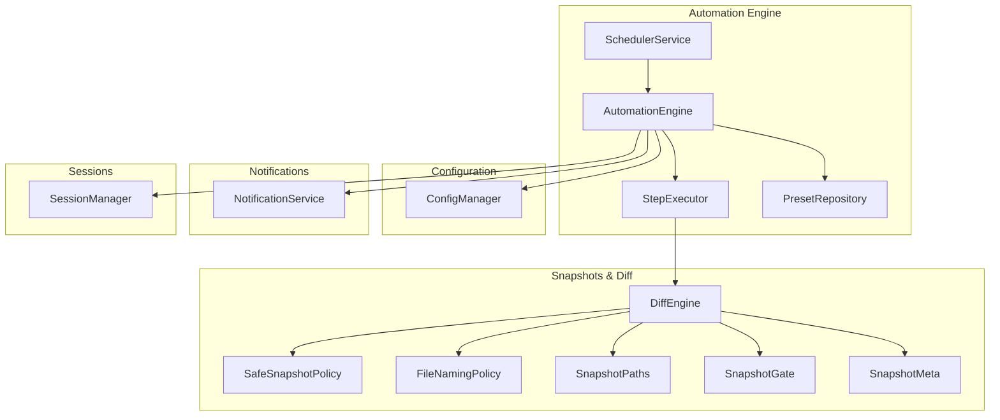
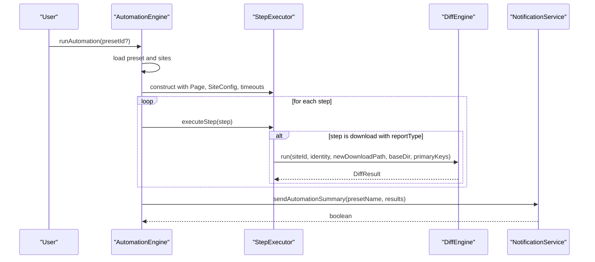
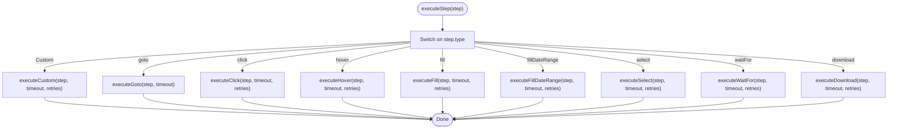
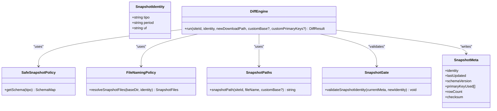
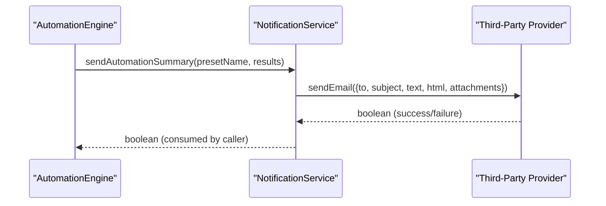
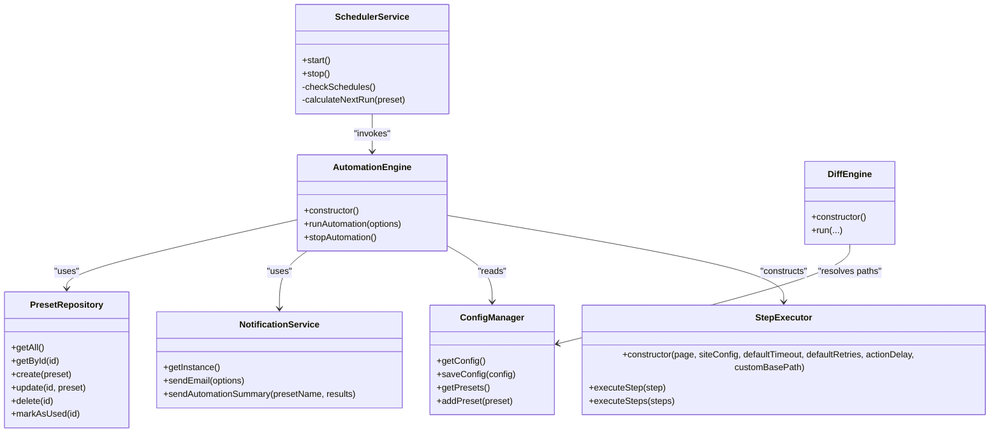
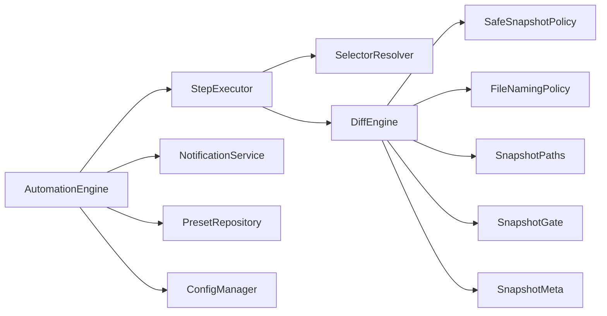

# Extension Points

<cite>
**Referenced Files in This Document**
- [step-executor.ts](file://app/automation/engine/step-executor.ts)
- [automation-engine.ts](file://app/automation/engine/automation-engine.ts)
- [scheduler-service.ts](file://app/automation/engine/scheduler-service.ts)
- [preset-repository.ts](file://app/automation/engine/preset-repository.ts)
- [config-manager.ts](file://app/config/config-manager.ts)
- [NotificationService.ts](file://app/core/notifications/NotificationService.ts)
- [DiffEngine.ts](file://app/core/diff/DiffEngine.ts)
- [SafeSnapshotPolicy.ts](file://app/policy/snapshot/SafeSnapshotPolicy.ts)
- [SnapshotContract.ts](file://app/policy/snapshot/SnapshotContract.ts)
- [FileNamingPolicy.ts](file://app/policy/snapshot/FileNamingPolicy.ts)
- [SnapshotPaths.ts](file://app/policy/snapshot/SnapshotPaths.ts)
- [SnapshotGate.ts](file://app/policy/snapshot/SnapshotGate.ts)
- [SnapshotMeta.ts](file://app/policy/snapshot/SnapshotMeta.ts)
- [Consolidator.ts](file://app/core/consolidation/Consolidator.ts)
- [session-manager.ts](file://app/automation/sessions/session-manager.ts)
</cite>

## Table of Contents
1. [Introduction](#introduction)
2. [Project Structure](#project-structure)
3. [Core Components](#core-components)
4. [Architecture Overview](#architecture-overview)
5. [Detailed Component Analysis](#detailed-component-analysis)
6. [Dependency Analysis](#dependency-analysis)
7. [Performance Considerations](#performance-considerations)
8. [Troubleshooting Guide](#troubleshooting-guide)
9. [Conclusion](#conclusion)
10. [Appendices](#appendices)

## Introduction
This document describes the extensible architecture of Automatizador Bravo and provides comprehensive guidance for extending the system through plugin interfaces, custom step development, snapshot policy extensions, and notification integrations. It explains how to register and wire extensions, how dependency injection works across the system, and how lifecycle management ensures stability during upgrades. Practical examples show how to implement custom automation actions, integrate third-party notification providers, and maintain backward compatibility with core updates.

## Project Structure
Automatizador Bravo is organized around a modular automation engine, configuration management, snapshot and diff policies, and a notification service. Extensions primarily attach at:
- Step execution boundaries (custom step types)
- Snapshot policy resolution (schema-driven identity validation)
- Notification dispatch (email provider abstraction)
- Scheduler hooks (preset-driven orchestration)
- Session management (browser context lifecycle)

**Diagram sources**
- [automation-engine.ts](file://app/automation/engine/automation-engine.ts#L50-L611)
- [step-executor.ts](file://app/automation/engine/step-executor.ts#L25-L549)
- [scheduler-service.ts](file://app/automation/engine/scheduler-service.ts#L6-L145)
- [preset-repository.ts](file://app/automation/engine/preset-repository.ts#L4-L34)
- [config-manager.ts](file://app/config/config-manager.ts#L85-L408)
- [DiffEngine.ts](file://app/core/diff/DiffEngine.ts#L23-L230)
- [SafeSnapshotPolicy.ts](file://app/policy/snapshot/SafeSnapshotPolicy.ts#L3-L25)
- [FileNamingPolicy.ts](file://app/policy/snapshot/FileNamingPolicy.ts#L4-L35)
- [SnapshotPaths.ts](file://app/policy/snapshot/SnapshotPaths.ts#L8-L13)
- [SnapshotGate.ts](file://app/policy/snapshot/SnapshotGate.ts#L4-L28)
- [SnapshotMeta.ts](file://app/policy/snapshot/SnapshotMeta.ts#L1-L18)
- [NotificationService.ts](file://app/core/notifications/NotificationService.ts#L13-L115)
- [session-manager.ts](file://app/automation/sessions/session-manager.ts#L67-L225)

**Section sources**
- [automation-engine.ts](file://app/automation/engine/automation-engine.ts#L50-L611)
- [config-manager.ts](file://app/config/config-manager.ts#L85-L408)

## Core Components
- StepExecutor: Executes predefined automation steps and integrates snapshot-aware download logic. It exposes extension points for custom step types and snapshot policy integration.
- AutomationEngine: Orchestrates browser sessions, login handling, step execution, progress reporting, and post-run consolidation and notifications.
- SchedulerService: Drives preset-based automation runs according to configured schedules.
- ConfigManager: Centralized configuration and preset management with validation and migration support.
- DiffEngine and SafeSnapshotPolicy: Enforce schema-driven identity validation and compute diffs for snapshot-aware downloads.
- NotificationService: Email-based notification dispatcher with configuration-driven behavior.
- SessionManager: Manages persistent browser contexts per site.

**Section sources**
- [step-executor.ts](file://app/automation/engine/step-executor.ts#L25-L549)
- [automation-engine.ts](file://app/automation/engine/automation-engine.ts#L50-L611)
- [scheduler-service.ts](file://app/automation/engine/scheduler-service.ts#L6-L145)
- [config-manager.ts](file://app/config/config-manager.ts#L85-L408)
- [DiffEngine.ts](file://app/core/diff/DiffEngine.ts#L23-L230)
- [SafeSnapshotPolicy.ts](file://app/policy/snapshot/SafeSnapshotPolicy.ts#L3-L25)
- [NotificationService.ts](file://app/core/notifications/NotificationService.ts#L13-L115)
- [session-manager.ts](file://app/automation/sessions/session-manager.ts#L67-L225)

## Architecture Overview
The extension model centers on:
- Plugin interfaces: Define contracts for custom steps, snapshot policies, and notification providers.
- Registration system: Register implementations via configuration or runtime wiring.
- Dependency injection: Core services are constructed with injected dependencies (e.g., StepExecutor receives Page, SiteConfig, timeouts).
- Lifecycle management: Initialization, periodic scheduling, and graceful shutdown.

**Diagram sources**
- [automation-engine.ts](file://app/automation/engine/automation-engine.ts#L62-L238)
- [step-executor.ts](file://app/automation/engine/step-executor.ts#L59-L110)
- [DiffEngine.ts](file://app/core/diff/DiffEngine.ts#L55-L229)
- [NotificationService.ts](file://app/core/notifications/NotificationService.ts#L75-L111)

## Detailed Component Analysis

### Extending the Step Executor with Custom Automation Actions
- Current step types supported: goto, click, hover, fill, fillDateRange, select, waitFor, download.
- Extension mechanism: Add a new case in the switch statement inside executeStep and implement a corresponding private method. The method should:
  - Validate required parameters (selector/value).
  - Use SelectorResolver for robust element resolution.
  - Apply timeout/retry semantics from step or defaults.
  - Optionally integrate with snapshot/download logic when applicable.
- Example extension pattern:
  - Define a new Step type union member.
  - Add a new executeXxx method with selector/value handling and logging.
  - Wire it in executeStep’s switch.
- Backward compatibility:
  - Keep default fallback behavior for unknown step types.
  - Ensure continueOnError is respected.

**Diagram sources**
- [step-executor.ts](file://app/automation/engine/step-executor.ts#L59-L110)
- [step-executor.ts](file://app/automation/engine/step-executor.ts#L137-L511)

**Section sources**
- [step-executor.ts](file://app/automation/engine/step-executor.ts#L14-L23)
- [step-executor.ts](file://app/automation/engine/step-executor.ts#L59-L110)
- [step-executor.ts](file://app/automation/engine/step-executor.ts#L137-L511)

### Implementing Custom Snapshot Policies
- Identity contract: SnapshotIdentity defines tipo, period, and uf.
- Policy enforcement: SafeSnapshotPolicy validates presence and non-empty primary key for a given tipo.
- DiffEngine integration: Uses SafeSnapshotPolicy to resolve primary keys or accepts customPrimaryKeys; computes diffs and writes CURRENT, DELETED, META.
- Extension points:
  - Extend schemaMaps.json with new tipo entries and primary keys.
  - Provide custom primary keys per site via SiteConfig.primaryKeys to override schema.
  - Use SnapshotGate to guard against identity mismatches.
- Naming and paths:
  - FileNamingPolicy builds filenames and resolves snapshot files.
  - SnapshotPaths centralizes snapshot directory resolution.

**Diagram sources**
- [SnapshotContract.ts](file://app/policy/snapshot/SnapshotContract.ts#L9-L19)
- [SafeSnapshotPolicy.ts](file://app/policy/snapshot/SafeSnapshotPolicy.ts#L3-L25)
- [DiffEngine.ts](file://app/core/diff/DiffEngine.ts#L23-L230)
- [FileNamingPolicy.ts](file://app/policy/snapshot/FileNamingPolicy.ts#L23-L35)
- [SnapshotPaths.ts](file://app/policy/snapshot/SnapshotPaths.ts#L8-L13)
- [SnapshotGate.ts](file://app/policy/snapshot/SnapshotGate.ts#L4-L28)
- [SnapshotMeta.ts](file://app/policy/snapshot/SnapshotMeta.ts#L1-L18)

**Section sources**
- [SnapshotContract.ts](file://app/policy/snapshot/SnapshotContract.ts#L1-L20)
- [SafeSnapshotPolicy.ts](file://app/policy/snapshot/SafeSnapshotPolicy.ts#L3-L25)
- [DiffEngine.ts](file://app/core/diff/DiffEngine.ts#L55-L229)
- [FileNamingPolicy.ts](file://app/policy/snapshot/FileNamingPolicy.ts#L23-L35)
- [SnapshotPaths.ts](file://app/policy/snapshot/SnapshotPaths.ts#L8-L13)
- [SnapshotGate.ts](file://app/policy/snapshot/SnapshotGate.ts#L4-L28)
- [SnapshotMeta.ts](file://app/policy/snapshot/SnapshotMeta.ts#L1-L18)

### Integrating Third-Party Notification Providers
- Current implementation: Email via nodemailer with SMTP configuration.
- Extension points:
  - Implement a provider interface (e.g., sendEmail(options) -> boolean).
  - Register provider via configuration (e.g., notifications.providers[]) and selection logic.
  - Respect continueOnError semantics and fallback behavior.
- Integration:
  - NotificationService delegates to provider based on configuration.
  - AutomationEngine triggers sendAutomationSummary after runs.

**Diagram sources**
- [NotificationService.ts](file://app/core/notifications/NotificationService.ts#L28-L111)
- [automation-engine.ts](file://app/automation/engine/automation-engine.ts#L232-L236)

**Section sources**
- [NotificationService.ts](file://app/core/notifications/NotificationService.ts#L13-L115)
- [automation-engine.ts](file://app/automation/engine/automation-engine.ts#L232-L236)

### Plugin Registration System and Dependency Injection Patterns
- Dependency injection:
  - AutomationEngine constructs StepExecutor with Page, SiteConfig, and timing parameters.
  - DiffEngine loads schemaMaps.json and injects SafeSnapshotPolicy.
  - NotificationService reads AppConfig for SMTP settings.
- Registration system:
  - PresetRepository persists and retrieves presets.
  - SchedulerService checks schedules and invokes AutomationEngine.runAutomation.
  - ConfigManager manages AppConfig and migrations.
- Wiring:
  - Singleton instances are exported for cross-module usage.
  - Path resolution and environment variable substitution handled centrally.

**Diagram sources**
- [automation-engine.ts](file://app/automation/engine/automation-engine.ts#L50-L611)
- [step-executor.ts](file://app/automation/engine/step-executor.ts#L37-L54)
- [DiffEngine.ts](file://app/core/diff/DiffEngine.ts#L26-L45)
- [NotificationService.ts](file://app/core/notifications/NotificationService.ts#L18-L23)
- [config-manager.ts](file://app/config/config-manager.ts#L192-L212)
- [preset-repository.ts](file://app/automation/engine/preset-repository.ts#L4-L34)
- [scheduler-service.ts](file://app/automation/engine/scheduler-service.ts#L16-L96)

**Section sources**
- [automation-engine.ts](file://app/automation/engine/automation-engine.ts#L324-L331)
- [config-manager.ts](file://app/config/config-manager.ts#L192-L212)
- [DiffEngine.ts](file://app/core/diff/DiffEngine.ts#L26-L45)
- [scheduler-service.ts](file://app/automation/engine/scheduler-service.ts#L16-L96)

### Lifecycle Management for Extensions
- Initialization:
  - Ensure Playwright browsers are installed and profiles directories exist.
  - Load and validate configuration; migrate legacy structures.
- Runtime:
  - SessionManager maintains persistent contexts per site.
  - SchedulerService periodically triggers automation runs.
  - AutomationEngine emits progress events and handles reauthentication.
- Shutdown:
  - Cleanup closes active sessions and resets state.
- Upgrade safety:
  - ConfigManager supports migrations and deprecation warnings.
  - DiffEngine validates schema presence and throws on missing files.

**Section sources**
- [session-manager.ts](file://app/automation/sessions/session-manager.ts#L13-L65)
- [config-manager.ts](file://app/config/config-manager.ts#L133-L190)
- [scheduler-service.ts](file://app/automation/engine/scheduler-service.ts#L38-L96)
- [automation-engine.ts](file://app/automation/engine/automation-engine.ts#L576-L587)

## Dependency Analysis
The system exhibits low coupling and high cohesion:
- StepExecutor depends on Playwright Page and SelectorResolver.
- DiffEngine depends on SafeSnapshotPolicy and file system utilities.
- NotificationService depends on ConfigManager and nodemailer.
- AutomationEngine orchestrates multiple collaborators with clear boundaries.

**Diagram sources**
- [step-executor.ts](file://app/automation/engine/step-executor.ts#L26-L44)
- [DiffEngine.ts](file://app/core/diff/DiffEngine.ts#L23-L45)
- [automation-engine.ts](file://app/automation/engine/automation-engine.ts#L50-L611)
- [NotificationService.ts](file://app/core/notifications/NotificationService.ts#L13-L115)
- [preset-repository.ts](file://app/automation/engine/preset-repository.ts#L4-L34)
- [config-manager.ts](file://app/config/config-manager.ts#L85-L408)

**Section sources**
- [step-executor.ts](file://app/automation/engine/step-executor.ts#L26-L44)
- [DiffEngine.ts](file://app/core/diff/DiffEngine.ts#L23-L45)
- [automation-engine.ts](file://app/automation/engine/automation-engine.ts#L50-L611)

## Performance Considerations
- Browser context reuse: SessionManager persists contexts to avoid repeated logins and profile initialization overhead.
- Headless execution: Default headless mode reduces resource consumption; configurable via AppConfig.
- Retry and timeout tuning: StepExecutor applies defaultTimeout and defaultRetries; steps can override per-case.
- Snapshot-aware downloads: DiffEngine minimizes I/O by writing only when diffs are computed; temporary files are cleaned up.
- Consolidation: Consolidator merges only successful runs and avoids unnecessary work when no data exists.

[No sources needed since this section provides general guidance]

## Troubleshooting Guide
- Step failures:
  - Enable continueOnError to skip failing steps and log warnings.
  - Inspect selector resolution and element visibility.
- Snapshot mismatches:
  - Validate SnapshotIdentity across runs; SnapshotGate prevents cross-period corruption.
  - Ensure primary keys are defined for reportType-enabled sites.
- Notification delivery:
  - Verify SMTP configuration and credentials; NotificationService logs warnings on incomplete settings.
- Scheduler conflicts:
  - If AutomationEngine reports “already running,” the scheduler waits until the next cycle.
- Session issues:
  - Clear active sessions or delete a specific site’s profile to recover from corrupted states.

**Section sources**
- [step-executor.ts](file://app/automation/engine/step-executor.ts#L102-L110)
- [SnapshotGate.ts](file://app/policy/snapshot/SnapshotGate.ts#L10-L26)
- [NotificationService.ts](file://app/core/notifications/NotificationService.ts#L32-L41)
- [scheduler-service.ts](file://app/automation/engine/scheduler-service.ts#L82-L90)
- [session-manager.ts](file://app/automation/sessions/session-manager.ts#L155-L165)

## Conclusion
Automatizador Bravo offers a pragmatic extension model centered on clear contracts and dependency injection. Developers can safely add custom steps, enforce schema-driven snapshot policies, integrate alternative notification providers, and leverage the scheduler for automated workflows. By adhering to the documented extension points and lifecycle practices, teams can maintain backward compatibility while evolving core capabilities.

[No sources needed since this section summarizes without analyzing specific files]

## Appendices

### Practical Examples

- Creating a custom step:
  - Add a new Step type and implement executeCustom in StepExecutor.
  - Use SelectorResolver for element resolution and apply timeout/retry semantics.
  - Integrate snapshot/download logic if the step produces downloadable artifacts.

- Implementing a custom snapshot policy:
  - Extend schemaMaps.json with a new tipo and primary keys.
  - Optionally override primary keys per site via SiteConfig.primaryKeys.
  - Use SnapshotGate to validate identity consistency across runs.

- Integrating a third-party notification provider:
  - Implement a provider with a sendEmail(options) -> boolean signature.
  - Register provider via configuration and select it in NotificationService.
  - Ensure error handling and fallback behavior.

- Testing extension compatibility:
  - Run AutomationEngine with minimal steps and verify logs.
  - Validate snapshot outputs and consolidated files.
  - Confirm notification delivery and scheduler behavior.

- Maintaining backward compatibility:
  - Use ConfigManager migrations for schema changes.
  - Keep deprecated APIs with warnings and plan phased removal.
  - Validate DiffEngine schema presence and handle missing files gracefully.

[No sources needed since this section provides general guidance]