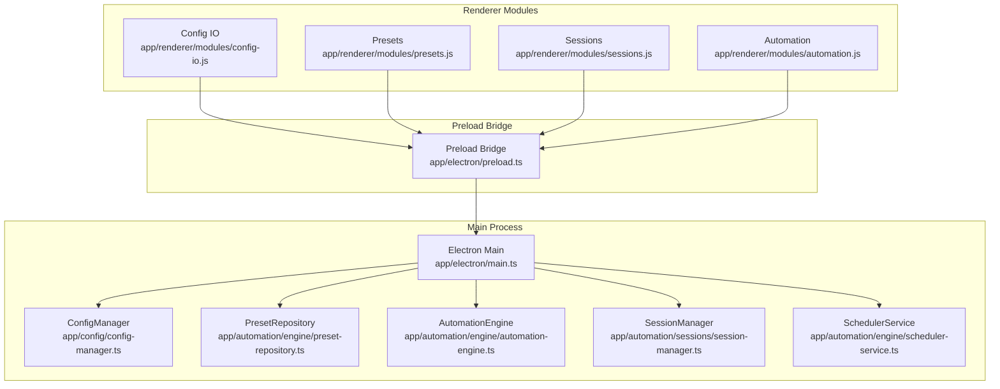
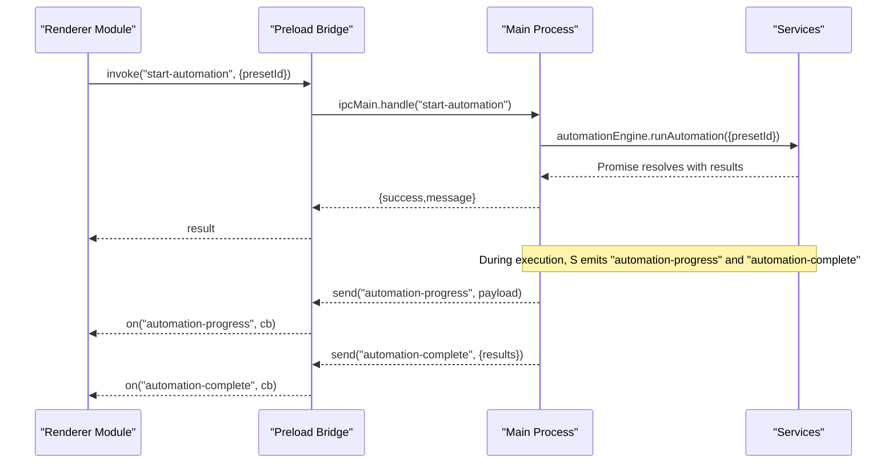
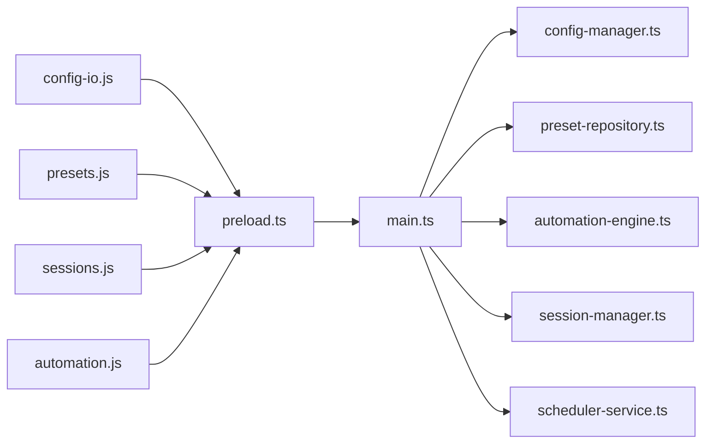

# IPC Handlers

<cite>
**Referenced Files in This Document**
- [main.ts](file://app/electron/main.ts)
- [preload.ts](file://app/electron/preload.ts)
- [config-manager.ts](file://app/config/config-manager.ts)
- [preset-repository.ts](file://app/automation/engine/preset-repository.ts)
- [automation-engine.ts](file://app/automation/engine/automation-engine.ts)
- [session-manager.ts](file://app/automation/sessions/session-manager.ts)
- [scheduler-service.ts](file://app/automation/engine/scheduler-service.ts)
- [config-io.js](file://app/renderer/modules/config-io.js)
- [presets.js](file://app/renderer/modules/presets.js)
- [sessions.js](file://app/renderer/modules/sessions.js)
- [automation.js](file://app/renderer/modules/automation.js)
</cite>

## Table of Contents
1. [Introduction](#introduction)
2. [Project Structure](#project-structure)
3. [Core Components](#core-components)
4. [Architecture Overview](#architecture-overview)
5. [Detailed Component Analysis](#detailed-component-analysis)
6. [Dependency Analysis](#dependency-analysis)
7. [Performance Considerations](#performance-considerations)
8. [Troubleshooting Guide](#troubleshooting-guide)
9. [Conclusion](#conclusion)

## Introduction
This document describes the Inter-Process Communication (IPC) handlers used by the main process of Automatizador Bravo to expose privileged operations to the renderer process. It covers all ipcMain.handle endpoints, their parameters, return values, error handling, and how the renderer invokes them via the exposed preload bridge. It also explains the bidirectional communication flow, authentication considerations, and security implications.

## Project Structure
The IPC layer is implemented in the Electron main process and bridged to the renderer via a controlled preload API. The main process registers handlers for configuration, presets, sessions, automation control, and system configuration. The renderer modules call these handlers through a thin wrapper exposed by preload.

**Diagram sources**
- [main.ts](file://app/electron/main.ts#L117-L281)
- [preload.ts](file://app/electron/preload.ts#L5-L47)
- [config-manager.ts](file://app/config/config-manager.ts#L85-L398)
- [preset-repository.ts](file://app/automation/engine/preset-repository.ts#L4-L34)
- [automation-engine.ts](file://app/automation/engine/automation-engine.ts#L50-L611)
- [session-manager.ts](file://app/automation/sessions/session-manager.ts#L67-L225)
- [scheduler-service.ts](file://app/automation/engine/scheduler-service.ts#L6-L145)

**Section sources**
- [main.ts](file://app/electron/main.ts#L117-L281)
- [preload.ts](file://app/electron/preload.ts#L5-L47)

## Core Components
- Main process IPC handlers: registered in the main process and invoked by the renderer.
- Preload bridge: exposes a safe subset of IPC APIs to the renderer.
- Renderer modules: consume the preload bridge to call handlers and listen to events.

Key responsibilities:
- Configuration management: get-config, save-config, export-config, import-config
- Preset operations: get-presets, save-preset, delete-preset
- Session management: get-session-status, delete-session, clear-sessions, open-browser-for-login
- Automation control: start-automation, stop-automation, get-automation-status
- System configuration: get-auto-launch-status, set-auto-launch

**Section sources**
- [main.ts](file://app/electron/main.ts#L117-L281)
- [preload.ts](file://app/electron/preload.ts#L5-L47)

## Architecture Overview
The renderer invokes preload APIs, which call ipcRenderer.invoke on named channels. The main process receives these invocations via ipcMain.handle and performs operations using internal services. Some handlers send events back to the renderer for progress and completion.

**Diagram sources**
- [main.ts](file://app/electron/main.ts#L214-L241)
- [automation-engine.ts](file://app/automation/engine/automation-engine.ts#L548-L556)
- [automation-engine.ts](file://app/automation/engine/automation-engine.ts#L220-L237)
- [preload.ts](file://app/electron/preload.ts#L36-L43)

## Detailed Component Analysis

### Configuration Management

- Channel: get-config
  - Purpose: Retrieve the current application configuration.
  - Parameters: None.
  - Returns: AppConfig object (validated and normalized).
  - Error handling: Throws if loading fails; renderer should catch and notify.
  - Security: No authentication required; returns persisted configuration.
  - Example usage: Renderer loads configuration on startup.

- Channel: save-config
  - Purpose: Persist configuration changes.
  - Parameters: config (AppConfig).
  - Returns: { success: boolean }.
  - Error handling: Throws on validation or write failure; renderer catches and shows notification.
  - Security: No authentication required; writes to disk.
  - Example usage: Renderer saves user preferences after edits.

- Channel: export-config
  - Purpose: Export configuration to a serializable object.
  - Parameters: None.
  - Returns: { success: boolean, data: ExportedData } or { success: false, error: string }.
  - Error handling: Catches exceptions and returns structured error.
  - Security: No authentication required; returns serialized data.
  - Example usage: Renderer triggers download of exported JSON.

- Channel: import-config
  - Purpose: Import configuration from a previously exported object.
  - Parameters: importedData (ExportedData).
  - Returns: { success: boolean, result: { presetsAdded, presetsUpdated, warnings[] } } or { success: false, error: string }.
  - Error handling: Validates and merges presets; returns warnings for updates.
  - Security: No authentication required; merges into persisted configuration.
  - Example usage: Renderer reads file and imports presets.

**Section sources**
- [main.ts](file://app/electron/main.ts#L119-L126)
- [main.ts](file://app/electron/main.ts#L148-L164)
- [config-manager.ts](file://app/config/config-manager.ts#L192-L212)
- [config-manager.ts](file://app/config/config-manager.ts#L334-L348)
- [config-manager.ts](file://app/config/config-manager.ts#L353-L394)
- [config-io.js](file://app/renderer/modules/config-io.js#L9-L43)
- [config-io.js](file://app/renderer/modules/config-io.js#L48-L113)

### Preset Operations

- Channel: get-presets
  - Purpose: List all presets.
  - Parameters: None.
  - Returns: Preset[].
  - Error handling: Returns empty array if none; renderer should handle gracefully.
  - Security: No authentication required; reads from persisted configuration.
  - Example usage: Renderer populates preset selectors and lists.

- Channel: save-preset
  - Purpose: Create or update a preset.
  - Parameters: preset (Preset).
  - Returns: { success: boolean }.
  - Error handling: Validates and persists; throws on errors.
  - Security: No authentication required; writes to persisted configuration.
  - Example usage: Renderer saves preset form data.

- Channel: delete-preset
  - Purpose: Remove a preset by ID.
  - Parameters: id (string).
  - Returns: { success: boolean }.
  - Error handling: Removes from persisted configuration; returns success/failure semantics.
  - Security: No authentication required; modifies persisted configuration.
  - Example usage: Renderer confirms deletion and refreshes lists.

**Section sources**
- [main.ts](file://app/electron/main.ts#L129-L145)
- [preset-repository.ts](file://app/automation/engine/preset-repository.ts#L4-L34)
- [config-manager.ts](file://app/config/config-manager.ts#L216-L256)
- [presets.js](file://app/renderer/modules/presets.js#L18-L98)
- [presets.js](file://app/renderer/modules/presets.js#L154-L208)
- [presets.js](file://app/renderer/modules/presets.js#L302-L313)

### Session Management

- Channel: get-session-status
  - Purpose: Enumerate session existence per site.
  - Parameters: None.
  - Returns: Array of { siteId, siteName, uf, hasSession, path }.
  - Error handling: Iterates over known sites; returns presence flags.
  - Security: No authentication required; checks filesystem paths under userData.
  - Example usage: Renderer displays session list and actions.

- Channel: delete-session
  - Purpose: Delete a specific session’s profile directory.
  - Parameters: siteId (string).
  - Returns: { success: boolean }.
  - Error handling: Checks existence and removes directory recursively; returns success/failure.
  - Security: No authentication required; operates on user data directory.
  - Example usage: Renderer clears a selected session.

- Channel: clear-sessions
  - Purpose: Clear all session profiles.
  - Parameters: None.
  - Returns: { success: boolean }.
  - Error handling: Closes active sessions and removes profiles directory; recreates directory.
  - Security: No authentication required; affects user data directory.
  - Example usage: Renderer clears all sessions with confirmation.

- Channel: open-browser-for-login
  - Purpose: Open a visible browser for manual login or captcha resolution.
  - Parameters: siteId (string).
  - Returns: { success: boolean }.
  - Error handling: Ensures no automation is running; opens persistent context; resolves on close.
  - Security: No authentication required; opens visible browser for user interaction.
  - Example usage: Renderer opens login browser for a given site.

**Section sources**
- [main.ts](file://app/electron/main.ts#L167-L196)
- [main.ts](file://app/electron/main.ts#L198-L200)
- [session-manager.ts](file://app/automation/sessions/session-manager.ts#L170-L200)
- [session-manager.ts](file://app/automation/sessions/session-manager.ts#L206-L214)
- [session-manager.ts](file://app/automation/sessions/session-manager.ts#L478-L515)
- [sessions.js](file://app/renderer/modules/sessions.js#L11-L57)
- [sessions.js](file://app/renderer/modules/sessions.js#L72-L83)
- [sessions.js](file://app/renderer/modules/sessions.js#L85-L96)
- [sessions.js](file://app/renderer/modules/sessions.js#L59-L70)

### Automation Control

- Channel: get-automation-status
  - Purpose: Query automation engine status.
  - Parameters: None.
  - Returns: String literal "PARADA".
  - Error handling: Always returns current status string.
  - Security: No authentication required; read-only status.
  - Example usage: Renderer updates UI badges.

- Channel: start-automation
  - Purpose: Start automation for a given preset.
  - Parameters: config (object) with presetId (string).
  - Returns: { success: boolean, message: string }.
  - Error handling: Starts engine; on completion/error, sends "automation-complete" or "automation-error".
  - Security: No authentication required; runs configured steps against target sites.
  - Example usage: Renderer initiates automation and listens for progress/completion.

- Channel: stop-automation
  - Purpose: Stop automation if running.
  - Parameters: None.
  - Returns: { success: boolean, message: string }.
  - Error handling: Stops engine and cleans up resources.
  - Security: No authentication required; stops running automation.
  - Example usage: Renderer requests stop and toggles UI.

- Events emitted to renderer:
  - automation-progress: Progress updates during execution.
  - automation-complete: Final results when automation finishes.
  - automation-error: Error messages when automation fails.
  - site-complete: Per-site completion updates.

**Section sources**
- [main.ts](file://app/electron/main.ts#L210-L241)
- [automation-engine.ts](file://app/automation/engine/automation-engine.ts#L599-L607)
- [automation-engine.ts](file://app/automation/engine/automation-engine.ts#L62-L238)
- [automation-engine.ts](file://app/automation/engine/automation-engine.ts#L548-L556)
- [automation-engine.ts](file://app/automation/engine/automation-engine.ts#L158-L161)
- [automation-engine.ts](file://app/automation/engine/automation-engine.ts#L220-L237)
- [automation-engine.ts](file://app/automation/engine/automation-engine.ts#L561-L571)
- [automation.js](file://app/renderer/modules/automation.js#L7-L45)
- [automation.js](file://app/renderer/modules/automation.js#L47-L57)
- [preload.ts](file://app/electron/preload.ts#L36-L43)

### System Configuration (Auto-Launch)

- Channel: get-auto-launch-status
  - Purpose: Query whether the app is configured to launch with Windows.
  - Parameters: None.
  - Returns: { enabled: boolean, available: boolean }.
  - Error handling: On non-packaged environments, returns unavailable; otherwise reads settings.
  - Security: No authentication required; reads OS login item settings.
  - Example usage: Renderer enables/disables controls based on availability.

- Channel: set-auto-launch
  - Purpose: Enable or disable auto-launch with Windows.
  - Parameters: enabled (boolean).
  - Returns: { success: boolean, message: string }.
  - Error handling: Updates OS login item settings; returns success or error message.
  - Security: No authentication required; modifies OS settings.
  - Example usage: Renderer toggles auto-launch and shows feedback.

**Section sources**
- [main.ts](file://app/electron/main.ts#L244-L280)

## Dependency Analysis

**Diagram sources**
- [main.ts](file://app/electron/main.ts#L117-L281)
- [preload.ts](file://app/electron/preload.ts#L5-L47)
- [config-manager.ts](file://app/config/config-manager.ts#L85-L398)
- [preset-repository.ts](file://app/automation/engine/preset-repository.ts#L4-L34)
- [automation-engine.ts](file://app/automation/engine/automation-engine.ts#L50-L611)
- [session-manager.ts](file://app/automation/sessions/session-manager.ts#L67-L225)
- [scheduler-service.ts](file://app/automation/engine/scheduler-service.ts#L6-L145)

**Section sources**
- [main.ts](file://app/electron/main.ts#L117-L281)
- [preload.ts](file://app/electron/preload.ts#L5-L47)

## Performance Considerations
- IPC invocation overhead: Each invoke call crosses process boundaries; batch operations where possible (e.g., bulk preset updates).
- Filesystem operations: Session deletion and clearing operate on disk; avoid frequent repeated deletions.
- Browser contexts: Opening persistent contexts for login can be expensive; reuse where feasible.
- Logging and notifications: Excessive logging can impact responsiveness; keep logs at appropriate verbosity.

## Troubleshooting Guide
Common issues and resolutions:
- Export/Import failures: Validate input JSON; ensure it contains a config field. Check warnings returned by import.
- Preset save/delete errors: Verify preset data conforms to schema; check for missing required fields.
- Session deletion errors: Confirm the session directory exists; ensure no active locks.
- Automation start failures: Ensure a preset is selected; verify preset has associated sites; check for running automation conflicts.
- Auto-launch toggles: Only available in packaged builds; non-packaged environments return unavailable.

**Section sources**
- [main.ts](file://app/electron/main.ts#L148-L164)
- [main.ts](file://app/electron/main.ts#L198-L200)
- [main.ts](file://app/electron/main.ts#L244-L280)
- [config-manager.ts](file://app/config/config-manager.ts#L353-L394)
- [config-manager.ts](file://app/config/config-manager.ts#L216-L256)
- [session-manager.ts](file://app/automation/sessions/session-manager.ts#L170-L200)
- [automation-engine.ts](file://app/automation/engine/automation-engine.ts#L62-L116)

## Conclusion
The IPC layer cleanly separates renderer concerns from privileged operations in the main process. Handlers are designed around clear responsibilities, robust error reporting, and safe defaults. Renderer modules consume these handlers through a controlled preload bridge, enabling bidirectional communication via events for progress and completion. Security is maintained by avoiding direct Node integration in the renderer and by validating and sanitizing inputs at the main process boundary.