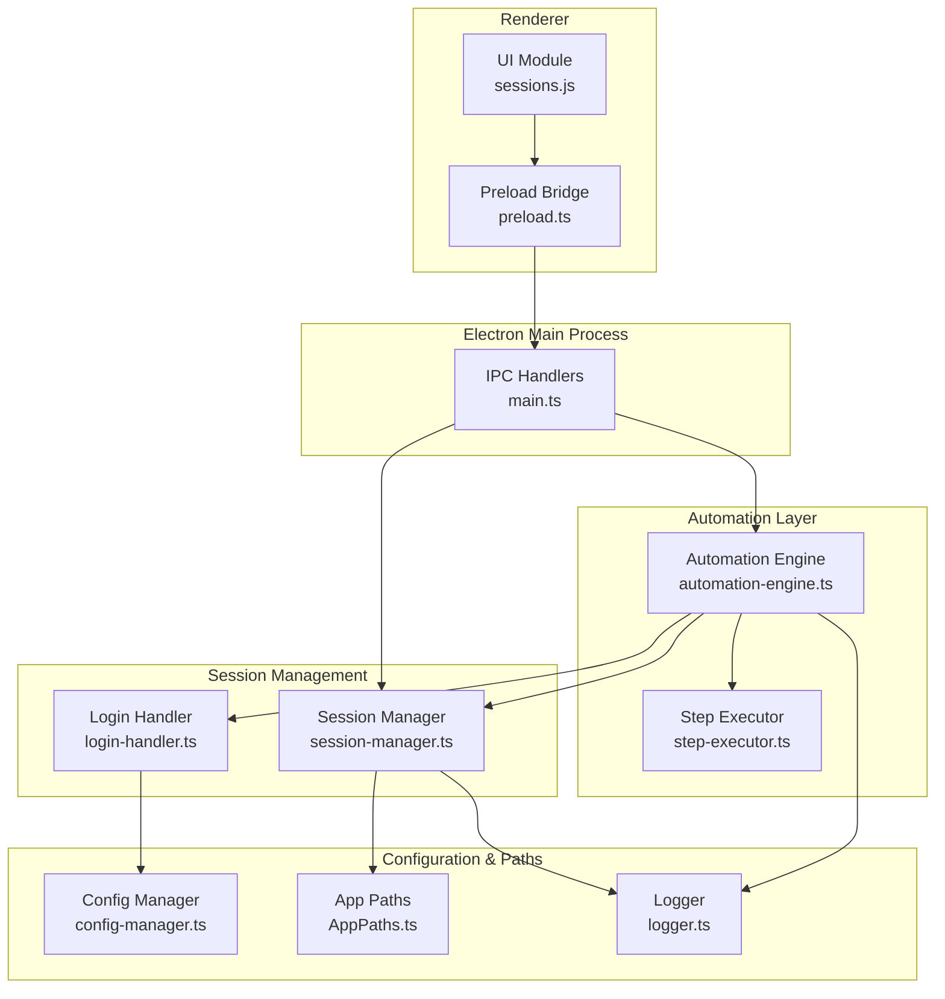
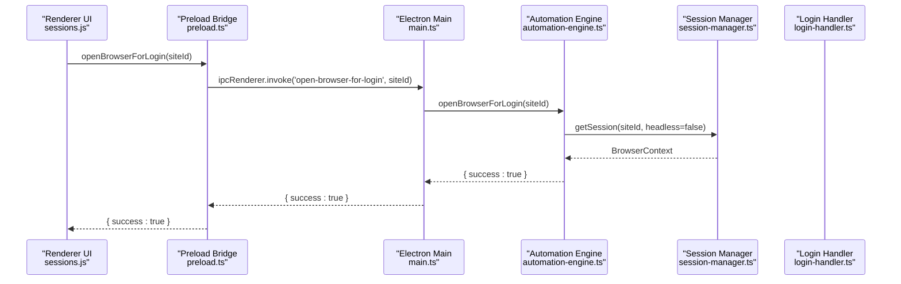
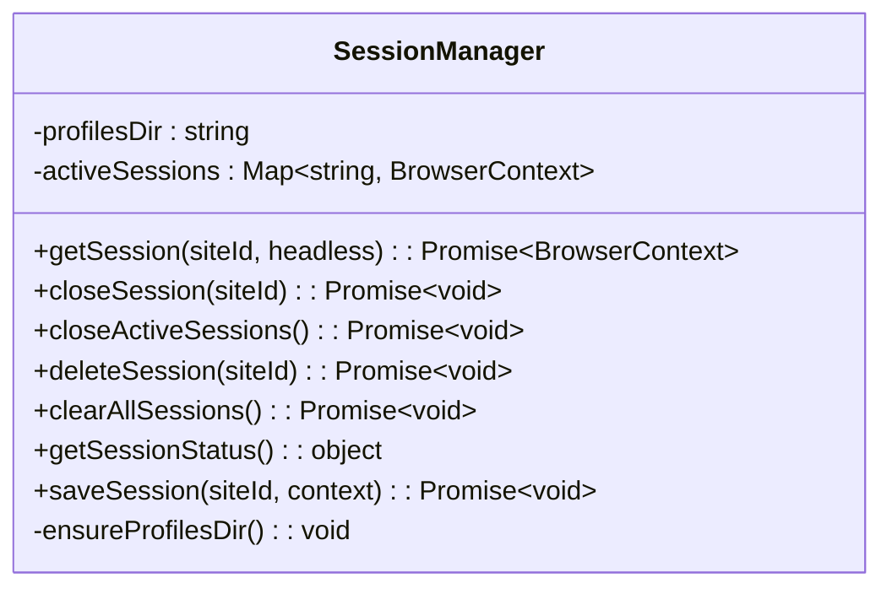
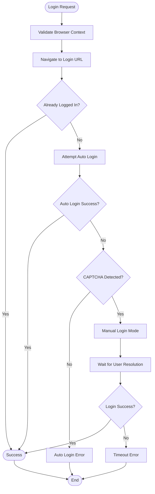
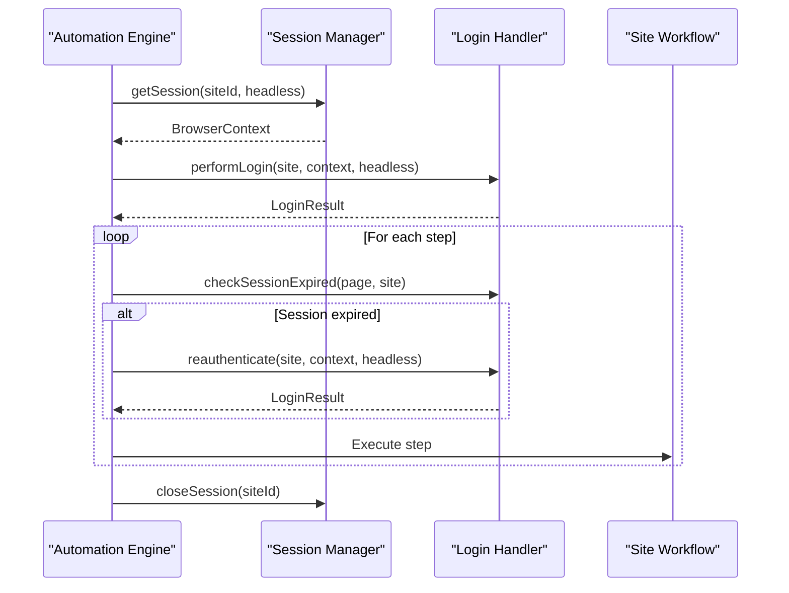
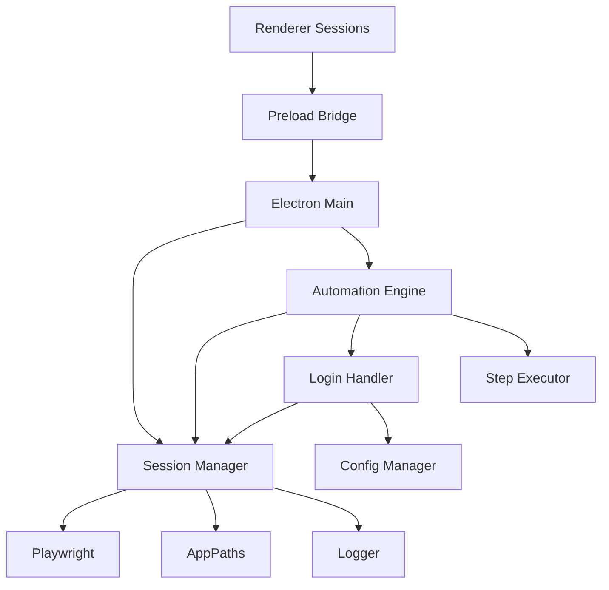

# Session Management API

<cite>
**Referenced Files in This Document**
- [session-manager.ts](file://app/automation/sessions/session-manager.ts)
- [login-handler.ts](file://app/automation/sessions/login-handler.ts)
- [automation-engine.ts](file://app/automation/engine/automation-engine.ts)
- [sessions.js](file://app/renderer/modules/sessions.js)
- [preload.ts](file://app/electron/preload.ts)
- [main.ts](file://app/electron/main.ts)
- [config-manager.ts](file://app/config/config-manager.ts)
- [AppPaths.ts](file://app/core/utils/AppPaths.ts)
- [logger.ts](file://app/config/logger.ts)
- [step-executor.ts](file://app/automation/engine/step-executor.ts)
</cite>

## Table of Contents
1. [Introduction](#introduction)
2. [Project Structure](#project-structure)
3. [Core Components](#core-components)
4. [Architecture Overview](#architecture-overview)
5. [Detailed Component Analysis](#detailed-component-analysis)
6. [Dependency Analysis](#dependency-analysis)
7. [Performance Considerations](#performance-considerations)
8. [Troubleshooting Guide](#troubleshooting-guide)
9. [Conclusion](#conclusion)

## Introduction
This document provides comprehensive API documentation for Automatizador Bravo's browser session management system. It covers session lifecycle management, persistent context operations, anti-captcha integration, and session persistence mechanisms. The documentation explains the relationship between sessions, browser contexts, and automation workflows, and includes practical examples, troubleshooting guidance, and integration patterns with the broader automation system.

## Project Structure
The session management system spans several layers:
- Electron main process handles IPC handlers for session operations
- Renderer module exposes UI actions for session management
- Automation engine orchestrates session lifecycle during workflows
- Session manager encapsulates Playwright persistent context management
- Login handler manages authentication and anti-captcha scenarios
- Configuration and path utilities define storage locations and migration logic

**Diagram sources**
- [main.ts](file://app/electron/main.ts#L117-L281)
- [sessions.js](file://app/renderer/modules/sessions.js#L1-L104)
- [preload.ts](file://app/electron/preload.ts#L1-L47)
- [automation-engine.ts](file://app/automation/engine/automation-engine.ts#L50-L611)
- [session-manager.ts](file://app/automation/sessions/session-manager.ts#L67-L225)
- [login-handler.ts](file://app/automation/sessions/login-handler.ts#L13-L364)
- [config-manager.ts](file://app/config/config-manager.ts#L85-L408)
- [AppPaths.ts](file://app/core/utils/AppPaths.ts#L5-L60)
- [logger.ts](file://app/config/logger.ts#L1-L104)

**Section sources**
- [main.ts](file://app/electron/main.ts#L117-L281)
- [sessions.js](file://app/renderer/modules/sessions.js#L1-L104)
- [preload.ts](file://app/electron/preload.ts#L1-L47)
- [automation-engine.ts](file://app/automation/engine/automation-engine.ts#L50-L611)
- [session-manager.ts](file://app/automation/sessions/session-manager.ts#L67-L225)
- [login-handler.ts](file://app/automation/sessions/login-handler.ts#L13-L364)
- [config-manager.ts](file://app/config/config-manager.ts#L85-L408)
- [AppPaths.ts](file://app/core/utils/AppPaths.ts#L5-L60)
- [logger.ts](file://app/config/logger.ts#L1-L104)

## Core Components
- Session Manager: Manages persistent browser contexts using Playwright's persistent context, handles profile storage, and provides lifecycle operations (open/close/delete/clear).
- Login Handler: Performs automatic login, detects and handles CAPTCHA challenges, and re-authenticates when sessions expire.
- Automation Engine: Coordinates session usage during automation runs, manages visibility modes, and handles session expiration detection and re-authentication.
- Renderer Sessions Module: Provides UI actions for managing sessions (open, delete, clear) and integrates with Electron IPC.
- IPC Handlers: Bridge between renderer and main process for session operations.

Key responsibilities:
- Session lifecycle: Creation, reuse, closure, deletion, and clearing
- Authentication: Automatic login, manual intervention, and re-authentication
- Anti-captcha: Detection and manual resolution workflows
- Persistence: Profile storage and migration logic
- Monitoring: Status reporting and logging

**Section sources**
- [session-manager.ts](file://app/automation/sessions/session-manager.ts#L67-L225)
- [login-handler.ts](file://app/automation/sessions/login-handler.ts#L13-L364)
- [automation-engine.ts](file://app/automation/engine/automation-engine.ts#L50-L611)
- [sessions.js](file://app/renderer/modules/sessions.js#L1-L104)
- [main.ts](file://app/electron/main.ts#L117-L281)

## Architecture Overview
The session management architecture integrates tightly with the automation engine and Electron IPC:

**Diagram sources**
- [sessions.js](file://app/renderer/modules/sessions.js#L59-L70)
- [preload.ts](file://app/electron/preload.ts#L15-L19)
- [main.ts](file://app/electron/main.ts#L198-L200)
- [automation-engine.ts](file://app/automation/engine/automation-engine.ts#L478-L515)
- [session-manager.ts](file://app/automation/sessions/session-manager.ts#L103-L138)

**Section sources**
- [automation-engine.ts](file://app/automation/engine/automation-engine.ts#L478-L515)
- [session-manager.ts](file://app/automation/sessions/session-manager.ts#L103-L138)
- [main.ts](file://app/electron/main.ts#L198-L200)
- [preload.ts](file://app/electron/preload.ts#L15-L19)
- [sessions.js](file://app/renderer/modules/sessions.js#L59-L70)

## Detailed Component Analysis

### Session Manager API
The Session Manager provides persistent browser context management with robust lifecycle operations and profile persistence.

Core methods:
- getSession(siteId, headless): Creates or retrieves a persistent browser context for a given site
- closeSession(siteId): Closes an active session
- closeActiveSessions(): Closes all active sessions
- deleteSession(siteId): Deletes a session profile from disk
- clearAllSessions(): Removes all session profiles
- getSessionStatus(): Returns active and persisted session counts
- saveSession(siteId, context): Legacy method (now handled automatically)

Session lifecycle:
1. Context creation: Uses Playwright's launchPersistentContext with custom arguments
2. Memory caching: Active contexts are cached in-memory for reuse
3. Profile storage: Uses AppPaths to determine storage locations
4. Migration: Handles migration from legacy storage locations

**Diagram sources**
- [session-manager.ts](file://app/automation/sessions/session-manager.ts#L67-L225)

**Section sources**
- [session-manager.ts](file://app/automation/sessions/session-manager.ts#L67-L225)
- [AppPaths.ts](file://app/core/utils/AppPaths.ts#L27-L29)

### Login Handler API
The Login Handler manages authentication workflows, including automatic login, CAPTCHA detection, and session re-authentication.

Key capabilities:
- Automatic login: Fills credentials and submits forms
- Manual intervention: Opens visible browser for CAPTCHA resolution
- Session expiration detection: Monitors for login redirects and expired indicators
- Re-authentication: Cleans expired sessions and performs fresh login

**Diagram sources**
- [login-handler.ts](file://app/automation/sessions/login-handler.ts#L28-L77)
- [login-handler.ts](file://app/automation/sessions/login-handler.ts#L108-L151)
- [login-handler.ts](file://app/automation/sessions/login-handler.ts#L187-L209)
- [login-handler.ts](file://app/automation/sessions/login-handler.ts#L214-L246)

**Section sources**
- [login-handler.ts](file://app/automation/sessions/login-handler.ts#L13-L364)

### Automation Engine Integration
The Automation Engine coordinates session usage during automation runs, managing visibility modes and session expiration handling.

Session orchestration:
- Pre-run cleanup: Closes previous active sessions
- Context acquisition: Retrieves persistent context for each site
- Visibility management: Forces visible mode for manual intervention
- Expiration monitoring: Periodically checks for session expiration
- Re-authentication: Automatically cleans and re-authenticates when needed

**Diagram sources**
- [automation-engine.ts](file://app/automation/engine/automation-engine.ts#L290-L390)
- [automation-engine.ts](file://app/automation/engine/automation-engine.ts#L350-L375)
- [login-handler.ts](file://app/automation/sessions/login-handler.ts#L333-L360)

**Section sources**
- [automation-engine.ts](file://app/automation/engine/automation-engine.ts#L262-L446)
- [login-handler.ts](file://app/automation/sessions/login-handler.ts#L288-L360)

### Renderer Session Management
The renderer module provides UI actions for session management, integrating with Electron IPC for backend operations.

Available operations:
- Manage sessions: Open session management modal and load session list
- Load sessions: Retrieve session status from backend
- Open session browser: Launch visible browser for manual login
- Delete individual session: Remove session profile from disk
- Clear all sessions: Remove all session profiles
- New session: Redirect to site configuration

**Section sources**
- [sessions.js](file://app/renderer/modules/sessions.js#L1-L104)

## Dependency Analysis
The session management system exhibits clear separation of concerns with well-defined dependencies:

**Diagram sources**
- [session-manager.ts](file://app/automation/sessions/session-manager.ts#L1-L10)
- [login-handler.ts](file://app/automation/sessions/login-handler.ts#L1-L5)
- [automation-engine.ts](file://app/automation/engine/automation-engine.ts#L1-L12)
- [sessions.js](file://app/renderer/modules/sessions.js#L1-L4)
- [preload.ts](file://app/electron/preload.ts#L1-L4)
- [main.ts](file://app/electron/main.ts#L1-L10)

**Section sources**
- [session-manager.ts](file://app/automation/sessions/session-manager.ts#L1-L10)
- [login-handler.ts](file://app/automation/sessions/login-handler.ts#L1-L5)
- [automation-engine.ts](file://app/automation/engine/automation-engine.ts#L1-L12)
- [sessions.js](file://app/renderer/modules/sessions.js#L1-L4)
- [preload.ts](file://app/electron/preload.ts#L1-L4)
- [main.ts](file://app/electron/main.ts#L1-L10)

## Performance Considerations
- Context reuse: Session Manager caches active contexts to minimize startup overhead
- Headless optimization: Default headless mode reduces resource consumption
- Profile isolation: Separate profiles per site prevent cross-site contamination
- Memory management: Proper cleanup ensures no lingering browser processes
- Anti-captcha efficiency: Manual intervention mode prevents infinite waits
- Logging overhead: Structured logging minimizes performance impact

## Troubleshooting Guide

Common session issues and resolutions:

### Session Lock Errors
Symptoms: Cannot open session, "profile in use" errors
Resolution: Close all active sessions before opening manual browser
- Use Automation Engine's cleanup before manual intervention
- Check for lingering browser processes

### CAPTCHA Detection
Symptoms: Login fails with CAPTCHA elements present
Resolution: Enable visible mode for manual resolution
- Login Handler throws explicit error in headless mode with CAPTCHA
- Manual intervention required for CAPTCHA resolution

### Session Expiration
Symptoms: Automatic logout during workflow execution
Resolution: Automatic re-authentication
- Login Handler detects expiration and triggers re-authentication
- Session Manager deletes expired profile before re-login

### Storage Migration Issues
Symptoms: Missing sessions after updates
Resolution: Automatic migration from legacy paths
- Session Manager and Config Manager handle migration automatically
- Verify AppPaths configuration for correct storage locations

**Section sources**
- [login-handler.ts](file://app/automation/sessions/login-handler.ts#L56-L63)
- [automation-engine.ts](file://app/automation/engine/automation-engine.ts#L350-L375)
- [session-manager.ts](file://app/automation/sessions/session-manager.ts#L170-L183)
- [config-manager.ts](file://app/config/config-manager.ts#L133-L190)

## Conclusion
Automatizador Bravo's session management system provides a robust foundation for browser automation with persistent contexts, comprehensive authentication handling, and seamless integration with the broader automation framework. The system's modular design, clear separation of concerns, and automated migration capabilities ensure reliable operation across diverse deployment scenarios. The combination of automatic session management, anti-captcha support, and comprehensive logging enables efficient troubleshooting and maintenance of complex automation workflows.