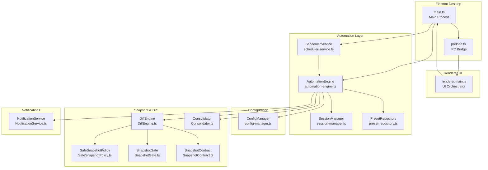
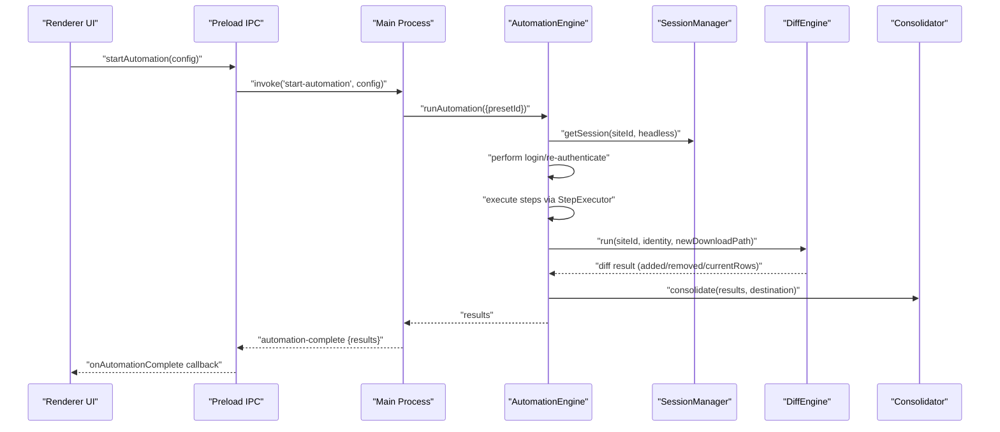
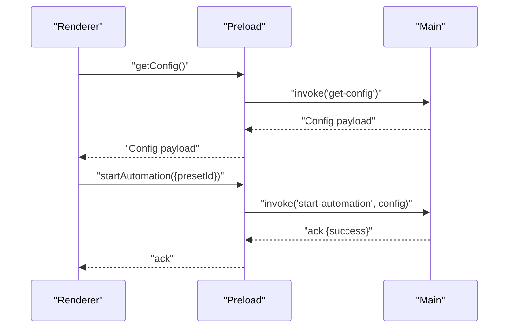
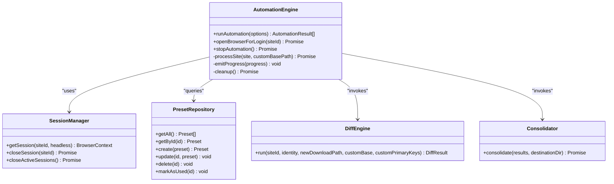
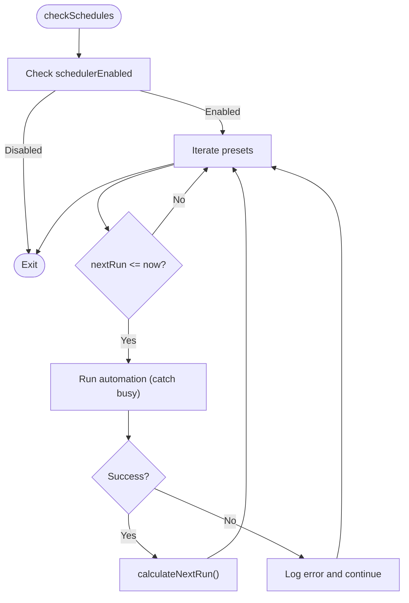
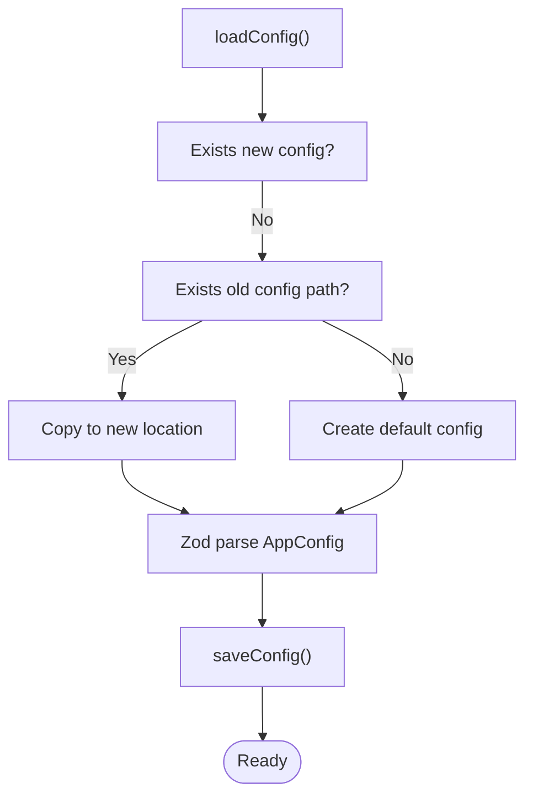
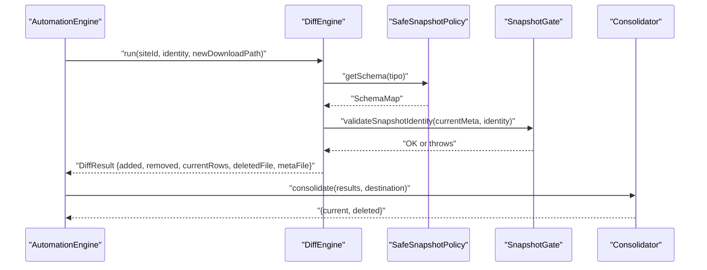
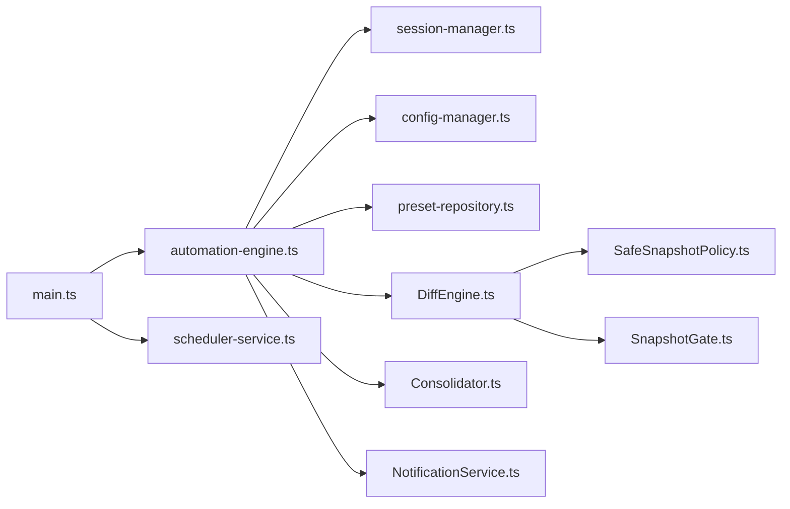
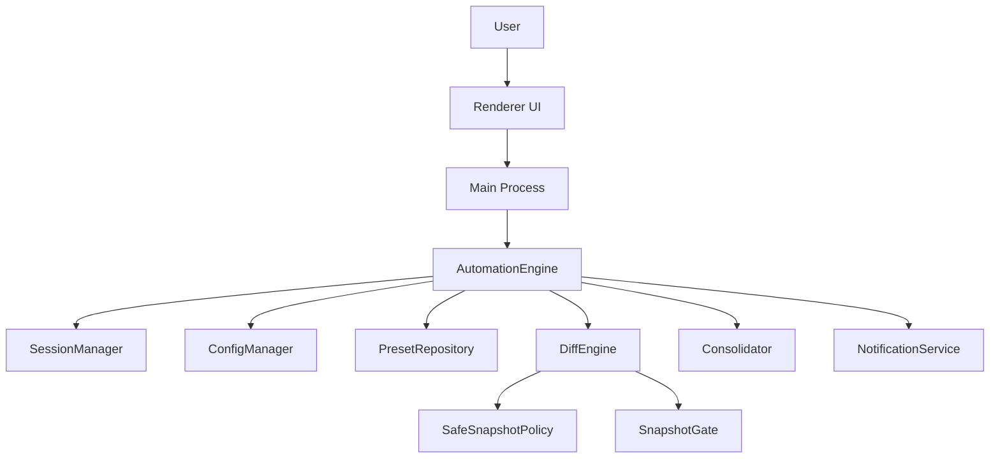

# Architecture Overview

<cite>
**Referenced Files in This Document**
- [app/electron/main.ts](file://app/electron/main.ts)
- [app/electron/preload.ts](file://app/electron/preload.ts)
- [app/automation/engine/automation-engine.ts](file://app/automation/engine/automation-engine.ts)
- [app/automation/engine/preset-repository.ts](file://app/automation/engine/preset-repository.ts)
- [app/automation/engine/scheduler-service.ts](file://app/automation/engine/scheduler-service.ts)
- [app/automation/sessions/session-manager.ts](file://app/automation/sessions/session-manager.ts)
- [app/config/config-manager.ts](file://app/config/config-manager.ts)
- [app/policy/snapshot/SafeSnapshotPolicy.ts](file://app/policy/snapshot/SafeSnapshotPolicy.ts)
- [app/policy/snapshot/SnapshotContract.ts](file://app/policy/snapshot/SnapshotContract.ts)
- [app/policy/snapshot/SnapshotGate.ts](file://app/policy/snapshot/SnapshotGate.ts)
- [app/core/diff/DiffEngine.ts](file://app/core/diff/DiffEngine.ts)
- [app/core/consolidation/Consolidator.ts](file://app/core/consolidation/Consolidator.ts)
- [app/core/notifications/NotificationService.ts](file://app/core/notifications/NotificationService.ts)
- [app/renderer/main.js](file://app/renderer/main.js)
- [package.json](file://package.json)
</cite>

## Table of Contents
1. [Introduction](#introduction)
2. [Project Structure](#project-structure)
3. [Core Components](#core-components)
4. [Architecture Overview](#architecture-overview)
5. [Detailed Component Analysis](#detailed-component-analysis)
6. [Dependency Analysis](#dependency-analysis)
7. [Performance Considerations](#performance-considerations)
8. [Troubleshooting Guide](#troubleshooting-guide)
9. [Conclusion](#conclusion)
10. [Appendices](#appendices)

## Introduction
This document presents the architecture of Automatizador Bravo, a corporate-grade desktop application that orchestrates web automation across multiple sites. The system is built with Electron, separating the main process (desktop orchestration) from the renderer process (UI), and integrates a robust automation engine powered by Playwright. A central configuration manager governs presets, schedules, and runtime settings. A Safe Snapshot Policy (SSP) ensures data integrity by enforcing schema-driven identity checks and differential comparison of downloaded reports. The architecture emphasizes isolation (per-site sessions), scalability (scheduler service), and resilience (timeouts, watchdogs, and cleanup routines).

## Project Structure
The repository follows a layered, feature-oriented structure:
- Electron main and preload scripts define the desktop boundary and IPC bridge.
- Renderer modules encapsulate UI logic and integrate with the main process via IPC.
- Automation engine coordinates site execution, session management, and scheduling.
- Configuration management enforces typed configuration and migration logic.
- Snapshot policy and diff engine implement enterprise-safe auditing and consolidation.
- Notifications provide optional email summaries.

**Diagram sources**
- [app/electron/main.ts](file://app/electron/main.ts#L1-L387)
- [app/electron/preload.ts](file://app/electron/preload.ts#L1-L47)
- [app/renderer/main.js](file://app/renderer/main.js#L1-L182)
- [app/automation/engine/automation-engine.ts](file://app/automation/engine/automation-engine.ts#L1-L611)
- [app/automation/sessions/session-manager.ts](file://app/automation/sessions/session-manager.ts#L1-L225)
- [app/automation/engine/preset-repository.ts](file://app/automation/engine/preset-repository.ts#L1-L34)
- [app/automation/engine/scheduler-service.ts](file://app/automation/engine/scheduler-service.ts#L1-L145)
- [app/config/config-manager.ts](file://app/config/config-manager.ts#L1-L408)
- [app/policy/snapshot/SafeSnapshotPolicy.ts](file://app/policy/snapshot/SafeSnapshotPolicy.ts#L1-L25)
- [app/policy/snapshot/SnapshotGate.ts](file://app/policy/snapshot/SnapshotGate.ts#L1-L28)
- [app/policy/snapshot/SnapshotContract.ts](file://app/policy/snapshot/SnapshotContract.ts#L1-L20)
- [app/core/diff/DiffEngine.ts](file://app/core/diff/DiffEngine.ts#L1-L230)
- [app/core/consolidation/Consolidator.ts](file://app/core/consolidation/Consolidator.ts#L1-L138)
- [app/core/notifications/NotificationService.ts](file://app/core/notifications/NotificationService.ts#L1-L115)

**Section sources**
- [app/electron/main.ts](file://app/electron/main.ts#L1-L387)
- [app/electron/preload.ts](file://app/electron/preload.ts#L1-L47)
- [app/renderer/main.js](file://app/renderer/main.js#L1-L182)
- [package.json](file://package.json#L1-L133)

## Core Components
- Electron Main Process: Initializes the app, sets up tray and auto-launch, registers IPC handlers, and starts the scheduler.
- Preload Bridge: Exposes a safe subset of IPC APIs to the renderer.
- Automation Engine: Executes site workflows, manages sessions, emits progress, and coordinates consolidation and notifications.
- Session Manager: Manages persistent browser contexts per site, ensuring isolation and reuse.
- Preset Repository: CRUD operations for presets backed by the configuration manager.
- Scheduler Service: Periodically evaluates preset schedules and triggers automation runs.
- Configuration Manager: Typed configuration with Zod validation, migration logic, and export/import facilities.
- Snapshot Policy and Diff Engine: Enforce SSP identity and compute diffs, generating consolidated outputs.
- Consolidator: Merges per-site results into master snapshot and deleted records.
- Notification Service: Optional email summaries upon automation completion.

**Section sources**
- [app/automation/engine/automation-engine.ts](file://app/automation/engine/automation-engine.ts#L50-L611)
- [app/automation/sessions/session-manager.ts](file://app/automation/sessions/session-manager.ts#L67-L225)
- [app/automation/engine/preset-repository.ts](file://app/automation/engine/preset-repository.ts#L4-L34)
- [app/automation/engine/scheduler-service.ts](file://app/automation/engine/scheduler-service.ts#L6-L145)
- [app/config/config-manager.ts](file://app/config/config-manager.ts#L85-L408)
- [app/policy/snapshot/SafeSnapshotPolicy.ts](file://app/policy/snapshot/SafeSnapshotPolicy.ts#L3-L25)
- [app/core/diff/DiffEngine.ts](file://app/core/diff/DiffEngine.ts#L23-L230)
- [app/core/consolidation/Consolidator.ts](file://app/core/consolidation/Consolidator.ts#L20-L138)
- [app/core/notifications/NotificationService.ts](file://app/core/notifications/NotificationService.ts#L13-L115)

## Architecture Overview
The system adheres to a clear separation of concerns:
- Main process controls lifecycle, tray, IPC, and scheduling.
- Renderer handles UI and user interactions, delegating long-running tasks to the main process.
- Automation engine encapsulates workflow execution, session management, and audit/compliance via SSP.
- Configuration and snapshot policies are enforced centrally to maintain consistency and safety.

**Diagram sources**
- [app/electron/main.ts](file://app/electron/main.ts#L214-L241)
- [app/electron/preload.ts](file://app/electron/preload.ts#L7-L9)
- [app/automation/engine/automation-engine.ts](file://app/automation/engine/automation-engine.ts#L62-L238)
- [app/automation/sessions/session-manager.ts](file://app/automation/sessions/session-manager.ts#L103-L138)
- [app/core/diff/DiffEngine.ts](file://app/core/diff/DiffEngine.ts#L55-L219)
- [app/core/consolidation/Consolidator.ts](file://app/core/consolidation/Consolidator.ts#L26-L63)

## Detailed Component Analysis

### Electron Main and Renderer Boundary
- Main process initializes the BrowserWindow, registers IPC handlers for automation, configuration, presets, sessions, and auto-launch. It also starts the scheduler and sets up tray and memory watchdog.
- Preload exposes a controlled API surface to the renderer, enabling automation control, configuration retrieval/save, session management, preset CRUD, and event listeners.
- Renderer orchestrates UI modules and subscribes to automation progress and completion events.

**Diagram sources**
- [app/electron/preload.ts](file://app/electron/preload.ts#L5-L47)
- [app/electron/main.ts](file://app/electron/main.ts#L119-L126)
- [app/electron/main.ts](file://app/electron/main.ts#L214-L232)
- [app/renderer/main.js](file://app/renderer/main.js#L151-L166)

**Section sources**
- [app/electron/main.ts](file://app/electron/main.ts#L117-L281)
- [app/electron/preload.ts](file://app/electron/preload.ts#L1-L47)
- [app/renderer/main.js](file://app/renderer/main.js#L1-L182)

### Automation Engine Layer
- Responsibilities:
  - Validate and resolve sites from presets.
  - Manage browser contexts per site via SessionManager.
  - Execute steps with retry and timeout policies.
  - Enforce SSP identity and compute diffs.
  - Emit progress events and handle global timeouts.
  - Trigger consolidation and notifications upon completion.
- Patterns:
  - Singleton for the engine instance.
  - Repository pattern for presets (via PresetRepository).
  - Factory-like creation of BrowserContext through SessionManager.

**Diagram sources**
- [app/automation/engine/automation-engine.ts](file://app/automation/engine/automation-engine.ts#L50-L611)
- [app/automation/sessions/session-manager.ts](file://app/automation/sessions/session-manager.ts#L67-L225)
- [app/automation/engine/preset-repository.ts](file://app/automation/engine/preset-repository.ts#L4-L34)
- [app/core/diff/DiffEngine.ts](file://app/core/diff/DiffEngine.ts#L23-L230)
- [app/core/consolidation/Consolidator.ts](file://app/core/consolidation/Consolidator.ts#L20-L138)

**Section sources**
- [app/automation/engine/automation-engine.ts](file://app/automation/engine/automation-engine.ts#L62-L238)
- [app/automation/engine/preset-repository.ts](file://app/automation/engine/preset-repository.ts#L4-L34)
- [app/automation/sessions/session-manager.ts](file://app/automation/sessions/session-manager.ts#L103-L138)

### Scheduler Service
- Monitors preset schedules at 1-minute intervals, calculates next run based on interval or fixed times, and invokes the automation engine. Includes a watchdog to recover from long-running states.

**Diagram sources**
- [app/automation/engine/scheduler-service.ts](file://app/automation/engine/scheduler-service.ts#L38-L142)

**Section sources**
- [app/automation/engine/scheduler-service.ts](file://app/automation/engine/scheduler-service.ts#L6-L145)

### Configuration Management
- Centralized configuration with Zod validation, migration from legacy locations, and export/import capabilities. Presets are isolated and typed, removing global site lists.

**Diagram sources**
- [app/config/config-manager.ts](file://app/config/config-manager.ts#L133-L190)

**Section sources**
- [app/config/config-manager.ts](file://app/config/config-manager.ts#L85-L408)

### Safe Snapshot Policy Implementation
- Enforces identity and schema integrity:
  - SafeSnapshotPolicy validates presence and validity of schema maps and primary keys.
  - SnapshotGate validates identity consistency across runs.
  - DiffEngine computes added/removed rows, writes DELETED accumulative records, CURRENT snapshot, and META metadata.
  - Consolidator merges per-site outputs into master CURRENT and DELETED files.

**Diagram sources**
- [app/core/diff/DiffEngine.ts](file://app/core/diff/DiffEngine.ts#L55-L219)
- [app/policy/snapshot/SafeSnapshotPolicy.ts](file://app/policy/snapshot/SafeSnapshotPolicy.ts#L8-L23)
- [app/policy/snapshot/SnapshotGate.ts](file://app/policy/snapshot/SnapshotGate.ts#L4-L27)
- [app/core/consolidation/Consolidator.ts](file://app/core/consolidation/Consolidator.ts#L26-L63)

**Section sources**
- [app/policy/snapshot/SafeSnapshotPolicy.ts](file://app/policy/snapshot/SafeSnapshotPolicy.ts#L3-L25)
- [app/policy/snapshot/SnapshotGate.ts](file://app/policy/snapshot/SnapshotGate.ts#L1-L28)
- [app/policy/snapshot/SnapshotContract.ts](file://app/policy/snapshot/SnapshotContract.ts#L1-L20)
- [app/core/diff/DiffEngine.ts](file://app/core/diff/DiffEngine.ts#L23-L230)
- [app/core/consolidation/Consolidator.ts](file://app/core/consolidation/Consolidator.ts#L20-L138)

### Notifications
- Optional email summaries sent after automation completion using SMTP configuration from the configuration manager.

**Section sources**
- [app/core/notifications/NotificationService.ts](file://app/core/notifications/NotificationService.ts#L13-L115)
- [app/automation/engine/automation-engine.ts](file://app/automation/engine/automation-engine.ts#L232-L236)

## Dependency Analysis
- Coupling:
  - Main process depends on AutomationEngine, ConfigManager, PresetRepository, SchedulerService, and SessionManager.
  - AutomationEngine depends on SessionManager, ConfigManager, PresetRepository, DiffEngine, Consolidator, and NotificationService.
  - DiffEngine depends on SafeSnapshotPolicy, SnapshotGate, SnapshotContract, and SnapshotPaths.
- Cohesion:
  - Each module encapsulates a single responsibility (e.g., configuration, session management, diffing).
- External dependencies:
  - Playwright for browser automation.
  - XLSX for spreadsheet operations.
  - Zod for configuration validation.
  - Nodemailer for notifications.

**Diagram sources**
- [app/electron/main.ts](file://app/electron/main.ts#L1-L387)
- [app/automation/engine/automation-engine.ts](file://app/automation/engine/automation-engine.ts#L1-L611)
- [app/automation/engine/scheduler-service.ts](file://app/automation/engine/scheduler-service.ts#L1-L145)
- [app/automation/sessions/session-manager.ts](file://app/automation/sessions/session-manager.ts#L1-L225)
- [app/config/config-manager.ts](file://app/config/config-manager.ts#L1-L408)
- [app/automation/engine/preset-repository.ts](file://app/automation/engine/preset-repository.ts#L1-L34)
- [app/core/diff/DiffEngine.ts](file://app/core/diff/DiffEngine.ts#L1-L230)
- [app/policy/snapshot/SafeSnapshotPolicy.ts](file://app/policy/snapshot/SafeSnapshotPolicy.ts#L1-L25)
- [app/policy/snapshot/SnapshotGate.ts](file://app/policy/snapshot/SnapshotGate.ts#L1-L28)
- [app/core/consolidation/Consolidator.ts](file://app/core/consolidation/Consolidator.ts#L1-L138)
- [app/core/notifications/NotificationService.ts](file://app/core/notifications/NotificationService.ts#L1-L115)

**Section sources**
- [package.json](file://package.json#L104-L113)

## Performance Considerations
- Browser resource management:
  - Persistent contexts per site reduce cold-start overhead while maintaining isolation.
  - Cleanup routines ensure contexts are closed and memory is reclaimed.
- Execution safeguards:
  - Global timeout prevents runaway automation.
  - Watchdog monitors memory usage and logs anomalies.
- I/O efficiency:
  - Consolidation batches per-site outputs to minimize disk writes.
  - Spreadsheet operations use streaming-friendly APIs to avoid large in-memory copies.
- Scalability:
  - Scheduler runs at 1-minute intervals; consider staggering heavy sites or adding concurrency limits if extending parallelism.
  - Auto-installation of Playwright browsers occurs on-demand; pre-provisioning may reduce first-run latency.

[No sources needed since this section provides general guidance]

## Troubleshooting Guide
- Memory spikes:
  - Monitor logs from the memory watchdog; consider reducing concurrent sessions or increasing headless mode.
- Browser installation failures:
  - Ensure Playwright Chromium is installed in the configured browsers path; the service attempts auto-installation but may fail in packaged environments.
- Session conflicts:
  - Close active sessions before manual login; the engine closes previous sessions prior to execution.
- Snapshot mismatches:
  - Identity validation throws when types, periods, or UF differ; verify site configuration and reportType settings.
- Email notifications:
  - Verify SMTP configuration and credentials; the service logs warnings for missing or invalid settings.

**Section sources**
- [app/electron/main.ts](file://app/electron/main.ts#L102-L114)
- [app/automation/sessions/session-manager.ts](file://app/automation/sessions/session-manager.ts#L13-L65)
- [app/automation/engine/automation-engine.ts](file://app/automation/engine/automation-engine.ts#L84-L85)
- [app/policy/snapshot/SnapshotGate.ts](file://app/policy/snapshot/SnapshotGate.ts#L4-L27)
- [app/core/notifications/NotificationService.ts](file://app/core/notifications/NotificationService.ts#L28-L70)

## Conclusion
Automatizador Bravo’s architecture cleanly separates desktop orchestration from web automation, with strong emphasis on safety, isolation, and auditability. The Electron main/renderer boundary, combined with a typed configuration manager, a robust automation engine, and a Safe Snapshot Policy, delivers a scalable and resilient system suitable for continuous, enterprise-grade operations.

[No sources needed since this section summarizes without analyzing specific files]

## Appendices

### System Context Diagram

**Diagram sources**
- [app/renderer/main.js](file://app/renderer/main.js#L1-L182)
- [app/electron/main.ts](file://app/electron/main.ts#L1-L387)
- [app/automation/engine/automation-engine.ts](file://app/automation/engine/automation-engine.ts#L1-L611)
- [app/automation/sessions/session-manager.ts](file://app/automation/sessions/session-manager.ts#L1-L225)
- [app/config/config-manager.ts](file://app/config/config-manager.ts#L1-L408)
- [app/automation/engine/preset-repository.ts](file://app/automation/engine/preset-repository.ts#L1-L34)
- [app/core/diff/DiffEngine.ts](file://app/core/diff/DiffEngine.ts#L1-L230)
- [app/policy/snapshot/SafeSnapshotPolicy.ts](file://app/policy/snapshot/SafeSnapshotPolicy.ts#L1-L25)
- [app/policy/snapshot/SnapshotGate.ts](file://app/policy/snapshot/SnapshotGate.ts#L1-L28)
- [app/core/consolidation/Consolidator.ts](file://app/core/consolidation/Consolidator.ts#L1-L138)
- [app/core/notifications/NotificationService.ts](file://app/core/notifications/NotificationService.ts#L1-L115)

### Deployment Topology
- Packaging:
  - Electron Builder targets Windows (NSIS) with asar packaging and extra resources for icons, storage, and data.
- Runtime:
  - Main process launches the renderer and scheduler; browser binaries are provisioned via Playwright.
- Data:
  - Configuration and profiles stored under user data directories; snapshot outputs written to configurable destinations.

**Section sources**
- [package.json](file://package.json#L33-L93)