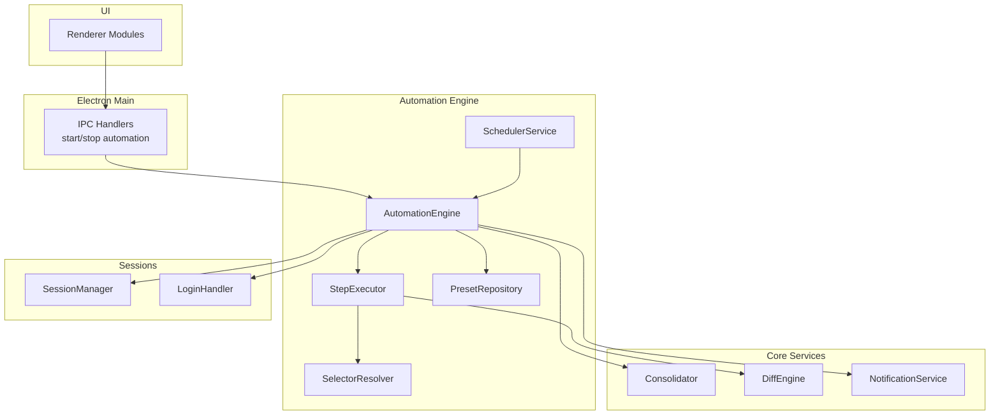
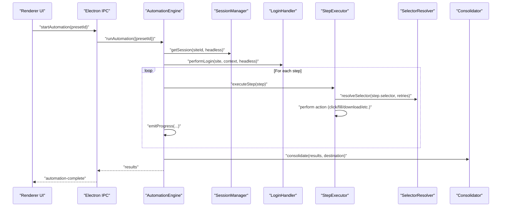
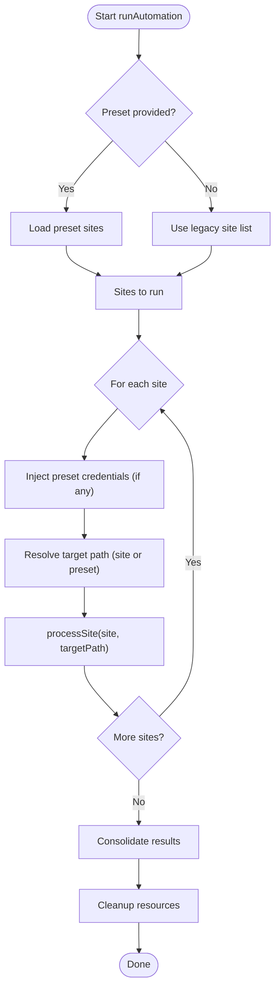
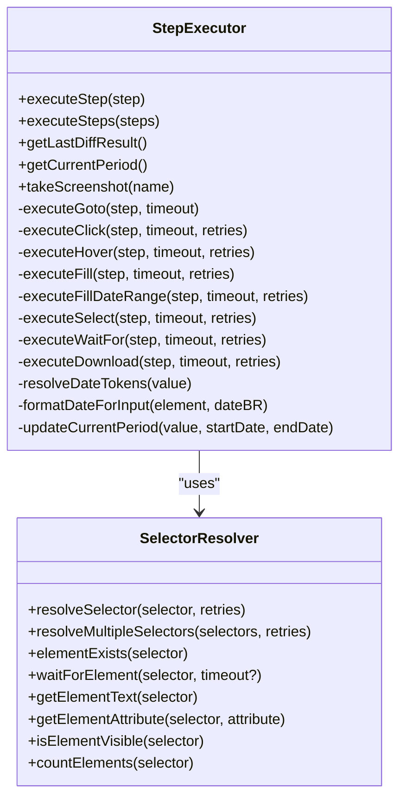
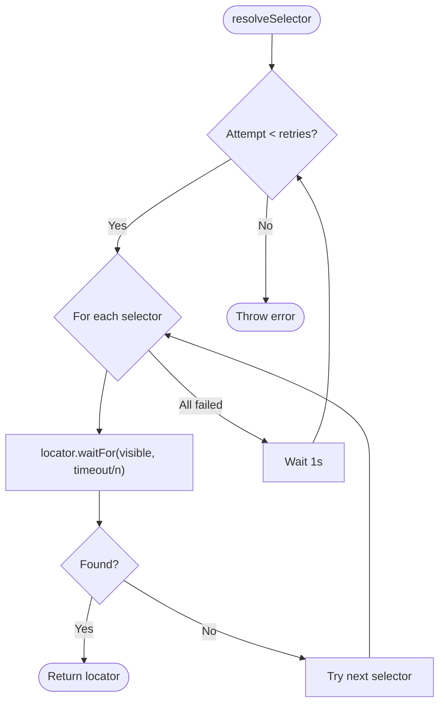
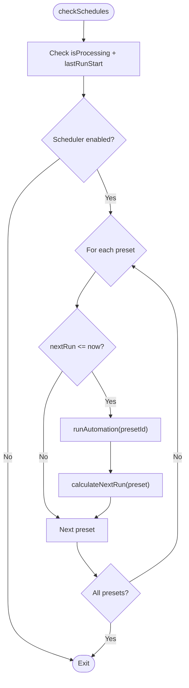
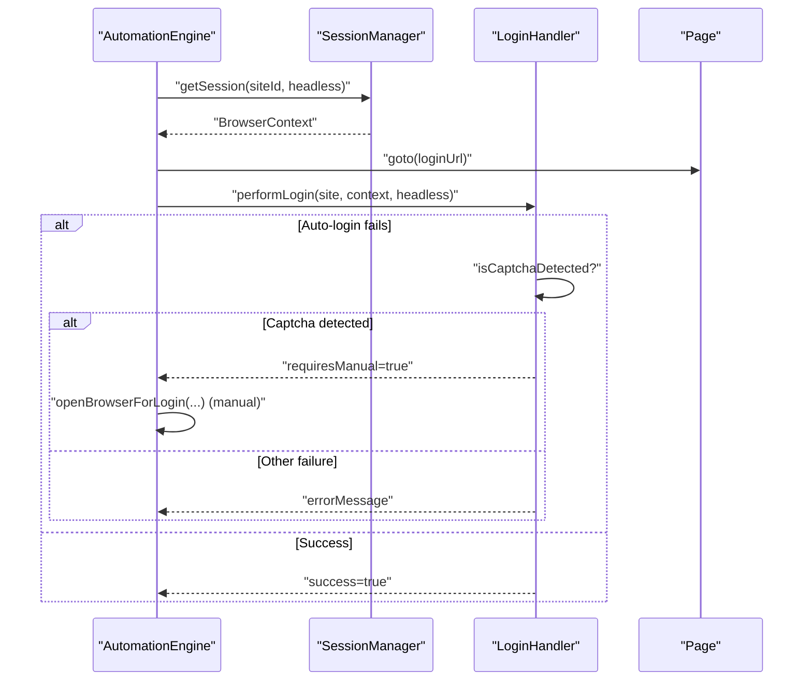
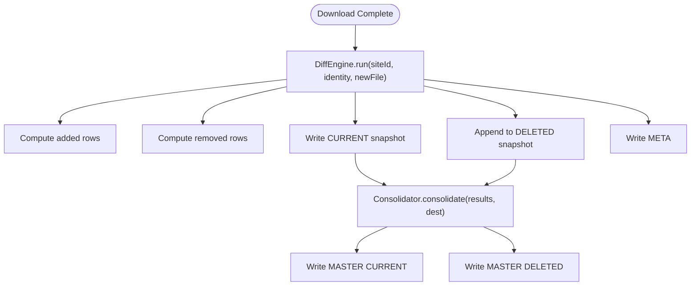
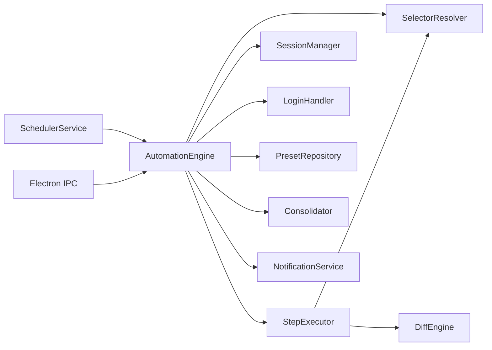

# Automation Layer

<cite>
**Referenced Files in This Document**
- [automation-engine.ts](file://app/automation/engine/automation-engine.ts)
- [step-executor.ts](file://app/automation/engine/step-executor.ts)
- [selector-resolver.ts](file://app/automation/engine/selector-resolver.ts)
- [scheduler-service.ts](file://app/automation/engine/scheduler-service.ts)
- [preset-repository.ts](file://app/automation/engine/preset-repository.ts)
- [config-manager.ts](file://app/config/config-manager.ts)
- [session-manager.ts](file://app/automation/sessions/session-manager.ts)
- [login-handler.ts](file://app/automation/sessions/login-handler.ts)
- [Consolidator.ts](file://app/core/consolidation/Consolidator.ts)
- [DiffEngine.ts](file://app/core/diff/DiffEngine.ts)
- [NotificationService.ts](file://app/core/notifications/NotificationService.ts)
- [main.ts](file://app/electron/main.ts)
- [automation.js](file://app/renderer/modules/automation.js)
</cite>

## Table of Contents
1. [Introduction](#introduction)
2. [Project Structure](#project-structure)
3. [Core Components](#core-components)
4. [Architecture Overview](#architecture-overview)
5. [Detailed Component Analysis](#detailed-component-analysis)
6. [Dependency Analysis](#dependency-analysis)
7. [Performance Considerations](#performance-considerations)
8. [Troubleshooting Guide](#troubleshooting-guide)
9. [Conclusion](#conclusion)

## Introduction
This document describes the automation layer architecture responsible for orchestrating multi-site web automation workflows. It explains how the automation engine coordinates step execution, manages timeouts and retries, tracks progress, resolves dynamic selectors, and integrates with scheduling, session management, and reporting. It also documents the modular design enabling extensible step types and execution patterns, along with practical examples of workflow orchestration, error handling, and performance optimization.

## Project Structure
The automation layer is organized around a central engine that delegates responsibilities to specialized components:
- Central engine: orchestrates runs, manages sessions, emits progress, and consolidates results
- Step executor: executes typed steps with retry and timeout logic
- Selector resolver: resolves dynamic element locators robustly
- Scheduler service: triggers automated runs based on presets
- Session manager and login handler: manage persistent browser contexts and authentication
- Core services: diff engine and consolidator for snapshot auditing and master reports
- Electron integration: IPC handlers and UI coordination

**Diagram sources**
- [main.ts](file://app/electron/main.ts#L117-L281)
- [automation-engine.ts](file://app/automation/engine/automation-engine.ts#L50-L608)
- [step-executor.ts](file://app/automation/engine/step-executor.ts#L25-L549)
- [selector-resolver.ts](file://app/automation/engine/selector-resolver.ts#L4-L135)
- [scheduler-service.ts](file://app/automation/engine/scheduler-service.ts#L6-L145)
- [session-manager.ts](file://app/automation/sessions/session-manager.ts#L67-L225)
- [login-handler.ts](file://app/automation/sessions/login-handler.ts#L13-L364)
- [Consolidator.ts](file://app/core/consolidation/Consolidator.ts#L20-L138)
- [DiffEngine.ts](file://app/core/diff/DiffEngine.ts#L23-L230)
- [NotificationService.ts](file://app/core/notifications/NotificationService.ts#L13-L115)

**Section sources**
- [automation-engine.ts](file://app/automation/engine/automation-engine.ts#L50-L608)
- [main.ts](file://app/electron/main.ts#L117-L281)

## Core Components
- AutomationEngine: central coordinator that initializes sessions, performs login, executes steps, emits progress, handles timeouts, and consolidates results.
- StepExecutor: executes typed steps (goto, click, hover, fill, fillDateRange, select, waitFor, download) with configurable timeouts, retries, and delays.
- SelectorResolver: robustly resolves dynamic element locators with fallback attempts and visibility checks.
- SchedulerService: schedules automated runs based on preset configurations and watchdogs long-running executions.
- SessionManager and LoginHandler: manage persistent browser contexts and handle login flows, including captcha detection and reauthentication.
- Consolidator and DiffEngine: produce snapshot diffs and consolidated master reports for auditability.
- NotificationService: sends execution summaries via email.
- Electron IPC and Renderer: bridge UI actions to automation engine.

**Section sources**
- [automation-engine.ts](file://app/automation/engine/automation-engine.ts#L50-L608)
- [step-executor.ts](file://app/automation/engine/step-executor.ts#L25-L549)
- [selector-resolver.ts](file://app/automation/engine/selector-resolver.ts#L4-L135)
- [scheduler-service.ts](file://app/automation/engine/scheduler-service.ts#L6-L145)
- [session-manager.ts](file://app/automation/sessions/session-manager.ts#L67-L225)
- [login-handler.ts](file://app/automation/sessions/login-handler.ts#L13-L364)
- [Consolidator.ts](file://app/core/consolidation/Consolidator.ts#L20-L138)
- [DiffEngine.ts](file://app/core/diff/DiffEngine.ts#L23-L230)
- [NotificationService.ts](file://app/core/notifications/NotificationService.ts#L13-L115)
- [main.ts](file://app/electron/main.ts#L117-L281)
- [automation.js](file://app/renderer/modules/automation.js#L6-L59)

## Architecture Overview
The automation engine coordinates multi-site workflows by:
- Resolving presets or legacy site lists
- Managing persistent browser contexts per site
- Performing login or reauthentication as needed
- Executing steps with retry and timeout logic
- Emitting progress events for UI updates
- Handling downloads with intelligent naming and snapshot diffing
- Consolidating results into master reports
- Sending notifications upon completion

**Diagram sources**
- [main.ts](file://app/electron/main.ts#L214-L232)
- [automation-engine.ts](file://app/automation/engine/automation-engine.ts#L62-L238)
- [step-executor.ts](file://app/automation/engine/step-executor.ts#L59-L110)
- [selector-resolver.ts](file://app/automation/engine/selector-resolver.ts#L17-L48)
- [Consolidator.ts](file://app/core/consolidation/Consolidator.ts#L26-L63)

## Detailed Component Analysis

### Automation Engine
Responsibilities:
- Orchestrates multi-site runs, either via presets or legacy site lists
- Manages global timeouts and resource cleanup
- Emits progress events for UI updates
- Handles login and reauthentication during execution
- Coordinates snapshot diffing and consolidation
- Sends post-run notifications

Key behaviors:
- Global timeout enforcement to prevent indefinite runs
- Preset isolation: injects credentials and destination per preset
- Auto-folder creation for downloads and snapshots
- Individual site cleanup to avoid resource leaks
- Consolidation of results into master snapshots and deleted records

**Diagram sources**
- [automation-engine.ts](file://app/automation/engine/automation-engine.ts#L62-L238)

**Section sources**
- [automation-engine.ts](file://app/automation/engine/automation-engine.ts#L50-L608)

### Step Executor
Responsibilities:
- Executes typed steps with configurable defaults
- Applies action delays and retries
- Resolves selectors and performs actions (navigation, clicks, fills, selects, waits, downloads)
- Supports date range filling with token resolution and input formatting
- Integrates snapshot diffing for download steps

Execution model:
- Each step defines type, selector/value, timeout/retries, and optional continue-on-error
- Actions are executed with Playwright locators and robust error handling
- Date range tokens are resolved to concrete dates and formatted appropriately for input types

**Diagram sources**
- [step-executor.ts](file://app/automation/engine/step-executor.ts#L25-L549)
- [selector-resolver.ts](file://app/automation/engine/selector-resolver.ts#L4-L135)

**Section sources**
- [step-executor.ts](file://app/automation/engine/step-executor.ts#L25-L549)

### Selector Resolver
Mechanism:
- Attempts multiple selectors in order until one resolves and becomes visible
- Retries across all selectors with small delays between attempts
- Provides helpers for existence checks, visibility, attributes, and counts
- Waits for elements with adjustable timeouts

**Diagram sources**
- [selector-resolver.ts](file://app/automation/engine/selector-resolver.ts#L17-L48)

**Section sources**
- [selector-resolver.ts](file://app/automation/engine/selector-resolver.ts#L4-L135)

### Scheduler Service
Responsibilities:
- Periodically evaluates presets for scheduled runs
- Calculates next run based on interval or fixed times
- Watches for stuck executions and resets state
- Delegates actual execution to AutomationEngine

**Diagram sources**
- [scheduler-service.ts](file://app/automation/engine/scheduler-service.ts#L38-L142)

**Section sources**
- [scheduler-service.ts](file://app/automation/engine/scheduler-service.ts#L6-L145)

### Session Management and Login
- SessionManager creates persistent browser contexts per site, ensuring cookies and cache persistence
- LoginHandler performs auto-login, detects captcha, and supports manual intervention
- Reauthentication is triggered when session expires during execution

**Diagram sources**
- [session-manager.ts](file://app/automation/sessions/session-manager.ts#L103-L138)
- [login-handler.ts](file://app/automation/sessions/login-handler.ts#L28-L77)

**Section sources**
- [session-manager.ts](file://app/automation/sessions/session-manager.ts#L67-L225)
- [login-handler.ts](file://app/automation/sessions/login-handler.ts#L13-L364)

### Consolidation and Diffing
- DiffEngine compares new downloads against previous snapshots, generating added/removed rows and updating metadata
- Consolidator merges multiple results into master snapshot and deleted files for auditability
- Both integrate with Safe Snapshot Policy for naming and validation

**Diagram sources**
- [DiffEngine.ts](file://app/core/diff/DiffEngine.ts#L55-L219)
- [Consolidator.ts](file://app/core/consolidation/Consolidator.ts#L26-L63)

**Section sources**
- [DiffEngine.ts](file://app/core/diff/DiffEngine.ts#L23-L230)
- [Consolidator.ts](file://app/core/consolidation/Consolidator.ts#L20-L138)

### Preset Repository
- Stores and retrieves presets, supports CRUD operations, and marks presets as used
- Used by AutomationEngine to isolate site configurations and credentials

**Section sources**
- [preset-repository.ts](file://app/automation/engine/preset-repository.ts#L4-L34)

### Configuration Manager
- Validates and persists application and preset configurations
- Provides path resolution and migration logic for compatibility

**Section sources**
- [config-manager.ts](file://app/config/config-manager.ts#L85-L408)

### Notifications
- Sends execution summaries via SMTP when configured
- Integrated at the end of automation runs

**Section sources**
- [NotificationService.ts](file://app/core/notifications/NotificationService.ts#L13-L115)

### Electron Integration and UI
- IPC handlers expose automation controls to the renderer
- Renderer module triggers automation and toggles UI state
- Progress and completion events are relayed to the UI

**Section sources**
- [main.ts](file://app/electron/main.ts#L117-L281)
- [automation.js](file://app/renderer/modules/automation.js#L6-L59)

## Dependency Analysis
High-level dependencies:
- AutomationEngine depends on StepExecutor, SelectorResolver, SessionManager, LoginHandler, PresetRepository, Consolidator, NotificationService
- StepExecutor depends on SelectorResolver and DiffEngine for downloads
- SchedulerService depends on AutomationEngine and PresetRepository
- Electron main registers IPC handlers and starts scheduler

**Diagram sources**
- [automation-engine.ts](file://app/automation/engine/automation-engine.ts#L50-L608)
- [step-executor.ts](file://app/automation/engine/step-executor.ts#L25-L549)
- [scheduler-service.ts](file://app/automation/engine/scheduler-service.ts#L6-L145)
- [main.ts](file://app/electron/main.ts#L117-L281)

**Section sources**
- [automation-engine.ts](file://app/automation/engine/automation-engine.ts#L50-L608)
- [step-executor.ts](file://app/automation/engine/step-executor.ts#L25-L549)
- [scheduler-service.ts](file://app/automation/engine/scheduler-service.ts#L6-L145)
- [main.ts](file://app/electron/main.ts#L117-L281)

## Performance Considerations
- Global timeout prevents runaway processes and ensures cleanup
- Persistent browser contexts reduce cold-start overhead per site
- Action delays balance stability with throughput
- Retry logic reduces flakiness on transient failures
- Auto-folder creation avoids repeated filesystem errors
- Snapshot diffing and consolidation minimize redundant processing
- Watchdog memory monitoring helps maintain 24/7 operation health

[No sources needed since this section provides general guidance]

## Troubleshooting Guide
Common scenarios and strategies:
- Captcha or challenge detection: switch to visible mode and perform manual login
- Session expiration during run: reauthenticate automatically; ensure context remains open
- Selector instability: leverage SelectorResolver’s multi-selector and retry logic
- Timeout exceeded: adjust defaultTimeout and per-step timeout/retries
- Download failures: ensure target path exists and handle target="_blank" links
- Stuck scheduler: watchdog resets state after prolonged processing
- Resource leaks: rely on per-site cleanup and global cleanup on stop

**Section sources**
- [login-handler.ts](file://app/automation/sessions/login-handler.ts#L187-L246)
- [automation-engine.ts](file://app/automation/engine/automation-engine.ts#L350-L375)
- [selector-resolver.ts](file://app/automation/engine/selector-resolver.ts#L17-L48)
- [scheduler-service.ts](file://app/automation/engine/scheduler-service.ts#L38-L44)

## Conclusion
The automation layer provides a robust, modular framework for multi-site web automation. Its central engine coordinates session management, login, step execution, and result consolidation, while selector resolution and retry logic improve reliability. The scheduler enables automated runs, and the UI integrates seamlessly via Electron IPC. The design supports extensibility for new step types and execution patterns, and includes strong error handling and performance safeguards for continuous operation.