# Component Interactions

<cite>
**Referenced Files in This Document**
- [main.ts](file://app/electron/main.ts)
- [automation-engine.ts](file://app/automation/engine/automation-engine.ts)
- [preset-repository.ts](file://app/automation/engine/preset-repository.ts)
- [scheduler-service.ts](file://app/automation/engine/scheduler-service.ts)
- [session-manager.ts](file://app/automation/sessions/session-manager.ts)
- [login-handler.ts](file://app/automation/sessions/login-handler.ts)
- [step-executor.ts](file://app/automation/engine/step-executor.ts)
- [selector-resolver.ts](file://app/automation/engine/selector-resolver.ts)
- [DiffEngine.ts](file://app/core/diff/DiffEngine.ts)
- [Consolidator.ts](file://app/core/consolidation/Consolidator.ts)
- [config-manager.ts](file://app/config/config-manager.ts)
- [NotificationService.ts](file://app/core/notifications/NotificationService.ts)
- [main.js](file://app/renderer/main.js)
- [index.html](file://app/renderer/index.html)
- [SafeSnapshotPolicy.ts](file://app/policy/snapshot/SafeSnapshotPolicy.ts)
- [SnapshotContract.ts](file://app/policy/snapshot/SnapshotContract.ts)
</cite>

## Table of Contents
1. [Introduction](#introduction)
2. [Project Structure](#project-structure)
3. [Core Components](#core-components)
4. [Architecture Overview](#architecture-overview)
5. [Detailed Component Analysis](#detailed-component-analysis)
6. [Dependency Analysis](#dependency-analysis)
7. [Performance Considerations](#performance-considerations)
8. [Troubleshooting Guide](#troubleshooting-guide)
9. [Conclusion](#conclusion)

## Introduction
This document explains how the system coordinates automation across layers, how configuration changes propagate, and how components interact to deliver reliable browser automation with snapshot auditing. It focuses on:
- How the main process coordinates with automation services
- How configuration changes propagate through the system
- How the preset repository orchestrates workflow execution
- How the session manager integrates with browser automation
- How the diff engine relates to snapshot policies
- Observer pattern implementation for real-time UI updates and status reporting
- Typical automation workflows, error propagation, and state synchronization

## Project Structure
The system is organized into distinct layers:
- Electron main process: IPC handlers, tray, scheduling, and lifecycle
- Automation engine: orchestration, session management, step execution, and progress emission
- Policies and snapshot engine: safe snapshot policy and diff engine
- Consolidation: master snapshot aggregation
- Renderer: UI, state, and real-time updates via Electron IPC

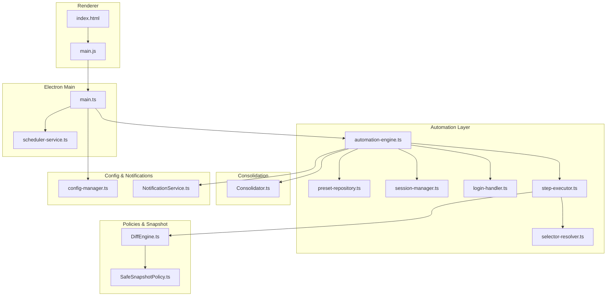

**Diagram sources**
- [main.ts](file://app/electron/main.ts#L1-L387)
- [automation-engine.ts](file://app/automation/engine/automation-engine.ts#L1-L611)
- [preset-repository.ts](file://app/automation/engine/preset-repository.ts#L1-L34)
- [scheduler-service.ts](file://app/automation/engine/scheduler-service.ts#L1-L145)
- [session-manager.ts](file://app/automation/sessions/session-manager.ts#L1-L225)
- [login-handler.ts](file://app/automation/sessions/login-handler.ts#L1-L364)
- [step-executor.ts](file://app/automation/engine/step-executor.ts#L1-L549)
- [selector-resolver.ts](file://app/automation/engine/selector-resolver.ts#L1-L135)
- [DiffEngine.ts](file://app/core/diff/DiffEngine.ts#L1-L230)
- [Consolidator.ts](file://app/core/consolidation/Consolidator.ts#L1-L138)
- [config-manager.ts](file://app/config/config-manager.ts#L1-L408)
- [NotificationService.ts](file://app/core/notifications/NotificationService.ts#L1-L115)
- [main.js](file://app/renderer/main.js#L1-L182)
- [index.html](file://app/renderer/index.html#L1-L640)

**Section sources**
- [main.ts](file://app/electron/main.ts#L1-L387)
- [automation-engine.ts](file://app/automation/engine/automation-engine.ts#L1-L611)
- [scheduler-service.ts](file://app/automation/engine/scheduler-service.ts#L1-L145)
- [session-manager.ts](file://app/automation/sessions/session-manager.ts#L1-L225)
- [login-handler.ts](file://app/automation/sessions/login-handler.ts#L1-L364)
- [step-executor.ts](file://app/automation/engine/step-executor.ts#L1-L549)
- [selector-resolver.ts](file://app/automation/engine/selector-resolver.ts#L1-L135)
- [DiffEngine.ts](file://app/core/diff/DiffEngine.ts#L1-L230)
- [Consolidator.ts](file://app/core/consolidation/Consolidator.ts#L1-L138)
- [config-manager.ts](file://app/config/config-manager.ts#L1-L408)
- [NotificationService.ts](file://app/core/notifications/NotificationService.ts#L1-L115)
- [main.js](file://app/renderer/main.js#L1-L182)
- [index.html](file://app/renderer/index.html#L1-L640)

## Core Components
- Electron main process: registers IPC handlers, starts scheduler, manages tray, and routes UI commands to automation services.
- Automation engine: runs presets, manages sessions, executes steps, emits progress, and consolidates results.
- Preset repository: CRUD for presets and marks usage.
- Session manager: persistent browser contexts per site, profile migration, and lifecycle control.
- Login handler: automated login, captcha detection, manual intervention, and reauthentication.
- Step executor: executes workflow steps, supports SSP-aware downloads and diff processing.
- Selector resolver: robust element resolution with retries and visibility checks.
- Diff engine: reads previous/current snapshots, computes diffs, and writes consolidated files.
- Consolidator: merges multiple snapshot outputs into master files.
- Config manager: validates and persists configuration, presets, and site definitions.
- Notification service: optional email summaries after automation completion.
- Renderer: modular UI, real-time status updates, and user-driven actions.

**Section sources**
- [main.ts](file://app/electron/main.ts#L117-L281)
- [automation-engine.ts](file://app/automation/engine/automation-engine.ts#L50-L608)
- [preset-repository.ts](file://app/automation/engine/preset-repository.ts#L4-L32)
- [session-manager.ts](file://app/automation/sessions/session-manager.ts#L67-L223)
- [login-handler.ts](file://app/automation/sessions/login-handler.ts#L13-L364)
- [step-executor.ts](file://app/automation/engine/step-executor.ts#L25-L549)
- [selector-resolver.ts](file://app/automation/engine/selector-resolver.ts#L4-L135)
- [DiffEngine.ts](file://app/core/diff/DiffEngine.ts#L23-L230)
- [Consolidator.ts](file://app/core/consolidation/Consolidator.ts#L20-L138)
- [config-manager.ts](file://app/config/config-manager.ts#L85-L398)
- [NotificationService.ts](file://app/core/notifications/NotificationService.ts#L13-L115)
- [main.js](file://app/renderer/main.js#L1-L182)
- [index.html](file://app/renderer/index.html#L1-L640)

## Architecture Overview
The main process acts as the central coordinator:
- Receives UI actions and configuration requests via IPC
- Starts/stops automation and schedules periodic runs
- Manages browser sessions and exposes session management APIs
- Emits progress and completion events consumed by the renderer

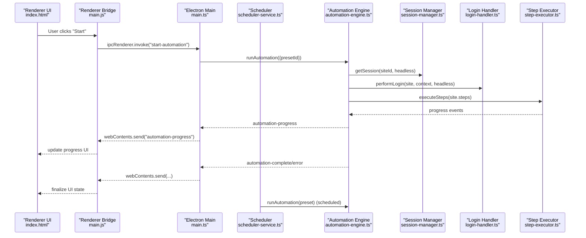

**Diagram sources**
- [main.ts](file://app/electron/main.ts#L214-L241)
- [scheduler-service.ts](file://app/automation/engine/scheduler-service.ts#L38-L96)
- [automation-engine.ts](file://app/automation/engine/automation-engine.ts#L62-L238)
- [session-manager.ts](file://app/automation/sessions/session-manager.ts#L103-L138)
- [login-handler.ts](file://app/automation/sessions/login-handler.ts#L28-L77)
- [step-executor.ts](file://app/automation/engine/step-executor.ts#L59-L110)
- [main.js](file://app/renderer/main.js#L151-L172)

**Section sources**
- [main.ts](file://app/electron/main.ts#L117-L281)
- [scheduler-service.ts](file://app/automation/engine/scheduler-service.ts#L16-L96)
- [automation-engine.ts](file://app/automation/engine/automation-engine.ts#L62-L238)
- [main.js](file://app/renderer/main.js#L151-L172)

## Detailed Component Analysis

### Main Process Coordination
- IPC handlers expose configuration, presets, sessions, and automation control to the renderer.
- SchedulerService periodically triggers automation runs for enabled presets.
- Tray and watchdog support long-running operation health.

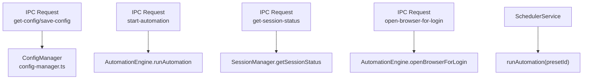

**Diagram sources**
- [main.ts](file://app/electron/main.ts#L119-L281)
- [config-manager.ts](file://app/config/config-manager.ts#L192-L212)
- [automation-engine.ts](file://app/automation/engine/automation-engine.ts#L478-L515)
- [session-manager.ts](file://app/automation/sessions/session-manager.ts#L205-L214)
- [scheduler-service.ts](file://app/automation/engine/scheduler-service.ts#L76-L81)

**Section sources**
- [main.ts](file://app/electron/main.ts#L117-L281)
- [scheduler-service.ts](file://app/automation/engine/scheduler-service.ts#L16-L96)

### Preset Repository Orchestration
- Provides CRUD for presets and marks last-used timestamps.
- Used by AutomationEngine to fetch preset sites and credentials.

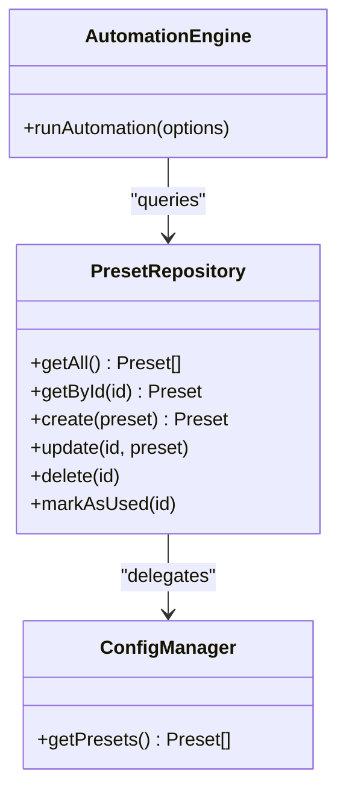

**Diagram sources**
- [preset-repository.ts](file://app/automation/engine/preset-repository.ts#L4-L32)
- [automation-engine.ts](file://app/automation/engine/automation-engine.ts#L92-L94)
- [config-manager.ts](file://app/config/config-manager.ts#L216-L218)

**Section sources**
- [preset-repository.ts](file://app/automation/engine/preset-repository.ts#L4-L32)
- [automation-engine.ts](file://app/automation/engine/automation-engine.ts#L92-L94)

### Session Manager Integration
- Ensures Playwright browsers are installed, manages persistent contexts per site, and migrates profiles.
- Provides close, clear, and status APIs.

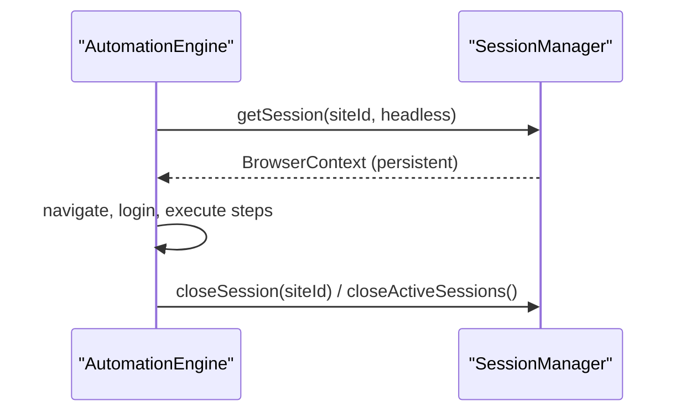

**Diagram sources**
- [session-manager.ts](file://app/automation/sessions/session-manager.ts#L103-L138)
- [automation-engine.ts](file://app/automation/engine/automation-engine.ts#L290-L294)
- [automation-engine.ts](file://app/automation/engine/automation-engine.ts#L193-L194)

**Section sources**
- [session-manager.ts](file://app/automation/sessions/session-manager.ts#L67-L223)
- [automation-engine.ts](file://app/automation/engine/automation-engine.ts#L290-L294)

### Login Handler and Reauthentication
- Attempts automated login, detects CAPTCHA, and supports manual login with a timeout.
- Reauthenticates when session expires during automation.

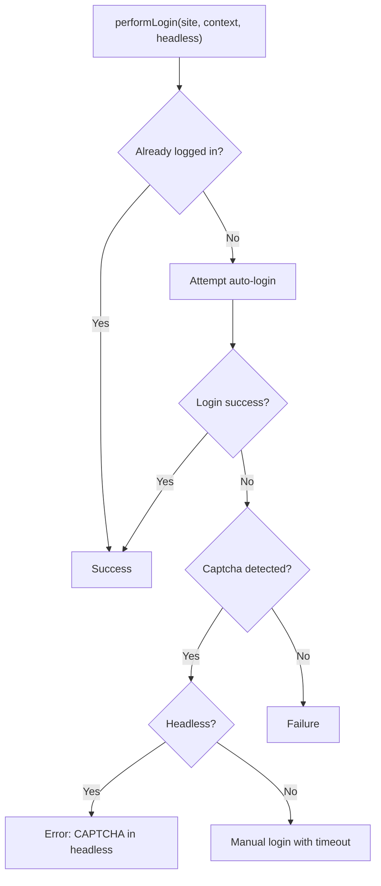

**Diagram sources**
- [login-handler.ts](file://app/automation/sessions/login-handler.ts#L28-L77)
- [login-handler.ts](file://app/automation/sessions/login-handler.ts#L108-L151)
- [login-handler.ts](file://app/automation/sessions/login-handler.ts#L187-L209)
- [login-handler.ts](file://app/automation/sessions/login-handler.ts#L214-L246)

**Section sources**
- [login-handler.ts](file://app/automation/sessions/login-handler.ts#L28-L77)
- [login-handler.ts](file://app/automation/sessions/login-handler.ts#L288-L360)

### Step Execution and Snapshot Diff
- Executes steps with retries and delays; handles downloads with SSP-aware logic.
- Uses DiffEngine to compare new downloads against previous snapshots and write consolidated outputs.

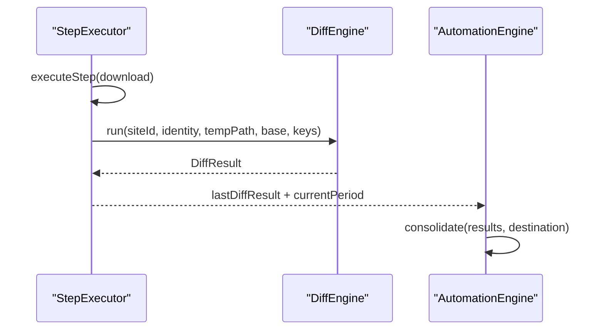

**Diagram sources**
- [step-executor.ts](file://app/automation/engine/step-executor.ts#L397-L511)
- [DiffEngine.ts](file://app/core/diff/DiffEngine.ts#L55-L219)
- [automation-engine.ts](file://app/automation/engine/automation-engine.ts#L197-L214)
- [Consolidator.ts](file://app/core/consolidation/Consolidator.ts#L26-L63)

**Section sources**
- [step-executor.ts](file://app/automation/engine/step-executor.ts#L397-L511)
- [DiffEngine.ts](file://app/core/diff/DiffEngine.ts#L23-L230)
- [Consolidator.ts](file://app/core/consolidation/Consolidator.ts#L20-L138)

### Configuration Propagation
- Renderer loads/saves configuration via IPC; ConfigManager validates and persists.
- Changes trigger UI updates and can enable/disable scheduler globally.

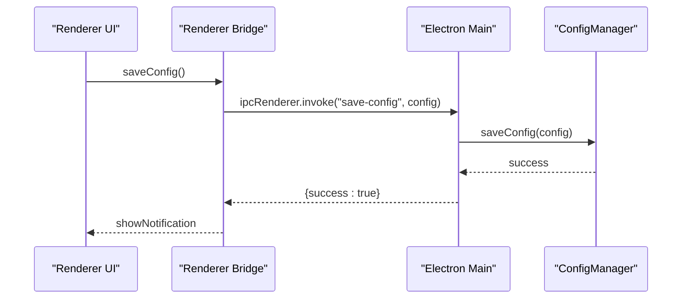

**Diagram sources**
- [main.js](file://app/renderer/main.js#L97-L135)
- [main.ts](file://app/electron/main.ts#L123-L126)
- [config-manager.ts](file://app/config/config-manager.ts#L196-L212)

**Section sources**
- [main.js](file://app/renderer/main.js#L97-L135)
- [main.ts](file://app/electron/main.ts#L119-L126)
- [config-manager.ts](file://app/config/config-manager.ts#L192-L212)

### Observer Pattern for Real-Time UI Updates
- AutomationEngine emits progress events; Electron forwards them to renderer; renderer updates UI.
- Renderer listens to automation-progress, automation-complete, automation-error, and site-complete events.

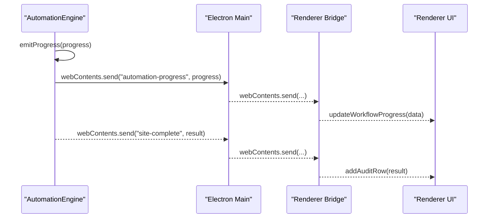

**Diagram sources**
- [automation-engine.ts](file://app/automation/engine/automation-engine.ts#L548-L556)
- [main.ts](file://app/electron/main.ts#L151-L154)
- [main.js](file://app/renderer/main.js#L151-L182)
- [index.html](file://app/renderer/index.html#L118-L134)

**Section sources**
- [automation-engine.ts](file://app/automation/engine/automation-engine.ts#L548-L556)
- [main.ts](file://app/electron/main.ts#L151-L154)
- [main.js](file://app/renderer/main.js#L151-L182)
- [index.html](file://app/renderer/index.html#L118-L134)

### Diff Engine and Snapshot Policies
- DiffEngine loads SafeSnapshotPolicy schemas and computes diffs using primary keys.
- Supports custom primary keys and robust column resolution.

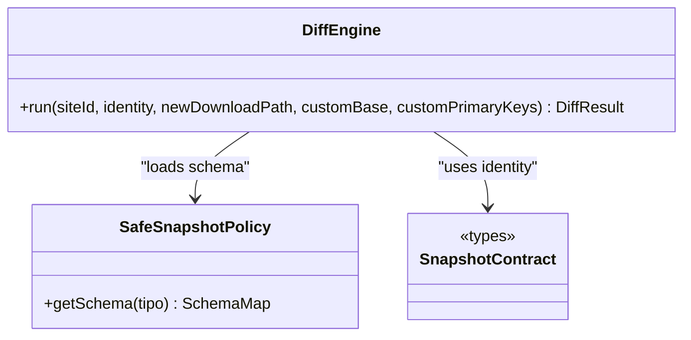

**Diagram sources**
- [DiffEngine.ts](file://app/core/diff/DiffEngine.ts#L23-L45)
- [SafeSnapshotPolicy.ts](file://app/policy/snapshot/SafeSnapshotPolicy.ts#L3-L24)
- [SnapshotContract.ts](file://app/policy/snapshot/SnapshotContract.ts#L9-L13)

**Section sources**
- [DiffEngine.ts](file://app/core/diff/DiffEngine.ts#L23-L230)
- [SafeSnapshotPolicy.ts](file://app/policy/snapshot/SafeSnapshotPolicy.ts#L3-L24)
- [SnapshotContract.ts](file://app/policy/snapshot/SnapshotContract.ts#L1-L20)

## Dependency Analysis
- Loose coupling via IPC and singletons (e.g., configManager, notificationService).
- Strong cohesion within layers: automation engine encapsulates browser orchestration; step executor encapsulates workflow execution; diff engine encapsulates snapshot comparison.
- Potential circular dependency avoided by renderer module wiring and explicit imports.

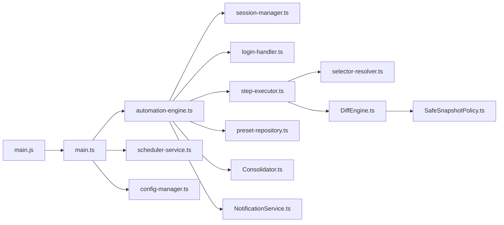

**Diagram sources**
- [main.ts](file://app/electron/main.ts#L1-L387)
- [automation-engine.ts](file://app/automation/engine/automation-engine.ts#L1-L611)
- [scheduler-service.ts](file://app/automation/engine/scheduler-service.ts#L1-L145)
- [session-manager.ts](file://app/automation/sessions/session-manager.ts#L1-L225)
- [login-handler.ts](file://app/automation/sessions/login-handler.ts#L1-L364)
- [step-executor.ts](file://app/automation/engine/step-executor.ts#L1-L549)
- [selector-resolver.ts](file://app/automation/engine/selector-resolver.ts#L1-L135)
- [preset-repository.ts](file://app/automation/engine/preset-repository.ts#L1-L34)
- [Consolidator.ts](file://app/core/consolidation/Consolidator.ts#L1-L138)
- [NotificationService.ts](file://app/core/notifications/NotificationService.ts#L1-L115)
- [DiffEngine.ts](file://app/core/diff/DiffEngine.ts#L1-L230)
- [SafeSnapshotPolicy.ts](file://app/policy/snapshot/SafeSnapshotPolicy.ts#L1-L25)
- [config-manager.ts](file://app/config/config-manager.ts#L1-L408)
- [main.js](file://app/renderer/main.js#L1-L182)

**Section sources**
- [main.ts](file://app/electron/main.ts#L1-L387)
- [automation-engine.ts](file://app/automation/engine/automation-engine.ts#L1-L611)
- [scheduler-service.ts](file://app/automation/engine/scheduler-service.ts#L1-L145)
- [session-manager.ts](file://app/automation/sessions/session-manager.ts#L1-L225)
- [login-handler.ts](file://app/automation/sessions/login-handler.ts#L1-L364)
- [step-executor.ts](file://app/automation/engine/step-executor.ts#L1-L549)
- [selector-resolver.ts](file://app/automation/engine/selector-resolver.ts#L1-L135)
- [preset-repository.ts](file://app/automation/engine/preset-repository.ts#L1-L34)
- [Consolidator.ts](file://app/core/consolidation/Consolidator.ts#L1-L138)
- [NotificationService.ts](file://app/core/notifications/NotificationService.ts#L1-L115)
- [DiffEngine.ts](file://app/core/diff/DiffEngine.ts#L1-L230)
- [SafeSnapshotPolicy.ts](file://app/policy/snapshot/SafeSnapshotPolicy.ts#L1-L25)
- [config-manager.ts](file://app/config/config-manager.ts#L1-L408)
- [main.js](file://app/renderer/main.js#L1-L182)

## Performance Considerations
- Headless vs visible mode trade-offs: headless reduces resource usage but may trigger anti-bot measures; visible mode improves reliability for CAPTCHA.
- Retry and timeout tuning: defaultRetries and defaultTimeout impact stability and runtime.
- Memory watchdog: periodic RSS monitoring helps detect leaks or accumulation.
- Consolidation cost: merging many snapshots can be I/O intensive; consider batching and disk space planning.
- Session reuse: persistent contexts reduce cold-start overhead but require careful cleanup.

[No sources needed since this section provides general guidance]

## Troubleshooting Guide
- Automation stuck or slow:
  - Verify headless mode and actionDelay settings.
  - Check session expiration and reauthentication flow.
- CAPTCHA failures:
  - Run in visible mode once to resolve challenges; ensure login selectors are correct.
- Snapshot diffs not computed:
  - Confirm reportType and primaryKeys are configured; verify schema availability.
- Session corruption:
  - Clear sessions or delete individual site profiles; ensure Playwright browsers are installed.
- UI not updating:
  - Confirm IPC listeners are registered and automation-progress events are emitted.

**Section sources**
- [login-handler.ts](file://app/automation/sessions/login-handler.ts#L57-L63)
- [login-handler.ts](file://app/automation/sessions/login-handler.ts#L288-L360)
- [DiffEngine.ts](file://app/core/diff/DiffEngine.ts#L67-L74)
- [session-manager.ts](file://app/automation/sessions/session-manager.ts#L170-L183)
- [main.js](file://app/renderer/main.js#L151-L172)

## Conclusion
The system coordinates browser automation through a layered design:
- The main process exposes IPC endpoints and schedules runs
- The automation engine orchestrates sessions, login, and step execution
- The preset repository and config manager provide isolated, portable workflows
- The diff engine and consolidator enforce enterprise-grade snapshot integrity
- The renderer consumes real-time events to keep users informed

This architecture enables scalable, observable, and maintainable automation with strong separation of concerns and clear data flows.