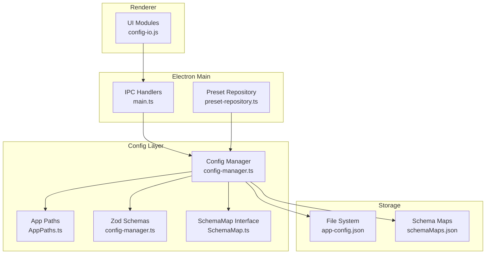
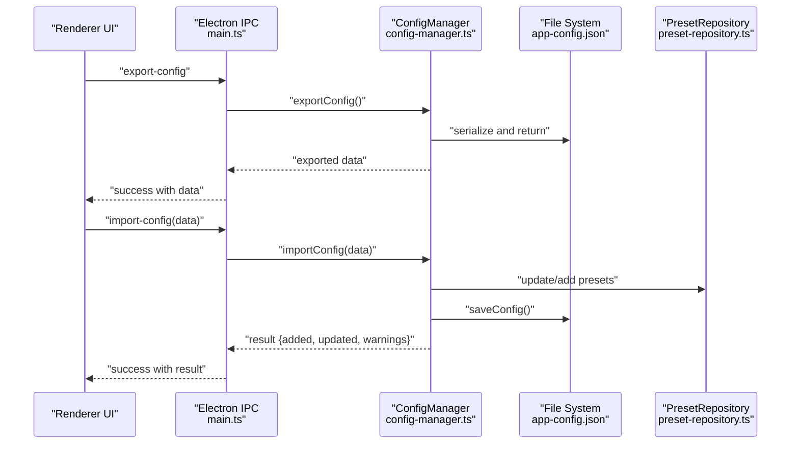
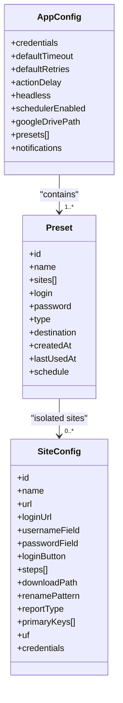
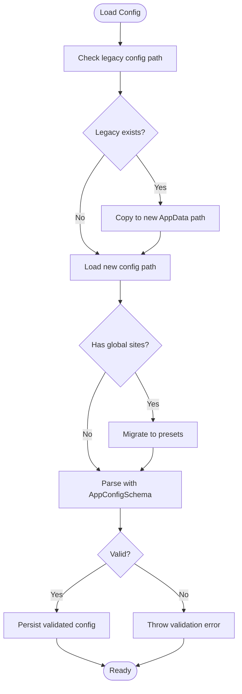
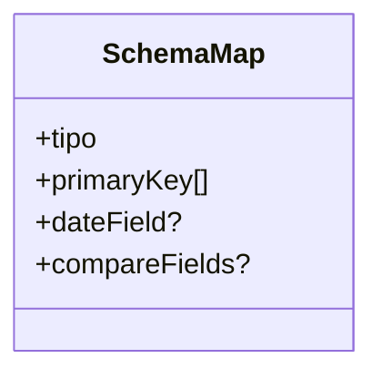
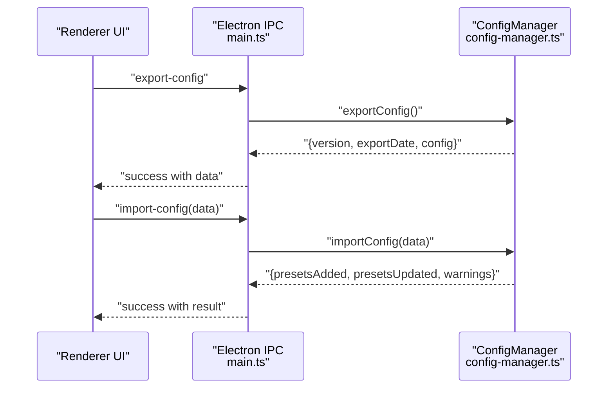
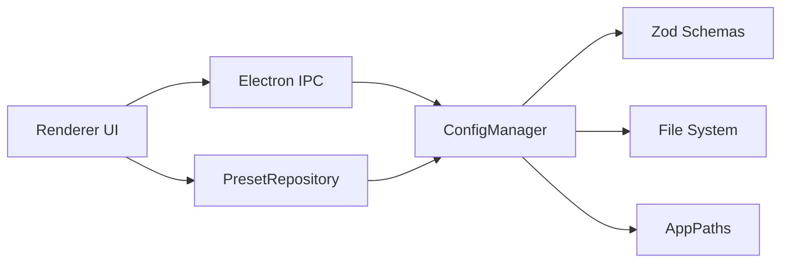

# Configuration System

<cite>
**Referenced Files in This Document**
- [config-manager.ts](file://app/config/config-manager.ts)
- [SchemaMap.ts](file://app/config/SchemaMap.ts)
- [app-config.json](file://app/config/app-config.json)
- [schemaMaps.json](file://data/schemaMaps.json)
- [schemaMaps.json](file://app/storage/schemaMaps.json)
- [config-io.js](file://app/renderer/modules/config-io.js)
- [AppPaths.ts](file://app/core/utils/AppPaths.ts)
- [main.ts](file://app/electron/main.ts)
- [preset-repository.ts](file://app/automation/engine/preset-repository.ts)
- [MIGRATION_PRESET_ISOLATION.md](file://MIGRATION_PRESET_ISOLATION.md)
</cite>

## Table of Contents
1. [Introduction](#introduction)
2. [Project Structure](#project-structure)
3. [Core Components](#core-components)
4. [Architecture Overview](#architecture-overview)
5. [Detailed Component Analysis](#detailed-component-analysis)
6. [Dependency Analysis](#dependency-analysis)
7. [Performance Considerations](#performance-considerations)
8. [Troubleshooting Guide](#troubleshooting-guide)
9. [Conclusion](#conclusion)
10. [Appendices](#appendices)

## Introduction
This document explains the configuration management system used by the application. It focuses on the Zod-based validation architecture, schema mapping implementation, and configuration persistence mechanisms. It documents how the configuration manager enforces type-safe configuration handling, isolates presets, and supports migrations. It also details the schema map functionality for configurable data types and validation rules, and provides practical examples of configuration loading, validation workflows, and export/import operations. Finally, it clarifies the separation between runtime configuration and static application settings.

## Project Structure
The configuration system spans several modules:
- Central configuration manager with Zod schemas and persistence
- Renderer-side import/export utilities
- Electron IPC handlers bridging renderer and main processes
- Path utilities for cross-environment configuration storage
- Preset repository for preset-centric operations
- Schema map definitions for data-type configuration

**Diagram sources**
- [config-manager.ts](file://app/config/config-manager.ts#L85-L395)
- [AppPaths.ts](file://app/core/utils/AppPaths.ts#L5-L59)
- [main.ts](file://app/electron/main.ts#L117-L281)
- [preset-repository.ts](file://app/automation/engine/preset-repository.ts#L4-L32)
- [config-io.js](file://app/renderer/modules/config-io.js#L5-L114)
- [SchemaMap.ts](file://app/config/SchemaMap.ts#L1-L13)

**Section sources**
- [config-manager.ts](file://app/config/config-manager.ts#L1-L408)
- [AppPaths.ts](file://app/core/utils/AppPaths.ts#L1-L60)
- [main.ts](file://app/electron/main.ts#L1-L387)
- [config-io.js](file://app/renderer/modules/config-io.js#L1-L115)
- [SchemaMap.ts](file://app/config/SchemaMap.ts#L1-L13)

## Core Components
- Zod-based validation schemas define strict typing and defaults for configuration objects.
- ConfigManager centralizes loading, saving, and migration of configuration data.
- Preset-centric model isolates site configurations within presets.
- Export/import pipeline enables portable configuration sharing.
- SchemaMap defines data-type mapping for diff and consolidation logic.

Key responsibilities:
- Type-safe configuration parsing and enforcement
- Runtime configuration persistence and migration
- Preset isolation and site management within presets
- Export/import operations with warnings and audit trail
- Cross-environment path resolution and storage location

**Section sources**
- [config-manager.ts](file://app/config/config-manager.ts#L7-L83)
- [config-manager.ts](file://app/config/config-manager.ts#L85-L395)
- [SchemaMap.ts](file://app/config/SchemaMap.ts#L1-L13)

## Architecture Overview
The configuration system follows a layered architecture:
- Renderer triggers export/import actions
- Electron IPC routes requests to main process handlers
- Main process delegates to ConfigManager
- ConfigManager validates, persists, and manages migrations
- PresetRepository provides preset-centric CRUD operations
- AppPaths resolves storage locations across environments

**Diagram sources**
- [main.ts](file://app/electron/main.ts#L147-L164)
- [config-manager.ts](file://app/config/config-manager.ts#L329-L394)
- [preset-repository.ts](file://app/automation/engine/preset-repository.ts#L13-L26)

## Detailed Component Analysis

### Zod Validation Architecture
The system defines strict schemas for configuration objects:
- AppConfigSchema governs global application settings and presets collection
- SiteConfigSchema defines individual site automation steps and metadata
- PresetSchema encapsulates preset-level configuration, including isolated site lists

Validation characteristics:
- Strict field validation with defaults
- Enumerated types for controlled values
- Optional fields with sensible defaults
- Nested object validation for complex structures

**Diagram sources**
- [config-manager.ts](file://app/config/config-manager.ts#L58-L83)

**Section sources**
- [config-manager.ts](file://app/config/config-manager.ts#L7-L83)

### Configuration Persistence and Migration
ConfigManager handles:
- Automatic migration from legacy locations and formats
- Path resolution for environment-specific storage
- Atomic save/load with validation
- Export/import with warnings and audit metadata

Migration highlights:
- Detects legacy config file and copies to new AppData location
- Migrates global site lists into preset-scoped site collections
- Maintains backward compatibility during transition

**Diagram sources**
- [config-manager.ts](file://app/config/config-manager.ts#L133-L190)

**Section sources**
- [config-manager.ts](file://app/config/config-manager.ts#L133-L190)
- [MIGRATION_PRESET_ISOLATION.md](file://MIGRATION_PRESET_ISOLATION.md#L1-L242)

### Preset Isolation and Site Management
Preset isolation ensures that sites belong exclusively to their containing preset:
- Methods operate within preset context (e.g., addSiteToPreset)
- Legacy global site methods remain for compatibility
- Preset-centric CRUD operations prevent cross-contamination

Benefits:
- Prevents accidental inclusion of unrelated sites
- Simplifies portability of presets with embedded site definitions
- Reduces maintenance overhead of global site synchronization

**Section sources**
- [config-manager.ts](file://app/config/config-manager.ts#L214-L308)
- [MIGRATION_PRESET_ISOLATION.md](file://MIGRATION_PRESET_ISOLATION.md#L44-L87)

### Schema Map Functionality
SchemaMap defines data-type mappings for diff and consolidation:
- Associates report types with primary keys
- Supports optional date fields and comparison fields
- Enables consistent data handling across modules

**Diagram sources**
- [SchemaMap.ts](file://app/config/SchemaMap.ts#L1-L13)

**Section sources**
- [SchemaMap.ts](file://app/config/SchemaMap.ts#L1-L13)
- [schemaMaps.json](file://data/schemaMaps.json#L1-L9)
- [schemaMaps.json](file://app/storage/schemaMaps.json#L1-L9)

### Export/Import Operations
The export/import pipeline:
- Export: Serializes current configuration with metadata and returns structured data
- Import: Validates incoming data against AppConfigSchema, merges presets, and returns counts and warnings
- Renderer UI triggers IPC calls and displays results

**Diagram sources**
- [config-io.js](file://app/renderer/modules/config-io.js#L9-L43)
- [config-io.js](file://app/renderer/modules/config-io.js#L48-L114)
- [main.ts](file://app/electron/main.ts#L147-L164)
- [config-manager.ts](file://app/config/config-manager.ts#L329-L394)

**Section sources**
- [config-io.js](file://app/renderer/modules/config-io.js#L1-L115)
- [main.ts](file://app/electron/main.ts#L147-L164)
- [config-manager.ts](file://app/config/config-manager.ts#L329-L394)

### Practical Examples

#### Loading Configuration
- On startup, ConfigManager resolves the configuration path via AppPaths
- If legacy config exists, it is migrated to the new location
- Global site lists are migrated into preset-scoped site arrays
- Parsed configuration is validated against AppConfigSchema

**Section sources**
- [config-manager.ts](file://app/config/config-manager.ts#L133-L190)
- [AppPaths.ts](file://app/core/utils/AppPaths.ts#L19-L21)

#### Validation Workflow
- Each write operation validates input against the appropriate Zod schema
- Errors are logged and surfaced to callers
- Defaults are applied automatically for optional fields

**Section sources**
- [config-manager.ts](file://app/config/config-manager.ts#L196-L212)
- [config-manager.ts](file://app/config/config-manager.ts#L220-L232)

#### Export/Import Operations
- Export returns a structured payload with version and timestamp
- Import validates and merges presets, reporting additions, updates, and warnings
- Renderer UI presents results and refreshes preset lists

**Section sources**
- [config-manager.ts](file://app/config/config-manager.ts#L334-L348)
- [config-manager.ts](file://app/config/config-manager.ts#L353-L394)
- [config-io.js](file://app/renderer/modules/config-io.js#L9-L43)
- [config-io.js](file://app/renderer/modules/config-io.js#L48-L114)

### Separation Between Runtime Configuration and Static Application Settings
- Runtime configuration: loaded from persistent storage and updated during execution
- Static application settings: defaults and constants defined in schemas and code
- Environment-aware paths ensure correct storage location across development and production

**Section sources**
- [AppPaths.ts](file://app/core/utils/AppPaths.ts#L11-L17)
- [config-manager.ts](file://app/config/config-manager.ts#L58-L83)

## Dependency Analysis
The configuration system exhibits low coupling and high cohesion:
- ConfigManager depends on Zod schemas and file system utilities
- Electron IPC handlers depend on ConfigManager for persistence
- PresetRepository depends on ConfigManager for preset operations
- Renderer modules depend on IPC handlers for configuration operations

**Diagram sources**
- [config-manager.ts](file://app/config/config-manager.ts#L85-L395)
- [main.ts](file://app/electron/main.ts#L117-L281)
- [preset-repository.ts](file://app/automation/engine/preset-repository.ts#L4-L32)
- [config-io.js](file://app/renderer/modules/config-io.js#L5-L114)

**Section sources**
- [config-manager.ts](file://app/config/config-manager.ts#L85-L395)
- [main.ts](file://app/electron/main.ts#L117-L281)
- [preset-repository.ts](file://app/automation/engine/preset-repository.ts#L4-L32)

## Performance Considerations
- Validation occurs on every write; keep configuration sizes reasonable
- Migration runs once at startup; consider deferring heavy operations until idle
- Export/import operations serialize large preset collections; batch updates when possible
- Use defaults to minimize missing fields and reduce validation overhead

## Troubleshooting Guide
Common issues and resolutions:
- Validation errors on save: ensure fields match Zod schema types and constraints
- Missing configuration file: ConfigManager creates a default configuration if none exists
- Legacy migration failures: verify file permissions and disk space
- Import conflicts: review warnings for overwritten presets and adjust accordingly

**Section sources**
- [config-manager.ts](file://app/config/config-manager.ts#L186-L189)
- [config-manager.ts](file://app/config/config-manager.ts#L196-L212)
- [config-manager.ts](file://app/config/config-manager.ts#L353-L394)

## Conclusion
The configuration management system provides robust, type-safe configuration handling with strong validation, environment-aware persistence, and preset isolation. The Zod-based schemas enforce correctness, while migration logic preserves user data across updates. The export/import pipeline enables portability and backup. Together, these components deliver a reliable foundation for managing automation presets and application settings.

## Appendices

### Appendix A: Example Configuration Files
- Runtime configuration: [app-config.json](file://app/config/app-config.json)
- Schema maps: [schemaMaps.json](file://data/schemaMaps.json), [schemaMaps.json](file://app/storage/schemaMaps.json)

**Section sources**
- [app-config.json](file://app/config/app-config.json#L1-L1521)
- [schemaMaps.json](file://data/schemaMaps.json#L1-L9)
- [schemaMaps.json](file://app/storage/schemaMaps.json#L1-L9)