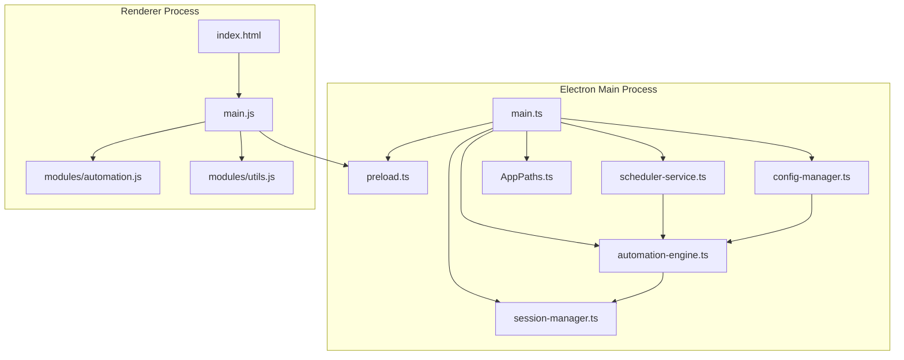
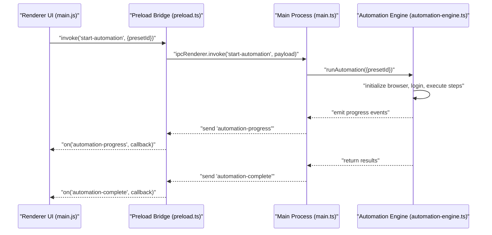
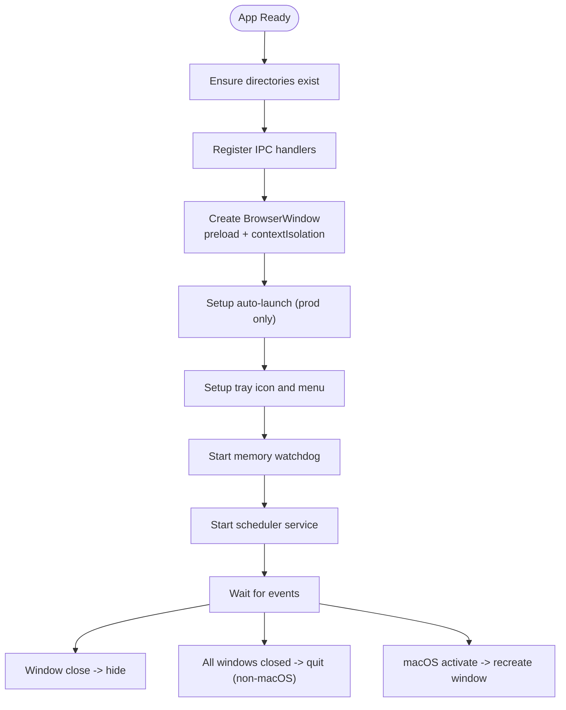
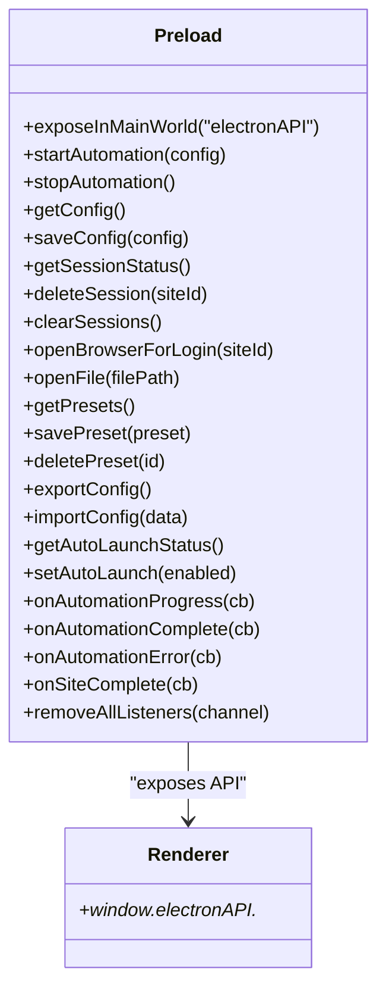
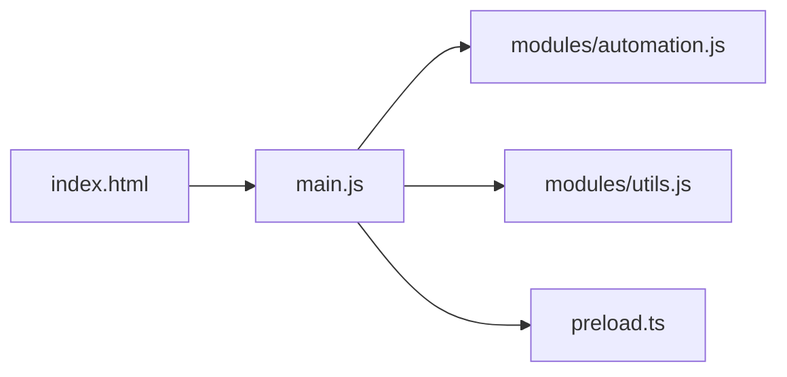
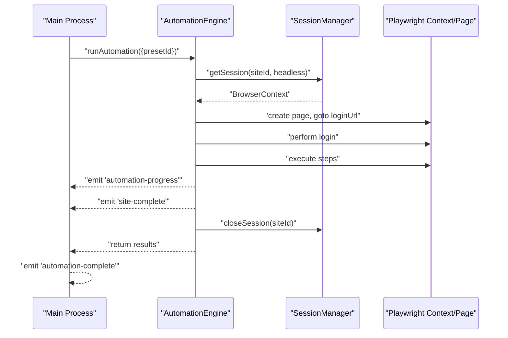
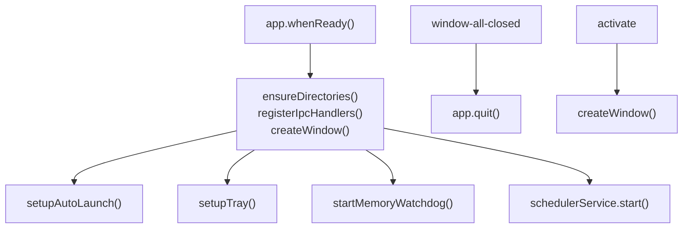
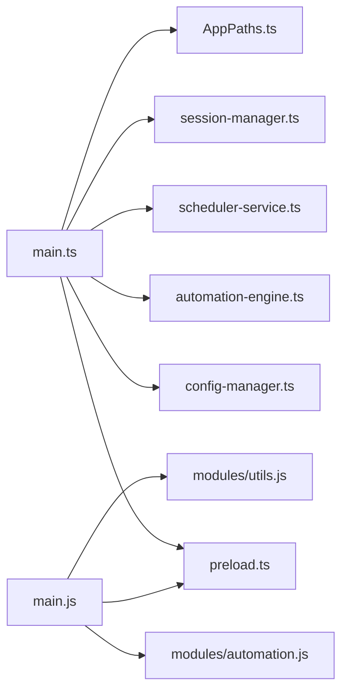

# Electron Architecture

<cite>
**Referenced Files in This Document**
- [main.ts](file://app/electron/main.ts)
- [preload.ts](file://app/electron/preload.ts)
- [index.html](file://app/renderer/index.html)
- [main.js](file://app/renderer/main.js)
- [automation.js](file://app/renderer/modules/automation.js)
- [utils.js](file://app/renderer/modules/utils.js)
- [automation-engine.ts](file://app/automation/engine/automation-engine.ts)
- [config-manager.ts](file://app/config/config-manager.ts)
- [scheduler-service.ts](file://app/automation/engine/scheduler-service.ts)
- [session-manager.ts](file://app/automation/sessions/session-manager.ts)
- [AppPaths.ts](file://app/core/utils/AppPaths.ts)
- [package.json](file://package.json)
</cite>

## Table of Contents
1. [Introduction](#introduction)
2. [Project Structure](#project-structure)
3. [Core Components](#core-components)
4. [Architecture Overview](#architecture-overview)
5. [Detailed Component Analysis](#detailed-component-analysis)
6. [Dependency Analysis](#dependency-analysis)
7. [Performance Considerations](#performance-considerations)
8. [Troubleshooting Guide](#troubleshooting-guide)
9. [Conclusion](#conclusion)

## Introduction
This document explains the Electron architecture of a desktop automation application. It focuses on the separation between the main process and the renderer process, the main.ts initialization flow (window creation, tray integration, auto-launch configuration, and IPC handler registration), the preload script security model and context isolation, application lifecycle management, memory watchdog implementation, Windows integration features, and practical IPC communication patterns. It also highlights the benefits of the dual-process architecture for desktop automation applications.

## Project Structure
The project follows a layered structure:
- Electron main process: initializes the app, creates the BrowserWindow, sets up tray and auto-launch, registers IPC handlers, and manages lifecycle.
- Renderer process: modular UI with HTML/CSS/JavaScript, organized into modules for automation, UI, state, and utilities.
- Core automation engine: orchestrates browser automation using Playwright, manages sessions, and emits progress events.
- Configuration and persistence: Zod-based validation, JSON-backed configuration, and AppPaths for cross-environment paths.
- Packaging and distribution: configured via electron-builder.

**Diagram sources**
- [main.ts](file://app/electron/main.ts#L1-L387)
- [preload.ts](file://app/electron/preload.ts#L1-L47)
- [index.html](file://app/renderer/index.html#L1-L640)
- [main.js](file://app/renderer/main.js#L1-L182)
- [automation.js](file://app/renderer/modules/automation.js#L1-L59)
- [utils.js](file://app/renderer/modules/utils.js#L1-L51)
- [automation-engine.ts](file://app/automation/engine/automation-engine.ts#L1-L611)
- [config-manager.ts](file://app/config/config-manager.ts#L1-L408)
- [scheduler-service.ts](file://app/automation/engine/scheduler-service.ts#L1-L145)
- [session-manager.ts](file://app/automation/sessions/session-manager.ts#L1-L225)
- [AppPaths.ts](file://app/core/utils/AppPaths.ts#L1-L60)

**Section sources**
- [main.ts](file://app/electron/main.ts#L1-L387)
- [package.json](file://package.json#L1-L133)

## Core Components
- Main process bootstrap and lifecycle:
  - Creates BrowserWindow with preload script and context isolation.
  - Registers IPC handlers for configuration, presets, sessions, automation control, and auto-launch.
  - Sets up tray icon, auto-launch, memory watchdog, scheduler service, and handles window-all-closed and activate events.
- Preload security bridge:
  - Exposes a minimal, typed API surface via contextBridge to renderer.
  - Provides invoke handlers and event listeners for automation progress, completion, errors, and site completion.
- Renderer modules:
  - Modular UI wiring, automation control, and logging utilities.
  - Listens to main process events and updates UI accordingly.
- Automation engine:
  - Orchestrates Playwright contexts, manages sessions, executes steps, and emits progress.
  - Implements timeouts, error handling, and cleanup.
- Configuration manager:
  - Zod-based validation for presets and site configurations.
  - Export/import of configuration data.
- Session manager:
  - Manages persistent Playwright contexts per site, profile migration, and cleanup.
- Path utilities:
  - Ensures directories exist and resolves paths across packaged and development environments.

**Section sources**
- [main.ts](file://app/electron/main.ts#L117-L281)
- [preload.ts](file://app/electron/preload.ts#L5-L47)
- [main.js](file://app/renderer/main.js#L14-L34)
- [automation-engine.ts](file://app/automation/engine/automation-engine.ts#L50-L238)
- [config-manager.ts](file://app/config/config-manager.ts#L85-L190)
- [session-manager.ts](file://app/automation/sessions/session-manager.ts#L67-L138)
- [AppPaths.ts](file://app/core/utils/AppPaths.ts#L44-L58)

## Architecture Overview
The application uses a strict main/renderer separation:
- Main process runs privileged operations (IPC, OS integrations, file system, tray, auto-launch).
- Renderer process runs UI logic and user interactions, communicating with main via typed IPC channels exposed through preload.
- The automation engine runs inside the main process to leverage Node APIs and manage long-running tasks safely.

**Diagram sources**
- [main.js](file://app/renderer/main.js#L73-L74)
- [preload.ts](file://app/electron/preload.ts#L7-L8)
- [main.ts](file://app/electron/main.ts#L214-L232)
- [automation-engine.ts](file://app/automation/engine/automation-engine.ts#L548-L556)

## Detailed Component Analysis

### Main Process Initialization Flow (main.ts)
Key responsibilities:
- Window creation with preload, context isolation, and icon.
- Tray setup with dynamic icon resolution and context menu.
- Auto-launch configuration for Windows (production only).
- Memory watchdog monitoring RSS usage.
- IPC handler registration for:
  - Configuration: get/save/export/import.
  - Presets: CRUD operations.
  - Sessions: status, deletion, clearing.
  - Automation control: start/stop/status, open browser for login, open file.
  - Auto-launch status and toggling.
- Application lifecycle:
  - Ensures directories exist.
  - Starts scheduler service.
  - Handles window-all-closed and activate events.

**Diagram sources**
- [main.ts](file://app/electron/main.ts#L355-L387)
- [main.ts](file://app/electron/main.ts#L283-L350)
- [main.ts](file://app/electron/main.ts#L16-L37)
- [main.ts](file://app/electron/main.ts#L101-L114)
- [main.ts](file://app/electron/main.ts#L117-L281)

**Section sources**
- [main.ts](file://app/electron/main.ts#L283-L350)
- [main.ts](file://app/electron/main.ts#L16-L37)
- [main.ts](file://app/electron/main.ts#L101-L114)
- [main.ts](file://app/electron/main.ts#L117-L281)
- [main.ts](file://app/electron/main.ts#L355-L387)

### Preload Security Model and Context Isolation
- Preload script uses contextBridge to expose a controlled API surface to the renderer.
- Renderer accesses only the exposed methods and event listeners, preventing direct Node/Electron APIs.
- IPC channels are typed and namespaced under a single object.

**Diagram sources**
- [preload.ts](file://app/electron/preload.ts#L5-L47)

**Section sources**
- [preload.ts](file://app/electron/preload.ts#L1-L47)

### Renderer Process and UI Modules
- index.html defines the UI layout and tabs for configuration, sessions, and automation.
- main.js wires modules and exposes global functions for HTML onclick handlers.
- automation.js encapsulates start/stop automation actions and UI updates.
- utils.js provides logging and notification helpers.

**Diagram sources**
- [index.html](file://app/renderer/index.html#L1-L640)
- [main.js](file://app/renderer/main.js#L1-L182)
- [automation.js](file://app/renderer/modules/automation.js#L1-L59)
- [utils.js](file://app/renderer/modules/utils.js#L1-L51)
- [preload.ts](file://app/electron/preload.ts#L1-L47)

**Section sources**
- [index.html](file://app/renderer/index.html#L1-L640)
- [main.js](file://app/renderer/main.js#L14-L34)
- [automation.js](file://app/renderer/modules/automation.js#L6-L58)
- [utils.js](file://app/renderer/modules/utils.js#L5-L50)

### Automation Engine and Session Management
- AutomationEngine orchestrates Playwright contexts, executes steps, and emits progress events.
- SessionManager manages persistent contexts per site, profile migration, and cleanup.
- SchedulerService triggers automation runs based on preset schedules.

**Diagram sources**
- [automation-engine.ts](file://app/automation/engine/automation-engine.ts#L62-L238)
- [automation-engine.ts](file://app/automation/engine/automation-engine.ts#L548-L556)
- [session-manager.ts](file://app/automation/sessions/session-manager.ts#L103-L138)

**Section sources**
- [automation-engine.ts](file://app/automation/engine/automation-engine.ts#L50-L238)
- [session-manager.ts](file://app/automation/sessions/session-manager.ts#L67-L138)
- [scheduler-service.ts](file://app/automation/engine/scheduler-service.ts#L6-L96)

### IPC Communication Patterns and Security Considerations
Common patterns:
- Renderer invokes main with typed payloads (e.g., start/stop automation).
- Main responds with structured results or streams progress events.
- Events are namespaced and scoped to specific channels (progress, complete, error, site-complete).
- Security:
  - Preload exposes only necessary methods.
  - Context isolation prevents direct Node/Electron access in renderer.
  - IPC channels are explicit and namespaced.

Practical examples (paths):
- Start automation invocation: [main.js](file://app/renderer/main.js#L73-L74), [preload.ts](file://app/electron/preload.ts#L7-L8), [main.ts](file://app/electron/main.ts#L214-L232)
- Progress and completion events: [main.js](file://app/renderer/main.js#L151-L172), [automation-engine.ts](file://app/automation/engine/automation-engine.ts#L548-L556)
- Configuration CRUD: [main.ts](file://app/electron/main.ts#L119-L164), [config-manager.ts](file://app/config/config-manager.ts#L192-L212)
- Session management: [main.ts](file://app/electron/main.ts#L183-L196), [session-manager.ts](file://app/automation/sessions/session-manager.ts#L143-L150)

**Section sources**
- [main.js](file://app/renderer/main.js#L151-L172)
- [preload.ts](file://app/electron/preload.ts#L5-L47)
- [main.ts](file://app/electron/main.ts#L119-L281)
- [automation-engine.ts](file://app/automation/engine/automation-engine.ts#L548-L556)
- [config-manager.ts](file://app/config/config-manager.ts#L192-L212)
- [session-manager.ts](file://app/automation/sessions/session-manager.ts#L143-L150)

### Application Lifecycle Management and Memory Watchdog
- Lifecycle:
  - whenReady initializes directories, registers IPC, creates window, sets tray, starts watchdog and scheduler.
  - activate recreates window on macOS.
  - window-all-closed quits on non-macOS platforms.
- Memory watchdog:
  - Periodic check of RSS usage and logs warnings when exceeding thresholds.

**Diagram sources**
- [main.ts](file://app/electron/main.ts#L355-L387)
- [main.ts](file://app/electron/main.ts#L101-L114)

**Section sources**
- [main.ts](file://app/electron/main.ts#L355-L387)
- [main.ts](file://app/electron/main.ts#L101-L114)

### Windows Integration Features
- Auto-launch:
  - Production-only configuration via setLoginItemSettings with hidden startup.
- Tray:
  - Dynamic icon resolution across development and production resources.
  - Double-click to restore window, context menu to quit.
- File opening:
  - Shell integration to open files via openPath.

**Section sources**
- [main.ts](file://app/electron/main.ts#L16-L37)
- [main.ts](file://app/electron/main.ts#L39-L99)
- [main.ts](file://app/electron/main.ts#L202-L208)

## Dependency Analysis
- Main depends on:
  - Preload for secure renderer bridge.
  - Config manager for validation and persistence.
  - Automation engine for orchestration.
  - Scheduler service for timed runs.
  - Session manager for browser contexts.
  - AppPaths for directory management.
- Renderer depends on:
  - Preload for IPC.
  - Modules for UI logic and state.

**Diagram sources**
- [main.ts](file://app/electron/main.ts#L1-L14)
- [main.js](file://app/renderer/main.js#L1-L10)
- [AppPaths.ts](file://app/core/utils/AppPaths.ts#L1-L60)

**Section sources**
- [main.ts](file://app/electron/main.ts#L1-L14)
- [main.js](file://app/renderer/main.js#L1-L10)
- [AppPaths.ts](file://app/core/utils/AppPaths.ts#L1-L60)

## Performance Considerations
- Browser contexts are reused per site to reduce overhead.
- Persistent contexts persist cookies and cache, reducing repeated logins.
- Cleanup routines ensure sessions are closed and resources released.
- Logging limits buffer size to maintain responsiveness.
- Scheduler checks for stuck executions and resets state.

[No sources needed since this section provides general guidance]

## Troubleshooting Guide
- Tray icon missing:
  - Icon resolution falls back to executable embedded icon; verify resource paths and packaging.
- Auto-launch not working:
  - Only active in production builds; verify setLoginItemSettings behavior and arguments.
- Automation stuck or slow:
  - Check memory watchdog logs for elevated RSS usage.
  - Verify scheduler state and engine timeouts.
- Session issues:
  - Clear sessions or delete specific site profiles if login fails repeatedly.
- Configuration errors:
  - Use export/import to validate and restore configuration.

**Section sources**
- [main.ts](file://app/electron/main.ts#L39-L99)
- [main.ts](file://app/electron/main.ts#L16-L37)
- [main.ts](file://app/electron/main.ts#L101-L114)
- [session-manager.ts](file://app/automation/sessions/session-manager.ts#L167-L200)
- [config-manager.ts](file://app/config/config-manager.ts#L331-L394)

## Conclusion
This Electron application demonstrates a robust dual-process architecture tailored for desktop automation. The main process manages privileged operations, IPC, scheduling, and lifecycle, while the renderer focuses on UI and user interactions through a secure preload bridge. The automation engine, session management, and configuration system provide a scalable foundation for enterprise-grade automation workflows. The design emphasizes security, reliability, and maintainability through typed IPC, context isolation, and disciplined resource management.