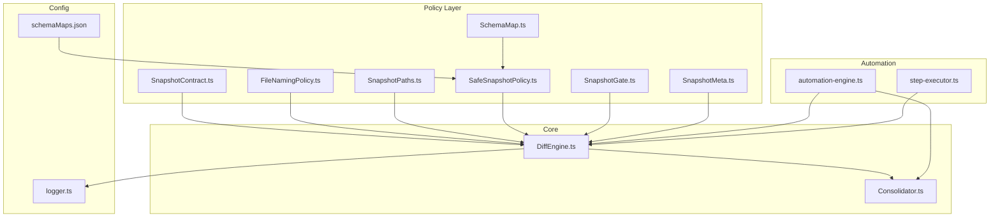
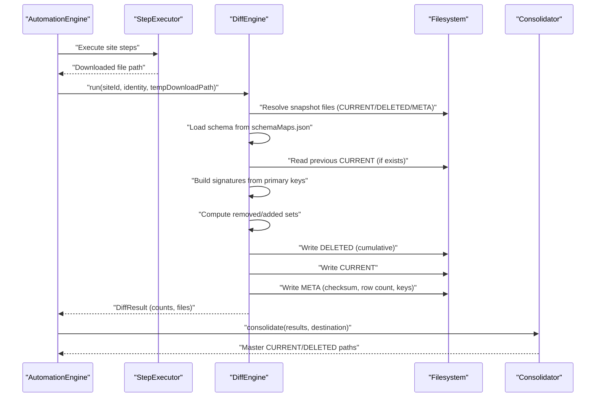
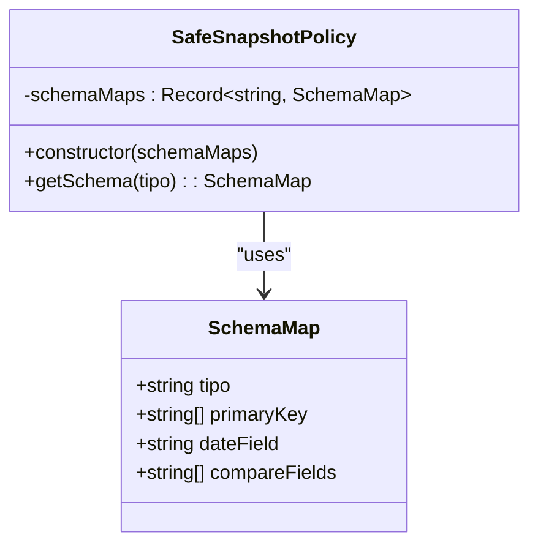
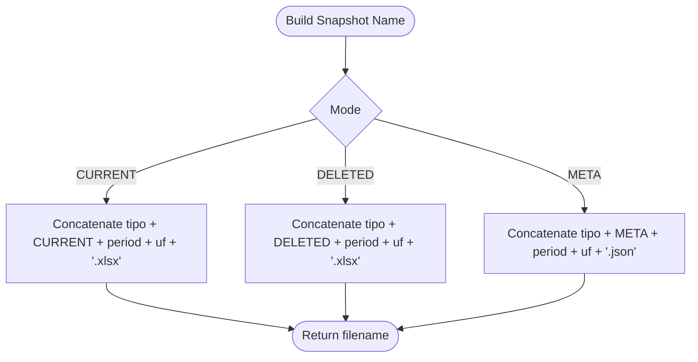
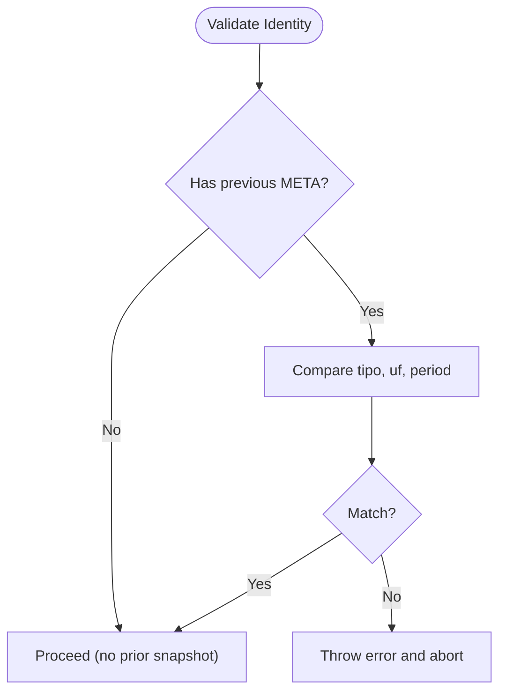
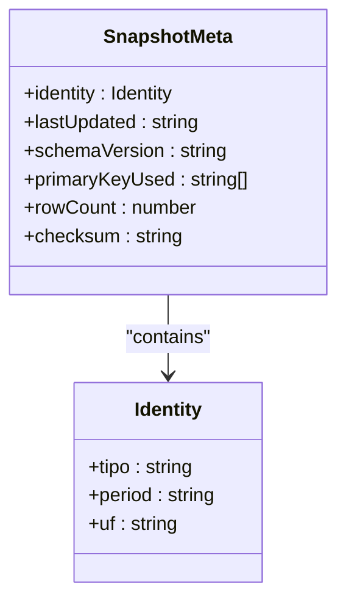
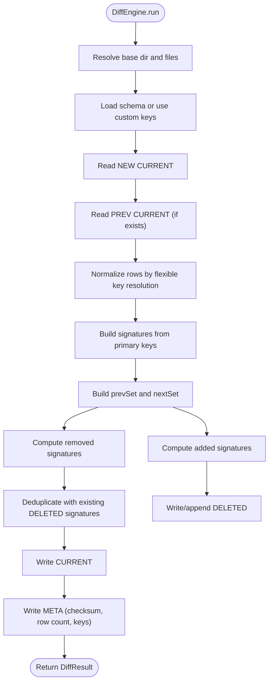
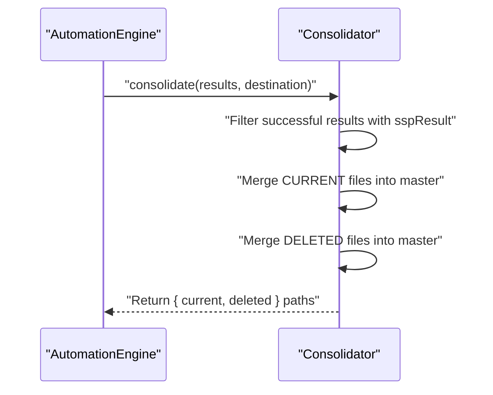
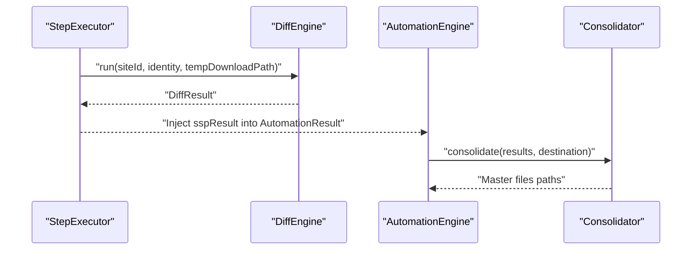
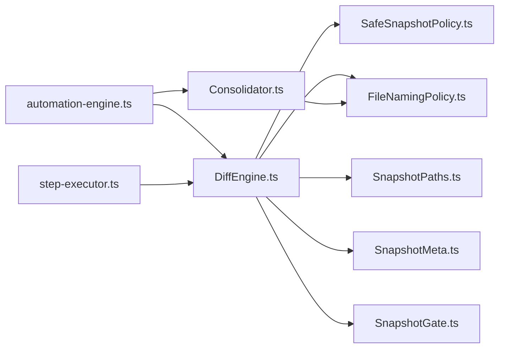

# Policy Layer

<cite>
**Referenced Files in This Document**
- [SafeSnapshotPolicy.ts](file://app/policy/snapshot/SafeSnapshotPolicy.ts)
- [FileNamingPolicy.ts](file://app/policy/snapshot/FileNamingPolicy.ts)
- [SnapshotContract.ts](file://app/policy/snapshot/SnapshotContract.ts)
- [SnapshotGate.ts](file://app/policy/snapshot/SnapshotGate.ts)
- [SnapshotMeta.ts](file://app/policy/snapshot/SnapshotMeta.ts)
- [SnapshotPaths.ts](file://app/policy/snapshot/SnapshotPaths.ts)
- [SchemaMap.ts](file://app/config/SchemaMap.ts)
- [schemaMaps.json](file://data/schemaMaps.json)
- [DiffEngine.ts](file://app/core/diff/DiffEngine.ts)
- [Consolidator.ts](file://app/core/consolidation/Consolidator.ts)
- [automation-engine.ts](file://app/automation/engine/automation-engine.ts)
- [step-executor.ts](file://app/automation/engine/step-executor.ts)
- [logger.ts](file://app/config/logger.ts)
</cite>

## Table of Contents
1. [Introduction](#introduction)
2. [Project Structure](#project-structure)
3. [Core Components](#core-components)
4. [Architecture Overview](#architecture-overview)
5. [Detailed Component Analysis](#detailed-component-analysis)
6. [Dependency Analysis](#dependency-analysis)
7. [Performance Considerations](#performance-considerations)
8. [Troubleshooting Guide](#troubleshooting-guide)
9. [Conclusion](#conclusion)

## Introduction
This document explains the Safe Snapshot Policy (SSP) implementation that underpins enterprise-grade data integrity for automated ERP exports. It covers deterministic file naming, schema-based comparison, audit trail generation, policy contracts, snapshot gates, and metadata management. It also details the integration between SSP and the automation workflow for compliance reporting, including examples of snapshot creation, comparison algorithms, delta calculation mechanics, and the policy layer’s role in regulatory compliance and data governance.

## Project Structure
The SSP spans several modules:
- Policy contracts and policies: identity, naming, gates, metadata, and schema mapping
- Core diff engine: deterministic comparison and delta calculation
- Consolidation: cross-site aggregation for compliance reporting
- Automation engine: orchestration and integration with the SSP pipeline

**Diagram sources**
- [SafeSnapshotPolicy.ts](file://app/policy/snapshot/SafeSnapshotPolicy.ts#L1-L25)
- [FileNamingPolicy.ts](file://app/policy/snapshot/FileNamingPolicy.ts#L1-L35)
- [SnapshotContract.ts](file://app/policy/snapshot/SnapshotContract.ts#L1-L20)
- [SnapshotGate.ts](file://app/policy/snapshot/SnapshotGate.ts#L1-L28)
- [SnapshotMeta.ts](file://app/policy/snapshot/SnapshotMeta.ts#L1-L18)
- [SnapshotPaths.ts](file://app/policy/snapshot/SnapshotPaths.ts#L1-L13)
- [SchemaMap.ts](file://app/config/SchemaMap.ts#L1-L13)
- [schemaMaps.json](file://data/schemaMaps.json#L1-L9)
- [DiffEngine.ts](file://app/core/diff/DiffEngine.ts#L1-L230)
- [Consolidator.ts](file://app/core/consolidation/Consolidator.ts#L1-L138)
- [automation-engine.ts](file://app/automation/engine/automation-engine.ts#L1-L224)
- [step-executor.ts](file://app/automation/engine/step-executor.ts#L1-L200)
- [logger.ts](file://app/config/logger.ts)

**Section sources**
- [SafeSnapshotPolicy.ts](file://app/policy/snapshot/SafeSnapshotPolicy.ts#L1-L25)
- [FileNamingPolicy.ts](file://app/policy/snapshot/FileNamingPolicy.ts#L1-L35)
- [SnapshotContract.ts](file://app/policy/snapshot/SnapshotContract.ts#L1-L20)
- [SnapshotGate.ts](file://app/policy/snapshot/SnapshotGate.ts#L1-L28)
- [SnapshotMeta.ts](file://app/policy/snapshot/SnapshotMeta.ts#L1-L18)
- [SnapshotPaths.ts](file://app/policy/snapshot/SnapshotPaths.ts#L1-L13)
- [SchemaMap.ts](file://app/config/SchemaMap.ts#L1-L13)
- [schemaMaps.json](file://data/schemaMaps.json#L1-L9)
- [DiffEngine.ts](file://app/core/diff/DiffEngine.ts#L1-L230)
- [Consolidator.ts](file://app/core/consolidation/Consolidator.ts#L1-L138)
- [automation-engine.ts](file://app/automation/engine/automation-engine.ts#L1-L224)
- [step-executor.ts](file://app/automation/engine/step-executor.ts#L1-L200)
- [logger.ts](file://app/config/logger.ts)

## Core Components
- SnapshotContract defines the identity and file contract for snapshots: type, period, and UF.
- SafeSnapshotPolicy enforces schema availability and validates primary key configuration.
- FileNamingPolicy ensures deterministic file naming for CURRENT, DELETED, and META artifacts.
- SnapshotGate prevents cross-period or cross-type comparisons by validating identity.
- SnapshotMeta stores identity, update timestamps, schema version, primary keys used, row counts, and checksums.
- SnapshotPaths resolves snapshot storage locations, supporting custom bases.
- SchemaMap and schemaMaps.json define per-type primary keys and optional fields for diff.
- DiffEngine orchestrates deterministic comparison, delta calculation, and audit trail updates.
- Consolidator aggregates results across sites for compliance reporting.

**Section sources**
- [SnapshotContract.ts](file://app/policy/snapshot/SnapshotContract.ts#L1-L20)
- [SafeSnapshotPolicy.ts](file://app/policy/snapshot/SafeSnapshotPolicy.ts#L1-L25)
- [FileNamingPolicy.ts](file://app/policy/snapshot/FileNamingPolicy.ts#L1-L35)
- [SnapshotGate.ts](file://app/policy/snapshot/SnapshotGate.ts#L1-L28)
- [SnapshotMeta.ts](file://app/policy/snapshot/SnapshotMeta.ts#L1-L18)
- [SnapshotPaths.ts](file://app/policy/snapshot/SnapshotPaths.ts#L1-L13)
- [SchemaMap.ts](file://app/config/SchemaMap.ts#L1-L13)
- [schemaMaps.json](file://data/schemaMaps.json#L1-L9)
- [DiffEngine.ts](file://app/core/diff/DiffEngine.ts#L1-L230)
- [Consolidator.ts](file://app/core/consolidation/Consolidator.ts#L1-L138)

## Architecture Overview
The SSP architecture enforces strict identity and schema governance before any diff operation. The automation engine triggers downloads, delegates to the diff engine for deterministic comparison, and consolidates results for compliance reporting.

**Diagram sources**
- [automation-engine.ts](file://app/automation/engine/automation-engine.ts#L198-L224)
- [step-executor.ts](file://app/automation/engine/step-executor.ts#L1-L200)
- [DiffEngine.ts](file://app/core/diff/DiffEngine.ts#L55-L219)
- [Consolidator.ts](file://app/core/consolidation/Consolidator.ts#L26-L62)

## Detailed Component Analysis

### SafeSnapshotPolicy
- Purpose: Enforce schema availability and integrity for a given report type.
- Behavior:
  - Throws if no schema is defined for the type.
  - Validates that the primary key array is present and non-empty.
- Integration: Used by the diff engine to fetch primary keys for signature computation.

**Diagram sources**
- [SafeSnapshotPolicy.ts](file://app/policy/snapshot/SafeSnapshotPolicy.ts#L1-L25)
- [SchemaMap.ts](file://app/config/SchemaMap.ts#L1-L13)

**Section sources**
- [SafeSnapshotPolicy.ts](file://app/policy/snapshot/SafeSnapshotPolicy.ts#L1-L25)
- [SchemaMap.ts](file://app/config/SchemaMap.ts#L1-L13)
- [schemaMaps.json](file://data/schemaMaps.json#L1-L9)

### FileNamingPolicy
- Purpose: Deterministic naming for snapshot artifacts.
- Naming rules:
  - CURRENT: {tipo}_CURRENT_{period}_{uf}.xlsx
  - DELETED: {tipo}_DELETED_{period}_{uf}.xlsx
  - META: {tipo}_META_{period}_{uf}.json
- Helpers:
  - Build master snapshot names for consolidated outputs.
  - Resolve absolute file paths for a given identity.

**Diagram sources**
- [FileNamingPolicy.ts](file://app/policy/snapshot/FileNamingPolicy.ts#L4-L21)

**Section sources**
- [FileNamingPolicy.ts](file://app/policy/snapshot/FileNamingPolicy.ts#L1-L35)

### SnapshotGate
- Purpose: Prevent cross-type, cross-UF, or cross-period diffs.
- Validation: Compares existing META identity with the new identity; throws if mismatch.

**Diagram sources**
- [SnapshotGate.ts](file://app/policy/snapshot/SnapshotGate.ts#L4-L27)

**Section sources**
- [SnapshotGate.ts](file://app/policy/snapshot/SnapshotGate.ts#L1-L28)

### SnapshotMeta
- Purpose: Audit trail and integrity anchor.
- Fields:
  - identity: tipo, period, uf
  - lastUpdated: ISO timestamp
  - schemaVersion: version string
  - primaryKeyUsed: list of primary keys
  - rowCount: number of rows
  - checksum: SHA-256 of CURRENT

**Diagram sources**
- [SnapshotMeta.ts](file://app/policy/snapshot/SnapshotMeta.ts#L1-L18)

**Section sources**
- [SnapshotMeta.ts](file://app/policy/snapshot/SnapshotMeta.ts#L1-L18)

### SnapshotPaths
- Purpose: Resolve snapshot storage location.
- Behavior:
  - Uses a custom base if provided.
  - Otherwise, builds path under the application’s snapshots directory and site ID.

**Section sources**
- [SnapshotPaths.ts](file://app/policy/snapshot/SnapshotPaths.ts#L1-L13)

### DiffEngine
- Purpose: Enterprise-safe, deterministic comparison and delta calculation.
- Execution flow:
  1. Resolve base directory and snapshot filenames.
  2. Load schema (primary keys) from schemaMaps.json or accept custom keys.
  3. Read new CURRENT (next) and previous CURRENT (prev) if present.
  4. Normalize rows using flexible key resolution (supports column indices and occurrences).
  5. Compute signatures from primary keys and build sets.
  6. Determine removed and added rows deterministically.
  7. Append removed rows to DELETED (cumulative, deduplicated by signature).
  8. Write CURRENT and META with checksum and row counts.
- Outputs:
  - removed: number of newly deleted rows
  - added: number of newly added rows
  - currentRows: total rows in new CURRENT
  - deletedFile: path to DELETED
  - metaFile: path to META

**Diagram sources**
- [DiffEngine.ts](file://app/core/diff/DiffEngine.ts#L55-L219)

**Section sources**
- [DiffEngine.ts](file://app/core/diff/DiffEngine.ts#L1-L230)
- [schemaMaps.json](file://data/schemaMaps.json#L1-L9)

### Consolidator
- Purpose: Aggregate snapshot results across sites for compliance reporting.
- Behavior:
  - Builds master CURRENT and DELETED files.
  - Injects origin metadata (UF/site) for traceability.
  - Returns consolidated file paths.

**Diagram sources**
- [Consolidator.ts](file://app/core/consolidation/Consolidator.ts#L26-L62)
- [automation-engine.ts](file://app/automation/engine/automation-engine.ts#L198-L224)

**Section sources**
- [Consolidator.ts](file://app/core/consolidation/Consolidator.ts#L1-L138)
- [automation-engine.ts](file://app/automation/engine/automation-engine.ts#L198-L224)

### Integration with Automation Workflow
- StepExecutor coordinates downloads and invokes DiffEngine after each download.
- AutomationEngine aggregates results and triggers Consolidator for compliance reporting.
- Logging is centralized via the logger module.

**Diagram sources**
- [step-executor.ts](file://app/automation/engine/step-executor.ts#L1-L200)
- [DiffEngine.ts](file://app/core/diff/DiffEngine.ts#L55-L219)
- [automation-engine.ts](file://app/automation/engine/automation-engine.ts#L198-L224)
- [Consolidator.ts](file://app/core/consolidation/Consolidator.ts#L26-L62)

**Section sources**
- [step-executor.ts](file://app/automation/engine/step-executor.ts#L1-L200)
- [DiffEngine.ts](file://app/core/diff/DiffEngine.ts#L55-L219)
- [automation-engine.ts](file://app/automation/engine/automation-engine.ts#L198-L224)
- [logger.ts](file://app/config/logger.ts)

## Dependency Analysis
- DiffEngine depends on:
  - SafeSnapshotPolicy for schema loading
  - FileNamingPolicy for deterministic artifact names
  - SnapshotPaths for storage resolution
  - SnapshotMeta for audit metadata
  - SnapshotGate for identity validation
- Consolidator depends on DiffEngine outputs and FileNamingPolicy for master naming.
- AutomationEngine orchestrates the end-to-end flow and triggers Consolidator.

**Diagram sources**
- [DiffEngine.ts](file://app/core/diff/DiffEngine.ts#L1-L230)
- [Consolidator.ts](file://app/core/consolidation/Consolidator.ts#L1-L138)
- [automation-engine.ts](file://app/automation/engine/automation-engine.ts#L1-L224)
- [step-executor.ts](file://app/automation/engine/step-executor.ts#L1-L200)
- [SafeSnapshotPolicy.ts](file://app/policy/snapshot/SafeSnapshotPolicy.ts#L1-L25)
- [FileNamingPolicy.ts](file://app/policy/snapshot/FileNamingPolicy.ts#L1-L35)
- [SnapshotPaths.ts](file://app/policy/snapshot/SnapshotPaths.ts#L1-L13)
- [SnapshotMeta.ts](file://app/policy/snapshot/SnapshotMeta.ts#L1-L18)
- [SnapshotGate.ts](file://app/policy/snapshot/SnapshotGate.ts#L1-L28)

**Section sources**
- [DiffEngine.ts](file://app/core/diff/DiffEngine.ts#L1-L230)
- [Consolidator.ts](file://app/core/consolidation/Consolidator.ts#L1-L138)
- [automation-engine.ts](file://app/automation/engine/automation-engine.ts#L1-L224)
- [step-executor.ts](file://app/automation/engine/step-executor.ts#L1-L200)

## Performance Considerations
- Deterministic signatures: Using primary keys ensures stable set comparisons and avoids expensive deep row-by-row inspection.
- Case-insensitive normalization: Improves robustness against header variations while maintaining performance.
- Column index and occurrence support: Enables flexible mapping without scanning entire sheets multiple times.
- Cumulative DELETED: Deduplication by signature minimizes growth and maintains integrity.
- Hashing: SHA-256 checksum stored in META enables quick integrity checks across runs.

[No sources needed since this section provides general guidance]

## Troubleshooting Guide
Common issues and resolutions:
- Schema not found or invalid:
  - Symptom: Error indicating schema not defined or invalid primary key.
  - Resolution: Verify schemaMaps.json entries and ensure primary keys are defined for the report type.
- Snapshot mismatch:
  - Symptom: Error indicating snapshot mismatch (type/UF/period).
  - Resolution: Ensure the new run targets the same identity as the previous snapshot.
- Empty or missing files:
  - Symptom: DiffEngine cannot read previous CURRENT or new download path does not exist.
  - Resolution: Confirm download succeeded and file paths are correct.
- Audit trail anomalies:
  - Symptom: Unexpected row counts or checksum mismatches.
  - Resolution: Inspect META for lastUpdated and checksum; re-run diff to regenerate META.

**Section sources**
- [SafeSnapshotPolicy.ts](file://app/policy/snapshot/SafeSnapshotPolicy.ts#L8-L23)
- [SnapshotGate.ts](file://app/policy/snapshot/SnapshotGate.ts#L10-L26)
- [DiffEngine.ts](file://app/core/diff/DiffEngine.ts#L62-L64)
- [DiffEngine.ts](file://app/core/diff/DiffEngine.ts#L196-L210)

## Conclusion
The SSP establishes a robust, enterprise-grade foundation for data integrity:
- Deterministic naming and identity contracts ensure predictable artifact management.
- Schema-based comparison and signature computation guarantee accurate deltas.
- Snapshot gates and META files enforce correctness and enable auditability.
- Integration with the automation workflow supports compliance reporting and governance requirements.