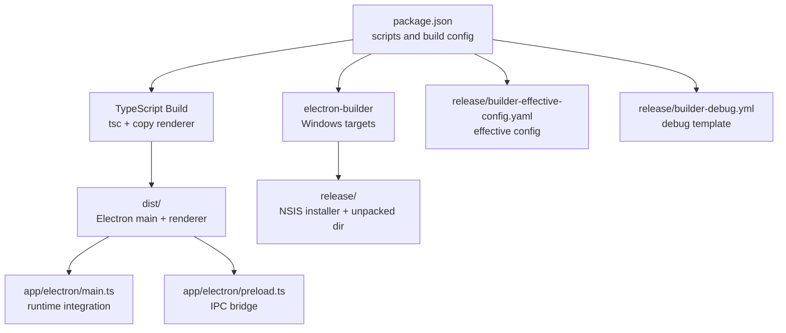
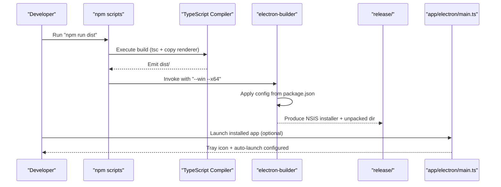
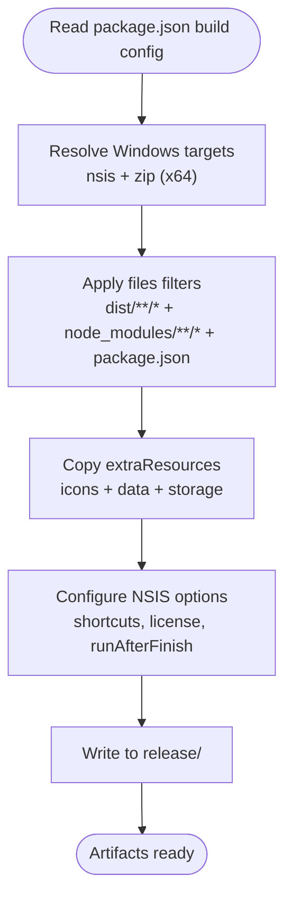
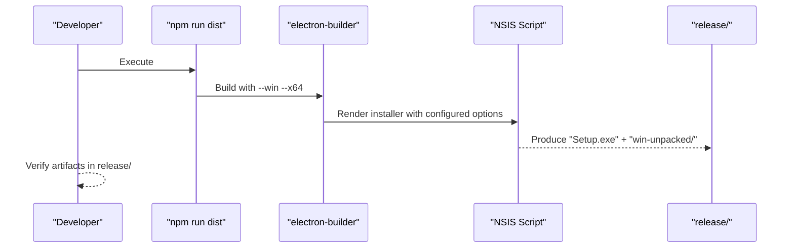
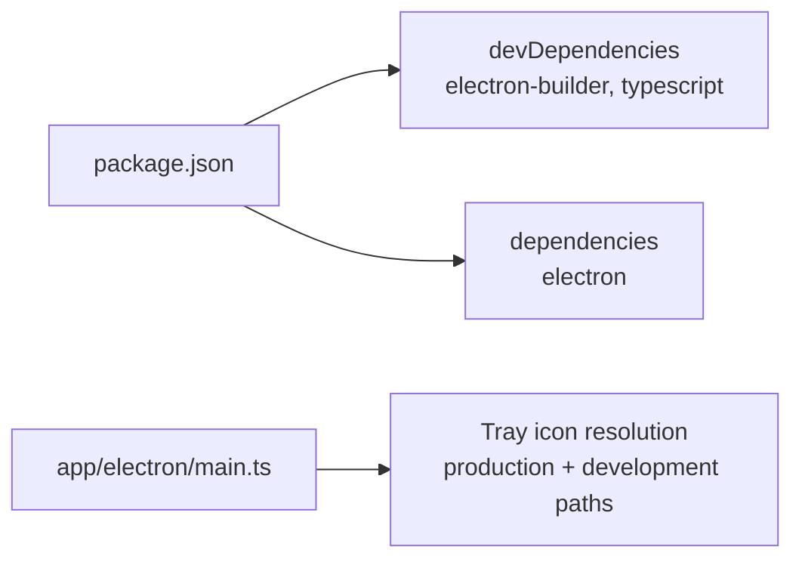

# Build and Deployment

<cite>
**Referenced Files in This Document**
- [package.json](file://package.json)
- [COMO_GERAR_INSTALAVEL.md](file://COMO_GERAR_INSTALAVEL.md)
- [builder-debug.yml](file://release/builder-debug.yml)
- [builder-effective-config.yaml](file://release/builder-effective-config.yaml)
- [main.ts](file://app/electron/main.ts)
- [preload.ts](file://app/electron/preload.ts)
</cite>

## Table of Contents
1. [Introduction](#introduction)
2. [Project Structure](#project-structure)
3. [Core Components](#core-components)
4. [Architecture Overview](#architecture-overview)
5. [Detailed Component Analysis](#detailed-component-analysis)
6. [Dependency Analysis](#dependency-analysis)
7. [Performance Considerations](#performance-considerations)
8. [Troubleshooting Guide](#troubleshooting-guide)
9. [Conclusion](#conclusion)
10. [Appendices](#appendices)

## Introduction
This document explains the Build and Deployment processes for the project, focusing on Electron Builder configuration, Windows installer creation, portable distribution options, and release management. It documents the build scripts, configuration files, and deployment strategies, and provides practical examples, troubleshooting guidance, and version management best practices. It also outlines continuous integration setup and automated deployment pipelines.

## Project Structure
The build and deployment pipeline centers around:
- A TypeScript build step that compiles source code and copies the renderer assets into a distribution folder.
- Electron Builder configuration embedded in package.json and validated by generated effective and debug configuration files under release/.
- Electron main process and preload scripts that integrate with the packaged app and tray icon resolution.
- A user-facing guide detailing how to generate installers and troubleshoot common issues.

**Diagram sources**
- [package.json](file://package.json#L7-L18)
- [package.json](file://package.json#L33-L93)
- [builder-effective-config.yaml](file://release/builder-effective-config.yaml#L1-L45)
- [builder-debug.yml](file://release/builder-debug.yml#L1-L235)
- [main.ts](file://app/electron/main.ts#L1-L387)
- [preload.ts](file://app/electron/preload.ts#L1-L47)

**Section sources**
- [package.json](file://package.json#L1-L133)
- [COMO_GERAR_INSTALAVEL.md](file://COMO_GERAR_INSTALAVEL.md#L1-L257)
- [builder-effective-config.yaml](file://release/builder-effective-config.yaml#L1-L45)
- [builder-debug.yml](file://release/builder-debug.yml#L1-L235)
- [main.ts](file://app/electron/main.ts#L1-L387)
- [preload.ts](file://app/electron/preload.ts#L1-L47)

## Core Components
- Build scripts
  - build: Compiles TypeScript and copies renderer assets into dist/.
  - start/dev: Builds and runs the app locally with Electron.
  - watch: Starts TypeScript compilation in watch mode.
  - dist: Builds and creates a Windows NSIS installer targeting x64.
  - dist:full: Cleans previous releases, builds, and generates a fresh installer.
  - dist:dir: Builds and outputs an unpacked directory for testing.
  - pack: Alias to dist:dir.
  - dist:portable: Builds a portable ZIP for Windows x64.
- Electron Builder configuration
  - Targets Windows with NSIS and ZIP (portable).
  - Uses a custom icon and NSIS options (desktop/start menu shortcuts, license, run after finish).
  - Copies extra resources including icons, storage, and data folders.
  - Packs asar and sets compression level.
- Runtime integration
  - Tray icon resolution considers production and development paths.
  - Auto-launch configured only when packaged.
  - IPC handlers expose automation, configuration, session, preset, and auto-launch controls.

**Section sources**
- [package.json](file://package.json#L7-L18)
- [package.json](file://package.json#L33-L93)
- [main.ts](file://app/electron/main.ts#L16-L37)
- [main.ts](file://app/electron/main.ts#L40-L99)
- [preload.ts](file://app/electron/preload.ts#L5-L47)

## Architecture Overview
The build and deployment pipeline integrates TypeScript compilation, asset packaging, and Electron Builder to produce Windows installers and portable distributions.

**Diagram sources**
- [package.json](file://package.json#L7-L18)
- [package.json](file://package.json#L33-L93)
- [main.ts](file://app/electron/main.ts#L355-L387)

## Detailed Component Analysis

### Electron Builder Configuration
- Targets and platforms
  - Windows targets include NSIS (installer) and ZIP (portable) for x64.
- Packaging
  - Output directory set to release/.
  - Extra resources include build icon and data/app storage folders.
  - Files included via filter patterns for dist/, node_modules/, and package.json.
- Installer options (NSIS)
  - One-click disabled; allows changing installation directory.
  - Creates desktop and start menu shortcuts with a custom shortcut name.
  - License file included; runs the app after installation.
- Compression and ASAR
  - Compression set to store; asar enabled for app resources.

**Diagram sources**
- [package.json](file://package.json#L33-L93)
- [builder-effective-config.yaml](file://release/builder-effective-config.yaml#L1-L45)

**Section sources**
- [package.json](file://package.json#L33-L93)
- [builder-effective-config.yaml](file://release/builder-effective-config.yaml#L1-L45)
- [builder-debug.yml](file://release/builder-debug.yml#L21-L235)

### Windows Installer Creation (NSIS)
- Command: npm run dist
- Behavior
  - Generates an NSIS installer for Windows x64.
  - Creates a desktop/start menu shortcut and optionally runs the app after installation.
  - Includes a license page and allows choosing the installation directory.
- Output location: release/ with an unpacked directory for testing.

**Diagram sources**
- [package.json](file://package.json#L13-L17)
- [builder-debug.yml](file://release/builder-debug.yml#L21-L235)
- [COMO_GERAR_INSTALAVEL.md](file://COMO_GERAR_INSTALAVEL.md#L31-L56)

**Section sources**
- [package.json](file://package.json#L13-L17)
- [COMO_GERAR_INSTALAVEL.md](file://COMO_GERAR_INSTALAVEL.md#L31-L56)
- [builder-debug.yml](file://release/builder-debug.yml#L21-L235)

### Portable Distribution (ZIP)
- Command: npm run dist:portable
- Behavior
  - Produces a ZIP archive suitable for portable use on Windows x64.
  - Useful for distribution without installing or for internal deployment.

**Section sources**
- [package.json](file://package.json#L17-L17)
- [package.json](file://package.json#L114-L132)

### Release Management Procedures
- Version management
  - Update the version field in package.json to bump the release.
  - Rebuild and regenerate the installer to reflect the new version in the installer filename.
- Release artifacts
  - NSIS installer and unpacked directory are placed under release/.
  - Effective and debug configuration files assist in validating the build configuration.

**Section sources**
- [package.json](file://package.json#L3-L3)
- [COMO_GERAR_INSTALAVEL.md](file://COMO_GERAR_INSTALAVEL.md#L212-L229)
- [builder-effective-config.yaml](file://release/builder-effective-config.yaml#L1-L45)

### Continuous Integration and Automated Deployment
- CI setup outline
  - Install dependencies: npm ci
  - Build: npm run build
  - Package: npm run dist (or npm run dist:portable for portable)
  - Publish artifacts from release/ to your artifact storage or distribution channel.
- Security and signing
  - Optional code signing can be configured in package.json under win.sign or related fields to improve trust on Windows.

**Section sources**
- [package.json](file://package.json#L7-L18)
- [package.json](file://package.json#L114-L132)
- [COMO_GERAR_INSTALAVEL.md](file://COMO_GERAR_INSTALAVEL.md#L153-L167)

## Dependency Analysis
- Build-time dependencies
  - TypeScript compiler and Electron Builder are declared as devDependencies.
  - Electron runtime is declared as a dependency for the packaged app.
- Runtime dependencies
  - The main process resolves tray icon paths considering both production and development locations, ensuring robustness across environments.

**Diagram sources**
- [package.json](file://package.json#L94-L113)
- [main.ts](file://app/electron/main.ts#L40-L68)

**Section sources**
- [package.json](file://package.json#L94-L113)
- [main.ts](file://app/electron/main.ts#L40-L68)

## Performance Considerations
- Compression and ASAR
  - Compression is set to store, which reduces CPU overhead during packaging but increases artifact size.
  - ASAR packing consolidates resources, reducing filesystem overhead at runtime.
- Build speed
  - Using watch mode during development and incremental builds can reduce iteration time.
- Installer size
  - The resulting installer includes Chromium assets for automation; expect a larger footprint typical for Electron apps.

**Section sources**
- [package.json](file://package.json#L91-L92)
- [package.json](file://package.json#L94-L113)

## Troubleshooting Guide
- Icon not found
  - Ensure build/icon.ico exists before running the installer build command.
- Module not found errors
  - Clear node_modules and reinstall dependencies, then rebuild and package again.
- Installer does not start
  - Temporarily disable antivirus or add an exception; verify the generated installer exists in release/.
- App does not open after installation
  - Check application logs under the user data directory for diagnostics.
- Cleaning builder cache
  - Remove the release/ directory and dist/node_modules, then rebuild and package.

**Section sources**
- [COMO_GERAR_INSTALAVEL.md](file://COMO_GERAR_INSTALAVEL.md#L170-L191)
- [COMO_GERAR_INSTALAVEL.md](file://COMO_GERAR_INSTALAVEL.md#L113-L120)

## Conclusion
The project’s build and deployment pipeline leverages a straightforward npm script set and a focused Electron Builder configuration to produce both an NSIS installer and a portable ZIP for Windows. The effective and debug configuration files support validation and troubleshooting. By following the documented procedures, maintaining version hygiene, and integrating optional signing, teams can reliably package, test, and distribute the application.

## Appendices

### Practical Examples
- Build and package the app for distribution:
  - npm run build
  - npm run dist
- Generate a portable ZIP:
  - npm run dist:portable
- Generate an unpacked directory for testing:
  - npm run dist:dir
- Clean and rebuild before packaging:
  - npm run dist:full

**Section sources**
- [package.json](file://package.json#L7-L18)
- [COMO_GERAR_INSTALAVEL.md](file://COMO_GERAR_INSTALAVEL.md#L99-L120)

### Runtime Integration Notes
- Tray icon resolution accounts for production and development paths to ensure the icon appears consistently.
- Auto-launch is enabled only when the app is packaged, preventing unintended behavior in development.

**Section sources**
- [main.ts](file://app/electron/main.ts#L40-L68)
- [main.ts](file://app/electron/main.ts#L21-L37)