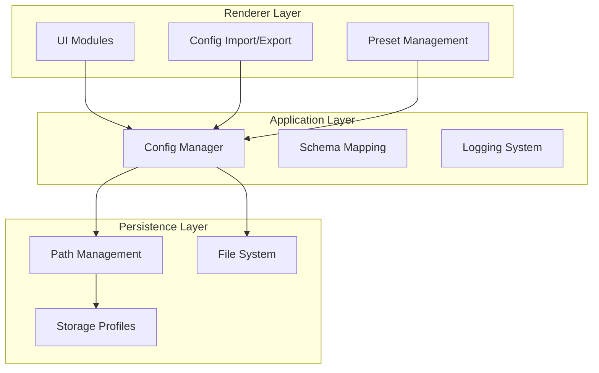
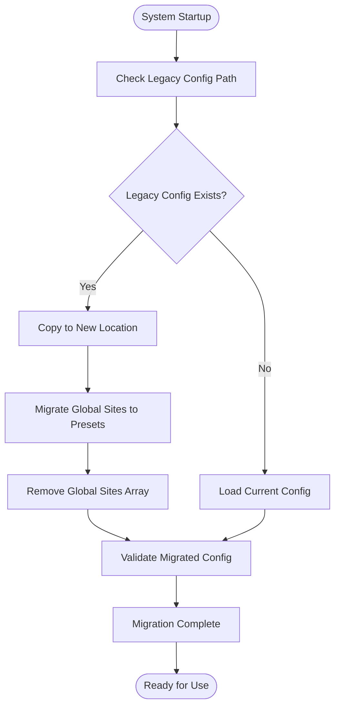
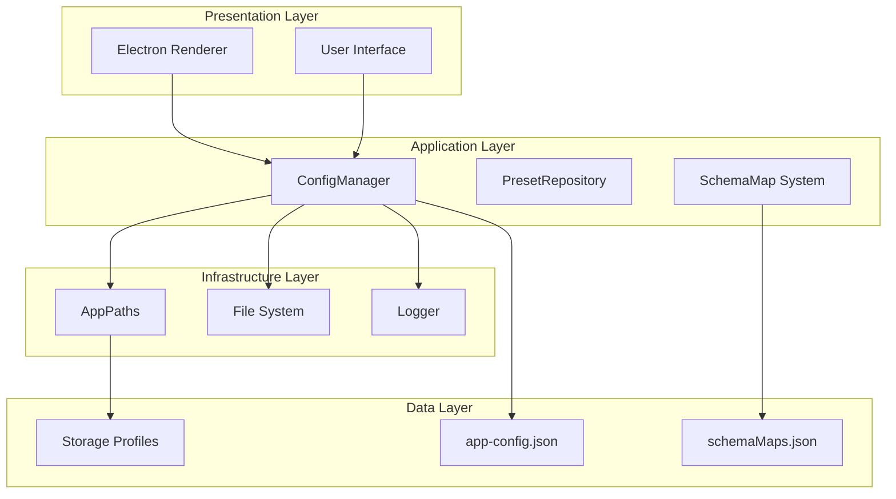
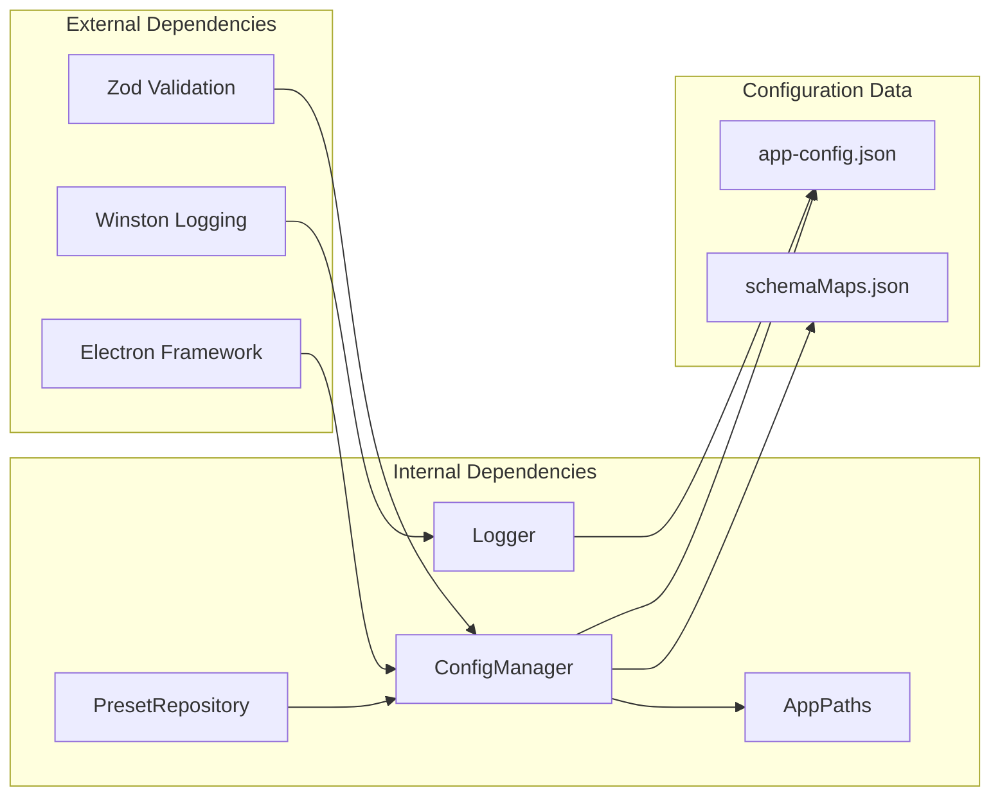

# Configuration System

<cite>
**Referenced Files in This Document**
- [config-manager.ts](file://app/config/config-manager.ts)
- [SchemaMap.ts](file://app/config/SchemaMap.ts)
- [app-config.json](file://app/config/app-config.json)
- [preset-repository.ts](file://app/automation/engine/preset-repository.ts)
- [logger.ts](file://app/config/logger.ts)
- [AppPaths.ts](file://app/core/utils/AppPaths.ts)
- [config-io.js](file://app/renderer/modules/config-io.js)
- [presets.js](file://app/renderer/modules/presets.js)
- [main.js](file://app/renderer/main.js)
- [MIGRATION_PRESET_ISOLATION.md](file://MIGRATION_PRESET_ISOLATION.md)
- [schemaMaps.json](file://data/schemaMaps.json)
</cite>

## Table of Contents
1. [Introduction](#introduction)
2. [Project Structure](#project-structure)
3. [Core Components](#core-components)
4. [Architecture Overview](#architecture-overview)
5. [Detailed Component Analysis](#detailed-component-analysis)
6. [Dependency Analysis](#dependency-analysis)
7. [Performance Considerations](#performance-considerations)
8. [Troubleshooting Guide](#troubleshooting-guide)
9. [Conclusion](#conclusion)

## Introduction

The Configuration System in Automatizador Bravo is built around a robust Zod-based validation framework that ensures type-safe configuration management for web automation workflows. The system implements a comprehensive preset isolation architecture that separates site configurations into isolated containers, enabling better organization, portability, and maintainability of automation configurations.

Key architectural features include:
- **Zod-based Validation**: Compile-time and runtime schema validation for all configuration data
- **Preset Isolation**: Complete separation of site configurations within individual presets
- **Automatic Migration**: Seamless transition from legacy global site lists to isolated preset structures
- **Export/Import Mechanisms**: Full configuration portability between environments
- **Schema Mapping System**: Structured data definition for snapshot and diff operations

## Project Structure

The configuration system spans multiple layers of the application architecture:

**Diagram sources**
- [config-manager.ts](file://app/config/config-manager.ts#L85-L408)
- [AppPaths.ts](file://app/core/utils/AppPaths.ts#L5-L60)

**Section sources**
- [config-manager.ts](file://app/config/config-manager.ts#L1-L408)
- [AppPaths.ts](file://app/core/utils/AppPaths.ts#L1-L60)

## Core Components

### Zod-Based Configuration Validation

The system employs Zod schemas for comprehensive type validation across all configuration levels:

#### Site Configuration Schema
Defines the structure for individual website automation steps with strict validation rules:
- URL validation with `.url()` constraint
- Selector validation supporting both single strings and arrays
- Step type enumeration limiting to predefined automation actions
- Optional parameters with sensible defaults
- Retry and timeout constraints with minimum/maximum bounds

#### Preset Configuration Schema
Enforces complete isolation of site configurations within presets:
- UUID-based preset identification
- Mandatory name and credential fields
- Type enumeration for different automation categories
- Schedule configuration with interval/fixed-time modes
- Automatic timestamp generation for creation and usage tracking

#### Application Configuration Schema
Manages global application settings with fallback defaults:
- Timeout and retry configuration with production defaults
- Headless browser mode control
- Notification system configuration
- Credential storage management
- Preset collection management

**Section sources**
- [config-manager.ts](file://app/config/config-manager.ts#L7-L81)

### Preset Isolation Architecture

The migration to preset isolation represents a fundamental architectural change:

#### Legacy vs Modern Approach
- **Legacy**: Global site list shared across all presets
- **Modern**: Each preset maintains its own complete site configuration array
- **Migration**: Automatic conversion preserves existing configurations while updating structure

#### Isolation Benefits
- **Complete Separation**: Sites configured for "Vendas" (sales) don't appear in "Pedidos" (orders)
- **Reduced Complexity**: Eliminates synchronization issues between site IDs and objects
- **Enhanced Portability**: Complete preset export includes all associated site configurations
- **Scalability**: New presets can be added without polluting global site collections

**Section sources**
- [MIGRATION_PRESET_ISOLATION.md](file://MIGRATION_PRESET_ISOLATION.md#L1-L242)
- [config-manager.ts](file://app/config/config-manager.ts#L35-L53)

### Configuration Migration Mechanisms

The system implements automatic migration to handle legacy configurations:

#### Automatic Migration Flow

**Diagram sources**
- [config-manager.ts](file://app/config/config-manager.ts#L133-L190)

#### Migration Features
- **Path Resolution**: Handles user profile changes and environment transitions
- **Structure Conversion**: Converts legacy site ID arrays to complete site objects
- **Validation Integration**: Ensures migrated configurations meet current schema requirements
- **Backward Compatibility**: Maintains functionality during transition period

**Section sources**
- [config-manager.ts](file://app/config/config-manager.ts#L133-L190)

### Export/Import Functionality

The system provides comprehensive configuration portability:

#### Export Process
- **Complete Serialization**: Captures all preset configurations with metadata
- **Version Tracking**: Includes export version and timestamp information
- **Data Integrity**: Validates exported data against current schema requirements

#### Import Process
- **Conflict Resolution**: Updates existing presets or creates new ones based on ID matching
- **Warning Generation**: Provides detailed feedback about import operations
- **Incremental Updates**: Supports partial configuration updates without full replacement

**Section sources**
- [config-manager.ts](file://app/config/config-manager.ts#L329-L394)
- [config-io.js](file://app/renderer/modules/config-io.js#L1-L115)

## Architecture Overview

The configuration system follows a layered architecture with clear separation of concerns:

**Diagram sources**
- [config-manager.ts](file://app/config/config-manager.ts#L85-L408)
- [preset-repository.ts](file://app/automation/engine/preset-repository.ts#L4-L34)
- [AppPaths.ts](file://app/core/utils/AppPaths.ts#L5-L60)

## Detailed Component Analysis

### ConfigManager Implementation

The ConfigManager serves as the central orchestrator for all configuration operations:

#### Singleton Pattern
- **Thread Safety**: Ensures single instance across application lifecycle
- **Lazy Initialization**: Creates instance on first access
- **Global Access**: Provides centralized configuration management

#### Core Methods
- **Configuration Loading**: Handles file system operations and validation
- **Preset Management**: CRUD operations for preset configurations
- **Site Management**: Context-aware site operations within presets
- **Export/Import**: Complete configuration serialization and deserialization

#### Validation Integration
- **Compile-time Validation**: Zod schemas define structure and constraints
- **Runtime Validation**: Automatic validation during read/write operations
- **Error Handling**: Comprehensive error reporting with contextual information

**Section sources**
- [config-manager.ts](file://app/config/config-manager.ts#L85-L408)

### Schema Mapping System

The schema mapping system provides structured data definitions for snapshot operations:

#### SchemaMap Interface
Defines the relationship between data types and their processing requirements:
- **Type Identification**: Maps configuration types to processing logic
- **Primary Key Definition**: Specifies unique identifier fields for data comparison
- **Date Field Specification**: Optional date field for temporal comparisons
- **Comparison Fields**: Selective field inclusion for diff operations

#### Data Integration
- **External Schema Maps**: Loaded from external JSON configuration
- **Dynamic Loading**: Supports runtime schema updates
- **Validation Integration**: Ensures schema compatibility with configuration data

**Section sources**
- [SchemaMap.ts](file://app/config/SchemaMap.ts#L1-L13)
- [schemaMaps.json](file://data/schemaMaps.json#L1-L9)

### Preset Repository Pattern

The PresetRepository implements the repository pattern for preset data access:

#### Repository Responsibilities
- **Data Access**: Provides abstraction over configuration storage
- **Business Logic**: Encapsulates preset-specific operations
- **Consistency**: Maintains data integrity across operations

#### Method Implementation
- **Get All**: Retrieves complete preset collection
- **Get By Id**: Locates specific preset by identifier
- **Create**: Adds new preset with validation
- **Update**: Modifies existing preset configuration
- **Delete**: Removes preset from configuration
- **Usage Tracking**: Updates last-used timestamps

**Section sources**
- [preset-repository.ts](file://app/automation/engine/preset-repository.ts#L4-L34)

### Configuration Persistence

The system implements robust persistence mechanisms:

#### Path Management
- **Environment Detection**: Differentiates between development and production environments
- **User Profile Handling**: Resolves user-specific paths for cross-platform compatibility
- **Directory Creation**: Automatically creates required directories on demand

#### File Operations
- **Atomic Writes**: Ensures configuration integrity during save operations
- **Backup Strategies**: Prevents data loss during migration and updates
- **Permission Handling**: Manages file system permissions appropriately

**Section sources**
- [AppPaths.ts](file://app/core/utils/AppPaths.ts#L5-L60)
- [config-manager.ts](file://app/config/config-manager.ts#L196-L212)

## Dependency Analysis

The configuration system exhibits clean dependency relationships:

**Diagram sources**
- [config-manager.ts](file://app/config/config-manager.ts#L1-L10)
- [package.json](file://package.json#L104-L113)

### External Dependencies
- **Zod**: Provides compile-time and runtime validation capabilities
- **Winston**: Handles structured logging with rotation and filtering
- **Electron**: Enables desktop application functionality and file system access

### Internal Dependencies
- **ConfigManager**: Central dependency for all configuration operations
- **PresetRepository**: Specialized dependency for preset data access
- **AppPaths**: Path resolution and directory management
- **Logger**: Comprehensive logging infrastructure

**Section sources**
- [package.json](file://package.json#L104-L113)

## Performance Considerations

The configuration system is designed for optimal performance:

### Memory Management
- **Lazy Loading**: Configuration loaded only when accessed
- **Immutable Objects**: Configuration objects treated as immutable after loading
- **Efficient Serialization**: Optimized JSON serialization for export operations

### Validation Performance
- **Compile-time Optimization**: Zod schemas compiled during build process
- **Minimal Runtime Overhead**: Validation occurs only during critical operations
- **Batch Operations**: Multiple operations batched to reduce file system overhead

### Scalability Factors
- **Preset Isolation**: Reduces configuration complexity and improves lookup performance
- **Incremental Updates**: Changes applied incrementally to minimize disk I/O
- **Caching Strategy**: Frequently accessed configurations cached in memory

## Troubleshooting Guide

### Common Configuration Issues

#### Validation Errors
- **Schema Violations**: Occur when configuration data doesn't match expected structure
- **Type Mismatches**: Indicate incorrect data types in configuration fields
- **Missing Required Fields**: Configuration missing mandatory fields

#### Migration Problems
- **Legacy Configuration Conflicts**: Issues during automatic migration from old format
- **Path Resolution Failures**: Problems with user profile or environment changes
- **Data Loss Prevention**: Safeguards against configuration corruption during migration

#### Export/Import Issues
- **Serialization Failures**: Problems with configuration serialization
- **Import Conflicts**: Issues with conflicting preset IDs during import
- **Version Compatibility**: Problems with incompatible configuration versions

### Error Handling Strategies

#### Validation Error Recovery
- **Graceful Degradation**: System continues operation with default values when validation fails
- **User Feedback**: Clear error messages indicate specific validation failures
- **Configuration Rollback**: Failed operations rolled back to previous valid state

#### Migration Error Recovery
- **Backup Restoration**: Automatic restoration from backup configurations
- **Partial Migration**: Allows partial successful migration with error reporting
- **Manual Intervention**: Provides clear guidance for manual configuration fixes

**Section sources**
- [config-manager.ts](file://app/config/config-manager.ts#L186-L189)
- [logger.ts](file://app/config/logger.ts#L16-L60)

## Conclusion

The Configuration System in Automatizador Bravo represents a sophisticated approach to managing complex automation configurations. Through the implementation of Zod-based validation, preset isolation architecture, and comprehensive migration mechanisms, the system provides:

- **Type Safety**: Compile-time and runtime validation ensures configuration integrity
- **Architectural Clarity**: Clean separation of concerns with well-defined interfaces
- **Operational Excellence**: Robust error handling and recovery mechanisms
- **Future-Proof Design**: Extensible architecture supporting future enhancements

The system successfully balances complexity with usability, providing automation teams with powerful configuration management capabilities while maintaining system reliability and performance. The comprehensive export/import functionality ensures configuration portability across different environments, while the preset isolation architecture enables scalable configuration management for growing automation needs.