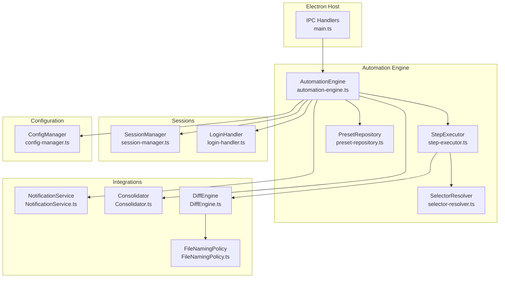
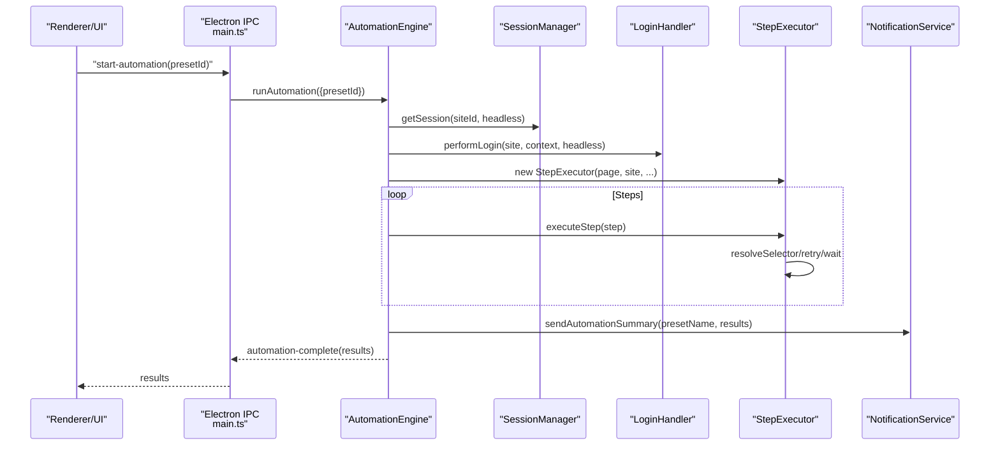
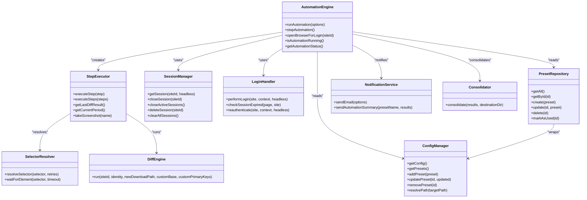

# Automation Engine Architecture

<cite>
**Referenced Files in This Document**
- [automation-engine.ts](file://app/automation/engine/automation-engine.ts)
- [step-executor.ts](file://app/automation/engine/step-executor.ts)
- [session-manager.ts](file://app/automation/sessions/session-manager.ts)
- [login-handler.ts](file://app/automation/sessions/login-handler.ts)
- [preset-repository.ts](file://app/automation/engine/preset-repository.ts)
- [selector-resolver.ts](file://app/automation/engine/selector-resolver.ts)
- [config-manager.ts](file://app/config/config-manager.ts)
- [NotificationService.ts](file://app/core/notifications/NotificationService.ts)
- [Consolidator.ts](file://app/core/consolidation/Consolidator.ts)
- [DiffEngine.ts](file://app/core/diff/DiffEngine.ts)
- [FileNamingPolicy.ts](file://app/policy/snapshot/FileNamingPolicy.ts)
- [main.ts](file://app/electron/main.ts)
</cite>

## Table of Contents
1. [Introduction](#introduction)
2. [Project Structure](#project-structure)
3. [Core Components](#core-components)
4. [Architecture Overview](#architecture-overview)
5. [Detailed Component Analysis](#detailed-component-analysis)
6. [Dependency Analysis](#dependency-analysis)
7. [Performance Considerations](#performance-considerations)
8. [Troubleshooting Guide](#troubleshooting-guide)
9. [Conclusion](#conclusion)

## Introduction
This document describes the Automation Engine Architecture responsible for orchestrating automated browser workflows across multiple websites. It explains the core design patterns, singleton implementations, component relationships, execution flow, browser context management, resource lifecycle, and integration points with session management, configuration management, and notification services. It also covers thread safety, error handling strategies, and performance considerations in a multi-threaded environment.

## Project Structure
The automation engine is organized around a modular architecture:
- Engine layer: orchestration and lifecycle management
- Sessions layer: browser context and profile management
- Execution layer: step-by-step automation
- Configuration layer: centralized settings and presets
- Integration services: notifications, consolidation, and diff processing
- Electron integration: IPC handlers and UI lifecycle

**Diagram sources**
- [automation-engine.ts](file://app/automation/engine/automation-engine.ts#L50-L608)
- [step-executor.ts](file://app/automation/engine/step-executor.ts#L25-L549)
- [session-manager.ts](file://app/automation/sessions/session-manager.ts#L67-L225)
- [login-handler.ts](file://app/automation/sessions/login-handler.ts#L13-L364)
- [preset-repository.ts](file://app/automation/engine/preset-repository.ts#L4-L34)
- [config-manager.ts](file://app/config/config-manager.ts#L85-L408)
- [NotificationService.ts](file://app/core/notifications/NotificationService.ts#L13-L115)
- [Consolidator.ts](file://app/core/consolidation/Consolidator.ts#L20-L138)
- [DiffEngine.ts](file://app/core/diff/DiffEngine.ts#L23-L230)
- [FileNamingPolicy.ts](file://app/policy/snapshot/FileNamingPolicy.ts#L4-L35)
- [main.ts](file://app/electron/main.ts#L117-L281)

**Section sources**
- [automation-engine.ts](file://app/automation/engine/automation-engine.ts#L1-L611)
- [main.ts](file://app/electron/main.ts#L1-L387)

## Core Components
- AutomationEngine: Central orchestrator managing browser contexts, session lifecycle, step execution, progress reporting, and post-processing.
- StepExecutor: Executes individual automation steps against a Playwright Page with robust retry and timeout handling.
- SessionManager: Manages persistent browser contexts per site, handles installation and migration of Playwright browsers, and profile lifecycle.
- LoginHandler: Handles login flows, captcha detection, manual intervention, and session expiration checks with re-authentication.
- ConfigManager: Singleton configuration provider with Zod validation, path resolution, and preset management.
- PresetRepository: Repository wrapper around ConfigManager for preset CRUD operations.
- SelectorResolver: Resolves Playwright locators with retries and visibility checks.
- NotificationService: Sends email summaries for automation runs.
- Consolidator: Merges multiple snapshot outputs into consolidated master files.
- DiffEngine: Performs row-level diffs between snapshots and maintains metadata.
- FileNamingPolicy: Generates deterministic snapshot file names and resolves file paths.

**Section sources**
- [automation-engine.ts](file://app/automation/engine/automation-engine.ts#L50-L608)
- [step-executor.ts](file://app/automation/engine/step-executor.ts#L25-L549)
- [session-manager.ts](file://app/automation/sessions/session-manager.ts#L67-L225)
- [login-handler.ts](file://app/automation/sessions/login-handler.ts#L13-L364)
- [config-manager.ts](file://app/config/config-manager.ts#L85-L408)
- [preset-repository.ts](file://app/automation/engine/preset-repository.ts#L4-L34)
- [selector-resolver.ts](file://app/automation/engine/selector-resolver.ts#L4-L135)
- [NotificationService.ts](file://app/core/notifications/NotificationService.ts#L13-L115)
- [Consolidator.ts](file://app/core/consolidation/Consolidator.ts#L20-L138)
- [DiffEngine.ts](file://app/core/diff/DiffEngine.ts#L23-L230)
- [FileNamingPolicy.ts](file://app/policy/snapshot/FileNamingPolicy.ts#L4-L35)

## Architecture Overview
The engine follows a layered architecture:
- Electron IPC layer exposes automation controls and status to the renderer.
- AutomationEngine coordinates site processing, session acquisition, login handling, and step execution.
- StepExecutor encapsulates Playwright operations with timeouts, retries, and selector resolution.
- SessionManager ensures isolated, persistent browser contexts per site.
- LoginHandler manages authentication flows and session health.
- ConfigManager centralizes configuration and preset definitions.
- Integrations handle notifications, snapshot consolidation, and diff processing.

**Diagram sources**
- [main.ts](file://app/electron/main.ts#L214-L232)
- [automation-engine.ts](file://app/automation/engine/automation-engine.ts#L62-L238)
- [session-manager.ts](file://app/automation/sessions/session-manager.ts#L103-L138)
- [login-handler.ts](file://app/automation/sessions/login-handler.ts#L28-L77)
- [step-executor.ts](file://app/automation/engine/step-executor.ts#L59-L110)
- [NotificationService.ts](file://app/core/notifications/NotificationService.ts#L75-L111)

## Detailed Component Analysis

### AutomationEngine
Responsibilities:
- Orchestrates multi-site automation with preset isolation.
- Manages browser lifecycle and global timeout safeguards.
- Coordinates session creation, login, and step execution.
- Emits progress events and updates UI in real-time.
- Performs post-run consolidation and notifications.

Key patterns:
- Singleton export for global access.
- Thread-safety via a single isRunning flag and per-site cleanup.
- Global timeout guard prevents runaway processes.
- Preset-driven isolation ensures clean separation of credentials and destinations.

Execution flow highlights:
- Validates preset/site availability and injects preset credentials if present.
- Ensures active sessions are closed before starting.
- Processes each site sequentially, emitting progress and handling failures.
- Cleans up browser contexts and pages after completion.
- Consolidates results and sends email summaries.

Thread safety:
- Single-threaded orchestration via isRunning flag prevents concurrent runs.
- Per-site cleanup ensures no lingering contexts.
- Global timeout prevents indefinite hangs.

Error handling:
- Captures errors per site, attaches screenshots, and continues to next site.
- Emits progress events for UI logging.
- Cleans up resources on failure and on completion.

Performance considerations:
- Headless defaults reduce overhead.
- Action delays configurable via ConfigManager.
- Cleanup routines minimize resource leaks.

**Section sources**
- [automation-engine.ts](file://app/automation/engine/automation-engine.ts#L50-L608)
- [main.ts](file://app/electron/main.ts#L214-L232)

### StepExecutor
Responsibilities:
- Executes typed steps (goto, click, fill, select, waitFor, download).
- Resolves selectors with retries and visibility checks.
- Handles date range filling with token expansion and input-type-aware formatting.
- Manages downloads with snapshot-aware naming and diff processing.
- Provides screenshot capture and last diff result exposure.

Key patterns:
- Retry logic for selector resolution and step execution.
- Action delay between steps to mimic human behavior.
- Snapshot-aware download pipeline integrates DiffEngine for change detection.

Error handling:
- continueOnError flag allows soft-failures for resilient workflows.
- Throws on unsupported step types or missing required parameters.

Performance considerations:
- Waits for navigation and DOM readiness to avoid premature operations.
- Creates target directories before clicking to prevent errors.

**Section sources**
- [step-executor.ts](file://app/automation/engine/step-executor.ts#L25-L549)
- [selector-resolver.ts](file://app/automation/engine/selector-resolver.ts#L4-L135)
- [DiffEngine.ts](file://app/core/diff/DiffEngine.ts#L23-L230)
- [FileNamingPolicy.ts](file://app/policy/snapshot/FileNamingPolicy.ts#L4-L35)

### SessionManager
Responsibilities:
- Ensures Playwright browsers are installed and available.
- Launches persistent browser contexts per site with isolated profiles.
- Manages active sessions map and profile directories.
- Supports closing, deleting, and clearing sessions.

Key patterns:
- Migration logic for browsers and profiles from legacy locations.
- PersistentContext usage preserves cookies, cache, and IndexedDB.
- Headless/headed toggling per site context.

Thread safety:
- Active sessions stored in a Map guarded by siteId keys.
- Close operations synchronized via context.close().

**Section sources**
- [session-manager.ts](file://app/automation/sessions/session-manager.ts#L67-L225)

### LoginHandler
Responsibilities:
- Attempts automatic login using configured credentials.
- Detects captcha and triggers manual login mode.
- Checks for session expiration during execution and re-authenticates.
- Provides login result with manual intervention flags.

Key patterns:
- Singleton instance ensures consistent login behavior.
- Manual login waits for user confirmation with timeout.
- Re-authentication deletes expired session and relaunches login.

Thread safety:
- Stateless operations; relies on SessionManager for context integrity.

**Section sources**
- [login-handler.ts](file://app/automation/sessions/login-handler.ts#L13-L364)

### ConfigManager
Responsibilities:
- Loads, validates, and persists application configuration.
- Manages presets and site definitions with Zod schemas.
- Resolves environment variables and user paths safely.
- Supports import/export of configuration data.

Key patterns:
- Singleton with lazy initialization and migration logic.
- Preset-centric model replaces legacy global site lists.
- Path resolution handles cross-user and cross-platform differences.

**Section sources**
- [config-manager.ts](file://app/config/config-manager.ts#L85-L408)

### PresetRepository
Responsibilities:
- CRUD operations for presets via ConfigManager.
- Marks presets as used with timestamps.

**Section sources**
- [preset-repository.ts](file://app/automation/engine/preset-repository.ts#L4-L34)

### NotificationService
Responsibilities:
- Sends email summaries after automation runs.
- Requires SMTP configuration and recipient settings.

**Section sources**
- [NotificationService.ts](file://app/core/notifications/NotificationService.ts#L13-L115)

### Consolidator
Responsibilities:
- Merges multiple snapshot outputs into consolidated master files.
- Builds consolidated current and deleted reports.

**Section sources**
- [Consolidator.ts](file://app/core/consolidation/Consolidator.ts#L20-L138)

### DiffEngine
Responsibilities:
- Compares new downloads with previous snapshots.
- Generates added/removed counts and maintains metadata.
- Uses SafeSnapshotPolicy schemas or custom primary keys.

**Section sources**
- [DiffEngine.ts](file://app/core/diff/DiffEngine.ts#L23-L230)

## Dependency Analysis
The engine exhibits clear layering and minimal coupling:
- AutomationEngine depends on SessionManager, LoginHandler, StepExecutor, ConfigManager, PresetRepository, NotificationService, and Consolidator.
- StepExecutor depends on SelectorResolver and integrates DiffEngine for snapshot-aware downloads.
- SessionManager depends on AppPaths and Playwright for browser provisioning.
- ConfigManager depends on AppPaths and Zod for validation.
- Integrations (Consolidator, DiffEngine, NotificationService) are loosely coupled via interfaces and data contracts.

**Diagram sources**
- [automation-engine.ts](file://app/automation/engine/automation-engine.ts#L50-L608)
- [step-executor.ts](file://app/automation/engine/step-executor.ts#L25-L549)
- [session-manager.ts](file://app/automation/sessions/session-manager.ts#L67-L225)
- [login-handler.ts](file://app/automation/sessions/login-handler.ts#L13-L364)
- [config-manager.ts](file://app/config/config-manager.ts#L85-L408)
- [preset-repository.ts](file://app/automation/engine/preset-repository.ts#L4-L34)
- [selector-resolver.ts](file://app/automation/engine/selector-resolver.ts#L4-L135)
- [NotificationService.ts](file://app/core/notifications/NotificationService.ts#L13-L115)
- [Consolidator.ts](file://app/core/consolidation/Consolidator.ts#L20-L138)
- [DiffEngine.ts](file://app/core/diff/DiffEngine.ts#L23-L230)

**Section sources**
- [automation-engine.ts](file://app/automation/engine/automation-engine.ts#L50-L608)
- [step-executor.ts](file://app/automation/engine/step-executor.ts#L25-L549)
- [session-manager.ts](file://app/automation/sessions/session-manager.ts#L67-L225)
- [login-handler.ts](file://app/automation/sessions/login-handler.ts#L13-L364)
- [config-manager.ts](file://app/config/config-manager.ts#L85-L408)
- [preset-repository.ts](file://app/automation/engine/preset-repository.ts#L4-L34)
- [selector-resolver.ts](file://app/automation/engine/selector-resolver.ts#L4-L135)
- [NotificationService.ts](file://app/core/notifications/NotificationService.ts#L13-L115)
- [Consolidator.ts](file://app/core/consolidation/Consolidator.ts#L20-L138)
- [DiffEngine.ts](file://app/core/diff/DiffEngine.ts#L23-L230)

## Performance Considerations
- Headless mode reduces CPU and memory overhead; configurable via ConfigManager.
- Action delays balance reliability and speed; tune via actionDelay setting.
- Selector resolution retries avoid flaky waits; adjust retries per step.
- Persistent contexts reuse cache and cookies, reducing login overhead.
- Global timeout prevents long-running tasks from blocking resources.
- Consolidation merges only successful snapshot results to minimize I/O.
- Watchdog in Electron monitors memory usage for 24/7 stability.

[No sources needed since this section provides general guidance]

## Troubleshooting Guide
Common issues and resolutions:
- Session conflicts: Use SessionManager.closeActiveSessions() before starting automation.
- Captcha detection: Run in visible mode once to resolve; LoginHandler throws if headless and captcha detected.
- Session expiration: LoginHandler.checkSessionExpired() triggers reauthentication; ensure context remains open.
- Selector failures: Increase retries or adjust timeouts; use SelectorResolver.waitForElement().
- Path resolution errors: Use ConfigManager.resolvePath() to normalize environment variables and cross-user paths.
- Snapshot consolidation failures: Verify destination directory and schema presence; Consolidator merges only valid snapshot files.
- Email notifications: Ensure SMTP configuration and recipient are set in ConfigManager.

**Section sources**
- [automation-engine.ts](file://app/automation/engine/automation-engine.ts#L84-L85)
- [login-handler.ts](file://app/automation/sessions/login-handler.ts#L57-L63)
- [session-manager.ts](file://app/automation/sessions/session-manager.ts#L155-L165)
- [selector-resolver.ts](file://app/automation/engine/selector-resolver.ts#L17-L48)
- [config-manager.ts](file://app/config/config-manager.ts#L98-L124)
- [Consolidator.ts](file://app/core/consolidation/Consolidator.ts#L26-L63)
- [NotificationService.ts](file://app/core/notifications/NotificationService.ts#L28-L70)

## Conclusion
The Automation Engine employs a robust, layered architecture centered on a singleton AutomationEngine that coordinates browser sessions, authentication, and step execution. Its design emphasizes isolation (per-site contexts), resilience (retries and timeouts), and observability (progress events and notifications). Integrations with configuration, snapshot consolidation, and diff processing enable enterprise-grade auditing and reporting. The system is thread-safe under single-threaded orchestration, with clear resource lifecycle management and comprehensive error handling.