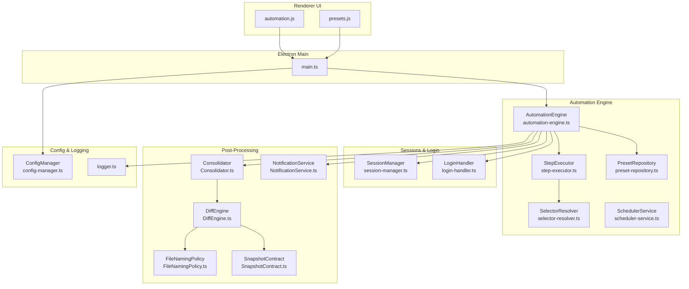
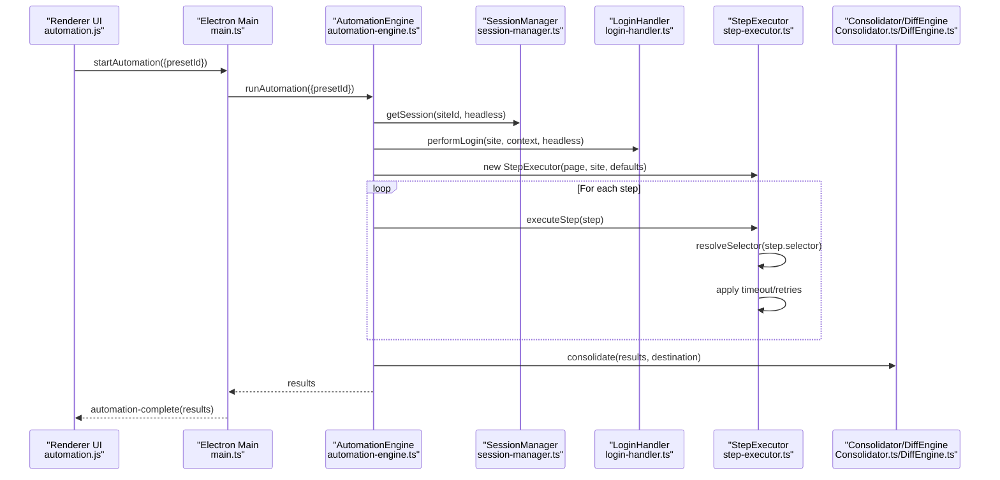
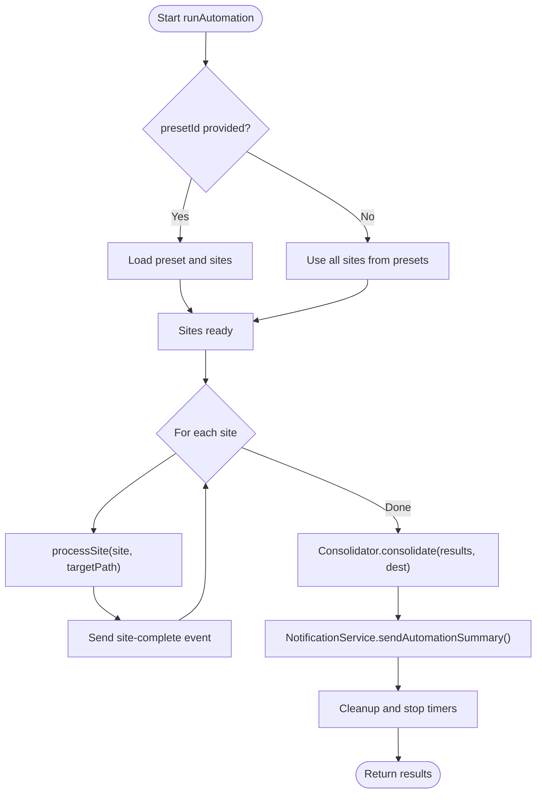
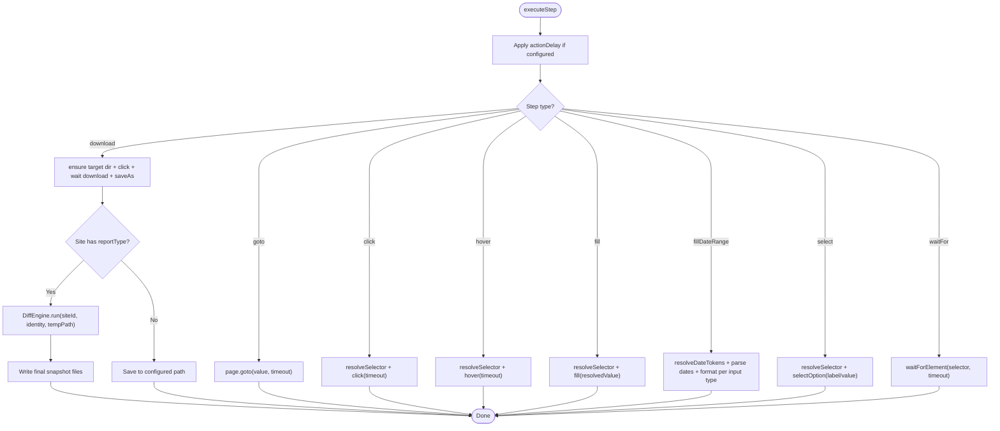
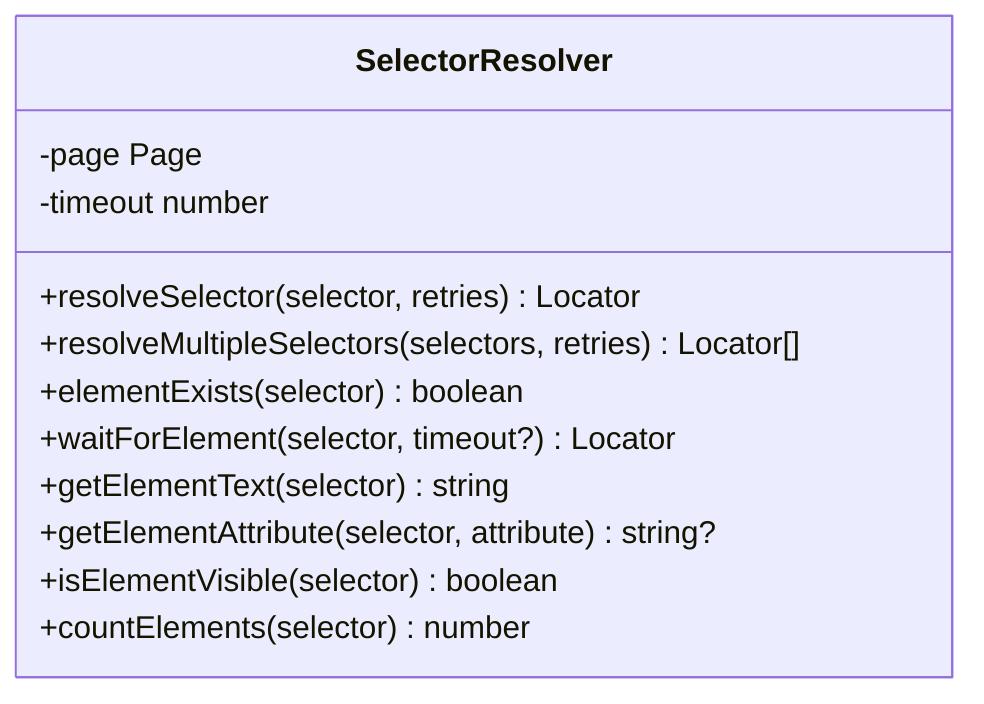
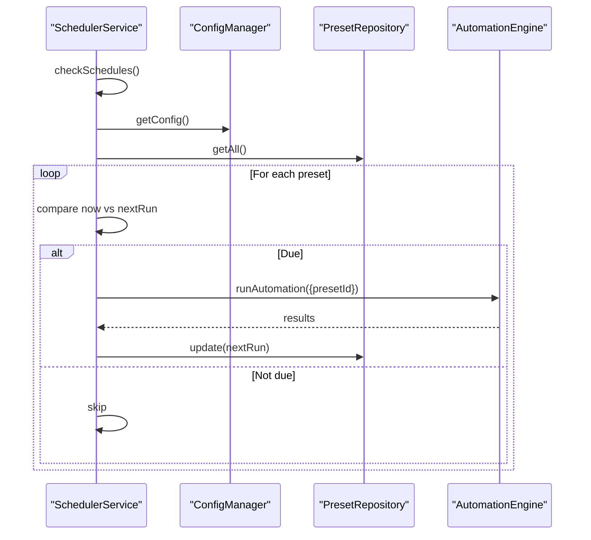
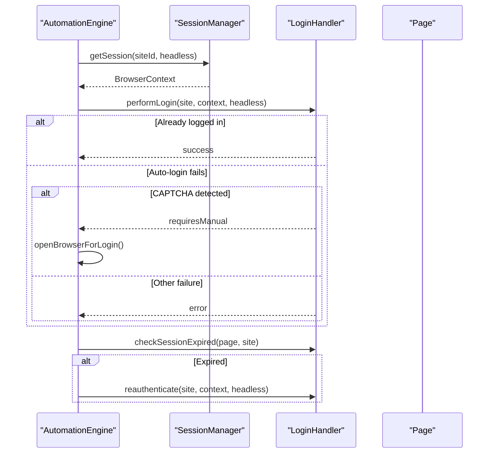
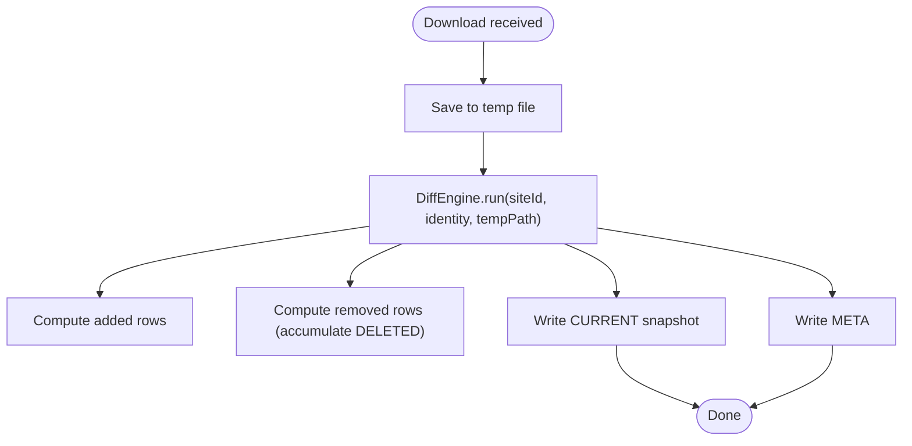
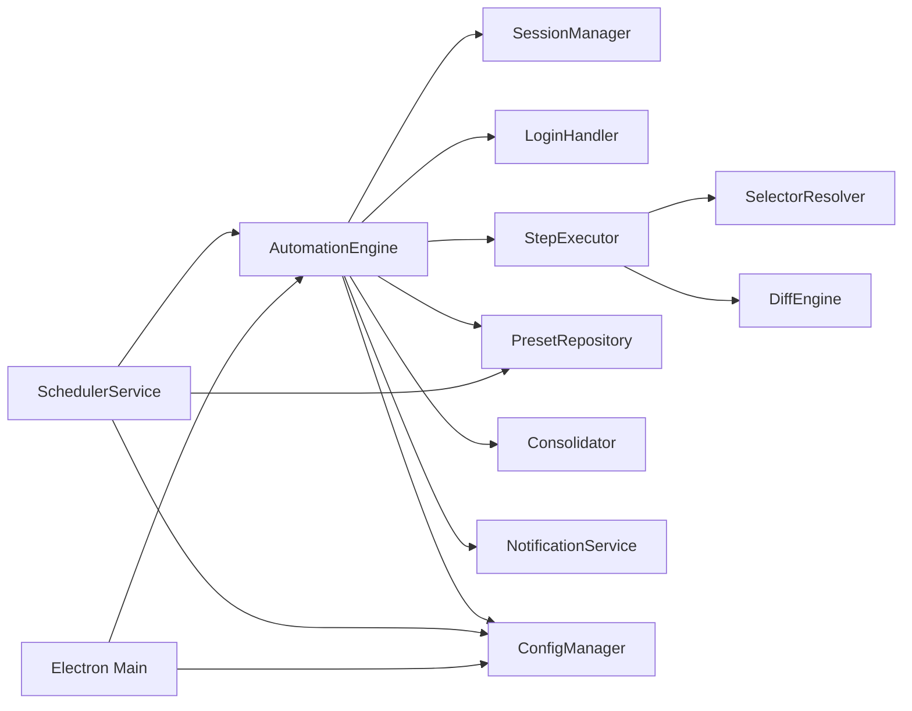

# Core Automation Engine

<cite>
**Referenced Files in This Document**
- [automation-engine.ts](file://app/automation/engine/automation-engine.ts)
- [step-executor.ts](file://app/automation/engine/step-executor.ts)
- [selector-resolver.ts](file://app/automation/engine/selector-resolver.ts)
- [preset-repository.ts](file://app/automation/engine/preset-repository.ts)
- [scheduler-service.ts](file://app/automation/engine/scheduler-service.ts)
- [config-manager.ts](file://app/config/config-manager.ts)
- [session-manager.ts](file://app/automation/sessions/session-manager.ts)
- [login-handler.ts](file://app/automation/sessions/login-handler.ts)
- [Consolidator.ts](file://app/core/consolidation/Consolidator.ts)
- [DiffEngine.ts](file://app/core/diff/DiffEngine.ts)
- [NotificationService.ts](file://app/core/notifications/NotificationService.ts)
- [FileNamingPolicy.ts](file://app/policy/snapshot/FileNamingPolicy.ts)
- [SnapshotContract.ts](file://app/policy/snapshot/SnapshotContract.ts)
- [logger.ts](file://app/config/logger.ts)
- [main.ts](file://app/electron/main.ts)
- [automation.js](file://app/renderer/modules/automation.js)
- [presets.js](file://app/renderer/modules/presets.js)
</cite>

## Table of Contents
1. [Introduction](#introduction)
2. [Project Structure](#project-structure)
3. [Core Components](#core-components)
4. [Architecture Overview](#architecture-overview)
5. [Detailed Component Analysis](#detailed-component-analysis)
6. [Dependency Analysis](#dependency-analysis)
7. [Performance Considerations](#performance-considerations)
8. [Troubleshooting Guide](#troubleshooting-guide)
9. [Conclusion](#conclusion)
10. [Appendices](#appendices)

## Introduction
This document describes the Core Automation Engine responsible for orchestrating multi-site, multi-step browser automation workflows. It covers the engine’s architecture, step execution system with retry logic and timeouts, preset-based workflow orchestration, progress tracking, selector resolution strategies, multi-site execution, error handling patterns, monitoring and debugging capabilities, and performance optimization techniques.

## Project Structure
The automation engine is organized around a central engine that coordinates sessions, login handling, step execution, and post-processing. Supporting modules provide configuration management, scheduling, snapshot diffing, consolidation, and notifications. The Electron main process exposes IPC handlers to drive automation from the renderer UI.

**Diagram sources**
- [automation-engine.ts](file://app/automation/engine/automation-engine.ts#L50-L608)
- [step-executor.ts](file://app/automation/engine/step-executor.ts#L25-L549)
- [selector-resolver.ts](file://app/automation/engine/selector-resolver.ts#L4-L135)
- [preset-repository.ts](file://app/automation/engine/preset-repository.ts#L4-L34)
- [scheduler-service.ts](file://app/automation/engine/scheduler-service.ts#L6-L145)
- [session-manager.ts](file://app/automation/sessions/session-manager.ts#L67-L225)
- [login-handler.ts](file://app/automation/sessions/login-handler.ts#L13-L364)
- [Consolidator.ts](file://app/core/consolidation/Consolidator.ts#L20-L138)
- [DiffEngine.ts](file://app/core/diff/DiffEngine.ts#L23-L230)
- [FileNamingPolicy.ts](file://app/policy/snapshot/FileNamingPolicy.ts#L4-L35)
- [SnapshotContract.ts](file://app/policy/snapshot/SnapshotContract.ts#L9-L19)
- [NotificationService.ts](file://app/core/notifications/NotificationService.ts#L13-L115)
- [config-manager.ts](file://app/config/config-manager.ts#L85-L408)
- [logger.ts](file://app/config/logger.ts#L16-L104)
- [main.ts](file://app/electron/main.ts#L117-L281)

**Section sources**
- [automation-engine.ts](file://app/automation/engine/automation-engine.ts#L50-L608)
- [main.ts](file://app/electron/main.ts#L117-L281)

## Core Components
- AutomationEngine: Orchestrates multi-site execution, manages sessions, login, step execution, progress events, and post-processing.
- StepExecutor: Executes individual steps with timeout/retry policies, selector resolution, and SSP-aware download handling.
- SelectorResolver: Resolves Playwright locators with retry and fallback strategies.
- PresetRepository: CRUD operations for presets and usage tracking.
- SchedulerService: Periodic execution scheduling based on preset schedules.
- SessionManager/LoginHandler: Persistent browser contexts per site, login automation/manual fallback, and session re-authentication.
- Consolidator/DiffEngine: Post-download snapshot diffing and consolidated reporting.
- NotificationService: Optional email summaries after automation runs.
- ConfigManager: Centralized configuration and preset management with validation and migration.
- Electron main: IPC handlers to start/stop automation, manage presets, and expose UI controls.

**Section sources**
- [automation-engine.ts](file://app/automation/engine/automation-engine.ts#L50-L608)
- [step-executor.ts](file://app/automation/engine/step-executor.ts#L25-L549)
- [selector-resolver.ts](file://app/automation/engine/selector-resolver.ts#L4-L135)
- [preset-repository.ts](file://app/automation/engine/preset-repository.ts#L4-L34)
- [scheduler-service.ts](file://app/automation/engine/scheduler-service.ts#L6-L145)
- [session-manager.ts](file://app/automation/sessions/session-manager.ts#L67-L225)
- [login-handler.ts](file://app/automation/sessions/login-handler.ts#L13-L364)
- [Consolidator.ts](file://app/core/consolidation/Consolidator.ts#L20-L138)
- [DiffEngine.ts](file://app/core/diff/DiffEngine.ts#L23-L230)
- [NotificationService.ts](file://app/core/notifications/NotificationService.ts#L13-L115)
- [config-manager.ts](file://app/config/config-manager.ts#L85-L408)
- [main.ts](file://app/electron/main.ts#L117-L281)

## Architecture Overview
The engine operates in two primary modes:
- Manual mode: Triggered from the UI via IPC to start automation for a selected preset.
- Scheduled mode: Background scheduler checks preset schedules and triggers automation when due.

**Diagram sources**
- [automation.js](file://app/renderer/modules/automation.js#L7-L45)
- [main.ts](file://app/electron/main.ts#L214-L232)
- [automation-engine.ts](file://app/automation/engine/automation-engine.ts#L62-L238)
- [session-manager.ts](file://app/automation/sessions/session-manager.ts#L103-L138)
- [login-handler.ts](file://app/automation/sessions/login-handler.ts#L28-L77)
- [step-executor.ts](file://app/automation/engine/step-executor.ts#L59-L110)
- [Consolidator.ts](file://app/core/consolidation/Consolidator.ts#L26-L63)

## Detailed Component Analysis

### AutomationEngine
Responsibilities:
- Multi-site orchestration with preset isolation.
- Global timeout enforcement and resource cleanup.
- Progress emission to UI via Electron IPC.
- Post-processing and consolidation.
- Optional email notifications.

Key behaviors:
- Validates and selects sites either from a preset or legacy mode.
- Injects preset credentials into site configs during execution.
- Applies auto-folder creation for download destinations when using preset destinations and typed reports.
- Emits site-complete events for live UI updates.
- Consolidates results into master snapshots and optionally sends email summaries.

**Diagram sources**
- [automation-engine.ts](file://app/automation/engine/automation-engine.ts#L62-L238)
- [Consolidator.ts](file://app/core/consolidation/Consolidator.ts#L26-L63)
- [NotificationService.ts](file://app/core/notifications/NotificationService.ts#L75-L111)

**Section sources**
- [automation-engine.ts](file://app/automation/engine/automation-engine.ts#L62-L238)
- [Consolidator.ts](file://app/core/consolidation/Consolidator.ts#L26-L63)
- [NotificationService.ts](file://app/core/notifications/NotificationService.ts#L75-L111)

### StepExecutor
Responsibilities:
- Execute individual steps with configurable timeouts and retries.
- Selector resolution and element interaction.
- Date token resolution for date range fills.
- Intelligent download handling with SSP-aware snapshot diffing.
- Screenshot capture for debugging.

Execution model:
- Applies action delay between steps.
- Uses SelectorResolver to locate elements with retry/backoff.
- Supports goto, click, hover, fill, fillDateRange, select, waitFor, download.
- For downloads under SSP, saves to a temporary file, runs DiffEngine, then writes final snapshot files.

**Diagram sources**
- [step-executor.ts](file://app/automation/engine/step-executor.ts#L59-L511)
- [selector-resolver.ts](file://app/automation/engine/selector-resolver.ts#L17-L48)
- [DiffEngine.ts](file://app/core/diff/DiffEngine.ts#L55-L219)

**Section sources**
- [step-executor.ts](file://app/automation/engine/step-executor.ts#L59-L511)
- [selector-resolver.ts](file://app/automation/engine/selector-resolver.ts#L17-L48)
- [DiffEngine.ts](file://app/core/diff/DiffEngine.ts#L55-L219)

### SelectorResolver
Capabilities:
- Resolve a single or multiple selectors with retries.
- Wait for visibility with per-selector timeout distribution.
- Element existence checks, text retrieval, attribute access, visibility checks, and counting.

**Diagram sources**
- [selector-resolver.ts](file://app/automation/engine/selector-resolver.ts#L4-L135)

**Section sources**
- [selector-resolver.ts](file://app/automation/engine/selector-resolver.ts#L17-L135)

### PresetRepository and SchedulerService
- PresetRepository: CRUD for presets and marks last used timestamps.
- SchedulerService: Runs every minute, checks preset schedules, and triggers automation if eligible. Includes watchdog to recover from long-running states.

**Diagram sources**
- [scheduler-service.ts](file://app/automation/engine/scheduler-service.ts#L38-L96)
- [preset-repository.ts](file://app/automation/engine/preset-repository.ts#L28-L31)
- [config-manager.ts](file://app/config/config-manager.ts#L216-L256)

**Section sources**
- [preset-repository.ts](file://app/automation/engine/preset-repository.ts#L4-L34)
- [scheduler-service.ts](file://app/automation/engine/scheduler-service.ts#L38-L96)
- [config-manager.ts](file://app/config/config-manager.ts#L216-L256)

### Sessions and Login
- SessionManager: Ensures Playwright browsers are installed, creates persistent contexts per site, and manages lifecycle.
- LoginHandler: Attempts auto-login, detects CAPTCHA, supports manual login in visible mode, and re-authenticates when session expires.

**Diagram sources**
- [session-manager.ts](file://app/automation/sessions/session-manager.ts#L103-L138)
- [login-handler.ts](file://app/automation/sessions/login-handler.ts#L28-L77)
- [login-handler.ts](file://app/automation/sessions/login-handler.ts#L288-L360)
- [automation-engine.ts](file://app/automation/engine/automation-engine.ts#L309-L375)

**Section sources**
- [session-manager.ts](file://app/automation/sessions/session-manager.ts#L103-L138)
- [login-handler.ts](file://app/automation/sessions/login-handler.ts#L28-L77)
- [login-handler.ts](file://app/automation/sessions/login-handler.ts#L288-L360)

### Post-Processing: DiffEngine and Consolidator
- DiffEngine: Compares new download against previous snapshot, computes added/removed rows, maintains DELETED accumulation, writes CURRENT and META.
- Consolidator: Merges multiple site results into master CURRENT and DELETED snapshots.

**Diagram sources**
- [step-executor.ts](file://app/automation/engine/step-executor.ts#L466-L488)
- [DiffEngine.ts](file://app/core/diff/DiffEngine.ts#L55-L219)
- [Consolidator.ts](file://app/core/consolidation/Consolidator.ts#L26-L63)

**Section sources**
- [step-executor.ts](file://app/automation/engine/step-executor.ts#L466-L488)
- [DiffEngine.ts](file://app/core/diff/DiffEngine.ts#L55-L219)
- [Consolidator.ts](file://app/core/consolidation/Consolidator.ts#L26-L63)

### Configuration and Policies
- ConfigManager: Validates and persists configuration, presets, and migration logic. Provides path resolution and environment variable substitution.
- FileNamingPolicy and SnapshotContract: Define snapshot file naming and identity structure for SSP.

**Section sources**
- [config-manager.ts](file://app/config/config-manager.ts#L85-L408)
- [FileNamingPolicy.ts](file://app/policy/snapshot/FileNamingPolicy.ts#L4-L35)
- [SnapshotContract.ts](file://app/policy/snapshot/SnapshotContract.ts#L9-L19)

### Monitoring and Debugging
- Logging: Winston-based daily-rotated logs for general, automation, and session scopes.
- Progress events: AutomationEngine emits progress events for UI updates.
- Screenshots: StepExecutor captures screenshots on demand for debugging.
- Watchdog: Electron main monitors memory usage and logs health signals.

**Section sources**
- [logger.ts](file://app/config/logger.ts#L16-L104)
- [automation-engine.ts](file://app/automation/engine/automation-engine.ts#L548-L556)
- [step-executor.ts](file://app/automation/engine/step-executor.ts#L126-L135)
- [main.ts](file://app/electron/main.ts#L102-L114)

## Dependency Analysis
High-level dependencies:
- AutomationEngine depends on SessionManager, LoginHandler, StepExecutor, PresetRepository, Consolidator, NotificationService, and ConfigManager.
- StepExecutor depends on SelectorResolver and DiffEngine for downloads.
- SchedulerService depends on ConfigManager and PresetRepository.
- Electron main registers IPC handlers to drive AutomationEngine and expose configuration operations.

**Diagram sources**
- [automation-engine.ts](file://app/automation/engine/automation-engine.ts#L50-L608)
- [step-executor.ts](file://app/automation/engine/step-executor.ts#L25-L549)
- [selector-resolver.ts](file://app/automation/engine/selector-resolver.ts#L4-L135)
- [scheduler-service.ts](file://app/automation/engine/scheduler-service.ts#L6-L145)
- [preset-repository.ts](file://app/automation/engine/preset-repository.ts#L4-L34)
- [Consolidator.ts](file://app/core/consolidation/Consolidator.ts#L20-L138)
- [DiffEngine.ts](file://app/core/diff/DiffEngine.ts#L23-L230)
- [NotificationService.ts](file://app/core/notifications/NotificationService.ts#L13-L115)
- [config-manager.ts](file://app/config/config-manager.ts#L85-L408)
- [main.ts](file://app/electron/main.ts#L117-L281)

**Section sources**
- [automation-engine.ts](file://app/automation/engine/automation-engine.ts#L50-L608)
- [step-executor.ts](file://app/automation/engine/step-executor.ts#L25-L549)
- [scheduler-service.ts](file://app/automation/engine/scheduler-service.ts#L6-L145)
- [main.ts](file://app/electron/main.ts#L117-L281)

## Performance Considerations
- Action delays: Configurable per-action delay to reduce detection risk and stabilize page interactions.
- Retry strategies: Selector resolution and step execution include retry attempts with small backoff.
- Headless mode: Defaults to headless operation to minimize resource usage; manual login opens a visible browser window.
- Global timeout: Enforces a hard cap on total automation runtime to prevent resource leaks.
- Path resolution: Automatic creation of target directories for downloads to avoid failures mid-run.
- Memory watchdog: Periodic logging of memory usage to maintain 24/7 stability.

[No sources needed since this section provides general guidance]

## Troubleshooting Guide
Common scenarios and remedies:
- CAPTCHA or challenge detection: Switch to visible mode to allow manual resolution; the engine will prompt accordingly.
- Session expiration during run: LoginHandler detects expired pages and removes the session profile, then reauthenticates.
- Selector failures: SelectorResolver retries across multiple selectors and distributes timeout per selector.
- Download failures: Ensure target directory exists; the engine auto-creates directories before clicking download links.
- Global timeout exceeded: A 2-hour global timeout is enforced; review step durations and adjust timeouts/retries.
- Logs and screenshots: Use automation logs and take screenshots to diagnose failures.

**Section sources**
- [login-handler.ts](file://app/automation/sessions/login-handler.ts#L187-L209)
- [login-handler.ts](file://app/automation/sessions/login-handler.ts#L333-L360)
- [selector-resolver.ts](file://app/automation/engine/selector-resolver.ts#L17-L48)
- [step-executor.ts](file://app/automation/engine/step-executor.ts#L402-L413)
- [automation-engine.ts](file://app/automation/engine/automation-engine.ts#L72-L81)
- [logger.ts](file://app/config/logger.ts#L16-L104)
- [step-executor.ts](file://app/automation/engine/step-executor.ts#L126-L135)

## Conclusion
The Core Automation Engine provides a robust, preset-driven framework for multi-site browser automation. It integrates resilient session management, intelligent selector resolution, configurable retries and timeouts, snapshot-based auditing, and comprehensive monitoring. The modular design enables extensibility, maintainability, and reliable 24/7 operation.

[No sources needed since this section summarizes without analyzing specific files]

## Appendices

### Example Workflows and Patterns
- Preset-based execution: Select a preset to run all associated sites with isolated credentials and destination folders.
- Manual execution: Start automation from the UI for a chosen preset; progress updates are sent to the renderer.
- Scheduled execution: Configure preset schedules; the scheduler triggers runs automatically and updates nextRun timestamps.
- Download and audit: Use download steps with reportType to enable SSP diffing and consolidated reporting.

**Section sources**
- [automation.js](file://app/renderer/modules/automation.js#L7-L45)
- [presets.js](file://app/renderer/modules/presets.js#L18-L98)
- [scheduler-service.ts](file://app/automation/engine/scheduler-service.ts#L38-L96)
- [step-executor.ts](file://app/automation/engine/step-executor.ts#L397-L511)

### Relationship Between Presets, Sites, and Execution Contexts
- Presets encapsulate site configurations, credentials, destination, and scheduling.
- Sites are isolated within presets; execution injects preset credentials into site configs.
- Execution contexts are persistent per site to preserve cookies and state across runs.

**Section sources**
- [automation-engine.ts](file://app/automation/engine/automation-engine.ts#L92-L133)
- [config-manager.ts](file://app/config/config-manager.ts#L216-L308)
- [session-manager.ts](file://app/automation/sessions/session-manager.ts#L103-L138)