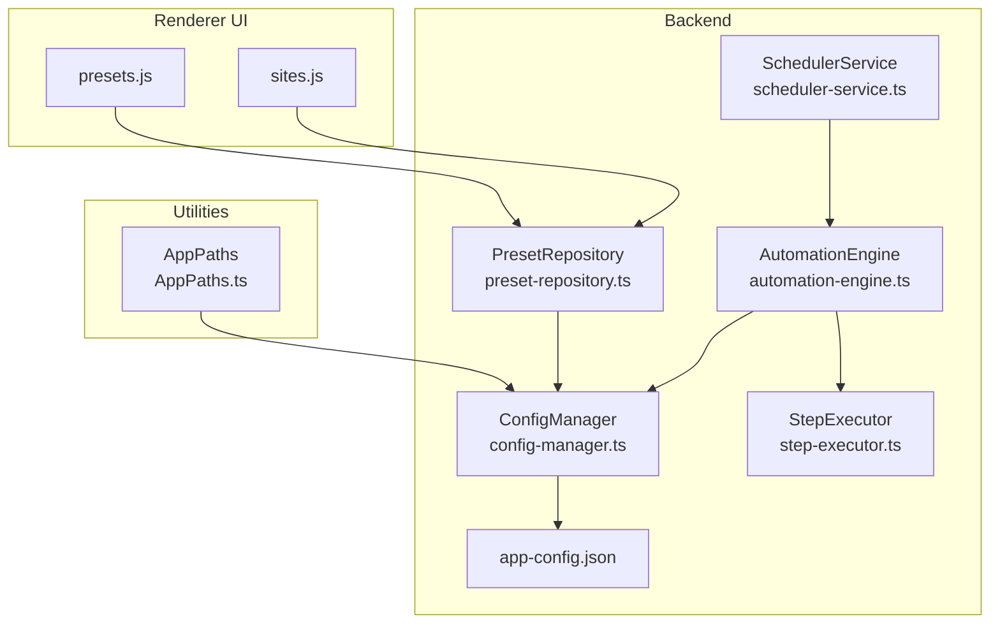
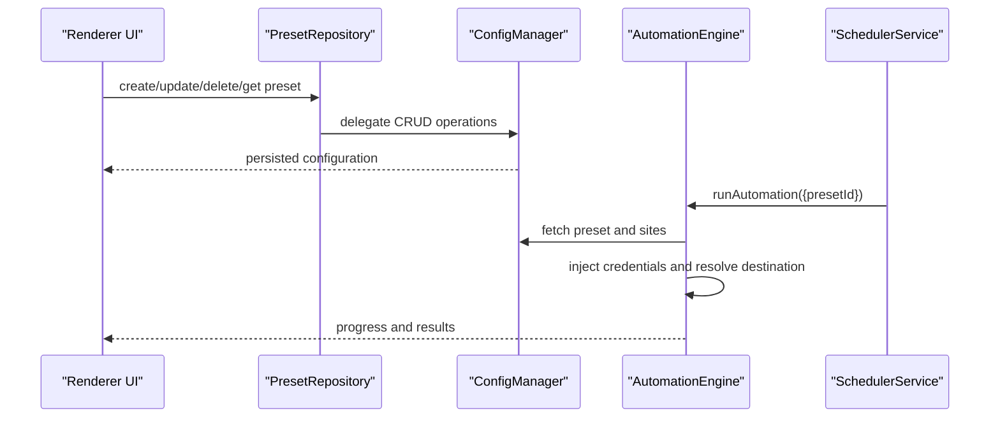
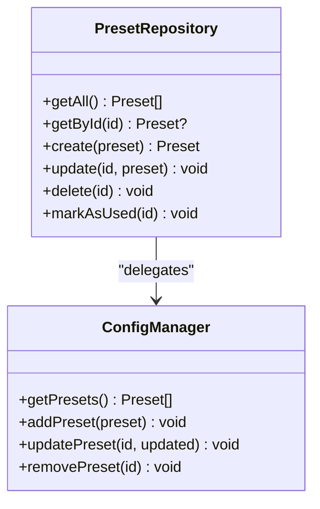
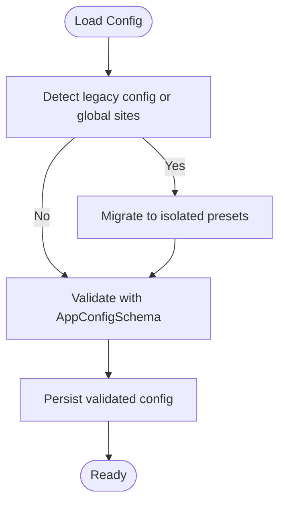
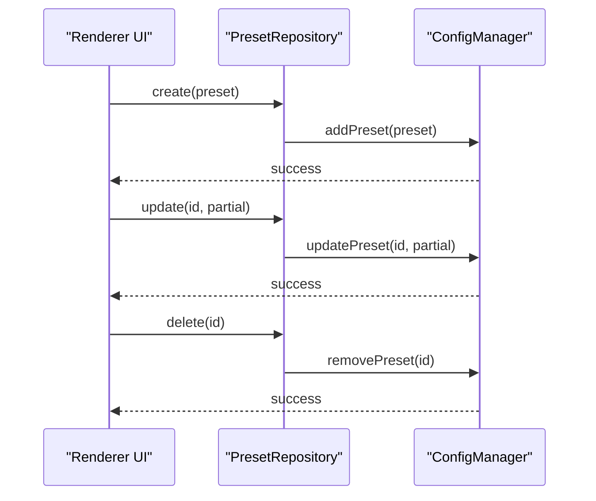
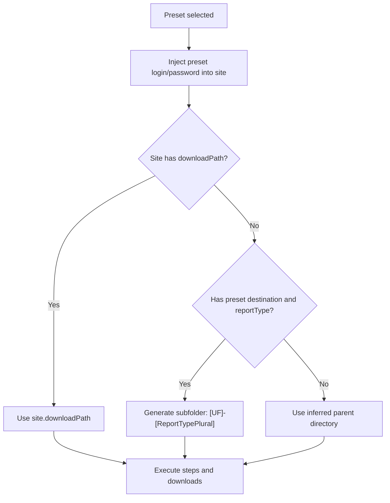
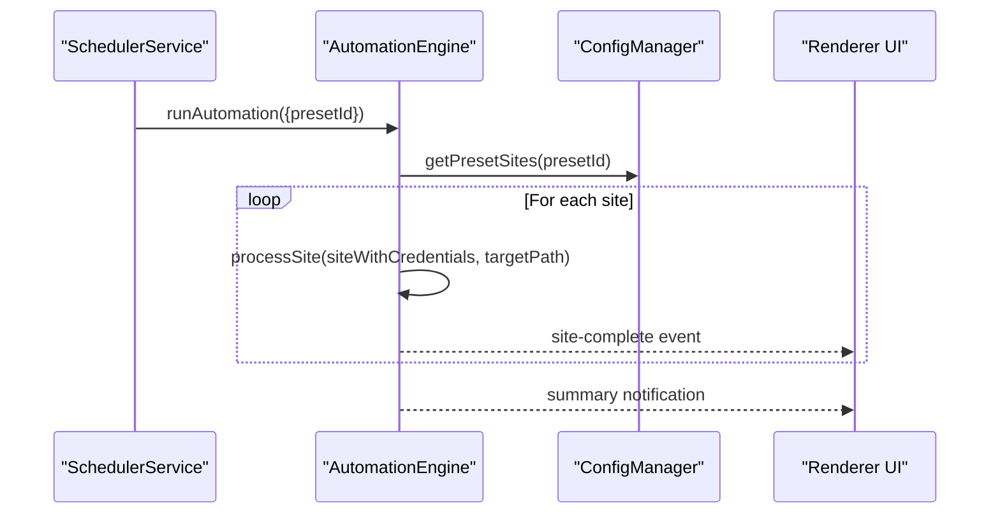
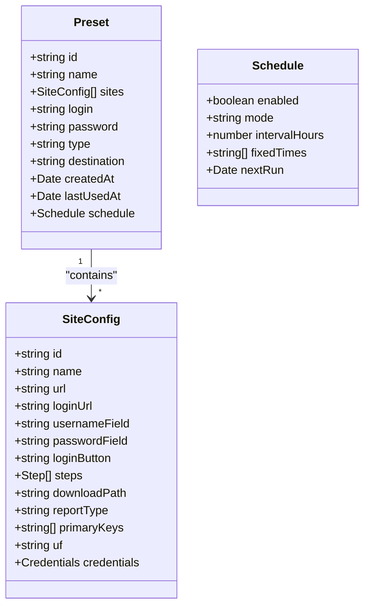
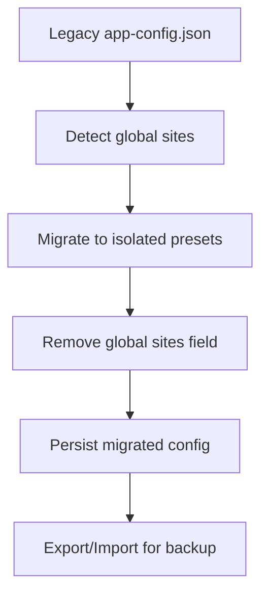
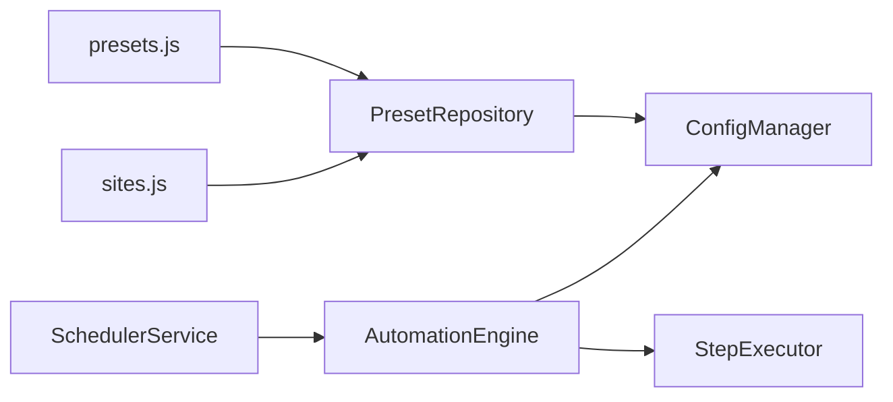

# Preset Management

<cite>
**Referenced Files in This Document**
- [preset-repository.ts](file://app/automation/engine/preset-repository.ts)
- [config-manager.ts](file://app/config/config-manager.ts)
- [app-config.json](file://app/config/app-config.json)
- [scheduler-service.ts](file://app/automation/engine/scheduler-service.ts)
- [automation-engine.ts](file://app/automation/engine/automation-engine.ts)
- [step-executor.ts](file://app/automation/engine/step-executor.ts)
- [sites.js](file://app/renderer/modules/sites.js)
- [presets.js](file://app/renderer/modules/presets.js)
- [AppPaths.ts](file://app/core/utils/AppPaths.ts)
- [MIGRATION_PRESET_ISOLATION.md](file://MIGRATION_PRESET_ISOLATION.md)
- [FASE 6 — PRESETS E CONFIGURAÇÕES.md](file://docs/FASE 6 — PRESETS E CONFIGURAÇÕES.md)
- [schemaMaps.json](file://data/schemaMaps.json)
- [schemaMaps.json](file://app/storage/schemaMaps.json)
</cite>

## Table of Contents
1. [Introduction](#introduction)
2. [Project Structure](#project-structure)
3. [Core Components](#core-components)
4. [Architecture Overview](#architecture-overview)
5. [Detailed Component Analysis](#detailed-component-analysis)
6. [Dependency Analysis](#dependency-analysis)
7. [Performance Considerations](#performance-considerations)
8. [Troubleshooting Guide](#troubleshooting-guide)
9. [Conclusion](#conclusion)
10. [Appendices](#appendices)

## Introduction
This document explains the Preset Management system that powers multi-site automation workflows. It covers the preset repository architecture, isolation mechanisms, configuration inheritance patterns, lifecycle operations (create, modify, delete), preset-to-site mapping, credential injection, destination path resolution, scheduling, validation rules, migration and backup strategies, and the relationship with the broader configuration management system.

## Project Structure
The preset system spans backend configuration, automation engine, and renderer UI modules:
- Backend configuration and persistence: ConfigManager and app-config.json
- Automation engine: preset repository, scheduler, and execution pipeline
- Renderer UI: preset and site management modules
- Path utilities: AppPaths for cross-environment configuration storage

**Diagram sources**
- [presets.js](file://app/renderer/modules/presets.js#L1-L414)
- [sites.js](file://app/renderer/modules/sites.js#L1-L424)
- [config-manager.ts](file://app/config/config-manager.ts#L85-L398)
- [app-config.json](file://app/config/app-config.json#L1-L1521)
- [preset-repository.ts](file://app/automation/engine/preset-repository.ts#L4-L34)
- [automation-engine.ts](file://app/automation/engine/automation-engine.ts#L50-L611)
- [scheduler-service.ts](file://app/automation/engine/scheduler-service.ts#L6-L145)
- [step-executor.ts](file://app/automation/engine/step-executor.ts#L25-L549)
- [AppPaths.ts](file://app/core/utils/AppPaths.ts#L5-L60)

**Section sources**
- [config-manager.ts](file://app/config/config-manager.ts#L85-L398)
- [app-config.json](file://app/config/app-config.json#L1-L1521)
- [preset-repository.ts](file://app/automation/engine/preset-repository.ts#L4-L34)
- [scheduler-service.ts](file://app/automation/engine/scheduler-service.ts#L6-L145)
- [automation-engine.ts](file://app/automation/engine/automation-engine.ts#L50-L611)
- [step-executor.ts](file://app/automation/engine/step-executor.ts#L25-L549)
- [AppPaths.ts](file://app/core/utils/AppPaths.ts#L5-L60)

## Core Components
- PresetRepository: Thin facade over ConfigManager for preset CRUD and usage tracking.
- ConfigManager: Centralized schema-driven configuration manager with Zod validation, migration, and export/import capabilities.
- AutomationEngine: Orchestrates preset-based execution, credential injection, destination resolution, and reporting.
- SchedulerService: Periodic checker that triggers automation runs according to preset schedules.
- Renderer Modules: UI for managing presets and sites, including scheduling and validation feedback.

Key responsibilities:
- Validation and normalization via Zod schemas
- Isolation of sites per preset
- Credential injection into site contexts during execution
- Destination path resolution with auto-folder generation for typed reports
- Export/import of presets and consolidated configuration

**Section sources**
- [preset-repository.ts](file://app/automation/engine/preset-repository.ts#L4-L34)
- [config-manager.ts](file://app/config/config-manager.ts#L35-L78)
- [config-manager.ts](file://app/config/config-manager.ts#L214-L256)
- [automation-engine.ts](file://app/automation/engine/automation-engine.ts#L90-L156)
- [scheduler-service.ts](file://app/automation/engine/scheduler-service.ts#L38-L96)

## Architecture Overview
The preset system follows a layered architecture:
- UI layer (renderer) persists and retrieves presets via IPC handlers exposed by Electron main process.
- Backend layer (main process) manages configuration and exposes APIs to the renderer.
- Automation layer executes preset-defined workflows against isolated site configurations.

**Diagram sources**
- [presets.js](file://app/renderer/modules/presets.js#L154-L208)
- [sites.js](file://app/renderer/modules/sites.js#L247-L327)
- [preset-repository.ts](file://app/automation/engine/preset-repository.ts#L13-L26)
- [config-manager.ts](file://app/config/config-manager.ts#L216-L256)
- [automation-engine.ts](file://app/automation/engine/automation-engine.ts#L62-L238)
- [scheduler-service.ts](file://app/automation/engine/scheduler-service.ts#L38-L96)

## Detailed Component Analysis

### Preset Repository
- Provides CRUD operations delegating to ConfigManager.
- Tracks last-used timestamps for usage analytics.
- Ensures atomic updates and persistence.

**Diagram sources**
- [preset-repository.ts](file://app/automation/engine/preset-repository.ts#L4-L34)
- [config-manager.ts](file://app/config/config-manager.ts#L216-L243)

**Section sources**
- [preset-repository.ts](file://app/automation/engine/preset-repository.ts#L4-L34)

### Configuration Manager and Schemas
- Zod schemas define strict validation for presets and sites.
- Isolation: sites are embedded within each preset; global site lists are deprecated.
- Migration: automatic migration from legacy config and global sites to isolated presets.
- Export/Import: supports backup and restore of presets and configuration.

**Diagram sources**
- [config-manager.ts](file://app/config/config-manager.ts#L133-L190)
- [config-manager.ts](file://app/config/config-manager.ts#L35-L78)
- [MIGRATION_PRESET_ISOLATION.md](file://MIGRATION_PRESET_ISOLATION.md#L1-L242)

**Section sources**
- [config-manager.ts](file://app/config/config-manager.ts#L35-L78)
- [config-manager.ts](file://app/config/config-manager.ts#L133-L190)
- [config-manager.ts](file://app/config/config-manager.ts#L216-L256)
- [config-manager.ts](file://app/config/config-manager.ts#L330-L394)
- [MIGRATION_PRESET_ISOLATION.md](file://MIGRATION_PRESET_ISOLATION.md#L1-L242)

### Preset Lifecycle
- Creation: UI collects preset fields, then saves via IPC; ConfigManager validates and persists.
- Modification: Update fields and save; ConfigManager merges partial updates.
- Deletion: Remove preset; ConfigManager prunes from collection and persists.
- Usage tracking: markAsUsed updates lastUsedAt for analytics.

**Diagram sources**
- [presets.js](file://app/renderer/modules/presets.js#L154-L208)
- [sites.js](file://app/renderer/modules/sites.js#L301-L327)
- [preset-repository.ts](file://app/automation/engine/preset-repository.ts#L13-L26)
- [config-manager.ts](file://app/config/config-manager.ts#L220-L243)

**Section sources**
- [FASE 6 — PRESETS E CONFIGURAÇÕES.md](file://docs/FASE 6 — PRESETS E CONFIGURAÇÕES.md#L1-L15)
- [presets.js](file://app/renderer/modules/presets.js#L154-L208)
- [sites.js](file://app/renderer/modules/sites.js#L301-L327)
- [preset-repository.ts](file://app/automation/engine/preset-repository.ts#L13-L26)
- [config-manager.ts](file://app/config/config-manager.ts#L220-L243)

### Preset-to-Site Mapping and Credential Injection
- Isolation: sites are stored within each preset; AutomationEngine reads sites directly from the preset.
- Credential injection: when a preset is used, its login/password are temporarily injected into the site object for execution.
- Destination resolution: site-specific downloadPath takes precedence; otherwise, preset destination is used. For typed reports, a subfolder is auto-generated based on UF and report type.

**Diagram sources**
- [automation-engine.ts](file://app/automation/engine/automation-engine.ts#L126-L146)
- [step-executor.ts](file://app/automation/engine/step-executor.ts#L402-L511)

**Section sources**
- [automation-engine.ts](file://app/automation/engine/automation-engine.ts#L90-L156)
- [automation-engine.ts](file://app/automation/engine/automation-engine.ts#L135-L146)
- [step-executor.ts](file://app/automation/engine/step-executor.ts#L402-L511)

### Scheduling and Multi-Site Execution
- SchedulerService periodically checks preset schedules and triggers AutomationEngine when due.
- AutomationEngine runs all sites within a preset; each site receives its own session and progress events.
- UI receives real-time updates for each site completion.

**Diagram sources**
- [scheduler-service.ts](file://app/automation/engine/scheduler-service.ts#L38-L96)
- [automation-engine.ts](file://app/automation/engine/automation-engine.ts#L62-L238)
- [config-manager.ts](file://app/config/config-manager.ts#L260-L263)

**Section sources**
- [scheduler-service.ts](file://app/automation/engine/scheduler-service.ts#L38-L142)
- [automation-engine.ts](file://app/automation/engine/automation-engine.ts#L62-L238)

### Validation Rules and Inheritance Patterns
- Preset schema enforces required fields and defaults for optional properties.
- Site schema validates selectors, steps, and report metadata.
- Inheritance patterns:
  - Site inherits default timeouts, retries, and delays from global config.
  - Report type and primary keys enable Safe Snapshot Policy (SSP) validation and naming.
  - Auto-folder generation for typed reports depends on UF and reportType.

**Diagram sources**
- [config-manager.ts](file://app/config/config-manager.ts#L35-L53)
- [config-manager.ts](file://app/config/config-manager.ts#L7-L33)

**Section sources**
- [config-manager.ts](file://app/config/config-manager.ts#L35-L53)
- [config-manager.ts](file://app/config/config-manager.ts#L7-L33)
- [app-config.json](file://app/config/app-config.json#L1-L1521)

### Migration, Backup, and Relationship to Configuration Management
- Migration: automatic conversion from legacy global sites to isolated presets; removal of global sites list.
- Backup/Restore: export/import of entire configuration preserves presets and settings.
- Path management: AppPaths centralizes configuration and data paths across environments.

**Diagram sources**
- [config-manager.ts](file://app/config/config-manager.ts#L133-L190)
- [config-manager.ts](file://app/config/config-manager.ts#L330-L394)
- [MIGRATION_PRESET_ISOLATION.md](file://MIGRATION_PRESET_ISOLATION.md#L1-L242)
- [AppPaths.ts](file://app/core/utils/AppPaths.ts#L11-L21)

**Section sources**
- [config-manager.ts](file://app/config/config-manager.ts#L133-L190)
- [config-manager.ts](file://app/config/config-manager.ts#L330-L394)
- [MIGRATION_PRESET_ISOLATION.md](file://MIGRATION_PRESET_ISOLATION.md#L1-L242)
- [AppPaths.ts](file://app/core/utils/AppPaths.ts#L11-L21)

## Dependency Analysis
- PresetRepository depends on ConfigManager for persistence.
- AutomationEngine depends on ConfigManager for preset/site retrieval and on StepExecutor for step execution.
- SchedulerService orchestrates AutomationEngine based on preset schedules.
- Renderer modules (presets.js, sites.js) communicate with main process via IPC to manage presets and sites.

**Diagram sources**
- [preset-repository.ts](file://app/automation/engine/preset-repository.ts#L1-L34)
- [config-manager.ts](file://app/config/config-manager.ts#L85-L398)
- [automation-engine.ts](file://app/automation/engine/automation-engine.ts#L50-L611)
- [step-executor.ts](file://app/automation/engine/step-executor.ts#L25-L549)
- [scheduler-service.ts](file://app/automation/engine/scheduler-service.ts#L6-L145)
- [presets.js](file://app/renderer/modules/presets.js#L1-L414)
- [sites.js](file://app/renderer/modules/sites.js#L1-L424)

**Section sources**
- [preset-repository.ts](file://app/automation/engine/preset-repository.ts#L1-L34)
- [config-manager.ts](file://app/config/config-manager.ts#L85-L398)
- [automation-engine.ts](file://app/automation/engine/automation-engine.ts#L50-L611)
- [step-executor.ts](file://app/automation/engine/step-executor.ts#L25-L549)
- [scheduler-service.ts](file://app/automation/engine/scheduler-service.ts#L6-L145)
- [presets.js](file://app/renderer/modules/presets.js#L1-L414)
- [sites.js](file://app/renderer/modules/sites.js#L1-L424)

## Performance Considerations
- Isolated presets reduce cross-preset interference and simplify maintenance.
- SchedulerService runs periodic checks; ensure intervals balance responsiveness and resource usage.
- StepExecutor creates directories before downloads to avoid runtime errors and improve reliability.
- AutomationEngine enforces a global timeout to prevent long-running hangs.

[No sources needed since this section provides general guidance]

## Troubleshooting Guide
Common issues and resolutions:
- Preset not found: Verify presetId exists in app-config.json and ConfigManager.presets.
- No sites configured: AutomationEngine throws when a preset has no sites; configure sites under the preset.
- Invalid report configuration: If reportType is set, primaryKeys must be provided; otherwise, execution is blocked.
- Destination path issues: Ensure destination exists or allow auto-folder generation for typed reports.
- Scheduler disabled: Check global schedulerEnabled flag; when false, no automated runs occur.
- Export/Import failures: Validate exported data structure and ensure config is present.

**Section sources**
- [automation-engine.ts](file://app/automation/engine/automation-engine.ts#L101-L104)
- [automation-engine.ts](file://app/automation/engine/automation-engine.ts#L265-L268)
- [scheduler-service.ts](file://app/automation/engine/scheduler-service.ts#L53-L57)
- [config-manager.ts](file://app/config/config-manager.ts#L353-L394)

## Conclusion
The Preset Management system provides a robust, schema-driven framework for organizing automation workflows. Its isolation model, validation rules, and integration with scheduling and execution engines enable scalable, maintainable multi-site automation. Migration and export/import features support operational continuity and disaster recovery.

[No sources needed since this section summarizes without analyzing specific files]

## Appendices

### Example Preset Configuration
- Name, login, password, type, destination, schedule, and embedded sites.
- See sample presets in app-config.json for structure and fields.

**Section sources**
- [app-config.json](file://app/config/app-config.json#L7-L744)
- [app-config.json](file://app/config/app-config.json#L745-L1508)

### Multi-Site Execution with Presets
- Select a preset; AutomationEngine loads its sites and executes sequentially.
- Progress and results are emitted per site and summarized at the end.

**Section sources**
- [automation-engine.ts](file://app/automation/engine/automation-engine.ts#L124-L195)

### Preset Validation Rules
- Required fields: name, login, password.
- Optional fields: type, destination, schedule with mode and interval/fixedTimes.
- Site-level validations: selectors, step types, reportType requires primaryKeys.

**Section sources**
- [config-manager.ts](file://app/config/config-manager.ts#L35-L53)
- [config-manager.ts](file://app/config/config-manager.ts#L7-L33)

### Migration and Backup Strategies
- Automatic migration from legacy config and global sites to isolated presets.
- Export/import for backup and restoration; AppPaths ensures correct storage locations.

**Section sources**
- [config-manager.ts](file://app/config/config-manager.ts#L133-L190)
- [config-manager.ts](file://app/config/config-manager.ts#L330-L394)
- [MIGRATION_PRESET_ISOLATION.md](file://MIGRATION_PRESET_ISOLATION.md#L1-L242)
- [AppPaths.ts](file://app/core/utils/AppPaths.ts#L11-L21)