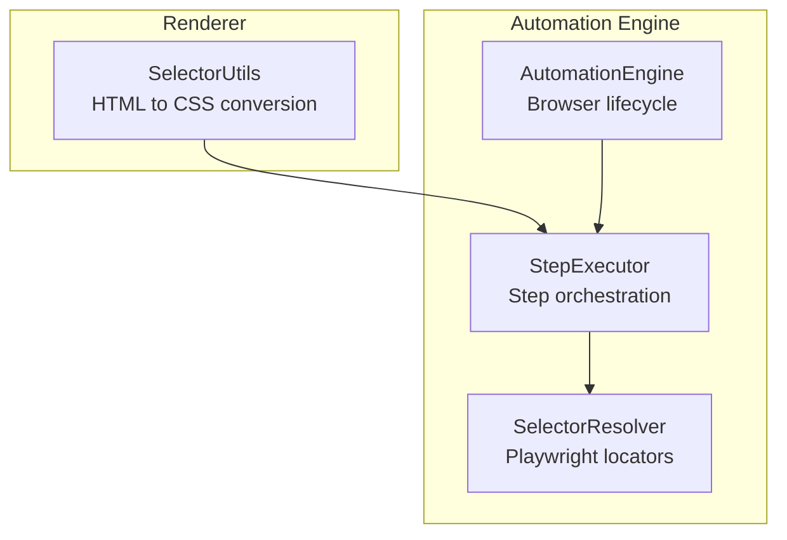
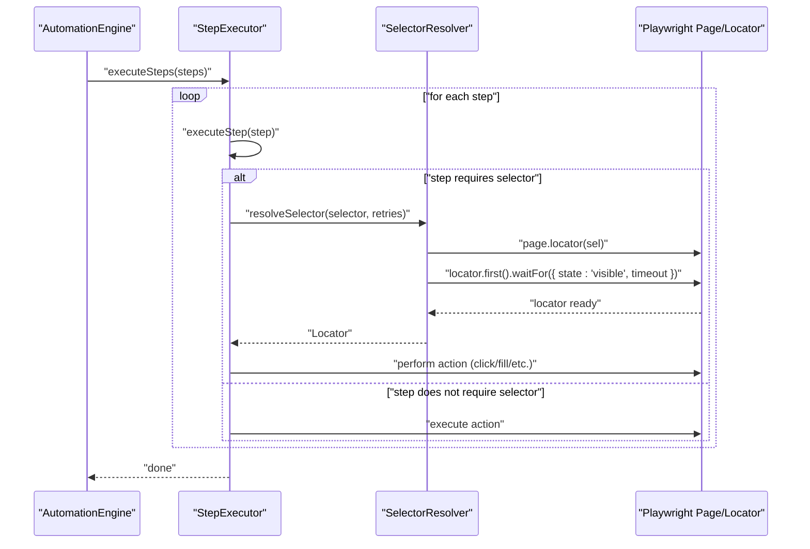
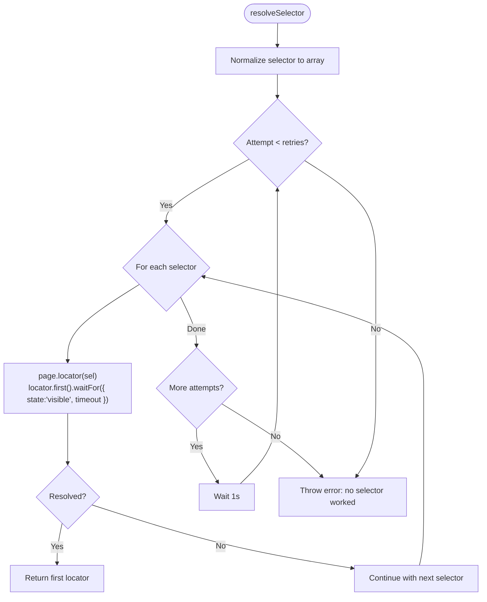
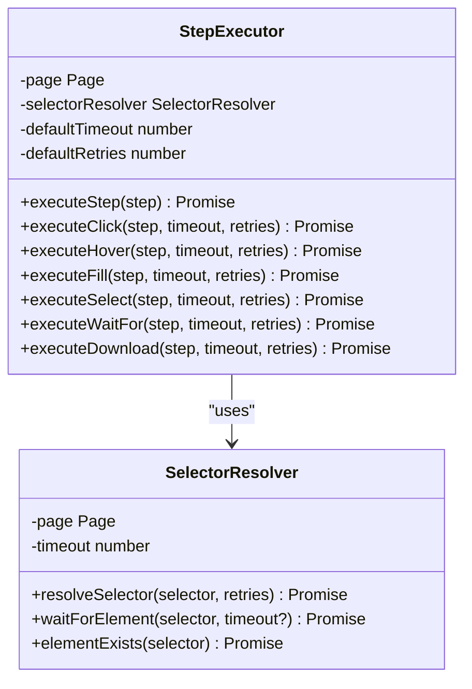
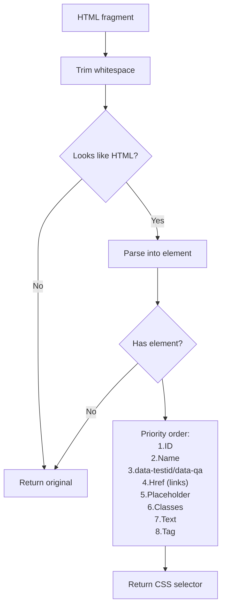
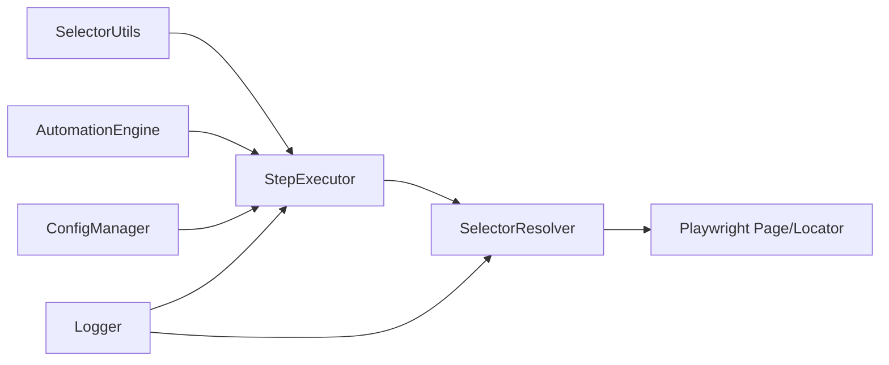

# Selector Resolution

<cite>
**Referenced Files in This Document**
- [selector-resolver.ts](file://app/automation/engine/selector-resolver.ts)
- [step-executor.ts](file://app/automation/engine/step-executor.ts)
- [automation-engine.ts](file://app/automation/engine/automation-engine.ts)
- [selector-utils.js](file://app/renderer/selector-utils.js)
- [config-manager.ts](file://app/config/config-manager.ts)
- [logger.ts](file://app/config/logger.ts)
</cite>

## Table of Contents
1. [Introduction](#introduction)
2. [Project Structure](#project-structure)
3. [Core Components](#core-components)
4. [Architecture Overview](#architecture-overview)
5. [Detailed Component Analysis](#detailed-component-analysis)
6. [Dependency Analysis](#dependency-analysis)
7. [Performance Considerations](#performance-considerations)
8. [Troubleshooting Guide](#troubleshooting-guide)
9. [Conclusion](#conclusion)

## Introduction
This document explains the Selector Resolution system used by the automation engine. It covers how selectors are resolved, validated, and executed during step execution, including fallback strategies, timeout management, and dynamic selector generation. It also documents supported selector types, error handling, and debugging approaches for selector failures.

## Project Structure
The Selector Resolution system spans both backend automation logic and frontend utilities:
- Backend: selector resolution and step execution orchestration
- Frontend: selector generation from HTML fragments

**Diagram sources**
- [selector-utils.js](file://app/renderer/selector-utils.js#L1-L119)
- [selector-resolver.ts](file://app/automation/engine/selector-resolver.ts#L1-L135)
- [step-executor.ts](file://app/automation/engine/step-executor.ts#L1-L549)
- [automation-engine.ts](file://app/automation/engine/automation-engine.ts#L1-L611)

**Section sources**
- [selector-resolver.ts](file://app/automation/engine/selector-resolver.ts#L1-L135)
- [step-executor.ts](file://app/automation/engine/step-executor.ts#L1-L549)
- [automation-engine.ts](file://app/automation/engine/automation-engine.ts#L1-L611)
- [selector-utils.js](file://app/renderer/selector-utils.js#L1-L119)

## Core Components
- SelectorResolver: central component that resolves Playwright selectors, validates visibility, and manages retries and timeouts.
- StepExecutor: orchestrates step execution and delegates selector resolution to SelectorResolver.
- SelectorUtils (frontend): converts HTML snippets into CSS selectors for convenience.
- ConfigManager: defines supported selector types and validation rules for steps.
- Logger: provides structured logging for selector resolution attempts and failures.

**Section sources**
- [selector-resolver.ts](file://app/automation/engine/selector-resolver.ts#L4-L135)
- [step-executor.ts](file://app/automation/engine/step-executor.ts#L25-L110)
- [selector-utils.js](file://app/renderer/selector-utils.js#L4-L119)
- [config-manager.ts](file://app/config/config-manager.ts#L8-L33)
- [logger.ts](file://app/config/logger.ts#L62-L82)

## Architecture Overview
Selector resolution is integrated into the step execution pipeline. Steps that require UI interaction pass their selectors to SelectorResolver, which ensures elements exist and are visible before returning a locator. The system supports arrays of selectors to enable fallback strategies.

**Diagram sources**
- [automation-engine.ts](file://app/automation/engine/automation-engine.ts#L516-L533)
- [step-executor.ts](file://app/automation/engine/step-executor.ts#L59-L110)
- [selector-resolver.ts](file://app/automation/engine/selector-resolver.ts#L17-L48)

## Detailed Component Analysis

### SelectorResolver
SelectorResolver encapsulates selector resolution logic:
- Accepts a single selector or an array of selectors
- Iterates through selectors and retries up to a configured number of attempts
- Uses Playwright’s locator API and waits for visibility
- Provides helpers for existence checks, waiting, text/attribute extraction, visibility checks, and element counting

Key behaviors:
- Retry loop: outer loop over attempts, inner loop over selectors
- Visibility wait: waits for the first matching element to become visible
- Timeout distribution: divides the configured timeout among multiple selectors
- Logging: logs attempts and failures for debugging

**Diagram sources**
- [selector-resolver.ts](file://app/automation/engine/selector-resolver.ts#L17-L48)

**Section sources**
- [selector-resolver.ts](file://app/automation/engine/selector-resolver.ts#L17-L48)
- [selector-resolver.ts](file://app/automation/engine/selector-resolver.ts#L71-L78)
- [selector-resolver.ts](file://app/automation/engine/selector-resolver.ts#L83-L94)
- [selector-resolver.ts](file://app/automation/engine/selector-resolver.ts#L99-L110)
- [selector-resolver.ts](file://app/automation/engine/selector-resolver.ts#L115-L122)
- [selector-resolver.ts](file://app/automation/engine/selector-resolver.ts#L127-L134)

### StepExecutor Integration
StepExecutor coordinates actions and delegates selector resolution:
- Click, hover, fill, select, fillDateRange, and download steps rely on SelectorResolver
- Supports per-step timeout and retries
- Provides waitFor step that uses SelectorResolver to wait for visibility
- Handles special cases like date range filling and download target handling

**Diagram sources**
- [step-executor.ts](file://app/automation/engine/step-executor.ts#L25-L110)
- [selector-resolver.ts](file://app/automation/engine/selector-resolver.ts#L4-L11)

**Section sources**
- [step-executor.ts](file://app/automation/engine/step-executor.ts#L149-L170)
- [step-executor.ts](file://app/automation/engine/step-executor.ts#L172-L186)
- [step-executor.ts](file://app/automation/engine/step-executor.ts#L191-L209)
- [step-executor.ts](file://app/automation/engine/step-executor.ts#L388-L395)
- [step-executor.ts](file://app/automation/engine/step-executor.ts#L419-L430)

### Selector Types and Validation
Supported selector types:
- CSS selectors: standard CSS selectors
- Playwright selectors: Playwright-specific pseudo-selectors and attributes
- XPath: supported by Playwright’s locator API
- Arrays of selectors: enables fallback strategies

Validation and schema:
- Steps support either a single selector string or an array of selectors
- ConfigManager enforces selector typing and optional fields

**Section sources**
- [config-manager.ts](file://app/config/config-manager.ts#L16-L23)
- [config-manager.ts](file://app/config/config-manager.ts#L8-L33)

### Dynamic Selector Generation (Frontend)
SelectorUtils converts HTML snippets into CSS selectors:
- Converts HTML fragments into CSS selectors prioritizing ID, name, data-testid/data-qa, href, placeholder, classes, text, and tag fallback
- Applies intelligent heuristics for modern web apps
- Provides auto-conversion on paste/blur events

**Diagram sources**
- [selector-utils.js](file://app/renderer/selector-utils.js#L10-L93)

**Section sources**
- [selector-utils.js](file://app/renderer/selector-utils.js#L10-L115)

### Timeout Management and Retries
- SelectorResolver distributes timeout across multiple selectors and retries
- StepExecutor passes per-step timeout/retries to SelectorResolver
- Global timeouts and delays are managed by AutomationEngine and StepExecutor

**Section sources**
- [selector-resolver.ts](file://app/automation/engine/selector-resolver.ts#L27-L30)
- [step-executor.ts](file://app/automation/engine/step-executor.ts#L68-L69)
- [step-executor.ts](file://app/automation/engine/step-executor.ts#L538-L541)

### Error Handling and Missing Elements
- SelectorResolver throws a descriptive error when no selector works after retries
- StepExecutor wraps errors and supports continueOnError per step
- Logging captures attempts and failures for debugging

**Section sources**
- [selector-resolver.ts](file://app/automation/engine/selector-resolver.ts#L47-L48)
- [step-executor.ts](file://app/automation/engine/step-executor.ts#L102-L109)
- [logger.ts](file://app/config/logger.ts#L62-L82)

### Complex Scenarios and Optimization
- Fallback arrays: supply multiple selectors to increase robustness
- Date range filling: supports multiple selectors for start/end inputs
- Download handling: removes target="_blank" to keep downloads in-page
- Visibility-first resolution: ensures elements are visible before interaction

**Section sources**
- [step-executor.ts](file://app/automation/engine/step-executor.ts#L237-L260)
- [step-executor.ts](file://app/automation/engine/step-executor.ts#L419-L426)

## Dependency Analysis
Selector resolution depends on Playwright’s locator API and integrates tightly with StepExecutor and AutomationEngine. Frontend utilities feed human-friendly selectors into the system.

**Diagram sources**
- [selector-utils.js](file://app/renderer/selector-utils.js#L1-L119)
- [step-executor.ts](file://app/automation/engine/step-executor.ts#L1-L549)
- [selector-resolver.ts](file://app/automation/engine/selector-resolver.ts#L1-L135)
- [automation-engine.ts](file://app/automation/engine/automation-engine.ts#L1-L611)
- [config-manager.ts](file://app/config/config-manager.ts#L1-L408)
- [logger.ts](file://app/config/logger.ts#L1-L104)

**Section sources**
- [step-executor.ts](file://app/automation/engine/step-executor.ts#L25-L44)
- [selector-resolver.ts](file://app/automation/engine/selector-resolver.ts#L1-L11)
- [automation-engine.ts](file://app/automation/engine/automation-engine.ts#L324-L331)

## Performance Considerations
- Prefer CSS selectors over XPath for performance
- Use minimal specificity to reduce matcher overhead
- Limit retries and timeouts to reasonable values
- Use fallback arrays sparingly to avoid excessive waits
- Ensure elements are visible before interaction to prevent retries

[No sources needed since this section provides general guidance]

## Troubleshooting Guide
Common issues and resolutions:
- Selector not found: verify selector correctness; use fallback arrays; enable logging to inspect attempts
- Element not visible: adjust timeout/retries; ensure page state is ready; consider waitFor step
- Dynamic content: use waitForElement or increase retries; consider visibility-first waits
- XPath vs CSS: prefer CSS; if XPath is required, ensure it is precise
- Debugging: review automation logs for selector attempts and failures; capture screenshots on error

**Section sources**
- [selector-resolver.ts](file://app/automation/engine/selector-resolver.ts#L23-L37)
- [step-executor.ts](file://app/automation/engine/step-executor.ts#L388-L395)
- [logger.ts](file://app/config/logger.ts#L62-L82)

## Conclusion
The Selector Resolution system provides robust, resilient selector handling with fallback strategies, visibility-first waits, and comprehensive logging. It integrates tightly with the step execution pipeline and supports both CSS and Playwright selectors, enabling reliable automation across diverse web applications.