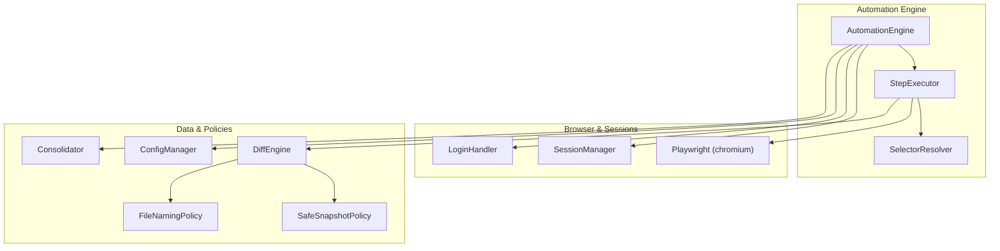
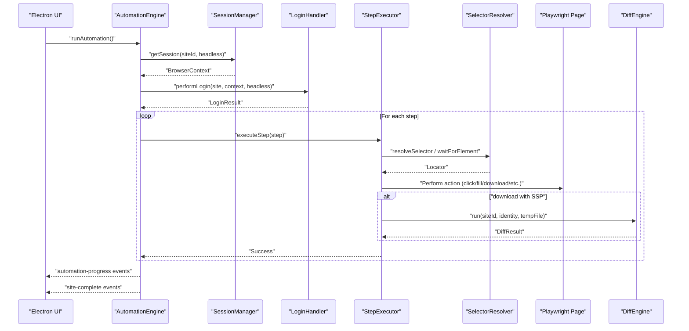
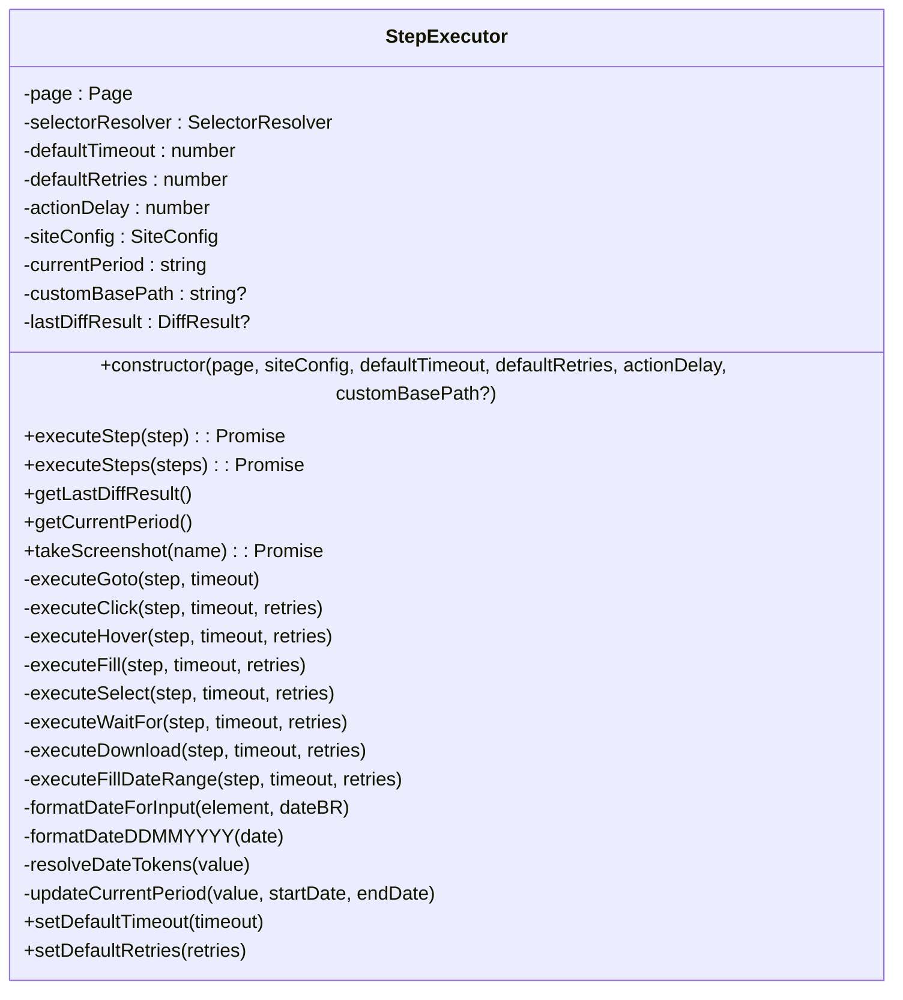
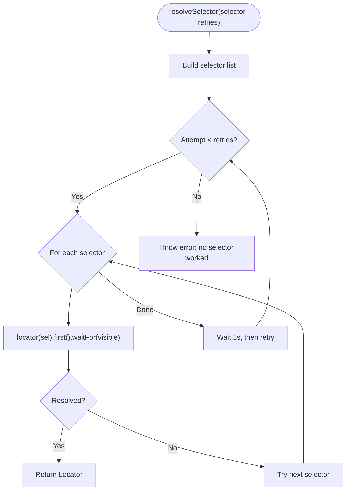
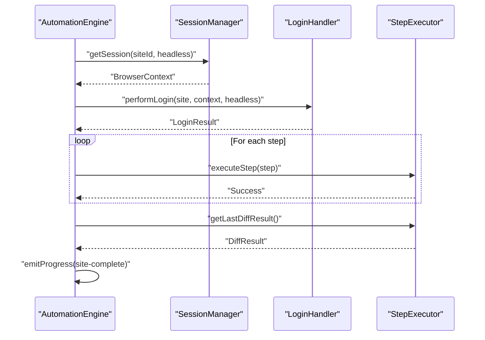
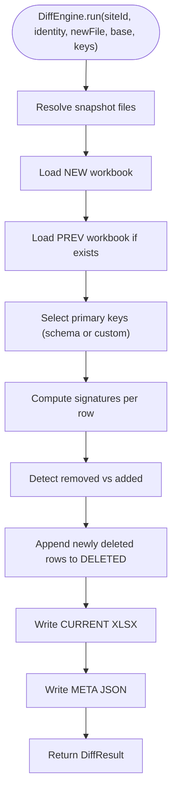
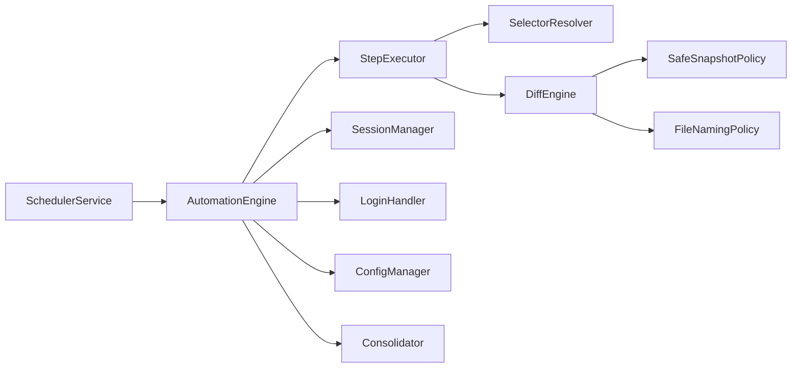

# Step Execution System

<cite>
**Referenced Files in This Document**
- [step-executor.ts](file://app/automation/engine/step-executor.ts)
- [automation-engine.ts](file://app/automation/engine/automation-engine.ts)
- [selector-resolver.ts](file://app/automation/engine/selector-resolver.ts)
- [scheduler-service.ts](file://app/automation/engine/scheduler-service.ts)
- [config-manager.ts](file://app/config/config-manager.ts)
- [session-manager.ts](file://app/automation/sessions/session-manager.ts)
- [login-handler.ts](file://app/automation/sessions/login-handler.ts)
- [DiffEngine.ts](file://app/core/diff/DiffEngine.ts)
- [SafeSnapshotPolicy.ts](file://app/policy/snapshot/SafeSnapshotPolicy.ts)
- [FileNamingPolicy.ts](file://app/policy/snapshot/FileNamingPolicy.ts)
- [Consolidator.ts](file://app/core/consolidation/Consolidator.ts)
- [logger.ts](file://app/config/logger.ts)
- [app-config.json](file://app/config/app-config.json)
</cite>

## Table of Contents
1. [Introduction](#introduction)
2. [Project Structure](#project-structure)
3. [Core Components](#core-components)
4. [Architecture Overview](#architecture-overview)
5. [Detailed Component Analysis](#detailed-component-analysis)
6. [Dependency Analysis](#dependency-analysis)
7. [Performance Considerations](#performance-considerations)
8. [Troubleshooting Guide](#troubleshooting-guide)
9. [Conclusion](#conclusion)
10. [Appendices](#appendices)

## Introduction
This document explains the Step Execution System that powers automated browser workflows. It covers the step executor architecture, supported step types, execution lifecycle, retry and timeout mechanisms, error recovery, validation, parameter handling, result tracking, step chaining, conditional execution, progress reporting, integration with Playwright, and screenshot capture for debugging. It also documents the Safe Snapshot Policy (SSP) integration for intelligent download handling and consolidated reporting.

## Project Structure
The Step Execution System is centered around the Step Executor and its orchestration by the Automation Engine. Supporting components include Selector Resolution, Session Management, Login Handling, Diff Engine, and Consolidation.

**Diagram sources**
- [automation-engine.ts](file://app/automation/engine/automation-engine.ts#L50-L608)
- [step-executor.ts](file://app/automation/engine/step-executor.ts#L25-L549)
- [selector-resolver.ts](file://app/automation/engine/selector-resolver.ts#L4-L135)
- [session-manager.ts](file://app/automation/sessions/session-manager.ts#L67-L225)
- [login-handler.ts](file://app/automation/sessions/login-handler.ts#L13-L364)
- [config-manager.ts](file://app/config/config-manager.ts#L85-L408)
- [DiffEngine.ts](file://app/core/diff/DiffEngine.ts#L23-L230)
- [SafeSnapshotPolicy.ts](file://app/policy/snapshot/SafeSnapshotPolicy.ts#L3-L25)
- [FileNamingPolicy.ts](file://app/policy/snapshot/FileNamingPolicy.ts#L23-L35)
- [Consolidator.ts](file://app/core/consolidation/Consolidator.ts#L20-L138)

**Section sources**
- [automation-engine.ts](file://app/automation/engine/automation-engine.ts#L50-L608)
- [step-executor.ts](file://app/automation/engine/step-executor.ts#L25-L549)
- [selector-resolver.ts](file://app/automation/engine/selector-resolver.ts#L4-L135)
- [session-manager.ts](file://app/automation/sessions/session-manager.ts#L67-L225)
- [login-handler.ts](file://app/automation/sessions/login-handler.ts#L13-L364)
- [config-manager.ts](file://app/config/config-manager.ts#L85-L408)
- [DiffEngine.ts](file://app/core/diff/DiffEngine.ts#L23-L230)
- [SafeSnapshotPolicy.ts](file://app/policy/snapshot/SafeSnapshotPolicy.ts#L3-L25)
- [FileNamingPolicy.ts](file://app/policy/snapshot/FileNamingPolicy.ts#L23-L35)
- [Consolidator.ts](file://app/core/consolidation/Consolidator.ts#L20-L138)

## Core Components
- StepExecutor: Executes individual steps against a Playwright Page, handles retries, timeouts, and special behaviors (e.g., date token resolution, download with SSP).
- SelectorResolver: Resolves and waits for locators with retry logic and timeout distribution across multiple selectors.
- AutomationEngine: Orchestrates browser sessions, login, step execution, progress reporting, and post-processing (SSP and consolidation).
- SessionManager: Manages persistent browser contexts per site to preserve cookies and state.
- LoginHandler: Performs automatic login, detects CAPTCHA, and handles session expiration.
- DiffEngine: Compares downloaded data with previous snapshots, generates diffs, and updates metadata.
- SafeSnapshotPolicy and FileNamingPolicy: Define schema maps and file naming conventions for SSP.
- Consolidator: Merges multiple snapshot outputs into master consolidated files.
- ConfigManager: Validates and manages presets, sites, and global configuration.
- Logger: Provides structured logging across automation, sessions, and general application logs.

**Section sources**
- [step-executor.ts](file://app/automation/engine/step-executor.ts#L25-L549)
- [selector-resolver.ts](file://app/automation/engine/selector-resolver.ts#L4-L135)
- [automation-engine.ts](file://app/automation/engine/automation-engine.ts#L50-L608)
- [session-manager.ts](file://app/automation/sessions/session-manager.ts#L67-L225)
- [login-handler.ts](file://app/automation/sessions/login-handler.ts#L13-L364)
- [DiffEngine.ts](file://app/core/diff/DiffEngine.ts#L23-L230)
- [SafeSnapshotPolicy.ts](file://app/policy/snapshot/SafeSnapshotPolicy.ts#L3-L25)
- [FileNamingPolicy.ts](file://app/policy/snapshot/FileNamingPolicy.ts#L23-L35)
- [Consolidator.ts](file://app/core/consolidation/Consolidator.ts#L20-L138)
- [config-manager.ts](file://app/config/config-manager.ts#L85-L408)
- [logger.ts](file://app/config/logger.ts#L15-L104)

## Architecture Overview
The system follows a layered architecture:
- Presentation/UI: Electron window receives progress events and displays status.
- Orchestration: AutomationEngine coordinates sessions, login, and step execution.
- Execution: StepExecutor executes steps against Playwright pages.
- Resilience: SelectorResolver retries and waits; StepExecutor applies timeouts and retries; LoginHandler handles session recovery.
- Data: DiffEngine and Consolidator manage snapshot comparison and aggregation.

**Diagram sources**
- [automation-engine.ts](file://app/automation/engine/automation-engine.ts#L262-L446)
- [step-executor.ts](file://app/automation/engine/step-executor.ts#L59-L110)
- [selector-resolver.ts](file://app/automation/engine/selector-resolver.ts#L17-L48)
- [login-handler.ts](file://app/automation/sessions/login-handler.ts#L28-L77)
- [DiffEngine.ts](file://app/core/diff/DiffEngine.ts#L55-L219)

## Detailed Component Analysis

### StepExecutor
Responsibilities:
- Execute a single step or a sequence of steps.
- Apply default and per-step timeouts and retries.
- Handle step-specific actions: navigation, clicking, hovering, filling, selecting, waiting, and downloading.
- Integrate with SelectorResolver for robust element resolution.
- Capture screenshots on errors for debugging.
- Track last diff result and current period for SSP.

Key behaviors:
- Delay between actions configurable globally.
- Per-step continueOnError flag allows soft failures.
- Date token resolution for fillDateRange and fill.
- Intelligent download handling with SSP-aware naming and diff processing.
- Period detection for SSP reporting.

**Diagram sources**
- [step-executor.ts](file://app/automation/engine/step-executor.ts#L25-L549)

**Section sources**
- [step-executor.ts](file://app/automation/engine/step-executor.ts#L25-L549)

### SelectorResolver
Responsibilities:
- Resolve a single or multiple selectors with retries.
- Wait for element visibility with distributed timeouts.
- Provide helpers for existence checks, text extraction, attributes, visibility, and counts.

**Diagram sources**
- [selector-resolver.ts](file://app/automation/engine/selector-resolver.ts#L17-L48)

**Section sources**
- [selector-resolver.ts](file://app/automation/engine/selector-resolver.ts#L4-L135)

### AutomationEngine
Responsibilities:
- Initialize browser contexts and handle sessions.
- Perform login or manual intervention for CAPTCHA.
- Execute site steps with progress reporting.
- Handle session expiration and re-authentication.
- Aggregate results, trigger SSP diff, and consolidate outputs.
- Manage scheduling and global timeouts.

**Diagram sources**
- [automation-engine.ts](file://app/automation/engine/automation-engine.ts#L262-L446)
- [login-handler.ts](file://app/automation/sessions/login-handler.ts#L28-L77)
- [step-executor.ts](file://app/automation/engine/step-executor.ts#L516-L533)

**Section sources**
- [automation-engine.ts](file://app/automation/engine/automation-engine.ts#L50-L608)

### DiffEngine and SSP Integration
Responsibilities:
- Compare new download with previous snapshot.
- Compute added/removed rows using primary keys or schema-defined keys.
- Maintain CURRENT, DELETED, and META files.
- Trigger Consolidator for master snapshots.

**Diagram sources**
- [DiffEngine.ts](file://app/core/diff/DiffEngine.ts#L55-L219)
- [SafeSnapshotPolicy.ts](file://app/policy/snapshot/SafeSnapshotPolicy.ts#L3-L25)
- [FileNamingPolicy.ts](file://app/policy/snapshot/FileNamingPolicy.ts#L23-L35)

**Section sources**
- [DiffEngine.ts](file://app/core/diff/DiffEngine.ts#L23-L230)
- [SafeSnapshotPolicy.ts](file://app/policy/snapshot/SafeSnapshotPolicy.ts#L3-L25)
- [FileNamingPolicy.ts](file://app/policy/snapshot/FileNamingPolicy.ts#L23-L35)

### SchedulerService
Responsibilities:
- Monitor scheduled presets and trigger automation runs.
- Handle busy-state watchdog and next-run calculations.
- Pause/resume scheduling globally.

**Section sources**
- [scheduler-service.ts](file://app/automation/engine/scheduler-service.ts#L6-L145)

### Configuration and Validation
- ConfigManager validates and manages presets, sites, and global settings.
- Zod schemas enforce strict typing and defaults.
- Path resolution and migration logic for legacy configurations.

**Section sources**
- [config-manager.ts](file://app/config/config-manager.ts#L85-L408)
- [app-config.json](file://app/config/app-config.json#L1-L800)

### Logging
- Structured Winston logs with daily rotation.
- Separate loggers for automation and sessions.

**Section sources**
- [logger.ts](file://app/config/logger.ts#L15-L104)

## Dependency Analysis
High-level dependencies:
- AutomationEngine depends on SessionManager, LoginHandler, StepExecutor, ConfigManager, and Consolidator.
- StepExecutor depends on SelectorResolver, Playwright Page, and DiffEngine for SSP.
- DiffEngine depends on SafeSnapshotPolicy and FileNamingPolicy.
- SchedulerService depends on AutomationEngine and ConfigManager.

**Diagram sources**
- [automation-engine.ts](file://app/automation/engine/automation-engine.ts#L50-L608)
- [step-executor.ts](file://app/automation/engine/step-executor.ts#L25-L549)
- [selector-resolver.ts](file://app/automation/engine/selector-resolver.ts#L4-L135)
- [DiffEngine.ts](file://app/core/diff/DiffEngine.ts#L23-L230)
- [SafeSnapshotPolicy.ts](file://app/policy/snapshot/SafeSnapshotPolicy.ts#L3-L25)
- [FileNamingPolicy.ts](file://app/policy/snapshot/FileNamingPolicy.ts#L23-L35)
- [scheduler-service.ts](file://app/automation/engine/scheduler-service.ts#L6-L145)

**Section sources**
- [automation-engine.ts](file://app/automation/engine/automation-engine.ts#L50-L608)
- [step-executor.ts](file://app/automation/engine/step-executor.ts#L25-L549)
- [DiffEngine.ts](file://app/core/diff/DiffEngine.ts#L23-L230)

## Performance Considerations
- Action delays: A global actionDelay can reduce server-side throttling but increases total runtime.
- Retry strategy: SelectorResolver retries with small delays; StepExecutor retries per step reduce flakiness.
- Timeout distribution: SelectorResolver divides timeouts across multiple selectors to avoid long waits.
- Headless mode: Running in headless mode improves speed and stability.
- Browser persistence: SessionManager’s persistent contexts reduce repeated login overhead.
- Download processing: SSP uses temporary files and diffs to avoid corrupting current snapshots.

[No sources needed since this section provides general guidance]

## Troubleshooting Guide
Common issues and remedies:
- Element not found or not visible:
  - Verify selectors and ensure they are unique.
  - Increase retries and timeout for the step.
  - Use waitFor to ensure elements exist before interacting.
- CAPTCHA during login:
  - Run in visible mode to allow manual resolution.
  - Use the manual login flow and wait for success indicators.
- Session expiration:
  - LoginHandler detects login pages and triggers reauthentication.
  - Ensure context remains open; otherwise, restart automation.
- Download failures:
  - Ensure target directory exists; StepExecutor creates directories automatically.
  - For SSP-enabled downloads, confirm reportType and primaryKeys are configured.
- Global timeout exceeded:
  - AutomationEngine enforces a 2-hour global timeout to prevent resource leaks.
- Logging:
  - Check automation logs for detailed error stacks and timestamps.

**Section sources**
- [selector-resolver.ts](file://app/automation/engine/selector-resolver.ts#L17-L48)
- [login-handler.ts](file://app/automation/sessions/login-handler.ts#L28-L77)
- [step-executor.ts](file://app/automation/engine/step-executor.ts#L397-L511)
- [automation-engine.ts](file://app/automation/engine/automation-engine.ts#L72-L82)

## Conclusion
The Step Execution System provides a robust, resilient framework for browser automation with strong error handling, retry logic, and intelligent snapshot management. Its modular design enables easy extension of step types, improved resilience through selector resolution and session management, and scalable reporting via consolidation.

[No sources needed since this section summarizes without analyzing specific files]

## Appendices

### Step Types and Configuration Options
Supported step types and their typical configuration:
- goto: Navigate to a URL; requires value.
- click: Click an element; requires selector.
- hover: Hover over an element; requires selector.
- fill: Fill an input; requires selector and value.
- fillDateRange: Fill a date range with token support; requires selector and value (tokens like [TRIM_ATUAL]).
- select: Select an option in a dropdown; requires selector and value (label or value).
- waitFor: Wait for an element to appear; requires selector.
- download: Initiate a download; requires selector; value can specify destination or filename.

Optional step-level controls:
- timeout: Per-step timeout override.
- retries: Per-step retry count override.
- continueOnError: Soft-fail the step without stopping the workflow.

Global defaults:
- defaultTimeout, defaultRetries, actionDelay, headless, schedulerEnabled are managed by ConfigManager.

**Section sources**
- [step-executor.ts](file://app/automation/engine/step-executor.ts#L14-L23)
- [config-manager.ts](file://app/config/config-manager.ts#L58-L81)
- [app-config.json](file://app/config/app-config.json#L1-L800)

### Retry Mechanism and Timeout Handling
- SelectorResolver: Retries across multiple selectors with short delays; distributes timeout among selectors.
- StepExecutor: Applies per-step timeout and retries; supports continueOnError for soft failures.
- AutomationEngine: Emits progress events and handles session expiration with reauthentication.

**Section sources**
- [selector-resolver.ts](file://app/automation/engine/selector-resolver.ts#L17-L48)
- [step-executor.ts](file://app/automation/engine/step-executor.ts#L59-L110)
- [automation-engine.ts](file://app/automation/engine/automation-engine.ts#L350-L376)

### Error Recovery Strategies
- Soft failures: continueOnError allows a failing step to be skipped.
- Session recovery: LoginHandler detects expired sessions and reauthenticates.
- Global watchdog: AutomationEngine enforces a 2-hour cap to prevent hangs.
- Screenshot capture: On site processing errors, a screenshot is taken for debugging.

**Section sources**
- [step-executor.ts](file://app/automation/engine/step-executor.ts#L102-L109)
- [login-handler.ts](file://app/automation/sessions/login-handler.ts#L288-L360)
- [automation-engine.ts](file://app/automation/engine/automation-engine.ts#L162-L190)

### Step Validation and Parameter Handling
- Zod schemas validate site and preset configurations.
- SelectorResolver ensures elements exist and are visible before interaction.
- Date token resolution supports dynamic date ranges in fillDateRange and fill.

**Section sources**
- [config-manager.ts](file://app/config/config-manager.ts#L8-L33)
- [selector-resolver.ts](file://app/automation/engine/selector-resolver.ts#L17-L48)
- [step-executor.ts](file://app/automation/engine/step-executor.ts#L299-L350)

### Result Tracking and Progress Reporting
- AutomationEngine emits progress events to the UI.
- Results include success flags, steps executed, duration, and optional SSP metadata.
- Consolidator merges outputs into master files for auditing.

**Section sources**
- [automation-engine.ts](file://app/automation/engine/automation-engine.ts#L280-L446)
- [Consolidator.ts](file://app/core/consolidation/Consolidator.ts#L26-L63)

### Integration with Playwright and Screenshot Capture
- Playwright Chromium launched with persistent contexts per site.
- Screenshot capture on errors for debugging.
- SessionManager manages browser installation and profile persistence.

**Section sources**
- [session-manager.ts](file://app/automation/sessions/session-manager.ts#L103-L138)
- [automation-engine.ts](file://app/automation/engine/automation-engine.ts#L167-L170)
- [step-executor.ts](file://app/automation/engine/step-executor.ts#L126-L135)