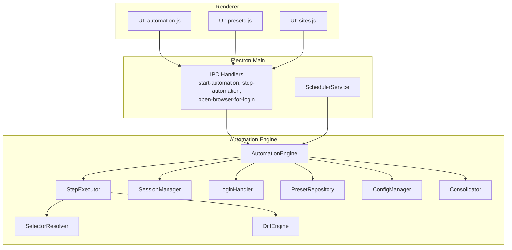
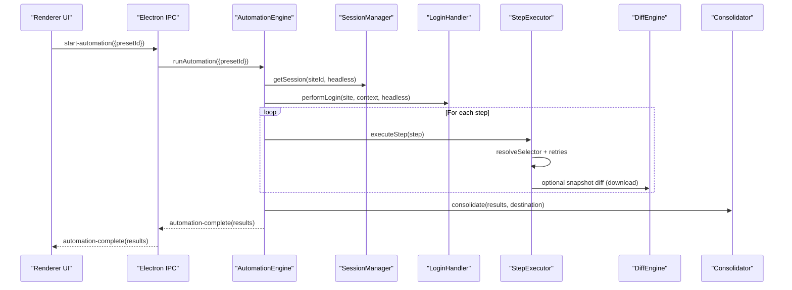
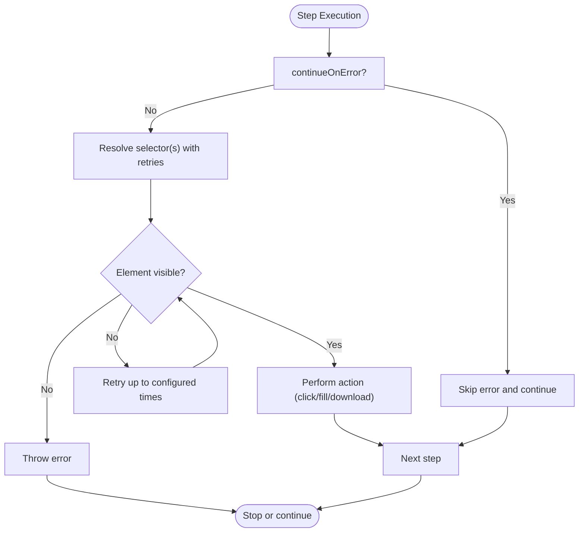
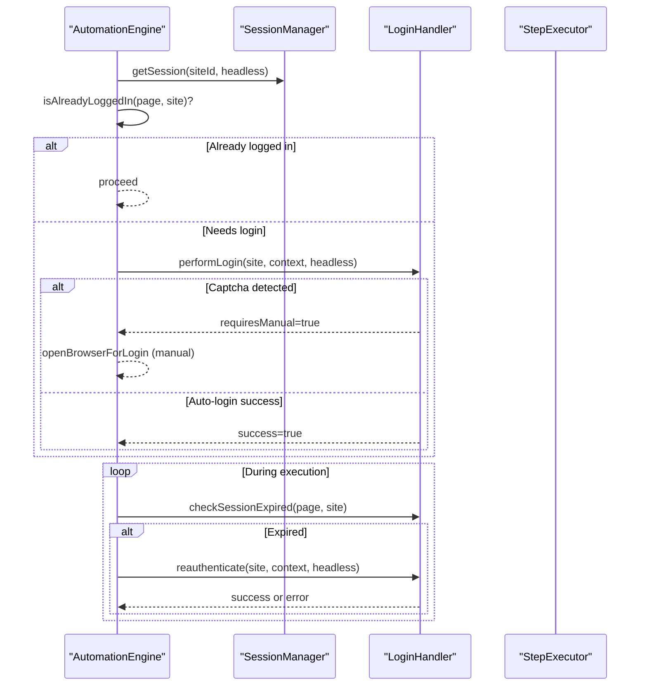
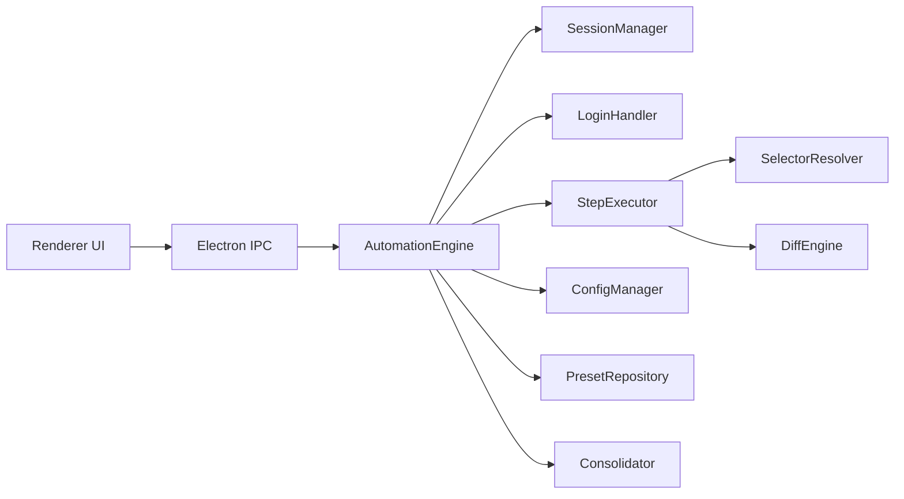

# Workflow Orchestration

<cite>
**Referenced Files in This Document**
- [automation-engine.ts](file://app/automation/engine/automation-engine.ts)
- [scheduler-service.ts](file://app/automation/engine/scheduler-service.ts)
- [step-executor.ts](file://app/automation/engine/step-executor.ts)
- [selector-resolver.ts](file://app/automation/engine/selector-resolver.ts)
- [session-manager.ts](file://app/automation/sessions/session-manager.ts)
- [login-handler.ts](file://app/automation/sessions/login-handler.ts)
- [preset-repository.ts](file://app/automation/engine/preset-repository.ts)
- [config-manager.ts](file://app/config/config-manager.ts)
- [Consolidator.ts](file://app/core/consolidation/Consolidator.ts)
- [DiffEngine.ts](file://app/core/diff/DiffEngine.ts)
- [main.ts](file://app/electron/main.ts)
- [automation.js](file://app/renderer/modules/automation.js)
- [presets.js](file://app/renderer/modules/presets.js)
- [sites.js](file://app/renderer/modules/sites.js)
</cite>

## Table of Contents
1. [Introduction](#introduction)
2. [Project Structure](#project-structure)
3. [Core Components](#core-components)
4. [Architecture Overview](#architecture-overview)
5. [Detailed Component Analysis](#detailed-component-analysis)
6. [Dependency Analysis](#dependency-analysis)
7. [Performance Considerations](#performance-considerations)
8. [Troubleshooting Guide](#troubleshooting-guide)
9. [Conclusion](#conclusion)
10. [Appendices](#appendices)

## Introduction
This document explains Workflow Orchestration within the automation engine. It covers multi-site execution flow, site processing order, execution coordination, workflow validation, dependency resolution, error propagation, session management integration, login workflow orchestration, reauthentication handling, complex workflow examples, parallel execution strategies, monitoring, and the relationship between presets, sites, and execution contexts.

## Project Structure
The automation engine is organized around a central orchestrator that coordinates sessions, login, step execution, and post-processing. The Electron main process exposes IPC handlers to the renderer, enabling user-driven triggers and progress updates.

**Diagram sources**
- [main.ts](file://app/electron/main.ts#L117-L281)
- [automation-engine.ts](file://app/automation/engine/automation-engine.ts#L50-L611)
- [step-executor.ts](file://app/automation/engine/step-executor.ts#L25-L549)
- [selector-resolver.ts](file://app/automation/engine/selector-resolver.ts#L4-L135)
- [session-manager.ts](file://app/automation/sessions/session-manager.ts#L67-L225)
- [login-handler.ts](file://app/automation/sessions/login-handler.ts#L13-L364)
- [preset-repository.ts](file://app/automation/engine/preset-repository.ts#L4-L34)
- [config-manager.ts](file://app/config/config-manager.ts#L85-L408)
- [Consolidator.ts](file://app/core/consolidation/Consolidator.ts#L20-L138)
- [DiffEngine.ts](file://app/core/diff/DiffEngine.ts#L23-L230)
- [automation.js](file://app/renderer/modules/automation.js#L6-L59)
- [presets.js](file://app/renderer/modules/presets.js#L17-L414)
- [sites.js](file://app/renderer/modules/sites.js#L7-L424)

**Section sources**
- [main.ts](file://app/electron/main.ts#L117-L281)
- [automation-engine.ts](file://app/automation/engine/automation-engine.ts#L50-L611)

## Core Components
- AutomationEngine: Central orchestrator managing multi-site execution, login, step execution, progress emission, and consolidation.
- StepExecutor: Executes individual workflow steps with robust selector resolution, retries, and error handling.
- SelectorResolver: Resolves CSS selectors with fallback attempts and visibility checks.
- SessionManager: Manages persistent browser contexts per site with profile isolation.
- LoginHandler: Performs login, detects challenges, and handles reauthentication.
- PresetRepository: CRUD operations for presets and usage tracking.
- ConfigManager: Validates and manages application and preset configurations.
- Consolidator: Merges results into consolidated master snapshots.
- DiffEngine: Compares snapshots and generates audit trails for SSP.

**Section sources**
- [automation-engine.ts](file://app/automation/engine/automation-engine.ts#L50-L611)
- [step-executor.ts](file://app/automation/engine/step-executor.ts#L25-L549)
- [selector-resolver.ts](file://app/automation/engine/selector-resolver.ts#L4-L135)
- [session-manager.ts](file://app/automation/sessions/session-manager.ts#L67-L225)
- [login-handler.ts](file://app/automation/sessions/login-handler.ts#L13-L364)
- [preset-repository.ts](file://app/automation/engine/preset-repository.ts#L4-L34)
- [config-manager.ts](file://app/config/config-manager.ts#L85-L408)
- [Consolidator.ts](file://app/core/consolidation/Consolidator.ts#L20-L138)
- [DiffEngine.ts](file://app/core/diff/DiffEngine.ts#L23-L230)

## Architecture Overview
The engine runs in a deterministic pipeline per site:
- Initialization: Close previous sessions, resolve preset or legacy site list, compute target download path.
- Session acquisition: Persistent context per site with profile isolation.
- Login orchestration: Detect existing session, attempt auto-login, handle captcha or manual login, and reauthenticate on expiration.
- Step execution: Iterate steps with retries, timeouts, and continue-on-error semantics.
- Progress and completion: Emit progress events, send site-complete notifications, and consolidate results.

**Diagram sources**
- [main.ts](file://app/electron/main.ts#L214-L241)
- [automation-engine.ts](file://app/automation/engine/automation-engine.ts#L62-L238)
- [session-manager.ts](file://app/automation/sessions/session-manager.ts#L103-L138)
- [login-handler.ts](file://app/automation/sessions/login-handler.ts#L28-L77)
- [step-executor.ts](file://app/automation/engine/step-executor.ts#L59-L110)
- [Consolidator.ts](file://app/core/consolidation/Consolidator.ts#L26-L63)

## Detailed Component Analysis

### Multi-Site Execution Flow and Processing Order
- Preset-driven vs legacy mode:
  - Preset mode: Sites are isolated within a preset; credentials and destination are injected from the preset.
  - Legacy mode: Uses global site list filtered by IDs.
- Execution order:
  - Sites are processed sequentially in the order provided by the preset or configuration.
  - After each site completes, a site-complete event is emitted to the UI for immediate feedback.
- Target path resolution:
  - Priority: Site-specific downloadPath > Preset destination > inferred parent directory for consolidated results.

**Section sources**
- [automation-engine.ts](file://app/automation/engine/automation-engine.ts#L91-L155)
- [automation-engine.ts](file://app/automation/engine/automation-engine.ts#L135-L146)

### Execution Coordination and Progress Tracking
- Progress emission:
  - Emitted per step with siteId, siteName, currentStep, totalSteps, stepType, message, and percentage.
  - Sent to all Electron windows via webContents.
- Completion notifications:
  - site-complete event sent per site with detailed result.
  - Final summary email dispatched after consolidation when configured.

**Section sources**
- [automation-engine.ts](file://app/automation/engine/automation-engine.ts#L280-L446)
- [automation-engine.ts](file://app/automation/engine/automation-engine.ts#L548-L556)
- [automation-engine.ts](file://app/automation/engine/automation-engine.ts#L157-L190)

### Workflow Validation and Dependency Resolution
- Validation:
  - Reports with SSP require primaryKeys; otherwise, execution is blocked for safety.
  - Steps must include required fields (e.g., selector/value for fill/goto).
- Selector resolution:
  - Attempts multiple selectors in order with retries and visibility checks.
  - Supports arrays of selectors and waits for element readiness.
- Continue-on-error:
  - Optional flag allows a failing step to not halt the entire workflow.

**Diagram sources**
- [step-executor.ts](file://app/automation/engine/step-executor.ts#L59-L110)
- [selector-resolver.ts](file://app/automation/engine/selector-resolver.ts#L17-L48)

**Section sources**
- [automation-engine.ts](file://app/automation/engine/automation-engine.ts#L265-L268)
- [step-executor.ts](file://app/automation/engine/step-executor.ts#L14-L23)
- [selector-resolver.ts](file://app/automation/engine/selector-resolver.ts#L17-L48)

### Error Propagation Mechanisms
- Step-level errors:
  - Logged and optionally suppressed by continueOnError.
- Site-level errors:
  - Captured, screenshot taken if possible, and reported with error message and optional screenshot path.
- Global timeouts:
  - 2-hour hard cap to prevent resource leaks; triggers cleanup and forced stop.
- Watchdog:
  - Scheduler watchdog prevents indefinite processing locks.

**Section sources**
- [step-executor.ts](file://app/automation/engine/step-executor.ts#L102-L109)
- [automation-engine.ts](file://app/automation/engine/automation-engine.ts#L162-L190)
- [automation-engine.ts](file://app/automation/engine/automation-engine.ts#L76-L81)
- [scheduler-service.ts](file://app/automation/engine/scheduler-service.ts#L39-L44)

### Integration with Session Management and Login Workflow
- Persistent contexts:
  - Each site gets a dedicated persistent context stored under a site-specific profile directory.
  - Active sessions are tracked in-memory and closed on completion or demand.
- Login detection:
  - Pre-login checks for existing session indicators.
  - Auto-login attempts username/password fields; on captcha detection, switches to manual mode.
- Reauthentication:
  - During execution, if session expires, deletes the profile and performs a fresh login.

**Diagram sources**
- [automation-engine.ts](file://app/automation/engine/automation-engine.ts#L290-L375)
- [login-handler.ts](file://app/automation/sessions/login-handler.ts#L28-L77)
- [login-handler.ts](file://app/automation/sessions/login-handler.ts#L333-L360)
- [session-manager.ts](file://app/automation/sessions/session-manager.ts#L103-L138)

**Section sources**
- [session-manager.ts](file://app/automation/sessions/session-manager.ts#L103-L138)
- [login-handler.ts](file://app/automation/sessions/login-handler.ts#L28-L77)
- [automation-engine.ts](file://app/automation/engine/automation-engine.ts#L350-L375)

### Presets, Sites, and Execution Contexts
- Presets encapsulate:
  - Sites (fully isolated), credentials, destination, scheduling, and usage tracking.
- Site configuration includes:
  - Login fields, report type, primary keys, download path, and ordered steps.
- Execution context:
  - Preset mode injects credentials and destination into each site during runtime.
  - Legacy mode aggregates sites from all presets.

**Section sources**
- [config-manager.ts](file://app/config/config-manager.ts#L36-L53)
- [config-manager.ts](file://app/config/config-manager.ts#L258-L308)
- [automation-engine.ts](file://app/automation/engine/automation-engine.ts#L91-L104)
- [automation-engine.ts](file://app/automation/engine/automation-engine.ts#L126-L133)

### Complex Workflows and Parallel Execution Strategies
- Complex workflow example:
  - fillDateRange with two selectors for start/end dates, followed by download and snapshot diff.
- Parallel execution:
  - Current implementation processes sites sequentially. Parallelization would require:
    - Independent browser contexts per site.
    - Coordination of shared resources (e.g., download destinations).
    - Synchronization of progress and completion events.
  - Recommendation: Introduce a worker pool with per-site contexts and queue management.

**Section sources**
- [step-executor.ts](file://app/automation/engine/step-executor.ts#L212-L260)
- [step-executor.ts](file://app/automation/engine/step-executor.ts#L439-L511)

### Monitoring and Notifications
- Real-time progress:
  - automation-progress events emitted per step.
  - site-complete events per site for UI updates.
- Consolidation and audit:
  - Consolidator merges results into master snapshots and deleted records.
  - DiffEngine computes added/removed rows and writes metadata.
- Email summaries:
  - Notification service sends automation summaries upon completion.

**Section sources**
- [automation-engine.ts](file://app/automation/engine/automation-engine.ts#L548-L556)
- [automation-engine.ts](file://app/automation/engine/automation-engine.ts#L157-L190)
- [Consolidator.ts](file://app/core/consolidation/Consolidator.ts#L26-L63)
- [DiffEngine.ts](file://app/core/diff/DiffEngine.ts#L55-L219)
- [automation-engine.ts](file://app/automation/engine/automation-engine.ts#L232-L236)

### Scheduler and Automated Execution
- SchedulerService:
  - Periodically evaluates presets with enabled schedules.
  - Supports interval and fixed-time modes; calculates nextRun and persists it.
  - Watchdog prevents stuck processing loops.
- Renderer integration:
  - UI displays active schedules and allows toggling global scheduler.

**Section sources**
- [scheduler-service.ts](file://app/automation/engine/scheduler-service.ts#L6-L145)
- [presets.js](file://app/renderer/modules/presets.js#L100-L152)

## Dependency Analysis
The engine exhibits clear layering:
- UI depends on Electron IPC handlers.
- IPC handlers delegate to AutomationEngine.
- AutomationEngine depends on SessionManager, LoginHandler, StepExecutor, ConfigManager, PresetRepository, Consolidator, and DiffEngine.
- StepExecutor depends on SelectorResolver and DiffEngine for snapshot diffs.

**Diagram sources**
- [main.ts](file://app/electron/main.ts#L117-L281)
- [automation-engine.ts](file://app/automation/engine/automation-engine.ts#L50-L611)
- [step-executor.ts](file://app/automation/engine/step-executor.ts#L25-L549)
- [selector-resolver.ts](file://app/automation/engine/selector-resolver.ts#L4-L135)
- [session-manager.ts](file://app/automation/sessions/session-manager.ts#L67-L225)
- [login-handler.ts](file://app/automation/sessions/login-handler.ts#L13-L364)
- [preset-repository.ts](file://app/automation/engine/preset-repository.ts#L4-L34)
- [config-manager.ts](file://app/config/config-manager.ts#L85-L408)
- [Consolidator.ts](file://app/core/consolidation/Consolidator.ts#L20-L138)
- [DiffEngine.ts](file://app/core/diff/DiffEngine.ts#L23-L230)

**Section sources**
- [main.ts](file://app/electron/main.ts#L117-L281)
- [automation-engine.ts](file://app/automation/engine/automation-engine.ts#L50-L611)

## Performance Considerations
- Headless vs visible mode:
  - Default headless reduces overhead; visible mode required for manual login or captcha resolution.
- Resource cleanup:
  - Strict cleanup of sessions and browser contexts prevents memory leaks.
- Retry and timeout tuning:
  - Adjust defaultTimeout and defaultRetries per environment to balance reliability and speed.
- Consolidation:
  - Consolidator merges results asynchronously; ensure adequate disk I/O and avoid heavy concurrent writes.

[No sources needed since this section provides general guidance]

## Troubleshooting Guide
- Login failures:
  - Verify credentials injection from preset and correct field selectors.
  - If captcha appears in headless mode, switch to visible mode or resolve manually.
- Session expiration:
  - Engine detects expired pages and triggers reauthentication; ensure context remains open.
- Selector issues:
  - Use SelectorResolver’s multi-selector fallback and increase retries.
- Timeouts and freezes:
  - Increase defaultTimeout and defaultRetries; consider continueOnError for non-critical steps.
- Scheduler stuck:
  - Watchdog resets processing state after long durations; investigate underlying errors.

**Section sources**
- [login-handler.ts](file://app/automation/sessions/login-handler.ts#L56-L67)
- [login-handler.ts](file://app/automation/sessions/login-handler.ts#L333-L360)
- [selector-resolver.ts](file://app/automation/engine/selector-resolver.ts#L17-L48)
- [scheduler-service.ts](file://app/automation/engine/scheduler-service.ts#L39-L44)

## Conclusion
The automation engine provides a robust, preset-driven orchestration framework for multi-site workflows. It integrates persistent sessions, intelligent login handling, resilient step execution, and comprehensive auditing and consolidation. While current execution is sequential, the architecture supports future enhancements for parallelism and advanced monitoring.

## Appendices

### Example: Complex Workflow (fillDateRange + Download + Snapshot Diff)
- Steps:
  - fillDateRange with two selectors for start and end date inputs.
  - download with optional step value for target path or name.
  - Snapshot diff computed via DiffEngine and consolidated by Consolidator.
- Notes:
  - Ensure reportType and primaryKeys are configured for SSP.
  - Use continueOnError for non-critical steps to improve resilience.

**Section sources**
- [step-executor.ts](file://app/automation/engine/step-executor.ts#L212-L260)
- [step-executor.ts](file://app/automation/engine/step-executor.ts#L439-L511)
- [DiffEngine.ts](file://app/core/diff/DiffEngine.ts#L55-L219)
- [Consolidator.ts](file://app/core/consolidation/Consolidator.ts#L26-L63)