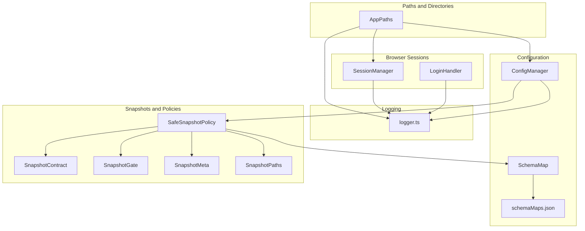
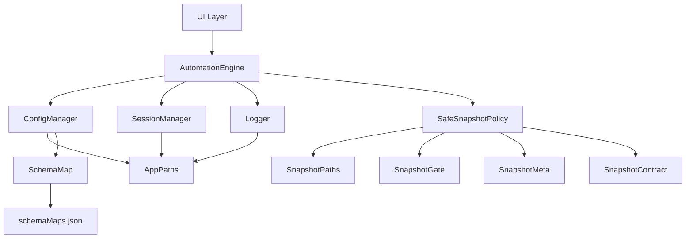
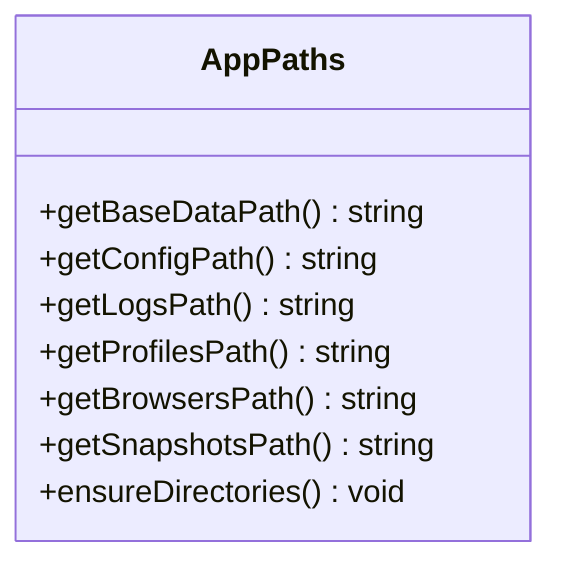
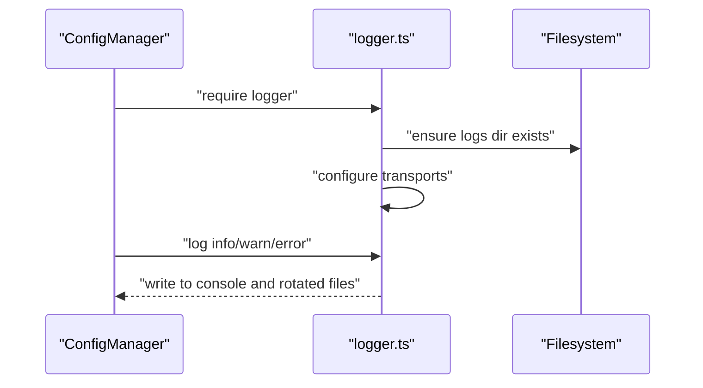
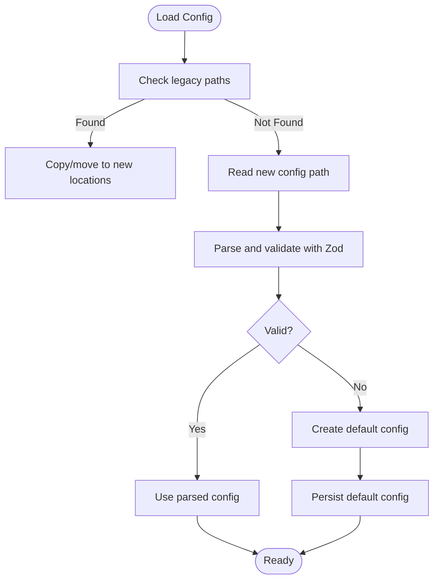
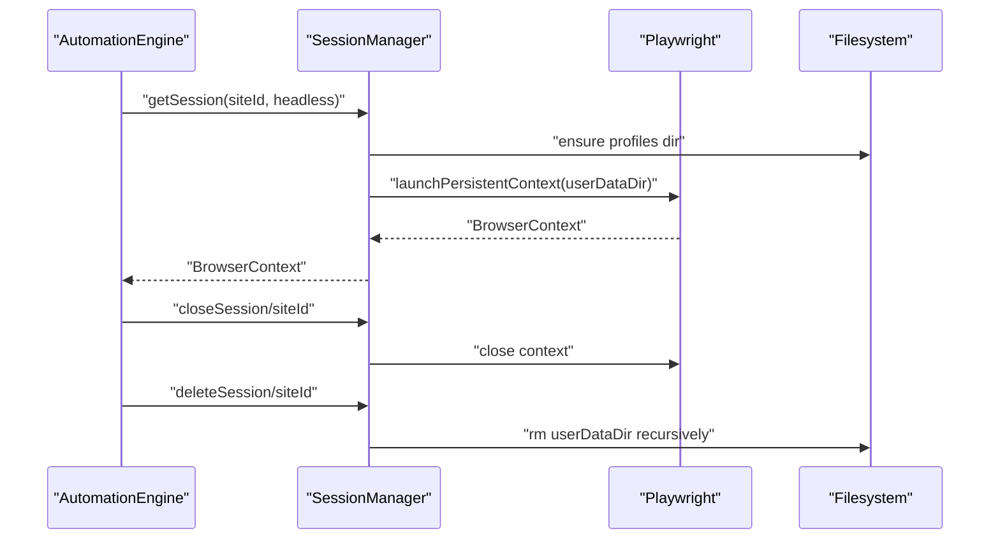
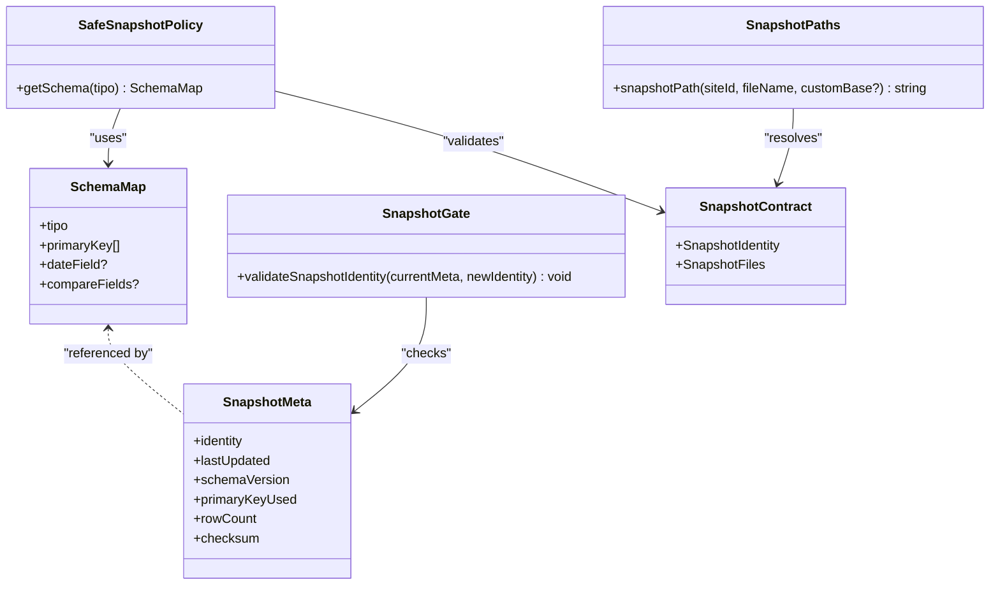
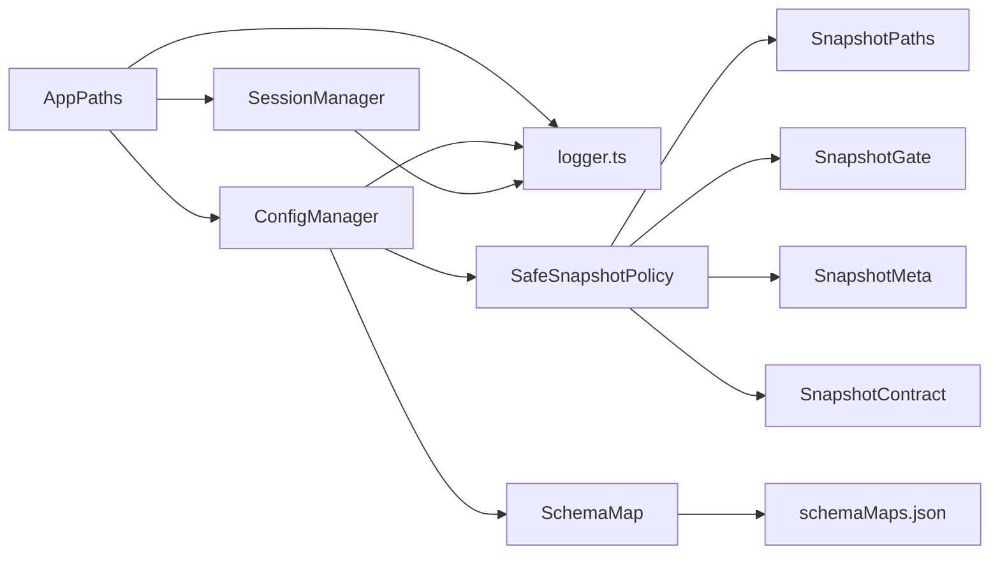

# Data Management

<cite>
**Referenced Files in This Document**
- [AppPaths.ts](file://app/core/utils/AppPaths.ts)
- [logger.ts](file://app/config/logger.ts)
- [config-manager.ts](file://app/config/config-manager.ts)
- [SchemaMap.ts](file://app/config/SchemaMap.ts)
- [schemaMaps.json](file://data/schemaMaps.json)
- [SafeSnapshotPolicy.ts](file://app/policy/snapshot/SafeSnapshotPolicy.ts)
- [SnapshotContract.ts](file://app/policy/snapshot/SnapshotContract.ts)
- [SnapshotGate.ts](file://app/policy/snapshot/SnapshotGate.ts)
- [SnapshotMeta.ts](file://app/policy/snapshot/SnapshotMeta.ts)
- [SnapshotPaths.ts](file://app/policy/snapshot/SnapshotPaths.ts)
- [automation-engine.ts](file://app/automation/engine/automation-engine.ts)
- [session-manager.ts](file://app/automation/sessions/session-manager.ts)
- [login-handler.ts](file://app/automation/sessions/login-handler.ts)
- [preset-repository.ts](file://app/automation/engine/preset-repository.ts)
</cite>

## Table of Contents
1. [Introduction](#introduction)
2. [Project Structure](#project-structure)
3. [Core Components](#core-components)
4. [Architecture Overview](#architecture-overview)
5. [Detailed Component Analysis](#detailed-component-analysis)
6. [Dependency Analysis](#dependency-analysis)
7. [Performance Considerations](#performance-considerations)
8. [Troubleshooting Guide](#troubleshooting-guide)
9. [Conclusion](#conclusion)
10. [Appendices](#appendices)

## Introduction
This document explains the Data Management system of the application, focusing on local storage architecture, browser profile management, configuration persistence, and log file organization. It also documents the AppPaths utility, logging system, data lifecycle management, and practical patterns for storage, backups, recovery, and performance optimization for large datasets. Security, privacy, and compliance considerations are addressed throughout.

## Project Structure
The Data Management system spans several subsystems:
- Paths and directories: AppPaths centralizes all data paths and ensures directories exist.
- Logging: Winston-based logging with daily rotation and specialized loggers.
- Configuration: Zod-based validation and persistence of application and preset configurations.
- Browser sessions: Playwright persistent contexts stored under profiles with migration support.
- Snapshots and policies: Safe snapshot policy, identity validation, and file path resolution for audit trails.

**Diagram sources**
- [AppPaths.ts](file://app/core/utils/AppPaths.ts#L1-L60)
- [logger.ts](file://app/config/logger.ts#L1-L104)
- [config-manager.ts](file://app/config/config-manager.ts#L1-L408)
- [SchemaMap.ts](file://app/config/SchemaMap.ts#L1-L13)
- [schemaMaps.json](file://data/schemaMaps.json#L1-L9)
- [session-manager.ts](file://app/automation/sessions/session-manager.ts#L1-L225)
- [login-handler.ts](file://app/automation/sessions/login-handler.ts#L1-L364)
- [SafeSnapshotPolicy.ts](file://app/policy/snapshot/SafeSnapshotPolicy.ts#L1-L25)
- [SnapshotContract.ts](file://app/policy/snapshot/SnapshotContract.ts#L1-L20)
- [SnapshotGate.ts](file://app/policy/snapshot/SnapshotGate.ts#L1-L28)
- [SnapshotMeta.ts](file://app/policy/snapshot/SnapshotMeta.ts#L1-L18)
- [SnapshotPaths.ts](file://app/policy/snapshot/SnapshotPaths.ts#L1-L13)

**Section sources**
- [AppPaths.ts](file://app/core/utils/AppPaths.ts#L1-L60)
- [logger.ts](file://app/config/logger.ts#L1-L104)
- [config-manager.ts](file://app/config/config-manager.ts#L1-L408)
- [session-manager.ts](file://app/automation/sessions/session-manager.ts#L1-L225)
- [SafeSnapshotPolicy.ts](file://app/policy/snapshot/SafeSnapshotPolicy.ts#L1-L25)
- [SnapshotPaths.ts](file://app/policy/snapshot/SnapshotPaths.ts#L1-L13)

## Core Components
- AppPaths: Provides platform-aware base data paths, ensures directories exist, and exposes getters for config, logs, profiles, browsers, and snapshots.
- Logger: Centralized logging with console and daily-rotated file transports, plus specialized loggers for automation and sessions.
- ConfigManager: Singleton managing application and preset configurations with Zod validation, migrations, and export/import capabilities.
- SessionManager: Manages Playwright persistent contexts per site, ensuring browsers are installed and migrated, and handles profile lifecycle.
- SafeSnapshotPolicy and related snapshot types: Enforce schema and identity integrity for audit snapshots and define file naming and locations.

**Section sources**
- [AppPaths.ts](file://app/core/utils/AppPaths.ts#L1-L60)
- [logger.ts](file://app/config/logger.ts#L1-L104)
- [config-manager.ts](file://app/config/config-manager.ts#L1-L408)
- [session-manager.ts](file://app/automation/sessions/session-manager.ts#L1-L225)
- [SafeSnapshotPolicy.ts](file://app/policy/snapshot/SafeSnapshotPolicy.ts#L1-L25)
- [SnapshotContract.ts](file://app/policy/snapshot/SnapshotContract.ts#L1-L20)
- [SnapshotGate.ts](file://app/policy/snapshot/SnapshotGate.ts#L1-L28)
- [SnapshotMeta.ts](file://app/policy/snapshot/SnapshotMeta.ts#L1-L18)
- [SnapshotPaths.ts](file://app/policy/snapshot/SnapshotPaths.ts#L1-L13)

## Architecture Overview
The system follows a layered approach:
- Path layer: AppPaths defines all storage roots and ensures directories exist.
- Persistence layer: ConfigManager persists structured JSON with validation and migrations.
- Runtime layer: SessionManager stores browser profiles and caches browsers in a dedicated location.
- Audit layer: SafeSnapshotPolicy enforces schema and identity checks, SnapshotPaths resolves file locations, and SnapshotGate prevents cross-type corruption.
- Observability layer: logger.ts provides unified logging with rotation and specialized channels.

**Diagram sources**
- [automation-engine.ts](file://app/automation/engine/automation-engine.ts#L1-L611)
- [config-manager.ts](file://app/config/config-manager.ts#L1-L408)
- [session-manager.ts](file://app/automation/sessions/session-manager.ts#L1-L225)
- [logger.ts](file://app/config/logger.ts#L1-L104)
- [AppPaths.ts](file://app/core/utils/AppPaths.ts#L1-L60)
- [SafeSnapshotPolicy.ts](file://app/policy/snapshot/SafeSnapshotPolicy.ts#L1-L25)
- [SnapshotPaths.ts](file://app/policy/snapshot/SnapshotPaths.ts#L1-L13)
- [SnapshotGate.ts](file://app/policy/snapshot/SnapshotGate.ts#L1-L28)
- [SnapshotMeta.ts](file://app/policy/snapshot/SnapshotMeta.ts#L1-L18)
- [SnapshotContract.ts](file://app/policy/snapshot/SnapshotContract.ts#L1-L20)
- [SchemaMap.ts](file://app/config/SchemaMap.ts#L1-L13)
- [schemaMaps.json](file://data/schemaMaps.json#L1-L9)

## Detailed Component Analysis

### AppPaths Utility
Responsibilities:
- Determine base data path depending on packaging state.
- Provide getters for config, logs, profiles, browsers, and snapshots.
- Ensure essential directories exist.

Key behaviors:
- Base path differs between packaged and development environments.
- Creates directories lazily during startup or on demand.

**Diagram sources**
- [AppPaths.ts](file://app/core/utils/AppPaths.ts#L1-L60)

**Section sources**
- [AppPaths.ts](file://app/core/utils/AppPaths.ts#L1-L60)

### Logging System Implementation
Responsibilities:
- Unified logging with console and file transports.
- Daily rotation with compression and retention.
- Specialized loggers for automation and sessions.

Key behaviors:
- Lazy creation of logs directory to avoid initialization order issues.
- Separate files for errors, combined logs, and automation-specific logs.
- Session logger uses a rolling file with fixed size and count limits.

**Diagram sources**
- [logger.ts](file://app/config/logger.ts#L1-L104)
- [config-manager.ts](file://app/config/config-manager.ts#L1-L408)

**Section sources**
- [logger.ts](file://app/config/logger.ts#L1-L104)

### Configuration Persistence Strategies
Responsibilities:
- Validate and persist application and preset configurations.
- Migrate legacy locations and schemas automatically.
- Provide import/export facilities.

Key behaviors:
- Automatic migration from legacy config and browsers directories.
- Validation via Zod schemas with defaults and strict typing.
- Export/import merges presets by ID with warnings.

**Diagram sources**
- [config-manager.ts](file://app/config/config-manager.ts#L133-L190)

**Section sources**
- [config-manager.ts](file://app/config/config-manager.ts#L1-L408)
- [SchemaMap.ts](file://app/config/SchemaMap.ts#L1-L13)
- [schemaMaps.json](file://data/schemaMaps.json#L1-L9)

### Browser Profile Management
Responsibilities:
- Manage Playwright persistent contexts per site.
- Install and locate browsers in a dedicated directory.
- Migrate profiles and browsers from legacy locations.

Key behaviors:
- Ensures PLAYWRIGHT_BROWSERS_PATH points to AppPaths’ browsers directory.
- Auto-install Chromium if missing.
- Launch persistent contexts with site-scoped user data directories.
- Supports closing, deleting, and clearing sessions.

**Diagram sources**
- [session-manager.ts](file://app/automation/sessions/session-manager.ts#L103-L138)
- [session-manager.ts](file://app/automation/sessions/session-manager.ts#L143-L183)

**Section sources**
- [session-manager.ts](file://app/automation/sessions/session-manager.ts#L1-L225)
- [login-handler.ts](file://app/automation/sessions/login-handler.ts#L1-L364)

### Data Lifecycle Management and Snapshot Policy
Responsibilities:
- Enforce schema and identity integrity for audit snapshots.
- Validate snapshot identity across runs.
- Resolve snapshot file paths and metadata.

Key behaviors:
- SafeSnapshotPolicy validates presence and validity of primary keys.
- SnapshotGate prevents cross-type snapshot corruption by enforcing identity match.
- SnapshotPaths supports custom base paths for flexible storage layouts.
- SnapshotMeta captures identity, schema version, row counts, and checksums.

**Diagram sources**
- [SafeSnapshotPolicy.ts](file://app/policy/snapshot/SafeSnapshotPolicy.ts#L1-L25)
- [SnapshotContract.ts](file://app/policy/snapshot/SnapshotContract.ts#L1-L20)
- [SnapshotGate.ts](file://app/policy/snapshot/SnapshotGate.ts#L1-L28)
- [SnapshotMeta.ts](file://app/policy/snapshot/SnapshotMeta.ts#L1-L18)
- [SnapshotPaths.ts](file://app/policy/snapshot/SnapshotPaths.ts#L1-L13)
- [SchemaMap.ts](file://app/config/SchemaMap.ts#L1-L13)

**Section sources**
- [SafeSnapshotPolicy.ts](file://app/policy/snapshot/SafeSnapshotPolicy.ts#L1-L25)
- [SnapshotGate.ts](file://app/policy/snapshot/SnapshotGate.ts#L1-L28)
- [SnapshotPaths.ts](file://app/policy/snapshot/SnapshotPaths.ts#L1-L13)
- [SnapshotMeta.ts](file://app/policy/snapshot/SnapshotMeta.ts#L1-L18)
- [SchemaMap.ts](file://app/config/SchemaMap.ts#L1-L13)

### Practical Examples and Patterns

- Configuration persistence pattern:
  - Load config with automatic migration from legacy paths.
  - Validate with Zod and persist defaults if missing.
  - Export/import presets by ID with warnings for updates.

- File system operations:
  - Use AppPaths to resolve absolute paths.
  - Ensure directories exist before writing.
  - Move or copy legacy directories during startup.

- Backup and recovery:
  - Back up the entire storage/profiles subtree for browser profiles.
  - Back up snapshots directory for audit trails.
  - Restore by copying directories back; rely on ConfigManager to normalize paths.

- Large dataset optimization:
  - Prefer rotating logs with size and retention limits.
  - Use compact JSON for configuration and snapshots.
  - Segment snapshots by site and period to reduce contention.

- Security and privacy:
  - Treat credentials as sensitive; avoid storing plaintext where possible.
  - Restrict access to AppData directories.
  - Use session isolation per site to minimize cross-site data leakage.

**Section sources**
- [config-manager.ts](file://app/config/config-manager.ts#L133-L190)
- [AppPaths.ts](file://app/core/utils/AppPaths.ts#L44-L58)
- [logger.ts](file://app/config/logger.ts#L42-L58)
- [session-manager.ts](file://app/automation/sessions/session-manager.ts#L80-L87)

## Dependency Analysis
The Data Management system exhibits low coupling and high cohesion:
- AppPaths is a pure utility consumed by all modules.
- ConfigManager depends on AppPaths and Zod schemas.
- SessionManager depends on AppPaths and Playwright.
- Snapshot policy components depend on SchemaMap and AppPaths-derived paths.
- Logging is injected into most modules via imports.

**Diagram sources**
- [AppPaths.ts](file://app/core/utils/AppPaths.ts#L1-L60)
- [config-manager.ts](file://app/config/config-manager.ts#L1-L408)
- [session-manager.ts](file://app/automation/sessions/session-manager.ts#L1-L225)
- [logger.ts](file://app/config/logger.ts#L1-L104)
- [SafeSnapshotPolicy.ts](file://app/policy/snapshot/SafeSnapshotPolicy.ts#L1-L25)
- [SnapshotPaths.ts](file://app/policy/snapshot/SnapshotPaths.ts#L1-L13)
- [SnapshotGate.ts](file://app/policy/snapshot/SnapshotGate.ts#L1-L28)
- [SnapshotMeta.ts](file://app/policy/snapshot/SnapshotMeta.ts#L1-L18)
- [SnapshotContract.ts](file://app/policy/snapshot/SnapshotContract.ts#L1-L20)
- [SchemaMap.ts](file://app/config/SchemaMap.ts#L1-L13)
- [schemaMaps.json](file://data/schemaMaps.json#L1-L9)

**Section sources**
- [AppPaths.ts](file://app/core/utils/AppPaths.ts#L1-L60)
- [config-manager.ts](file://app/config/config-manager.ts#L1-L408)
- [session-manager.ts](file://app/automation/sessions/session-manager.ts#L1-L225)
- [logger.ts](file://app/config/logger.ts#L1-L104)

## Performance Considerations
- Logging:
  - Use daily rotation with compression and size limits to cap disk usage.
  - Separate automation logs to avoid noisy combined logs impacting performance.
- Browser sessions:
  - Persistent contexts reduce cold-start overhead; reuse contexts per site.
  - Close contexts proactively to free memory and file locks.
- Configuration:
  - Keep JSON configs small; avoid unnecessary arrays or nested structures.
  - Use Zod parsing once per load; cache validated results in memory.
- Snapshots:
  - Segment by site and period to enable parallel processing and targeted cleanup.
  - Use checksums and metadata to avoid redundant processing.

[No sources needed since this section provides general guidance]

## Troubleshooting Guide
Common issues and resolutions:
- Missing directories:
  - Ensure AppPaths.ensureDirectories is called or rely on lazy creation in logger and ConfigManager.
- Migration failures:
  - Verify legacy paths exist and permissions allow moving directories.
  - Check logs for migration messages and retry after fixing permissions.
- Browser installation:
  - If Playwright Chromium is missing, auto-installation is attempted; ensure network access and environment variables are set.
- Session corruption:
  - Delete the site’s profile directory to reset state; SessionManager.deleteSession removes the userDataDir.
- Log growth:
  - Confirm rotation settings and retention policies; adjust max size and max files as needed.

**Section sources**
- [AppPaths.ts](file://app/core/utils/AppPaths.ts#L44-L58)
- [logger.ts](file://app/config/logger.ts#L42-L58)
- [session-manager.ts](file://app/automation/sessions/session-manager.ts#L18-L65)
- [config-manager.ts](file://app/config/config-manager.ts#L133-L190)

## Conclusion
The Data Management system integrates path abstraction, robust logging, validated configuration persistence, secure browser session management, and strict snapshot policy enforcement. By leveraging AppPaths, Zod validation, and rotation-based logging, the system remains maintainable and scalable. Snapshot policies and file path resolution ensure audit integrity and efficient lifecycle management. Adhering to the recommended practices helps achieve reliability, performance, and compliance.

[No sources needed since this section summarizes without analyzing specific files]

## Appendices

### Appendix A: Data Storage Layout
- Base data path:
  - Packaged: AppData user data directory.
  - Development: app/ under the working directory.
- Subdirectories:
  - config/app-config.json
  - logs/*-YYYY-MM-DD.log
  - storage/profiles/<siteId>/
  - storage/browsers/
  - snapshots/<siteId>/<files>

**Section sources**
- [AppPaths.ts](file://app/core/utils/AppPaths.ts#L11-L39)
- [logger.ts](file://app/config/logger.ts#L42-L58)
- [session-manager.ts](file://app/automation/sessions/session-manager.ts#L18-L25)

### Appendix B: Compliance and Privacy Checklist
- Encrypt sensitive configuration entries if feasible.
- Limit access to AppData directories.
- Avoid embedding secrets in exported configuration; sanitize before sharing.
- Retain logs only as long as necessary; apply retention policies.
- Document and review snapshot metadata for auditability.

[No sources needed since this section provides general guidance]