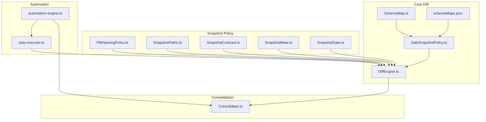
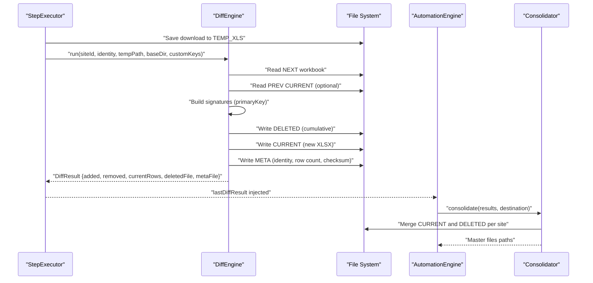
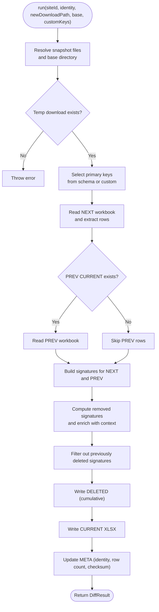
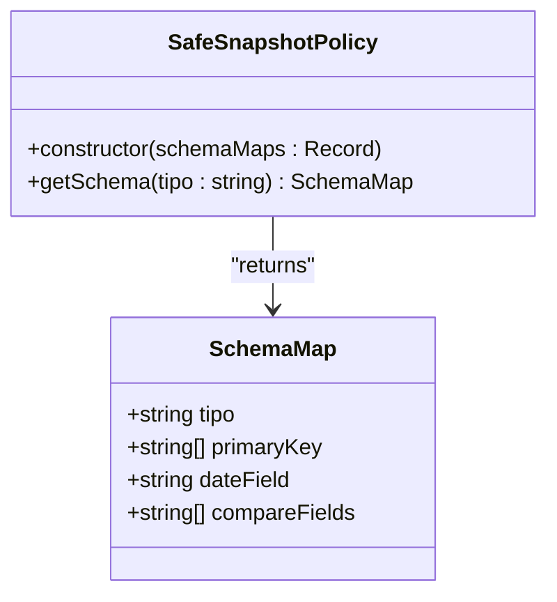
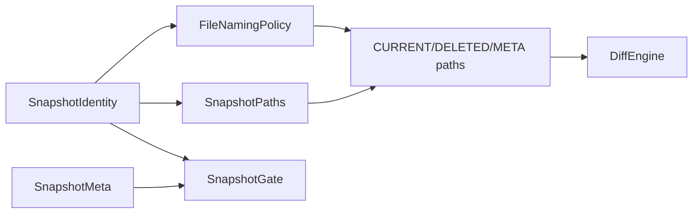
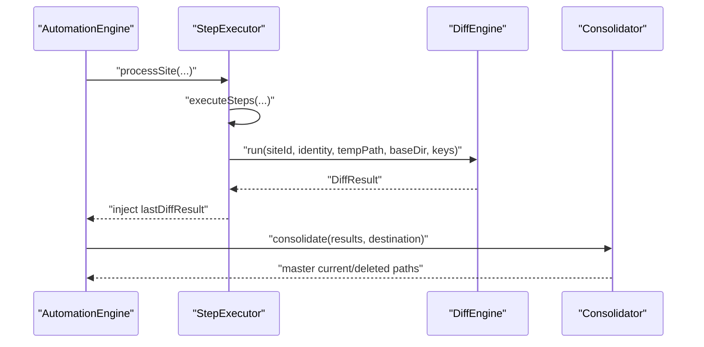
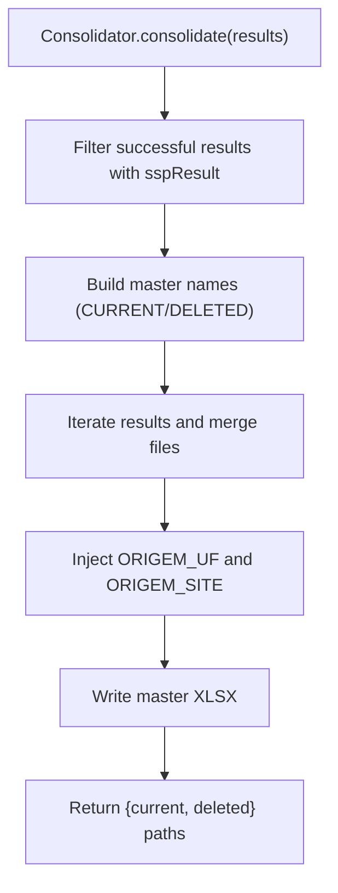
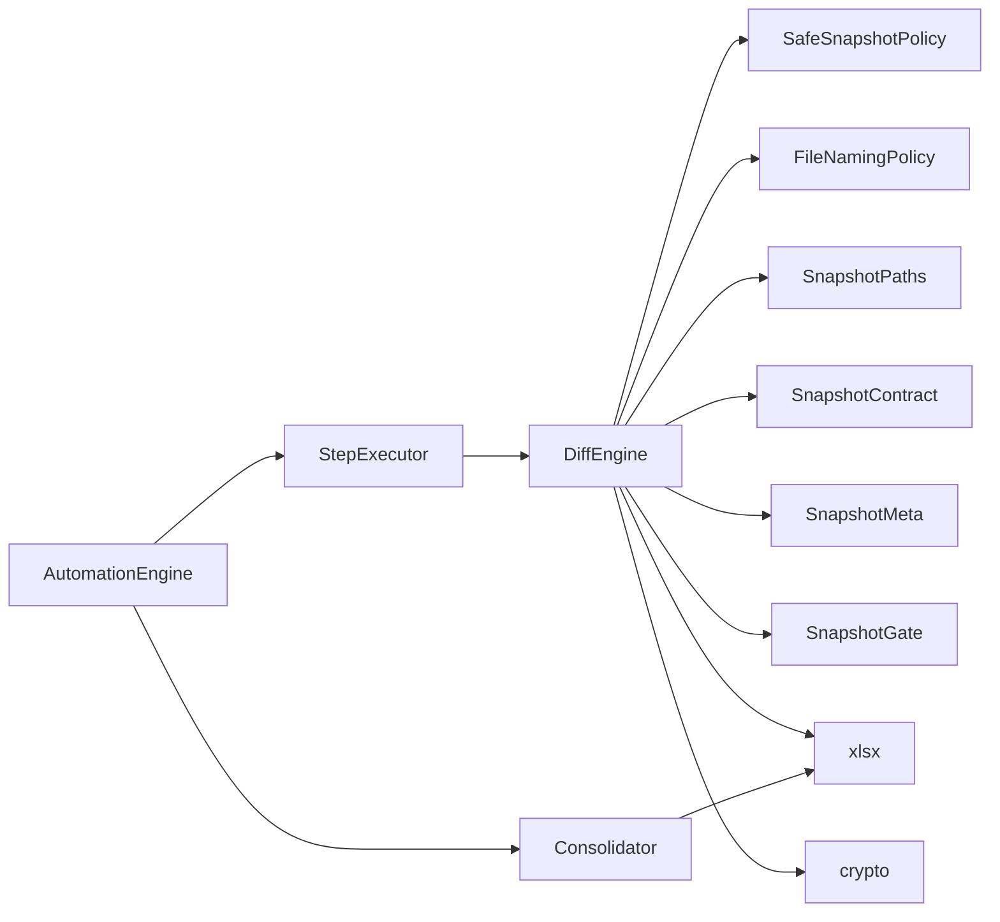

# Diff Engine

<cite>
**Referenced Files in This Document**
- [DiffEngine.ts](file://app/core/diff/DiffEngine.ts)
- [SafeSnapshotPolicy.ts](file://app/policy/snapshot/SafeSnapshotPolicy.ts)
- [SchemaMap.ts](file://app/config/SchemaMap.ts)
- [schemaMaps.json](file://data/schemaMaps.json)
- [FileNamingPolicy.ts](file://app/policy/snapshot/FileNamingPolicy.ts)
- [SnapshotPaths.ts](file://app/policy/snapshot/SnapshotPaths.ts)
- [SnapshotContract.ts](file://app/policy/snapshot/SnapshotContract.ts)
- [SnapshotMeta.ts](file://app/policy/snapshot/SnapshotMeta.ts)
- [SnapshotGate.ts](file://app/policy/snapshot/SnapshotGate.ts)
- [Consolidator.ts](file://app/core/consolidation/Consolidator.ts)
- [step-executor.ts](file://app/automation/engine/step-executor.ts)
- [automation-engine.ts](file://app/automation/engine/automation-engine.ts)
</cite>

## Table of Contents
1. [Introduction](#introduction)
2. [Project Structure](#project-structure)
3. [Core Components](#core-components)
4. [Architecture Overview](#architecture-overview)
5. [Detailed Component Analysis](#detailed-component-analysis)
6. [Dependency Analysis](#dependency-analysis)
7. [Performance Considerations](#performance-considerations)
8. [Troubleshooting Guide](#troubleshooting-guide)
9. [Conclusion](#conclusion)
10. [Appendices](#appendices)

## Introduction
This document explains the Diff Engine component responsible for deterministic comparison of downloaded reports against previous snapshots. It covers the data comparison algorithm, delta calculation mechanics, file system operations for snapshot comparison, consolidation strategies, error handling and recovery, integration with the Safe Snapshot Policy, practical diff operation examples, performance optimization techniques, and the relationship between diff operations and consolidated reporting.

## Project Structure
The Diff Engine lives under the core diff module and collaborates with snapshot policy utilities, schema configuration, and the automation pipeline. The Consolidator consumes Diff Engine outputs to produce master snapshots and consolidated deleted records.

**Diagram sources**
- [DiffEngine.ts](file://app/core/diff/DiffEngine.ts#L1-L230)
- [SafeSnapshotPolicy.ts](file://app/policy/snapshot/SafeSnapshotPolicy.ts#L1-L25)
- [SchemaMap.ts](file://app/config/SchemaMap.ts#L1-L13)
- [schemaMaps.json](file://data/schemaMaps.json#L1-L9)
- [FileNamingPolicy.ts](file://app/policy/snapshot/FileNamingPolicy.ts#L1-L35)
- [SnapshotPaths.ts](file://app/policy/snapshot/SnapshotPaths.ts#L1-L13)
- [SnapshotContract.ts](file://app/policy/snapshot/SnapshotContract.ts#L1-L20)
- [SnapshotMeta.ts](file://app/policy/snapshot/SnapshotMeta.ts#L1-L18)
- [SnapshotGate.ts](file://app/policy/snapshot/SnapshotGate.ts#L1-L28)
- [step-executor.ts](file://app/automation/engine/step-executor.ts#L1-L549)
- [automation-engine.ts](file://app/automation/engine/automation-engine.ts#L1-L611)
- [Consolidator.ts](file://app/core/consolidation/Consolidator.ts#L1-L138)

**Section sources**
- [DiffEngine.ts](file://app/core/diff/DiffEngine.ts#L1-L230)
- [FileNamingPolicy.ts](file://app/policy/snapshot/FileNamingPolicy.ts#L1-L35)
- [SnapshotPaths.ts](file://app/policy/snapshot/SnapshotPaths.ts#L1-L13)
- [SafeSnapshotPolicy.ts](file://app/policy/snapshot/SafeSnapshotPolicy.ts#L1-L25)
- [SchemaMap.ts](file://app/config/SchemaMap.ts#L1-L13)
- [schemaMaps.json](file://data/schemaMaps.json#L1-L9)
- [step-executor.ts](file://app/automation/engine/step-executor.ts#L1-L549)
- [automation-engine.ts](file://app/automation/engine/automation-engine.ts#L1-L611)
- [Consolidator.ts](file://app/core/consolidation/Consolidator.ts#L1-L138)

## Core Components
- DiffEngine: Loads schema maps, resolves snapshot files, reads current and previous workbooks, computes signatures, detects removed/added rows, maintains a cumulative deleted log, writes the new current snapshot, updates metadata, and returns structured results.
- SafeSnapshotPolicy: Validates presence and integrity of schema maps for a given report type and ensures primary key configuration exists.
- FileNamingPolicy and SnapshotPaths: Build deterministic file names and resolve absolute paths for snapshot files.
- SnapshotContract, SnapshotMeta, SnapshotGate: Define identity and metadata structures and enforce identity consistency checks across runs.
- Consolidator: Merges per-site current and deleted snapshots into master files for reporting.
- StepExecutor and AutomationEngine: Integrate Diff Engine into the automation flow, invoking it after downloads and collecting results for consolidation.

**Section sources**
- [DiffEngine.ts](file://app/core/diff/DiffEngine.ts#L1-L230)
- [SafeSnapshotPolicy.ts](file://app/policy/snapshot/SafeSnapshotPolicy.ts#L1-L25)
- [FileNamingPolicy.ts](file://app/policy/snapshot/FileNamingPolicy.ts#L1-L35)
- [SnapshotPaths.ts](file://app/policy/snapshot/SnapshotPaths.ts#L1-L13)
- [SnapshotContract.ts](file://app/policy/snapshot/SnapshotContract.ts#L1-L20)
- [SnapshotMeta.ts](file://app/policy/snapshot/SnapshotMeta.ts#L1-L18)
- [SnapshotGate.ts](file://app/policy/snapshot/SnapshotGate.ts#L1-L28)
- [Consolidator.ts](file://app/core/consolidation/Consolidator.ts#L1-L138)
- [step-executor.ts](file://app/automation/engine/step-executor.ts#L1-L549)
- [automation-engine.ts](file://app/automation/engine/automation-engine.ts#L1-L611)

## Architecture Overview
The Diff Engine participates in a deterministic snapshot lifecycle:
- Downloads are saved to a temporary location.
- DiffEngine compares the new download against the previous CURRENT snapshot using schema-defined primary keys.
- Removed rows are appended to a cumulative DELETED file with contextual metadata.
- The new CURRENT snapshot replaces the previous one.
- Metadata is updated with identity, row count, and checksum.
- Results are returned to the automation engine, which later consolidates master files.

**Diagram sources**
- [step-executor.ts](file://app/automation/engine/step-executor.ts#L464-L488)
- [DiffEngine.ts](file://app/core/diff/DiffEngine.ts#L55-L219)
- [Consolidator.ts](file://app/core/consolidation/Consolidator.ts#L26-L63)

## Detailed Component Analysis

### DiffEngine
Responsibilities:
- Load schema maps from data/schemaMaps.json.
- Resolve snapshot file paths using identity and base directory.
- Normalize column references for signature building (supports positional and occurrence-based keys).
- Compute deterministic signatures from primary keys.
- Detect removed and added rows using set difference.
- Maintain a cumulative DELETED log excluding previously deleted rows.
- Persist new CURRENT snapshot and update META with identity, row count, and SHA-256 checksum.
- Return structured DiffResult.

Key behaviors:
- Deterministic signatures: join trimmed string values of primary keys with a delimiter to avoid collisions.
- Case-insensitive and tolerant key resolution: supports column position and occurrence-based naming.
- Defensive read of PREV CURRENT; if unreadable, treats run as fresh.
- Cumulative DELETED deduplication by signature.
- SHA-256 checksum of CURRENT for integrity verification.

**Diagram sources**
- [DiffEngine.ts](file://app/core/diff/DiffEngine.ts#L55-L219)

**Section sources**
- [DiffEngine.ts](file://app/core/diff/DiffEngine.ts#L1-L230)

### SafeSnapshotPolicy and SchemaMap
- SafeSnapshotPolicy enforces that a schema exists for the requested report type and that primary keys are defined.
- SchemaMap defines primaryKey, optional dateField, and optional compareFields for advanced scenarios.

**Diagram sources**
- [SafeSnapshotPolicy.ts](file://app/policy/snapshot/SafeSnapshotPolicy.ts#L1-L25)
- [SchemaMap.ts](file://app/config/SchemaMap.ts#L1-L13)

**Section sources**
- [SafeSnapshotPolicy.ts](file://app/policy/snapshot/SafeSnapshotPolicy.ts#L1-L25)
- [SchemaMap.ts](file://app/config/SchemaMap.ts#L1-L13)
- [schemaMaps.json](file://data/schemaMaps.json#L1-L9)

### Snapshot Identity, Naming, Paths, and Gate
- SnapshotContract defines SnapshotIdentity and SnapshotFiles structures.
- FileNamingPolicy builds deterministic file names for CURRENT, DELETED, META.
- SnapshotPaths resolves absolute snapshot locations, supporting custom base directories.
- SnapshotGate validates identity consistency between runs to prevent cross-period corruption.

**Diagram sources**
- [SnapshotContract.ts](file://app/policy/snapshot/SnapshotContract.ts#L1-L20)
- [FileNamingPolicy.ts](file://app/policy/snapshot/FileNamingPolicy.ts#L1-L35)
- [SnapshotPaths.ts](file://app/policy/snapshot/SnapshotPaths.ts#L1-L13)
- [SnapshotMeta.ts](file://app/policy/snapshot/SnapshotMeta.ts#L1-L18)
- [SnapshotGate.ts](file://app/policy/snapshot/SnapshotGate.ts#L1-L28)
- [DiffEngine.ts](file://app/core/diff/DiffEngine.ts#L55-L219)

**Section sources**
- [SnapshotContract.ts](file://app/policy/snapshot/SnapshotContract.ts#L1-L20)
- [FileNamingPolicy.ts](file://app/policy/snapshot/FileNamingPolicy.ts#L1-L35)
- [SnapshotPaths.ts](file://app/policy/snapshot/SnapshotPaths.ts#L1-L13)
- [SnapshotMeta.ts](file://app/policy/snapshot/SnapshotMeta.ts#L1-L18)
- [SnapshotGate.ts](file://app/policy/snapshot/SnapshotGate.ts#L1-L28)

### Integration with Automation Pipeline
- StepExecutor orchestrates the download, prepares the snapshot directory, saves to a temporary file, invokes DiffEngine, and stores the result for the AutomationEngine.
- AutomationEngine aggregates results and triggers Consolidator to produce master files.

**Diagram sources**
- [step-executor.ts](file://app/automation/engine/step-executor.ts#L464-L488)
- [DiffEngine.ts](file://app/core/diff/DiffEngine.ts#L55-L219)
- [automation-engine.ts](file://app/automation/engine/automation-engine.ts#L393-L418)
- [Consolidator.ts](file://app/core/consolidation/Consolidator.ts#L26-L63)

**Section sources**
- [step-executor.ts](file://app/automation/engine/step-executor.ts#L464-L488)
- [automation-engine.ts](file://app/automation/engine/automation-engine.ts#L393-L418)
- [Consolidator.ts](file://app/core/consolidation/Consolidator.ts#L26-L63)

### Consolidation Strategies
- Consolidator merges per-site CURRENT and DELETED files into master snapshots.
- It enriches merged rows with origin metadata (UF and site name) for traceability.
- It handles missing sheets and empty files gracefully and logs warnings.

**Diagram sources**
- [Consolidator.ts](file://app/core/consolidation/Consolidator.ts#L26-L134)

**Section sources**
- [Consolidator.ts](file://app/core/consolidation/Consolidator.ts#L1-L138)

## Dependency Analysis
- DiffEngine depends on:
  - SafeSnapshotPolicy for schema validation.
  - FileNamingPolicy and SnapshotPaths for deterministic file resolution.
  - SnapshotContract and SnapshotMeta for identity and metadata structures.
  - SnapshotGate for identity consistency checks.
  - XLSX for workbook parsing and writing.
  - crypto for checksum computation.
  - Electron app context for locating packaged data directory.

- StepExecutor depends on DiffEngine to compute deltas post-download and forwards results to AutomationEngine.

- Consolidator depends on results produced by AutomationEngine/StepExecutor.

**Diagram sources**
- [DiffEngine.ts](file://app/core/diff/DiffEngine.ts#L1-L230)
- [SafeSnapshotPolicy.ts](file://app/policy/snapshot/SafeSnapshotPolicy.ts#L1-L25)
- [FileNamingPolicy.ts](file://app/policy/snapshot/FileNamingPolicy.ts#L1-L35)
- [SnapshotPaths.ts](file://app/policy/snapshot/SnapshotPaths.ts#L1-L13)
- [SnapshotContract.ts](file://app/policy/snapshot/SnapshotContract.ts#L1-L20)
- [SnapshotMeta.ts](file://app/policy/snapshot/SnapshotMeta.ts#L1-L18)
- [SnapshotGate.ts](file://app/policy/snapshot/SnapshotGate.ts#L1-L28)
- [step-executor.ts](file://app/automation/engine/step-executor.ts#L1-L549)
- [automation-engine.ts](file://app/automation/engine/automation-engine.ts#L1-L611)
- [Consolidator.ts](file://app/core/consolidation/Consolidator.ts#L1-L138)

**Section sources**
- [DiffEngine.ts](file://app/core/diff/DiffEngine.ts#L1-L230)
- [step-executor.ts](file://app/automation/engine/step-executor.ts#L1-L549)
- [automation-engine.ts](file://app/automation/engine/automation-engine.ts#L1-L611)
- [Consolidator.ts](file://app/core/consolidation/Consolidator.ts#L1-L138)

## Performance Considerations
- Signature computation uses Set-based lookups for removed/added detection, minimizing overhead for large datasets.
- Column normalization supports positional and occurrence-based keys to reduce misalignment risks without heavy runtime parsing.
- XLSX operations are performed in-memory via sheet_to_json and json_to_sheet; for very large files, consider streaming or chunking strategies if needed.
- Hashing is applied only to the final CURRENT file to keep write amplification low.
- Directory creation and file existence checks are minimal and cached by the OS.

[No sources needed since this section provides general guidance]

## Troubleshooting Guide
Common issues and resolutions:
- Schema file not found or invalid:
  - Ensure data/schemaMaps.json exists and is readable in packaged deployments.
  - Verify schemaMaps.json contains entries for the report type used.
- Primary key configuration errors:
  - Confirm primary keys are defined for the report type and passed correctly from site configuration.
- Unreadable PREV CURRENT:
  - DiffEngine treats unreadable PREV as a fresh run; verify file permissions and integrity.
- Snapshot identity mismatch:
  - SnapshotGate prevents cross-period or cross-type updates; ensure identity (tipo, period, uf) remains consistent.
- Empty or corrupted downloads:
  - DiffEngine warns on empty NEXT; confirm download completion and file validity.
- Temporary file handling:
  - StepExecutor saves downloads to a temporary file and cleans up afterward; ensure sufficient disk space and permissions.

**Section sources**
- [DiffEngine.ts](file://app/core/diff/DiffEngine.ts#L32-L44)
- [DiffEngine.ts](file://app/core/diff/DiffEngine.ts#L87-L94)
- [SnapshotGate.ts](file://app/policy/snapshot/SnapshotGate.ts#L4-L27)
- [step-executor.ts](file://app/automation/engine/step-executor.ts#L482-L488)

## Conclusion
The Diff Engine provides a robust, deterministic mechanism for comparing downloaded reports against historical snapshots. By leveraging schema-defined primary keys, resilient file operations, and strict identity validation, it ensures accurate delta detection and cumulative deletion tracking. Its integration with the automation pipeline and Consolidator enables scalable, auditable reporting workflows.

[No sources needed since this section summarizes without analyzing specific files]

## Appendices

### Practical Examples of Diff Operations
- Example 1: VENDA report with period Q1_2025 and UF SC
  - Primary keys configured: ["ID", "PRODCOD", "NNF"]
  - DiffEngine builds signatures from these columns, compares NEXT vs PREV, and updates DELETED and META accordingly.
- Example 2: PEDIDO report with period JAN2026 and UF SP
  - Primary keys configured: ["Doc", "Item", "ID"]
  - DiffEngine normalizes column names and computes signatures deterministically.

**Section sources**
- [schemaMaps.json](file://data/schemaMaps.json#L1-L9)
- [DiffEngine.ts](file://app/core/diff/DiffEngine.ts#L108-L148)

### Relationship Between Diff Operations and Report Generation
- CURRENT snapshot: Active dataset for the period.
- DELETED snapshot: Cumulative deletions with contextual metadata for auditability.
- Consolidator merges per-site files into master snapshots for centralized reporting.
- AutomationEngine coordinates the entire flow and triggers consolidation after site processing.

**Section sources**
- [Consolidator.ts](file://app/core/consolidation/Consolidator.ts#L26-L63)
- [automation-engine.ts](file://app/automation/engine/automation-engine.ts#L197-L214)