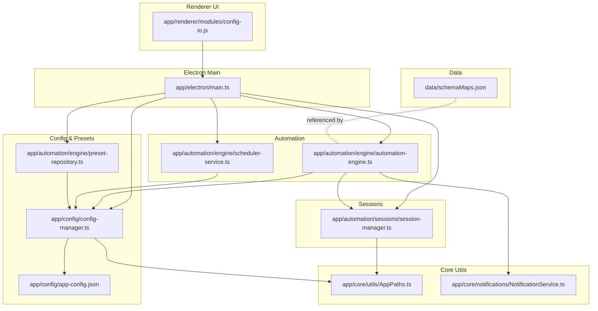
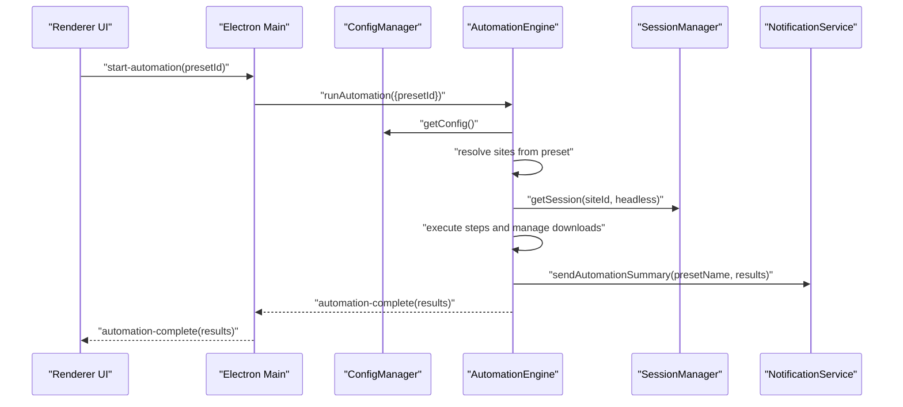
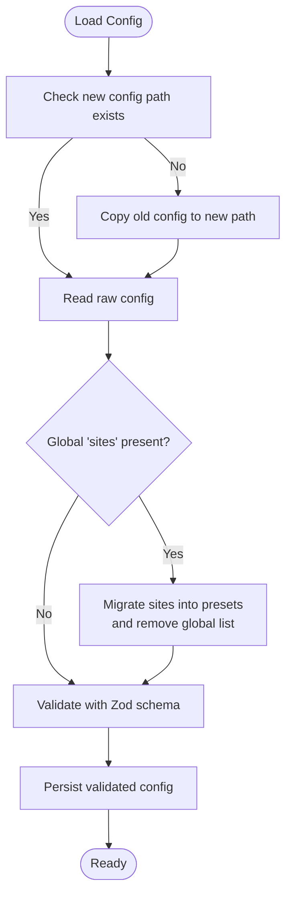
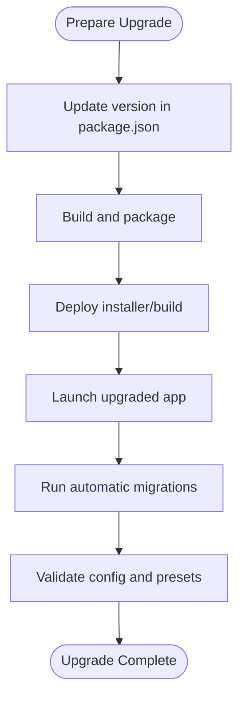
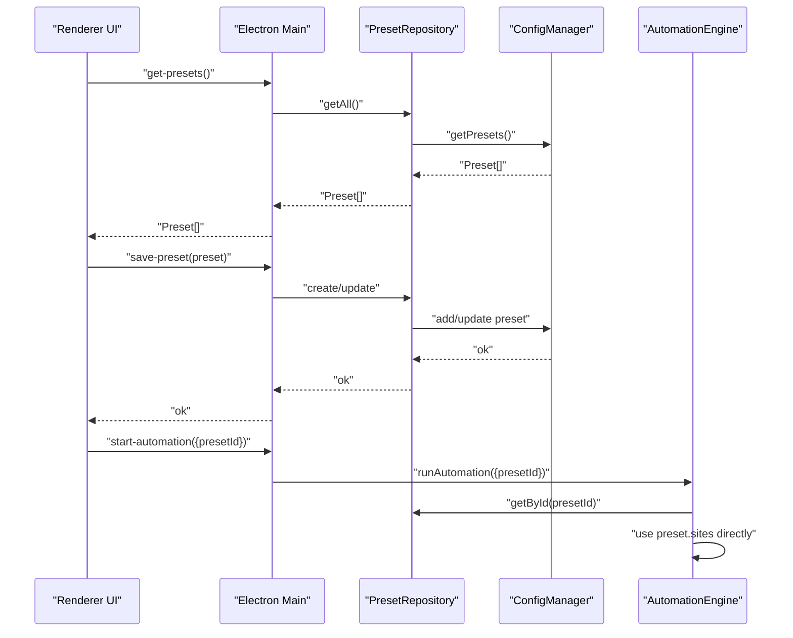
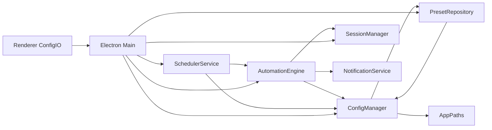

# Migration and Updates

<cite>
**Referenced Files in This Document**
- [package.json](file://package.json)
- [MIGRATION_PRESET_ISOLATION.md](file://MIGRATION_PRESET_ISOLATION.md)
- [CHECKLIST_CONFORMIDADE_UI.md](file://CHECKLIST_CONFORMIDADE_UI.md)
- [app/config/config-manager.ts](file://app/config/config-manager.ts)
- [app/config/app-config.json](file://app/config/app-config.json)
- [app/automation/engine/preset-repository.ts](file://app/automation/engine/preset-repository.ts)
- [app/automation/engine/automation-engine.ts](file://app/automation/engine/automation-engine.ts)
- [app/automation/engine/scheduler-service.ts](file://app/automation/engine/scheduler-service.ts)
- [app/automation/sessions/session-manager.ts](file://app/automation/sessions/session-manager.ts)
- [app/electron/main.ts](file://app/electron/main.ts)
- [app/core/utils/AppPaths.ts](file://app/core/utils/AppPaths.ts)
- [app/core/notifications/NotificationService.ts](file://app/core/notifications/NotificationService.ts)
- [app/renderer/modules/config-io.js](file://app/renderer/modules/config-io.js)
- [data/schemaMaps.json](file://data/schemaMaps.json)
</cite>

## Table of Contents
1. [Introduction](#introduction)
2. [Project Structure](#project-structure)
3. [Core Components](#core-components)
4. [Architecture Overview](#architecture-overview)
5. [Detailed Component Analysis](#detailed-component-analysis)
6. [Dependency Analysis](#dependency-analysis)
7. [Performance Considerations](#performance-considerations)
8. [Troubleshooting Guide](#troubleshooting-guide)
9. [Conclusion](#conclusion)
10. [Appendices](#appendices)

## Introduction
This document provides comprehensive migration and update guidance for Automatizador Bravo. It covers configuration migration procedures, version upgrade processes, breaking changes, legacy system support, preset isolation migration, UI compliance checks, backward compatibility maintenance, step-by-step migration guides, rollback procedures, validation steps, data preservation, configuration updates, and feature deprecation handling.

## Project Structure
The project is an Electron-based desktop application with a TypeScript/JavaScript frontend and backend. Key areas relevant to migrations and updates:
- Configuration and presets: app/config
- Automation engine and scheduling: app/automation
- Session management and browser profiles: app/automation/sessions
- Electron main process and IPC: app/electron
- Renderer modules for UI integration: app/renderer/modules
- Data schemas and snapshot policies: data
- Build and packaging: package.json and release artifacts

**Diagram sources**
- [app/electron/main.ts](file://app/electron/main.ts#L117-L281)
- [app/config/config-manager.ts](file://app/config/config-manager.ts#L85-L398)
- [app/automation/engine/automation-engine.ts](file://app/automation/engine/automation-engine.ts#L50-L611)
- [app/automation/engine/scheduler-service.ts](file://app/automation/engine/scheduler-service.ts#L6-L145)
- [app/automation/sessions/session-manager.ts](file://app/automation/sessions/session-manager.ts#L67-L225)
- [app/core/utils/AppPaths.ts](file://app/core/utils/AppPaths.ts#L5-L60)
- [app/core/notifications/NotificationService.ts](file://app/core/notifications/NotificationService.ts#L13-L115)
- [app/renderer/modules/config-io.js](file://app/renderer/modules/config-io.js#L5-L115)
- [data/schemaMaps.json](file://data/schemaMaps.json#L1-L9)

**Section sources**
- [package.json](file://package.json#L1-L133)
- [app/electron/main.ts](file://app/electron/main.ts#L117-L281)

## Core Components
- ConfigManager: Loads, validates, migrates, and persists application configuration and presets. Implements automatic migration from legacy locations and schemas.
- PresetRepository: Provides CRUD operations for presets and integrates with ConfigManager.
- AutomationEngine: Orchestrates automation runs per preset, injects credentials, manages downloads, and emits progress and completion events.
- SchedulerService: Monitors scheduled presets and triggers automation runs based on interval or fixed-time modes.
- SessionManager: Manages persistent browser contexts per site, ensuring session continuity and profile isolation.
- NotificationService: Sends automation summaries via email when configured.
- Electron main: Exposes IPC handlers for configuration, presets, sessions, automation control, and export/import.
- Renderer ConfigIO: Handles export/import of configuration data from the UI.

Key migration-related capabilities:
- Automatic migration of configuration from legacy paths to AppData.
- Automatic migration of global sites list into preset-scoped site arrays.
- Deprecation of legacy methods while maintaining compatibility during transition.
- Export/import of presets and configuration for backup and transport.

**Section sources**
- [app/config/config-manager.ts](file://app/config/config-manager.ts#L85-L398)
- [app/automation/engine/preset-repository.ts](file://app/automation/engine/preset-repository.ts#L4-L34)
- [app/automation/engine/automation-engine.ts](file://app/automation/engine/automation-engine.ts#L50-L238)
- [app/automation/engine/scheduler-service.ts](file://app/automation/engine/scheduler-service.ts#L6-L145)
- [app/automation/sessions/session-manager.ts](file://app/automation/sessions/session-manager.ts#L67-L225)
- [app/core/notifications/NotificationService.ts](file://app/core/notifications/NotificationService.ts#L13-L115)
- [app/electron/main.ts](file://app/electron/main.ts#L117-L281)
- [app/renderer/modules/config-io.js](file://app/renderer/modules/config-io.js#L5-L115)

## Architecture Overview
The system follows a layered architecture:
- Electron main process handles IPC, lifecycle, and OS integrations.
- Renderer modules communicate with main via IPC for configuration and automation tasks.
- ConfigManager centralizes configuration loading, validation, and persistence.
- AutomationEngine coordinates site execution, session management, and notifications.
- SchedulerService periodically triggers automation runs based on preset schedules.

**Diagram sources**
- [app/electron/main.ts](file://app/electron/main.ts#L214-L241)
- [app/automation/engine/automation-engine.ts](file://app/automation/engine/automation-engine.ts#L62-L238)
- [app/automation/sessions/session-manager.ts](file://app/automation/sessions/session-manager.ts#L103-L138)
- [app/core/notifications/NotificationService.ts](file://app/core/notifications/NotificationService.ts#L75-L111)

## Detailed Component Analysis

### Configuration Migration Procedures
- Legacy configuration detection and migration:
  - If the new config path does not exist but the old path exists, copy it automatically.
  - If a global sites list exists, migrate it into each preset’s site array and remove the global list.
- Path resolution:
  - Environment variable substitution and intelligent user profile remapping to avoid permission errors after system changes.
- Validation and defaults:
  - Zod schemas enforce strict validation and provide sensible defaults for missing fields.
- Export/Import:
  - Full configuration export/import preserves presets and settings for backup and deployment.

**Diagram sources**
- [app/config/config-manager.ts](file://app/config/config-manager.ts#L133-L190)

**Section sources**
- [app/config/config-manager.ts](file://app/config/config-manager.ts#L98-L124)
- [app/config/config-manager.ts](file://app/config/config-manager.ts#L133-L190)
- [app/config/config-manager.ts](file://app/config/config-manager.ts#L334-L394)
- [app/config/app-config.json](file://app/config/app-config.json#L1-L800)

### Version Upgrade Processes
- Increment version in package.json and rebuild distribution assets.
- Verify migration logic executes on first launch after upgrade.
- Validate that legacy methods still work during transition period.
- Confirm scheduler and session manager migrations for browsers and profiles.

**Diagram sources**
- [package.json](file://package.json#L3-L18)
- [app/config/config-manager.ts](file://app/config/config-manager.ts#L133-L190)
- [app/automation/sessions/session-manager.ts](file://app/automation/sessions/session-manager.ts#L18-L65)

**Section sources**
- [package.json](file://package.json#L3-L18)
- [app/config/config-manager.ts](file://app/config/config-manager.ts#L133-L190)
- [app/automation/sessions/session-manager.ts](file://app/automation/sessions/session-manager.ts#L18-L65)

### Breaking Changes Documentation
- Removal of global sites list in favor of preset-scoped sites.
- Deprecation of legacy methods (e.g., getSites, getSiteById) with warnings and fallback behavior.
- Isolation of site configurations within presets for improved portability and reduced conflicts.
- Scheduler and session managers now rely on AppPaths for consistent storage locations.

**Section sources**
- [MIGRATION_PRESET_ISOLATION.md](file://MIGRATION_PRESET_ISOLATION.md#L1-L242)
- [app/config/config-manager.ts](file://app/config/config-manager.ts#L310-L327)
- [app/automation/engine/automation-engine.ts](file://app/automation/engine/automation-engine.ts#L91-L111)

### Legacy System Support
- Automatic migration of configuration and browser profiles from legacy locations to AppData.
- Maintains compatibility with older APIs during a transition phase.
- Ensures that sessions and profiles are relocated and remain functional after migration.

**Section sources**
- [app/config/config-manager.ts](file://app/config/config-manager.ts#L133-L190)
- [app/automation/sessions/session-manager.ts](file://app/automation/sessions/session-manager.ts#L18-L90)

### Preset Isolation Migration
- Modify preset schema to embed full site objects instead of IDs.
- Remove global site management methods and introduce context-aware methods scoped to presets.
- Update UI and Electron handlers to reflect preset-scoped site management.
- Ensure automation engine reads sites directly from the selected preset.

**Diagram sources**
- [MIGRATION_PRESET_ISOLATION.md](file://MIGRATION_PRESET_ISOLATION.md#L8-L110)
- [app/automation/engine/preset-repository.ts](file://app/automation/engine/preset-repository.ts#L4-L34)
- [app/automation/engine/automation-engine.ts](file://app/automation/engine/automation-engine.ts#L91-L111)
- [app/electron/main.ts](file://app/electron/main.ts#L128-L146)

**Section sources**
- [MIGRATION_PRESET_ISOLATION.md](file://MIGRATION_PRESET_ISOLATION.md#L1-L242)
- [app/automation/engine/preset-repository.ts](file://app/automation/engine/preset-repository.ts#L4-L34)
- [app/automation/engine/automation-engine.ts](file://app/automation/engine/automation-engine.ts#L91-L111)
- [app/electron/main.ts](file://app/electron/main.ts#L128-L146)

### UI Compliance Checks
- Desktop enterprise UI standards are verified and documented.
- Checklist ensures fixed layout, required components, and responsive behavior.
- Automated verification of layout, scroll behavior, and component presence.

**Section sources**
- [CHECKLIST_CONFORMIDADE_UI.md](file://CHECKLIST_CONFORMIDADE_UI.md#L1-L95)

### Backward Compatibility Maintenance
- Deprecated methods log warnings and provide fallback behavior.
- Export/import preserves legacy-compatible structures for external tools.
- Automatic migrations keep user data accessible across upgrades.

**Section sources**
- [app/config/config-manager.ts](file://app/config/config-manager.ts#L310-L327)
- [app/config/config-manager.ts](file://app/config/config-manager.ts#L334-L394)

### Step-by-Step Migration Guides
- Prepare:
  - Backup current configuration and data.
  - Review pending UI compliance items.
- Apply preset isolation:
  - Update schema and remove global sites list.
  - Replace global site methods with preset-scoped equivalents.
  - Update UI and Electron handlers to use preset context.
- Validate:
  - Run export/import to confirm data integrity.
  - Execute a test automation run per preset.
- Rollback:
  - Restore previous configuration if issues arise.
  - Revert schema changes and restore global sites list.
- Post-migration:
  - Monitor logs for deprecation warnings.
  - Update documentation and training materials.

**Section sources**
- [MIGRATION_PRESET_ISOLATION.md](file://MIGRATION_PRESET_ISOLATION.md#L1-L242)
- [app/renderer/modules/config-io.js](file://app/renderer/modules/config-io.js#L5-L115)

### Rollback Procedures
- Restore previous configuration from backup.
- Revert schema changes in ConfigManager.
- Re-add global sites list if necessary.
- Restart application and verify functionality.

**Section sources**
- [app/config/config-manager.ts](file://app/config/config-manager.ts#L133-L190)
- [app/renderer/modules/config-io.js](file://app/renderer/modules/config-io.js#L48-L115)

### Validation Steps
- Confirm configuration loads without errors after migration.
- Verify that presets contain embedded sites and no global sites list remains.
- Test automation runs per preset and scheduler behavior.
- Validate export/import produces expected results.
- Check session profiles migrated correctly and are usable.

**Section sources**
- [app/config/config-manager.ts](file://app/config/config-manager.ts#L133-L190)
- [app/automation/engine/automation-engine.ts](file://app/automation/engine/automation-engine.ts#L91-L111)
- [app/automation/engine/scheduler-service.ts](file://app/automation/engine/scheduler-service.ts#L38-L96)
- [app/renderer/modules/config-io.js](file://app/renderer/modules/config-io.js#L5-L115)
- [app/automation/sessions/session-manager.ts](file://app/automation/sessions/session-manager.ts#L80-L90)

### Data Preservation
- Automatic migration of configuration and browser profiles to AppData.
- Export/import ensures portable backups of presets and settings.
- Session profiles are preserved and relocated during migration.

**Section sources**
- [app/config/config-manager.ts](file://app/config/config-manager.ts#L133-L190)
- [app/automation/sessions/session-manager.ts](file://app/automation/sessions/session-manager.ts#L18-L90)
- [app/renderer/modules/config-io.js](file://app/renderer/modules/config-io.js#L5-L115)

### Configuration Updates
- Use ConfigManager methods to add, update, or remove presets and sites.
- Leverage export/import for bulk updates and deployments.
- Validate changes using Zod schemas before saving.

**Section sources**
- [app/config/config-manager.ts](file://app/config/config-manager.ts#L216-L308)
- [app/renderer/modules/config-io.js](file://app/renderer/modules/config-io.js#L5-L115)

### Feature Deprecation Handling
- Deprecated methods log warnings and maintain compatibility temporarily.
- Encourage migration to new preset-scoped methods.
- Provide clear migration steps and timelines.

**Section sources**
- [app/config/config-manager.ts](file://app/config/config-manager.ts#L310-L327)
- [MIGRATION_PRESET_ISOLATION.md](file://MIGRATION_PRESET_ISOLATION.md#L1-L242)

## Dependency Analysis
The following diagram highlights key dependencies among core components involved in migration and updates.

**Diagram sources**
- [app/config/config-manager.ts](file://app/config/config-manager.ts#L85-L398)
- [app/automation/engine/preset-repository.ts](file://app/automation/engine/preset-repository.ts#L4-L34)
- [app/automation/engine/automation-engine.ts](file://app/automation/engine/automation-engine.ts#L50-L611)
- [app/automation/engine/scheduler-service.ts](file://app/automation/engine/scheduler-service.ts#L6-L145)
- [app/automation/sessions/session-manager.ts](file://app/automation/sessions/session-manager.ts#L67-L225)
- [app/core/notifications/NotificationService.ts](file://app/core/notifications/NotificationService.ts#L13-L115)
- [app/electron/main.ts](file://app/electron/main.ts#L117-L281)
- [app/core/utils/AppPaths.ts](file://app/core/utils/AppPaths.ts#L5-L60)
- [app/renderer/modules/config-io.js](file://app/renderer/modules/config-io.js#L5-L115)

**Section sources**
- [app/config/config-manager.ts](file://app/config/config-manager.ts#L85-L398)
- [app/automation/engine/automation-engine.ts](file://app/automation/engine/automation-engine.ts#L50-L611)
- [app/automation/engine/scheduler-service.ts](file://app/automation/engine/scheduler-service.ts#L6-L145)
- [app/automation/sessions/session-manager.ts](file://app/automation/sessions/session-manager.ts#L67-L225)
- [app/electron/main.ts](file://app/electron/main.ts#L117-L281)

## Performance Considerations
- Migration operations occur on first launch and should be fast; ensure sufficient disk space for profile and browser migrations.
- Export/import operations serialize large preset sets; consider batching for very large configurations.
- Scheduler intervals are minute-based; ensure adequate CPU/memory for concurrent automation runs.

[No sources needed since this section provides general guidance]

## Troubleshooting Guide
Common issues and resolutions:
- Configuration fails to load:
  - Check logs for migration errors and verify AppPaths directories exist.
  - Re-run export/import to regenerate a clean configuration.
- Automation fails due to missing sites:
  - Confirm preset contains embedded sites and not just IDs.
  - Recreate preset with embedded sites if necessary.
- Sessions not persisting:
  - Verify AppPaths profile directory and permissions.
  - Clear sessions and retry to recreate profiles.
- Scheduler not triggering:
  - Ensure scheduler is enabled globally and preset has a valid schedule.
  - Check nextRun calculation and adjust fixed times if needed.

**Section sources**
- [app/core/utils/AppPaths.ts](file://app/core/utils/AppPaths.ts#L44-L58)
- [app/automation/sessions/session-manager.ts](file://app/automation/sessions/session-manager.ts#L18-L90)
- [app/automation/engine/scheduler-service.ts](file://app/automation/engine/scheduler-service.ts#L50-L96)

## Conclusion
Automatizador Bravo provides robust mechanisms for configuration migration, preset isolation, and backward compatibility. By following the step-by-step migration and validation procedures outlined here, administrators can safely upgrade systems, preserve data, and maintain UI compliance while leveraging modernized preset-scoped configurations.

## Appendices
- UI Compliance Checklist: Verified desktop enterprise UI standards and automated checks.
- Data Schemas: Referenced by automation engine for report types and primary keys.

**Section sources**
- [CHECKLIST_CONFORMIDADE_UI.md](file://CHECKLIST_CONFORMIDADE_UI.md#L1-L95)
- [data/schemaMaps.json](file://data/schemaMaps.json#L1-L9)