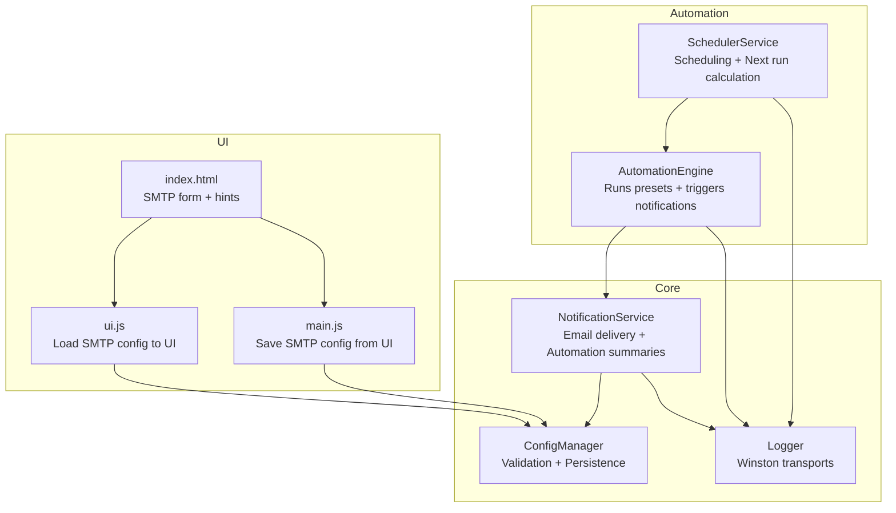
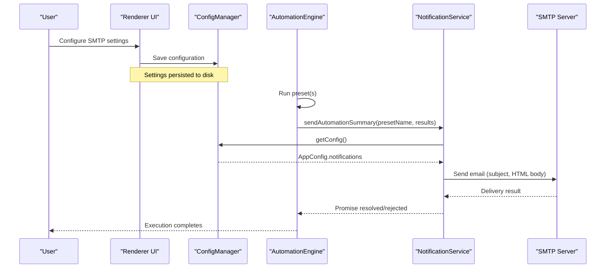
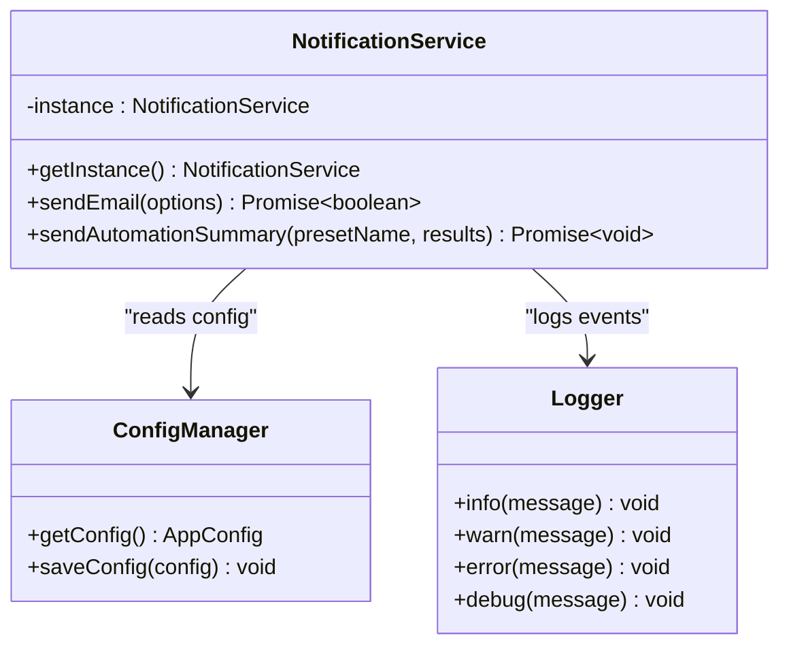
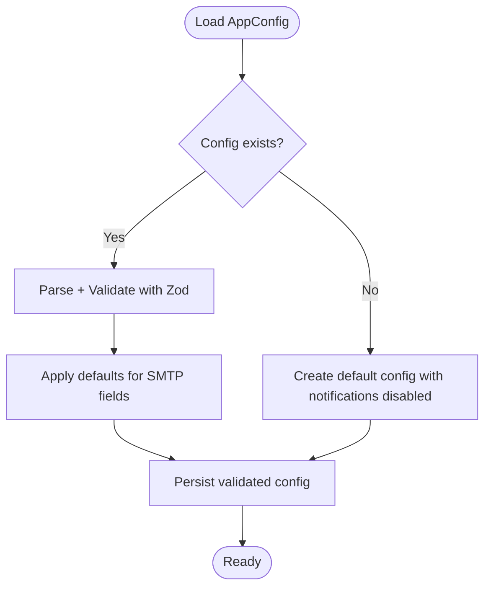
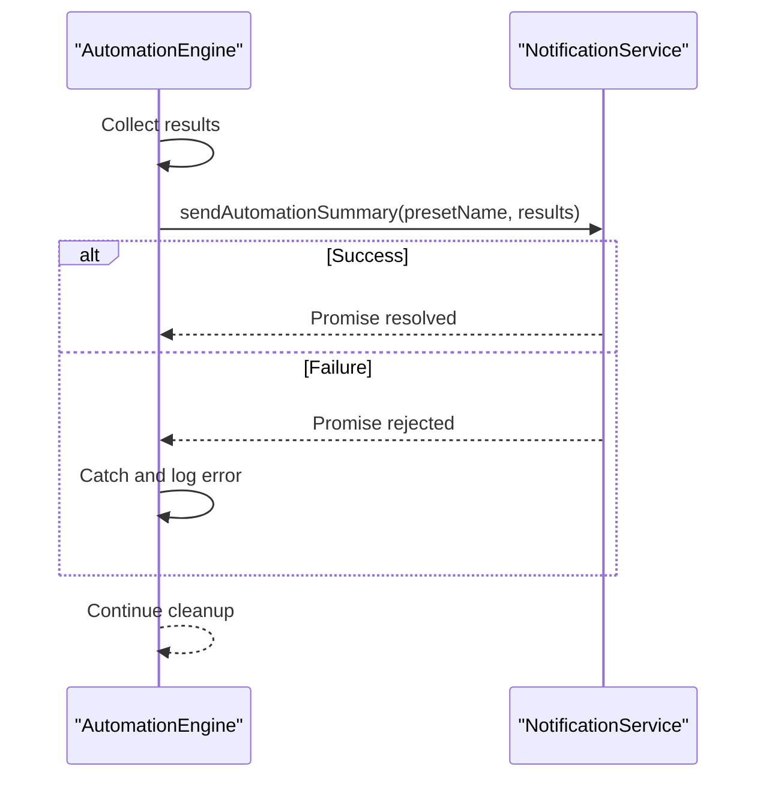
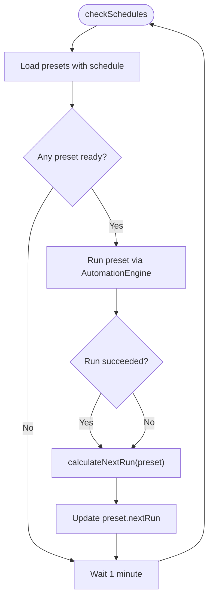
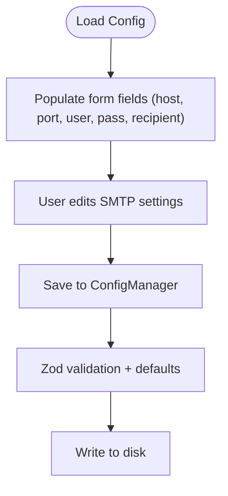
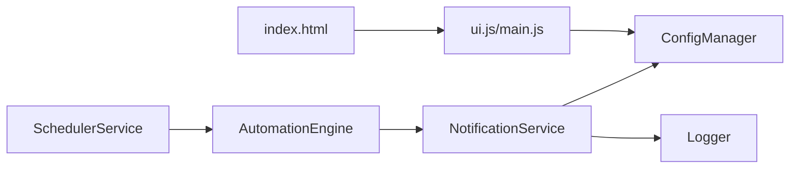

# Notifications System

<cite>
**Referenced Files in This Document**
- [NotificationService.ts](file://app/core/notifications/NotificationService.ts)
- [config-manager.ts](file://app/config/config-manager.ts)
- [logger.ts](file://app/config/logger.ts)
- [automation-engine.ts](file://app/automation/engine/automation-engine.ts)
- [scheduler-service.ts](file://app/automation/engine/scheduler-service.ts)
- [ui.js](file://app/renderer/modules/ui.js)
- [main.js](file://app/renderer/main.js)
- [index.html](file://app/renderer/index.html)
</cite>

## Table of Contents
1. [Introduction](#introduction)
2. [Project Structure](#project-structure)
3. [Core Components](#core-components)
4. [Architecture Overview](#architecture-overview)
5. [Detailed Component Analysis](#detailed-component-analysis)
6. [Dependency Analysis](#dependency-analysis)
7. [Performance Considerations](#performance-considerations)
8. [Troubleshooting Guide](#troubleshooting-guide)
9. [Conclusion](#conclusion)

## Introduction
This document provides comprehensive documentation for the Notifications System within the Automatizador Bravo project. It explains email notification integration via SMTP, configuration management, scheduling mechanisms, error reporting capabilities, and the integration with the automation workflow. It also covers practical examples for configuration, failure handling, and extending the system with custom notification channels, while addressing security considerations, rate limiting, and performance optimization for high-volume scenarios.

## Project Structure
The Notifications System is composed of:
- A centralized notification service that handles email delivery and automation summaries
- Configuration manager that validates and stores notification settings
- Logger infrastructure for robust error and operational logging
- Automation engine integration that triggers summary emails after preset executions
- Scheduler service that orchestrates automated runs and updates schedules
- Renderer UI components that expose SMTP configuration to users

**Diagram sources**
- [NotificationService.ts](file://app/core/notifications/NotificationService.ts#L1-L115)
- [config-manager.ts](file://app/config/config-manager.ts#L58-L78)
- [logger.ts](file://app/config/logger.ts#L1-L104)
- [automation-engine.ts](file://app/automation/engine/automation-engine.ts#L231-L237)
- [scheduler-service.ts](file://app/automation/engine/scheduler-service.ts#L101-L142)
- [ui.js](file://app/renderer/modules/ui.js#L260-L281)
- [main.js](file://app/renderer/main.js#L113-L135)
- [index.html](file://app/renderer/index.html#L350-L394)

**Section sources**
- [NotificationService.ts](file://app/core/notifications/NotificationService.ts#L1-L115)
- [config-manager.ts](file://app/config/config-manager.ts#L58-L78)
- [logger.ts](file://app/config/logger.ts#L1-L104)
- [automation-engine.ts](file://app/automation/engine/automation-engine.ts#L231-L237)
- [scheduler-service.ts](file://app/automation/engine/scheduler-service.ts#L101-L142)
- [ui.js](file://app/renderer/modules/ui.js#L260-L281)
- [main.js](file://app/renderer/main.js#L113-L135)
- [index.html](file://app/renderer/index.html#L350-L394)

## Core Components
- NotificationService: Singleton responsible for sending email notifications and generating automation execution summaries. It reads SMTP settings from the configuration manager and uses nodemailer to deliver messages. It logs successes and failures using the automation logger.
- ConfigManager: Validates and persists application configuration, including the notifications section with SMTP settings and recipient. It ensures defaults and sanitization for safe operation.
- Logger: Provides structured logging with Winston, including daily-rotated files and separate automation-specific logs for debugging and auditing.
- AutomationEngine: Executes presets and triggers a summary email upon completion by calling the notification service.
- SchedulerService: Manages scheduled runs, calculates next execution times, and updates preset schedules after each run.
- Renderer UI: Presents SMTP configuration fields, loads saved settings into the UI, and saves updated settings back to the configuration.

Key responsibilities:
- Email delivery: SMTP host/port/user/pass, subject formatting, HTML body generation for summaries
- Configuration: Validation, defaults, persistence, and environment-aware path resolution
- Logging: Debug, info, warn, and error levels with rotation and timestamps
- Automation integration: Triggering summary emails after successful or partial automation runs
- Scheduling: Interval-based and fixed-time scheduling with next-run updates

**Section sources**
- [NotificationService.ts](file://app/core/notifications/NotificationService.ts#L28-L70)
- [NotificationService.ts](file://app/core/notifications/NotificationService.ts#L75-L111)
- [config-manager.ts](file://app/config/config-manager.ts#L58-L78)
- [logger.ts](file://app/config/logger.ts#L63-L82)
- [automation-engine.ts](file://app/automation/engine/automation-engine.ts#L231-L237)
- [scheduler-service.ts](file://app/automation/engine/scheduler-service.ts#L101-L142)
- [ui.js](file://app/renderer/modules/ui.js#L260-L281)
- [main.js](file://app/renderer/main.js#L113-L135)

## Architecture Overview
The notification architecture integrates tightly with the automation lifecycle. The AutomationEngine coordinates runs and delegates summary delivery to NotificationService. NotificationService consults ConfigManager for SMTP settings and uses Logger for audit trails. SchedulerService manages timing and updates schedules post-execution.

**Diagram sources**
- [automation-engine.ts](file://app/automation/engine/automation-engine.ts#L231-L237)
- [NotificationService.ts](file://app/core/notifications/NotificationService.ts#L28-L70)
- [NotificationService.ts](file://app/core/notifications/NotificationService.ts#L75-L111)
- [config-manager.ts](file://app/config/config-manager.ts#L192-L212)
- [main.js](file://app/renderer/main.js#L113-L135)

## Detailed Component Analysis

### NotificationService
Responsibilities:
- Validate notification enablement and SMTP completeness
- Create nodemailer transport using configured SMTP settings
- Compose email options (from address, recipient, subject, text/html, attachments)
- Send email and log outcomes
- Generate HTML-based automation execution summaries with status tables

Implementation highlights:
- Singleton pattern ensures a single transport instance per process
- Graceful failure handling with detailed logging
- HTML summary template with dynamic rows for each site result
- Subject prefixing for easy identification in mailbox filters

**Diagram sources**
- [NotificationService.ts](file://app/core/notifications/NotificationService.ts#L13-L23)
- [NotificationService.ts](file://app/core/notifications/NotificationService.ts#L28-L70)
- [NotificationService.ts](file://app/core/notifications/NotificationService.ts#L75-L111)
- [config-manager.ts](file://app/config/config-manager.ts#L192-L212)
- [logger.ts](file://app/config/logger.ts#L63-L82)

**Section sources**
- [NotificationService.ts](file://app/core/notifications/NotificationService.ts#L28-L70)
- [NotificationService.ts](file://app/core/notifications/NotificationService.ts#L75-L111)

### ConfigManager (Notifications Schema)
Responsibilities:
- Define and validate the notifications configuration schema
- Provide defaults for SMTP host/port/secure and optional credentials
- Persist and load configuration safely with migration support

Key schema elements:
- notifications.enabled: toggle for notification delivery
- notifications.smtp: host, port, secure, user, pass
- notifications.recipient: default email recipient

**Diagram sources**
- [config-manager.ts](file://app/config/config-manager.ts#L58-L78)
- [config-manager.ts](file://app/config/config-manager.ts#L133-L190)

**Section sources**
- [config-manager.ts](file://app/config/config-manager.ts#L58-L78)
- [config-manager.ts](file://app/config/config-manager.ts#L133-L190)

### AutomationEngine Integration
Integration points:
- After automation completion, the engine calls NotificationService.sendAutomationSummary with the preset name and results array
- Errors during summary dispatch are caught and logged without failing the automation run

**Diagram sources**
- [automation-engine.ts](file://app/automation/engine/automation-engine.ts#L231-L237)
- [NotificationService.ts](file://app/core/notifications/NotificationService.ts#L75-L111)

**Section sources**
- [automation-engine.ts](file://app/automation/engine/automation-engine.ts#L231-L237)

### SchedulerService (Scheduling Mechanisms)
Responsibilities:
- Periodically checks scheduled presets and attempts to run them
- Calculates next run time based on interval or fixed times modes
- Updates preset schedule with nextRun timestamp after each attempt

**Diagram sources**
- [scheduler-service.ts](file://app/automation/engine/scheduler-service.ts#L38-L96)
- [scheduler-service.ts](file://app/automation/engine/scheduler-service.ts#L101-L142)

**Section sources**
- [scheduler-service.ts](file://app/automation/engine/scheduler-service.ts#L38-L96)
- [scheduler-service.ts](file://app/automation/engine/scheduler-service.ts#L101-L142)

### UI Configuration and Templates
The UI exposes SMTP configuration fields and provides helpful hints for Gmail setup. It loads saved settings into form controls and persists updates to the configuration.

**Diagram sources**
- [ui.js](file://app/renderer/modules/ui.js#L260-L281)
- [main.js](file://app/renderer/main.js#L113-L135)
- [index.html](file://app/renderer/index.html#L350-L394)

**Section sources**
- [ui.js](file://app/renderer/modules/ui.js#L260-L281)
- [main.js](file://app/renderer/main.js#L113-L135)
- [index.html](file://app/renderer/index.html#L350-L394)

## Dependency Analysis
The notification system exhibits low coupling and high cohesion:
- NotificationService depends on ConfigManager for configuration and Logger for auditing
- AutomationEngine depends on NotificationService for post-run summaries
- SchedulerService orchestrates runs and indirectly influences notification frequency
- UI components depend on ConfigManager for loading and saving settings

Potential risks:
- Single SMTP transport instance per process could be extended to support multiple providers
- No built-in rate limiting or retry policies for SMTP delivery
- HTML templates are embedded in code; consider externalizing for easier customization

**Diagram sources**
- [automation-engine.ts](file://app/automation/engine/automation-engine.ts#L231-L237)
- [NotificationService.ts](file://app/core/notifications/NotificationService.ts#L28-L70)
- [scheduler-service.ts](file://app/automation/engine/scheduler-service.ts#L38-L96)
- [config-manager.ts](file://app/config/config-manager.ts#L192-L212)
- [logger.ts](file://app/config/logger.ts#L63-L82)
- [ui.js](file://app/renderer/modules/ui.js#L260-L281)
- [main.js](file://app/renderer/main.js#L113-L135)
- [index.html](file://app/renderer/index.html#L350-L394)

**Section sources**
- [automation-engine.ts](file://app/automation/engine/automation-engine.ts#L231-L237)
- [NotificationService.ts](file://app/core/notifications/NotificationService.ts#L28-L70)
- [scheduler-service.ts](file://app/automation/engine/scheduler-service.ts#L38-L96)
- [config-manager.ts](file://app/config/config-manager.ts#L192-L212)
- [logger.ts](file://app/config/logger.ts#L63-L82)
- [ui.js](file://app/renderer/modules/ui.js#L260-L281)
- [main.js](file://app/renderer/main.js#L113-L135)
- [index.html](file://app/renderer/index.html#L350-L394)

## Performance Considerations
- Email delivery latency: SMTP operations are asynchronous and can block the automation thread briefly; consider offloading to a queue for high-volume scenarios
- HTML rendering: Large result sets increase HTML payload size; paginate or summarize results for very large runs
- Logging overhead: Daily rotation is efficient, but excessive debug logs can impact performance; tune log levels accordingly
- Scheduler cadence: Running checks every minute is lightweight; avoid overly frequent polling if not needed
- Resource cleanup: Ensure browser contexts and sessions are closed promptly to free memory and CPU

[No sources needed since this section provides general guidance]

## Troubleshooting Guide
Common issues and resolutions:
- Notifications not sent:
  - Verify notifications.enabled is true
  - Confirm SMTP user and pass are set
  - Check automation logs for "[Notification] Configuração SMTP incompleta." or "[Notification] Falha ao enviar e-mail"
- Delivery failures:
  - Review SMTP server logs and network connectivity
  - Validate credentials and port/security settings
  - Inspect automation logs for error messages
- Configuration not persisting:
  - Ensure UI saves settings via main.js and ConfigManager persists to disk
  - Check for validation errors during save
- Scheduler not triggering:
  - Confirm schedulerEnabled and preset schedule settings
  - Verify nextRun timestamps are being updated

Operational tips:
- Use automationLogger to trace notification lifecycle
- Enable appropriate log levels for debugging SMTP issues
- Monitor daily-rotated log files for recurring errors

**Section sources**
- [NotificationService.ts](file://app/core/notifications/NotificationService.ts#L32-L41)
- [NotificationService.ts](file://app/core/notifications/NotificationService.ts#L66-L69)
- [logger.ts](file://app/config/logger.ts#L63-L82)
- [main.js](file://app/renderer/main.js#L113-L135)
- [config-manager.ts](file://app/config/config-manager.ts#L196-L212)

## Conclusion
The Notifications System provides a focused, reliable mechanism for delivering automation summaries via email. Its integration with the automation engine and scheduler ensures timely reporting of execution outcomes. While currently email-centric, the architecture supports extension to additional channels through NotificationService abstractions. For production deployments, consider adding rate limiting, retry policies, and externalized templates to scale effectively.