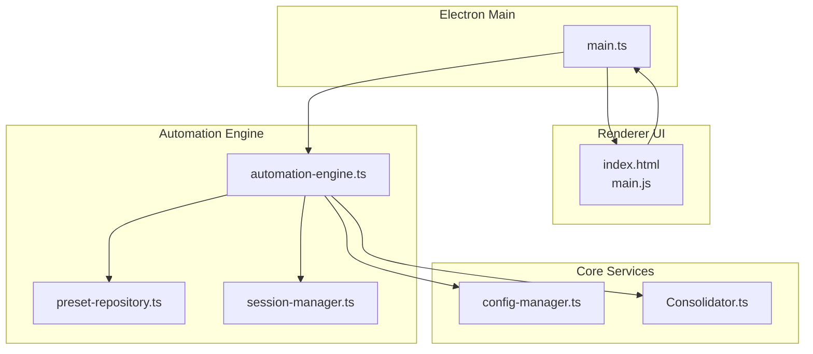
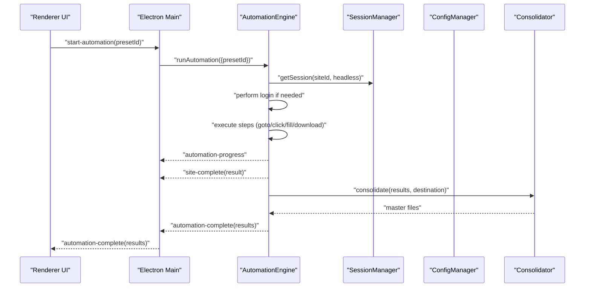
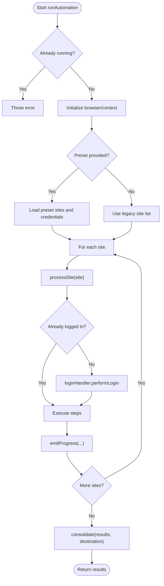
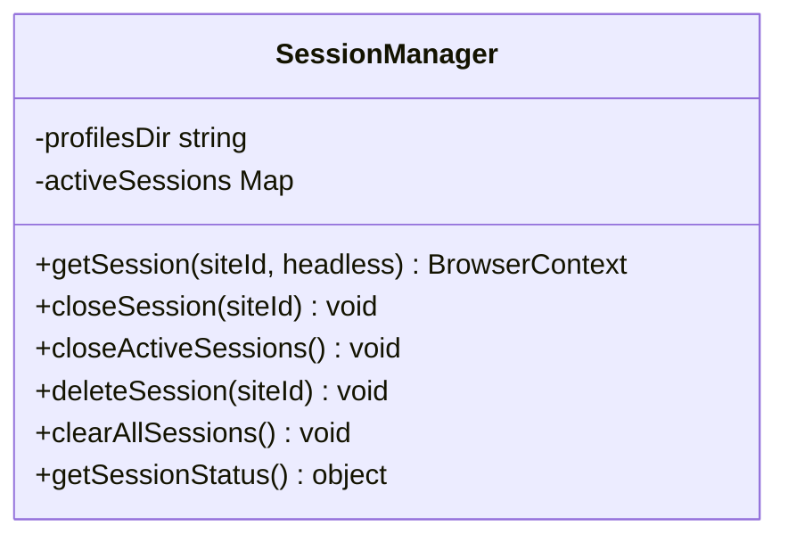
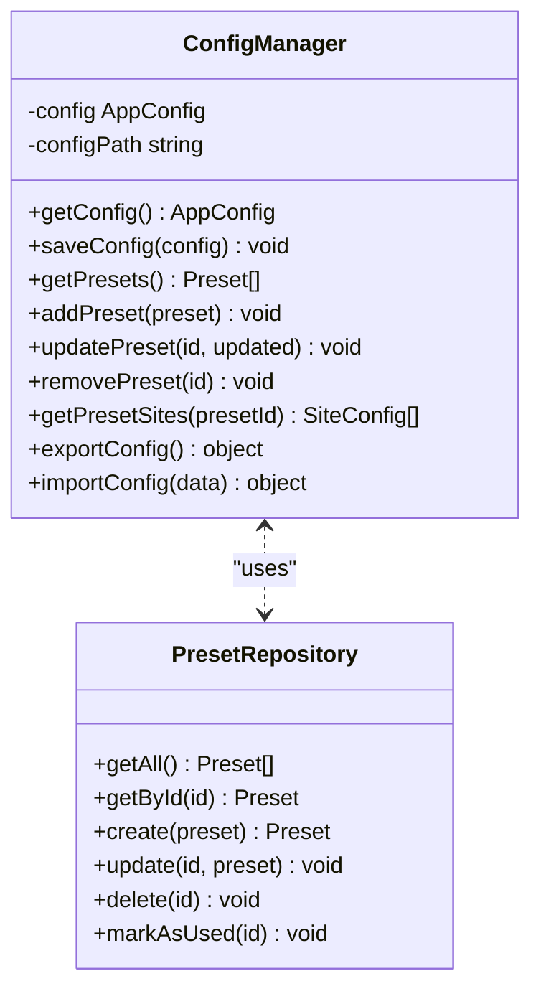
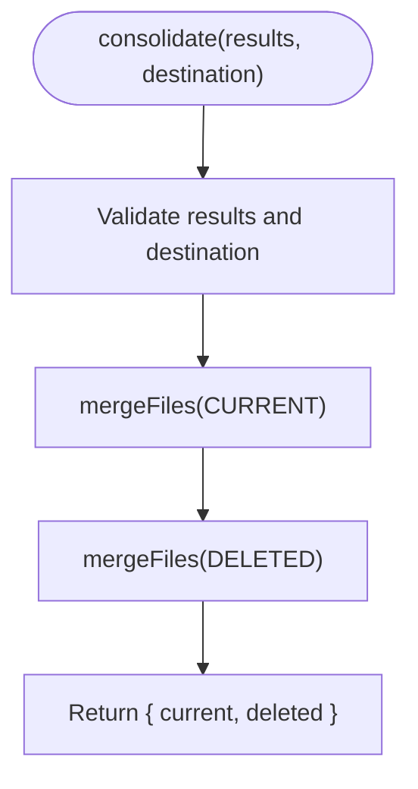
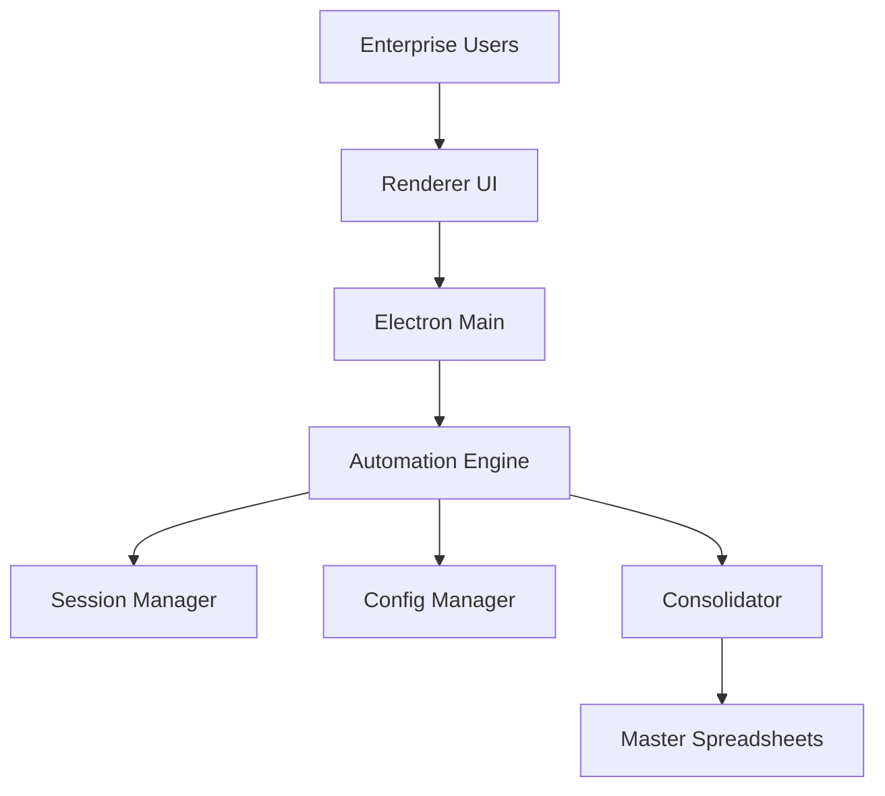
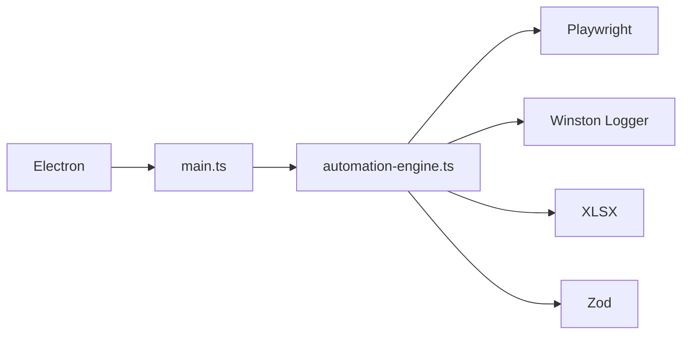

# Introduction

<cite>
**Referenced Files in This Document**
- [README](file://README)
- [VISÃO GERAL DO PROJETO.MD](file://VISÃO GERAL DO PROJETO.MD)
- [package.json](file://package.json)
- [app/electron/main.ts](file://app/electron/main.ts)
- [app/automation/engine/automation-engine.ts](file://app/automation/engine/automation-engine.ts)
- [app/automation/engine/preset-repository.ts](file://app/automation/engine/preset-repository.ts)
- [app/automation/sessions/session-manager.ts](file://app/automation/sessions/session-manager.ts)
- [app/core/consolidation/Consolidator.ts](file://app/core/consolidation/Consolidator.ts)
- [app/config/config-manager.ts](file://app/config/config-manager.ts)
- [app/renderer/index.html](file://app/renderer/index.html)
- [app/renderer/main.js](file://app/renderer/main.js)
- [docs/FASE 3 — CORE DE AUTOMAÇÃO (PARTE MAIS IMPORTANTE).md](file://docs/FASE 3 — CORE DE AUTOMAÇÃO (PARTE MAIS IMPORTANTE).md)
- [app/config/app-config.json](file://app/config/app-config.json)
</cite>

## Table of Contents
1. [Introduction](#introduction)
2. [Project Structure](#project-structure)
3. [Core Components](#core-components)
4. [Architecture Overview](#architecture-overview)
5. [Detailed Component Analysis](#detailed-component-analysis)
6. [Dependency Analysis](#dependency-analysis)
7. [Performance Considerations](#performance-considerations)
8. [Troubleshooting Guide](#troubleshooting-guide)
9. [Conclusion](#conclusion)
10. [Appendices](#appendices)

## Introduction
Automatizador Bravo is an enterprise-grade web automation system built for Windows 11. It is designed to eliminate repetitive, manual tasks across multiple ERP systems by automating workflows that would otherwise require hours of human intervention. The project targets organizations that operate across multiple subsidiaries or states, where each site uses a similar ERP platform but requires distinct login credentials, navigation steps, and reporting exports.

Key problem it solves:
- Manual, time-consuming data extraction from multiple ERP websites
- Inconsistent reporting across subsidiaries due to fragmented, ad-hoc processes
- Risk of human error during repetitive tasks
- Lack of centralized visibility and audit trails for cross-site operations

How it helps:
- Automates login, navigation, date range selection, and file downloads across multiple sites
- Consolidates results into master spreadsheets for cross-site comparison and auditing
- Provides a safe snapshot policy to track additions and deletions in reports
- Offers scheduling and notifications to keep operations predictable and transparent
- Delivers a modern desktop application with a responsive UI for configuration and monitoring

Who it’s for:
- Enterprise teams managing multiple subsidiaries or regional branches
- Finance, procurement, and reporting departments requiring standardized, repeatable processes
- Organizations seeking to reduce operational costs and improve compliance through automation

Mission statement:
> “To deliver a reliable, scalable, and auditable web automation solution that transforms repetitive ERP tasks into automated, traceable, and consolidated workflows across multiple sites.”

## Project Structure
Automatizador Bravo is a desktop application built with Electron and Node.js, combining a robust automation engine with a modern UI. The repository is organized into logical layers:

- Electron main process orchestrates the app lifecycle, tray, IPC handlers, and scheduling
- Renderer UI manages configuration, presets, sessions, and real-time feedback
- Automation engine executes browser-based steps, handles sessions, and tracks progress
- Configuration manager validates and persists presets, sites, and global settings
- Consolidation service merges results into master spreadsheets
- Storage and profiles manage persistent browser contexts and cached data

**Diagram sources**
- [app/electron/main.ts](file://app/electron/main.ts#L1-L387)
- [app/renderer/index.html](file://app/renderer/index.html#L1-L640)
- [app/renderer/main.js](file://app/renderer/main.js#L1-L182)
- [app/automation/engine/automation-engine.ts](file://app/automation/engine/automation-engine.ts#L1-L611)
- [app/automation/engine/preset-repository.ts](file://app/automation/engine/preset-repository.ts#L1-L34)
- [app/automation/sessions/session-manager.ts](file://app/automation/sessions/session-manager.ts#L1-L225)
- [app/config/config-manager.ts](file://app/config/config-manager.ts#L1-L408)
- [app/core/consolidation/Consolidator.ts](file://app/core/consolidation/Consolidator.ts#L1-L138)

**Section sources**
- [package.json](file://package.json#L1-L133)
- [VISÃO GERAL DO PROJETO.MD](file://VISÃO GERAL DO PROJETO.MD#L1-L21)

## Core Components
- Electron main process: Initializes the app, tray, IPC channels, and scheduler; exposes APIs for UI to control automation and sessions
- Automation engine: Executes browser steps, manages sessions, emits progress, and coordinates consolidation
- Session manager: Launches persistent browser contexts per site to preserve cookies and state
- Preset repository: Manages isolated groups of sites and credentials for repeatable runs
- Configuration manager: Validates and stores presets, sites, and global settings with migration support
- Consolidation service: Merges results into master spreadsheets for cross-site auditing
- Renderer UI: Presents configuration panels, status dashboards, and real-time logs

Key benefits:
- Isolation via presets ensures credentials and site configurations remain separate and secure
- Headless operation reduces resource overhead while still allowing visibility when needed
- Built-in safety nets: timeouts, retries, and session re-authentication prevent failures from cascading
- Audit-ready outputs: consolidated spreadsheets and snapshot policies enable compliance and reconciliation

**Section sources**
- [app/electron/main.ts](file://app/electron/main.ts#L116-L281)
- [app/automation/engine/automation-engine.ts](file://app/automation/engine/automation-engine.ts#L50-L238)
- [app/automation/sessions/session-manager.ts](file://app/automation/sessions/session-manager.ts#L67-L138)
- [app/automation/engine/preset-repository.ts](file://app/automation/engine/preset-repository.ts#L4-L32)
- [app/config/config-manager.ts](file://app/config/config-manager.ts#L85-L190)
- [app/core/consolidation/Consolidator.ts](file://app/core/consolidation/Consolidator.ts#L20-L63)
- [app/renderer/index.html](file://app/renderer/index.html#L80-L158)

## Architecture Overview
The system follows a layered architecture:
- UI layer (renderer) communicates with the main process via IPC
- Main process exposes handlers for automation control, configuration, and session management
- Automation engine coordinates Playwright sessions, executes steps, and emits progress events
- Configuration manager and preset repository provide validated, persisted state
- Consolidation service aggregates results into master files

**Diagram sources**
- [app/electron/main.ts](file://app/electron/main.ts#L214-L241)
- [app/automation/engine/automation-engine.ts](file://app/automation/engine/automation-engine.ts#L62-L238)
- [app/automation/sessions/session-manager.ts](file://app/automation/sessions/session-manager.ts#L103-L138)
- [app/core/consolidation/Consolidator.ts](file://app/core/consolidation/Consolidator.ts#L26-L63)

## Detailed Component Analysis

### Automation Engine
The engine is the core of the system. It:
- Validates inputs and prepares execution context
- Manages sessions per site and re-authenticates when needed
- Executes configurable steps (navigation, form filling, downloads)
- Emits progress updates and completion events
- Consolidates results into master spreadsheets
- Sends notifications upon completion

**Diagram sources**
- [app/automation/engine/automation-engine.ts](file://app/automation/engine/automation-engine.ts#L62-L238)

**Section sources**
- [app/automation/engine/automation-engine.ts](file://app/automation/engine/automation-engine.ts#L50-L238)

### Session Manager
Ensures persistent browser contexts per site to maintain login state and reduce repeated authentication overhead. It also auto-installs and manages Playwright browsers in a dedicated path.

**Diagram sources**
- [app/automation/sessions/session-manager.ts](file://app/automation/sessions/session-manager.ts#L67-L225)

**Section sources**
- [app/automation/sessions/session-manager.ts](file://app/automation/sessions/session-manager.ts#L67-L138)

### Configuration Manager and Presets
Presets encapsulate site lists, credentials, and destinations, enabling isolated, repeatable automation runs. The configuration manager validates inputs, migrates legacy data, and supports import/export.

**Diagram sources**
- [app/config/config-manager.ts](file://app/config/config-manager.ts#L85-L398)
- [app/automation/engine/preset-repository.ts](file://app/automation/engine/preset-repository.ts#L4-L32)

**Section sources**
- [app/config/config-manager.ts](file://app/config/config-manager.ts#L85-L190)
- [app/automation/engine/preset-repository.ts](file://app/automation/engine/preset-repository.ts#L4-L32)

### Consolidation Service
Consolidator merges results from multiple sites into master spreadsheets, adding provenance metadata for traceability.

**Diagram sources**
- [app/core/consolidation/Consolidator.ts](file://app/core/consolidation/Consolidator.ts#L26-L63)

**Section sources**
- [app/core/consolidation/Consolidator.ts](file://app/core/consolidation/Consolidator.ts#L20-L63)

### Conceptual Overview
The system is designed to be:
- Enterprise-grade: persistent sessions, scheduled runs, notifications, and audit-ready outputs
- Extensible: new sites and workflows can be added via presets and configuration
- Reliable: timeouts, retries, and re-authentication guard against transient failures
- Transparent: real-time progress, logs, and UI dashboards

[No sources needed since this diagram shows conceptual workflow, not actual code structure]

[No sources needed since this section doesn't analyze specific source files]

## Dependency Analysis
External libraries and integrations:
- Playwright for browser automation and persistent contexts
- Electron for desktop app lifecycle and IPC
- Winston for logging
- XLSX for spreadsheet consolidation
- Zod for runtime configuration validation

**Diagram sources**
- [package.json](file://package.json#L94-L113)
- [app/electron/main.ts](file://app/electron/main.ts#L1-L10)
- [app/automation/engine/automation-engine.ts](file://app/automation/engine/automation-engine.ts#L1-L12)

**Section sources**
- [package.json](file://package.json#L94-L113)

## Performance Considerations
- Headless mode reduces CPU and memory usage; toggleable via configuration
- Persistent sessions minimize repeated logins and improve throughput
- Timeouts and retries balance reliability with responsiveness
- Consolidation batches results to reduce I/O overhead
- Auto-launch and tray integration enable unattended operation

[No sources needed since this section provides general guidance]

## Troubleshooting Guide
Common issues and resolutions:
- Build errors due to locked files: ensure the app is closed and remove the release directory before rebuilding
- Session conflicts: clear sessions or delete specific site profiles to reset state
- Browser installation problems: the system auto-installs Chromium if missing; verify permissions and network connectivity
- Login failures: use the manual login browser to resolve captchas or re-authenticate

**Section sources**
- [README](file://README#L25-L29)
- [app/electron/main.ts](file://app/electron/main.ts#L183-L196)
- [app/automation/sessions/session-manager.ts](file://app/automation/sessions/session-manager.ts#L13-L65)

## Conclusion
Automatizador Bravo delivers a practical, enterprise-ready solution for automating repetitive ERP tasks across multiple websites. By combining a robust automation engine, persistent sessions, and consolidated reporting, it enables organizations to reduce manual effort, improve accuracy, and maintain audit trails. Its modular architecture and UI make it easy to configure, monitor, and extend for evolving business needs.

[No sources needed since this section summarizes without analyzing specific files]

## Appendices

### How It Works in Practice
- Configure presets with site URLs, selectors, and steps
- Run automation from the UI or schedule it to execute automatically
- Monitor progress in real time and review consolidated outputs
- Use export/import to share configurations across environments

**Section sources**
- [docs/FASE 3 — CORE DE AUTOMAÇÃO (PARTE MAIS IMPORTANTE).md](file://docs/FASE 3 — CORE DE AUTOMAÇÃO (PARTE MAIS IMPORTANTE).md#L1-L27)
- [app/config/app-config.json](file://app/config/app-config.json#L1-L800)
- [app/renderer/index.html](file://app/renderer/index.html#L80-L158)