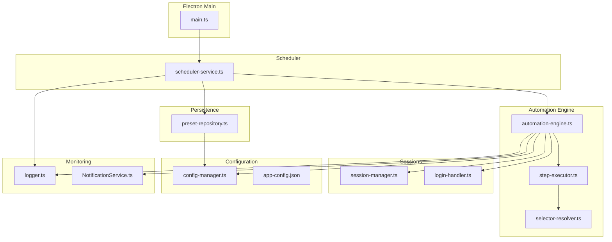
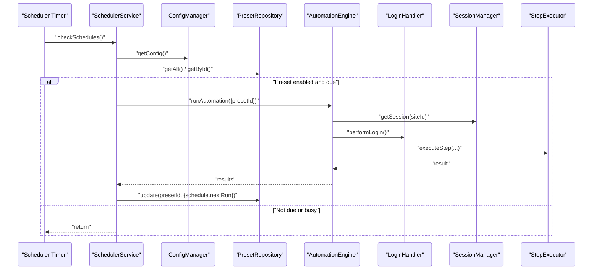
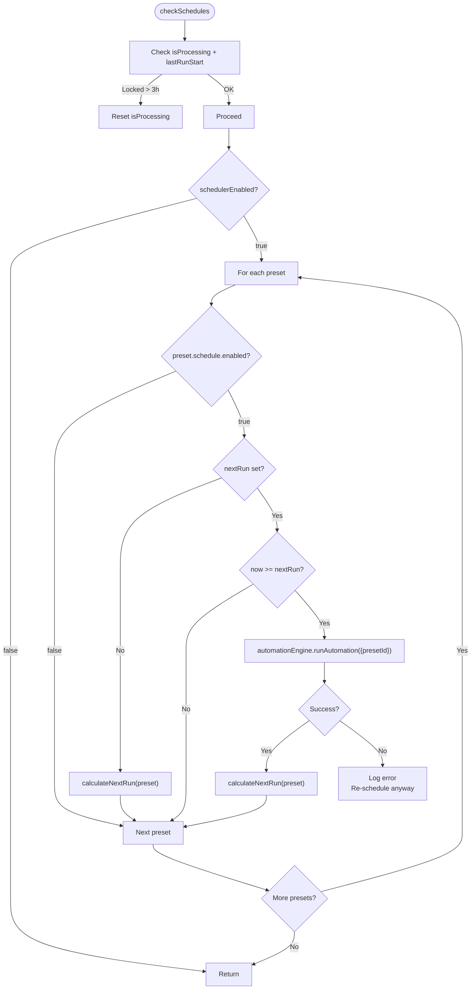
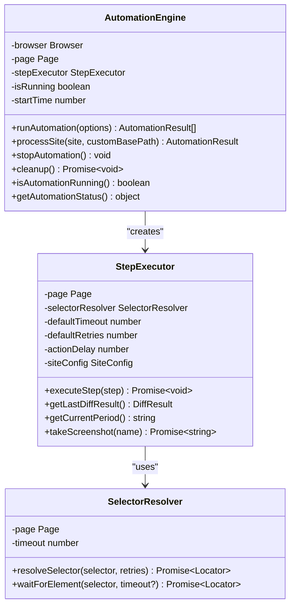
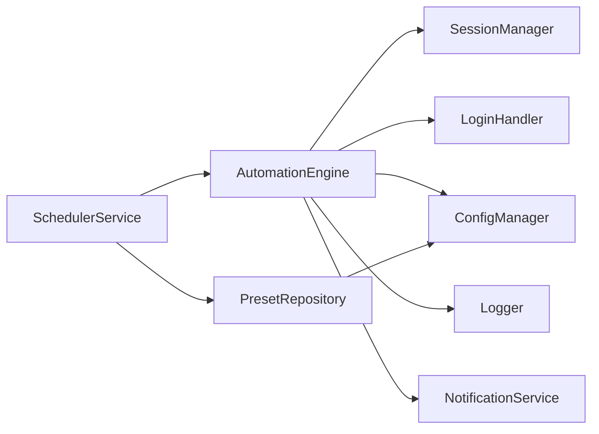

# Automated Scheduling System

<cite>
**Referenced Files in This Document**
- [scheduler-service.ts](file://app/automation/engine/scheduler-service.ts)
- [preset-repository.ts](file://app/automation/engine/preset-repository.ts)
- [automation-engine.ts](file://app/automation/engine/automation-engine.ts)
- [step-executor.ts](file://app/automation/engine/step-executor.ts)
- [selector-resolver.ts](file://app/automation/engine/selector-resolver.ts)
- [config-manager.ts](file://app/config/config-manager.ts)
- [app-config.json](file://app/config/app-config.json)
- [session-manager.ts](file://app/automation/sessions/session-manager.ts)
- [login-handler.ts](file://app/automation/sessions/login-handler.ts)
- [logger.ts](file://app/config/logger.ts)
- [NotificationService.ts](file://app/core/notifications/NotificationService.ts)
- [main.ts](file://app/electron/main.ts)
</cite>

## Table of Contents
1. [Introduction](#introduction)
2. [Project Structure](#project-structure)
3. [Core Components](#core-components)
4. [Architecture Overview](#architecture-overview)
5. [Detailed Component Analysis](#detailed-component-analysis)
6. [Dependency Analysis](#dependency-analysis)
7. [Performance Considerations](#performance-considerations)
8. [Troubleshooting Guide](#troubleshooting-guide)
9. [Conclusion](#conclusion)
10. [Appendices](#appendices)

## Introduction
This document describes the automated scheduling system that powers the application's background execution of predefined automation workflows. It covers how the scheduler monitors and triggers executions based on interval or fixed-time schedules, how the automation engine executes browser-based steps, how the preset repository manages configuration persistence, and how recovery mechanisms prevent system lockups. It also documents monitoring capabilities, performance characteristics, error handling, and integration with the broader automation system.

## Project Structure
The scheduling system spans several modules:
- Scheduler service: periodic checks and trigger logic
- Automation engine: browser orchestration and step execution
- Preset repository: configuration persistence for presets
- Session management: persistent browser contexts and login handling
- Configuration manager: typed configuration with Zod validation
- Logging and notifications: structured logging and email summaries
- Electron main process: lifecycle management and IPC handlers

**Diagram sources**
- [main.ts](file://app/electron/main.ts#L371-L372)
- [scheduler-service.ts](file://app/automation/engine/scheduler-service.ts#L16-L23)
- [automation-engine.ts](file://app/automation/engine/automation-engine.ts#L62-L238)
- [step-executor.ts](file://app/automation/engine/step-executor.ts#L59-L110)
- [selector-resolver.ts](file://app/automation/engine/selector-resolver.ts#L17-L48)
- [session-manager.ts](file://app/automation/sessions/session-manager.ts#L103-L138)
- [login-handler.ts](file://app/automation/sessions/login-handler.ts#L28-L77)
- [config-manager.ts](file://app/config/config-manager.ts#L216-L256)
- [app-config.json](file://app/config/app-config.json#L1-L10)
- [preset-repository.ts](file://app/automation/engine/preset-repository.ts#L4-L32)
- [logger.ts](file://app/config/logger.ts#L16-L60)
- [NotificationService.ts](file://app/core/notifications/NotificationService.ts#L28-L70)

**Section sources**
- [main.ts](file://app/electron/main.ts#L355-L380)
- [scheduler-service.ts](file://app/automation/engine/scheduler-service.ts#L1-L145)
- [automation-engine.ts](file://app/automation/engine/automation-engine.ts#L1-L611)

## Core Components
- Scheduler service: runs every minute, evaluates preset schedules, and triggers automation runs with watchdog protection against long-running locks.
- Automation engine: orchestrates browser sessions, performs login, executes steps, handles reauthentication, and consolidates results.
- Preset repository: CRUD operations for presets and schedule updates.
- Session manager: persistent browser contexts per site with profile migration and cleanup.
- Login handler: automatic login, captcha detection, manual intervention, and reauthentication.
- Configuration manager: typed configuration with Zod validation, presets isolation, and migration logic.
- Logging and notifications: structured logging and optional email summaries.

**Section sources**
- [scheduler-service.ts](file://app/automation/engine/scheduler-service.ts#L6-L145)
- [automation-engine.ts](file://app/automation/engine/automation-engine.ts#L50-L608)
- [preset-repository.ts](file://app/automation/engine/preset-repository.ts#L4-L32)
- [session-manager.ts](file://app/automation/sessions/session-manager.ts#L67-L225)
- [login-handler.ts](file://app/automation/sessions/login-handler.ts#L13-L364)
- [config-manager.ts](file://app/config/config-manager.ts#L85-L408)
- [logger.ts](file://app/config/logger.ts#L16-L104)
- [NotificationService.ts](file://app/core/notifications/NotificationService.ts#L13-L115)

## Architecture Overview
The scheduler runs continuously and checks each preset's schedule every minute. When a preset is due, it invokes the automation engine. The engine manages browser contexts, performs login, executes steps, and emits progress events. The scheduler persists next run timestamps to the preset configuration to avoid drift.

**Diagram sources**
- [scheduler-service.ts](file://app/automation/engine/scheduler-service.ts#L38-L96)
- [automation-engine.ts](file://app/automation/engine/automation-engine.ts#L62-L238)
- [login-handler.ts](file://app/automation/sessions/login-handler.ts#L28-L77)
- [session-manager.ts](file://app/automation/sessions/session-manager.ts#L103-L138)
- [step-executor.ts](file://app/automation/engine/step-executor.ts#L59-L110)
- [preset-repository.ts](file://app/automation/engine/preset-repository.ts#L20-L22)
- [config-manager.ts](file://app/config/config-manager.ts#L192-L206)

## Detailed Component Analysis

### Scheduler Service
The scheduler periodically evaluates presets and triggers automation runs. It includes:
- Periodic polling every minute
- Global pause flag
- Watchdog to recover from long-running locks (>3 hours)
- Next-run calculation for interval and fixed modes
- Error handling and re-scheduling on failures

**Diagram sources**
- [scheduler-service.ts](file://app/automation/engine/scheduler-service.ts#L38-L96)
- [scheduler-service.ts](file://app/automation/engine/scheduler-service.ts#L101-L142)

Key behaviors:
- Interval mode adds hours to current time
- Fixed mode selects the next scheduled time of day and advances to tomorrow if needed
- On engine busy errors, it defers to the next cycle
- On exceptions, it still updates nextRun to prevent infinite failure loops

**Section sources**
- [scheduler-service.ts](file://app/automation/engine/scheduler-service.ts#L16-L96)
- [scheduler-service.ts](file://app/automation/engine/scheduler-service.ts#L101-L142)

### Automation Engine
The automation engine coordinates browser sessions, login, and step execution:
- Prevents concurrent runs with a guard
- Supports preset isolation (sites bundled inside a preset)
- Manages timeouts and cleanup
- Emits progress events and site completion events
- Performs reauthentication when sessions expire
- Consolidates results and sends email summaries

**Diagram sources**
- [automation-engine.ts](file://app/automation/engine/automation-engine.ts#L50-L608)
- [step-executor.ts](file://app/automation/engine/step-executor.ts#L25-L616)
- [selector-resolver.ts](file://app/automation/engine/selector-resolver.ts#L4-L135)

Operational highlights:
- Global timeout of 2 hours to prevent indefinite hangs
- Progress events sent to Electron windows for UI updates
- Automatic reauthentication when session expires during execution
- Consolidation of results and optional email summaries

**Section sources**
- [automation-engine.ts](file://app/automation/engine/automation-engine.ts#L62-L238)
- [automation-engine.ts](file://app/automation/engine/automation-engine.ts#L262-L446)
- [automation-engine.ts](file://app/automation/engine/automation-engine.ts#L548-L556)

### Preset Repository
The preset repository encapsulates CRUD operations for presets and schedule updates:
- Get all presets, get by id, create, update, delete
- Mark preset as used (updates lastUsedAt)
- Schedule updates persisted to preset configuration

**Section sources**
- [preset-repository.ts](file://app/automation/engine/preset-repository.ts#L4-L32)

### Configuration Manager
The configuration manager provides:
- Typed configuration with Zod validation
- Preset isolation (sites stored within presets)
- Migration logic for legacy configurations
- Path resolution and environment variable substitution
- Export/import of configuration sets

**Section sources**
- [config-manager.ts](file://app/config/config-manager.ts#L85-L408)
- [app-config.json](file://app/config/app-config.json#L1-L10)

### Session Management and Login Handler
Session management:
- Persistent browser contexts per site
- Profile migration and cleanup
- Auto-installation of Playwright browsers if missing

Login handler:
- Automatic login with credential injection
- Captcha detection and manual intervention
- Reauthentication when sessions expire

**Section sources**
- [session-manager.ts](file://app/automation/sessions/session-manager.ts#L67-L225)
- [login-handler.ts](file://app/automation/sessions/login-handler.ts#L13-L364)

### Monitoring and Notifications
Logging:
- Structured Winston loggers with daily rotation
- Separate loggers for automation and sessions
- Environment-controlled log levels

Notifications:
- Optional SMTP-based email summaries
- HTML-formatted summaries per preset execution

**Section sources**
- [logger.ts](file://app/config/logger.ts#L16-L104)
- [NotificationService.ts](file://app/core/notifications/NotificationService.ts#L13-L115)

## Dependency Analysis
The scheduler depends on the automation engine and preset repository. The automation engine depends on session management, login handling, and configuration. Logging and notifications are cross-cutting concerns.

**Diagram sources**
- [scheduler-service.ts](file://app/automation/engine/scheduler-service.ts#L1-L5)
- [automation-engine.ts](file://app/automation/engine/automation-engine.ts#L1-L12)
- [preset-repository.ts](file://app/automation/engine/preset-repository.ts#L1-L2)
- [session-manager.ts](file://app/automation/sessions/session-manager.ts#L1-L10)
- [login-handler.ts](file://app/automation/sessions/login-handler.ts#L1-L9)
- [config-manager.ts](file://app/config/config-manager.ts#L1-L10)
- [logger.ts](file://app/config/logger.ts#L1-L10)
- [NotificationService.ts](file://app/core/notifications/NotificationService.ts#L1-L3)

**Section sources**
- [scheduler-service.ts](file://app/automation/engine/scheduler-service.ts#L1-L5)
- [automation-engine.ts](file://app/automation/engine/automation-engine.ts#L1-L12)

## Performance Considerations
- Polling interval: 1 minute ensures timely execution without excessive CPU usage.
- Global timeout: 2 hours prevents resource leaks from stuck executions.
- Watchdog: resets processing state after 3 hours to recover from unexpected locks.
- Browser contexts: persistent contexts reduce cold start overhead.
- Logging rotation: prevents disk growth and maintains manageable log sizes.
- Action delays and retries: configurable to balance reliability and speed.

[No sources needed since this section provides general guidance]

## Troubleshooting Guide
Common scenarios and remedies:
- Scheduler not triggering:
  - Verify schedulerEnabled flag in configuration.
  - Confirm preset schedule.enabled and fixedTimes/intervalHours are set.
  - Check logs for watchdog resets indicating long-running locks.
- Engine busy errors:
  - The scheduler defers execution until the next cycle; ensure no concurrent runs.
- Login failures or CAPTCHA:
  - Switch to visible mode for manual intervention.
  - Verify credentials and selectors in the preset.
- Session expiration during execution:
  - The engine attempts reauthentication automatically; if context closed, restart the automation.
- Long-running locks:
  - The watchdog resets processing state after 3 hours; investigate logs around the lock time.
- Email notifications:
  - Ensure SMTP configuration is complete and recipient is set.

**Section sources**
- [scheduler-service.ts](file://app/automation/engine/scheduler-service.ts#L38-L96)
- [automation-engine.ts](file://app/automation/engine/automation-engine.ts#L561-L571)
- [login-handler.ts](file://app/automation/sessions/login-handler.ts#L288-L360)
- [NotificationService.ts](file://app/core/notifications/NotificationService.ts#L28-L70)

## Conclusion
The automated scheduling system provides robust, fault-tolerant background execution of browser-based automations. It supports both interval-based and fixed-time scheduling, integrates tightly with preset-driven configuration, and includes comprehensive monitoring and recovery mechanisms. The architecture cleanly separates concerns across scheduler, engine, sessions, and configuration, enabling maintainability and scalability.

[No sources needed since this section summarizes without analyzing specific files]

## Appendices

### Practical Examples

- Schedule configuration (interval mode):
  - Enable preset schedule and set intervalHours (e.g., 3).
  - The scheduler adds intervalHours to the current time for nextRun.

- Schedule configuration (fixed mode):
  - Enable preset schedule and set fixedTimes (e.g., ["07:00","12:30","18:30"]).
  - The scheduler selects the next time of day; if none remains today, it advances to tomorrow.

- Execution monitoring:
  - Progress events are emitted and forwarded to Electron windows for UI updates.
  - Site completion events are sent per site to update tables in real time.

- Recovery procedures:
  - If the engine is busy, the scheduler defers execution to the next cycle.
  - If an exception occurs, the scheduler still updates nextRun to avoid infinite failure loops.
  - A 3-hour watchdog resets processing state if the scheduler appears locked.

- Integration with broader automation system:
  - Electron main process starts the scheduler and exposes IPC handlers for UI control.
  - Automation results include consolidated diffs and optional SSP metadata for audit trails.

**Section sources**
- [scheduler-service.ts](file://app/automation/engine/scheduler-service.ts#L101-L142)
- [automation-engine.ts](file://app/automation/engine/automation-engine.ts#L157-L162)
- [main.ts](file://app/electron/main.ts#L371-L372)