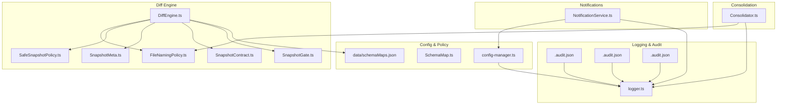
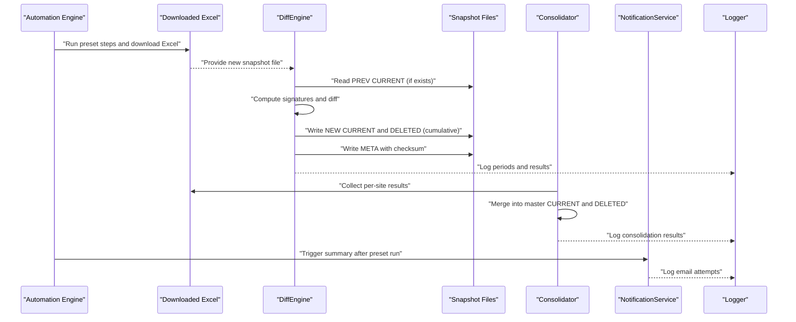
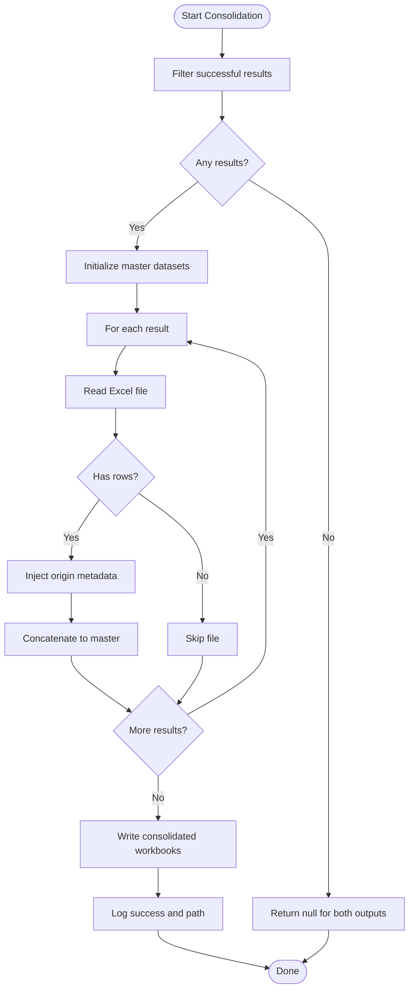
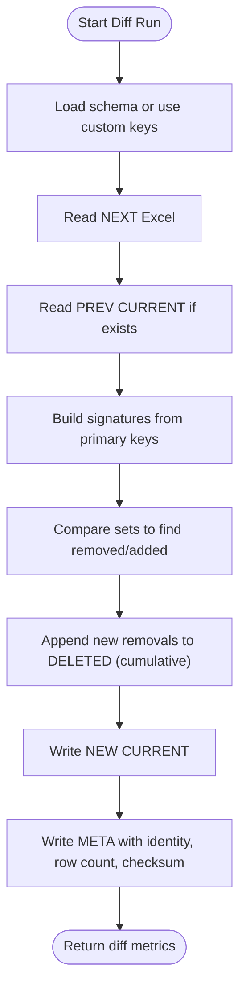
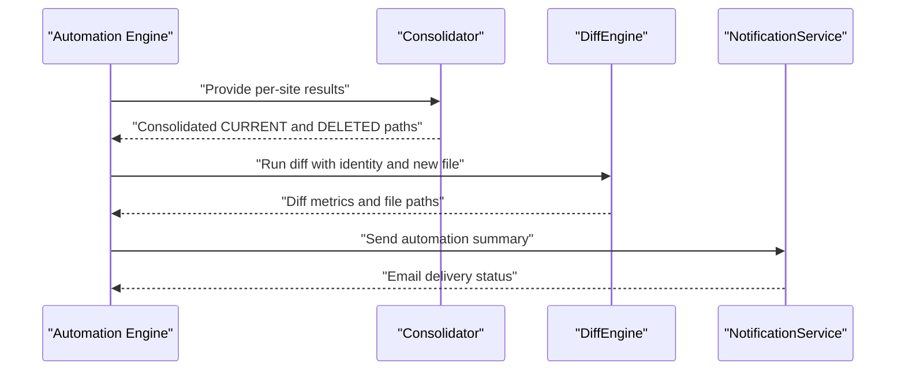
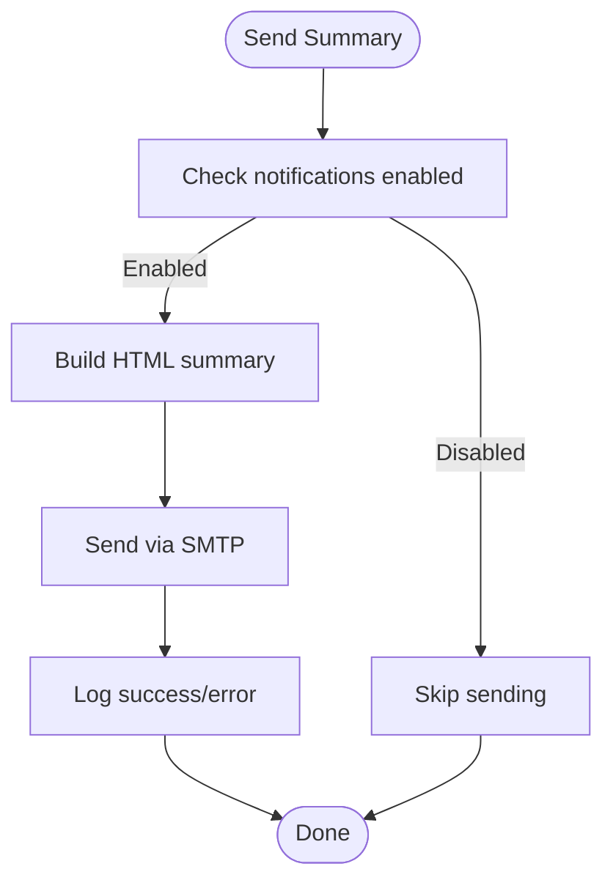
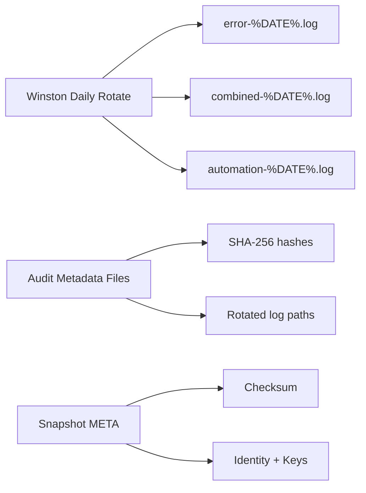
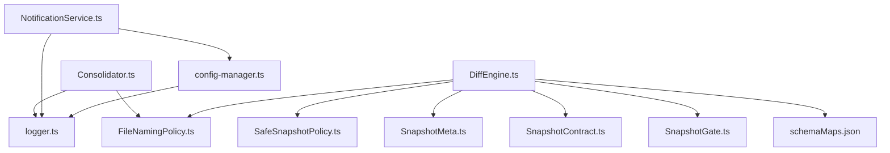

# Compliance and Reporting

<cite>
**Referenced Files in This Document**
- [Consolidator.ts](file://app/core/consolidation/Consolidator.ts)
- [DiffEngine.ts](file://app/core/diff/DiffEngine.ts)
- [NotificationService.ts](file://app/core/notifications/NotificationService.ts)
- [FileNamingPolicy.ts](file://app/policy/snapshot/FileNamingPolicy.ts)
- [SafeSnapshotPolicy.ts](file://app/policy/snapshot/SafeSnapshotPolicy.ts)
- [SnapshotContract.ts](file://app/policy/snapshot/SnapshotContract.ts)
- [SnapshotGate.ts](file://app/policy/snapshot/SnapshotGate.ts)
- [SnapshotMeta.ts](file://app/policy/snapshot/SnapshotMeta.ts)
- [schemaMaps.json](file://data/schemaMaps.json)
- [SchemaMap.ts](file://app/config/SchemaMap.ts)
- [config-manager.ts](file://app/config/config-manager.ts)
- [logger.ts](file://app/config/logger.ts)
- [app-config.json](file://app/config/app-config.json)
- [.405c9a65389158a549a39f3596028f458391e002-audit.json](file://app/logs/.405c9a65389158a549a39f3596028f458391e002-audit.json)
- [.a73103c26e7e251fcd7201113c8215db7b4be5bb-audit.json](file://app/logs/.a73103c26e7e251fcd7201113c8215db7b4be5bb-audit.json)
- [.d1ce87ca0e24d99c72f4361298a8b17a62ff23a9-audit.json](file://app/logs/.d1ce87ca0e24d99c72f4361298a8b17a62ff23a9-audit.json)
</cite>

## Table of Contents
1. [Introduction](#introduction)
2. [Project Structure](#project-structure)
3. [Core Components](#core-components)
4. [Architecture Overview](#architecture-overview)
5. [Detailed Component Analysis](#detailed-component-analysis)
6. [Dependency Analysis](#dependency-analysis)
7. [Performance Considerations](#performance-considerations)
8. [Troubleshooting Guide](#troubleshooting-guide)
9. [Conclusion](#conclusion)
10. [Appendices](#appendices)

## Introduction
This document explains the compliance and reporting capabilities of the system. It covers how the system:
- Generates compliance reports by consolidating data from multiple sources
- Integrates a diff engine to track additions and deletions across snapshots
- Maintains audit trails and verifies data consistency
- Sends notifications upon automation completion
- Aligns with enterprise compliance requirements through structured snapshot policies, schema-driven primary keys, and robust logging

The goal is to provide both technical depth and practical guidance for generating reports, tracking compliance, and ensuring audit-ready outputs.

## Project Structure
The compliance and reporting features are implemented across three core areas:
- Consolidation: merges per-site Excel outputs into master consolidated files
- Diff Engine: compares previous and current snapshots to produce deletions and metadata
- Notifications: emails summaries of automation runs

Supporting components include snapshot naming and policy enforcement, schema maps for primary keys, configuration and logging systems, and audit metadata for log integrity.

**Diagram sources**
- [Consolidator.ts](file://app/core/consolidation/Consolidator.ts#L20-L138)
- [DiffEngine.ts](file://app/core/diff/DiffEngine.ts#L23-L230)
- [FileNamingPolicy.ts](file://app/policy/snapshot/FileNamingPolicy.ts#L4-L35)
- [SafeSnapshotPolicy.ts](file://app/policy/snapshot/SafeSnapshotPolicy.ts#L3-L25)
- [SnapshotMeta.ts](file://app/policy/snapshot/SnapshotMeta.ts#L1-L18)
- [SnapshotContract.ts](file://app/policy/snapshot/SnapshotContract.ts#L9-L20)
- [SnapshotGate.ts](file://app/policy/snapshot/SnapshotGate.ts#L4-L28)
- [NotificationService.ts](file://app/core/notifications/NotificationService.ts#L13-L115)
- [config-manager.ts](file://app/config/config-manager.ts#L85-L408)
- [SchemaMap.ts](file://app/config/SchemaMap.ts#L1-L13)
- [schemaMaps.json](file://data/schemaMaps.json#L1-L9)
- [logger.ts](file://app/config/logger.ts#L15-L104)
- [.405c9a65389158a549a39f3596028f458391e002-audit.json](file://app/logs/.405c9a65389158a549a39f3596028f458391e002-audit.json#L1-L25)
- [.a73103c26e7e251fcd7201113c8215db7b4be5bb-audit.json](file://app/logs/.a73103c26e7e251fcd7201113c8215db7b4be5bb-audit.json#L1-L25)
- [.d1ce87ca0e24d99c72f4361298a8b17a62ff23a9-audit.json](file://app/logs/.d1ce87ca0e24d99c72f4361298a8b17a62ff23a9-audit.json#L1-L25)

**Section sources**
- [Consolidator.ts](file://app/core/consolidation/Consolidator.ts#L20-L138)
- [DiffEngine.ts](file://app/core/diff/DiffEngine.ts#L23-L230)
- [NotificationService.ts](file://app/core/notifications/NotificationService.ts#L13-L115)
- [FileNamingPolicy.ts](file://app/policy/snapshot/FileNamingPolicy.ts#L4-L35)
- [SafeSnapshotPolicy.ts](file://app/policy/snapshot/SafeSnapshotPolicy.ts#L3-L25)
- [SnapshotMeta.ts](file://app/policy/snapshot/SnapshotMeta.ts#L1-L18)
- [SnapshotContract.ts](file://app/policy/snapshot/SnapshotContract.ts#L9-L20)
- [SnapshotGate.ts](file://app/policy/snapshot/SnapshotGate.ts#L4-L28)
- [config-manager.ts](file://app/config/config-manager.ts#L85-L408)
- [SchemaMap.ts](file://app/config/SchemaMap.ts#L1-L13)
- [schemaMaps.json](file://data/schemaMaps.json#L1-L9)
- [logger.ts](file://app/config/logger.ts#L15-L104)
- [.405c9a65389158a549a39f3596028f458391e002-audit.json](file://app/logs/.405c9a65389158a549a39f3596028f458391e002-audit.json#L1-L25)
- [.a73103c26e7e251fcd7201113c8215db7b4be5bb-audit.json](file://app/logs/.a73103c26e7e251fcd7201113c8215db7b4be5bb-audit.json#L1-L25)
- [.d1ce87ca0e24d99c72f4361298a8b17a62ff23a9-audit.json](file://app/logs/.d1ce87ca0e24d99c72f4361298a8b17a62ff23a9-audit.json#L1-L25)

## Core Components
- Consolidator: Reads per-site Excel outputs and writes consolidated master files for current and deleted records, injecting origin metadata for traceability.
- DiffEngine: Compares new downloads against previous snapshots, computes deletions, updates metadata, and enforces schema-driven primary keys.
- NotificationService: Sends email summaries of automation runs when configured, aggregating success/failure counts and per-site outcomes.
- Snapshot Policies: Define naming, identity validation, and schema-driven primary keys to ensure consistent snapshot behavior.
- Configuration and Logging: Centralized configuration with validation, path resolution, and robust logging with daily rotation and automation-specific streams.
- Audit Logs: Log integrity metadata files track rotated log files and their hashes for auditability.

**Section sources**
- [Consolidator.ts](file://app/core/consolidation/Consolidator.ts#L20-L138)
- [DiffEngine.ts](file://app/core/diff/DiffEngine.ts#L23-L230)
- [NotificationService.ts](file://app/core/notifications/NotificationService.ts#L13-L115)
- [FileNamingPolicy.ts](file://app/policy/snapshot/FileNamingPolicy.ts#L4-L35)
- [SafeSnapshotPolicy.ts](file://app/policy/snapshot/SafeSnapshotPolicy.ts#L3-L25)
- [SnapshotMeta.ts](file://app/policy/snapshot/SnapshotMeta.ts#L1-L18)
- [SnapshotContract.ts](file://app/policy/snapshot/SnapshotContract.ts#L9-L20)
- [SnapshotGate.ts](file://app/policy/snapshot/SnapshotGate.ts#L4-L28)
- [config-manager.ts](file://app/config/config-manager.ts#L85-L408)
- [logger.ts](file://app/config/logger.ts#L15-L104)
- [.405c9a65389158a549a39f3596028f458391e002-audit.json](file://app/logs/.405c9a65389158a549a39f3596028f458391e002-audit.json#L1-L25)
- [.a73103c26e7e251fcd7201113c8215db7b4be5bb-audit.json](file://app/logs/.a73103c26e7e251fcd7201113c8215db7b4be5bb-audit.json#L1-L25)
- [.d1ce87ca0e24d99c72f4361298a8b17a62ff23a9-audit.json](file://app/logs/.d1ce87ca0e24d99c72f4361298a8b17a62ff23a9-audit.json#L1-L25)

## Architecture Overview
The compliance pipeline integrates automation outputs with snapshot diffing and consolidation, then notifies stakeholders and maintains audit trails.

**Diagram sources**
- [DiffEngine.ts](file://app/core/diff/DiffEngine.ts#L55-L219)
- [Consolidator.ts](file://app/core/consolidation/Consolidator.ts#L26-L63)
- [NotificationService.ts](file://app/core/notifications/NotificationService.ts#L75-L111)
- [logger.ts](file://app/config/logger.ts#L15-L104)

## Detailed Component Analysis

### Consolidation Engine
The Consolidator merges multiple per-site Excel outputs into two master files:
- Consolidated Current: Aggregates current rows from all successful sites with injected origin metadata (site name and originating state).
- Consolidated Deleted: Aggregates deleted rows across runs with context and run identifiers.

Processing logic:
- Filters successful results and extracts current/deleted file paths from each site result.
- Reads each Excel file, converts to JSON, enriches with origin metadata, concatenates into a master dataset.
- Writes consolidated workbooks and logs results.

**Diagram sources**
- [Consolidator.ts](file://app/core/consolidation/Consolidator.ts#L26-L134)

Practical example:
- After a preset run across multiple states, the Consolidator produces:
  - Consolidated Current file named with a master prefix and report type/period
  - Consolidated Deleted file with deletions aggregated across runs

**Section sources**
- [Consolidator.ts](file://app/core/consolidation/Consolidator.ts#L20-L138)

### Diff Engine Integration
The DiffEngine performs:
- Schema-driven primary key selection (from schemaMaps.json) or custom primary keys
- Row signature computation using selected keys
- Removal detection by set difference between previous and current signatures
- Cumulative deletion file management (DELETED)
- Current snapshot replacement and metadata update (META) with checksum

**Diagram sources**
- [DiffEngine.ts](file://app/core/diff/DiffEngine.ts#L55-L219)
- [schemaMaps.json](file://data/schemaMaps.json#L1-L9)
- [SafeSnapshotPolicy.ts](file://app/policy/snapshot/SafeSnapshotPolicy.ts#L3-L25)

Enterprise compliance highlights:
- Identity validation prevents cross-period or cross-type snapshot corruption.
- Metadata includes schema version, primary keys used, row count, and checksum for verifiability.
- Audit-friendly logging of periods and run identifiers.

**Section sources**
- [DiffEngine.ts](file://app/core/diff/DiffEngine.ts#L23-L230)
- [SnapshotGate.ts](file://app/policy/snapshot/SnapshotGate.ts#L4-L28)
- [SnapshotMeta.ts](file://app/policy/snapshot/SnapshotMeta.ts#L1-L18)
- [FileNamingPolicy.ts](file://app/policy/snapshot/FileNamingPolicy.ts#L4-L35)
- [SafeSnapshotPolicy.ts](file://app/policy/snapshot/SafeSnapshotPolicy.ts#L3-L25)
- [schemaMaps.json](file://data/schemaMaps.json#L1-L9)

### Reporting Mechanisms
- Consolidated Reports: Master Excel files produced by the Consolidator serve as consolidated current and deleted reports.
- Snapshot Reports: Per-period, per-state snapshot files (CURRENT, DELETED, META) provide granular change tracking.
- Automation Summaries: NotificationService sends HTML email summaries after preset runs, aggregating per-site outcomes.

**Diagram sources**
- [Consolidator.ts](file://app/core/consolidation/Consolidator.ts#L26-L63)
- [DiffEngine.ts](file://app/core/diff/DiffEngine.ts#L55-L219)
- [NotificationService.ts](file://app/core/notifications/NotificationService.ts#L75-L111)

**Section sources**
- [Consolidator.ts](file://app/core/consolidation/Consolidator.ts#L20-L138)
- [DiffEngine.ts](file://app/core/diff/DiffEngine.ts#L23-L230)
- [NotificationService.ts](file://app/core/notifications/NotificationService.ts#L13-L115)

### Notification Delivery
NotificationService supports:
- Conditional sending based on configuration
- SMTP transport with host, port, and credentials
- HTML email summaries with per-site status and timestamps
- Logging of send attempts and errors

**Diagram sources**
- [NotificationService.ts](file://app/core/notifications/NotificationService.ts#L28-L111)
- [config-manager.ts](file://app/config/config-manager.ts#L67-L77)

**Section sources**
- [NotificationService.ts](file://app/core/notifications/NotificationService.ts#L13-L115)
- [config-manager.ts](file://app/config/config-manager.ts#L58-L78)

### Audit Trail Maintenance and Data Consistency
- Log Rotation: Winston daily rotate transports maintain separate error, combined, and automation logs with retention policies.
- Audit Metadata: Log integrity files track rotated log filenames and SHA-256 hashes for verification.
- Snapshot Metadata: DiffEngine writes META files containing identity, schema version, primary keys, row count, and checksum for verifiability.
- Path Resolution: ConfigManager resolves environment variables and remaps legacy user paths to avoid permission errors.

**Diagram sources**
- [logger.ts](file://app/config/logger.ts#L42-L82)
- [.405c9a65389158a549a39f3596028f458391e002-audit.json](file://app/logs/.405c9a65389158a549a39f3596028f458391e002-audit.json#L1-L25)
- [.a73103c26e7e251fcd7201113c8215db7b4be5bb-audit.json](file://app/logs/.a73103c26e7e251fcd7201113c8215db7b4be5bb-audit.json#L1-L25)
- [.d1ce87ca0e24d99c72f4361298a8b17a62ff23a9-audit.json](file://app/logs/.d1ce87ca0e24d99c72f4361298a8b17a62ff23a9-audit.json#L1-L25)
- [DiffEngine.ts](file://app/core/diff/DiffEngine.ts#L197-L210)

**Section sources**
- [logger.ts](file://app/config/logger.ts#L15-L104)
- [.405c9a65389158a549a39f3596028f458391e002-audit.json](file://app/logs/.405c9a65389158a549a39f3596028f458391e002-audit.json#L1-L25)
- [.a73103c26e7e251fcd7201113c8215db7b4be5bb-audit.json](file://app/logs/.a73103c26e7e251fcd7201113c8215db7b4be5bb-audit.json#L1-L25)
- [.d1ce87ca0e24d99c72f4361298a8b17a62ff23a9-audit.json](file://app/logs/.d1ce87ca0e24d99c72f4361298a8b17a62ff23a9-audit.json#L1-L25)
- [DiffEngine.ts](file://app/core/diff/DiffEngine.ts#L197-L210)
- [config-manager.ts](file://app/config/config-manager.ts#L98-L124)

## Dependency Analysis
Key relationships:
- Consolidator depends on snapshot file naming and logger.
- DiffEngine depends on schema maps, snapshot naming, policy validation, and metadata.
- NotificationService depends on configuration manager and logger.
- Configuration manager centralizes path resolution and validation.

**Diagram sources**
- [Consolidator.ts](file://app/core/consolidation/Consolidator.ts#L1-L138)
- [DiffEngine.ts](file://app/core/diff/DiffEngine.ts#L1-L230)
- [NotificationService.ts](file://app/core/notifications/NotificationService.ts#L1-L115)
- [FileNamingPolicy.ts](file://app/policy/snapshot/FileNamingPolicy.ts#L1-L35)
- [SafeSnapshotPolicy.ts](file://app/policy/snapshot/SafeSnapshotPolicy.ts#L1-L25)
- [SnapshotMeta.ts](file://app/policy/snapshot/SnapshotMeta.ts#L1-L18)
- [SnapshotContract.ts](file://app/policy/snapshot/SnapshotContract.ts#L1-L20)
- [SnapshotGate.ts](file://app/policy/snapshot/SnapshotGate.ts#L1-L28)
- [config-manager.ts](file://app/config/config-manager.ts#L85-L408)
- [logger.ts](file://app/config/logger.ts#L15-L104)
- [schemaMaps.json](file://data/schemaMaps.json#L1-L9)

**Section sources**
- [Consolidator.ts](file://app/core/consolidation/Consolidator.ts#L1-L138)
- [DiffEngine.ts](file://app/core/diff/DiffEngine.ts#L1-L230)
- [NotificationService.ts](file://app/core/notifications/NotificationService.ts#L1-L115)
- [FileNamingPolicy.ts](file://app/policy/snapshot/FileNamingPolicy.ts#L1-L35)
- [SafeSnapshotPolicy.ts](file://app/policy/snapshot/SafeSnapshotPolicy.ts#L1-L25)
- [SnapshotMeta.ts](file://app/policy/snapshot/SnapshotMeta.ts#L1-L18)
- [SnapshotContract.ts](file://app/policy/snapshot/SnapshotContract.ts#L1-L20)
- [SnapshotGate.ts](file://app/policy/snapshot/SnapshotGate.ts#L1-L28)
- [config-manager.ts](file://app/config/config-manager.ts#L85-L408)
- [logger.ts](file://app/config/logger.ts#L15-L104)
- [schemaMaps.json](file://data/schemaMaps.json#L1-L9)

## Performance Considerations
- Consolidation: Reading and merging multiple Excel files scales with the number of rows and sites. Consider batching or streaming for very large datasets.
- Diff Engine: Signature computation and set operations are efficient for moderate sizes; ensure primary keys minimize cardinality while remaining unique.
- Logging: Daily rotation with compression reduces disk usage; adjust retention windows based on compliance needs.
- Notifications: SMTP calls are asynchronous; configure retry and timeout settings in the underlying transport if needed.

[No sources needed since this section provides general guidance]

## Troubleshooting Guide
Common issues and resolutions:
- Missing schema file: DiffEngine throws when schemaMaps.json is not found; ensure the file exists in the expected location and is packaged correctly.
- Empty or missing snapshot files: DiffEngine gracefully handles missing PREV CURRENT and treats it as a fresh run; verify download paths and permissions.
- Incomplete SMTP configuration: NotificationService skips sending if SMTP credentials are missing; confirm configuration values.
- Path resolution errors: Use ConfigManager.resolvePath to normalize environment variables and remap legacy user paths.
- Log rotation failures: Verify write permissions to the logs directory; check environment variables controlling log levels.

**Section sources**
- [DiffEngine.ts](file://app/core/diff/DiffEngine.ts#L32-L44)
- [NotificationService.ts](file://app/core/notifications/NotificationService.ts#L28-L41)
- [config-manager.ts](file://app/config/config-manager.ts#L98-L124)
- [logger.ts](file://app/config/logger.ts#L15-L104)

## Conclusion
The system’s compliance and reporting capabilities are built around:
- Structured snapshot policies and schema-driven primary keys
- Robust diffing and metadata management
- Consolidation of per-site outputs into auditable master reports
- Automated notifications and comprehensive logging with audit metadata

These features collectively support enterprise-grade compliance by ensuring traceability, consistency, and verifiability of automated reporting outputs.

[No sources needed since this section summarizes without analyzing specific files]

## Appendices

### Practical Examples

- Generating a consolidated report:
  - After running a preset across multiple states, the Consolidator writes:
    - Consolidated Current: a single Excel with origin metadata
    - Consolidated Deleted: aggregated deletions across runs
  - Reference: [Consolidator.ts](file://app/core/consolidation/Consolidator.ts#L26-L63)

- Performing a snapshot diff:
  - Provide identity (type, period, state) and the new downloaded file to DiffEngine.run
  - Review returned metrics and updated files (CURRENT, DELETED, META)
  - Reference: [DiffEngine.ts](file://app/core/diff/DiffEngine.ts#L55-L219)

- Sending an automation summary:
  - Call NotificationService.sendAutomationSummary with preset name and results
  - Ensure notifications are enabled and SMTP credentials are configured
  - Reference: [NotificationService.ts](file://app/core/notifications/NotificationService.ts#L75-L111), [config-manager.ts](file://app/config/config-manager.ts#L67-L77)

- Maintaining audit trails:
  - Rely on Winston daily rotation and integrity metadata files for log verification
  - Snapshot META files provide checksums and identity for data consistency verification
  - Reference: [logger.ts](file://app/config/logger.ts#L42-L82), [DiffEngine.ts](file://app/core/diff/DiffEngine.ts#L197-L210)