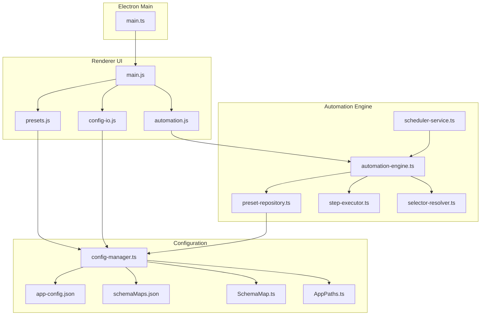
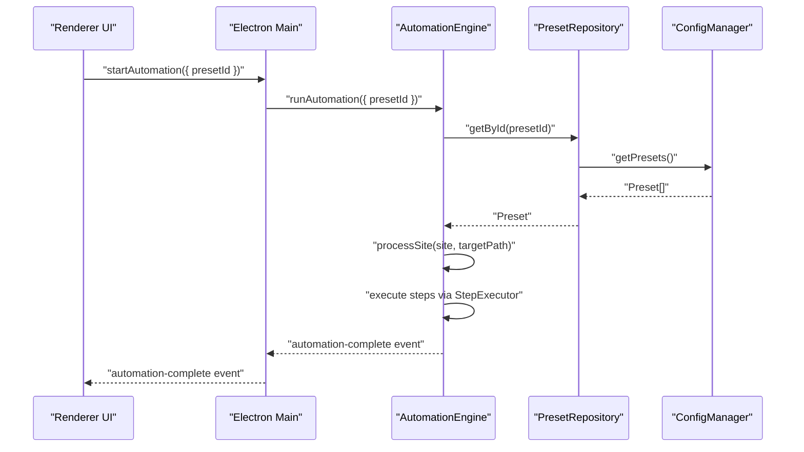
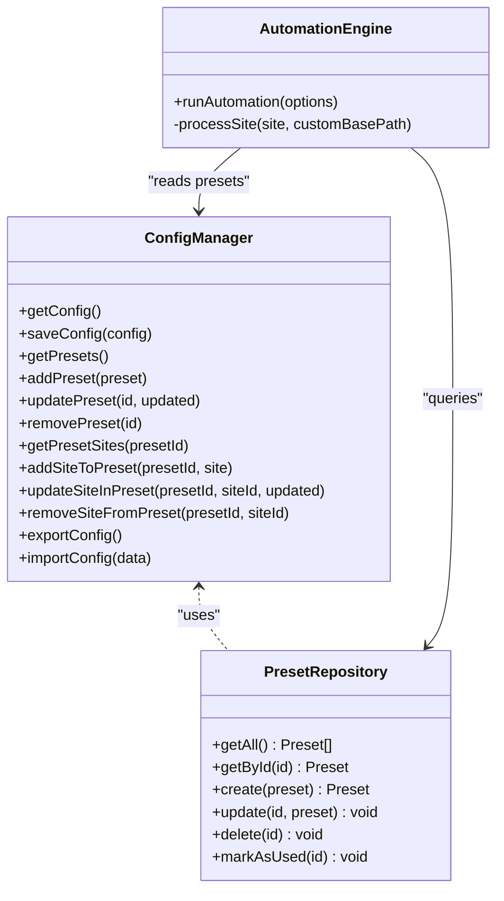
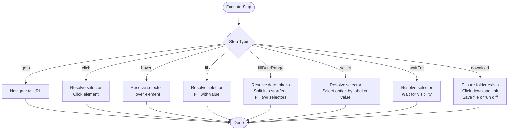
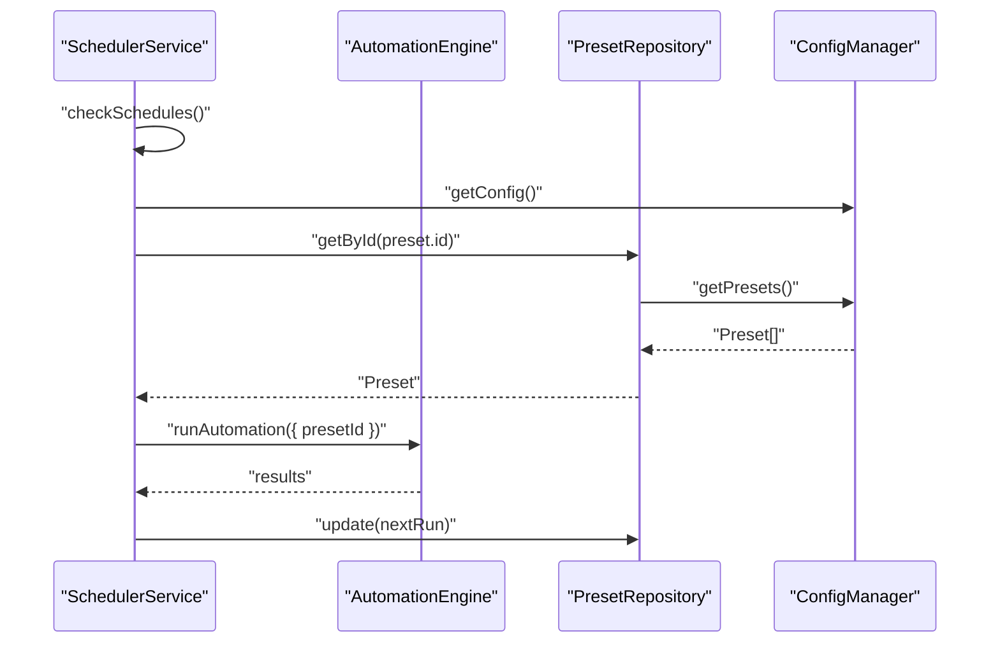
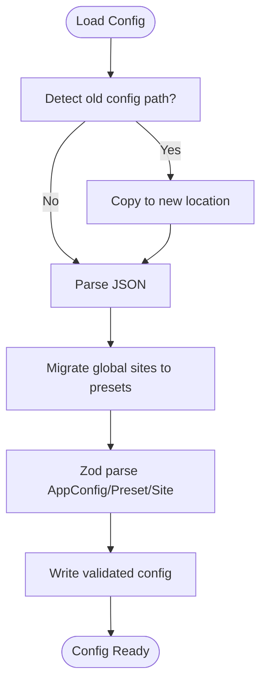
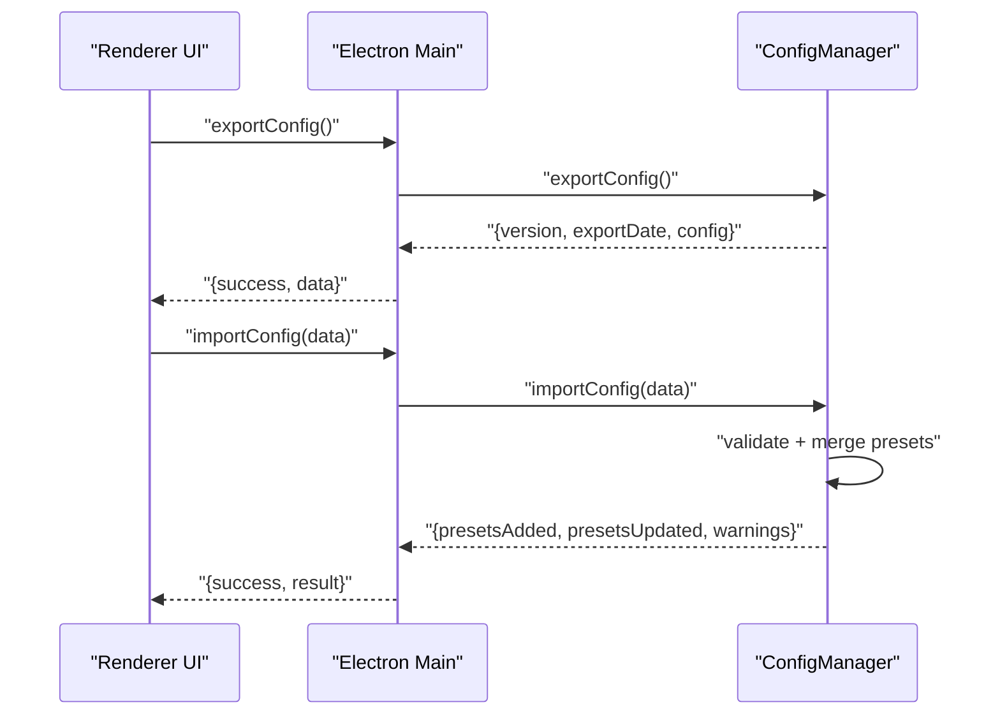
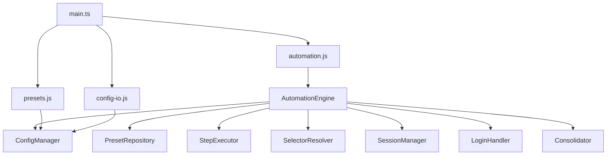

# Configurable Workflow Automation

<cite>
**Referenced Files in This Document**
- [automation-engine.ts](file://app/automation/engine/automation-engine.ts)
- [preset-repository.ts](file://app/automation/engine/preset-repository.ts)
- [step-executor.ts](file://app/automation/engine/step-executor.ts)
- [scheduler-service.ts](file://app/automation/engine/scheduler-service.ts)
- [selector-resolver.ts](file://app/automation/engine/selector-resolver.ts)
- [config-manager.ts](file://app/config/config-manager.ts)
- [SchemaMap.ts](file://app/config/SchemaMap.ts)
- [app-config.json](file://app/config/app-config.json)
- [schemaMaps.json](file://app/storage/schemaMaps.json)
- [AppPaths.ts](file://app/core/utils/AppPaths.ts)
- [main.ts](file://app/electron/main.ts)
- [main.js](file://app/renderer/main.js)
- [automation.js](file://app/renderer/modules/automation.js)
- [config-io.js](file://app/renderer/modules/config-io.js)
- [presets.js](file://app/renderer/modules/presets.js)
</cite>

## Table of Contents
1. [Introduction](#introduction)
2. [Project Structure](#project-structure)
3. [Core Components](#core-components)
4. [Architecture Overview](#architecture-overview)
5. [Detailed Component Analysis](#detailed-component-analysis)
6. [Dependency Analysis](#dependency-analysis)
7. [Performance Considerations](#performance-considerations)
8. [Troubleshooting Guide](#troubleshooting-guide)
9. [Conclusion](#conclusion)
10. [Appendices](#appendices)

## Introduction
This document describes a configurable workflow automation system built with a JSON-based step configuration model, a preset isolation architecture, and schema-based validation powered by Zod. It explains how users define automation workflows, how presets encapsulate site-specific configurations and credentials, and how the system validates, persists, and executes automations. It also covers the preset repository, configuration migration, and export/import functionality, along with integration points to the Electron main process and the renderer UI.

## Project Structure
The system is organized around a modular architecture:
- Electron main process orchestrates IPC handlers, scheduling, and lifecycle.
- Renderer modules expose UI actions for presets, sites, automation, and configuration import/export.
- Automation engine coordinates browser sessions, step execution, and reporting.
- Configuration manager enforces strict validation and persistence using Zod schemas.
- Preset repository mediates CRUD operations for isolated preset collections.

**Diagram sources**
- [main.ts](file://app/electron/main.ts#L117-L281)
- [main.js](file://app/renderer/main.js#L1-L182)
- [presets.js](file://app/renderer/modules/presets.js#L1-L414)
- [automation.js](file://app/renderer/modules/automation.js#L1-L59)
- [config-io.js](file://app/renderer/modules/config-io.js#L1-L115)
- [automation-engine.ts](file://app/automation/engine/automation-engine.ts#L50-L608)
- [scheduler-service.ts](file://app/automation/engine/scheduler-service.ts#L6-L145)
- [preset-repository.ts](file://app/automation/engine/preset-repository.ts#L4-L34)
- [step-executor.ts](file://app/automation/engine/step-executor.ts#L25-L616)
- [selector-resolver.ts](file://app/automation/engine/selector-resolver.ts#L4-L135)
- [config-manager.ts](file://app/config/config-manager.ts#L85-L408)
- [app-config.json](file://app/config/app-config.json#L1-L1521)
- [schemaMaps.json](file://app/storage/schemaMaps.json#L1-L9)
- [SchemaMap.ts](file://app/config/SchemaMap.ts#L1-L13)
- [AppPaths.ts](file://app/core/utils/AppPaths.ts#L5-L60)

**Section sources**
- [main.ts](file://app/electron/main.ts#L117-L281)
- [main.js](file://app/renderer/main.js#L1-L182)
- [automation-engine.ts](file://app/automation/engine/automation-engine.ts#L50-L608)
- [config-manager.ts](file://app/config/config-manager.ts#L85-L408)

## Core Components
- Automation Engine: Orchestrates browser sessions, login handling, step execution, progress events, and post-processing (consolidation and notifications).
- Step Executor: Executes typed steps (goto, click, fill, fillDateRange, select, waitFor, download) with retries, timeouts, and optional continue-on-error behavior.
- Selector Resolver: Robust element resolution with retry logic and visibility checks.
- Scheduler Service: Periodically evaluates preset schedules and triggers automation runs.
- Preset Repository: CRUD operations for presets with usage tracking.
- Configuration Manager: Zod-based validation, migration, export/import, and path resolution.
- Renderer Modules: UI bindings for presets, automation controls, and configuration import/export.

**Section sources**
- [automation-engine.ts](file://app/automation/engine/automation-engine.ts#L50-L608)
- [step-executor.ts](file://app/automation/engine/step-executor.ts#L25-L616)
- [selector-resolver.ts](file://app/automation/engine/selector-resolver.ts#L4-L135)
- [scheduler-service.ts](file://app/automation/engine/scheduler-service.ts#L6-L145)
- [preset-repository.ts](file://app/automation/engine/preset-repository.ts#L4-L34)
- [config-manager.ts](file://app/config/config-manager.ts#L85-L408)
- [main.ts](file://app/electron/main.ts#L117-L281)
- [main.js](file://app/renderer/main.js#L1-L182)
- [presets.js](file://app/renderer/modules/presets.js#L1-L414)
- [automation.js](file://app/renderer/modules/automation.js#L1-L59)
- [config-io.js](file://app/renderer/modules/config-io.js#L1-L115)

## Architecture Overview
The system follows a layered architecture:
- UI Layer: Renderer modules expose actions that call IPC handlers in the main process.
- Main Process: Provides IPC endpoints for configuration, presets, automation, and session management; starts the scheduler.
- Automation Layer: Executes browser automation against configured presets and sites.
- Persistence Layer: Zod schemas validate and persist configuration and presets; migration ensures backward compatibility.

**Diagram sources**
- [main.ts](file://app/electron/main.ts#L214-L232)
- [automation-engine.ts](file://app/automation/engine/automation-engine.ts#L62-L238)
- [preset-repository.ts](file://app/automation/engine/preset-repository.ts#L9-L11)
- [config-manager.ts](file://app/config/config-manager.ts#L216-L218)

## Detailed Component Analysis

### Preset Isolation Architecture
- Presets encapsulate site lists, credentials, destination, and scheduling. They enforce isolation by passing preset credentials into site execution and by constraining site lists per preset.
- The engine prioritizes preset-defined download destinations and auto-creates report-type subfolders when applicable.

**Diagram sources**
- [config-manager.ts](file://app/config/config-manager.ts#L216-L394)
- [preset-repository.ts](file://app/automation/engine/preset-repository.ts#L4-L34)
- [automation-engine.ts](file://app/automation/engine/automation-engine.ts#L92-L154)

**Section sources**
- [automation-engine.ts](file://app/automation/engine/automation-engine.ts#L92-L154)
- [preset-repository.ts](file://app/automation/engine/preset-repository.ts#L4-L34)
- [config-manager.ts](file://app/config/config-manager.ts#L216-L309)

### Step Execution Model
- Steps are typed and validated via Zod. The executor applies delays, timeouts, and retries, supports continue-on-error, and performs specialized actions like date range filling and intelligent downloads with snapshot diffing.

**Diagram sources**
- [step-executor.ts](file://app/automation/engine/step-executor.ts#L59-L110)
- [step-executor.ts](file://app/automation/engine/step-executor.ts#L137-L578)

**Section sources**
- [step-executor.ts](file://app/automation/engine/step-executor.ts#L25-L616)

### Scheduler and Automation Lifecycle
- The scheduler periodically checks preset schedules and triggers automation runs, respecting a global busy state and watchdog timers.
- The engine manages browser contexts, login flows, and emits progress updates to the UI.

**Diagram sources**
- [scheduler-service.ts](file://app/automation/engine/scheduler-service.ts#L38-L96)
- [automation-engine.ts](file://app/automation/engine/automation-engine.ts#L62-L238)
- [preset-repository.ts](file://app/automation/engine/preset-repository.ts#L20-L26)
- [config-manager.ts](file://app/config/config-manager.ts#L216-L256)

**Section sources**
- [scheduler-service.ts](file://app/automation/engine/scheduler-service.ts#L6-L145)
- [automation-engine.ts](file://app/automation/engine/automation-engine.ts#L50-L238)

### Zod Validation and Configuration Persistence
- Zod schemas define strict contracts for site configurations, presets, and global app configuration.
- Migration logic moves legacy global site lists into presets and resolves environment variables and user profile paths.

**Diagram sources**
- [config-manager.ts](file://app/config/config-manager.ts#L133-L190)
- [config-manager.ts](file://app/config/config-manager.ts#L149-L167)
- [config-manager.ts](file://app/config/config-manager.ts#L169-L171)

**Section sources**
- [config-manager.ts](file://app/config/config-manager.ts#L8-L81)
- [config-manager.ts](file://app/config/config-manager.ts#L133-L190)
- [config-manager.ts](file://app/config/config-manager.ts#L216-L394)

### Export/Import Functionality
- Export produces a versioned bundle containing the current configuration.
- Import merges presets, updating existing ones and adding new ones, with warnings for each operation.

**Diagram sources**
- [main.ts](file://app/electron/main.ts#L147-L164)
- [config-manager.ts](file://app/config/config-manager.ts#L334-L394)

**Section sources**
- [main.ts](file://app/electron/main.ts#L147-L164)
- [config-manager.ts](file://app/config/config-manager.ts#L334-L394)

### Practical Examples

#### Example: Workflow Creation
- Define a site with a sequence of steps:
  - Hover to reveal menus
  - Click to navigate to export area
  - Fill a date range using tokens
  - Download the resulting file

- Example step definitions (described):
  - type: hover, selector: menu identifier
  - type: click, selector: export item
  - type: fillDateRange, selector: start,end inputs, value: tokenized date range
  - type: download, selector: export button

- These steps are persisted under a site within a preset.

**Section sources**
- [app-config.json](file://app/config/app-config.json#L20-L51)
- [step-executor.ts](file://app/automation/engine/step-executor.ts#L215-L269)
- [step-executor.ts](file://app/automation/engine/step-executor.ts#L464-L578)

#### Example: Preset Management
- Create a preset with:
  - Name, login, password, destination
  - Schedule (interval or fixed times)
  - Associated sites with their steps

- UI actions:
  - Create/Edit/Delete presets
  - Toggle schedule mode and add/remove fixed times
  - Navigate to site management for the selected preset

**Section sources**
- [presets.js](file://app/renderer/modules/presets.js#L154-L208)
- [presets.js](file://app/renderer/modules/presets.js#L256-L300)
- [presets.js](file://app/renderer/modules/presets.js#L358-L412)
- [main.js](file://app/renderer/main.js#L47-L58)

#### Example: Configuration Migration and Path Resolution
- On startup, the system detects and migrates legacy configuration locations.
- Paths support environment variable substitution and user profile remapping.

**Section sources**
- [config-manager.ts](file://app/config/config-manager.ts#L133-L190)
- [config-manager.ts](file://app/config/config-manager.ts#L98-L124)
- [AppPaths.ts](file://app/core/utils/AppPaths.ts#L11-L21)

## Dependency Analysis
Key dependencies and relationships:
- AutomationEngine depends on PresetRepository, ConfigManager, StepExecutor, SelectorResolver, SessionManager, LoginHandler, and Consolidator.
- Renderer modules depend on Electron IPC handlers exposed in main.ts.
- ConfigManager centralizes validation and persistence, with AppPaths ensuring correct storage locations.

**Diagram sources**
- [automation-engine.ts](file://app/automation/engine/automation-engine.ts#L1-L12)
- [main.ts](file://app/electron/main.ts#L1-L10)
- [presets.js](file://app/renderer/modules/presets.js#L1-L15)
- [automation.js](file://app/renderer/modules/automation.js#L1-L5)
- [config-io.js](file://app/renderer/modules/config-io.js#L1-L5)

**Section sources**
- [automation-engine.ts](file://app/automation/engine/automation-engine.ts#L1-L12)
- [main.ts](file://app/electron/main.ts#L1-L10)

## Performance Considerations
- Global timeout and watchdogs prevent runaway automation runs.
- Page stability checks and network idle waits reduce flakiness.
- Continue-on-error allows partial resilience for non-critical steps.
- Auto-folder creation and path normalization minimize I/O errors.
- Memory watchdog monitors long-running processes.

[No sources needed since this section provides general guidance]

## Troubleshooting Guide
Common issues and resolutions:
- Login failures: Reauthentication is attempted automatically; ensure the site’s login URL and credentials are correct.
- Element not found: Verify selectors and enable continue-on-error selectively; use waitFor steps to stabilize navigation.
- Download errors: Ensure target folders exist; the executor creates directories before clicking download links.
- Configuration errors: Validate JSON against Zod schemas; use export/import to share configurations safely.
- Scheduler conflicts: If automation is already running, the scheduler defers the next run until the engine becomes free.

**Section sources**
- [automation-engine.ts](file://app/automation/engine/automation-engine.ts#L350-L375)
- [step-executor.ts](file://app/automation/engine/step-executor.ts#L464-L578)
- [scheduler-service.ts](file://app/automation/engine/scheduler-service.ts#L82-L90)

## Conclusion
The system provides a robust, schema-driven framework for building and running configurable workflows. Presets isolate site configurations and credentials, while Zod validation ensures data integrity. The scheduler enables automated execution, and the renderer offers intuitive UI controls for preset and configuration management. Export/import capabilities facilitate sharing and backup of automation setups.

[No sources needed since this section summarizes without analyzing specific files]

## Appendices

### Appendix A: Step Types and Fields
- goto: requires value (URL)
- click/hover/select/waitFor: require selector; waitFor additionally verifies responsiveness
- fill: requires selector and value; supports date token resolution
- fillDateRange: requires selector (single or pair) and value (tokens or dates); splits into start/end and fills sequentially
- download: requires selector; creates target directories; optionally runs snapshot diffing for reportType-enabled sites

**Section sources**
- [step-executor.ts](file://app/automation/engine/step-executor.ts#L14-L23)
- [step-executor.ts](file://app/automation/engine/step-executor.ts#L137-L578)

### Appendix B: Schema Reference
- SiteConfig: id, name, url, loginUrl, field identifiers, steps array, optional downloadPath, renamePattern, reportType, primaryKeys, uf, credentials.
- Preset: id, name, sites array, login, password, type, destination, schedule with enabled, mode, intervalHours/fixedTimes, nextRun.
- AppConfig: credentials map, defaults for timeouts, retries, actionDelay, headless, schedulerEnabled, Google Drive path, presets array, notifications SMTP and recipient.

**Section sources**
- [config-manager.ts](file://app/config/config-manager.ts#L8-L81)

### Appendix C: Snapshot Diffing and Schema Maps
- When reportType is present, downloads are processed through a snapshot diff engine using primary keys and optional date fields to produce consolidated outputs.
- Schema maps define primary keys per report type.

**Section sources**
- [step-executor.ts](file://app/automation/engine/step-executor.ts#L507-L555)
- [schemaMaps.json](file://app/storage/schemaMaps.json#L1-L9)
- [SchemaMap.ts](file://app/config/SchemaMap.ts#L1-L13)