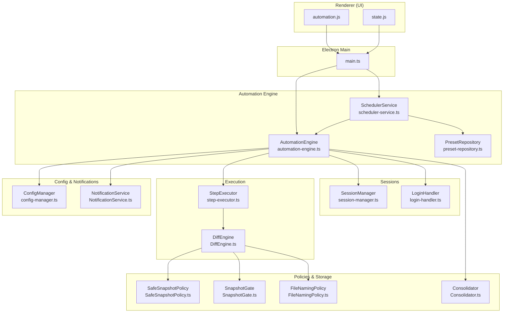
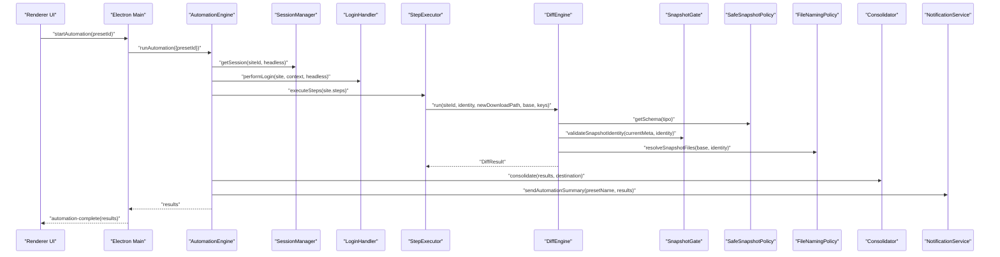
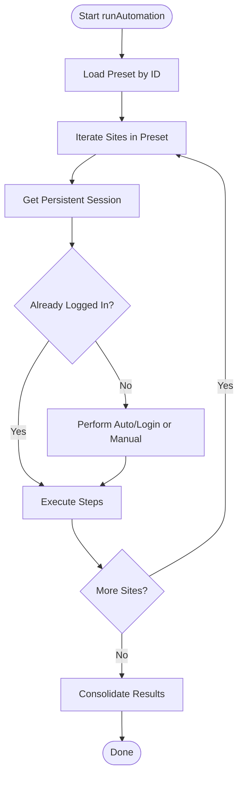
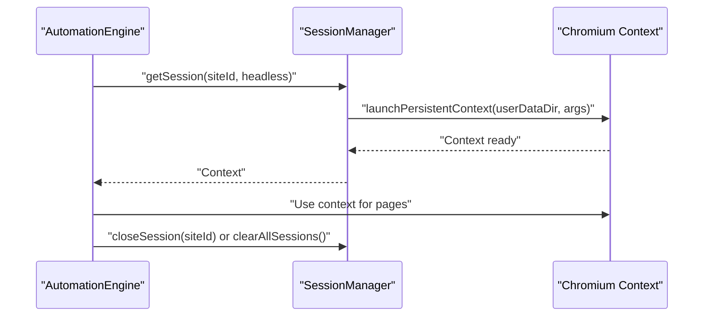
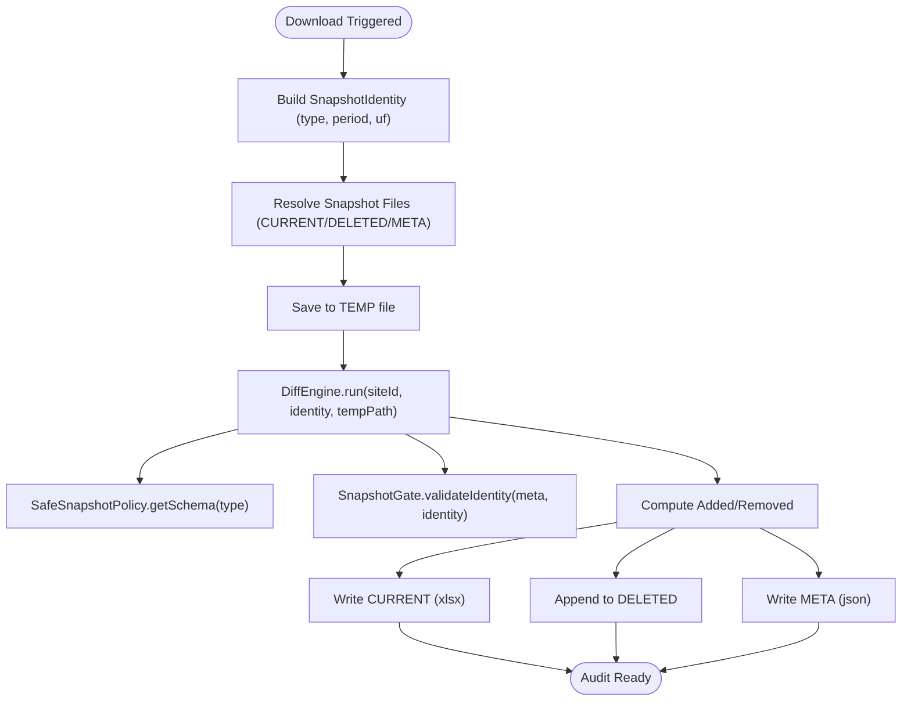
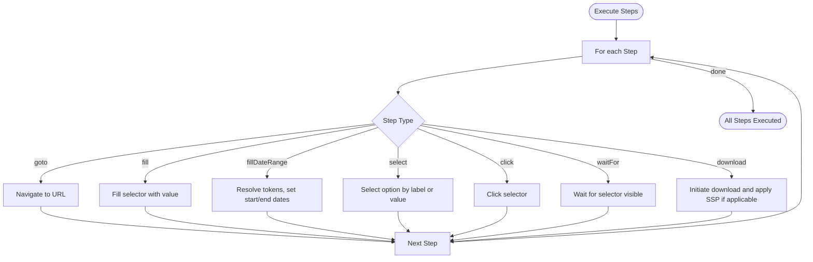
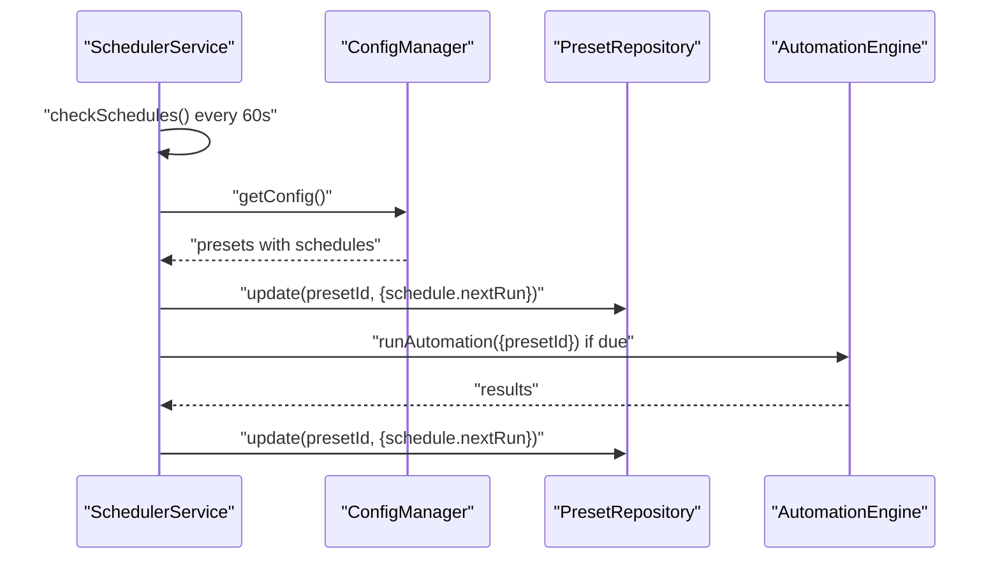
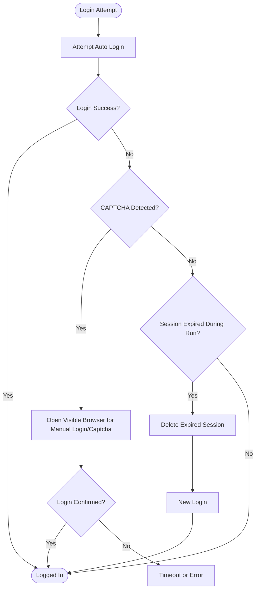
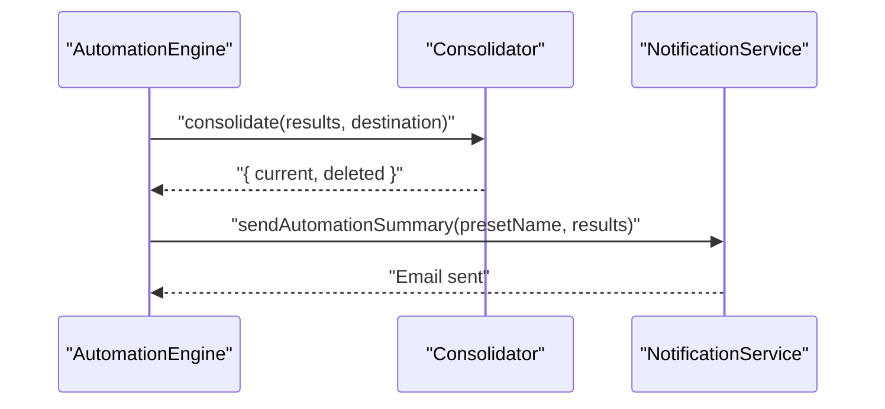
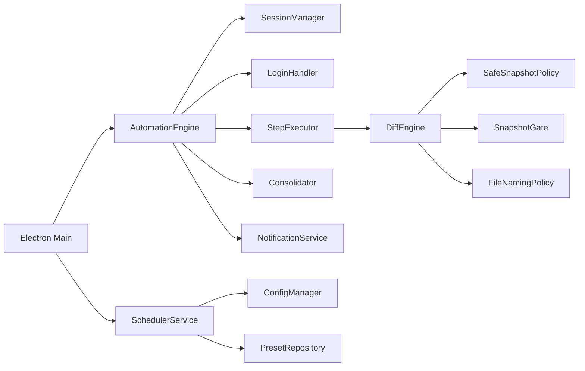

# Key Features

<cite>
**Referenced Files in This Document**
- [automation-engine.ts](file://app/automation/engine/automation-engine.ts)
- [scheduler-service.ts](file://app/automation/engine/scheduler-service.ts)
- [session-manager.ts](file://app/automation/sessions/session-manager.ts)
- [login-handler.ts](file://app/automation/sessions/login-handler.ts)
- [step-executor.ts](file://app/automation/engine/step-executor.ts)
- [DiffEngine.ts](file://app/core/diff/DiffEngine.ts)
- [SafeSnapshotPolicy.ts](file://app/policy/snapshot/SafeSnapshotPolicy.ts)
- [SnapshotGate.ts](file://app/policy/snapshot/SnapshotGate.ts)
- [FileNamingPolicy.ts](file://app/policy/snapshot/FileNamingPolicy.ts)
- [Consolidator.ts](file://app/core/consolidation/Consolidator.ts)
- [config-manager.ts](file://app/config/config-manager.ts)
- [preset-repository.ts](file://app/automation/engine/preset-repository.ts)
- [NotificationService.ts](file://app/core/notifications/NotificationService.ts)
- [main.ts](file://app/electron/main.ts)
- [automation.js](file://app/renderer/modules/automation.js)
- [state.js](file://app/renderer/modules/state.js)
</cite>

## Table of Contents
1. [Introduction](#introduction)
2. [Project Structure](#project-structure)
3. [Core Components](#core-components)
4. [Architecture Overview](#architecture-overview)
5. [Detailed Component Analysis](#detailed-component-analysis)
6. [Dependency Analysis](#dependency-analysis)
7. [Performance Considerations](#performance-considerations)
8. [Troubleshooting Guide](#troubleshooting-guide)
9. [Conclusion](#conclusion)
10. [Appendices](#appendices)

## Introduction
This document explains Automatizador Bravo’s key features and how they work together to deliver reliable, auditable, and scalable web automation across multiple sites. It focuses on:
- Multi-site web automation
- Persistent browser sessions
- Safe Snapshot Policy (SSP) for data integrity
- Configurable workflow automation
- Automated scheduling
- Session persistence with anti-captcha support
- Compliance reporting

Each feature is described with its purpose, benefits, and practical business value, along with real-world use cases and technical integration points.

## Project Structure
Automatizador Bravo is an Electron-based desktop application that orchestrates browser automation via Playwright, manages persistent sessions, enforces Safe Snapshot Policy (SSP) for auditing, and supports scheduled runs. The renderer integrates with the backend through IPC handlers to start/stop automation and display progress.

**Diagram sources**
- [automation-engine.ts](file://app/automation/engine/automation-engine.ts#L50-L611)
- [scheduler-service.ts](file://app/automation/engine/scheduler-service.ts#L6-L145)
- [session-manager.ts](file://app/automation/sessions/session-manager.ts#L67-L225)
- [login-handler.ts](file://app/automation/sessions/login-handler.ts#L13-L364)
- [step-executor.ts](file://app/automation/engine/step-executor.ts#L25-L549)
- [DiffEngine.ts](file://app/core/diff/DiffEngine.ts#L23-L230)
- [SafeSnapshotPolicy.ts](file://app/policy/snapshot/SafeSnapshotPolicy.ts#L3-L25)
- [SnapshotGate.ts](file://app/policy/snapshot/SnapshotGate.ts#L4-L28)
- [FileNamingPolicy.ts](file://app/policy/snapshot/FileNamingPolicy.ts#L4-L35)
- [Consolidator.ts](file://app/core/consolidation/Consolidator.ts#L20-L138)
- [config-manager.ts](file://app/config/config-manager.ts#L85-L408)
- [preset-repository.ts](file://app/automation/engine/preset-repository.ts#L4-L34)
- [NotificationService.ts](file://app/core/notifications/NotificationService.ts#L13-L115)
- [main.ts](file://app/electron/main.ts#L116-L281)

**Section sources**
- [automation-engine.ts](file://app/automation/engine/automation-engine.ts#L50-L611)
- [scheduler-service.ts](file://app/automation/engine/scheduler-service.ts#L6-L145)
- [session-manager.ts](file://app/automation/sessions/session-manager.ts#L67-L225)
- [login-handler.ts](file://app/automation/sessions/login-handler.ts#L13-L364)
- [step-executor.ts](file://app/automation/engine/step-executor.ts#L25-L549)
- [DiffEngine.ts](file://app/core/diff/DiffEngine.ts#L23-L230)
- [SafeSnapshotPolicy.ts](file://app/policy/snapshot/SafeSnapshotPolicy.ts#L3-L25)
- [SnapshotGate.ts](file://app/policy/snapshot/SnapshotGate.ts#L4-L28)
- [FileNamingPolicy.ts](file://app/policy/snapshot/FileNamingPolicy.ts#L4-L35)
- [Consolidator.ts](file://app/core/consolidation/Consolidator.ts#L20-L138)
- [config-manager.ts](file://app/config/config-manager.ts#L85-L408)
- [preset-repository.ts](file://app/automation/engine/preset-repository.ts#L4-L34)
- [NotificationService.ts](file://app/core/notifications/NotificationService.ts#L13-L115)
- [main.ts](file://app/electron/main.ts#L116-L281)

## Core Components
- AutomationEngine: Orchestrates multi-site runs, manages browser contexts, executes steps, handles login/reauth, emits progress, and consolidates outputs.
- SchedulerService: Monitors schedules and triggers automation runs at configured intervals or fixed times.
- SessionManager: Launches persistent browser contexts per site, ensuring cookies/cache/session state persist across runs.
- LoginHandler: Performs auto-login, detects CAPTCHA, supports manual resolution, and reauthenticates when sessions expire.
- StepExecutor: Executes workflow steps (navigate, fill, click, download) and integrates Safe Snapshot Policy for audit-ready downloads.
- DiffEngine: Compares new downloads against previous snapshots, generates added/removed records, and updates CURRENT/DELETED/META.
- SafeSnapshotPolicy, SnapshotGate, FileNamingPolicy: Enforce schema-driven identity, guardrails, and deterministic file naming for snapshots.
- Consolidator: Merges per-site snapshots into master consolidated files for reporting.
- ConfigManager/PresetRepository: Stores presets, schedules, and global settings; supports import/export and migration.
- NotificationService: Sends automation summaries via email.
- Electron main: Exposes IPC handlers for UI control, session management, and automation lifecycle.

**Section sources**
- [automation-engine.ts](file://app/automation/engine/automation-engine.ts#L50-L611)
- [scheduler-service.ts](file://app/automation/engine/scheduler-service.ts#L6-L145)
- [session-manager.ts](file://app/automation/sessions/session-manager.ts#L67-L225)
- [login-handler.ts](file://app/automation/sessions/login-handler.ts#L13-L364)
- [step-executor.ts](file://app/automation/engine/step-executor.ts#L25-L549)
- [DiffEngine.ts](file://app/core/diff/DiffEngine.ts#L23-L230)
- [SafeSnapshotPolicy.ts](file://app/policy/snapshot/SafeSnapshotPolicy.ts#L3-L25)
- [SnapshotGate.ts](file://app/policy/snapshot/SnapshotGate.ts#L4-L28)
- [FileNamingPolicy.ts](file://app/policy/snapshot/FileNamingPolicy.ts#L4-L35)
- [Consolidator.ts](file://app/core/consolidation/Consolidator.ts#L20-L138)
- [config-manager.ts](file://app/config/config-manager.ts#L85-L408)
- [preset-repository.ts](file://app/automation/engine/preset-repository.ts#L4-L34)
- [NotificationService.ts](file://app/core/notifications/NotificationService.ts#L13-L115)
- [main.ts](file://app/electron/main.ts#L116-L281)

## Architecture Overview
The system separates concerns across layers:
- UI layer (renderer) triggers automation and displays progress.
- Electron main mediates IPC and lifecycle.
- Automation engine coordinates sessions, login, and step execution.
- SSP pipeline ensures data integrity and compliance.
- Reporting pipeline aggregates results and sends notifications.

**Diagram sources**
- [automation-engine.ts](file://app/automation/engine/automation-engine.ts#L62-L238)
- [session-manager.ts](file://app/automation/sessions/session-manager.ts#L103-L138)
- [login-handler.ts](file://app/automation/sessions/login-handler.ts#L28-L77)
- [step-executor.ts](file://app/automation/engine/step-executor.ts#L59-L110)
- [DiffEngine.ts](file://app/core/diff/DiffEngine.ts#L55-L219)
- [SafeSnapshotPolicy.ts](file://app/policy/snapshot/SafeSnapshotPolicy.ts#L8-L23)
- [SnapshotGate.ts](file://app/policy/snapshot/SnapshotGate.ts#L4-L27)
- [FileNamingPolicy.ts](file://app/policy/snapshot/FileNamingPolicy.ts#L23-L34)
- [Consolidator.ts](file://app/core/consolidation/Consolidator.ts#L26-L63)
- [NotificationService.ts](file://app/core/notifications/NotificationService.ts#L75-L111)
- [main.ts](file://app/electron/main.ts#L214-L232)

## Detailed Component Analysis

### Multi-Site Web Automation
- Purpose: Run workflows across multiple sites with isolated configurations.
- How it works:
  - Uses presets to group sites and credentials.
  - Iterates through sites, obtaining persistent browser contexts and executing configured steps.
  - Emits progress events and site-complete notifications to the UI.
- Business value: Reduces manual effort, ensures consistent execution across systems, and enables batch processing.

**Diagram sources**
- [automation-engine.ts](file://app/automation/engine/automation-engine.ts#L62-L195)
- [session-manager.ts](file://app/automation/sessions/session-manager.ts#L103-L138)
- [login-handler.ts](file://app/automation/sessions/login-handler.ts#L28-L77)
- [step-executor.ts](file://app/automation/engine/step-executor.ts#L59-L110)

**Section sources**
- [automation-engine.ts](file://app/automation/engine/automation-engine.ts#L62-L195)
- [preset-repository.ts](file://app/automation/engine/preset-repository.ts#L8-L11)
- [config-manager.ts](file://app/config/config-manager.ts#L216-L231)

### Persistent Browser Sessions
- Purpose: Maintain cookies, cache, and session state across runs to avoid repeated logins and improve reliability.
- How it works:
  - Launches persistent Chromium contexts per site using a dedicated profile directory.
  - Supports closing/recreating sessions and clearing all profiles.
- Business value: Faster runs, reduced friction, and resilience against temporary failures.

**Diagram sources**
- [session-manager.ts](file://app/automation/sessions/session-manager.ts#L103-L138)
- [automation-engine.ts](file://app/automation/engine/automation-engine.ts#L290-L301)

**Section sources**
- [session-manager.ts](file://app/automation/sessions/session-manager.ts#L103-L138)
- [automation-engine.ts](file://app/automation/engine/automation-engine.ts#L290-L301)

### Safe Snapshot Policy (SSP) for Data Integrity
- Purpose: Ensure audit-ready, consistent, and comparable datasets by enforcing schema-driven identities and deterministic file naming.
- How it works:
  - Validates schema and primary keys for a given report type.
  - Generates CURRENT/DELETED/META files per identity (type, period, UF).
  - Compares new downloads with previous CURRENT to compute added/removed rows.
  - Guards against identity mismatches and corrupts.
- Business value: Regulatory compliance, traceability, and reliable trend analysis.

**Diagram sources**
- [step-executor.ts](file://app/automation/engine/step-executor.ts#L440-L489)
- [DiffEngine.ts](file://app/core/diff/DiffEngine.ts#L55-L219)
- [SafeSnapshotPolicy.ts](file://app/policy/snapshot/SafeSnapshotPolicy.ts#L8-L23)
- [SnapshotGate.ts](file://app/policy/snapshot/SnapshotGate.ts#L4-L27)
- [FileNamingPolicy.ts](file://app/policy/snapshot/FileNamingPolicy.ts#L23-L34)

**Section sources**
- [step-executor.ts](file://app/automation/engine/step-executor.ts#L440-L489)
- [DiffEngine.ts](file://app/core/diff/DiffEngine.ts#L55-L219)
- [SafeSnapshotPolicy.ts](file://app/policy/snapshot/SafeSnapshotPolicy.ts#L8-L23)
- [SnapshotGate.ts](file://app/policy/snapshot/SnapshotGate.ts#L4-L27)
- [FileNamingPolicy.ts](file://app/policy/snapshot/FileNamingPolicy.ts#L23-L34)

### Configurable Workflow Automation
- Purpose: Allow precise, repeatable sequences of actions per site.
- How it works:
  - Steps include navigation, filling forms, selecting options, clicking, waiting, and downloading.
  - Supports continue-on-error, timeouts, retries, and dynamic date token resolution.
- Business value: Flexible automation tailored to diverse portals and reporting needs.

**Diagram sources**
- [step-executor.ts](file://app/automation/engine/step-executor.ts#L59-L110)
- [step-executor.ts](file://app/automation/engine/step-executor.ts#L137-L260)
- [step-executor.ts](file://app/automation/engine/step-executor.ts#L397-L511)

**Section sources**
- [step-executor.ts](file://app/automation/engine/step-executor.ts#L59-L110)
- [step-executor.ts](file://app/automation/engine/step-executor.ts#L137-L260)
- [step-executor.ts](file://app/automation/engine/step-executor.ts#L397-L511)

### Automated Scheduling
- Purpose: Run automation tasks automatically at configured intervals or fixed times.
- How it works:
  - SchedulerService checks every minute whether a preset’s schedule is due.
  - Supports interval-based and fixed-time modes; calculates next run and persists it.
  - Respects a global busy-state watchdog to recover from unexpected hangs.
- Business value: Unattended, reliable execution for recurring tasks like daily sales reports.

**Diagram sources**
- [scheduler-service.ts](file://app/automation/engine/scheduler-service.ts#L38-L96)
- [config-manager.ts](file://app/config/config-manager.ts#L216-L256)
- [preset-repository.ts](file://app/automation/engine/preset-repository.ts#L20-L22)

**Section sources**
- [scheduler-service.ts](file://app/automation/engine/scheduler-service.ts#L38-L96)
- [config-manager.ts](file://app/config/config-manager.ts#L46-L52)
- [preset-repository.ts](file://app/automation/engine/preset-repository.ts#L20-L22)

### Session Persistence with Anti-Captcha Support
- Purpose: Keep sessions alive and handle CAPTCHA challenges gracefully.
- How it works:
  - Detects CAPTCHA presence and prompts manual resolution in visible mode.
  - Reauthenticates automatically when sessions expire during long runs.
  - Provides a manual browser opener for login and CAPTCHA solving.
- Business value: Higher success rates on challenging sites and reduced operator intervention.

**Diagram sources**
- [login-handler.ts](file://app/automation/sessions/login-handler.ts#L28-L77)
- [login-handler.ts](file://app/automation/sessions/login-handler.ts#L187-L209)
- [login-handler.ts](file://app/automation/sessions/login-handler.ts#L333-L360)
- [automation-engine.ts](file://app/automation/engine/automation-engine.ts#L350-L375)
- [main.ts](file://app/electron/main.ts#L198-L200)

**Section sources**
- [login-handler.ts](file://app/automation/sessions/login-handler.ts#L28-L77)
- [login-handler.ts](file://app/automation/sessions/login-handler.ts#L187-L209)
- [login-handler.ts](file://app/automation/sessions/login-handler.ts#L333-L360)
- [automation-engine.ts](file://app/automation/engine/automation-engine.ts#L350-L375)
- [main.ts](file://app/electron/main.ts#L198-L200)

### Compliance Reporting
- Purpose: Provide summarized, auditable outcomes and consolidated datasets.
- How it works:
  - After automation, Consolidator merges per-site CURRENT and DELETED files into master files.
  - NotificationService emails a summary of successes/errors per site.
  - SSP metadata and file naming ensure consistent, traceable archives.
- Business value: Regulatory readiness, operational transparency, and simplified dashboards.

**Diagram sources**
- [automation-engine.ts](file://app/automation/engine/automation-engine.ts#L197-L214)
- [Consolidator.ts](file://app/core/consolidation/Consolidator.ts#L26-L63)
- [NotificationService.ts](file://app/core/notifications/NotificationService.ts#L75-L111)

**Section sources**
- [Consolidator.ts](file://app/core/consolidation/Consolidator.ts#L26-L63)
- [NotificationService.ts](file://app/core/notifications/NotificationService.ts#L75-L111)
- [automation-engine.ts](file://app/automation/engine/automation-engine.ts#L197-L214)

## Dependency Analysis
- Coupling:
  - AutomationEngine depends on SessionManager, LoginHandler, StepExecutor, Consolidator, and NotificationService.
  - StepExecutor depends on DiffEngine and SSP policies for audit-ready downloads.
  - SchedulerService depends on ConfigManager and PresetRepository to schedule runs.
- Cohesion:
  - Each component encapsulates a single responsibility (session, login, execution, diff, naming, consolidation, scheduling).
- External dependencies:
  - Playwright for browser automation.
  - XLSX for spreadsheet processing.
  - Nodemailer for email notifications.

**Diagram sources**
- [automation-engine.ts](file://app/automation/engine/automation-engine.ts#L50-L611)
- [step-executor.ts](file://app/automation/engine/step-executor.ts#L25-L549)
- [DiffEngine.ts](file://app/core/diff/DiffEngine.ts#L23-L230)
- [scheduler-service.ts](file://app/automation/engine/scheduler-service.ts#L6-L145)
- [config-manager.ts](file://app/config/config-manager.ts#L85-L408)
- [preset-repository.ts](file://app/automation/engine/preset-repository.ts#L4-L34)
- [main.ts](file://app/electron/main.ts#L116-L281)

**Section sources**
- [automation-engine.ts](file://app/automation/engine/automation-engine.ts#L50-L611)
- [step-executor.ts](file://app/automation/engine/step-executor.ts#L25-L549)
- [DiffEngine.ts](file://app/core/diff/DiffEngine.ts#L23-L230)
- [scheduler-service.ts](file://app/automation/engine/scheduler-service.ts#L6-L145)
- [config-manager.ts](file://app/config/config-manager.ts#L85-L408)
- [preset-repository.ts](file://app/automation/engine/preset-repository.ts#L4-L34)
- [main.ts](file://app/electron/main.ts#L116-L281)

## Performance Considerations
- Headless vs visible mode: Prefer headless for speed; visible mode is required for CAPTCHA.
- Retries and timeouts: Tune defaultRetries and defaultTimeout to balance robustness and runtime.
- Auto-folder creation: StepExecutor ensures target directories exist before clicks to avoid transient errors.
- Consolidation: Consolidator writes merged files after all sites complete; ensure sufficient disk space.
- Memory watchdog: Electron main monitors memory usage to maintain 24/7 stability.

[No sources needed since this section provides general guidance]

## Troubleshooting Guide
- CAPTCHA detected in headless mode:
  - Switch to visible mode or use the manual browser opener to resolve.
  - Reference: [login-handler.ts](file://app/automation/sessions/login-handler.ts#L57-L63)
- Session expired during run:
  - Reauthentication is attempted automatically; if context closed, restart automation.
  - Reference: [login-handler.ts](file://app/automation/sessions/login-handler.ts#L333-L360), [automation-engine.ts](file://app/automation/engine/automation-engine.ts#L350-L375)
- No sites found or preset invalid:
  - Verify preset configuration and site IDs.
  - Reference: [automation-engine.ts](file://app/automation/engine/automation-engine.ts#L92-L116)
- Consolidation missing destination:
  - Define preset destination or rely on inference; otherwise, master files may not be generated.
  - Reference: [automation-engine.ts](file://app/automation/engine/automation-engine.ts#L197-L214), [Consolidator.ts](file://app/core/consolidation/Consolidator.ts#L26-L63)
- Scheduler stuck or not triggering:
  - Check schedulerEnabled flag and schedule configuration; the service includes a watchdog to reset stuck states.
  - Reference: [scheduler-service.ts](file://app/automation/engine/scheduler-service.ts#L54-L96)

**Section sources**
- [login-handler.ts](file://app/automation/sessions/login-handler.ts#L57-L63)
- [login-handler.ts](file://app/automation/sessions/login-handler.ts#L333-L360)
- [automation-engine.ts](file://app/automation/engine/automation-engine.ts#L92-L116)
- [automation-engine.ts](file://app/automation/engine/automation-engine.ts#L197-L214)
- [Consolidator.ts](file://app/core/consolidation/Consolidator.ts#L26-L63)
- [scheduler-service.ts](file://app/automation/engine/scheduler-service.ts#L54-L96)

## Conclusion
Automatizador Bravo combines robust session persistence, configurable workflows, and a strict Safe Snapshot Policy to deliver reliable, auditable automation across multiple sites. Its automated scheduling, anti-captcha support, and compliance reporting features enable continuous, low-maintenance operations aligned with business needs.

[No sources needed since this section summarizes without analyzing specific files]

## Appendices

### Practical Scenarios and Use Cases
- Daily sales reporting:
  - Configure a preset with sites, credentials, and steps to filter by “current month” and download sales data.
  - Enable interval-based scheduling to run every 3 hours.
  - SSP compares the latest download with the previous snapshot and consolidates into a master file.
  - Receive an email summary of successes/errors.
- Monthly fiscal reconciliation:
  - Use fixed-time scheduling at 9 AM on the 1st of each month.
  - Steps fill date ranges for the prior month and download orders.
  - SSP ensures consistent filenames and identities for audit trails.
- Cross-region compliance:
  - Use per-UF snapshots and consolidated masters to meet regional reporting requirements.
  - SnapshotGate prevents mismatched identities across runs.

[No sources needed since this section provides general guidance]