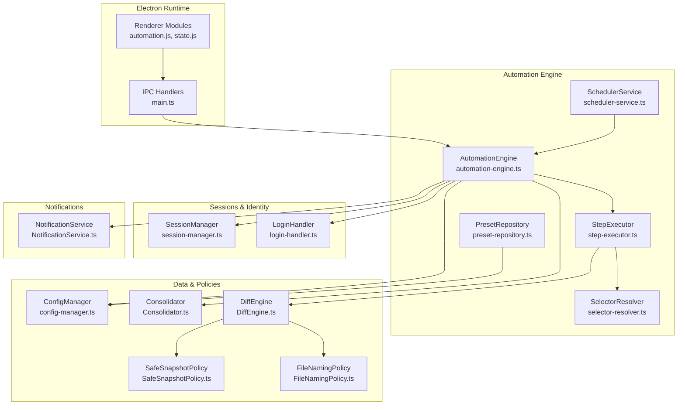
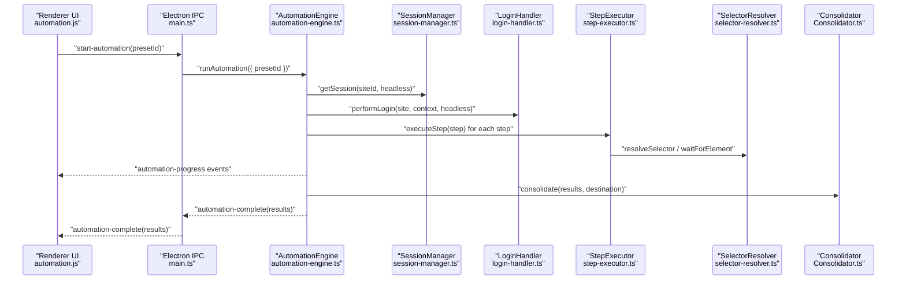
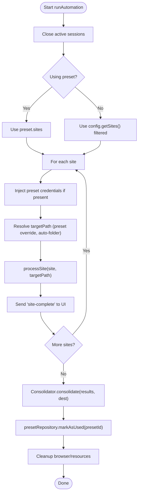
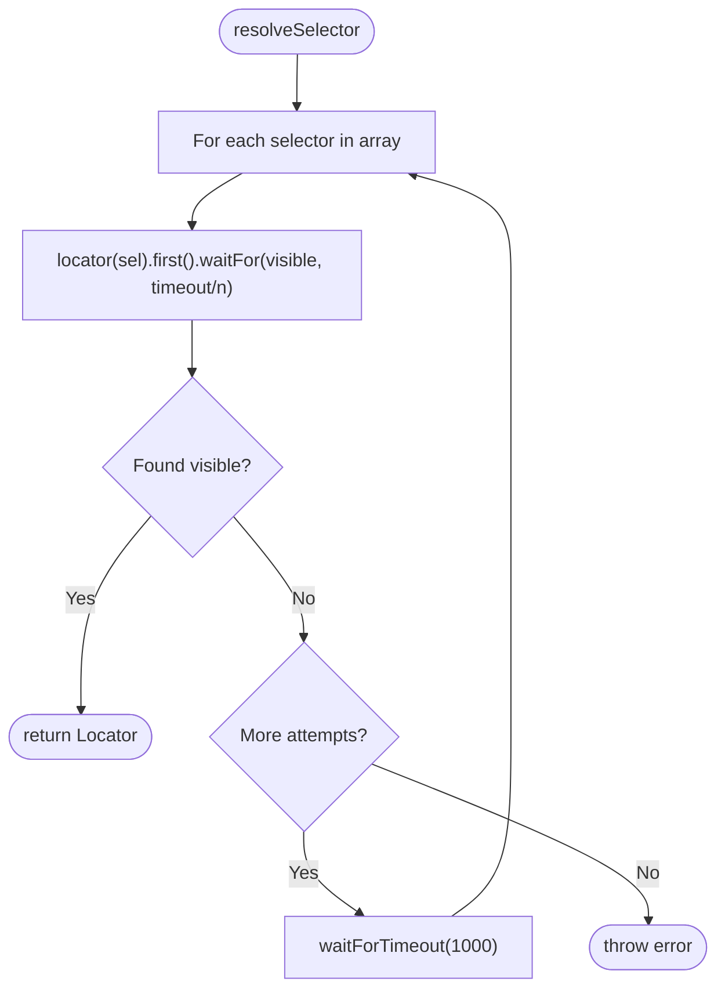
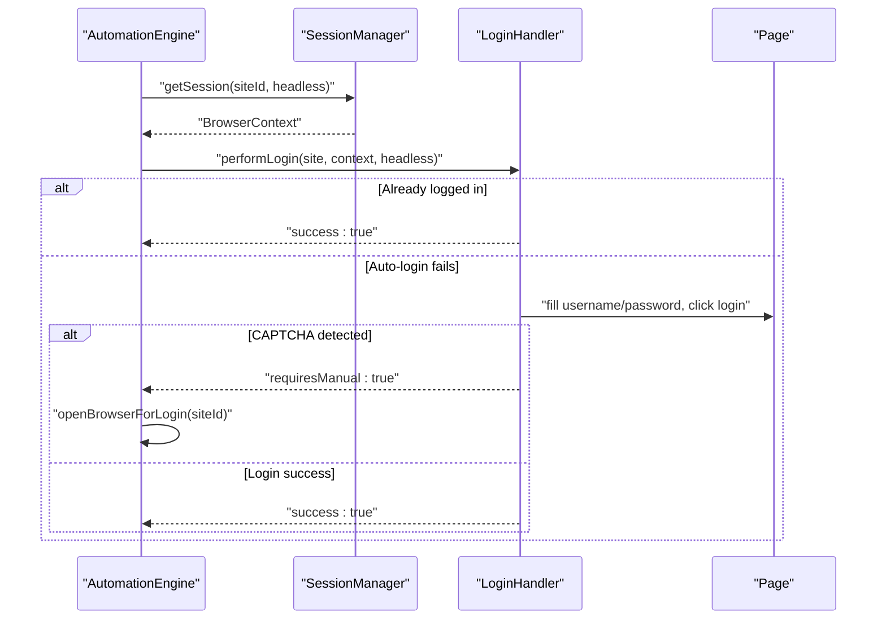
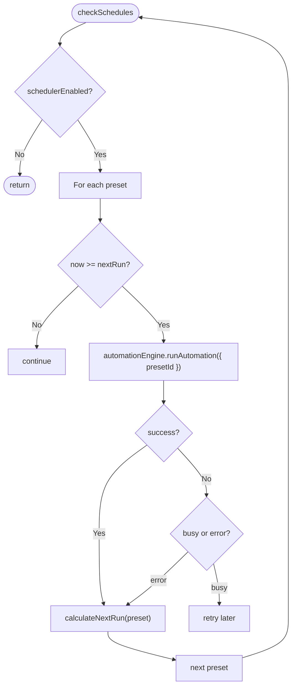
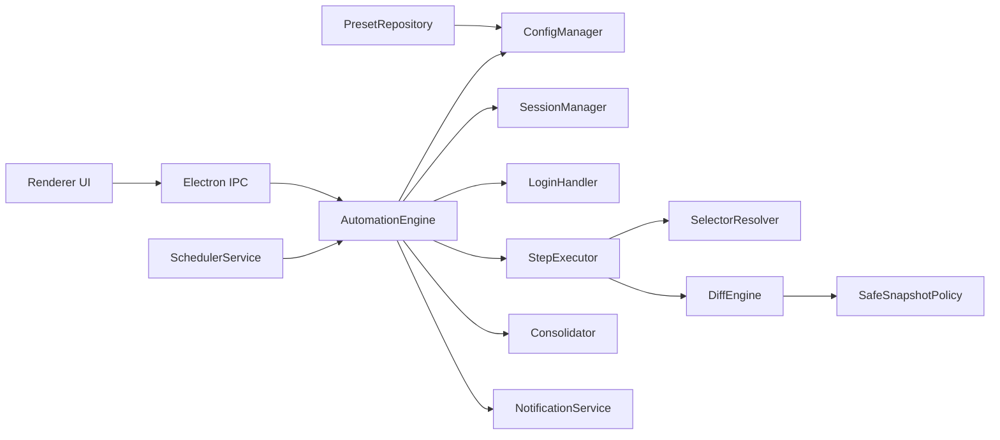

# Multi-Site Web Automation

<cite>
**Referenced Files in This Document**
- [automation-engine.ts](file://app/automation/engine/automation-engine.ts)
- [step-executor.ts](file://app/automation/engine/step-executor.ts)
- [selector-resolver.ts](file://app/automation/engine/selector-resolver.ts)
- [scheduler-service.ts](file://app/automation/engine/scheduler-service.ts)
- [preset-repository.ts](file://app/automation/engine/preset-repository.ts)
- [session-manager.ts](file://app/automation/sessions/session-manager.ts)
- [login-handler.ts](file://app/automation/sessions/login-handler.ts)
- [config-manager.ts](file://app/config/config-manager.ts)
- [Consolidator.ts](file://app/core/consolidation/Consolidator.ts)
- [DiffEngine.ts](file://app/core/diff/DiffEngine.ts)
- [SafeSnapshotPolicy.ts](file://app/policy/snapshot/SafeSnapshotPolicy.ts)
- [FileNamingPolicy.ts](file://app/policy/snapshot/FileNamingPolicy.ts)
- [NotificationService.ts](file://app/core/notifications/NotificationService.ts)
- [main.ts](file://app/electron/main.ts)
- [automation.js](file://app/renderer/modules/automation.js)
- [state.js](file://app/renderer/modules/state.js)
</cite>

## Table of Contents
1. [Introduction](#introduction)
2. [Project Structure](#project-structure)
3. [Core Components](#core-components)
4. [Architecture Overview](#architecture-overview)
5. [Detailed Component Analysis](#detailed-component-analysis)
6. [Dependency Analysis](#dependency-analysis)
7. [Performance Considerations](#performance-considerations)
8. [Troubleshooting Guide](#troubleshooting-guide)
9. [Conclusion](#conclusion)
10. [Appendices](#appendices)

## Introduction
This document explains the multi-site web automation capability implemented in the project. It covers how the system orchestrates automation across multiple websites and ERP systems simultaneously, the automation engine architecture, step-based workflow execution, selector resolution system, and concurrent site management. Practical automation scenarios such as data entry, form filling, report generation, and cross-system data transfer are detailed, along with retry logic, timeout management, progress tracking, and performance considerations for running multiple automation instances concurrently.

## Project Structure
The automation subsystem is organized around a central engine that coordinates sessions, executes step-based workflows, resolves selectors, and manages data consolidation and notifications. Electron bridges the UI and automation runtime, while configuration and scheduling tie everything together.



**Diagram sources**
- [main.ts](file://app/electron/main.ts#L117-L281)
- [automation-engine.ts](file://app/automation/engine/automation-engine.ts#L50-L608)
- [step-executor.ts](file://app/automation/engine/step-executor.ts#L25-L549)
- [selector-resolver.ts](file://app/automation/engine/selector-resolver.ts#L4-L135)
- [scheduler-service.ts](file://app/automation/engine/scheduler-service.ts#L6-L145)
- [preset-repository.ts](file://app/automation/engine/preset-repository.ts#L4-L34)
- [session-manager.ts](file://app/automation/sessions/session-manager.ts#L67-L225)
- [login-handler.ts](file://app/automation/sessions/login-handler.ts#L13-L364)
- [config-manager.ts](file://app/config/config-manager.ts#L85-L408)
- [Consolidator.ts](file://app/core/consolidation/Consolidator.ts#L20-L138)
- [DiffEngine.ts](file://app/core/diff/DiffEngine.ts#L23-L230)
- [SafeSnapshotPolicy.ts](file://app/policy/snapshot/SafeSnapshotPolicy.ts#L3-L25)
- [FileNamingPolicy.ts](file://app/policy/snapshot/FileNamingPolicy.ts#L23-L35)
- [NotificationService.ts](file://app/core/notifications/NotificationService.ts#L13-L115)

**Section sources**
- [automation-engine.ts](file://app/automation/engine/automation-engine.ts#L50-L608)
- [main.ts](file://app/electron/main.ts#L117-L281)

## Core Components
- AutomationEngine: Orchestrates multi-site runs, manages timeouts, emits progress, handles login and reauthentication, and triggers consolidation.
- StepExecutor: Executes step-based workflows with configurable timeouts, retries, delays, and specialized handlers for navigation, clicks, fills, selects, waits, and downloads.
- SelectorResolver: Robust selector resolution with fallback attempts, visibility checks, and element utilities.
- SessionManager: Manages persistent browser contexts per site to maintain sessions and avoid repeated logins.
- LoginHandler: Performs automatic login, detects CAPTCHA, supports manual intervention, and reauthenticates when sessions expire.
- SchedulerService: Periodically evaluates preset schedules and triggers automation runs.
- ConfigManager: Centralized configuration with Zod validation, path resolution, and preset management.
- Consolidator: Merges per-site snapshots into consolidated master reports.
- DiffEngine: Compares new downloads against previous snapshots to compute additions/removals and updates metadata.
- NotificationService: Sends automation summaries via email.

**Section sources**
- [automation-engine.ts](file://app/automation/engine/automation-engine.ts#L50-L608)
- [step-executor.ts](file://app/automation/engine/step-executor.ts#L25-L549)
- [selector-resolver.ts](file://app/automation/engine/selector-resolver.ts#L4-L135)
- [session-manager.ts](file://app/automation/sessions/session-manager.ts#L67-L225)
- [login-handler.ts](file://app/automation/sessions/login-handler.ts#L13-L364)
- [scheduler-service.ts](file://app/automation/engine/scheduler-service.ts#L6-L145)
- [config-manager.ts](file://app/config/config-manager.ts#L85-L408)
- [Consolidator.ts](file://app/core/consolidation/Consolidator.ts#L20-L138)
- [DiffEngine.ts](file://app/core/diff/DiffEngine.ts#L23-L230)
- [NotificationService.ts](file://app/core/notifications/NotificationService.ts#L13-L115)

## Architecture Overview
The system uses a preset-driven model where each preset encapsulates a set of isolated site configurations with credentials, steps, and optional destination paths. The engine runs presets sequentially, managing sessions per site and emitting progress events to the UI. Downloads are processed with intelligent snapshot policies for audit-ready reporting.



**Diagram sources**
- [automation.js](file://app/renderer/modules/automation.js#L7-L58)
- [main.ts](file://app/electron/main.ts#L214-L241)
- [automation-engine.ts](file://app/automation/engine/automation-engine.ts#L62-L238)
- [session-manager.ts](file://app/automation/sessions/session-manager.ts#L103-L138)
- [login-handler.ts](file://app/automation/sessions/login-handler.ts#L28-L77)
- [step-executor.ts](file://app/automation/engine/step-executor.ts#L59-L110)
- [selector-resolver.ts](file://app/automation/engine/selector-resolver.ts#L17-L48)
- [Consolidator.ts](file://app/core/consolidation/Consolidator.ts#L26-L63)

## Detailed Component Analysis

### Automation Engine
Responsibilities:
- Validates presets and site lists, injects preset credentials, and computes destination paths.
- Initializes sessions per site, performs login or reauthentication, and executes steps.
- Emits progress events and site-complete events to the UI.
- Consolidates results into master snapshots and sends automation summaries.

Key behaviors:
- Global timeout enforcement and forced cleanup.
- Auto-folder creation for destinations and report-type folders.
- Continue-on-error support per step.
- Progress emission for UI updates.



**Diagram sources**
- [automation-engine.ts](file://app/automation/engine/automation-engine.ts#L62-L238)
- [Consolidator.ts](file://app/core/consolidation/Consolidator.ts#L26-L63)

**Section sources**
- [automation-engine.ts](file://app/automation/engine/automation-engine.ts#L62-L238)

### Step Executor
Responsibilities:
- Executes step types: goto, click, hover, fill, fillDateRange, select, waitFor, download.
- Applies default timeouts/retries, action delays, and continues on error when configured.
- Handles dynamic date token resolution and date formatting for inputs.
- Supports download intelligence with Safe Snapshot Policy and DiffEngine integration.

```mermaid
flowchart TD
Enter([executeStep(step)]) --> Delay["Apply actionDelay if configured"]
Delay --> Choose{"step.type"}
Choose --> |goto| GoTo["page.goto(value, timeout)"]
Choose --> |click| Click["resolveSelector + click"]
Choose --> |hover| Hover["resolveSelector + hover"]
Choose --> |fill| Fill["resolveDateTokens + fill"]
Choose --> |fillDateRange| FillDR["resolveDateTokens,<br/>parse start/end,<br/>format per input type,<br/>fill two selectors"]
Choose --> |select| Select["resolveSelector + selectOption(label or value)"]
Choose --> |waitFor| Wait["waitForElement"]
Choose --> |download| Download["ensure folder,<br/>remove target='_blank',<br/>wait download,<br/>saveAs or SSP process"]
Download --> Diff{"reportType?"}
Diff --> |Yes| DiffRun["DiffEngine.run(siteId, identity, temp, base, keys)"]
DiffRun --> DiffOK{"Success?"}
DiffOK --> |Yes| SaveCurrent["Save CURRENT, write META"]
DiffOK --> |No| Fallback["Copy temp to .xls fallback"]
Diff --> |No| SaveNormal["SaveAs to path"]
SaveCurrent --> Exit([Done])
SaveNormal --> Exit
Fallback --> Exit
```

**Diagram sources**
- [step-executor.ts](file://app/automation/engine/step-executor.ts#L59-L511)
- [DiffEngine.ts](file://app/core/diff/DiffEngine.ts#L55-L219)
- [FileNamingPolicy.ts](file://app/policy/snapshot/FileNamingPolicy.ts#L23-L35)

**Section sources**
- [step-executor.ts](file://app/automation/engine/step-executor.ts#L59-L511)

### Selector Resolver
Responsibilities:
- Resolves a single or multiple selectors with retry logic and visibility checks.
- Provides helpers to check existence, visibility, text content, attributes, and counts.
- Waits for elements with adjustable timeouts.



**Diagram sources**
- [selector-resolver.ts](file://app/automation/engine/selector-resolver.ts#L17-L48)

**Section sources**
- [selector-resolver.ts](file://app/automation/engine/selector-resolver.ts#L17-L48)

### Session Management and Login
Responsibilities:
- Persistent browser contexts per site to reuse cookies and IndexedDB.
- Automatic login with credential injection, CAPTCHA detection, and manual intervention.
- Reauthentication when sessions expire during long runs.



**Diagram sources**
- [session-manager.ts](file://app/automation/sessions/session-manager.ts#L103-L138)
- [login-handler.ts](file://app/automation/sessions/login-handler.ts#L28-L77)
- [automation-engine.ts](file://app/automation/engine/automation-engine.ts#L478-L515)

**Section sources**
- [session-manager.ts](file://app/automation/sessions/session-manager.ts#L103-L138)
- [login-handler.ts](file://app/automation/sessions/login-handler.ts#L28-L77)

### Scheduler and Presets
Responsibilities:
- Evaluates preset schedules (interval or fixed times) and triggers automation runs.
- Prevents overlapping executions and watchdogs long-running tasks.



**Diagram sources**
- [scheduler-service.ts](file://app/automation/engine/scheduler-service.ts#L38-L96)
- [preset-repository.ts](file://app/automation/engine/preset-repository.ts#L28-L31)

**Section sources**
- [scheduler-service.ts](file://app/automation/engine/scheduler-service.ts#L38-L96)
- [preset-repository.ts](file://app/automation/engine/preset-repository.ts#L28-L31)

### Data Consolidation and Cross-System Transfer
Responsibilities:
- Merge per-site snapshot files into consolidated CURRENT and DELETED reports.
- Compute diffs using Safe Snapshot Policy and DiffEngine to track additions/removals.
- Build master snapshot names and resolve file paths.

```mermaid
flowchart TD
Start([consolidate(results, dest)]) --> Filter["Filter successful results with sspResult"]
Filter --> Empty{"Any?"}
Empty --> |No| Done([return null,null])
Empty --> |Yes| First["Use first result identity (tipo, period)"]
First --> MergeCurrent["mergeFiles(results, dest, currentFile, 'CONSOLIDADO.xlsx')"]
MergeCurrent --> MergeDeleted["mergeFiles(results, dest, deletedFile, 'CONSOLIDADO_EXCLUIDOS.xlsx')"]
MergeDeleted --> Return([return {current, deleted}])
```

**Diagram sources**
- [Consolidator.ts](file://app/core/consolidation/Consolidator.ts#L26-L63)
- [DiffEngine.ts](file://app/core/diff/DiffEngine.ts#L55-L219)
- [FileNamingPolicy.ts](file://app/policy/snapshot/FileNamingPolicy.ts#L14-L21)

**Section sources**
- [Consolidator.ts](file://app/core/consolidation/Consolidator.ts#L26-L63)
- [DiffEngine.ts](file://app/core/diff/DiffEngine.ts#L55-L219)
- [FileNamingPolicy.ts](file://app/policy/snapshot/FileNamingPolicy.ts#L14-L21)

## Dependency Analysis
The engine depends on configuration, session management, login handling, and data policies. The renderer communicates via IPC to trigger automation and receive progress/status updates.



**Diagram sources**
- [automation-engine.ts](file://app/automation/engine/automation-engine.ts#L50-L608)
- [config-manager.ts](file://app/config/config-manager.ts#L85-L408)
- [session-manager.ts](file://app/automation/sessions/session-manager.ts#L67-L225)
- [login-handler.ts](file://app/automation/sessions/login-handler.ts#L13-L364)
- [step-executor.ts](file://app/automation/engine/step-executor.ts#L25-L549)
- [selector-resolver.ts](file://app/automation/engine/selector-resolver.ts#L4-L135)
- [Consolidator.ts](file://app/core/consolidation/Consolidator.ts#L20-L138)
- [DiffEngine.ts](file://app/core/diff/DiffEngine.ts#L23-L230)
- [SafeSnapshotPolicy.ts](file://app/policy/snapshot/SafeSnapshotPolicy.ts#L3-L25)
- [NotificationService.ts](file://app/core/notifications/NotificationService.ts#L13-L115)
- [scheduler-service.ts](file://app/automation/engine/scheduler-service.ts#L6-L145)
- [preset-repository.ts](file://app/automation/engine/preset-repository.ts#L4-L34)
- [main.ts](file://app/electron/main.ts#L117-L281)
- [automation.js](file://app/renderer/modules/automation.js#L6-L59)

**Section sources**
- [automation-engine.ts](file://app/automation/engine/automation-engine.ts#L50-L608)
- [main.ts](file://app/electron/main.ts#L117-L281)

## Performance Considerations
- Concurrency model: The engine processes sites sequentially per run. There is no built-in parallelism across sites within a single run. To scale, run multiple presets concurrently by invoking the engine with different preset IDs externally or via scheduler.
- Resource management: Persistent contexts reduce login overhead but consume memory; periodic watchdogs monitor memory usage.
- Download and diff processing: Intelligent snapshot processing writes temporary files and computes diffs; ensure sufficient disk space and fast I/O for large datasets.
- Headless vs visible: Headless mode improves speed; visible mode enables manual CAPTCHA resolution.
- Retries and timeouts: Tune defaultRetries and defaultTimeout to balance reliability and runtime.

[No sources needed since this section provides general guidance]

## Troubleshooting Guide
Common issues and remedies:
- Login failures or CAPTCHA: The system detects CAPTCHA and either throws in headless mode or prompts manual login in visible mode. Reauthentication is supported when sessions expire mid-run.
- Selector not found: SelectorResolver retries and logs failures; verify selectors and increase retries or adjust timeouts.
- Downloads not saved: Ensure target path exists; the engine creates directories before clicking. For reportType-enabled downloads, confirm Safe Snapshot Policy configuration and primary keys.
- Automation stuck or slow: Check global timeout and scheduler watchdogs; review memory usage and consider reducing concurrent external processes.
- Progress not updating: Verify progress events are emitted and UI listeners are active.

**Section sources**
- [login-handler.ts](file://app/automation/sessions/login-handler.ts#L56-L77)
- [login-handler.ts](file://app/automation/sessions/login-handler.ts#L288-L328)
- [selector-resolver.ts](file://app/automation/engine/selector-resolver.ts#L17-L48)
- [step-executor.ts](file://app/automation/engine/step-executor.ts#L402-L511)
- [automation-engine.ts](file://app/automation/engine/automation-engine.ts#L72-L81)
- [main.ts](file://app/electron/main.ts#L102-L114)

## Conclusion
The multi-site automation system provides a robust, preset-driven framework for orchestrating web and ERP interactions. It emphasizes reliability through persistent sessions, intelligent selector resolution, configurable retries/timeouts, and audit-ready snapshot consolidation. While the engine runs sites sequentially per run, the scheduler and IPC enable orchestrated multi-preset execution suitable for continuous operation across diverse systems.

[No sources needed since this section summarizes without analyzing specific files]

## Appendices

### Practical Automation Scenarios
- Data entry and form filling:
  - Use fill and fillDateRange steps with dynamic tokens for dates.
  - Configure selectors and values in steps; leverage continueOnError for resilience.
- Report generation and download:
  - Use download steps with optional reportType to enable Safe Snapshot Policy and DiffEngine processing.
  - Destination inference and auto-folder creation streamline report organization.
- Cross-system data transfer:
  - Consolidator merges snapshots into master reports for downstream systems.
  - DiffEngine tracks additions/removals per period and maintains metadata.

**Section sources**
- [step-executor.ts](file://app/automation/engine/step-executor.ts#L181-L260)
- [step-executor.ts](file://app/automation/engine/step-executor.ts#L440-L489)
- [Consolidator.ts](file://app/core/consolidation/Consolidator.ts#L26-L63)
- [DiffEngine.ts](file://app/core/diff/DiffEngine.ts#L55-L219)

### Retry Logic and Timeouts
- Default retries and timeouts are configurable via ConfigManager and applied per step.
- SelectorResolver retries with small delays between attempts.
- StepExecutor supports continueOnError to skip failing steps and continue the workflow.

**Section sources**
- [config-manager.ts](file://app/config/config-manager.ts#L58-L81)
- [step-executor.ts](file://app/automation/engine/step-executor.ts#L68-L69)
- [selector-resolver.ts](file://app/automation/engine/selector-resolver.ts#L20-L44)

### Progress Tracking and Notifications
- AutomationEngine emits progress events and site-complete events for UI updates.
- NotificationService sends automation summaries via email when configured.

**Section sources**
- [automation-engine.ts](file://app/automation/engine/automation-engine.ts#L280-L288)
- [automation-engine.ts](file://app/automation/engine/automation-engine.ts#L157-L161)
- [NotificationService.ts](file://app/core/notifications/NotificationService.ts#L75-L111)