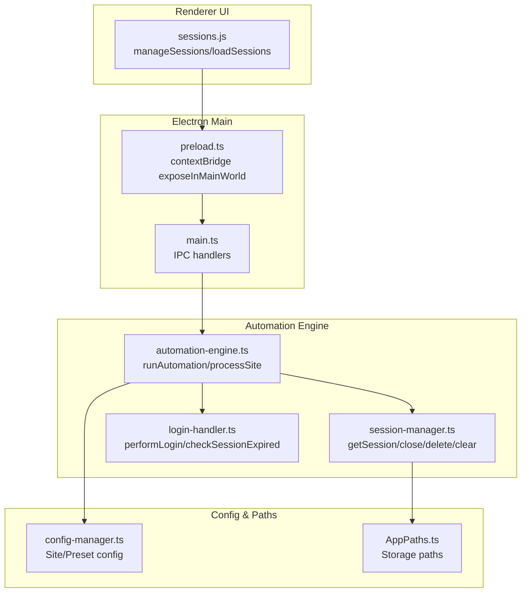
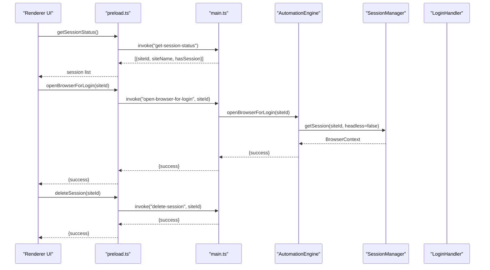
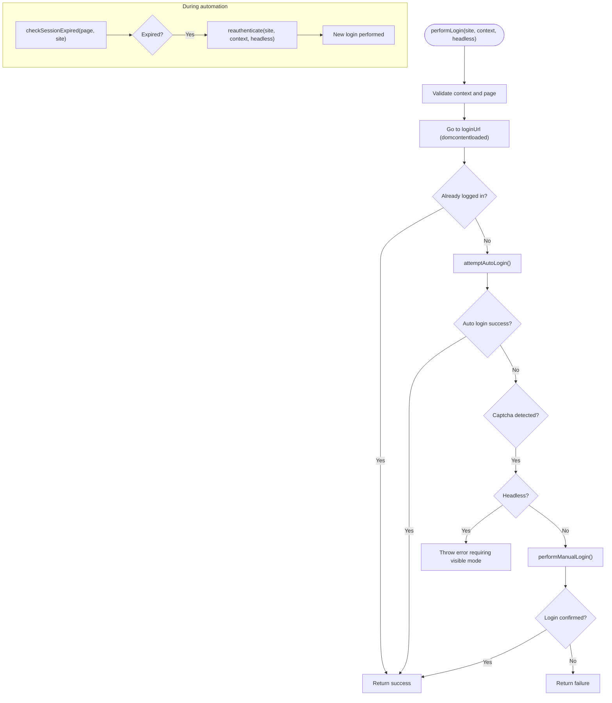
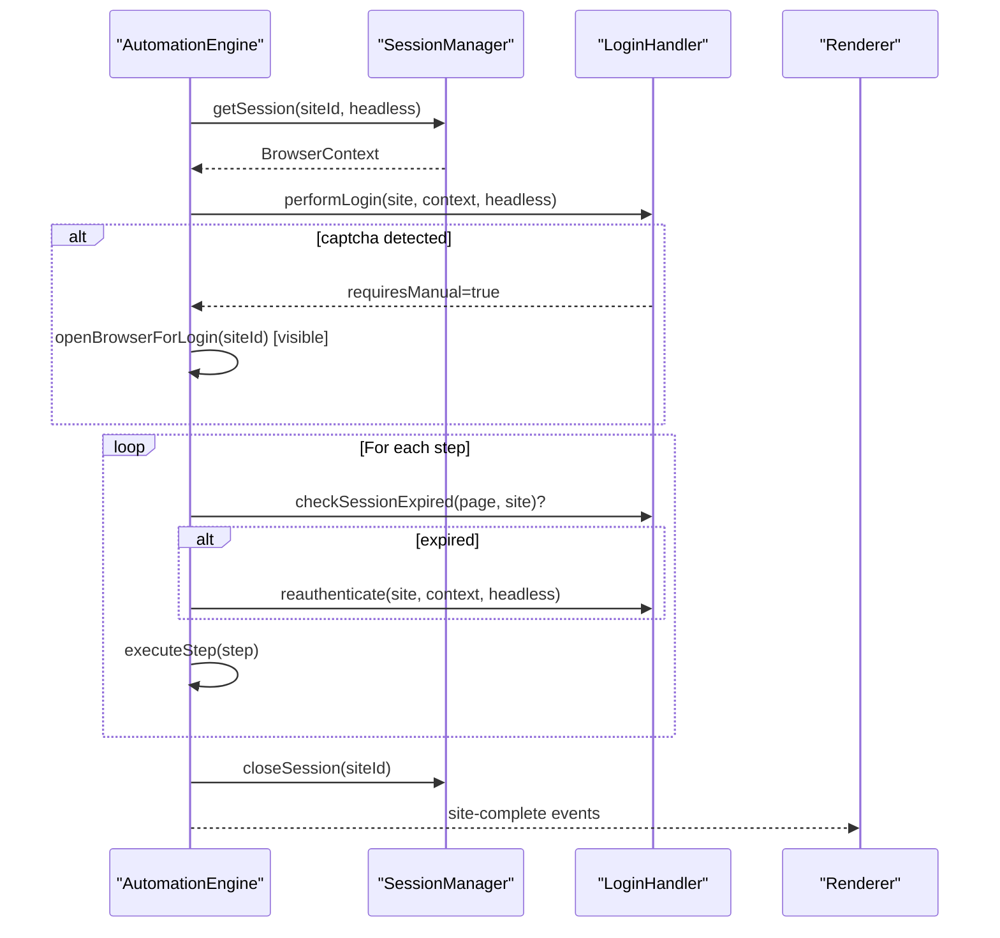
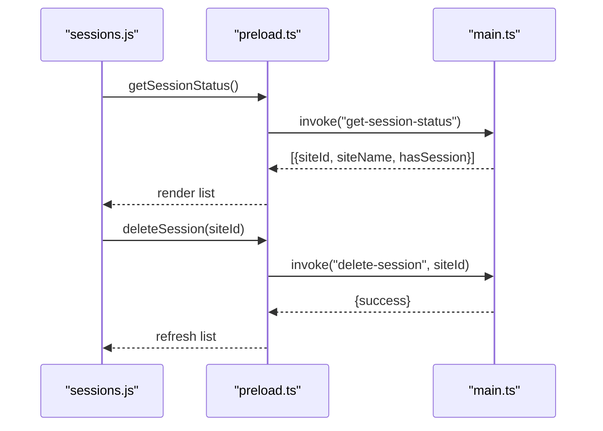
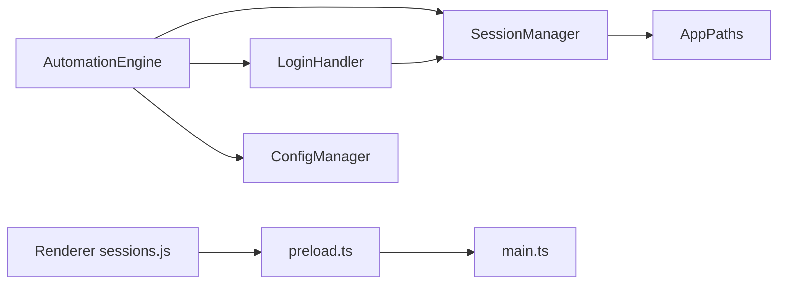

# Persistent Session Management

<cite>
**Referenced Files in This Document**
- [session-manager.ts](file://app/automation/sessions/session-manager.ts)
- [login-handler.ts](file://app/automation/sessions/login-handler.ts)
- [automation-engine.ts](file://app/automation/engine/automation-engine.ts)
- [config-manager.ts](file://app/config/config-manager.ts)
- [AppPaths.ts](file://app/core/utils/AppPaths.ts)
- [sessions.js](file://app/renderer/modules/sessions.js)
- [preload.ts](file://app/electron/preload.ts)
- [main.ts](file://app/electron/main.ts)
- [app-config.json](file://app/config/app-config.json)
- [FASE 4 — LOGIN + SESSÃO (ANTI CAPTCHA).md](file://docs/FASE 4 — LOGIN + SESSÃO (ANTI CAPTCHA).md)
</cite>

## Table of Contents
1. [Introduction](#introduction)
2. [Project Structure](#project-structure)
3. [Core Components](#core-components)
4. [Architecture Overview](#architecture-overview)
5. [Detailed Component Analysis](#detailed-component-analysis)
6. [Dependency Analysis](#dependency-analysis)
7. [Performance Considerations](#performance-considerations)
8. [Troubleshooting Guide](#troubleshooting-guide)
9. [Conclusion](#conclusion)
10. [Appendices](#appendices)

## Introduction
This document explains the persistent session management system used to maintain browser contexts across automation sessions, implement anti-captcha support, and handle session persistence. It covers the session lifecycle, re-authentication mechanisms, recovery procedures, security considerations, isolation, and performance optimization for long-running tasks. Practical examples demonstrate configuration, login automation, and troubleshooting common session issues.

## Project Structure
The session management system spans backend automation logic, Electron IPC, and renderer UI modules:
- Backend automation engine orchestrates sessions and login flows
- Session manager creates and persists browser contexts per site
- Login handler performs automated login, detects captchas, and supports manual intervention
- Electron exposes safe IPC methods for UI actions
- Renderer modules present session controls and delegate actions to the backend



**Diagram sources**
- [main.ts](file://app/electron/main.ts#L117-L281)
- [preload.ts](file://app/electron/preload.ts#L5-L47)
- [automation-engine.ts](file://app/automation/engine/automation-engine.ts#L50-L611)
- [session-manager.ts](file://app/automation/sessions/session-manager.ts#L67-L225)
- [login-handler.ts](file://app/automation/sessions/login-handler.ts#L13-L364)
- [sessions.js](file://app/renderer/modules/sessions.js#L5-L104)
- [config-manager.ts](file://app/config/config-manager.ts#L85-L408)
- [AppPaths.ts](file://app/core/utils/AppPaths.ts#L5-L60)

**Section sources**
- [main.ts](file://app/electron/main.ts#L117-L281)
- [preload.ts](file://app/electron/preload.ts#L5-L47)
- [automation-engine.ts](file://app/automation/engine/automation-engine.ts#L50-L611)
- [session-manager.ts](file://app/automation/sessions/session-manager.ts#L67-L225)
- [login-handler.ts](file://app/automation/sessions/login-handler.ts#L13-L364)
- [sessions.js](file://app/renderer/modules/sessions.js#L5-L104)
- [config-manager.ts](file://app/config/config-manager.ts#L85-L408)
- [AppPaths.ts](file://app/core/utils/AppPaths.ts#L5-L60)

## Core Components
- SessionManager: Creates persistent browser contexts per site, manages lifecycle, and cleans up sessions
- LoginHandler: Performs automated login, detects captchas, supports manual login, and re-authenticates when sessions expire
- AutomationEngine: Orchestrates site processing, injects credentials, monitors session expiration, and triggers reauthentication
- Electron IPC: Exposes safe methods for UI to manage sessions and open manual browser windows
- Renderer sessions module: Loads and displays saved sessions, triggers deletion, and opens manual login windows
- ConfigManager and AppPaths: Provide validated site/preset configurations and define storage locations

Key capabilities:
- Persistent contexts per site using Playwright’s persistent context
- Anti-captcha support via manual login in visible mode
- Session isolation per site ID
- Automatic cleanup and recovery on expiration

**Section sources**
- [session-manager.ts](file://app/automation/sessions/session-manager.ts#L67-L225)
- [login-handler.ts](file://app/automation/sessions/login-handler.ts#L13-L364)
- [automation-engine.ts](file://app/automation/engine/automation-engine.ts#L262-L446)
- [sessions.js](file://app/renderer/modules/sessions.js#L5-L104)
- [preload.ts](file://app/electron/preload.ts#L5-L47)
- [main.ts](file://app/electron/main.ts#L167-L200)
- [config-manager.ts](file://app/config/config-manager.ts#L85-L408)
- [AppPaths.ts](file://app/core/utils/AppPaths.ts#L5-L60)

## Architecture Overview
The system integrates Playwright persistent contexts with Electron IPC and a renderer-driven UI. The automation engine requests a session per site, navigates to the login page, attempts automated login, and falls back to manual resolution when captchas are detected. During long-running runs, the engine periodically checks for session expiration and reauthenticates automatically.



**Diagram sources**
- [sessions.js](file://app/renderer/modules/sessions.js#L11-L83)
- [preload.ts](file://app/electron/preload.ts#L15-L19)
- [main.ts](file://app/electron/main.ts#L167-L200)
- [automation-engine.ts](file://app/automation/engine/automation-engine.ts#L478-L515)
- [session-manager.ts](file://app/automation/sessions/session-manager.ts#L103-L138)

## Detailed Component Analysis

### SessionManager
Responsibilities:
- Ensures Playwright browsers are installed in a managed location
- Creates persistent browser contexts per site ID
- Manages active sessions in memory and persists profile data on disk
- Supports closing, deleting, and clearing sessions

Implementation highlights:
- Uses Playwright’s persistent context to store cookies, cache, and IndexedDB
- Stores profiles under a dedicated path derived from AppPaths
- Provides status reporting for active vs persisted sessions
- Auto-migrates legacy storage locations during initialization

```mermaid
classDiagram
class SessionManager {
-profilesDir : string
-activeSessions : Map~string, BrowserContext~
+constructor()
+getSession(siteId, headless) : Promise~BrowserContext~
+closeSession(siteId) : Promise~void~
+closeActiveSessions() : Promise~void~
+deleteSession(siteId) : Promise~void~
+clearAllSessions() : Promise~void~
+getSessionStatus() : {active, persisted}
+saveSession(siteId, context) : Promise~void~
}
```

**Diagram sources**
- [session-manager.ts](file://app/automation/sessions/session-manager.ts#L67-L225)
- [AppPaths.ts](file://app/core/utils/AppPaths.ts#L27-L29)

**Section sources**
- [session-manager.ts](file://app/automation/sessions/session-manager.ts#L67-L225)
- [AppPaths.ts](file://app/core/utils/AppPaths.ts#L27-L29)

### LoginHandler
Responsibilities:
- Attempts automated login using configured selectors and credentials
- Detects existing logged-in state and redirects accordingly
- Detects captchas and switches to manual login mode
- Validates successful login and checks for session expiration during automation
- Reauthenticates by deleting the expired session and performing a fresh login

Anti-captcha support:
- If a captcha is detected, throws an error when running headless
- Otherwise, waits for manual login confirmation in visible mode with a timeout

Session expiration detection:
- Checks URL path and presence of “session expired” indicators
- Returns true when the user is redirected to a login page

Reauthentication:
- Deletes the persisted session for the site
- Initiates a new login flow using the same context



**Diagram sources**
- [login-handler.ts](file://app/automation/sessions/login-handler.ts#L28-L364)
- [automation-engine.ts](file://app/automation/engine/automation-engine.ts#L350-L375)

**Section sources**
- [login-handler.ts](file://app/automation/sessions/login-handler.ts#L13-L364)
- [automation-engine.ts](file://app/automation/engine/automation-engine.ts#L350-L375)

### AutomationEngine
Responsibilities:
- Runs automation for one or more sites, optionally scoped by a preset
- Requests a session per site, ensures visibility, and performs login if needed
- Executes workflow steps, monitoring for session expiration and triggering reauthentication
- Emits progress events and cleans up sessions after each site
- Supports opening a manual browser window for login or captcha resolution

Key behaviors:
- Cleans up previous active sessions before starting
- Injects preset credentials into site configs when applicable
- Emits progress updates and site completion events to the UI
- Forces cleanup of sessions after each site to prevent resource leaks



**Diagram sources**
- [automation-engine.ts](file://app/automation/engine/automation-engine.ts#L262-L446)
- [session-manager.ts](file://app/automation/sessions/session-manager.ts#L103-L138)
- [login-handler.ts](file://app/automation/sessions/login-handler.ts#L28-L364)

**Section sources**
- [automation-engine.ts](file://app/automation/engine/automation-engine.ts#L62-L238)
- [automation-engine.ts](file://app/automation/engine/automation-engine.ts#L262-L446)

### Electron IPC and Renderer Integration
- preload.ts exposes safe IPC methods to the renderer, including session management and manual login
- main.ts registers handlers for session status, deletion, clearing, and manual browser opening
- sessions.js loads and displays sessions, triggers deletion, and opens manual login windows



**Diagram sources**
- [sessions.js](file://app/renderer/modules/sessions.js#L11-L83)
- [preload.ts](file://app/electron/preload.ts#L15-L19)
- [main.ts](file://app/electron/main.ts#L167-L196)

**Section sources**
- [sessions.js](file://app/renderer/modules/sessions.js#L5-L104)
- [preload.ts](file://app/electron/preload.ts#L5-L47)
- [main.ts](file://app/electron/main.ts#L167-L200)

## Dependency Analysis
The system exhibits clear separation of concerns:
- AutomationEngine depends on SessionManager and LoginHandler
- LoginHandler depends on SessionManager for session deletion during reauthentication
- Electron main process exposes IPC handlers used by the renderer
- ConfigManager provides validated site and preset configurations
- AppPaths centralizes storage locations for profiles and browsers



**Diagram sources**
- [automation-engine.ts](file://app/automation/engine/automation-engine.ts#L50-L611)
- [session-manager.ts](file://app/automation/sessions/session-manager.ts#L67-L225)
- [login-handler.ts](file://app/automation/sessions/login-handler.ts#L13-L364)
- [sessions.js](file://app/renderer/modules/sessions.js#L5-L104)
- [preload.ts](file://app/electron/preload.ts#L5-L47)
- [main.ts](file://app/electron/main.ts#L117-L281)
- [config-manager.ts](file://app/config/config-manager.ts#L85-L408)
- [AppPaths.ts](file://app/core/utils/AppPaths.ts#L5-L60)

**Section sources**
- [automation-engine.ts](file://app/automation/engine/automation-engine.ts#L50-L611)
- [session-manager.ts](file://app/automation/sessions/session-manager.ts#L67-L225)
- [login-handler.ts](file://app/automation/sessions/login-handler.ts#L13-L364)
- [sessions.js](file://app/renderer/modules/sessions.js#L5-L104)
- [preload.ts](file://app/electron/preload.ts#L5-L47)
- [main.ts](file://app/electron/main.ts#L117-L281)
- [config-manager.ts](file://app/config/config-manager.ts#L85-L408)
- [AppPaths.ts](file://app/core/utils/AppPaths.ts#L5-L60)

## Performance Considerations
- Persistent contexts reduce repeated login overhead and improve throughput
- Headless mode is recommended for production runs to minimize resource usage
- Long-running sessions should periodically check for expiration and reauthenticate to avoid stalls
- Cleanup after each site prevents accumulation of browser processes and memory leaks
- Auto-installation of Playwright browsers occurs once and is reused across runs

Recommendations:
- Keep sessions closed between sites to free resources
- Use preset-scoped credentials to avoid repeated credential prompts
- Monitor memory usage and restart the app if needed for extended 24/7 operations

[No sources needed since this section provides general guidance]

## Troubleshooting Guide
Common issues and resolutions:
- Captcha detected in headless mode: Switch to visible mode and resolve manually; the system will throw an error in headless mode when captchas are detected
- Session expired during automation: The engine detects expiration and triggers reauthentication; ensure the context remains open
- Profile locked or “file locked” errors: Close all active sessions before starting a manual login or rebuild
- Missing or corrupted browsers: The system auto-installs Playwright Chromium if missing; ensure write permissions to the managed browsers path
- Session not persisting: Verify the profiles directory exists and is writable; the system auto-migrates legacy paths

Practical steps:
- Open manual browser for login: Use the UI to open a visible browser for the given site ID
- Delete a single session: Clear cookies and storage for a specific site
- Clear all sessions: Remove all persisted profiles

**Section sources**
- [login-handler.ts](file://app/automation/sessions/login-handler.ts#L56-L67)
- [automation-engine.ts](file://app/automation/engine/automation-engine.ts#L350-L375)
- [main.ts](file://app/electron/main.ts#L193-L196)
- [session-manager.ts](file://app/automation/sessions/session-manager.ts#L170-L183)

## Conclusion
The persistent session management system leverages Playwright’s persistent contexts to maintain browser state across automation runs, with robust anti-captcha support through manual intervention and automatic reauthentication on expiration. The Electron IPC layer provides a clean UI surface for managing sessions, while the automation engine coordinates lifecycle, isolation, and recovery. By following the best practices outlined here, teams can operate reliable, secure, and efficient long-running automation tasks.

[No sources needed since this section summarizes without analyzing specific files]

## Appendices

### Practical Examples

- Session configuration and login automation
  - Configure sites and presets in the application configuration
  - Run automation with a preset to inject credentials and isolate execution
  - The engine requests a session per site, performs login, and executes steps

- Anti-captcha support
  - Automated login is attempted first
  - If a captcha is detected, the system requires visible mode for manual resolution
  - After manual login, the session is reused in subsequent runs

- Managing sessions via UI
  - Load sessions list and open a manual browser for login or captcha resolution
  - Delete individual sessions or clear all sessions when needed

- Security considerations
  - Use isolated sessions per site ID to prevent cross-site contamination
  - Prefer headless mode for production runs to reduce detectability
  - Store sensitive credentials securely; the current implementation uses preset injection and placeholders for credentials

- Performance optimization
  - Close sessions after each site to free resources
  - Use preset destinations to organize outputs efficiently
  - Monitor memory usage and restart the app if necessary for continuous operation

**Section sources**
- [app-config.json](file://app/config/app-config.json#L1-L1521)
- [automation-engine.ts](file://app/automation/engine/automation-engine.ts#L62-L238)
- [sessions.js](file://app/renderer/modules/sessions.js#L5-L104)
- [FASE 4 — LOGIN + SESSÃO (ANTI CAPTCHA).md](file://docs/FASE 4 — LOGIN + SESSÃO (ANTI CAPTCHA).md#L1-L15)