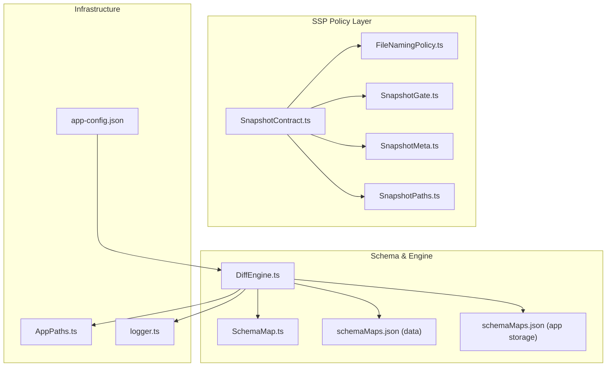
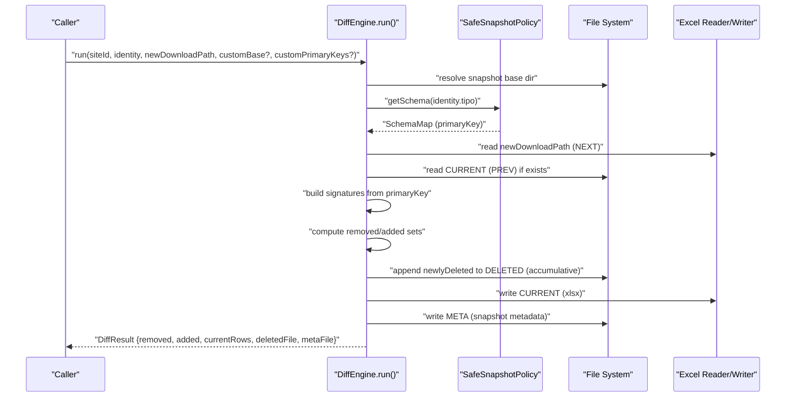
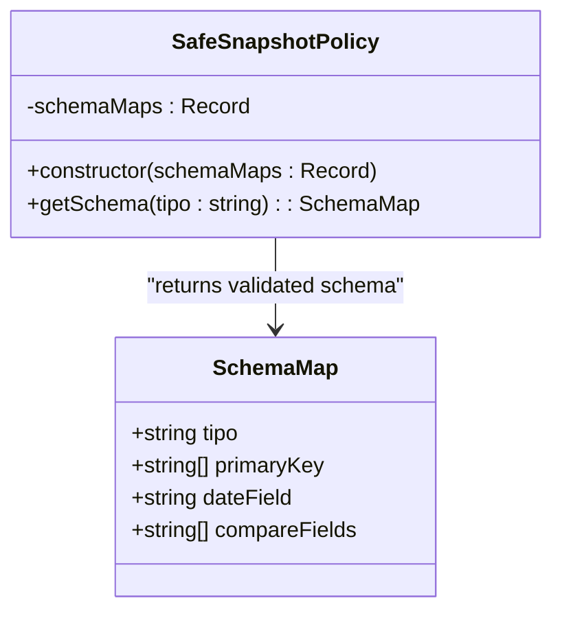
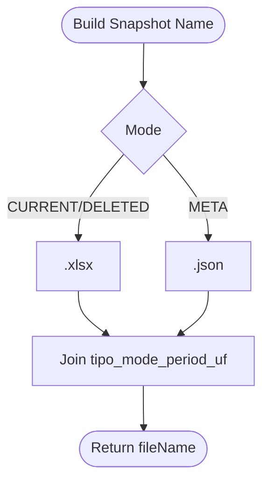
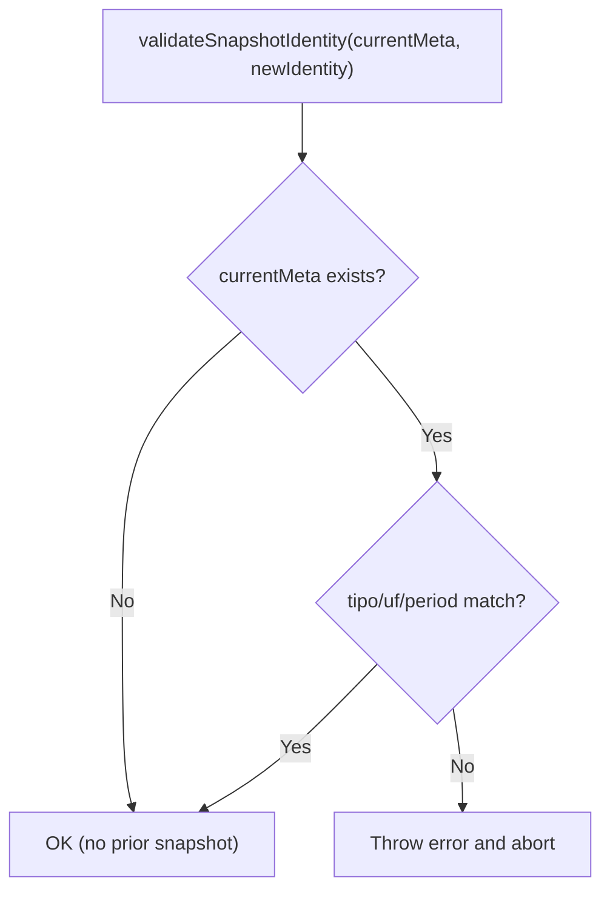
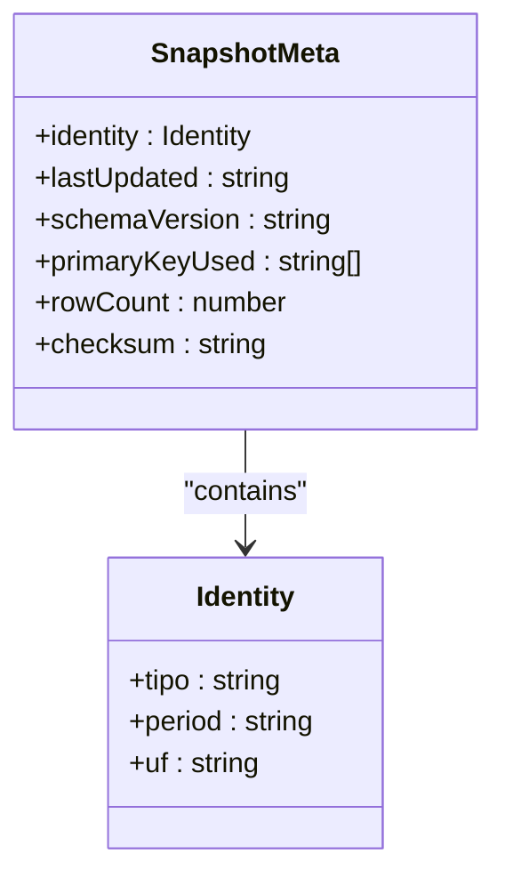
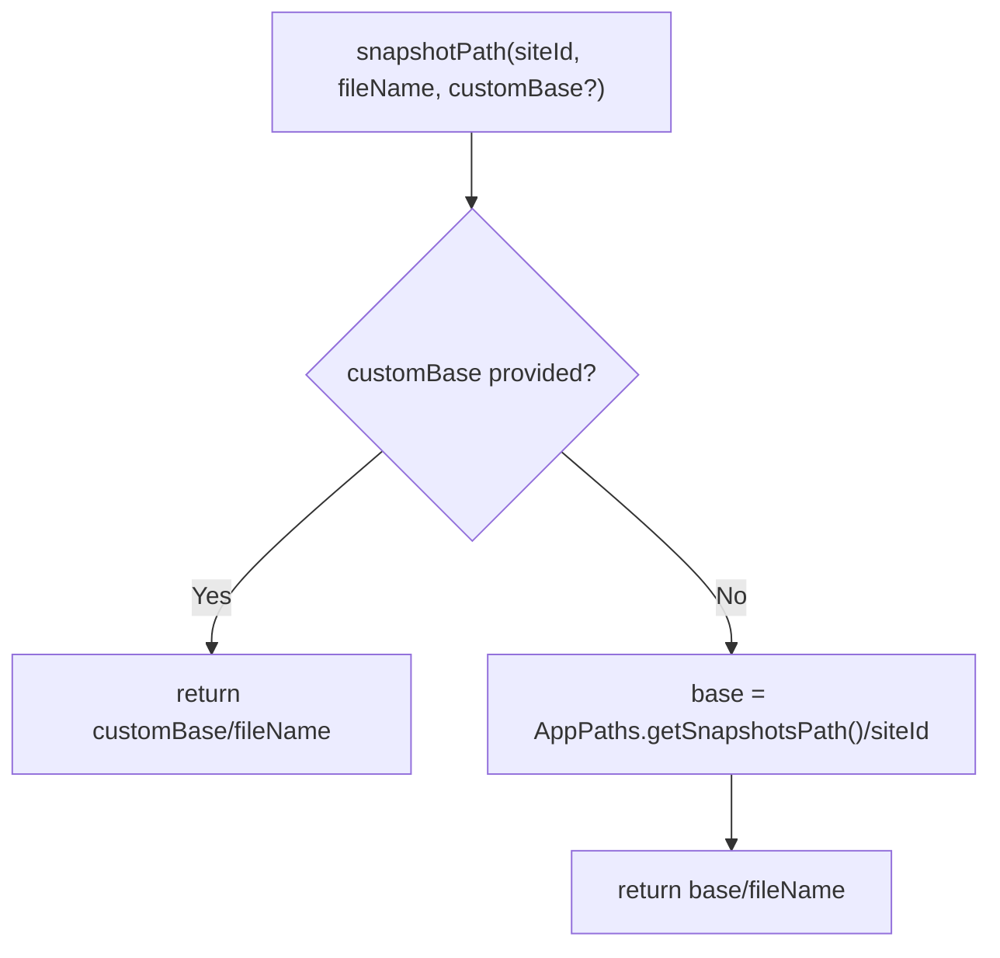
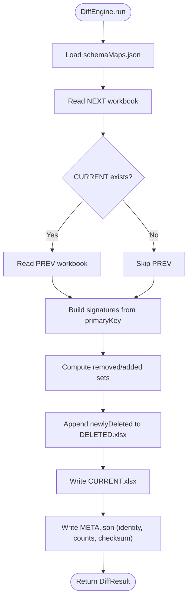
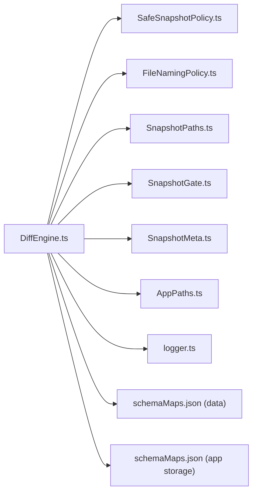

# Safe Snapshot Policy (SSP)

<cite>
**Referenced Files in This Document**
- [SafeSnapshotPolicy.ts](file://app/policy/snapshot/SafeSnapshotPolicy.ts)
- [FileNamingPolicy.ts](file://app/policy/snapshot/FileNamingPolicy.ts)
- [SnapshotContract.ts](file://app/policy/snapshot/SnapshotContract.ts)
- [SnapshotGate.ts](file://app/policy/snapshot/SnapshotGate.ts)
- [SnapshotMeta.ts](file://app/policy/snapshot/SnapshotMeta.ts)
- [SnapshotPaths.ts](file://app/policy/snapshot/SnapshotPaths.ts)
- [SchemaMap.ts](file://app/config/SchemaMap.ts)
- [DiffEngine.ts](file://app/core/diff/DiffEngine.ts)
- [schemaMaps.json (data)](file://data/schemaMaps.json)
- [schemaMaps.json (app storage)](file://app/storage/schemaMaps.json)
- [AppPaths.ts](file://app/core/utils/AppPaths.ts)
- [logger.ts](file://app/config/logger.ts)
- [app-config.json](file://app/config/app-config.json)
</cite>

## Table of Contents
1. [Introduction](#introduction)
2. [Project Structure](#project-structure)
3. [Core Components](#core-components)
4. [Architecture Overview](#architecture-overview)
5. [Detailed Component Analysis](#detailed-component-analysis)
6. [Dependency Analysis](#dependency-analysis)
7. [Performance Considerations](#performance-considerations)
8. [Troubleshooting Guide](#troubleshooting-guide)
9. [Conclusion](#conclusion)
10. [Appendices](#appendices)

## Introduction
This document describes the Safe Snapshot Policy (SSP) system, an enterprise-grade data integrity verification mechanism designed to ensure compliance reporting, prevent data drift, and maintain historical records. SSP enforces deterministic file naming, leverages schema-based comparison algorithms, and generates robust audit trails. It integrates tightly with the diff engine to compute deltas between snapshots, manage deletions, and persist metadata for traceability.

SSP’s responsibilities include:
- Deterministic file naming for current, deleted, and metadata artifacts
- Identity validation to prevent cross-period/cross-region corruption
- Schema-driven primary key selection for reliable row signatures
- Delta computation and deletion accumulation
- Audit trail generation via logging and metadata persistence

## Project Structure
SSP resides under app/policy/snapshot and integrates with app/core/diff and app/config. The schema registry is loaded from data/schemaMaps.json (packaged location) or app/storage/schemaMaps.json (development). Paths for snapshots are derived from AppPaths.

**Diagram sources**
- [SnapshotContract.ts](file://app/policy/snapshot/SnapshotContract.ts#L1-L20)
- [FileNamingPolicy.ts](file://app/policy/snapshot/FileNamingPolicy.ts#L1-L35)
- [SnapshotGate.ts](file://app/policy/snapshot/SnapshotGate.ts#L1-L28)
- [SnapshotMeta.ts](file://app/policy/snapshot/SnapshotMeta.ts#L1-L18)
- [SnapshotPaths.ts](file://app/policy/snapshot/SnapshotPaths.ts#L1-L13)
- [SchemaMap.ts](file://app/config/SchemaMap.ts#L1-L13)
- [DiffEngine.ts](file://app/core/diff/DiffEngine.ts#L1-L230)
- [schemaMaps.json (data)](file://data/schemaMaps.json#L1-L9)
- [schemaMaps.json (app storage)](file://app/storage/schemaMaps.json#L1-L9)
- [AppPaths.ts](file://app/core/utils/AppPaths.ts#L1-L60)
- [logger.ts](file://app/config/logger.ts#L1-L104)
- [app-config.json](file://app/config/app-config.json#L1-L1521)

**Section sources**
- [AppPaths.ts](file://app/core/utils/AppPaths.ts#L37-L39)
- [DiffEngine.ts](file://app/core/diff/DiffEngine.ts#L26-L45)

## Core Components
- SafeSnapshotPolicy: Validates and retrieves schema maps per report type, ensuring a non-empty primary key is present.
- FileNamingPolicy: Generates deterministic filenames for current, deleted, and metadata artifacts; resolves snapshot file paths.
- SnapshotContract: Defines identity and file descriptors for snapshots.
- SnapshotGate: Validates snapshot identity to prevent mismatches across runs.
- SnapshotMeta: Captures identity, timestamps, schema version, primary keys used, row counts, and checksums.
- SnapshotPaths: Resolves snapshot base paths, supporting custom bases and site-scoped directories.
- DiffEngine: Orchestrates snapshot comparison, delta calculation, deletion accumulation, and metadata generation.

**Section sources**
- [SafeSnapshotPolicy.ts](file://app/policy/snapshot/SafeSnapshotPolicy.ts#L1-L25)
- [FileNamingPolicy.ts](file://app/policy/snapshot/FileNamingPolicy.ts#L1-L35)
- [SnapshotContract.ts](file://app/policy/snapshot/SnapshotContract.ts#L1-L20)
- [SnapshotGate.ts](file://app/policy/snapshot/SnapshotGate.ts#L1-L28)
- [SnapshotMeta.ts](file://app/policy/snapshot/SnapshotMeta.ts#L1-L18)
- [SnapshotPaths.ts](file://app/policy/snapshot/SnapshotPaths.ts#L1-L13)
- [DiffEngine.ts](file://app/core/diff/DiffEngine.ts#L23-L230)

## Architecture Overview
SSP ensures integrity by enforcing schema-driven signatures, deterministic naming, and identity checks. The DiffEngine loads schema maps, computes signatures from primary keys, compares previous and next datasets, writes consolidated deleted rows, persists a new current snapshot, and updates metadata.

**Diagram sources**
- [DiffEngine.ts](file://app/core/diff/DiffEngine.ts#L55-L219)
- [SafeSnapshotPolicy.ts](file://app/policy/snapshot/SafeSnapshotPolicy.ts#L8-L23)

## Detailed Component Analysis

### SafeSnapshotPolicy
- Purpose: Centralized retrieval and validation of schema maps per report type.
- Validation:
  - Throws if no schema exists for the given type.
  - Throws if the primary key is missing or empty.
- Integration: Used by DiffEngine to derive primary keys for signature computation.

**Diagram sources**
- [SafeSnapshotPolicy.ts](file://app/policy/snapshot/SafeSnapshotPolicy.ts#L3-L23)
- [SchemaMap.ts](file://app/config/SchemaMap.ts#L1-L13)

**Section sources**
- [SafeSnapshotPolicy.ts](file://app/policy/snapshot/SafeSnapshotPolicy.ts#L8-L23)
- [SchemaMap.ts](file://app/config/SchemaMap.ts#L1-L13)

### FileNamingPolicy
- Deterministic naming strategy:
  - Current snapshot: {tipo}_CURRENT_{period}_{uf}.xlsx
  - Deleted snapshot: {tipo}_DELETED_{period}_{uf}.xlsx
  - Metadata: {tipo}_META_{period}_{uf}.json
  - Master consolidated: CONSOLIDADO{suffix}_{tipo}_{period}.xlsx (DELETED suffix for deleted-only)
- Path resolution: Builds absolute paths from base directory and identity.

**Diagram sources**
- [FileNamingPolicy.ts](file://app/policy/snapshot/FileNamingPolicy.ts#L4-L21)

**Section sources**
- [FileNamingPolicy.ts](file://app/policy/snapshot/FileNamingPolicy.ts#L4-L35)

### SnapshotGate
- Enforces identity consistency across runs:
  - Compares tipo, uf, and period between existing meta and new identity.
  - Throws an error if mismatch is detected to prevent corruption.

**Diagram sources**
- [SnapshotGate.ts](file://app/policy/snapshot/SnapshotGate.ts#L4-L27)

**Section sources**
- [SnapshotGate.ts](file://app/policy/snapshot/SnapshotGate.ts#L4-L27)

### SnapshotMeta
- Captures:
  - identity: tipo, period, uf
  - lastUpdated: ISO timestamp
  - schemaVersion: version string
  - primaryKeyUsed: list of primary keys applied
  - rowCount: number of rows in current snapshot
  - checksum: SHA-256 of the current snapshot file

**Diagram sources**
- [SnapshotMeta.ts](file://app/policy/snapshot/SnapshotMeta.ts#L1-L18)

**Section sources**
- [SnapshotMeta.ts](file://app/policy/snapshot/SnapshotMeta.ts#L1-L18)

### SnapshotPaths
- Determines base path for snapshots:
  - Uses customBase if provided.
  - Otherwise, constructs path under AppPaths.getSnapshotsPath()/{siteId}.
- Ensures directories exist via AppPaths.

**Diagram sources**
- [SnapshotPaths.ts](file://app/policy/snapshot/SnapshotPaths.ts#L8-L12)
- [AppPaths.ts](file://app/core/utils/AppPaths.ts#L37-L39)

**Section sources**
- [SnapshotPaths.ts](file://app/policy/snapshot/SnapshotPaths.ts#L8-L12)
- [AppPaths.ts](file://app/core/utils/AppPaths.ts#L37-L39)

### DiffEngine
- Loads schema maps from data/schemaMaps.json (packaged) or app/storage/schemaMaps.json (dev).
- Accepts optional custom primary keys to override schema-defined keys.
- Signature computation supports:
  - Exact column names
  - Column index notation (e.g., Col:3 or #3)
  - Occurrence-based lookup (e.g., base.2 selects second occurrence of base)
- Computes deltas:
  - Removed rows: rows present in PREV but not NEXT
  - Added rows: rows present in NEXT but not PREV
- Accumulates deleted rows into DELETED.xlsx with contextual fields (signature, removal timestamp, run ID).
- Writes CURRENT.xlsx and META.json with identity, counts, checksum, and schema version.

**Diagram sources**
- [DiffEngine.ts](file://app/core/diff/DiffEngine.ts#L55-L219)
- [schemaMaps.json (data)](file://data/schemaMaps.json#L1-L9)
- [schemaMaps.json (app storage)](file://app/storage/schemaMaps.json#L1-L9)

**Section sources**
- [DiffEngine.ts](file://app/core/diff/DiffEngine.ts#L26-L45)
- [DiffEngine.ts](file://app/core/diff/DiffEngine.ts#L67-L74)
- [DiffEngine.ts](file://app/core/diff/DiffEngine.ts#L108-L148)
- [DiffEngine.ts](file://app/core/diff/DiffEngine.ts#L156-L170)
- [DiffEngine.ts](file://app/core/diff/DiffEngine.ts#L171-L190)
- [DiffEngine.ts](file://app/core/diff/DiffEngine.ts#L196-L210)
- [DiffEngine.ts](file://app/core/diff/DiffEngine.ts#L221-L226)

## Dependency Analysis
- DiffEngine depends on:
  - SafeSnapshotPolicy for schema retrieval
  - FileNamingPolicy for deterministic filenames
  - SnapshotPaths for base path resolution
  - SnapshotGate for identity validation
  - SnapshotMeta for metadata structure
  - AppPaths for base directories
  - logger for audit trails
  - schemaMaps.json for primary key definitions

**Diagram sources**
- [DiffEngine.ts](file://app/core/diff/DiffEngine.ts#L1-L12)
- [SafeSnapshotPolicy.ts](file://app/policy/snapshot/SafeSnapshotPolicy.ts#L1-L6)
- [FileNamingPolicy.ts](file://app/policy/snapshot/FileNamingPolicy.ts#L1-L2)
- [SnapshotPaths.ts](file://app/policy/snapshot/SnapshotPaths.ts#L1-L2)
- [SnapshotGate.ts](file://app/policy/snapshot/SnapshotGate.ts#L1-L2)
- [SnapshotMeta.ts](file://app/policy/snapshot/SnapshotMeta.ts#L1-L1)
- [AppPaths.ts](file://app/core/utils/AppPaths.ts#L1-L5)
- [logger.ts](file://app/config/logger.ts#L1-L5)
- [schemaMaps.json (data)](file://data/schemaMaps.json#L1-L9)
- [schemaMaps.json (app storage)](file://app/storage/schemaMaps.json#L1-L9)

**Section sources**
- [DiffEngine.ts](file://app/core/diff/DiffEngine.ts#L1-L12)

## Performance Considerations
- Signature computation uses primary keys mapped to actual column names, enabling efficient set comparisons.
- Index and occurrence-based column resolution adds flexibility but requires scanning keys; keep primary key lists concise.
- Accumulative deletion writes append only newly deleted rows, minimizing I/O overhead.
- Hashing the current snapshot file for metadata is constant-time per run and ensures integrity.

[No sources needed since this section provides general guidance]

## Troubleshooting Guide
Common issues and resolutions:
- Schema not found or invalid primary key:
  - Symptom: Error indicating missing schema or invalid primary key during policy retrieval.
  - Resolution: Verify schemaMaps.json entries and ensure primaryKey arrays are non-empty.
- Snapshot identity mismatch:
  - Symptom: Error thrown when tipo, uf, or period differ from existing meta.
  - Resolution: Ensure consistent identity across runs; avoid mixing unrelated datasets.
- Empty or unreadable snapshot files:
  - Symptom: Warnings about empty downloads or failures to read previous CURRENT.
  - Resolution: Confirm download completion and file accessibility; DiffEngine treats unreadable PREV as a fresh run.
- Column name ambiguity:
  - Symptom: Warning about missing identifier column; signature may be malformed.
  - Resolution: Use exact column names or index/occurrence notation to disambiguate.
- Audit and compliance:
  - Use automation logs and META.json to validate periods, row counts, and checksums for compliance reporting.

**Section sources**
- [SafeSnapshotPolicy.ts](file://app/policy/snapshot/SafeSnapshotPolicy.ts#L10-L20)
- [SnapshotGate.ts](file://app/policy/snapshot/SnapshotGate.ts#L10-L26)
- [DiffEngine.ts](file://app/core/diff/DiffEngine.ts#L82-L94)
- [DiffEngine.ts](file://app/core/diff/DiffEngine.ts#L108-L148)
- [DiffEngine.ts](file://app/core/diff/DiffEngine.ts#L144-L146)
- [logger.ts](file://app/config/logger.ts#L63-L82)

## Conclusion
SSP provides a robust, schema-driven framework for enterprise data integrity. Its deterministic naming, identity validation, and metadata-centric approach enable compliance-ready audits, prevent data drift, and maintain historical records. The DiffEngine’s delta computation and accumulative deletion strategy ensure accurate, traceable change tracking across time and geography.

[No sources needed since this section summarizes without analyzing specific files]

## Appendices

### Example Workflows

- Snapshot Creation and Comparison
  - Steps:
    - Determine identity (tipo, period, uf).
    - Load schema or accept custom primary keys.
    - Compute signatures from primary keys.
    - Compare NEXT vs PREV to identify removed and added rows.
    - Append newly deleted rows to DELETED.xlsx.
    - Write CURRENT.xlsx and META.json.
  - Outputs:
    - CURRENT.xlsx: latest dataset
    - DELETED.xlsx: accumulated deletions with context
    - META.json: identity, counts, checksum, and schema version

- Compliance Reporting
  - Use META.json to report row counts and checksums.
  - Use logs to confirm periods and run IDs.
  - Use consolidated deleted files for audit trails.

- Policy Enforcement
  - Enforce identity via SnapshotGate.
  - Enforce schema-driven signatures via SafeSnapshotPolicy.
  - Enforce deterministic naming via FileNamingPolicy.

**Section sources**
- [DiffEngine.ts](file://app/core/diff/DiffEngine.ts#L55-L219)
- [SnapshotGate.ts](file://app/policy/snapshot/SnapshotGate.ts#L4-L27)
- [FileNamingPolicy.ts](file://app/policy/snapshot/FileNamingPolicy.ts#L4-L35)
- [SnapshotMeta.ts](file://app/policy/snapshot/SnapshotMeta.ts#L1-L18)
- [logger.ts](file://app/config/logger.ts#L63-L82)