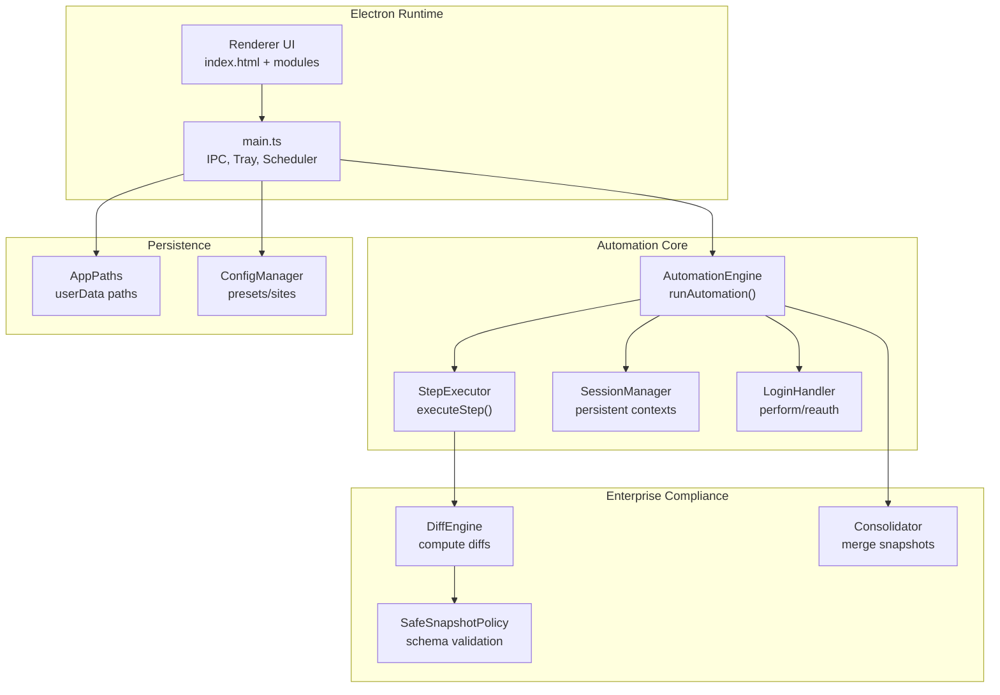
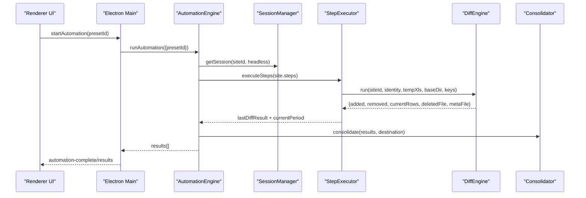
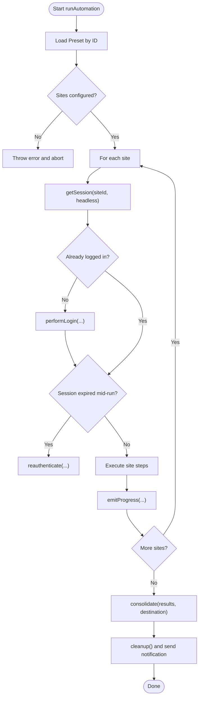
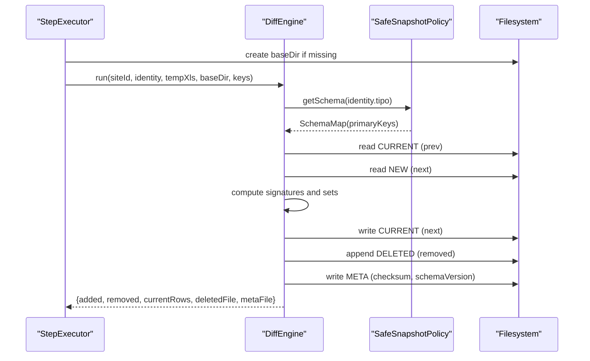
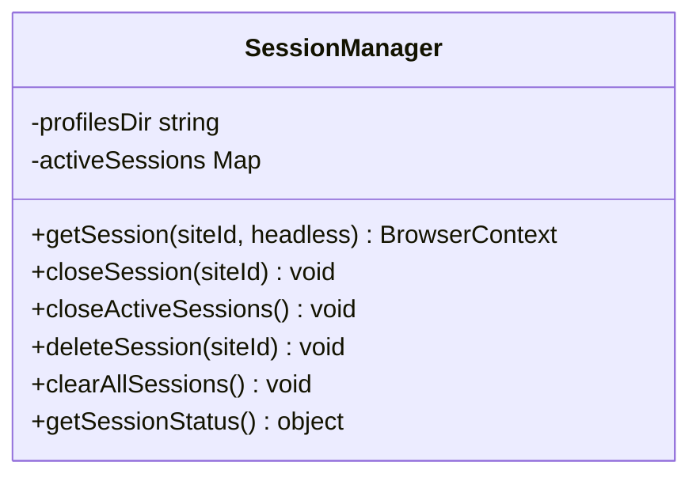
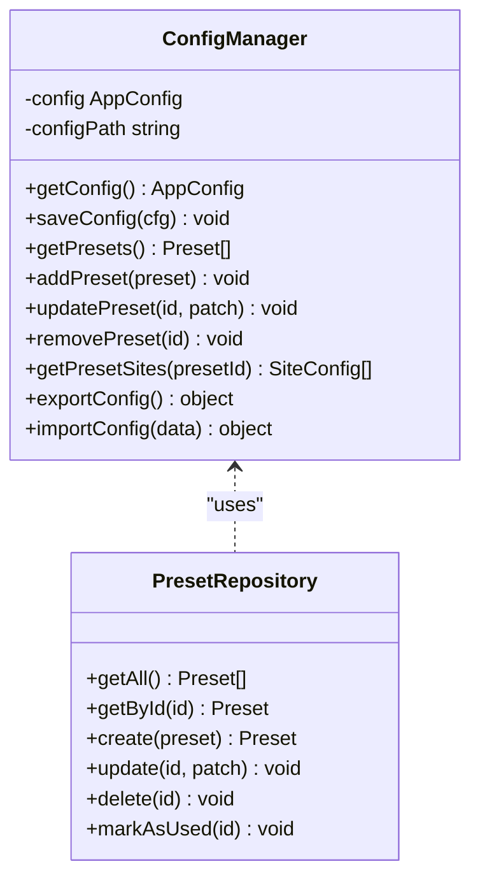
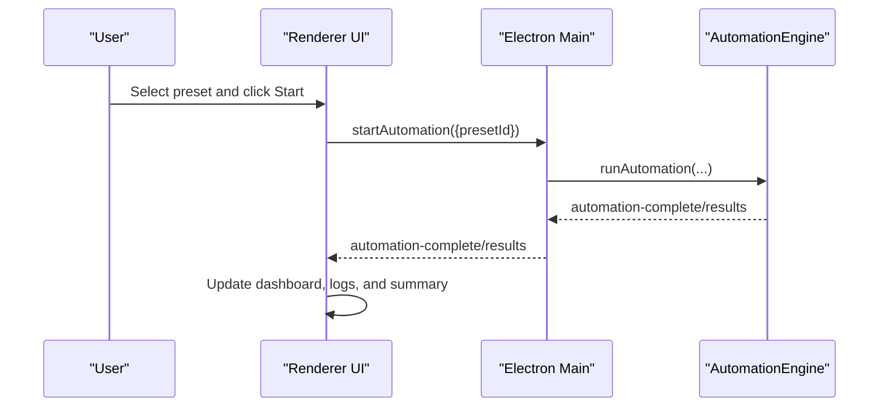
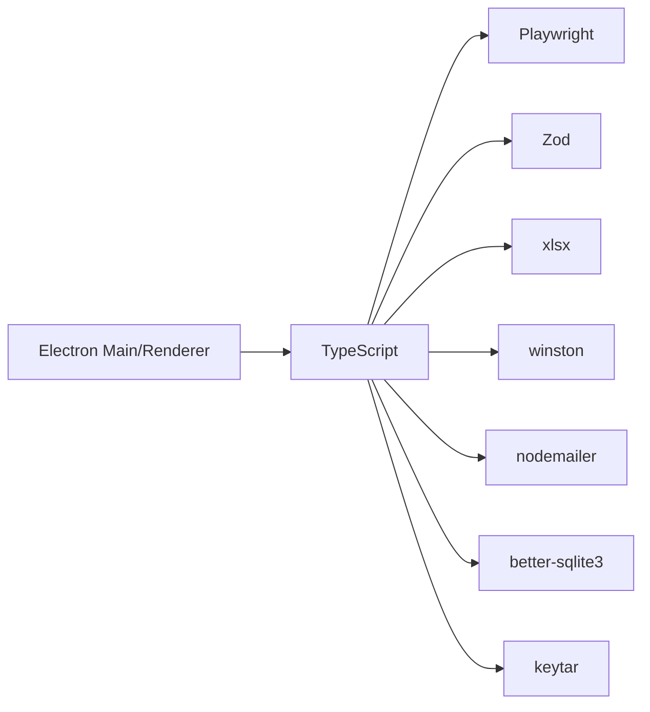

# Project Overview

<cite>
**Referenced Files in This Document**
- [README](file://README)
- [VISÃO GERAL DO PROJETO.MD](file://VISÃO GERAL DO PROJETO.MD)
- [package.json](file://package.json)
- [app/electron/main.ts](file://app/electron/main.ts)
- [app/automation/engine/automation-engine.ts](file://app/automation/engine/automation-engine.ts)
- [app/automation/engine/step-executor.ts](file://app/automation/engine/step-executor.ts)
- [app/automation/engine/preset-repository.ts](file://app/automation/engine/preset-repository.ts)
- [app/automation/sessions/session-manager.ts](file://app/automation/sessions/session-manager.ts)
- [app/automation/sessions/login-handler.ts](file://app/automation/sessions/login-handler.ts)
- [app/config/config-manager.ts](file://app/config/config-manager.ts)
- [app/core/utils/AppPaths.ts](file://app/core/utils/AppPaths.ts)
- [app/core/diff/DiffEngine.ts](file://app/core/diff/DiffEngine.ts)
- [app/core/consolidation/Consolidator.ts](file://app/core/consolidation/Consolidator.ts)
- [app/policy/snapshot/SafeSnapshotPolicy.ts](file://app/policy/snapshot/SafeSnapshotPolicy.ts)
- [app/renderer/modules/automation.js](file://app/renderer/modules/automation.js)
- [app/renderer/index.html](file://app/renderer/index.html)
</cite>

## Table of Contents
1. [Introduction](#introduction)
2. [Project Structure](#project-structure)
3. [Core Components](#core-components)
4. [Architecture Overview](#architecture-overview)
5. [Detailed Component Analysis](#detailed-component-analysis)
6. [Dependency Analysis](#dependency-analysis)
7. [Performance Considerations](#performance-considerations)
8. [Troubleshooting Guide](#troubleshooting-guide)
9. [Conclusion](#conclusion)
10. [Appendices](#appendices)

## Introduction
Automatizador Bravo is an enterprise-grade desktop automation application for Windows 11 designed to streamline repetitive ERP and business tasks. It runs as an installed .exe built with Electron and Node.js, enabling multi-site navigation, login orchestration, configurable workflows, file downloads, renaming, and centralized storage. A key innovation is the Safe Snapshot Policy (SSP), which enforces strict data integrity checks during report downloads, generating auditable diffs and consolidated master snapshots across multiple companies and periods.

Target audience:
- Enterprise teams managing multiple subsidiaries or branches
- Finance, procurement, and fiscal departments automating recurring reporting
- Organizations requiring compliance-ready audit trails for ERP exports

Core value proposition:
- Reduce manual effort and errors by automating repetitive ERP tasks
- Enforce enterprise-grade auditability with SSP and consolidated reporting
- Provide persistent, isolated browser sessions per site for reliability
- Offer flexible scheduling and extensible presets for diverse business needs

Practical use cases:
- Monthly sales reports across subsidiaries with automatic consolidation
- Periodic purchase order reconciliations with change tracking
- Fiscal document downloads with audit-ready diffs
- Multi-company dashboards with automated snapshot consolidation

**Section sources**
- [VISÃO GERAL DO PROJETO.MD](file://VISÃO GERAL DO PROJETO.MD#L1-L21)
- [README](file://README#L1-L29)

## Project Structure
The project follows a layered Electron architecture:
- Electron main process orchestrates lifecycle, IPC, tray, and scheduling
- Renderer UI manages presets, sessions, and real-time logs
- Automation engine executes Playwright-driven workflows per preset/site
- Session manager maintains persistent browser contexts per site
- SSP pipeline validates schemas, computes diffs, and builds consolidated reports

**Diagram sources**
- [app/electron/main.ts](file://app/electron/main.ts#L1-L387)
- [app/automation/engine/automation-engine.ts](file://app/automation/engine/automation-engine.ts#L1-L611)
- [app/automation/engine/step-executor.ts](file://app/automation/engine/step-executor.ts#L1-L549)
- [app/automation/sessions/session-manager.ts](file://app/automation/sessions/session-manager.ts#L1-L225)
- [app/core/diff/DiffEngine.ts](file://app/core/diff/DiffEngine.ts#L1-L230)
- [app/core/consolidation/Consolidator.ts](file://app/core/consolidation/Consolidator.ts#L1-L138)
- [app/policy/snapshot/SafeSnapshotPolicy.ts](file://app/policy/snapshot/SafeSnapshotPolicy.ts#L1-L25)
- [app/core/utils/AppPaths.ts](file://app/core/utils/AppPaths.ts#L1-L60)
- [app/config/config-manager.ts](file://app/config/config-manager.ts#L1-L408)

**Section sources**
- [package.json](file://package.json#L1-L133)
- [app/electron/main.ts](file://app/electron/main.ts#L1-L387)
- [app/automation/engine/automation-engine.ts](file://app/automation/engine/automation-engine.ts#L1-L611)
- [app/automation/sessions/session-manager.ts](file://app/automation/sessions/session-manager.ts#L1-L225)
- [app/core/utils/AppPaths.ts](file://app/core/utils/AppPaths.ts#L1-L60)

## Core Components
- Electron main process: Tray, auto-launch, IPC handlers, scheduler startup, window lifecycle
- Automation engine: Orchestrates multi-site runs, handles timeouts, emits progress, triggers notifications
- Step executor: Executes workflow steps (navigate, click, fill, download), integrates SSP
- Session manager: Launches persistent Chromium contexts per site, manages profiles and cleanup
- Config manager: Zod-based validation for presets and sites, import/export, migration logic
- SSP subsystem: Validates schemas, computes diffs, generates consolidated snapshots
- UI module: Starts/stops automation, updates dashboard, toggles visibility

Key features:
- Multi-site automation with isolated sessions
- Safe Snapshot Policy (SSP) enforcing primary keys and audit-ready diffs
- Persistent sessions per site for reliability
- Compliance reporting with consolidated master snapshots
- Preset-based configuration for modular, reusable workflows
- Scheduling and notifications

**Section sources**
- [app/electron/main.ts](file://app/electron/main.ts#L116-L281)
- [app/automation/engine/automation-engine.ts](file://app/automation/engine/automation-engine.ts#L50-L238)
- [app/automation/engine/step-executor.ts](file://app/automation/engine/step-executor.ts#L25-L135)
- [app/automation/sessions/session-manager.ts](file://app/automation/sessions/session-manager.ts#L67-L138)
- [app/config/config-manager.ts](file://app/config/config-manager.ts#L85-L398)
- [app/core/diff/DiffEngine.ts](file://app/core/diff/DiffEngine.ts#L23-L230)
- [app/core/consolidation/Consolidator.ts](file://app/core/consolidation/Consolidator.ts#L20-L138)
- [app/policy/snapshot/SafeSnapshotPolicy.ts](file://app/policy/snapshot/SafeSnapshotPolicy.ts#L3-L24)
- [app/renderer/modules/automation.js](file://app/renderer/modules/automation.js#L6-L58)

## Architecture Overview
High-level runtime flow:
- Renderer UI selects a preset and starts automation
- Main process invokes AutomationEngine with preset context
- Engine initializes sessions, performs login/re-authenticate, executes steps
- For report-type steps, StepExecutor applies SSP: downloads to temp, computes diffs, writes CURRENT/DELETED/META, and optionally consolidates
- Results are emitted to UI and optionally emailed

**Diagram sources**
- [app/renderer/modules/automation.js](file://app/renderer/modules/automation.js#L6-L58)
- [app/electron/main.ts](file://app/electron/main.ts#L214-L241)
- [app/automation/engine/automation-engine.ts](file://app/automation/engine/automation-engine.ts#L62-L238)
- [app/automation/engine/step-executor.ts](file://app/automation/engine/step-executor.ts#L466-L488)
- [app/core/diff/DiffEngine.ts](file://app/core/diff/DiffEngine.ts#L55-L219)
- [app/core/consolidation/Consolidator.ts](file://app/core/consolidation/Consolidator.ts#L26-L63)

## Detailed Component Analysis

### Automation Engine
Responsibilities:
- Validate and resolve preset/site configuration
- Manage global timeout and per-site execution
- Initialize browser contexts and handle reauthentication
- Emit progress events and site completion signals
- Trigger consolidation and notifications upon completion

Notable behaviors:
- Enforces a 2-hour global timeout to prevent resource leaks
- Supports both preset-scoped and legacy site-scoped runs
- Injects preset credentials into site context when applicable
- Auto-creates destination subfolders for typed reports (e.g., UF-Type)
- Cleans up sessions after each site and at the end

**Diagram sources**
- [app/automation/engine/automation-engine.ts](file://app/automation/engine/automation-engine.ts#L62-L238)

**Section sources**
- [app/automation/engine/automation-engine.ts](file://app/automation/engine/automation-engine.ts#L50-L238)

### Step Executor and SSP Pipeline
Responsibilities:
- Execute workflow steps with retry and timeout policies
- Integrate Safe Snapshot Policy for report-type downloads
- Compute current period from date tokens and update identity
- Save temporary downloads and delegate diff computation to DiffEngine
- Inject origin metadata into consolidated outputs

**Diagram sources**
- [app/automation/engine/step-executor.ts](file://app/automation/engine/step-executor.ts#L440-L488)
- [app/core/diff/DiffEngine.ts](file://app/core/diff/DiffEngine.ts#L55-L219)
- [app/policy/snapshot/SafeSnapshotPolicy.ts](file://app/policy/snapshot/SafeSnapshotPolicy.ts#L8-L23)

**Section sources**
- [app/automation/engine/step-executor.ts](file://app/automation/engine/step-executor.ts#L25-L135)
- [app/core/diff/DiffEngine.ts](file://app/core/diff/DiffEngine.ts#L23-L230)
- [app/policy/snapshot/SafeSnapshotPolicy.ts](file://app/policy/snapshot/SafeSnapshotPolicy.ts#L3-L24)

### Session Management
Responsibilities:
- Ensure Playwright browsers are installed in a managed path
- Launch persistent Chromium contexts per site with isolated profiles
- Close and clear sessions to maintain system health
- Migrate legacy storage locations automatically

**Diagram sources**
- [app/automation/sessions/session-manager.ts](file://app/automation/sessions/session-manager.ts#L67-L225)

**Section sources**
- [app/automation/sessions/session-manager.ts](file://app/automation/sessions/session-manager.ts#L1-L225)
- [app/core/utils/AppPaths.ts](file://app/core/utils/AppPaths.ts#L1-L60)

### Configuration and Presets
Responsibilities:
- Zod-based validation for app config, presets, and sites
- Migration from legacy global site lists to preset-scoped sites
- Import/export of configuration with warnings for merges
- Path resolution supporting environment variables and user profile changes

**Diagram sources**
- [app/config/config-manager.ts](file://app/config/config-manager.ts#L85-L398)
- [app/automation/engine/preset-repository.ts](file://app/automation/engine/preset-repository.ts#L4-L34)

**Section sources**
- [app/config/config-manager.ts](file://app/config/config-manager.ts#L1-L408)
- [app/automation/engine/preset-repository.ts](file://app/automation/engine/preset-repository.ts#L1-L34)

### UI and Interactions
Responsibilities:
- Render dashboard with automation status, session counts, and schedules
- Allow selecting presets, starting/stopping automation, and opening configuration
- Display real-time logs and workflow summaries
- Provide modal dialogs for sessions, presets, sites, alerts, and export/import

**Diagram sources**
- [app/renderer/index.html](file://app/renderer/index.html#L80-L177)
- [app/renderer/modules/automation.js](file://app/renderer/modules/automation.js#L6-L58)
- [app/electron/main.ts](file://app/electron/main.ts#L214-L241)

**Section sources**
- [app/renderer/index.html](file://app/renderer/index.html#L1-L640)
- [app/renderer/modules/automation.js](file://app/renderer/modules/automation.js#L1-L59)
- [app/electron/main.ts](file://app/electron/main.ts#L116-L281)

## Dependency Analysis
Technology stack:
- Electron + TypeScript for cross-platform desktop app
- Playwright for robust browser automation and persistent contexts
- Zod for runtime schema validation
- XLSX for Excel parsing and writing
- Winston for structured logging
- nodemailer for optional notifications
- better-sqlite3 and keytar for persistence and secrets (as declared)

**Diagram sources**
- [package.json](file://package.json#L94-L113)
- [app/automation/engine/automation-engine.ts](file://app/automation/engine/automation-engine.ts#L1-L12)
- [app/core/diff/DiffEngine.ts](file://app/core/diff/DiffEngine.ts#L1-L12)

**Section sources**
- [package.json](file://package.json#L94-L113)

## Performance Considerations
- Headless vs visible mode: headless reduces overhead; visible mode supports manual login and captcha resolution
- Action delays and retries: tune to balance stability and speed
- Global timeout: prevents runaway automation and resource accumulation
- Persistent sessions: reduce repeated logins but require periodic cleanup
- Consolidation: batch processing of many sites benefits from efficient file I/O and memory management

[No sources needed since this section provides general guidance]

## Troubleshooting Guide
Common issues and resolutions:
- Build failures due to locked files: close the app and rerun the build command
- Auto-launch not working in development: expected behavior; only available in packaged builds
- Session conflicts: clear sessions or delete specific site profile
- Browser installation problems: ensure Playwright Chromium is installed in the managed path
- Email notifications failing: verify SMTP settings and credentials

**Section sources**
- [README](file://README#L25-L29)
- [app/electron/main.ts](file://app/electron/main.ts#L243-L280)
- [app/automation/sessions/session-manager.ts](file://app/automation/sessions/session-manager.ts#L13-L65)

## Conclusion
Automatizador Bravo delivers a production-ready solution for enterprise automation on Windows 11. Its combination of persistent sessions, robust workflow execution, and Safe Snapshot Policy ensures reliable, auditable, and scalable ERP integrations across multiple sites and periods. The modular architecture, strong validation, and scheduling capabilities make it suitable for organizations seeking to modernize repetitive tasks while maintaining compliance and operational visibility.

[No sources needed since this section summarizes without analyzing specific files]

## Appendices

### Practical Examples
- Monthly sales reconciliation: configure a preset with date range steps and a report-type site; run automation to produce consolidated CURRENT and DELETED snapshots
- Multi-branch purchase orders: define sites per branch, set primary keys for uniqueness, and schedule periodic runs for audit-ready diffs
- Fiscal document downloads: enable notifications and export consolidated reports to a shared drive location

[No sources needed since this section provides general guidance]