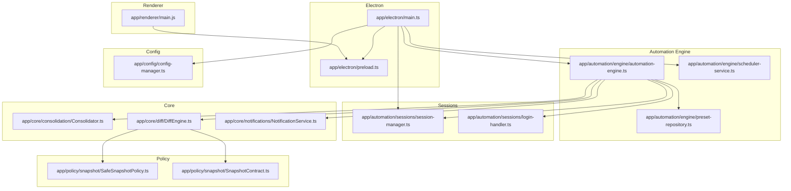
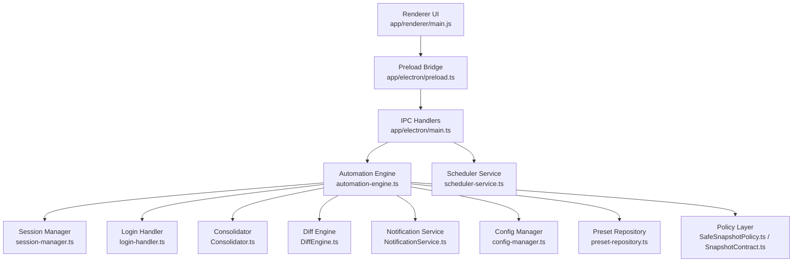
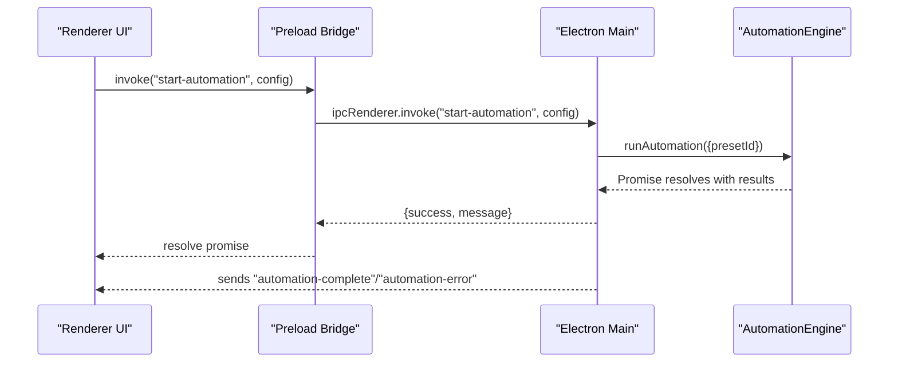
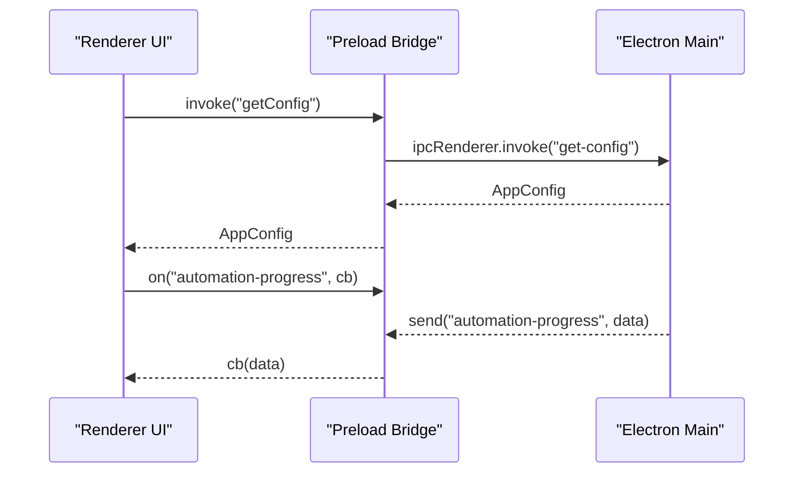
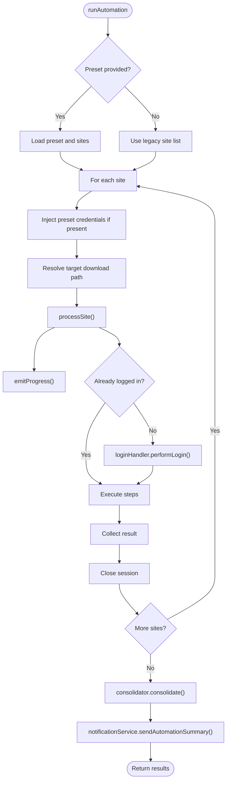
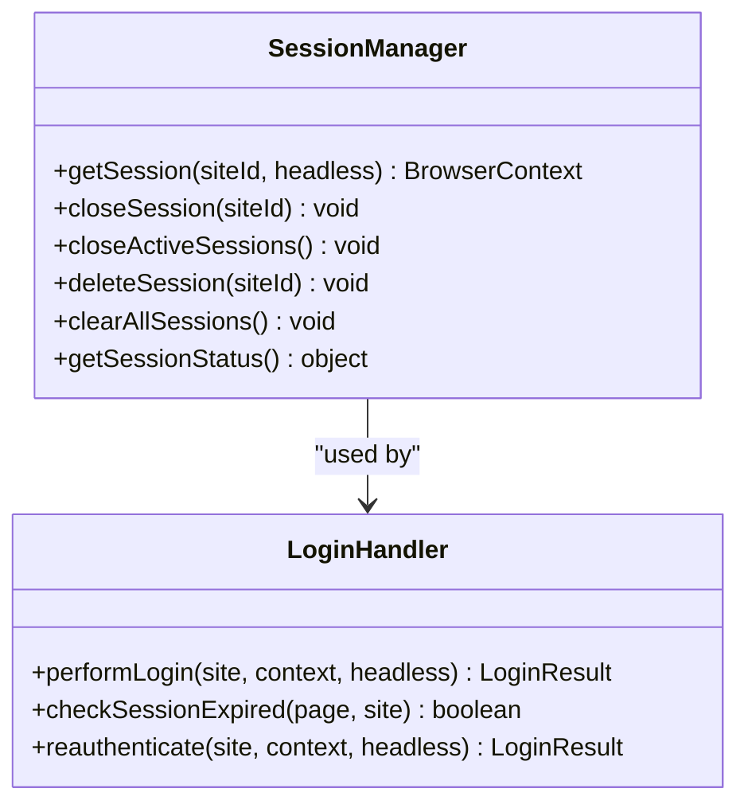
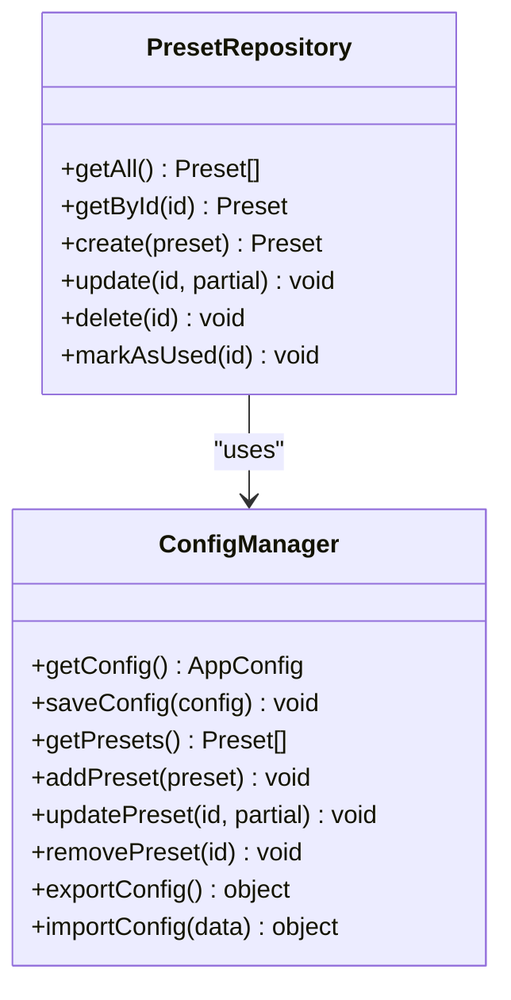
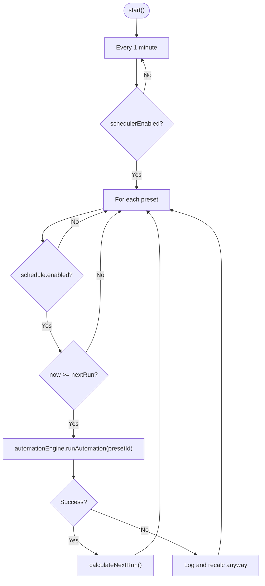
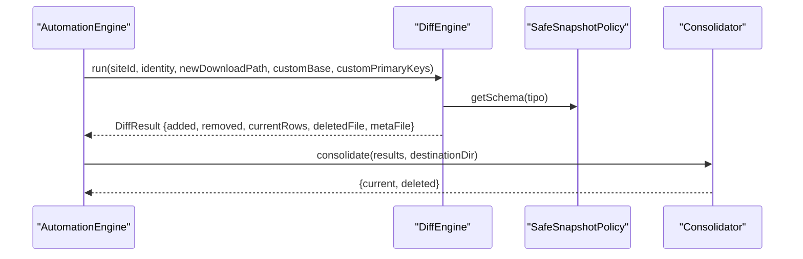
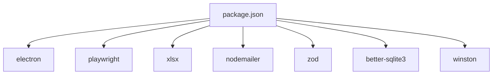

# System Architecture

<cite>
**Referenced Files in This Document**
- [app/electron/main.ts](file://app/electron/main.ts)
- [app/electron/preload.ts](file://app/electron/preload.ts)
- [app/renderer/main.js](file://app/renderer/main.js)
- [app/automation/engine/automation-engine.ts](file://app/automation/engine/automation-engine.ts)
- [app/automation/engine/preset-repository.ts](file://app/automation/engine/preset-repository.ts)
- [app/automation/engine/scheduler-service.ts](file://app/automation/engine/scheduler-service.ts)
- [app/automation/sessions/session-manager.ts](file://app/automation/sessions/session-manager.ts)
- [app/automation/sessions/login-handler.ts](file://app/automation/sessions/login-handler.ts)
- [app/config/config-manager.ts](file://app/config/config-manager.ts)
- [app/core/consolidation/Consolidator.ts](file://app/core/consolidation/Consolidator.ts)
- [app/core/diff/DiffEngine.ts](file://app/core/diff/DiffEngine.ts)
- [app/core/notifications/NotificationService.ts](file://app/core/notifications/NotificationService.ts)
- [app/policy/snapshot/SafeSnapshotPolicy.ts](file://app/policy/snapshot/SafeSnapshotPolicy.ts)
- [app/policy/snapshot/SnapshotContract.ts](file://app/policy/snapshot/SnapshotContract.ts)
- [package.json](file://package.json)
</cite>

## Table of Contents
1. [Introduction](#introduction)
2. [Project Structure](#project-structure)
3. [Core Components](#core-components)
4. [Architecture Overview](#architecture-overview)
5. [Detailed Component Analysis](#detailed-component-analysis)
6. [Dependency Analysis](#dependency-analysis)
7. [Performance Considerations](#performance-considerations)
8. [Troubleshooting Guide](#troubleshooting-guide)
9. [Conclusion](#conclusion)

## Introduction
This document describes the system architecture of Automatizador Bravo, a corporate-grade web automation desktop application built with Electron. The system is organized as a modular monolith with clear separation of concerns across the Electron main process, renderer process, automation engine, and policy layers. It integrates Playwright for browser automation, Zod for configuration validation, XLSX for Excel diffing and consolidation, and a snapshot policy framework for enterprise-safe auditing.

The architecture emphasizes:
- Singleton patterns for core services (configuration, automation engine, scheduler, session manager, login handler, notification service)
- Repository pattern for configuration persistence and presets
- Factory-like creation of browser contexts via session manager
- IPC-driven communication between main and renderer processes
- Policy-driven safety for snapshot diffs and consolidations

## Project Structure
The project follows a feature-based layout under app/, with Electron-specific entry points, automation engine modules, configuration management, core utilities, policy enforcement, and renderer modules.

**Diagram sources**
- [app/electron/main.ts](file://app/electron/main.ts#L1-L387)
- [app/electron/preload.ts](file://app/electron/preload.ts#L1-L47)
- [app/renderer/main.js](file://app/renderer/main.js#L1-L182)
- [app/automation/engine/automation-engine.ts](file://app/automation/engine/automation-engine.ts#L1-L611)
- [app/automation/engine/preset-repository.ts](file://app/automation/engine/preset-repository.ts#L1-L34)
- [app/automation/engine/scheduler-service.ts](file://app/automation/engine/scheduler-service.ts#L1-L145)
- [app/automation/sessions/session-manager.ts](file://app/automation/sessions/session-manager.ts#L1-L225)
- [app/automation/sessions/login-handler.ts](file://app/automation/sessions/login-handler.ts#L1-L364)
- [app/config/config-manager.ts](file://app/config/config-manager.ts#L1-L408)
- [app/core/consolidation/Consolidator.ts](file://app/core/consolidation/Consolidator.ts#L1-L138)
- [app/core/diff/DiffEngine.ts](file://app/core/diff/DiffEngine.ts#L1-L230)
- [app/core/notifications/NotificationService.ts](file://app/core/notifications/NotificationService.ts#L1-L115)
- [app/policy/snapshot/SafeSnapshotPolicy.ts](file://app/policy/snapshot/SafeSnapshotPolicy.ts#L1-L25)
- [app/policy/snapshot/SnapshotContract.ts](file://app/policy/snapshot/SnapshotContract.ts#L1-L20)

**Section sources**
- [app/electron/main.ts](file://app/electron/main.ts#L1-L387)
- [app/electron/preload.ts](file://app/electron/preload.ts#L1-L47)
- [app/renderer/main.js](file://app/renderer/main.js#L1-L182)
- [package.json](file://package.json#L1-L133)

## Core Components
- Electron Main Process: Initializes the app, creates the BrowserWindow, registers IPC handlers, sets up tray and watchdog, starts scheduler, and orchestrates automation lifecycle.
- Preload Bridge: Exposes a safe subset of IPC APIs to the renderer via contextBridge.
- Renderer: Modular UI entry that wires UI actions to Electron IPC calls and listens to automation events.
- Automation Engine: Orchestrates site execution, manages browser contexts, handles login flows, emits progress, and coordinates diffing and consolidation.
- Session Manager: Manages persistent browser contexts per site, ensuring cookies/cache persistence and safe cleanup.
- Login Handler: Performs auto-login, detects CAPTCHA, supports manual intervention, and reauthentication.
- Config Manager: Singleton configuration provider with Zod validation, migration logic, and preset-centric model.
- Scheduler Service: Periodically evaluates preset schedules and triggers automation runs.
- Consolidator: Merges multiple Excel outputs into master consolidated files.
- Diff Engine: Compares new downloads against previous snapshots, generates deletions, and updates metadata.
- Notification Service: Sends email summaries after automation completion.
- Policy Layer: Defines snapshot identity, enforces schema maps for primary keys, and validates snapshot contracts.

**Section sources**
- [app/automation/engine/automation-engine.ts](file://app/automation/engine/automation-engine.ts#L50-L611)
- [app/automation/sessions/session-manager.ts](file://app/automation/sessions/session-manager.ts#L67-L225)
- [app/automation/sessions/login-handler.ts](file://app/automation/sessions/login-handler.ts#L13-L364)
- [app/config/config-manager.ts](file://app/config/config-manager.ts#L85-L408)
- [app/automation/engine/scheduler-service.ts](file://app/automation/engine/scheduler-service.ts#L6-L145)
- [app/core/consolidation/Consolidator.ts](file://app/core/consolidation/Consolidator.ts#L20-L138)
- [app/core/diff/DiffEngine.ts](file://app/core/diff/DiffEngine.ts#L23-L230)
- [app/core/notifications/NotificationService.ts](file://app/core/notifications/NotificationService.ts#L13-L115)
- [app/policy/snapshot/SafeSnapshotPolicy.ts](file://app/policy/snapshot/SafeSnapshotPolicy.ts#L3-L25)
- [app/policy/snapshot/SnapshotContract.ts](file://app/policy/snapshot/SnapshotContract.ts#L9-L20)

## Architecture Overview
The system is a modular monolith with clear boundaries:
- Electron Main: Controls lifecycle, IPC, tray, and scheduling.
- Renderer: UI and user interactions, delegating work to main via IPC.
- Automation Engine: Business logic for site execution, login, and post-processing.
- Policy Layer: Enforces safe snapshot policies and schema validation.
- Core Utilities: Consolidation, diffing, notifications, and logging.

**Diagram sources**
- [app/renderer/main.js](file://app/renderer/main.js#L1-L182)
- [app/electron/preload.ts](file://app/electron/preload.ts#L5-L47)
- [app/electron/main.ts](file://app/electron/main.ts#L117-L281)
- [app/automation/engine/automation-engine.ts](file://app/automation/engine/automation-engine.ts#L50-L611)
- [app/automation/sessions/session-manager.ts](file://app/automation/sessions/session-manager.ts#L67-L225)
- [app/automation/sessions/login-handler.ts](file://app/automation/sessions/login-handler.ts#L13-L364)
- [app/core/consolidation/Consolidator.ts](file://app/core/consolidation/Consolidator.ts#L20-L138)
- [app/core/diff/DiffEngine.ts](file://app/core/diff/DiffEngine.ts#L23-L230)
- [app/core/notifications/NotificationService.ts](file://app/core/notifications/NotificationService.ts#L13-L115)
- [app/config/config-manager.ts](file://app/config/config-manager.ts#L85-L408)
- [app/automation/engine/preset-repository.ts](file://app/automation/engine/preset-repository.ts#L4-L34)
- [app/automation/engine/scheduler-service.ts](file://app/automation/engine/scheduler-service.ts#L6-L145)
- [app/policy/snapshot/SafeSnapshotPolicy.ts](file://app/policy/snapshot/SafeSnapshotPolicy.ts#L3-L25)
- [app/policy/snapshot/SnapshotContract.ts](file://app/policy/snapshot/SnapshotContract.ts#L9-L20)

## Detailed Component Analysis

### Electron Main Process
Responsibilities:
- Creates BrowserWindow with secure webPreferences and optional DevTools.
- Registers IPC handlers for configuration, presets, sessions, automation control, and auto-launch management.
- Starts scheduler and memory watchdog.
- Integrates tray icon and context menu for quick access and quit.

Key IPC channels:
- Configuration: get-config, save-config, export-config, import-config
- Presets: get-presets, save-preset, delete-preset
- Sessions: get-session-status, delete-session, clear-sessions, open-browser-for-login
- Automation: get-automation-status, start-automation, stop-automation
- Auto-launch: get-auto-launch-status, set-auto-launch
- File operations: open-file

**Diagram sources**
- [app/electron/main.ts](file://app/electron/main.ts#L214-L241)
- [app/automation/engine/automation-engine.ts](file://app/automation/engine/automation-engine.ts#L62-L238)
- [app/electron/preload.ts](file://app/electron/preload.ts#L7-L9)

**Section sources**
- [app/electron/main.ts](file://app/electron/main.ts#L117-L281)
- [app/electron/main.ts](file://app/electron/main.ts#L283-L387)

### Preload Bridge and Renderer
Responsibilities:
- Expose a controlled set of IPC methods to renderer (automation, config, sessions, presets, auto-launch).
- Listen to automation progress, completion, and error events.
- Wire UI actions to Electron IPC calls.

**Diagram sources**
- [app/electron/preload.ts](file://app/electron/preload.ts#L5-L47)
- [app/electron/main.ts](file://app/electron/main.ts#L119-L126)
- [app/renderer/main.js](file://app/renderer/main.js#L151-L172)

**Section sources**
- [app/electron/preload.ts](file://app/electron/preload.ts#L1-L47)
- [app/renderer/main.js](file://app/renderer/main.js#L1-L182)

### Automation Engine
Responsibilities:
- Run automation for a preset or selected sites.
- Manage browser contexts via session manager.
- Perform login (auto/manual/reauth) via login handler.
- Execute steps, emit progress, capture screenshots on error.
- Consolidate results and notify summary via email.

Design highlights:
- Singleton instance exported for global access.
- Uses Playwright Chromium with custom arguments and persistent contexts.
- Emits progress to all BrowserWindows and individual site-complete events.
- Supports auto-folder creation for report-type sites based on preset destination and reportType.

**Diagram sources**
- [app/automation/engine/automation-engine.ts](file://app/automation/engine/automation-engine.ts#L62-L238)
- [app/automation/sessions/login-handler.ts](file://app/automation/sessions/login-handler.ts#L28-L77)
- [app/core/consolidation/Consolidator.ts](file://app/core/consolidation/Consolidator.ts#L26-L63)

**Section sources**
- [app/automation/engine/automation-engine.ts](file://app/automation/engine/automation-engine.ts#L50-L611)

### Session Manager and Login Handler
Responsibilities:
- Session Manager: Ensures Playwright browsers are installed, manages persistent contexts per site, and cleans up sessions.
- Login Handler: Attempts auto-login, detects CAPTCHA, supports manual login, and reauthenticates when sessions expire.

**Diagram sources**
- [app/automation/sessions/session-manager.ts](file://app/automation/sessions/session-manager.ts#L67-L225)
- [app/automation/sessions/login-handler.ts](file://app/automation/sessions/login-handler.ts#L13-L364)

**Section sources**
- [app/automation/sessions/session-manager.ts](file://app/automation/sessions/session-manager.ts#L1-L225)
- [app/automation/sessions/login-handler.ts](file://app/automation/sessions/login-handler.ts#L1-L364)

### Configuration Management and Presets
Responsibilities:
- ConfigManager: Singleton configuration provider with Zod validation, migration from legacy structure, and export/import.
- PresetRepository: CRUD operations for presets backed by ConfigManager.

Design patterns:
- Singleton for ConfigManager and exported configManager instance.
- Repository pattern for presets.

**Diagram sources**
- [app/config/config-manager.ts](file://app/config/config-manager.ts#L85-L408)
- [app/automation/engine/preset-repository.ts](file://app/automation/engine/preset-repository.ts#L4-L34)

**Section sources**
- [app/config/config-manager.ts](file://app/config/config-manager.ts#L1-L408)
- [app/automation/engine/preset-repository.ts](file://app/automation/engine/preset-repository.ts#L1-L34)

### Scheduler Service
Responsibilities:
- Periodically checks preset schedules and triggers automation runs.
- Handles global pause, interval vs fixed-time modes, and watchdog for long-running locks.

**Diagram sources**
- [app/automation/engine/scheduler-service.ts](file://app/automation/engine/scheduler-service.ts#L16-L96)
- [app/automation/engine/scheduler-service.ts](file://app/automation/engine/scheduler-service.ts#L101-L142)

**Section sources**
- [app/automation/engine/scheduler-service.ts](file://app/automation/engine/scheduler-service.ts#L1-L145)

### Consolidation and Diff Engines
Responsibilities:
- Consolidator: Merges current and deleted snapshots into master files per preset destination.
- DiffEngine: Compares new downloads with previous snapshots, computes added/removed rows, writes deletions, and updates metadata.

**Diagram sources**
- [app/core/diff/DiffEngine.ts](file://app/core/diff/DiffEngine.ts#L55-L229)
- [app/policy/snapshot/SafeSnapshotPolicy.ts](file://app/policy/snapshot/SafeSnapshotPolicy.ts#L8-L23)
- [app/core/consolidation/Consolidator.ts](file://app/core/consolidation/Consolidator.ts#L26-L63)

**Section sources**
- [app/core/diff/DiffEngine.ts](file://app/core/diff/DiffEngine.ts#L1-L230)
- [app/core/consolidation/Consolidator.ts](file://app/core/consolidation/Consolidator.ts#L1-L138)
- [app/policy/snapshot/SafeSnapshotPolicy.ts](file://app/policy/snapshot/SafeSnapshotPolicy.ts#L1-L25)
- [app/policy/snapshot/SnapshotContract.ts](file://app/policy/snapshot/SnapshotContract.ts#L1-L20)

### Notifications
Responsibilities:
- Sends email summaries after automation completion using SMTP configuration from ConfigManager.

**Section sources**
- [app/core/notifications/NotificationService.ts](file://app/core/notifications/NotificationService.ts#L1-L115)
- [app/config/config-manager.ts](file://app/config/config-manager.ts#L67-L77)

## Dependency Analysis
External dependencies and integration points:
- Electron: Main process, BrowserWindow, IPC, Tray, Menu, shell.
- Playwright: Chromium browser automation with persistent contexts.
- XLSX: Excel parsing/writing for diffing and consolidation.
- Nodemailer: SMTP-based email notifications.
- Zod: Runtime validation for configuration and presets.
- Better SQLite3: Database support (referenced in package.json).
- Winston: Logging infrastructure (referenced in package.json).

**Diagram sources**
- [package.json](file://package.json#L94-L113)

**Section sources**
- [package.json](file://package.json#L1-L133)

## Performance Considerations
- Browser contexts are reused per site to reduce overhead; sessions are closed after each site to avoid resource leaks.
- Headless mode is default to minimize resource usage; visible mode is supported for manual login and CAPTCHA resolution.
- Global timeout prevents runaway automation runs; watchdog monitors memory usage.
- Consolidation and diffing operate on disk; ensure adequate I/O performance and sufficient free space in destination directories.
- Scheduler runs every minute; consider preset count and execution time to avoid overlapping runs.

## Troubleshooting Guide
Common issues and diagnostics:
- CAPTCHA during login: The system detects CAPTCHA and requires visible mode for manual resolution.
- Session expiration: Login handler detects expired pages and triggers reauthentication; ensure sessions are properly managed.
- Memory usage: Watchdog logs indicate elevated RSS; investigate long-running tasks or unclosed contexts.
- Export/Import failures: Validate configuration structure and handle warnings returned by importConfig.
- Auto-installation of Playwright browsers: If browsers are missing, the system attempts installation; packaged environments may require pre-provisioning.

Operational hooks:
- Tray icon provides quick access and quit controls.
- IPC handlers expose status and control methods for automation lifecycle.

**Section sources**
- [app/automation/sessions/login-handler.ts](file://app/automation/sessions/login-handler.ts#L57-L63)
- [app/automation/engine/automation-engine.ts](file://app/automation/engine/automation-engine.ts#L350-L375)
- [app/electron/main.ts](file://app/electron/main.ts#L102-L114)
- [app/config/config-manager.ts](file://app/config/config-manager.ts#L353-L394)
- [app/automation/sessions/session-manager.ts](file://app/automation/sessions/session-manager.ts#L13-L65)

## Conclusion
Automatizador Bravo employs a robust, modular monolith architecture centered on Electron, with clear separation between UI, automation engine, session management, configuration, and policy enforcement. Singleton services, repository patterns, and factory-style browser context creation enable maintainability and scalability. The IPC layer ensures secure and efficient communication between processes, while the scheduler and watchdog keep the system resilient for 24/7 operation. The policy-driven snapshot diffing and consolidation provide enterprise-grade auditability and safety.