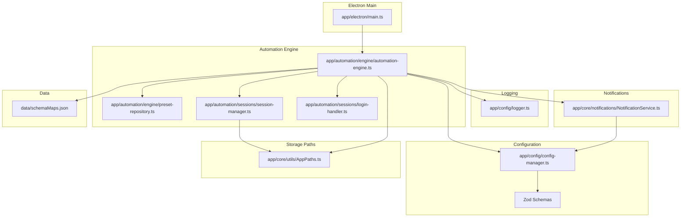
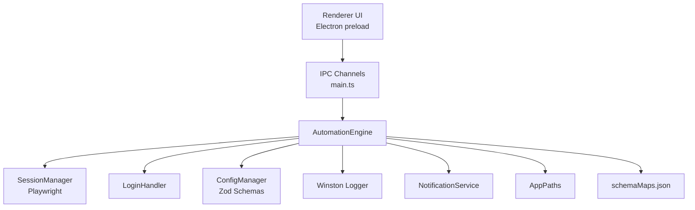
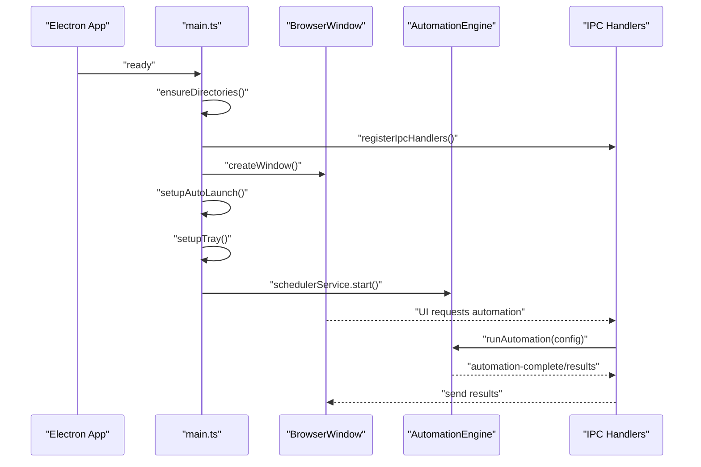
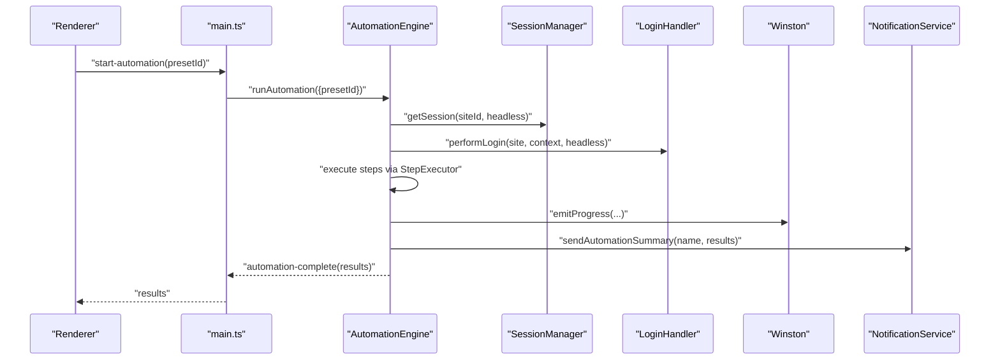
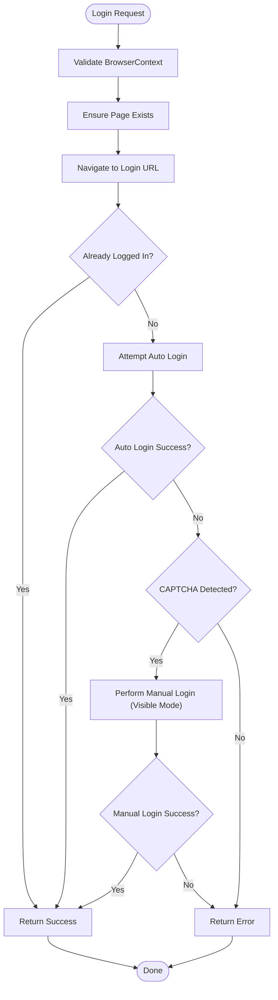
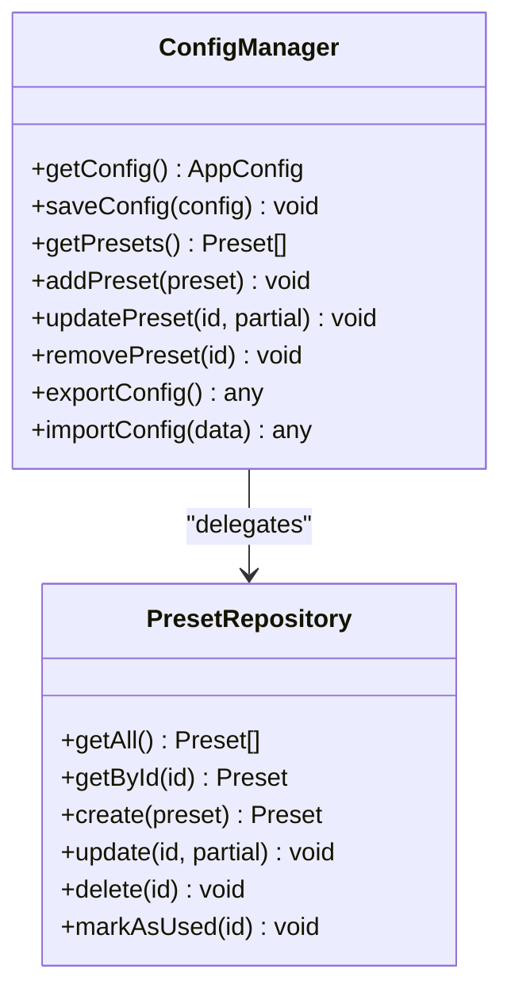
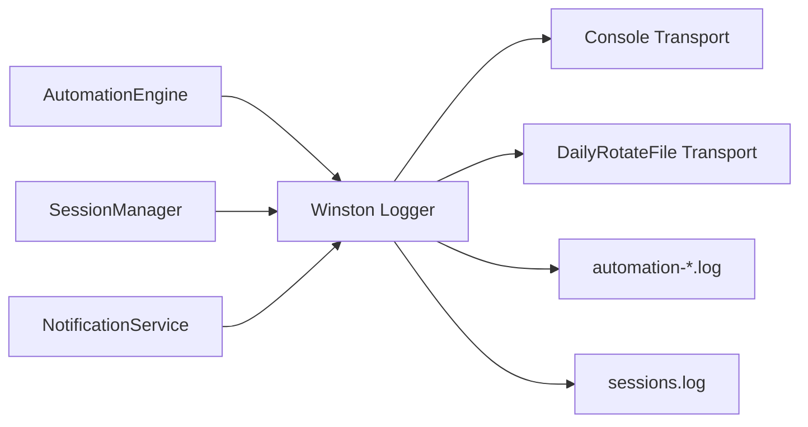
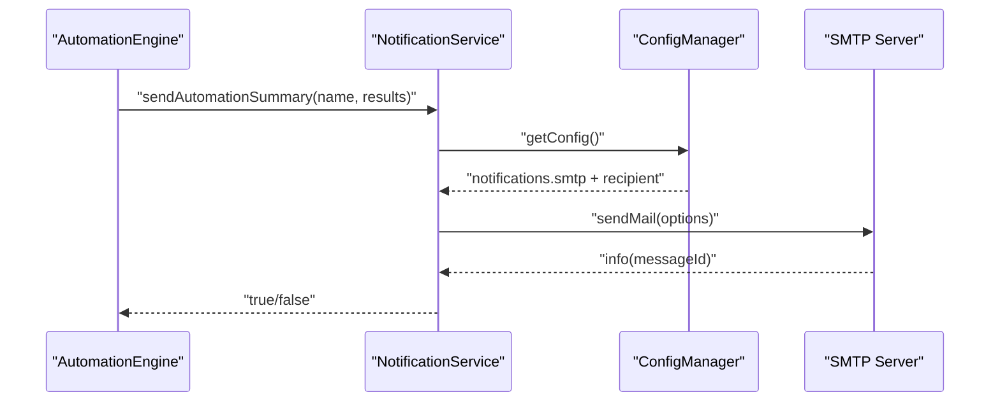
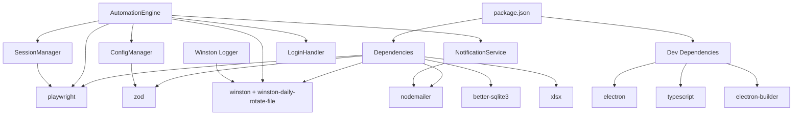

# Technology Stack

<cite>
**Referenced Files in This Document**
- [package.json](file://package.json)
- [tsconfig.json](file://tsconfig.json)
- [app/electron/main.ts](file://app/electron/main.ts)
- [app/config/logger.ts](file://app/config/logger.ts)
- [app/core/notifications/NotificationService.ts](file://app/core/notifications/NotificationService.ts)
- [app/automation/engine/automation-engine.ts](file://app/automation/engine/automation-engine.ts)
- [app/automation/engine/preset-repository.ts](file://app/automation/engine/preset-repository.ts)
- [app/config/config-manager.ts](file://app/config/config-manager.ts)
- [app/core/utils/AppPaths.ts](file://app/core/utils/AppPaths.ts)
- [app/automation/sessions/session-manager.ts](file://app/automation/sessions/session-manager.ts)
- [app/automation/sessions/login-handler.ts](file://app/automation/sessions/login-handler.ts)
- [data/schemaMaps.json](file://data/schemaMaps.json)
</cite>

## Table of Contents
1. [Introduction](#introduction)
2. [Project Structure](#project-structure)
3. [Core Technologies](#core-technologies)
4. [Architecture Overview](#architecture-overview)
5. [Detailed Component Analysis](#detailed-component-analysis)
6. [Dependency Analysis](#dependency-analysis)
7. [Performance Considerations](#performance-considerations)
8. [Troubleshooting Guide](#troubleshooting-guide)
9. [Conclusion](#conclusion)

## Introduction
This document explains the Automatizador Bravo technology stack and how its core technologies work together to deliver a robust, type-safe, and maintainable desktop automation solution. The stack centers on Electron for the desktop shell, TypeScript for type safety, Playwright for browser automation, Zod for runtime validation, Winston for structured logging, Better SQLite for local persistence, XLSX for Excel processing, and Nodemailer for notifications. It also covers version requirements, licensing considerations, and integration patterns visible in the codebase.

## Project Structure
The project is organized around a clear separation of concerns:
- Electron main process orchestrates the app lifecycle, IPC handlers, tray, and scheduling.
- TypeScript compiles to CommonJS with strict type checking.
- Automation engine coordinates Playwright-driven browser sessions, login handling, and step execution.
- Configuration is managed with Zod schemas and persisted via a dedicated manager.
- Logging uses Winston with daily rotation and environment-specific levels.
- Notifications are sent via Nodemailer when configured.
- Local storage uses Electron App Paths to manage directories for configs, logs, profiles, and snapshots.
- Data schemas define primary keys for audit and consolidation logic.

**Diagram sources**
- [app/electron/main.ts](file://app/electron/main.ts#L1-L387)
- [app/automation/engine/automation-engine.ts](file://app/automation/engine/automation-engine.ts#L1-L611)
- [app/automation/engine/preset-repository.ts](file://app/automation/engine/preset-repository.ts#L1-L34)
- [app/automation/sessions/session-manager.ts](file://app/automation/sessions/session-manager.ts#L1-L225)
- [app/automation/sessions/login-handler.ts](file://app/automation/sessions/login-handler.ts#L1-L364)
- [app/config/config-manager.ts](file://app/config/config-manager.ts#L1-L408)
- [app/config/logger.ts](file://app/config/logger.ts#L1-L104)
- [app/core/notifications/NotificationService.ts](file://app/core/notifications/NotificationService.ts#L1-L115)
- [app/core/utils/AppPaths.ts](file://app/core/utils/AppPaths.ts#L1-L60)
- [data/schemaMaps.json](file://data/schemaMaps.json#L1-L9)

**Section sources**
- [package.json](file://package.json#L1-L133)
- [tsconfig.json](file://tsconfig.json#L1-L24)
- [app/electron/main.ts](file://app/electron/main.ts#L1-L387)

## Core Technologies
This section explains each core technology, why it was chosen, its role, and how it integrates with the rest of the system.

### Electron
- Role: Desktop application shell, window management, tray, IPC communication, and process lifecycle.
- Integration: The main process initializes directories, registers IPC handlers, sets up tray and auto-launch, and starts the scheduler. It communicates with the renderer via preload scripts and IPC channels.
- Version and license: Electron is declared in devDependencies; the project license is proprietary.
- Advantages: Cross-platform desktop app with Node/Electron APIs, robust IPC, tray integration, and packaging via electron-builder.

**Section sources**
- [app/electron/main.ts](file://app/electron/main.ts#L1-L387)
- [package.json](file://package.json#L94-L102)
- [package.json](file://package.json#L33-L93)

### TypeScript
- Role: Type safety across the entire codebase, enabling compile-time checks and better IDE support.
- Integration: Strict compiler options enforce correctness; CommonJS output targets Electron main/renderer; source maps enable debugging.
- Advantages: Reduced runtime errors, improved refactoring safety, and clearer interfaces for IPC and configuration.

**Section sources**
- [tsconfig.json](file://tsconfig.json#L1-L24)
- [package.json](file://package.json#L94-L102)

### Playwright
- Role: Web automation engine driving Chromium contexts with persistent profiles, login flows, and step execution.
- Integration: SessionManager ensures browsers are installed and launches persistent contexts per site. AutomationEngine coordinates navigation, login, and step execution. LoginHandler handles auto/manual login and session expiration detection.
- Version and license: Declared in dependencies; project license is proprietary.
- Advantages: Headless/visible modes, persistent contexts, robust selectors, and anti-detection arguments.

**Section sources**
- [app/automation/sessions/session-manager.ts](file://app/automation/sessions/session-manager.ts#L1-L225)
- [app/automation/engine/automation-engine.ts](file://app/automation/engine/automation-engine.ts#L1-L611)
- [app/automation/sessions/login-handler.ts](file://app/automation/sessions/login-handler.ts#L1-L364)
- [package.json](file://package.json#L104-L112)

### Zod
- Role: Runtime validation for configuration schemas, ensuring safe parsing and typed access to user-provided data.
- Integration: ConfigManager defines Zod schemas for site configurations, presets, and app-wide settings, validating inputs on load/save and during import/export.
- Version and license: Declared in dependencies; project license is proprietary.
- Advantages: Strong guarantees on config correctness, helpful error messages, and seamless migration logic.

**Section sources**
- [app/config/config-manager.ts](file://app/config/config-manager.ts#L1-L408)
- [package.json](file://package.json#L104-L112)

### Winston
- Role: Structured logging with multiple transports, including console, daily rotated files, and specialized automation/session loggers.
- Integration: Logger is initialized early, creates directories lazily, and is used across automation, sessions, and core services. Environment variables control log levels.
- Version and license: Declared in dependencies; project license is proprietary.
- Advantages: Rotating logs, stack traces, timestamps, and modular loggers for different subsystems.

**Section sources**
- [app/config/logger.ts](file://app/config/logger.ts#L1-L104)
- [app/automation/engine/automation-engine.ts](file://app/automation/engine/automation-engine.ts#L1-L611)
- [app/automation/sessions/session-manager.ts](file://app/automation/sessions/session-manager.ts#L1-L225)

### Better SQLite
- Role: Local database for persistent storage of application data and metadata.
- Integration: Declared in dependencies; Electron AppPaths centralizes storage locations for config, logs, profiles, browsers, and snapshots.
- Version and license: Declared in dependencies; project license is proprietary.
- Advantages: Embedded, ACID-compliant, and suitable for small-to-medium datasets.

**Section sources**
- [app/core/utils/AppPaths.ts](file://app/core/utils/AppPaths.ts#L1-L60)
- [package.json](file://package.json#L104-L112)

### XLSX
- Role: Excel processing for reading/writing spreadsheets in automation workflows.
- Integration: Declared in dependencies; used for data manipulation tasks within automation steps and consolidation.
- Version and license: Declared in dependencies; project license is proprietary.
- Advantages: Pure JavaScript library, supports modern Excel formats, and integrates well with Node environments.

**Section sources**
- [package.json](file://package.json#L104-L112)

### Nodemailer
- Role: Email notifications for automation summaries and alerts.
- Integration: NotificationService encapsulates SMTP transport creation and email sending; reads configuration from ConfigManager; logs outcomes.
- Version and license: Declared in dependencies; project license is proprietary.
- Advantages: Flexible transport configuration, attachments support, and structured logging of delivery attempts.

**Section sources**
- [app/core/notifications/NotificationService.ts](file://app/core/notifications/NotificationService.ts#L1-L115)
- [app/config/config-manager.ts](file://app/config/config-manager.ts#L1-L408)
- [package.json](file://package.json#L104-L112)

## Architecture Overview
The system follows a layered architecture:
- Electron main process manages lifecycle and IPC.
- Automation engine orchestrates Playwright sessions and executes steps.
- Configuration is validated with Zod and persisted via ConfigManager.
- Logging is centralized with Winston; notifications are optional.
- Local storage paths are managed by AppPaths.

**Diagram sources**
- [app/electron/main.ts](file://app/electron/main.ts#L117-L281)
- [app/automation/engine/automation-engine.ts](file://app/automation/engine/automation-engine.ts#L62-L238)
- [app/automation/sessions/session-manager.ts](file://app/automation/sessions/session-manager.ts#L103-L138)
- [app/automation/sessions/login-handler.ts](file://app/automation/sessions/login-handler.ts#L28-L77)
- [app/config/config-manager.ts](file://app/config/config-manager.ts#L85-L131)
- [app/config/logger.ts](file://app/config/logger.ts#L16-L60)
- [app/core/notifications/NotificationService.ts](file://app/core/notifications/NotificationService.ts#L28-L70)
- [app/core/utils/AppPaths.ts](file://app/core/utils/AppPaths.ts#L11-L35)
- [data/schemaMaps.json](file://data/schemaMaps.json#L1-L9)

## Detailed Component Analysis

### Electron Main Process
- Responsibilities: Window creation, tray setup, auto-launch configuration, IPC registration, resource monitoring, and scheduler startup.
- Key integrations: Uses AppPaths for directory creation, interacts with AutomationEngine via IPC, and delegates session management and configuration access to managers.

**Diagram sources**
- [app/electron/main.ts](file://app/electron/main.ts#L355-L387)
- [app/electron/main.ts](file://app/electron/main.ts#L117-L281)
- [app/automation/engine/automation-engine.ts](file://app/automation/engine/automation-engine.ts#L62-L238)

**Section sources**
- [app/electron/main.ts](file://app/electron/main.ts#L1-L387)

### Automation Engine
- Responsibilities: Orchestrates end-to-end automation runs, validates presets/sites, manages sessions, executes steps, emits progress, consolidates results, and sends notifications.
- Integration: Uses Playwright for browser control, SessionManager for persistent contexts, LoginHandler for authentication, ConfigManager for settings, Winston for logging, and NotificationService for summaries.

**Diagram sources**
- [app/automation/engine/automation-engine.ts](file://app/automation/engine/automation-engine.ts#L62-L238)
- [app/automation/sessions/session-manager.ts](file://app/automation/sessions/session-manager.ts#L103-L138)
- [app/automation/sessions/login-handler.ts](file://app/automation/sessions/login-handler.ts#L28-L77)
- [app/core/notifications/NotificationService.ts](file://app/core/notifications/NotificationService.ts#L75-L111)

**Section sources**
- [app/automation/engine/automation-engine.ts](file://app/automation/engine/automation-engine.ts#L1-L611)

### Session Manager and Login Handler
- SessionManager: Ensures Playwright browsers are installed, manages persistent contexts per site, and cleans up sessions.
- LoginHandler: Performs auto-login, detects CAPTCHA, supports manual login, and handles session expiration with reauthentication.

**Diagram sources**
- [app/automation/sessions/login-handler.ts](file://app/automation/sessions/login-handler.ts#L28-L77)
- [app/automation/sessions/login-handler.ts](file://app/automation/sessions/login-handler.ts#L108-L151)
- [app/automation/sessions/login-handler.ts](file://app/automation/sessions/login-handler.ts#L187-L209)
- [app/automation/sessions/login-handler.ts](file://app/automation/sessions/login-handler.ts#L214-L246)

**Section sources**
- [app/automation/sessions/session-manager.ts](file://app/automation/sessions/session-manager.ts#L1-L225)
- [app/automation/sessions/login-handler.ts](file://app/automation/sessions/login-handler.ts#L1-L364)

### Configuration Management with Zod
- ConfigManager loads, validates, and persists configuration using Zod schemas. It migrates legacy structures and supports import/export of presets and settings.
- PresetRepository provides CRUD operations backed by ConfigManager.

**Diagram sources**
- [app/config/config-manager.ts](file://app/config/config-manager.ts#L85-L398)
- [app/automation/engine/preset-repository.ts](file://app/automation/engine/preset-repository.ts#L4-L34)

**Section sources**
- [app/config/config-manager.ts](file://app/config/config-manager.ts#L1-L408)
- [app/automation/engine/preset-repository.ts](file://app/automation/engine/preset-repository.ts#L1-L34)

### Logging with Winston
- Winston is configured with console and daily-rotated file transports, plus specialized loggers for automation and sessions. Log levels are controlled via environment variables.

**Diagram sources**
- [app/config/logger.ts](file://app/config/logger.ts#L16-L102)
- [app/automation/engine/automation-engine.ts](file://app/automation/engine/automation-engine.ts#L16-L23)
- [app/automation/sessions/session-manager.ts](file://app/automation/sessions/session-manager.ts#L6-L6)

**Section sources**
- [app/config/logger.ts](file://app/config/logger.ts#L1-L104)

### Notifications with Nodemailer
- NotificationService encapsulates SMTP transport creation and email sending. It respects configuration flags and logs outcomes.

**Diagram sources**
- [app/core/notifications/NotificationService.ts](file://app/core/notifications/NotificationService.ts#L28-L70)
- [app/core/notifications/NotificationService.ts](file://app/core/notifications/NotificationService.ts#L75-L111)
- [app/config/config-manager.ts](file://app/config/config-manager.ts#L67-L77)

**Section sources**
- [app/core/notifications/NotificationService.ts](file://app/core/notifications/NotificationService.ts#L1-L115)
- [app/config/config-manager.ts](file://app/config/config-manager.ts#L1-L408)

## Dependency Analysis
- Internal dependencies: Electron main process depends on AutomationEngine, SessionManager, LoginHandler, ConfigManager, Winston, and NotificationService. AppPaths centralizes storage location logic.
- External dependencies: Playwright, Zod, Winston, Better SQLite, XLSX, Nodemailer, and Electron itself are declared in package.json.

**Diagram sources**
- [package.json](file://package.json#L94-L112)
- [package.json](file://package.json#L13-L102)
- [app/automation/engine/automation-engine.ts](file://app/automation/engine/automation-engine.ts#L1-L12)
- [app/config/config-manager.ts](file://app/config/config-manager.ts#L1-L5)
- [app/core/notifications/NotificationService.ts](file://app/core/notifications/NotificationService.ts#L1-L3)
- [app/automation/sessions/session-manager.ts](file://app/automation/sessions/session-manager.ts#L1-L6)
- [app/config/logger.ts](file://app/config/logger.ts#L1-L4)

**Section sources**
- [package.json](file://package.json#L1-L133)

## Performance Considerations
- Browser contexts: Persistent contexts reduce repeated logins but require careful cleanup to avoid memory leaks. The engine closes sessions after each site and performs a global cleanup on completion.
- Headless vs visible: Headless mode reduces overhead; visible mode is necessary for CAPTCHA resolution.
- Logging: Daily rotation prevents unbounded log growth; adjust maxSize and retention based on disk constraints.
- Scheduling: A global timeout protects against long-running runs; ensure proper cancellation and resource cleanup.
- Storage: Centralized AppPaths ensure predictable disk usage; consider monitoring profile sizes and rotating or pruning as needed.

[No sources needed since this section provides general guidance]

## Troubleshooting Guide
- Playwright installation: SessionManager auto-installs Chromium if missing; ensure network access and sufficient disk space in the browsers directory.
- CAPTCHA handling: LoginHandler throws explicit errors when CAPTCHA is detected in headless mode; switch to visible mode to resolve.
- Session expiration: LoginHandler detects expired sessions and triggers reauthentication; if context is closed, restart the automation.
- Logging: Verify log directories exist via AppPaths and check environment variables controlling log levels.
- Notifications: Confirm SMTP configuration exists and credentials are valid; review logs for send failures.

**Section sources**
- [app/automation/sessions/session-manager.ts](file://app/automation/sessions/session-manager.ts#L13-L65)
- [app/automation/sessions/login-handler.ts](file://app/automation/sessions/login-handler.ts#L57-L63)
- [app/automation/sessions/login-handler.ts](file://app/automation/sessions/login-handler.ts#L333-L360)
- [app/config/logger.ts](file://app/config/logger.ts#L6-L13)
- [app/core/notifications/NotificationService.ts](file://app/core/notifications/NotificationService.ts#L32-L41)

## Conclusion
Automatizador Bravo leverages a cohesive stack: Electron for the desktop shell, TypeScript for safety, Playwright for reliable automation, Zod for robust configuration, Winston for observability, Better SQLite for persistence, XLSX for spreadsheet tasks, and Nodemailer for notifications. Together, these technologies enable a scalable, maintainable, and user-friendly automation platform tailored for enterprise scenarios.