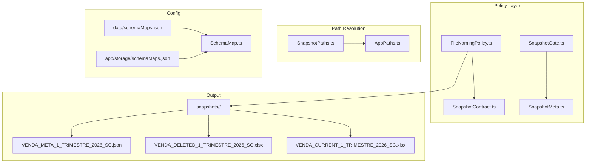
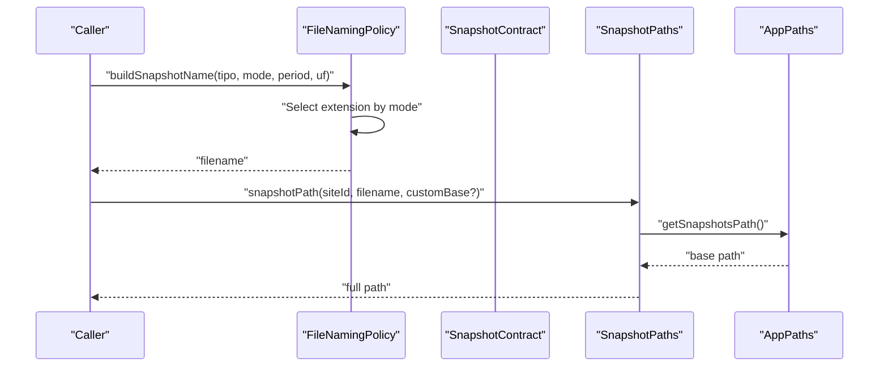
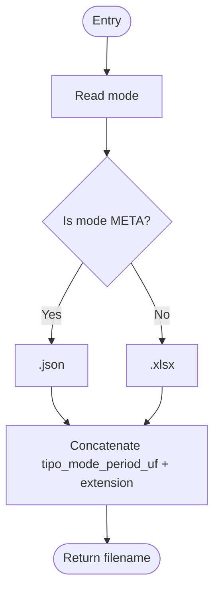
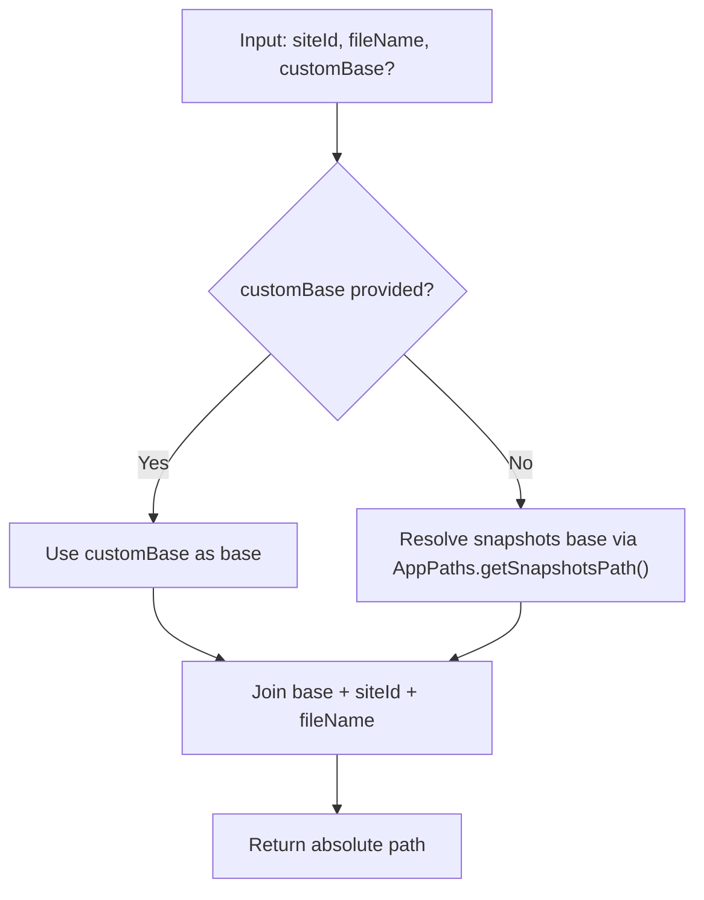
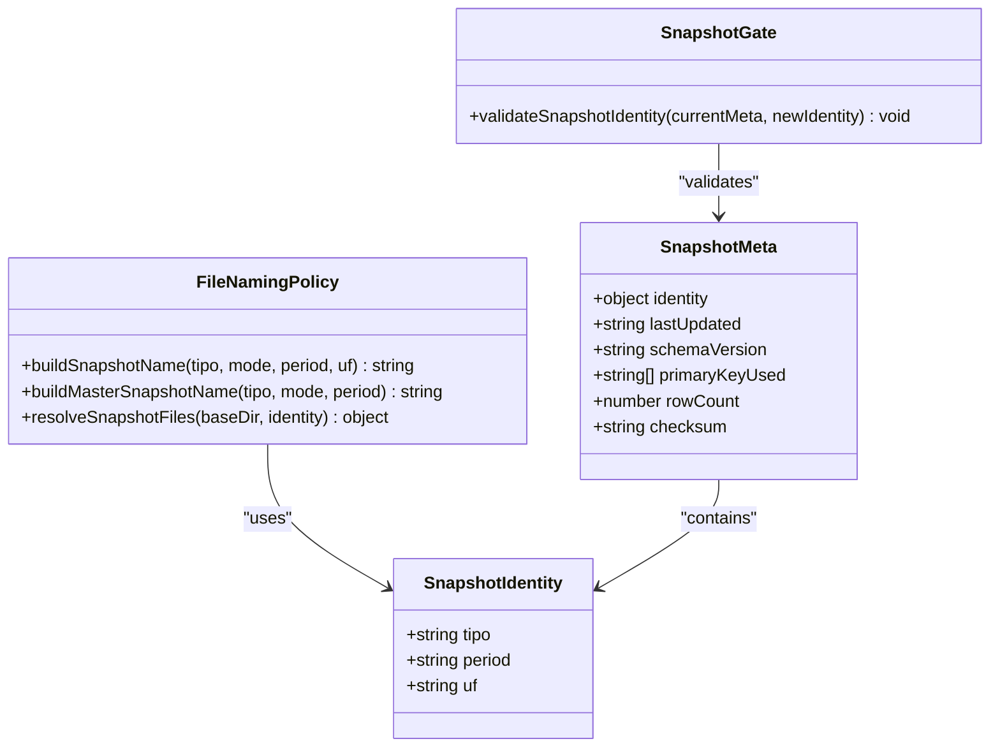
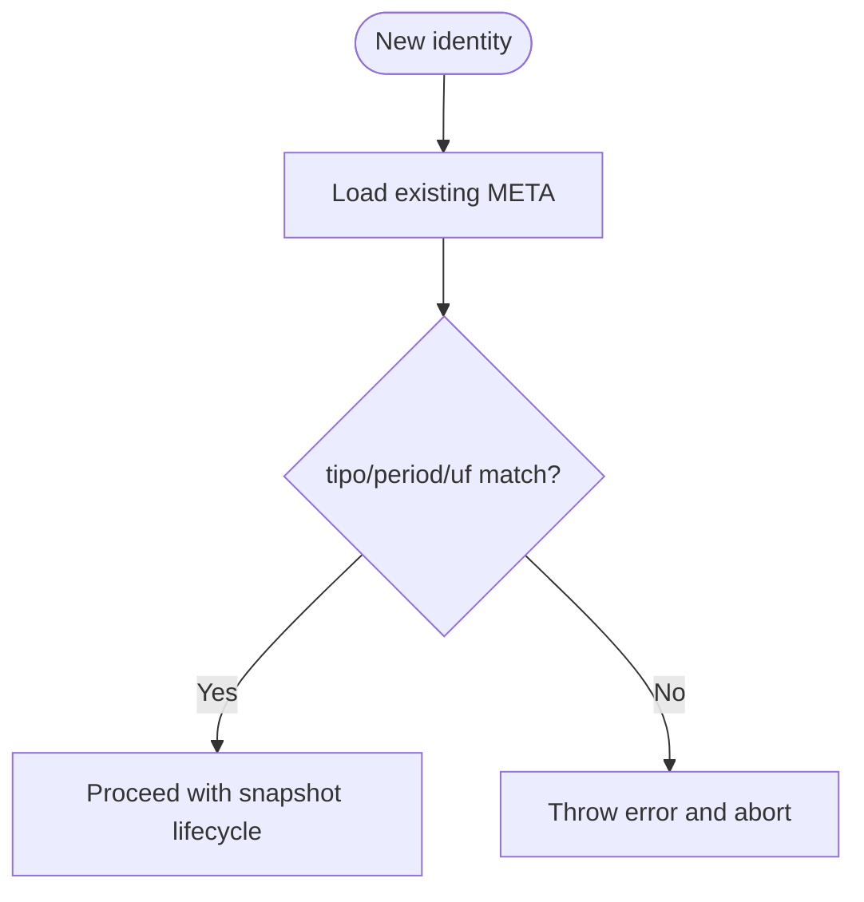
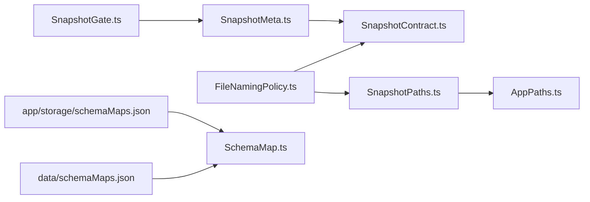

# File Naming Policy

<cite>
**Referenced Files in This Document**
- [FileNamingPolicy.ts](file://app/policy/snapshot/FileNamingPolicy.ts)
- [SnapshotContract.ts](file://app/policy/snapshot/SnapshotContract.ts)
- [SnapshotGate.ts](file://app/policy/snapshot/SnapshotGate.ts)
- [SnapshotMeta.ts](file://app/policy/snapshot/SnapshotMeta.ts)
- [SnapshotPaths.ts](file://app/policy/snapshot/SnapshotPaths.ts)
- [AppPaths.ts](file://app/core/utils/AppPaths.ts)
- [SchemaMap.ts](file://app/config/SchemaMap.ts)
- [schemaMaps.json](file://data/schemaMaps.json)
- [schemaMaps.json](file://app/storage/schemaMaps.json)
- [VENDA_META_1_TRIMESTRE_2026_SC.json](file://snapshots/site-1769612315557/VENDA_META_1_TRIMESTRE_2026_SC.json)
</cite>

## Table of Contents
1. [Introduction](#introduction)
2. [Project Structure](#project-structure)
3. [Core Components](#core-components)
4. [Architecture Overview](#architecture-overview)
5. [Detailed Component Analysis](#detailed-component-analysis)
6. [Dependency Analysis](#dependency-analysis)
7. [Performance Considerations](#performance-considerations)
8. [Troubleshooting Guide](#troubleshooting-guide)
9. [Conclusion](#conclusion)

## Introduction
This document specifies the File Naming Policy component of the Snapshot Safety Policy (SSP). It explains deterministic filename strategies, naming convention rules, and filename generation algorithms used to consistently identify, retrieve, and audit snapshots. It covers naming patterns for different snapshot types, versioning schemes, and organizational structures. It also documents naming rule variations, conflict resolution mechanisms, and the relationship between naming policies and snapshot identification, retrieval, and audit trail purposes. Finally, it provides guidelines for customizing naming conventions while maintaining compliance requirements.

## Project Structure
The File Naming Policy resides under the policy/snapshot module and integrates with supporting modules for identity, metadata, and path resolution. The naming logic produces three file variants per snapshot: CURRENT (active dataset), DELETED (removed rows), and META (internal control file). Paths are organized under a snapshots directory per site.

**Diagram sources**
- [FileNamingPolicy.ts](file://app/policy/snapshot/FileNamingPolicy.ts#L1-L35)
- [SnapshotContract.ts](file://app/policy/snapshot/SnapshotContract.ts#L1-L20)
- [SnapshotGate.ts](file://app/policy/snapshot/SnapshotGate.ts#L1-L28)
- [SnapshotMeta.ts](file://app/policy/snapshot/SnapshotMeta.ts#L1-L18)
- [SnapshotPaths.ts](file://app/policy/snapshot/SnapshotPaths.ts#L1-L13)
- [AppPaths.ts](file://app/core/utils/AppPaths.ts#L37-L39)
- [SchemaMap.ts](file://app/config/SchemaMap.ts#L1-L13)
- [schemaMaps.json](file://data/schemaMaps.json#L1-L9)
- [schemaMaps.json](file://app/storage/schemaMaps.json#L1-L9)

**Section sources**
- [FileNamingPolicy.ts](file://app/policy/snapshot/FileNamingPolicy.ts#L1-L35)
- [SnapshotContract.ts](file://app/policy/snapshot/SnapshotContract.ts#L1-L20)
- [SnapshotPaths.ts](file://app/policy/snapshot/SnapshotPaths.ts#L1-L13)
- [AppPaths.ts](file://app/core/utils/AppPaths.ts#L37-L39)

## Core Components
- Deterministic naming functions produce consistent filenames across runs.
- Snapshot identity defines the core attributes used in filenames.
- Path resolution ensures files are placed under a structured directory hierarchy.
- Metadata guards prevent cross-period comparisons and maintain auditability.
- Schema configuration underpins row normalization and diff safety.

**Section sources**
- [FileNamingPolicy.ts](file://app/policy/snapshot/FileNamingPolicy.ts#L4-L21)
- [SnapshotContract.ts](file://app/policy/snapshot/SnapshotContract.ts#L9-L19)
- [SnapshotPaths.ts](file://app/policy/snapshot/SnapshotPaths.ts#L8-L12)
- [SnapshotGate.ts](file://app/policy/snapshot/SnapshotGate.ts#L4-L27)
- [SchemaMap.ts](file://app/config/SchemaMap.ts#L1-L13)

## Architecture Overview
The naming policy orchestrates deterministic filenames for snapshot variants. It relies on identity attributes (type, period, region) and selects appropriate extensions per variant. Path construction ensures isolation per site and optional override via custom base paths. Validation gates protect against mismatches across periods and types.

**Diagram sources**
- [FileNamingPolicy.ts](file://app/policy/snapshot/FileNamingPolicy.ts#L4-L21)
- [SnapshotContract.ts](file://app/policy/snapshot/SnapshotContract.ts#L9-L13)
- [SnapshotPaths.ts](file://app/policy/snapshot/SnapshotPaths.ts#L8-L12)
- [AppPaths.ts](file://app/core/utils/AppPaths.ts#L37-L39)

## Detailed Component Analysis

### Deterministic Filename Generation
- Current snapshot filename pattern: {tipo}_CURRENT_{period}_{uf}.xlsx
- Deleted snapshot filename pattern: {tipo}_DELETED_{period}_{uf}.xlsx
- Meta snapshot filename pattern: {tipo}_META_{period}_{uf}.json
- Master consolidated filename pattern: CONSOLIDADO{(_EXCLUIDOS)}_{tipo}_{period}.xlsx

These patterns ensure unambiguous identification and consistent ordering for automated retrieval and comparison.

**Section sources**
- [FileNamingPolicy.ts](file://app/policy/snapshot/FileNamingPolicy.ts#L4-L21)

### Naming Convention Rules
- Type (ReportTipo): Enumerated or free-form label indicating report category (e.g., VENDA, PEDIDO).
- Mode: One of CURRENT, DELETED, META, controlling both filename suffix and file semantics.
- Period: Free-form string representing the reporting period (e.g., Q1_2025, 1_TRIMESTRE_2026).
- UF: Free-form region identifier (e.g., SC, RS, SP).
- Extension: json for META, xlsx for CURRENT/DELETED.

**Section sources**
- [FileNamingPolicy.ts](file://app/policy/snapshot/FileNamingPolicy.ts#L4-L12)
- [SnapshotContract.ts](file://app/policy/snapshot/SnapshotContract.ts#L1-L13)

### Filename Generation Algorithms
- Single-file naming: buildSnapshotName constructs a filename from identity attributes and mode.
- Multi-file resolution: resolveSnapshotFiles returns paths for CURRENT, DELETED, and META variants under a base directory.
- Master naming: buildMasterSnapshotName generates consolidated filenames with optional suffix for deleted records.

**Diagram sources**
- [FileNamingPolicy.ts](file://app/policy/snapshot/FileNamingPolicy.ts#L4-L12)

**Section sources**
- [FileNamingPolicy.ts](file://app/policy/snapshot/FileNamingPolicy.ts#L23-L34)

### Snapshot Organization and Path Resolution
- Base path: snapshots/<siteId> by default.
- Override: customBase allows placing files outside the default structure.
- Directory creation: AppPaths ensures essential directories exist.

**Diagram sources**
- [SnapshotPaths.ts](file://app/policy/snapshot/SnapshotPaths.ts#L8-L12)
- [AppPaths.ts](file://app/core/utils/AppPaths.ts#L37-L39)

**Section sources**
- [SnapshotPaths.ts](file://app/policy/snapshot/SnapshotPaths.ts#L8-L12)
- [AppPaths.ts](file://app/core/utils/AppPaths.ts#L44-L58)

### Relationship Between Naming Policies and Snapshot Identification, Retrieval, and Audit Trail
- Identification: The filename embeds tipo, period, and uf, enabling quick identification without parsing content.
- Retrieval: Fixed suffixes (CURRENT, DELETED, META) and deterministic order simplify automated discovery and selection.
- Audit trail: META stores identity, schema version, primary key set, row count, and checksum, forming a verifiable audit record.

**Diagram sources**
- [SnapshotContract.ts](file://app/policy/snapshot/SnapshotContract.ts#L9-L19)
- [SnapshotMeta.ts](file://app/policy/snapshot/SnapshotMeta.ts#L1-L18)
- [FileNamingPolicy.ts](file://app/policy/snapshot/FileNamingPolicy.ts#L4-L21)
- [SnapshotGate.ts](file://app/policy/snapshot/SnapshotGate.ts#L4-L27)

**Section sources**
- [SnapshotMeta.ts](file://app/policy/snapshot/SnapshotMeta.ts#L1-L18)
- [SnapshotGate.ts](file://app/policy/snapshot/SnapshotGate.ts#L4-L27)

### Conflict Resolution Mechanisms
- Identity validation: validateSnapshotIdentity compares tipo, period, and uf between existing META and new identity. Mismatch triggers an error and aborts further processing to prevent corruption.
- Deterministic naming prevents collisions by embedding all discriminators into the filename.

**Diagram sources**
- [SnapshotGate.ts](file://app/policy/snapshot/SnapshotGate.ts#L4-L27)

**Section sources**
- [SnapshotGate.ts](file://app/policy/snapshot/SnapshotGate.ts#L4-L27)

### Examples of Generated Filenames
- Example 1: VENDA_CURRENT_1_TRIMESTRE_2026_SC.xlsx
- Example 2: VENDA_DELETED_1_TRIMESTRE_2026_SC.xlsx
- Example 3: VENDA_META_1_TRIMESTRE_2026_SC.json
- Example 4: CONSOLIDADO_EXCLUIDOS_VENDA_1_TRIMESTRE_2026.xlsx

These examples reflect the deterministic naming rules and confirm the presence of the period and region identifiers.

**Section sources**
- [FileNamingPolicy.ts](file://app/policy/snapshot/FileNamingPolicy.ts#L4-L21)
- [VENDA_META_1_TRIMESTRE_2026_SC.json](file://snapshots/site-1769612315557/VENDA_META_1_TRIMESTRE_2026_SC.json#L1-L1)

### Naming Rule Variations and Compliance
- Variations: The period and uf fields accept free-form values, enabling flexible reporting cycles and regional scopes.
- Compliance: The naming rules ensure deterministic, unambiguous filenames suitable for automated systems. The META file enforces identity checks and maintains audit metadata.

**Section sources**
- [FileNamingPolicy.ts](file://app/policy/snapshot/FileNamingPolicy.ts#L4-L12)
- [SnapshotContract.ts](file://app/policy/snapshot/SnapshotContract.ts#L9-L13)
- [SnapshotMeta.ts](file://app/policy/snapshot/SnapshotMeta.ts#L1-L18)

### Guidelines for Customizing Naming Conventions While Maintaining Compliance
- Preserve discriminators: Keep tipo, period, and uf in filenames to maintain deterministic identification.
- Maintain suffixes: Use CURRENT, DELETED, META to enable automated retrieval and processing.
- Respect extensions: Use .json for META and .xlsx for data variants.
- Keep the path structure: Place files under snapshots/<siteId> unless a custom base is required for special deployments.
- Validate identity: Ensure SnapshotGate remains active to prevent cross-period/type comparisons.
- Configure schema maps: Define primaryKey and optional compareFields in schemaMaps.json to support deterministic diffs.

**Section sources**
- [FileNamingPolicy.ts](file://app/policy/snapshot/FileNamingPolicy.ts#L4-L21)
- [SnapshotPaths.ts](file://app/policy/snapshot/SnapshotPaths.ts#L8-L12)
- [SnapshotGate.ts](file://app/policy/snapshot/SnapshotGate.ts#L4-L27)
- [SchemaMap.ts](file://app/config/SchemaMap.ts#L1-L13)
- [schemaMaps.json](file://data/schemaMaps.json#L1-L9)
- [schemaMaps.json](file://app/storage/schemaMaps.json#L1-L9)

## Dependency Analysis
The naming policy depends on identity contracts, path resolution utilities, and configuration maps. Validation and metadata components enforce correctness and auditability.

**Diagram sources**
- [FileNamingPolicy.ts](file://app/policy/snapshot/FileNamingPolicy.ts#L1-L35)
- [SnapshotContract.ts](file://app/policy/snapshot/SnapshotContract.ts#L1-L20)
- [SnapshotGate.ts](file://app/policy/snapshot/SnapshotGate.ts#L1-L28)
- [SnapshotMeta.ts](file://app/policy/snapshot/SnapshotMeta.ts#L1-L18)
- [SnapshotPaths.ts](file://app/policy/snapshot/SnapshotPaths.ts#L1-L13)
- [AppPaths.ts](file://app/core/utils/AppPaths.ts#L37-L39)
- [SchemaMap.ts](file://app/config/SchemaMap.ts#L1-L13)
- [schemaMaps.json](file://data/schemaMaps.json#L1-L9)
- [schemaMaps.json](file://app/storage/schemaMaps.json#L1-L9)

**Section sources**
- [FileNamingPolicy.ts](file://app/policy/snapshot/FileNamingPolicy.ts#L1-L35)
- [SnapshotContract.ts](file://app/policy/snapshot/SnapshotContract.ts#L1-L20)
- [SnapshotGate.ts](file://app/policy/snapshot/SnapshotGate.ts#L1-L28)
- [SnapshotMeta.ts](file://app/policy/snapshot/SnapshotMeta.ts#L1-L18)
- [SnapshotPaths.ts](file://app/policy/snapshot/SnapshotPaths.ts#L1-L13)
- [AppPaths.ts](file://app/core/utils/AppPaths.ts#L37-L39)
- [SchemaMap.ts](file://app/config/SchemaMap.ts#L1-L13)
- [schemaMaps.json](file://data/schemaMaps.json#L1-L9)
- [schemaMaps.json](file://app/storage/schemaMaps.json#L1-L9)

## Performance Considerations
- Deterministic naming avoids expensive filesystem scans; files can be constructed directly from identity.
- Centralized path resolution minimizes repeated path concatenation and supports caching of base paths.
- Keeping META small and focused on identity and checksum reduces I/O overhead during validation.

## Troubleshooting Guide
- Mismatch errors: If validateSnapshotIdentity detects differing tipo, period, or uf, the process aborts. Verify the identity inputs and ensure the correct period and region are used.
- Missing schema: SafeSnapshotPolicy throws if a SchemaMap is undefined or lacks a valid primaryKey. Confirm schemaMaps.json entries for the report type.
- Path issues: Ensure snapshots directory exists or provide a custom base path. AppPaths.ensureDirectories creates required folders.

**Section sources**
- [SnapshotGate.ts](file://app/policy/snapshot/SnapshotGate.ts#L4-L27)
- [SafeSnapshotPolicy.ts](file://app/policy/snapshot/SafeSnapshotPolicy.ts#L8-L23)
- [AppPaths.ts](file://app/core/utils/AppPaths.ts#L44-L58)

## Conclusion
The File Naming Policy establishes a deterministic, auditable, and extensible foundation for snapshot management. By embedding identity attributes in filenames, enforcing strict suffixes and extensions, and integrating with path resolution and validation gates, the policy ensures reliable identification, retrieval, and auditability across snapshot lifecycles. Adhering to these rules while customizing periods, regions, and optional consolidations maintains compliance and enables robust automation.