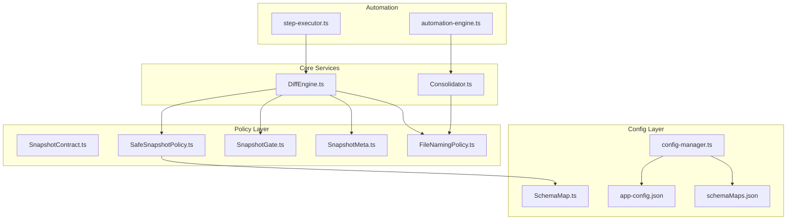
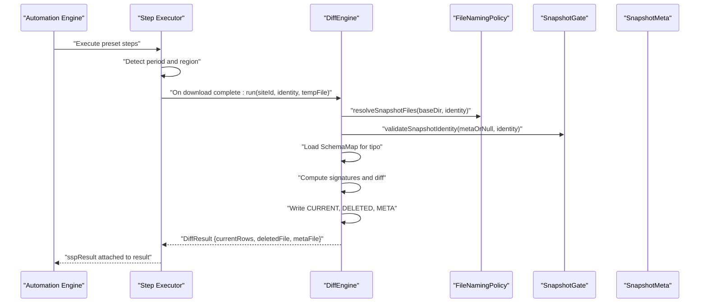
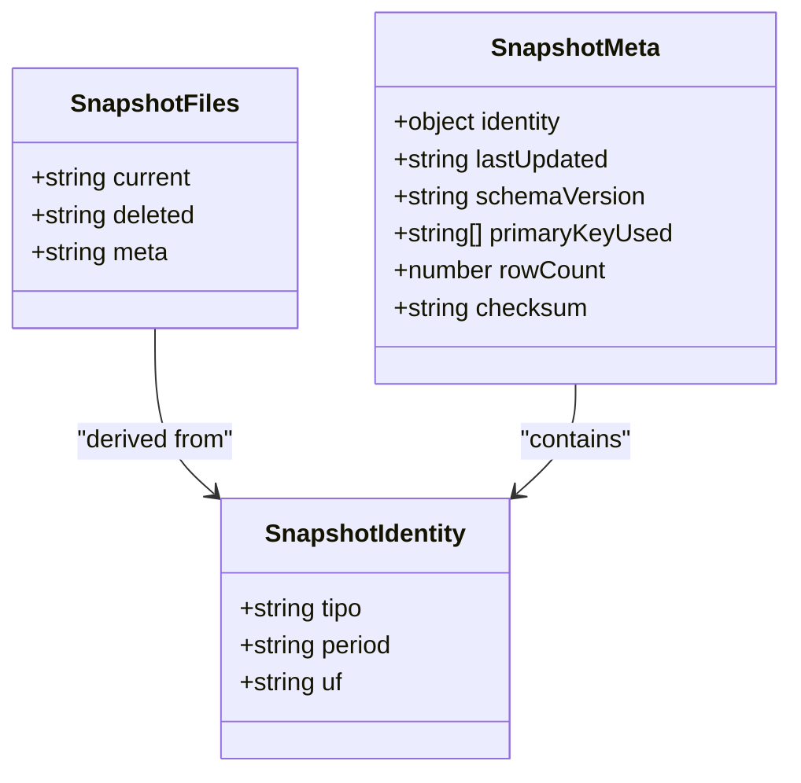
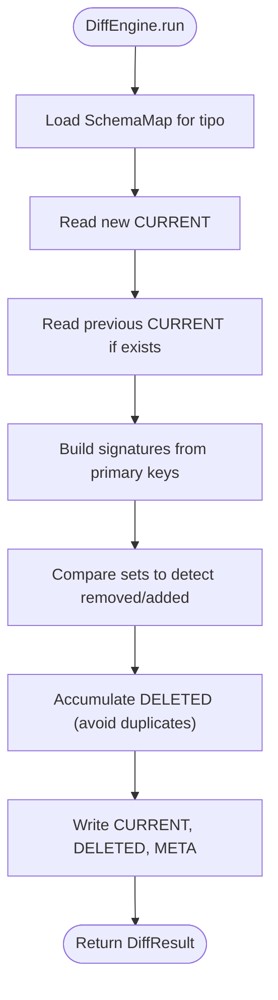
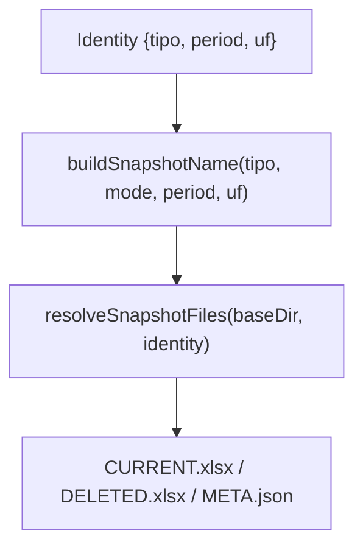
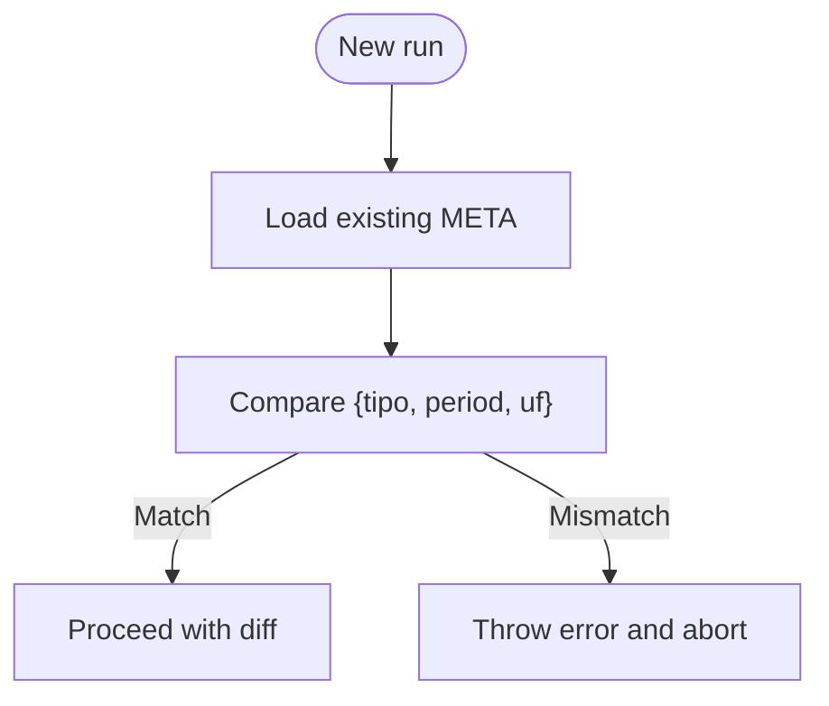
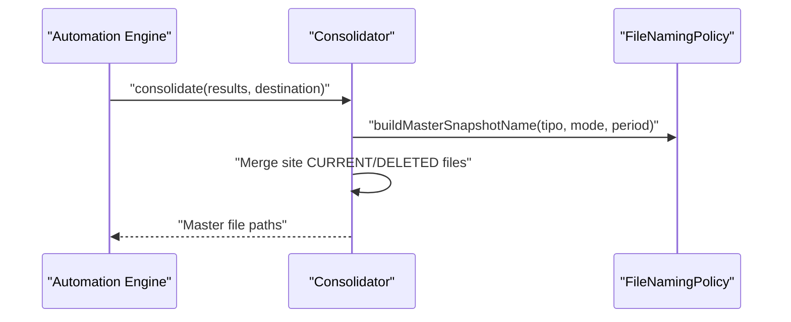
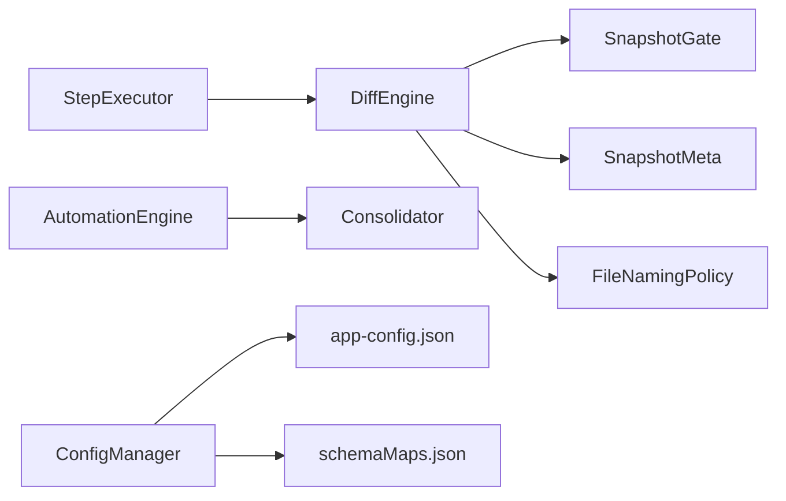
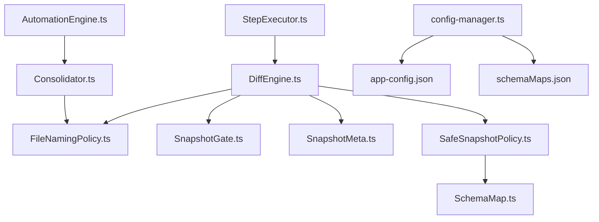

# SSP Architecture and Principles

<cite>
**Referenced Files in This Document**
- [SafeSnapshotPolicy.ts](file://app/policy/snapshot/SafeSnapshotPolicy.ts)
- [SnapshotContract.ts](file://app/policy/snapshot/SnapshotContract.ts)
- [SnapshotGate.ts](file://app/policy/snapshot/SnapshotGate.ts)
- [SnapshotMeta.ts](file://app/policy/snapshot/SnapshotMeta.ts)
- [FileNamingPolicy.ts](file://app/policy/snapshot/FileNamingPolicy.ts)
- [SchemaMap.ts](file://app/config/SchemaMap.ts)
- [config-manager.ts](file://app/config/config-manager.ts)
- [app-config.json](file://app/config/app-config.json)
- [schemaMaps.json](file://data/schemaMaps.json)
- [DiffEngine.ts](file://app/core/diff/DiffEngine.ts)
- [Consolidator.ts](file://app/core/consolidation/Consolidator.ts)
- [step-executor.ts](file://app/automation/engine/step-executor.ts)
- [automation-engine.ts](file://app/automation/engine/automation-engine.ts)
</cite>

## Table of Contents
1. [Introduction](#introduction)
2. [Project Structure](#project-structure)
3. [Core Components](#core-components)
4. [Architecture Overview](#architecture-overview)
5. [Detailed Component Analysis](#detailed-component-analysis)
6. [Dependency Analysis](#dependency-analysis)
7. [Performance Considerations](#performance-considerations)
8. [Troubleshooting Guide](#troubleshooting-guide)
9. [Conclusion](#conclusion)

## Introduction
This document explains the Safe Snapshot Policy (SSP) architecture and foundational principles that underpin an enterprise-grade data integrity verification system. SSP ensures deterministic snapshot creation, strict identity validation, schema-driven comparison, and immutable audit trails. It defines a robust contract for snapshot identity, enforces schema-based validation, and integrates tightly with the automation engine to produce consistent CURRENT, DELETED, and META artifacts. The design emphasizes consistency, idempotence, traceability, and compliance with enterprise standards.

## Project Structure
SSP resides in the policy/snapshot domain and interacts with configuration, diff engine, and consolidation modules. The structure supports:
- Policy contracts and guards
- Deterministic file naming and storage paths
- Schema-driven validation and comparison
- Diff engine and consolidation services
- Automation orchestration and notifications

**Diagram sources**
- [SnapshotContract.ts](file://app/policy/snapshot/SnapshotContract.ts#L1-L70)
- [SafeSnapshotPolicy.ts](file://app/policy/snapshot/SafeSnapshotPolicy.ts#L1-L25)
- [SnapshotGate.ts](file://app/policy/snapshot/SnapshotGate.ts#L1-L28)
- [SnapshotMeta.ts](file://app/policy/snapshot/SnapshotMeta.ts#L1-L18)
- [FileNamingPolicy.ts](file://app/policy/snapshot/FileNamingPolicy.ts#L1-L35)
- [SchemaMap.ts](file://app/config/SchemaMap.ts#L1-L13)
- [config-manager.ts](file://app/config/config-manager.ts#L1-L408)
- [app-config.json](file://app/config/app-config.json#L1-L1521)
- [schemaMaps.json](file://data/schemaMaps.json#L1-L9)
- [DiffEngine.ts](file://app/core/diff/DiffEngine.ts#L1-L230)
- [Consolidator.ts](file://app/core/consolidation/Consolidator.ts#L1-L138)
- [step-executor.ts](file://app/automation/engine/step-executor.ts#L1-L35)
- [automation-engine.ts](file://app/automation/engine/automation-engine.ts#L221-L253)

**Section sources**
- [SnapshotContract.ts](file://app/policy/snapshot/SnapshotContract.ts#L1-L70)
- [SafeSnapshotPolicy.ts](file://app/policy/snapshot/SafeSnapshotPolicy.ts#L1-L25)
- [SnapshotGate.ts](file://app/policy/snapshot/SnapshotGate.ts#L1-L28)
- [SnapshotMeta.ts](file://app/policy/snapshot/SnapshotMeta.ts#L1-L18)
- [FileNamingPolicy.ts](file://app/policy/snapshot/FileNamingPolicy.ts#L1-L35)
- [SchemaMap.ts](file://app/config/SchemaMap.ts#L1-L13)
- [config-manager.ts](file://app/config/config-manager.ts#L1-L408)
- [app-config.json](file://app/config/app-config.json#L1-L1521)
- [schemaMaps.json](file://data/schemaMaps.json#L1-L9)
- [DiffEngine.ts](file://app/core/diff/DiffEngine.ts#L1-L230)
- [Consolidator.ts](file://app/core/consolidation/Consolidator.ts#L1-L138)
- [step-executor.ts](file://app/automation/engine/step-executor.ts#L1-L35)
- [automation-engine.ts](file://app/automation/engine/automation-engine.ts#L221-L253)

## Core Components
- SnapshotContract: Defines the universal snapshot identity and file contract for CURRENT, DELETED, and META.
- SafeSnapshotPolicy: Enforces schema availability and validates primary key definitions per report type.
- SnapshotGate: Validates identity continuity across runs to prevent cross-period or cross-type comparisons.
- SnapshotMeta: Captures identity, integrity, and audit metadata for deterministic reconciliation.
- FileNamingPolicy: Provides deterministic file naming and resolution for snapshot artifacts.
- SchemaMap: Describes per-type primary keys and optional fields used for normalization and diff.
- DiffEngine: Orchestrates deterministic diff computation, DELETED accumulation, and META updates.
- Consolidator: Aggregates snapshots across sites into master CURRENT and DELETED reports.
- Automation integration: Hooks diff execution after downloads and triggers consolidation.

**Section sources**
- [SnapshotContract.ts](file://app/policy/snapshot/SnapshotContract.ts#L1-L70)
- [SafeSnapshotPolicy.ts](file://app/policy/snapshot/SafeSnapshotPolicy.ts#L1-L25)
- [SnapshotGate.ts](file://app/policy/snapshot/SnapshotGate.ts#L1-L28)
- [SnapshotMeta.ts](file://app/policy/snapshot/SnapshotMeta.ts#L1-L18)
- [FileNamingPolicy.ts](file://app/policy/snapshot/FileNamingPolicy.ts#L1-L35)
- [SchemaMap.ts](file://app/config/SchemaMap.ts#L1-L13)
- [DiffEngine.ts](file://app/core/diff/DiffEngine.ts#L1-L230)
- [Consolidator.ts](file://app/core/consolidation/Consolidator.ts#L1-L138)

## Architecture Overview
SSP establishes a deterministic snapshot lifecycle governed by identity, schema, and validation gates. The automation engine orchestrates downloads, the diff engine computes differences, and consolidation aggregates results.

**Diagram sources**
- [step-executor.ts](file://app/automation/engine/step-executor.ts#L1-L35)
- [DiffEngine.ts](file://app/core/diff/DiffEngine.ts#L55-L219)
- [FileNamingPolicy.ts](file://app/policy/snapshot/FileNamingPolicy.ts#L23-L34)
- [SnapshotGate.ts](file://app/policy/snapshot/SnapshotGate.ts#L4-L27)
- [SnapshotMeta.ts](file://app/policy/snapshot/SnapshotMeta.ts#L1-L18)

## Detailed Component Analysis

### Snapshot Identity and Contracts
- Identity comprises type, period, and region (UF). This triplet forms the immutable snapshot key.
- Files are named deterministically and stored under a site-scoped path.
- The contract defines three artifacts: CURRENT (active rows), DELETED (accumulated removals), META (audit/control).

**Diagram sources**
- [SnapshotContract.ts](file://app/policy/snapshot/SnapshotContract.ts#L9-L19)
- [SnapshotMeta.ts](file://app/policy/snapshot/SnapshotMeta.ts#L1-L18)

**Section sources**
- [SnapshotContract.ts](file://app/policy/snapshot/SnapshotContract.ts#L1-L70)
- [SnapshotMeta.ts](file://app/policy/snapshot/SnapshotMeta.ts#L1-L18)

### Schema-Based Validation and Deterministic Diff
- SchemaMap defines primary keys per report type; validation ensures non-empty primary key sets.
- DiffEngine loads schemaMaps.json, resolves identity, reads previous/current snapshots, builds signatures, detects removed rows, and writes DELETED and META.
- Signature normalization supports flexible column selection (by name, occurrence, or index) to tolerate minor schema variations while preserving determinism.

**Diagram sources**
- [DiffEngine.ts](file://app/core/diff/DiffEngine.ts#L55-L219)
- [SafeSnapshotPolicy.ts](file://app/policy/snapshot/SafeSnapshotPolicy.ts#L8-L23)
- [schemaMaps.json](file://data/schemaMaps.json#L1-L9)

**Section sources**
- [SafeSnapshotPolicy.ts](file://app/policy/snapshot/SafeSnapshotPolicy.ts#L1-L25)
- [DiffEngine.ts](file://app/core/diff/DiffEngine.ts#L1-L230)
- [schemaMaps.json](file://data/schemaMaps.json#L1-L9)

### File Naming and Storage
- Deterministic naming ensures artifact uniqueness per type, period, and region.
- FileNamingPolicy constructs paths for CURRENT, DELETED, and META.
- Snapshot paths are site-scoped, enabling isolation and aggregation.

**Diagram sources**
- [FileNamingPolicy.ts](file://app/policy/snapshot/FileNamingPolicy.ts#L4-L34)

**Section sources**
- [FileNamingPolicy.ts](file://app/policy/snapshot/FileNamingPolicy.ts#L1-L35)

### Validation Gate and Integrity Guards
- SnapshotGate enforces identity continuity across runs. Any mismatch in tipo, period, or uf triggers an immediate abort to prevent cross-period comparisons.
- SnapshotMeta captures schema version, primary keys used, row counts, and checksums to support auditability and integrity checks.

**Diagram sources**
- [SnapshotGate.ts](file://app/policy/snapshot/SnapshotGate.ts#L4-L27)
- [SnapshotMeta.ts](file://app/policy/snapshot/SnapshotMeta.ts#L1-L18)

**Section sources**
- [SnapshotGate.ts](file://app/policy/snapshot/SnapshotGate.ts#L1-L28)
- [SnapshotMeta.ts](file://app/policy/snapshot/SnapshotMeta.ts#L1-L18)

### Consolidation and Enterprise Reporting
- Consolidator merges multiple site snapshots into master CURRENT and DELETED reports, injecting provenance columns for traceability.
- Master filenames encode type and period, ensuring deterministic naming and easy auditing.

**Diagram sources**
- [Consolidator.ts](file://app/core/consolidation/Consolidator.ts#L26-L63)
- [FileNamingPolicy.ts](file://app/policy/snapshot/FileNamingPolicy.ts#L14-L21)

**Section sources**
- [Consolidator.ts](file://app/core/consolidation/Consolidator.ts#L1-L138)
- [FileNamingPolicy.ts](file://app/policy/snapshot/FileNamingPolicy.ts#L1-L35)

### Automation Integration and Compliance
- StepExecutor coordinates downloads, infers period and region, and triggers DiffEngine upon completion.
- AutomationEngine aggregates results, attaches sspResult, and sends notifications.
- Configuration manager validates and persists presets, including primary keys and report types, aligning with SchemaMap definitions.

**Diagram sources**
- [step-executor.ts](file://app/automation/engine/step-executor.ts#L1-L35)
- [DiffEngine.ts](file://app/core/diff/DiffEngine.ts#L1-L230)
- [SnapshotGate.ts](file://app/policy/snapshot/SnapshotGate.ts#L1-L28)
- [SnapshotMeta.ts](file://app/policy/snapshot/SnapshotMeta.ts#L1-L18)
- [FileNamingPolicy.ts](file://app/policy/snapshot/FileNamingPolicy.ts#L1-L35)
- [automation-engine.ts](file://app/automation/engine/automation-engine.ts#L221-L253)
- [config-manager.ts](file://app/config/config-manager.ts#L1-L408)
- [app-config.json](file://app/config/app-config.json#L1-L1521)
- [schemaMaps.json](file://data/schemaMaps.json#L1-L9)

**Section sources**
- [step-executor.ts](file://app/automation/engine/step-executor.ts#L1-L35)
- [DiffEngine.ts](file://app/core/diff/DiffEngine.ts#L1-L230)
- [automation-engine.ts](file://app/automation/engine/automation-engine.ts#L221-L253)
- [config-manager.ts](file://app/config/config-manager.ts#L1-L408)
- [app-config.json](file://app/config/app-config.json#L1-L1521)
- [schemaMaps.json](file://data/schemaMaps.json#L1-L9)

## Dependency Analysis
SSP components exhibit low coupling and high cohesion:
- DiffEngine depends on FileNamingPolicy, SnapshotGate, SnapshotMeta, and SafeSnapshotPolicy.
- SafeSnapshotPolicy depends on SchemaMap definitions loaded from schemaMaps.json.
- Consolidator depends on FileNamingPolicy and site results with sspResult metadata.
- Automation engine integrates DiffEngine and Consolidator, and relies on ConfigManager for configuration.

**Diagram sources**
- [DiffEngine.ts](file://app/core/diff/DiffEngine.ts#L1-L230)
- [FileNamingPolicy.ts](file://app/policy/snapshot/FileNamingPolicy.ts#L1-L35)
- [SnapshotGate.ts](file://app/policy/snapshot/SnapshotGate.ts#L1-L28)
- [SnapshotMeta.ts](file://app/policy/snapshot/SnapshotMeta.ts#L1-L18)
- [SafeSnapshotPolicy.ts](file://app/policy/snapshot/SafeSnapshotPolicy.ts#L1-L25)
- [SchemaMap.ts](file://app/config/SchemaMap.ts#L1-L13)
- [Consolidator.ts](file://app/core/consolidation/Consolidator.ts#L1-L138)
- [step-executor.ts](file://app/automation/engine/step-executor.ts#L1-L35)
- [automation-engine.ts](file://app/automation/engine/automation-engine.ts#L221-L253)
- [config-manager.ts](file://app/config/config-manager.ts#L1-L408)
- [app-config.json](file://app/config/app-config.json#L1-L1521)
- [schemaMaps.json](file://data/schemaMaps.json#L1-L9)

**Section sources**
- [DiffEngine.ts](file://app/core/diff/DiffEngine.ts#L1-L230)
- [Consolidator.ts](file://app/core/consolidation/Consolidator.ts#L1-L138)
- [step-executor.ts](file://app/automation/engine/step-executor.ts#L1-L35)
- [automation-engine.ts](file://app/automation/engine/automation-engine.ts#L221-L253)
- [config-manager.ts](file://app/config/config-manager.ts#L1-L408)

## Performance Considerations
- Deterministic signatures: Using primary keys to compute row signatures ensures O(n) set operations for diff detection.
- Minimal I/O: Reads/writes are scoped to snapshot files; avoid unnecessary conversions by writing XLSX directly.
- Idempotent DELETED: Deduplication prevents exponential growth of DELETED files.
- Consolidation batching: Merge only successful results to reduce overhead.

## Troubleshooting Guide
Common issues and resolutions:
- Schema not defined: Ensure schemaMaps.json contains entries for the report type; SafeSnapshotPolicy throws when missing or primary key is empty.
- Identity mismatch: SnapshotGate aborts if tipo, period, or uf differ from META; verify period inference and region assignment.
- Empty or corrupted snapshot: DiffEngine treats unreadable previous CURRENT as a fresh run; check file permissions and encoding.
- Missing schema file: DiffEngine constructor throws if schemaMaps.json is not present; confirm packaging and resource paths.
- Consolidation failures: Verify site results include sspResult with currentFile/deletedFile; ensure destination directory exists.

**Section sources**
- [SafeSnapshotPolicy.ts](file://app/policy/snapshot/SafeSnapshotPolicy.ts#L8-L23)
- [SnapshotGate.ts](file://app/policy/snapshot/SnapshotGate.ts#L4-L27)
- [DiffEngine.ts](file://app/core/diff/DiffEngine.ts#L26-L45)
- [Consolidator.ts](file://app/core/consolidation/Consolidator.ts#L26-L63)

## Conclusion
SSP provides a robust, enterprise-grade foundation for deterministic snapshot creation and verification. By enforcing strict identity contracts, schema-driven validation, and immutable audit trails, it guarantees consistency, idempotence, and traceability across automated ERP integrations. Its modular design integrates seamlessly with the automation engine, diff service, and consolidation pipeline, supporting scalable, compliant enterprise reporting.