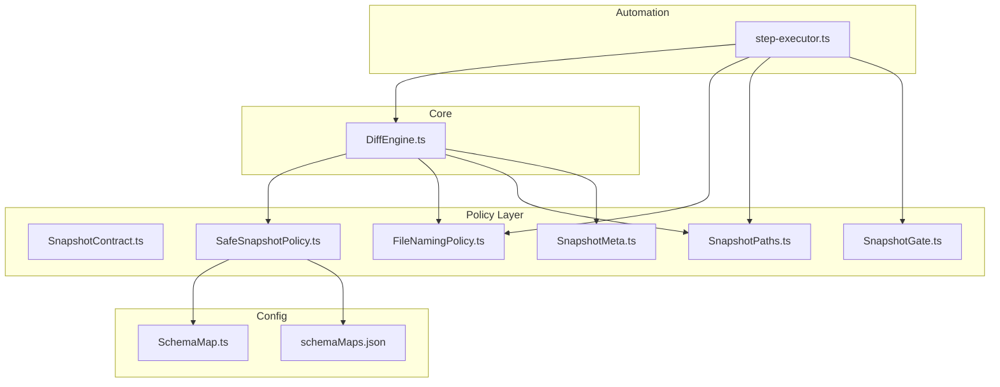
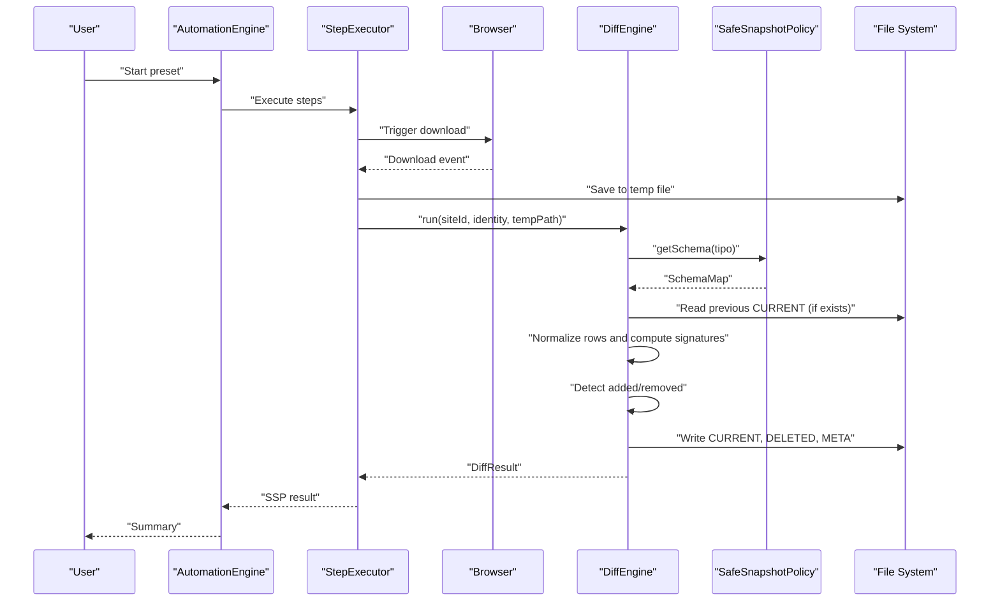
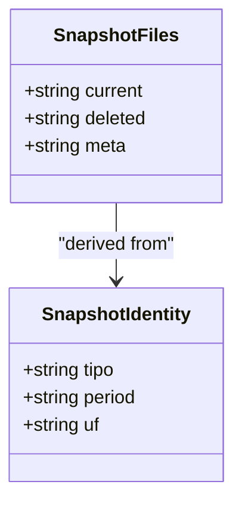
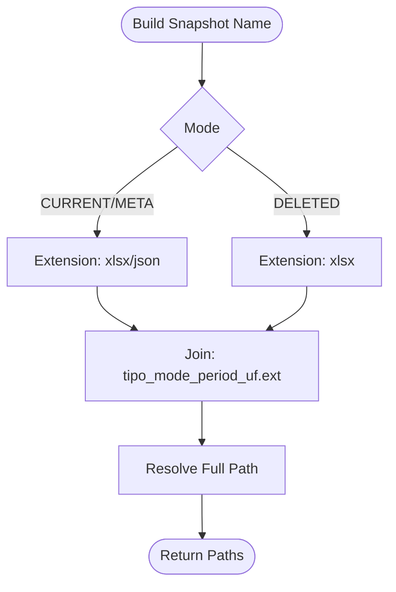
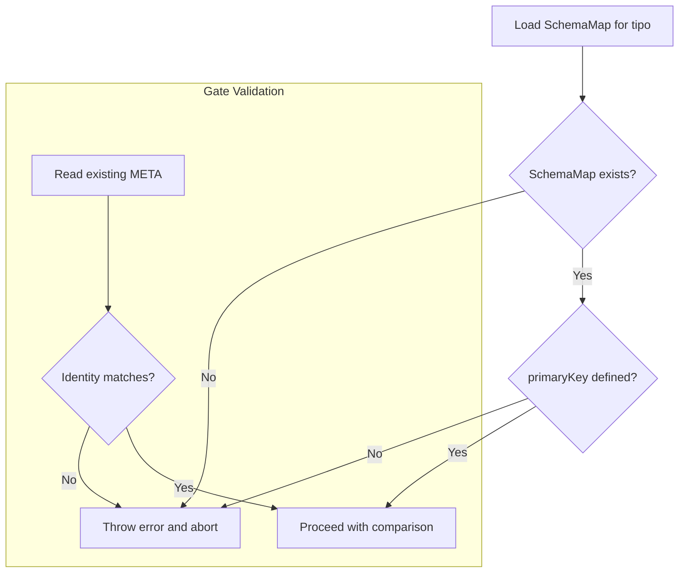
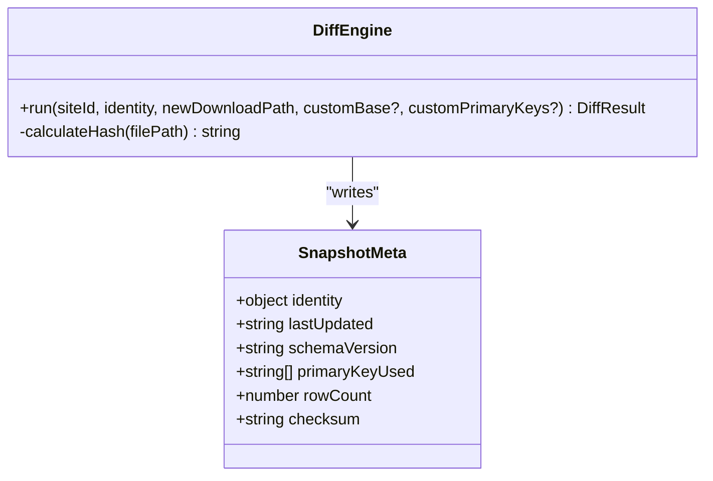
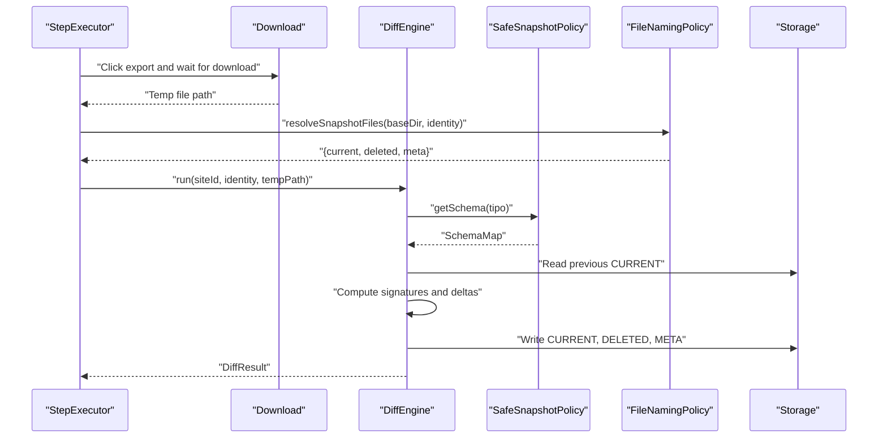
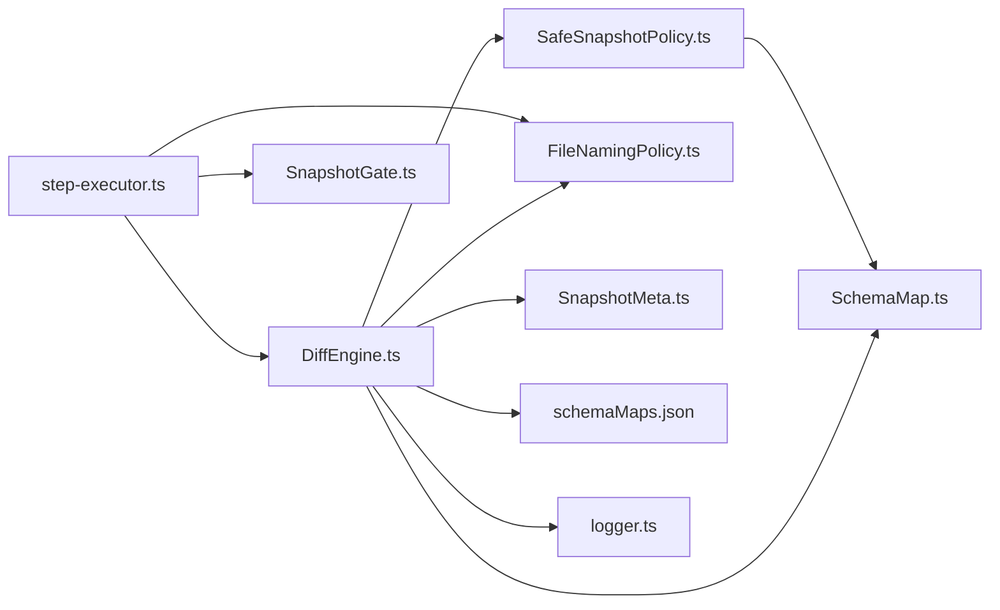

# Safe Snapshot Policy (SSP)

<cite>
**Referenced Files in This Document**
- [SafeSnapshotPolicy.ts](file://app/policy/snapshot/SafeSnapshotPolicy.ts)
- [SnapshotContract.ts](file://app/policy/snapshot/SnapshotContract.ts)
- [SnapshotGate.ts](file://app/policy/snapshot/SnapshotGate.ts)
- [FileNamingPolicy.ts](file://app/policy/snapshot/FileNamingPolicy.ts)
- [SnapshotMeta.ts](file://app/policy/snapshot/SnapshotMeta.ts)
- [SnapshotPaths.ts](file://app/policy/snapshot/SnapshotPaths.ts)
- [SchemaMap.ts](file://app/config/SchemaMap.ts)
- [schemaMaps.json](file://data/schemaMaps.json)
- [DiffEngine.ts](file://app/core/diff/DiffEngine.ts)
- [step-executor.ts](file://app/automation/engine/step-executor.ts)
- [logger.ts](file://app/config/logger.ts)
</cite>

## Table of Contents
1. [Introduction](#introduction)
2. [Project Structure](#project-structure)
3. [Core Components](#core-components)
4. [Architecture Overview](#architecture-overview)
5. [Detailed Component Analysis](#detailed-component-analysis)
6. [Dependency Analysis](#dependency-analysis)
7. [Performance Considerations](#performance-considerations)
8. [Troubleshooting Guide](#troubleshooting-guide)
9. [Conclusion](#conclusion)
10. [Appendices](#appendices)

## Introduction
This document describes the Safe Snapshot Policy (SSP) implementation, an enterprise-grade data integrity verification system designed to capture, compare, and audit ERP reports with deterministic naming, schema-driven comparisons, and immutable audit trails. It ensures consistency, idempotence, and traceability across automated snapshot lifecycles while integrating tightly with the broader automation engine.

SSP defines:
- Strong snapshot identity (type, period, region)
- Deterministic file naming and storage layout
- Schema-based comparison using configurable primary keys
- Guarded gates to prevent cross-period or cross-type mismatches
- Audit metadata and consolidated deletion tracking

## Project Structure
SSP lives under app/policy/snapshot and integrates with app/core/diff and app/automation/engine. Configuration is externalized via app/config/SchemaMap.ts and data/schemaMaps.json. The DiffEngine orchestrates snapshot lifecycle after downloads.

**Diagram sources**
- [SnapshotContract.ts](file://app/policy/snapshot/SnapshotContract.ts#L1-L20)
- [SafeSnapshotPolicy.ts](file://app/policy/snapshot/SafeSnapshotPolicy.ts#L1-L25)
- [FileNamingPolicy.ts](file://app/policy/snapshot/FileNamingPolicy.ts#L1-L35)
- [SnapshotGate.ts](file://app/policy/snapshot/SnapshotGate.ts#L1-L28)
- [SnapshotMeta.ts](file://app/policy/snapshot/SnapshotMeta.ts#L1-L18)
- [SnapshotPaths.ts](file://app/policy/snapshot/SnapshotPaths.ts#L1-L13)
- [DiffEngine.ts](file://app/core/diff/DiffEngine.ts#L1-L230)
- [step-executor.ts](file://app/automation/engine/step-executor.ts#L35-L549)
- [SchemaMap.ts](file://app/config/SchemaMap.ts#L1-L13)
- [schemaMaps.json](file://data/schemaMaps.json#L1-L9)

**Section sources**
- [SafeSnapshotPolicy.ts](file://app/policy/snapshot/SafeSnapshotPolicy.ts#L1-L25)
- [SnapshotContract.ts](file://app/policy/snapshot/SnapshotContract.ts#L1-L20)
- [FileNamingPolicy.ts](file://app/policy/snapshot/FileNamingPolicy.ts#L1-L35)
- [SnapshotGate.ts](file://app/policy/snapshot/SnapshotGate.ts#L1-L28)
- [SnapshotMeta.ts](file://app/policy/snapshot/SnapshotMeta.ts#L1-L18)
- [SnapshotPaths.ts](file://app/policy/snapshot/SnapshotPaths.ts#L1-L13)
- [DiffEngine.ts](file://app/core/diff/DiffEngine.ts#L1-L230)
- [step-executor.ts](file://app/automation/engine/step-executor.ts#L35-L549)
- [SchemaMap.ts](file://app/config/SchemaMap.ts#L1-L13)
- [schemaMaps.json](file://data/schemaMaps.json#L1-L9)

## Core Components
- SnapshotContract: Defines the universal snapshot identity and file contract.
- SafeSnapshotPolicy: Validates and retrieves schema definitions per report type.
- FileNamingPolicy: Produces deterministic file names and resolves full paths.
- SnapshotGate: Enforces identity consistency across runs.
- SnapshotMeta: Captures audit metadata for each snapshot.
- SnapshotPaths: Resolves storage locations with optional custom base paths.
- DiffEngine: Orchestrates snapshot lifecycle, comparison, and audit trail updates.
- step-executor: Integrates download completion with SSP-compliant processing.

**Section sources**
- [SnapshotContract.ts](file://app/policy/snapshot/SnapshotContract.ts#L1-L20)
- [SafeSnapshotPolicy.ts](file://app/policy/snapshot/SafeSnapshotPolicy.ts#L1-L25)
- [FileNamingPolicy.ts](file://app/policy/snapshot/FileNamingPolicy.ts#L1-L35)
- [SnapshotGate.ts](file://app/policy/snapshot/SnapshotGate.ts#L1-L28)
- [SnapshotMeta.ts](file://app/policy/snapshot/SnapshotMeta.ts#L1-L18)
- [SnapshotPaths.ts](file://app/policy/snapshot/SnapshotPaths.ts#L1-L13)
- [DiffEngine.ts](file://app/core/diff/DiffEngine.ts#L1-L230)
- [step-executor.ts](file://app/automation/engine/step-executor.ts#L35-L549)

## Architecture Overview
SSP enforces a strict contract for snapshot identity and schema-driven comparison. The automation engine triggers downloads, then delegates to the DiffEngine, which validates identity, loads schema, normalizes rows, computes signatures, detects deltas, and updates audit artifacts.

**Diagram sources**
- [step-executor.ts](file://app/automation/engine/step-executor.ts#L439-L488)
- [DiffEngine.ts](file://app/core/diff/DiffEngine.ts#L55-L219)
- [SafeSnapshotPolicy.ts](file://app/policy/snapshot/SafeSnapshotPolicy.ts#L8-L23)

## Detailed Component Analysis

### Snapshot Identity and Contracts
- SnapshotIdentity defines the immutable triplet: type, period, and region. This ensures deterministic naming and prevents cross-period comparisons.
- SnapshotFiles enumerates the three artifacts: CURRENT, DELETED, META.

**Diagram sources**
- [SnapshotContract.ts](file://app/policy/snapshot/SnapshotContract.ts#L9-L19)

**Section sources**
- [SnapshotContract.ts](file://app/policy/snapshot/SnapshotContract.ts#L1-L20)

### Deterministic File Naming and Storage
- FileNamingPolicy builds deterministic names and resolves full paths for CURRENT, DELETED, META.
- SnapshotPaths supports custom base directories and site-scoped snapshot folders.

**Diagram sources**
- [FileNamingPolicy.ts](file://app/policy/snapshot/FileNamingPolicy.ts#L4-L34)
- [SnapshotPaths.ts](file://app/policy/snapshot/SnapshotPaths.ts#L8-L12)

**Section sources**
- [FileNamingPolicy.ts](file://app/policy/snapshot/FileNamingPolicy.ts#L1-L35)
- [SnapshotPaths.ts](file://app/policy/snapshot/SnapshotPaths.ts#L1-L13)

### Schema-Based Comparison and Gate Mechanisms
- SafeSnapshotPolicy validates presence and integrity of SchemaMap entries and ensures primary keys are defined.
- SnapshotGate compares identity across runs to prevent cross-type or cross-period mismatches.
- DiffEngine loads schema from data/schemaMaps.json, normalizes rows, computes signatures, and detects deltas deterministically.

**Diagram sources**
- [SafeSnapshotPolicy.ts](file://app/policy/snapshot/SafeSnapshotPolicy.ts#L8-L23)
- [SnapshotGate.ts](file://app/policy/snapshot/SnapshotGate.ts#L4-L27)
- [DiffEngine.ts](file://app/core/diff/DiffEngine.ts#L66-L74)

**Section sources**
- [SafeSnapshotPolicy.ts](file://app/policy/snapshot/SafeSnapshotPolicy.ts#L1-L25)
- [SnapshotGate.ts](file://app/policy/snapshot/SnapshotGate.ts#L1-L28)
- [DiffEngine.ts](file://app/core/diff/DiffEngine.ts#L26-L45)

### Audit Trail Generation and Metadata Management
- SnapshotMeta captures identity, timestamps, schema version, primary keys used, row counts, and checksums.
- DiffEngine writes META after each run and calculates a SHA-256 checksum of CURRENT for integrity verification.
- DELETED accumulates removed rows deterministically without duplication.

**Diagram sources**
- [SnapshotMeta.ts](file://app/policy/snapshot/SnapshotMeta.ts#L1-L18)
- [DiffEngine.ts](file://app/core/diff/DiffEngine.ts#L197-L210)
- [DiffEngine.ts](file://app/core/diff/DiffEngine.ts#L221-L226)

**Section sources**
- [SnapshotMeta.ts](file://app/policy/snapshot/SnapshotMeta.ts#L1-L18)
- [DiffEngine.ts](file://app/core/diff/DiffEngine.ts#L196-L226)

### Integration with Automation Engine
- step-executor coordinates downloads, infers periods from date tokens, constructs SnapshotIdentity, and invokes DiffEngine.
- After successful processing, it stores DiffResult for the AutomationEngine to consolidate and report.

**Diagram sources**
- [step-executor.ts](file://app/automation/engine/step-executor.ts#L439-L488)
- [DiffEngine.ts](file://app/core/diff/DiffEngine.ts#L55-L219)
- [FileNamingPolicy.ts](file://app/policy/snapshot/FileNamingPolicy.ts#L23-L34)

**Section sources**
- [step-executor.ts](file://app/automation/engine/step-executor.ts#L439-L488)
- [DiffEngine.ts](file://app/core/diff/DiffEngine.ts#L55-L219)

## Dependency Analysis
SSP components exhibit low coupling and high cohesion:
- DiffEngine depends on SafeSnapshotPolicy for schema retrieval and on FileNamingPolicy for artifact paths.
- step-executor orchestrates the end-to-end flow and passes identity and paths to DiffEngine.
- Logger is used across components for auditability.

**Diagram sources**
- [step-executor.ts](file://app/automation/engine/step-executor.ts#L35-L549)
- [DiffEngine.ts](file://app/core/diff/DiffEngine.ts#L1-L230)
- [SafeSnapshotPolicy.ts](file://app/policy/snapshot/SafeSnapshotPolicy.ts#L1-L25)
- [FileNamingPolicy.ts](file://app/policy/snapshot/FileNamingPolicy.ts#L1-L35)
- [SnapshotMeta.ts](file://app/policy/snapshot/SnapshotMeta.ts#L1-L18)
- [SchemaMap.ts](file://app/config/SchemaMap.ts#L1-L13)
- [schemaMaps.json](file://data/schemaMaps.json#L1-L9)
- [SnapshotGate.ts](file://app/policy/snapshot/SnapshotGate.ts#L1-L28)
- [logger.ts](file://app/config/logger.ts)

**Section sources**
- [DiffEngine.ts](file://app/core/diff/DiffEngine.ts#L1-L230)
- [step-executor.ts](file://app/automation/engine/step-executor.ts#L35-L549)

## Performance Considerations
- Deterministic signatures: Using primary keys to compute row signatures enables efficient set-based comparisons.
- Single-pass normalization: Column resolution supports indices and occurrences to avoid repeated scans.
- Minimal I/O: CURRENT is written once per run; DELETED is appended incrementally to reduce write amplification.
- Hashing: SHA-256 checksum is computed over the entire CURRENT file to support integrity checks.
- Packaging: In packaged mode, schema loading reads from resources/data to avoid missing-file errors.

[No sources needed since this section provides general guidance]

## Troubleshooting Guide
Common issues and resolutions:
- Schema not defined: Ensure data/schemaMaps.json contains the requested tipo and primaryKey. The system throws when absent.
- Invalid primary key: The policy validates primaryKey presence; configure correct keys per tipo.
- Identity mismatch: SnapshotGate prevents cross-type or cross-period comparisons; verify period inference and identity construction.
- Empty or corrupted CURRENT: DiffEngine treats unreadable previous CURRENT as a fresh baseline; check file permissions and encoding.
- Missing schema file: DiffEngine logs and throws when schemaMaps.json is not present; confirm packaging or development paths.
- Download failures: step-executor saves original file if DiffEngine fails; inspect logs and retry.

**Section sources**
- [SafeSnapshotPolicy.ts](file://app/policy/snapshot/SafeSnapshotPolicy.ts#L8-L23)
- [SnapshotGate.ts](file://app/policy/snapshot/SnapshotGate.ts#L4-L27)
- [DiffEngine.ts](file://app/core/diff/DiffEngine.ts#L32-L44)
- [DiffEngine.ts](file://app/core/diff/DiffEngine.ts#L87-L94)
- [step-executor.ts](file://app/automation/engine/step-executor.ts#L482-L488)

## Conclusion
SSP establishes a robust, deterministic foundation for enterprise-grade snapshot management. By enforcing strong identities, schema-driven comparisons, and immutable audit trails, it ensures data integrity, simplifies compliance reporting, and integrates seamlessly with the automation engine. The modular design allows easy extension and maintenance while preserving idempotence and traceability.

[No sources needed since this section summarizes without analyzing specific files]

## Appendices

### Example Workflows

- Snapshot Creation
  - step-executor infers period from date tokens, constructs SnapshotIdentity, and triggers download.
  - DiffEngine loads schema, normalizes rows, computes signatures, and writes CURRENT, DELETED, META.
  - Audit trail updated with checksum and row counts.

- Comparison Workflow
  - Load previous CURRENT and new CURRENT.
  - Normalize rows using configured primary keys.
  - Compute signature sets and derive removed/added counts.
  - Append new deletions to DELETED without duplication.

- Delta Calculation
  - Signature computation uses primary keys; supports column indices and occurrence-based selection.
  - Added count equals new set minus previous set; removed rows carry context fields for auditability.

- Compliance Reporting
  - META contains identity, timestamps, schema version, primary keys used, row counts, and checksum.
  - DELETED consolidates removal history for traceability.

**Section sources**
- [step-executor.ts](file://app/automation/engine/step-executor.ts#L439-L488)
- [DiffEngine.ts](file://app/core/diff/DiffEngine.ts#L107-L170)
- [DiffEngine.ts](file://app/core/diff/DiffEngine.ts#L196-L210)